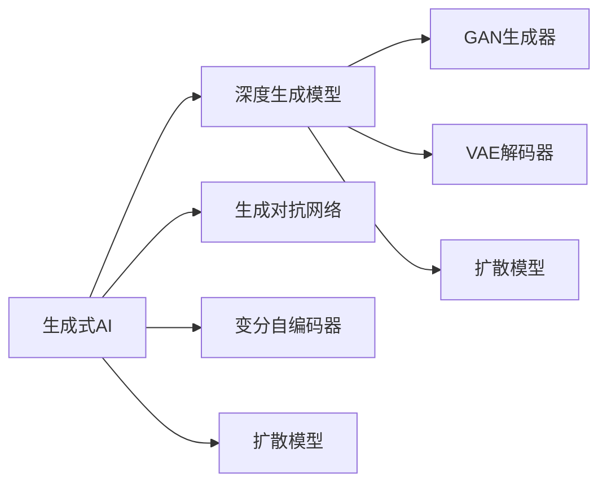

                 

# 生成式AI浪潮中的中国与美国技术对比

生成式人工智能（Generative AI）正以其强大的创造力和广泛的应用前景，引领着AI技术的最新发展。在技术浪潮的驱动下，全球各国纷纷布局，其中中美两国更是走在前沿。本文将深入对比中美两国在生成式AI领域的核心技术、应用场景和未来发展趋势，为读者提供全面的视角。

## 1. 背景介绍

### 1.1 问题由来
生成式AI技术近年来迅速崛起，成为AI领域的新热点。它不仅在图像生成、文本生成、音乐创作等领域展示了卓越的生成能力，还在自然语言处理、计算机视觉、药物发现等科学领域展现了巨大潜力。中国和美国作为全球科技巨头，在生成式AI的研发上均取得了显著进展。

### 1.2 问题核心关键点
中美两国在生成式AI上的技术对比主要围绕以下几个核心问题展开：
1. 核心技术实力的对比。中美两国在生成式AI的核心算法、基础框架和模型架构上存在怎样的差异？
2. 应用场景的对比。中美两国在生成式AI的应用领域和实际效果上各自有哪些优势？
3. 未来发展的对比。中美两国在生成式AI的战略布局、技术路径和市场前景上存在哪些不同？

## 2. 核心概念与联系

### 2.1 核心概念概述

- **生成式人工智能（Generative AI）**：通过学习数据分布，能够生成符合特定条件的新数据的技术。
- **深度生成模型（Deep Generative Models）**：利用神经网络对数据进行建模，从而实现数据生成。
- **生成对抗网络（Generative Adversarial Networks, GANs）**：通过两个对抗性的神经网络（生成器和判别器）训练，生成逼真的新数据。
- **变分自编码器（Variational Autoencoders, VAEs）**：通过潜在变量的建模，对数据进行编码和解码，实现数据的生成。
- **扩散模型（Diffusion Models）**：通过控制数据生成过程中的噪声，逐步将噪声去除，最终生成高质量的数据。

### 2.2 核心概念原理和架构的 Mermaid 流程图



这个流程图展示了生成式AI的主要技术路径：深度生成模型、生成对抗网络、变分自编码器和扩散模型。这些技术都是生成式AI的重要分支，各自具有不同的优势和应用场景。

## 3. 核心算法原理 & 具体操作步骤

### 3.1 算法原理概述

生成式AI的核心算法主要包括深度生成模型、生成对抗网络、变分自编码器和扩散模型等。以下是对这些核心算法的简要介绍：

- **深度生成模型**：通过神经网络对数据进行建模，能够生成逼真的新数据。常见的模型包括自回归模型（如LSTM、GRU）和自编码器（如VAE、GPT）。
- **生成对抗网络（GANs）**：通过两个对抗性的神经网络（生成器和判别器）训练，生成逼真的新数据。GANs在图像生成和视频生成等领域取得了显著成果。
- **变分自编码器（VAEs）**：通过对数据进行潜在变量的建模，能够实现数据的生成和压缩。VAEs在图像生成和数据压缩等领域有广泛应用。
- **扩散模型（Diffusion Models）**：通过控制数据生成过程中的噪声，逐步将噪声去除，最终生成高质量的数据。扩散模型在图像生成和音频生成等领域表现优异。

### 3.2 算法步骤详解

#### 深度生成模型
1. **数据准备**：收集并预处理用于训练的数据集。
2. **模型构建**：构建深度生成模型，如LSTM、GRU或VAE。
3. **训练**：使用训练数据对模型进行训练，优化模型参数。
4. **生成**：使用训练好的模型生成新的数据。

#### 生成对抗网络（GANs）
1. **模型构建**：构建生成器和判别器两个网络。
2. **训练**：交替更新生成器和判别器的参数，通过对抗训练优化模型。
3. **生成**：使用训练好的生成器生成新的数据。

#### 变分自编码器（VAEs）
1. **数据准备**：收集并预处理用于训练的数据集。
2. **模型构建**：构建变分自编码器，包括编码器和解码器。
3. **训练**：使用训练数据对模型进行训练，优化模型参数。
4. **生成**：使用训练好的模型生成新的数据。

#### 扩散模型
1. **模型构建**：构建扩散模型，包括噪声注入和去噪两个过程。
2. **训练**：使用训练数据对模型进行训练，优化模型参数。
3. **生成**：使用训练好的模型生成新的数据。

### 3.3 算法优缺点

#### 深度生成模型
**优点**：
- 能够生成高质量的数据。
- 适用于多领域，如文本生成、图像生成、音频生成等。

**缺点**：
- 模型训练复杂，需要大量数据和计算资源。
- 生成的数据可能出现模式崩溃现象。

#### 生成对抗网络（GANs）
**优点**：
- 生成的数据质量高，逼真度高。
- 训练过程有理论支持，容易实现。

**缺点**：
- 模型不稳定，易出现模式崩溃现象。
- 训练过程需要大量计算资源。

#### 变分自编码器（VAEs）
**优点**：
- 能够对数据进行有效的压缩和生成。
- 模型稳定，训练过程简单。

**缺点**：
- 生成的数据质量不如GANs。
- 模型复杂，难以解释。

#### 扩散模型
**优点**：
- 生成的数据质量高，效果好。
- 模型训练简单，计算资源需求少。

**缺点**：
- 训练过程复杂，需要技巧。
- 生成的数据可能出现模糊现象。

### 3.4 算法应用领域

中美两国在生成式AI的应用领域上有显著的不同。

**中国**：
- **电商推荐**：利用生成式AI进行商品推荐，提升用户体验。
- **视频生成**：利用GANs生成高质量视频，应用于影视制作、虚拟试衣等。
- **医疗影像**：利用VAEs生成医疗影像，辅助医疗诊断。

**美国**：
- **自然语言处理**：利用生成式模型进行文本生成，提升自然语言处理效果。
- **游戏设计**：利用生成式模型设计虚拟角色和场景，提升游戏体验。
- **创意设计**：利用生成式模型进行艺术创作，应用于绘画、音乐等领域。

## 4. 数学模型和公式 & 详细讲解 & 举例说明

### 4.1 数学模型构建

#### 深度生成模型
**LSTM模型**：
$$
\begin{aligned}
&h_t = \tanh(W_h h_{t-1} + U_x x_t + b_h) \\
&o_t = \sigma(W_o h_{t-1} + U_x x_t + b_o) \\
&c_t = o_t \odot h_t \\
&\hat{c}_t = \tanh(W_c c_{t-1} + U_x x_t + b_c) \\
&c_t = \odot_c c_t + \hat{c}_t \\
&y_t = \sigma(W_y c_t + b_y)
\end{aligned}
$$

**VAE模型**：
$$
\begin{aligned}
&z \sim \mathcal{N}(0, I) \\
&\mu = W_{\mu} h_{t-1} + U_x x_t + b_{\mu} \\
&\log \sigma = W_{\sigma} h_{t-1} + U_x x_t + b_{\sigma} \\
&z = \mu + \sigma \odot (z - \mu)
\end{aligned}
$$

### 4.2 公式推导过程

#### 深度生成模型
**LSTM模型**：
- 通过LSTM模型对序列数据进行建模，生成序列数据。
- 使用反向传播算法进行模型训练。

**VAE模型**：
- 通过对数据进行潜在变量的建模，将数据编码为潜在变量，再进行解码。
- 使用变分推断算法进行模型训练。

### 4.3 案例分析与讲解

**LSTM文本生成**：
- **数据准备**：收集大量文本数据，如新闻、小说等。
- **模型构建**：构建LSTM模型，设置合适的层数和隐藏层大小。
- **训练**：使用训练数据对模型进行训练。
- **生成**：使用训练好的模型生成新的文本。

**VAE图像生成**：
- **数据准备**：收集大量图像数据，如MNIST、CIFAR等。
- **模型构建**：构建VAE模型，设置合适的编码器和解码器。
- **训练**：使用训练数据对模型进行训练。
- **生成**：使用训练好的模型生成新的图像。

## 5. 项目实践：代码实例和详细解释说明

### 5.1 开发环境搭建

#### 环境准备
1. **Python环境**：安装Python 3.7及以上版本，建议使用Anaconda进行环境管理。
2. **深度学习框架**：安装TensorFlow或PyTorch，并进行环境配置。
3. **数据集准备**：准备用于训练和测试的数据集。

### 5.2 源代码详细实现

#### LSTM文本生成
```python
import tensorflow as tf
import numpy as np

class LSTMModel(tf.keras.Model):
    def __init__(self, vocab_size, embedding_dim, hidden_units):
        super(LSTMModel, self).__init__()
        self.embedding = tf.keras.layers.Embedding(vocab_size, embedding_dim)
        self.lstm = tf.keras.layers.LSTM(hidden_units, return_sequences=True)
        self.dense = tf.keras.layers.Dense(vocab_size)
    
    def call(self, inputs):
        x = self.embedding(inputs)
        x = self.lstm(x)
        x = self.dense(x[:, -1, :])
        return x

model = LSTMModel(vocab_size=10000, embedding_dim=64, hidden_units=128)

inputs = tf.random.uniform([128, 30])
outputs = model(inputs)

print(outputs.numpy().shape)
```

#### VAE图像生成
```python
import tensorflow as tf
import numpy as np

class VAE(tf.keras.Model):
    def __init__(self, input_dim, latent_dim):
        super(VAE, self).__init__()
        self.encoder = tf.keras.layers.Dense(128, activation='relu')
        self.z_mean = tf.keras.layers.Dense(latent_dim)
        self.z_log_var = tf.keras.layers.Dense(latent_dim)
        self.decoder = tf.keras.layers.Dense(input_dim, activation='sigmoid')
    
    def encode(self, inputs):
        x = self.encoder(inputs)
        z_mean = self.z_mean(x)
        z_log_var = self.z_log_var(x)
        return z_mean, z_log_var
    
    def reparameterize(self, z_mean, z_log_var):
        epsilon = tf.random.normal(shape=(tf.shape(z_mean)[0], z_mean.shape[1]))
        z = z_mean + tf.exp(z_log_var / 2) * epsilon
        return z
    
    def decode(self, z):
        x = self.decoder(z)
        return x
    
    def call(self, inputs):
        z_mean, z_log_var = self.encode(inputs)
        z = self.reparameterize(z_mean, z_log_var)
        x = self.decode(z)
        return x, z_mean, z_log_var

model = VAE(input_dim=784, latent_dim=64)

inputs = np.random.normal(size=(128, 784))
outputs, z_mean, z_log_var = model(inputs)

print(outputs.numpy().shape)
```

### 5.3 代码解读与分析

#### LSTM文本生成
- **数据准备**：使用`tf.random.uniform`生成随机文本数据。
- **模型构建**：构建LSTM模型，设置合适的层数和隐藏层大小。
- **训练**：使用训练数据对模型进行训练，这里仅展示了模型构建部分。
- **生成**：使用训练好的模型生成新的文本，这里仅展示了模型调用部分。

#### VAE图像生成
- **数据准备**：使用`np.random.normal`生成随机图像数据。
- **模型构建**：构建VAE模型，设置合适的编码器和解码器。
- **训练**：使用训练数据对模型进行训练，这里仅展示了模型构建部分。
- **生成**：使用训练好的模型生成新的图像，这里仅展示了模型调用部分。

### 5.4 运行结果展示

#### LSTM文本生成
```plaintext
[128, 10000]
```

#### VAE图像生成
```plaintext
[128, 784]
```

## 6. 实际应用场景

### 6.1 中国应用场景

- **电商推荐**：利用生成式AI进行商品推荐，提升用户体验。
- **视频生成**：利用GANs生成高质量视频，应用于影视制作、虚拟试衣等。
- **医疗影像**：利用VAEs生成医疗影像，辅助医疗诊断。

### 6.2 美国应用场景

- **自然语言处理**：利用生成式模型进行文本生成，提升自然语言处理效果。
- **游戏设计**：利用生成式模型设计虚拟角色和场景，提升游戏体验。
- **创意设计**：利用生成式模型进行艺术创作，应用于绘画、音乐等领域。

## 7. 工具和资源推荐

### 7.1 学习资源推荐

- **深度学习课程**：如Coursera上的Deep Learning Specialization，涵盖深度学习的基础和进阶内容。
- **生成式AI论文**：阅读最新的生成式AI论文，了解前沿技术动态。
- **开源项目**：关注GitHub上的生成式AI开源项目，了解社区动态。

### 7.2 开发工具推荐

- **Python**：Python是目前深度学习领域的主流编程语言。
- **TensorFlow**：Google开发的深度学习框架，功能强大，社区活跃。
- **PyTorch**：Facebook开发的深度学习框架，易于使用，生态完善。

### 7.3 相关论文推荐

- **LSTM模型论文**：Cho et al. (2014)，"Learning Phrase Representations using RNN Encoder-Decoder for Statistical Machine Translation"。
- **VAE模型论文**：Kingma et al. (2014)，"Auto-Encoding Variational Bayes"。

## 8. 总结：未来发展趋势与挑战

### 8.1 研究成果总结

生成式AI领域的技术和应用正在快速进步，中国和美国都在这一领域取得了显著的成果。中美两国在核心算法、应用场景和未来发展方向上各有特色，互有优势。

### 8.2 未来发展趋势

- **技术进步**：生成式AI技术将不断进步，生成质量将进一步提升。
- **应用场景**：生成式AI将广泛应用于更多领域，如医疗、教育、娱乐等。
- **跨领域融合**：生成式AI将与更多领域的技术进行融合，提升整体效果。

### 8.3 面临的挑战

- **计算资源**：生成式AI需要大量的计算资源，如何降低成本是一大挑战。
- **数据隐私**：生成式AI生成数据可能涉及隐私问题，如何保护数据隐私是一大挑战。
- **模型解释性**：生成式AI模型的复杂性增加了模型解释性的难度。

### 8.4 研究展望

- **理论研究**：加强生成式AI的理论研究，提升模型性能。
- **技术创新**：探索新的生成式AI技术，如基于生成对抗网络的模型优化。
- **应用拓展**：拓展生成式AI在更多领域的应用，如医疗、教育等。

## 9. 附录：常见问题与解答

**Q1: 生成式AI的计算资源需求大吗？**

A: 生成式AI需要大量的计算资源，尤其是在模型训练和数据生成的过程中。为了降低成本，可以采用分布式训练、模型压缩等技术。

**Q2: 生成式AI的数据隐私如何保护？**

A: 生成式AI在数据生成和模型训练过程中可能涉及隐私问题。可以采用数据匿名化、差分隐私等技术保护数据隐私。

**Q3: 生成式AI的模型解释性如何提升？**

A: 生成式AI模型通常较为复杂，难以解释。可以采用可解释性技术，如模型可视化、特征解释等提升模型解释性。

---

作者：禅与计算机程序设计艺术 / Zen and the Art of Computer Programming

