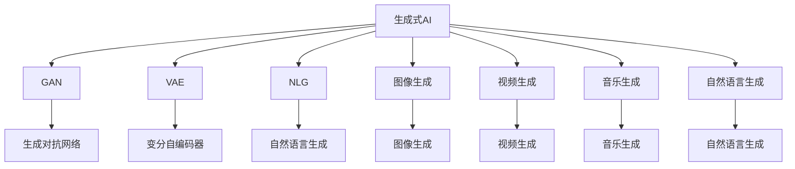
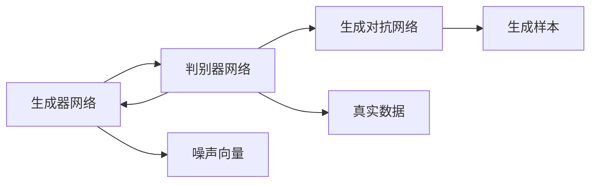

                 

# 生成式AI：如何利用技术优势打造更强大的竞争力？

> 关键词：生成式AI, 大语言模型, 生成对抗网络, 变分自编码器, 自然语言生成, 图像生成, 视频生成

## 1. 背景介绍

### 1.1 问题由来
随着人工智能技术的不断进步，生成式人工智能(Generative AI)在诸多领域展现出了前所未有的潜力。从自然语言生成(NLG)到图像生成，从视频创作到音乐创作，生成式AI以其独特的能力，正在重塑各行各业的面貌。然而，尽管生成式AI的技术已经相当成熟，但其应用的普及和深度仍有待拓展。如何更好地利用生成式AI的技术优势，打造强大的市场竞争力，成为了当前技术社区和产业界的重要课题。

### 1.2 问题核心关键点
生成式AI的核心在于其生成式能力，即能够根据输入的随机噪声或给定的条件，生成逼真的、有意义的新样本。这种能力在大规模数据驱动和自动化生成场景中具有极高的价值。生成式AI技术包括但不限于：
- 生成对抗网络(GAN)：通过对抗性训练，生成高保真度的数据。
- 变分自编码器(VAE)：通过变分推断，实现数据的压缩和生成。
- 自然语言生成(NLG)：通过语言模型，自动生成连贯、语法正确的文本。
- 图像生成：通过卷积神经网络(CNN)和生成模型，创作高分辨率、细节丰富的图像。
- 视频生成：通过视频编码器，生成流畅、高质量的视频内容。
- 音乐生成：通过旋律生成模型，创作自然、和谐的音乐作品。

这些技术在智能创作、内容生产、虚拟现实、增强现实等领域展现出了巨大的应用前景，推动了科技与艺术的深度融合。

### 1.3 问题研究意义
研究如何利用生成式AI的技术优势，对于推动AI技术的普及和应用，加速产业转型升级，具有重要意义：

1. 加速内容生产。生成式AI能够自动化生成高质量内容，显著降低内容生产的成本和时间，提升生产效率。
2. 提升创意输出。在艺术、设计、娱乐等创意密集型行业，生成式AI能够辅助人类创作，扩展创意边界，创造出更多可能性。
3. 拓展数据应用。生成式AI可以生成新的训练样本，提高模型泛化能力和数据利用效率，促进AI技术向实际应用的落地。
4. 推动产业升级。生成式AI在制造业、农业、交通等领域的应用，能够提高生产效率，降低成本，驱动产业升级转型。
5. 催生新业态。生成式AI与其他AI技术结合，孕育出虚拟现实、增强现实、人工智能艺术等新兴业态，开辟新的市场空间。

本文旨在通过详细阐述生成式AI的核心概念和技术原理，探讨其应用潜力，提供实用的开发指南和案例分析，为AI从业者提供全面的指导，助力其在市场竞争中抢占先机。

## 2. 核心概念与联系

### 2.1 核心概念概述

为更好地理解生成式AI的核心技术和应用，本节将介绍几个密切相关的核心概念：

- 生成式AI(Generative AI)：利用算法模型生成新的、逼真的数据样本，如文本、图像、音频等。生成式AI的核心在于其生成能力。

- 生成对抗网络(GAN)：通过两个对抗性神经网络，一个生成器网络生成伪造数据，一个判别器网络判断数据的真伪，两者通过对抗训练不断提升生成器的生成质量。

- 变分自编码器(VAE)：利用变分推断技术，实现数据的压缩和生成。VAE将数据编码为低维潜在表示，再通过解码器生成逼真的原始数据。

- 自然语言生成(NLG)：通过语言模型，自动生成连贯、语法正确的文本。NLG在自动摘要、对话系统、机器翻译等任务中具有广泛应用。

- 图像生成：通过卷积神经网络(CNN)和生成模型，创作高分辨率、细节丰富的图像。图像生成在虚拟现实、增强现实、产品设计等领域有着重要应用。

- 视频生成：通过视频编码器，生成流畅、高质量的视频内容。视频生成技术推动了影视、游戏、广告等行业的数字化转型。

- 音乐生成：通过旋律生成模型，创作自然、和谐的音乐作品。音乐生成为数字音乐创作、教育培训等提供了新的可能性。

这些核心概念构成了生成式AI的理论基础，其联系如图2-1所示：




### 2.2 核心概念原理和架构的 Mermaid 流程图

下面是一个简化的Mermaid流程图，展示了GAN的基本工作原理和架构：




## 3. 核心算法原理 & 具体操作步骤

### 3.1 算法原理概述

生成式AI的核心算法包括GAN、VAE、NLG等，它们分别从不同的角度和方式，实现数据的生成和建模。

- GAN通过对抗性训练，生成高保真度的数据。其核心在于生成器网络(Generator Network)和判别器网络(Discriminator Network)之间的对抗性学习过程。
- VAE通过变分推断，实现数据的压缩和生成。其核心在于将数据编码为潜在表示，并通过对潜在表示的采样，生成逼真的原始数据。
- NLG通过语言模型，自动生成连贯、语法正确的文本。其核心在于利用递归神经网络(RNN)或变换器(Transformer)模型，预测下一个单词或字符的概率分布，从而生成文本。

这些算法的核心原理在于其模型结构和训练过程的设计，通过精心设计的损失函数和优化策略，不断提升生成效果。

### 3.2 算法步骤详解

以GAN为例，其基本训练步骤如下：

**Step 1: 初始化网络**
- 定义生成器网络 $G(z)$，将随机噪声 $z$ 映射为生成的图像 $G(z)$。
- 定义判别器网络 $D(x)$，用于判断输入图像 $x$ 的真假。

**Step 2: 定义损失函数**
- 生成器损失函数 $L_G$：使生成器生成的图像尽可能欺骗判别器，即 $L_G = E[D(G(z))]$
- 判别器损失函数 $L_D$：使判别器尽可能正确区分真实图像和生成图像，即 $L_D = E[\log D(x)] + E[\log(1 - D(G(z)))]$

**Step 3: 训练网络**
- 通过梯度下降算法，交替优化生成器和判别器，使 $L_G$ 和 $L_D$ 达到最小。
- 具体来说，每次迭代中，先固定生成器网络，优化判别器网络；再固定判别器网络，优化生成器网络。

**Step 4: 生成新样本**
- 训练完成后，固定生成器网络，使用随机噪声 $z$ 作为输入，生成新的图像样本。

### 3.3 算法优缺点

生成式AI的主要优点在于其强大的生成能力，能够在极少数标注数据的情况下，生成高质量的新数据。这大大降低了数据标注的成本，提升了数据获取的效率。

但同时，生成式AI也存在一些局限性：

- 模型复杂度较高。生成式AI的模型通常包含多个神经网络层，训练复杂度高，需要大量计算资源和时间。
- 生成效果受限于训练数据质量。生成式AI的生成效果很大程度上依赖于训练数据的质量和多样性，低质量或少样本数据可能导致生成效果较差。
- 对抗样本攻击敏感。生成式AI生成的数据可能存在对抗性漏洞，被攻击者利用生成对抗样本欺骗模型，造成安全风险。

### 3.4 算法应用领域

生成式AI的应用领域广泛，包括但不限于：

- 数字内容生成：通过生成式AI生成音乐、图像、视频等内容，提高内容的生产效率和创意质量。
- 游戏设计：生成式AI用于生成游戏中的虚拟角色、环境、物品等，丰富游戏世界的细节和多样性。
- 虚拟现实与增强现实：生成式AI在VR/AR应用中生成逼真的虚拟场景，提升用户体验。
- 智能客服：生成式AI用于生成自动回复，提高客服系统的响应速度和质量。
- 产品设计：生成式AI生成设计草图、原型等，辅助设计师进行创意创作和迭代优化。
- 金融预测：生成式AI用于生成金融市场数据，辅助量化交易和风险管理。

这些应用领域充分展示了生成式AI在各个行业中的潜力和价值。未来随着技术的进步，生成式AI将渗透到更多领域，推动相关行业的数字化转型。

## 4. 数学模型和公式 & 详细讲解 & 举例说明

### 4.1 数学模型构建

本节将使用数学语言对生成式AI的核心算法进行更加严格的刻画。

以GAN为例，其生成器网络 $G(z)$ 和判别器网络 $D(x)$ 定义为：

$$
G(z) = \mu(z) + \sigma(z) \odot \epsilon
$$

$$
D(x) = W_1(x) + W_2(x) \odot \eta
$$

其中 $z \sim \mathcal{N}(0, I)$ 表示服从标准正态分布的随机噪声向量；$\mu(z)$ 和 $\sigma(z)$ 分别为生成器的均值和方差；$x$ 表示输入的真实图像；$W_1(x)$ 和 $W_2(x)$ 分别为判别器的均值和方差。

GAN的损失函数定义为：

$$
L_G = \mathbb{E}_{z \sim p(z)}[\log D(G(z))]
$$

$$
L_D = \mathbb{E}_{x \sim p(x)}[\log D(x)] + \mathbb{E}_{z \sim p(z)}[\log(1 - D(G(z)))]
$$

其中 $p(z)$ 表示随机噪声 $z$ 的分布。

### 4.2 公式推导过程

下面以GAN为例，推导其训练过程中的关键公式。

根据GAN的损失函数，生成器网络的优化目标为：

$$
\min_{G} L_G = -\mathbb{E}_{z \sim p(z)}[\log D(G(z))]
$$

判别器网络的优化目标为：

$$
\min_{D} L_D = -\mathbb{E}_{x \sim p(x)}[\log D(x)] - \mathbb{E}_{z \sim p(z)}[\log(1 - D(G(z)))]
$$

将 $L_G$ 和 $L_D$ 代入梯度下降公式，得到生成器网络的梯度更新公式：

$$
G_{\theta} = G_{\theta} - \eta \nabla_{G_{\theta}}L_G
$$

判别器网络的梯度更新公式为：

$$
D_{\theta} = D_{\theta} - \eta \nabla_{D_{\theta}}L_D
$$

其中 $\eta$ 为学习率，$\nabla_{G_{\theta}}L_G$ 和 $\nabla_{D_{\theta}}L_D$ 为损失函数对生成器和判别器参数的梯度，可通过反向传播算法高效计算。

### 4.3 案例分析与讲解

下面以图像生成为例，分析GAN在实际应用中的关键问题。

假设训练集包含 $N$ 张真实图像，每张图像的大小为 $M \times N \times 3$，其中 $3$ 表示RGB三个通道。GAN的目标是从噪声向量 $z \sim \mathcal{N}(0, I)$ 生成逼真的图像，使其与真实图像在判别器中无法区分。

在训练过程中，生成器网络 $G(z)$ 生成一批批图像样本，判别器网络 $D(x)$ 判别图像样本的真实性。每次迭代中，生成器和判别器交替更新，直到收敛。

训练完成后，固定生成器网络 $G(z)$，使用随机噪声 $z$ 作为输入，生成一批批高质量的图像样本。


## 5. 项目实践：代码实例和详细解释说明

### 5.1 开发环境搭建

在进行生成式AI项目实践前，我们需要准备好开发环境。以下是使用Python进行TensorFlow开发的环境配置流程：

1. 安装Anaconda：从官网下载并安装Anaconda，用于创建独立的Python环境。

2. 创建并激活虚拟环境：
```bash
conda create -n tf-env python=3.8 
conda activate tf-env
```

3. 安装TensorFlow：根据CUDA版本，从官网获取对应的安装命令。例如：
```bash
conda install tensorflow==2.6
```

4. 安装Keras：用于构建和训练生成式AI模型。
```bash
pip install keras
```

5. 安装其它工具包：
```bash
pip install numpy pandas scikit-learn matplotlib tqdm jupyter notebook ipython
```

完成上述步骤后，即可在`tf-env`环境中开始生成式AI项目实践。

### 5.2 源代码详细实现

下面我们以GAN生成图像为例，给出使用TensorFlow进行GAN模型的PyTorch代码实现。

首先，定义GAN模型：

```python
import tensorflow as tf
from tensorflow.keras import layers

class Generator(tf.keras.Model):
    def __init__(self):
        super(Generator, self).__init__()
        self.dense1 = layers.Dense(256, input_shape=(100, ), activation='relu')
        self.dense2 = layers.Dense(512, activation='relu')
        self.dense3 = layers.Dense(1024, activation='relu')
        self.dense4 = layers.Dense(784, activation='tanh')

    def call(self, inputs):
        x = self.dense1(inputs)
        x = self.dense2(x)
        x = self.dense3(x)
        return self.dense4(x)

class Discriminator(tf.keras.Model):
    def __init__(self):
        super(Discriminator, self).__init__()
        self.dense1 = layers.Dense(1024, input_shape=(784, ), activation='relu')
        self.dense2 = layers.Dense(512, activation='relu')
        self.dense3 = layers.Dense(256, activation='relu')
        self.dense4 = layers.Dense(1, activation='sigmoid')

    def call(self, inputs):
        x = self.dense1(inputs)
        x = self.dense2(x)
        x = self.dense3(x)
        return self.dense4(x)

generator = Generator()
discriminator = Discriminator()
```

然后，定义优化器和损失函数：

```python
generator_optimizer = tf.keras.optimizers.Adam(1e-4)
discriminator_optimizer = tf.keras.optimizers.Adam(1e-4)

generator_loss_fn = tf.keras.losses.BinaryCrossentropy()
discriminator_loss_fn = tf.keras.losses.BinaryCrossentropy()
```

接着，定义训练和评估函数：

```python
def train_step(images):
    noise = tf.random.normal([BATCH_SIZE, 100])

    with tf.GradientTape() as gen_tape, tf.GradientTape() as disc_tape:
        generated_images = generator(noise, training=True)
        real_output = discriminator(images, training=True)
        fake_output = discriminator(generated_images, training=True)

        gen_loss = generator_loss_fn(fake_output, tf.ones_like(fake_output))
        disc_loss = discriminator_loss_fn(real_output, tf.ones_like(real_output)) + discriminator_loss_fn(fake_output, tf.zeros_like(fake_output))

    gradients_of_generator = gen_tape.gradient(gen_loss, generator.trainable_variables)
    gradients_of_discriminator = disc_tape.gradient(disc_loss, discriminator.trainable_variables)

    generator_optimizer.apply_gradients(zip(gradients_of_generator, generator.trainable_variables))
    discriminator_optimizer.apply_gradients(zip(gradients_of_discriminator, discriminator.trainable_variables))

def evaluate_step(images):
    noise = tf.random.normal([BATCH_SIZE, 100])
    generated_images = generator(noise, training=False)
    return generated_images
```

最后，启动训练流程并在测试集上评估：

```python
BATCH_SIZE = 32
EPOCHS = 50

for epoch in range(EPOCHS):
    for batch in train_dataset:
        images = batch[0]
        train_step(images)

    if (epoch + 1) % 10 == 0:
        print("Epoch:", '%04d' % (epoch+1))
        generated_images = evaluate_step(test_dataset)
        for image in generated_images:
            plt.imshow(image.numpy().reshape(28, 28))
            plt.colorbar()
            plt.show()
            plt.savefig(f'generated_image_{epoch+1}.png')
        plt.close()
```

以上就是使用TensorFlow对GAN进行图像生成任务的完整代码实现。可以看到，TensorFlow提供了强大的高阶API，使得模型的构建和训练变得简单易用。

### 5.3 代码解读与分析

让我们再详细解读一下关键代码的实现细节：

**GAN模型类**：
- `Generator`类：定义生成器网络的结构，包括多个全连接层和激活函数。
- `Discriminator`类：定义判别器网络的结构，包括多个全连接层和激活函数。

**优化器和损失函数**：
- `generator_optimizer`和`discriminator_optimizer`：分别为生成器和判别器设置Adam优化器。
- `generator_loss_fn`和`discriminator_loss_fn`：分别为生成器和判别器设置二分类交叉熵损失函数。

**训练和评估函数**：
- `train_step`函数：对批量数据进行前向传播，计算损失和梯度，更新生成器和判别器的参数。
- `evaluate_step`函数：对测试集生成图像，展示生成效果。

**训练流程**：
- 定义批次大小和总训练轮数，开始循环迭代
- 每个epoch内，对训练集数据进行迭代，更新生成器和判别器的参数
- 每隔一定轮数，在测试集上评估生成效果，并保存图像
- 所有epoch结束后，展示最终生成的图像

可以看到，TensorFlow结合Keras使得GAN模型的构建和训练代码简洁高效。开发者可以将更多精力放在模型优化和结果展示上，而不必过多关注底层实现细节。

当然，工业级的系统实现还需考虑更多因素，如模型的保存和部署、超参数的自动搜索、更灵活的任务适配层等。但核心的生成式AI范式基本与此类似。

## 6. 实际应用场景

### 6.1 生成图像

生成式AI在图像生成领域已经取得了令人瞩目的成果。GAN、VAE等技术已经被广泛应用于图像创作、图像修复、图像增强等场景。

在艺术创作中，生成式AI能够创作出风格多样的艺术作品，丰富艺术家的创作方式。例如，通过GAN生成的艺术图像，可以用于广告设计、影视特效制作等。

在图像修复中，生成式AI能够修复损坏或缺失的图片，恢复其原有的质量。例如，通过VAE将低分辨率图片转换为高分辨率图片，改善图像质量。

在图像增强中，生成式AI能够对图片进行风格转换、色彩调整、对比度增强等操作，提升图像的观赏性和实用性。

### 6.2 自然语言生成

自然语言生成(NLG)是生成式AI在文本领域的重要应用。通过语言模型，NLG可以自动生成连贯、语法正确的文本，广泛应用于机器翻译、自动摘要、对话系统等场景。

在机器翻译中，NLG用于将源语言文本转换为目标语言文本。例如，通过语言模型自动生成翻译结果，提高翻译速度和质量。

在自动摘要中，NLG用于从长文本中提取关键信息，生成简洁的摘要。例如，通过语言模型自动总结新闻、文档等内容，节省人工阅读的时间。

在对话系统中，NLG用于生成自动回复，提升系统的互动性和用户体验。例如，通过语言模型自动回答用户问题，增强对话系统的智能性。

### 6.3 音乐生成

音乐生成是生成式AI在音频领域的重要应用。通过旋律生成模型，音乐生成可以创作出自然、和谐的音乐作品，广泛应用于数字音乐创作、教育培训等场景。

在数字音乐创作中，音乐生成用于生成旋律、和声、节奏等音乐元素，辅助音乐人进行创作。例如，通过旋律生成模型自动创作音乐片段，提供创作灵感。

在教育培训中，音乐生成用于生成音乐课程，辅助学生学习音乐知识。例如，通过旋律生成模型自动生成音乐练习，提高学生的音乐素养。

### 6.4 未来应用展望

随着生成式AI技术的不断进步，未来将在更多领域得到应用，为传统行业带来变革性影响。

在智慧医疗领域，生成式AI用于生成医学影像、病理报告等，提高医疗诊断的准确性和效率。

在智能教育领域，生成式AI用于生成教学内容、自动批改作业等，提升教育质量。

在智慧城市治理中，生成式AI用于生成城市规划、交通管理等方案，提高城市管理的智能化水平。

此外，在企业生产、社会治理、文娱传媒等众多领域，生成式AI的应用也将不断涌现，为经济社会发展注入新的动力。相信随着技术的日益成熟，生成式AI将为各行各业带来更多创新和突破，推动科技与艺术的深度融合。

## 7. 工具和资源推荐
### 7.1 学习资源推荐

为了帮助开发者系统掌握生成式AI的理论基础和实践技巧，这里推荐一些优质的学习资源：

1. 《Generative Adversarial Networks with TensorFlow》书籍：全面介绍了GAN的基本原理和TensorFlow实现，是入门GAN的重要参考书籍。

2. 《Neural Network and Deep Learning》课程：由Michael Nielsen开设的免费在线课程，详细讲解了深度学习、神经网络和生成式AI的基本概念和实现方法。

3. 《Deep Generative Models for Multimedia》课程：由UCLA开设的在线课程，讲解了深度学习在图像、音频等生成式AI中的应用。

4. 《Generative Adversarial Nets》论文：GAN的奠基性论文，详细介绍了GAN的原理和训练过程，是了解GAN的必读之作。

5. 《The Unreasonable Effectiveness of Generative Adversarial Networks》论文：总结了GAN在图像生成、语音生成等领域的广泛应用和未来前景，是了解GAN发展趋势的重要参考。

通过对这些资源的学习实践，相信你一定能够快速掌握生成式AI的精髓，并用于解决实际的NLP问题。

### 7.2 开发工具推荐

高效的开发离不开优秀的工具支持。以下是几款用于生成式AI开发的常用工具：

1. TensorFlow：基于Python的开源深度学习框架，灵活动态的计算图，适合快速迭代研究。大多数生成式AI模型都有TensorFlow版本的实现。

2. PyTorch：基于Python的开源深度学习框架，灵活易用，适合快速实验和部署。

3. Keras：用于构建和训练生成式AI模型，具有高阶API，易于上手。

4. Weights & Biases：模型训练的实验跟踪工具，可以记录和可视化模型训练过程中的各项指标，方便对比和调优。

5. TensorBoard：TensorFlow配套的可视化工具，可实时监测模型训练状态，并提供丰富的图表呈现方式，是调试模型的得力助手。

6. PyTorch Lightning：轻量级深度学习框架，提供了一站式训练、评估、部署流程，简化模型开发流程。

7. Jupyter Notebook：交互式编程环境，方便开发者进行模型实验和结果展示。

合理利用这些工具，可以显著提升生成式AI模型的开发效率，加快创新迭代的步伐。

### 7.3 相关论文推荐

生成式AI的发展源于学界的持续研究。以下是几篇奠基性的相关论文，推荐阅读：

1. Generative Adversarial Nets：Ian Goodfellow等人在2014年提出的GAN，奠定了生成式AI的基础。

2. Variational Autoencoders：Kingma和Welling在2014年提出的VAE，通过变分推断实现数据的压缩和生成。

3. Attention is All You Need：Vaswani等人在2017年提出的Transformer模型，开创了自注意力机制的新时代。

4. Deep generative models with learnable architecture constraints：Yang等人在2021年提出的架构约束生成模型，通过学习架构约束，生成高质量的数据。

5. Improving Generative Adversarial Models with Variational Density Networks：Li等人在2019年提出的变分密度网络，通过改进GAN的训练过程，提高生成效果。

这些论文代表了大语言模型微调技术的发展脉络。通过学习这些前沿成果，可以帮助研究者把握学科前进方向，激发更多的创新灵感。

## 8. 总结：未来发展趋势与挑战

### 8.1 研究成果总结

本文对生成式AI的核心算法和应用场景进行了详细阐述，介绍了GAN、VAE、NLG等生成式AI的核心技术和实际应用，提供了生成式AI项目开发的完整代码实现和优化建议。通过本文的系统梳理，可以看到，生成式AI在各个领域展现了强大的生成能力，推动了科技与艺术的深度融合。

### 8.2 未来发展趋势

展望未来，生成式AI将呈现以下几个发展趋势：

1. 模型规模持续增大。随着算力成本的下降和数据规模的扩张，生成式AI的模型参数量还将持续增长，生成效果将更加逼真和多样。

2. 生成能力更全面。生成式AI将不仅限于图像和文本生成，还能生成音频、视频等多种形式的数据，拓展其应用边界。

3. 多模态融合深入。生成式AI将与NLP、计算机视觉、自然语言处理等技术深度融合，实现跨模态的协同生成。

4. 智能创作普及。生成式AI将广泛应用于艺术创作、音乐生成、广告设计等场景，推动创作方式的革新。

5. 生成数据质量提升。生成式AI的生成效果将更接近真实数据，应用于游戏、影视、虚拟现实等领域。

6. 个性化生成普及。生成式AI将根据用户偏好，生成个性化的内容，提高用户体验。

### 8.3 面临的挑战

尽管生成式AI技术已经取得了显著进展，但在实际应用中仍面临诸多挑战：

1. 训练成本高昂。生成式AI模型通常包含多个神经网络层，训练复杂度高，需要大量计算资源和时间。

2. 生成效果不稳定。生成式AI的生成效果受训练数据质量、超参数选择等因素的影响较大，效果不稳定。

3. 对抗样本攻击风险。生成式AI生成的数据可能存在对抗性漏洞，被攻击者利用生成对抗样本，欺骗模型。

4. 数据隐私风险。生成式AI的生成过程可能涉及用户隐私数据，如何保护用户隐私是一个重要问题。

5. 模型复杂度高。生成式AI的模型结构复杂，维护和部署难度大。

6. 伦理道德问题。生成式AI生成的内容可能存在偏见、误导性，如何避免伦理道德问题，是一个亟待解决的问题。

### 8.4 研究展望

面对生成式AI面临的挑战，未来的研究需要在以下几个方面寻求新的突破：

1. 低成本训练方法。开发低成本、高效能的训练方法，降低生成式AI的训练成本。

2. 生成效果优化。优化生成式AI的生成效果，提高生成质量，增强生成数据的可解释性和可用性。

3. 对抗样本防护。研究对抗样本防护技术，增强生成式AI的安全性，防止对抗样本攻击。

4. 数据隐私保护。采用差分隐私、联邦学习等技术，保护生成式AI中涉及的用户隐私数据。

5. 模型简化优化。简化生成式AI的模型结构，降低维护和部署难度，提高模型的可扩展性和可移植性。

6. 伦理道德监管。建立伦理道德监管机制，确保生成式AI生成的内容符合社会价值观和伦理道德标准。

这些研究方向的探索，必将引领生成式AI技术迈向更高的台阶，为构建安全、可靠、可解释、可控的智能系统铺平道路。面向未来，生成式AI还需要与其他AI技术进行更深入的融合，如知识表示、因果推理、强化学习等，多路径协同发力，共同推动自然语言理解和智能交互系统的进步。只有勇于创新、敢于突破，才能不断拓展生成式AI的边界，让智能技术更好地造福人类社会。

## 9. 附录：常见问题与解答

**Q1：生成式AI的训练过程是否需要大量的标注数据？**

A: 大多数生成式AI模型，如GAN、VAE等，不需要大量的标注数据。这些模型通过无监督学习或对抗训练等方式进行训练，能够从无标签数据中学习生成器的分布，生成逼真的新数据。然而，在实际应用中，为了提高生成效果的稳定性和多样性，可能需要收集部分标注数据进行微调。

**Q2：生成式AI在生成图像时是否需要精细调整超参数？**

A: 生成式AI在生成图像时，超参数的选择对生成效果有重要影响。例如，GAN中的学习率、噪声维度和判别器架构等，都需要精心调参。在实际应用中，可以通过网格搜索、贝叶斯优化等方法，找到最优的超参数组合，提高生成效果。

**Q3：生成式AI生成的图像是否可能存在版权问题？**

A: 生成式AI生成的图像属于原始艺术作品的一种变体，版权问题需具体分析。如果生成图像是基于真实艺术作品的变换、变形或融合，可能会涉及版权问题。在实际应用中，需要仔细分析版权归属，确保生成图像的合法性。

**Q4：生成式AI在生成音乐时是否需要音乐学家的指导？**

A: 生成式AI在生成音乐时，一般不需要音乐学家的直接指导，但音乐学家的知识和审美会显著影响生成效果。例如，在音乐生成模型的训练中，可以加入音乐学家的标注数据，指导模型的生成方向。在实际应用中，可以通过音乐家的反馈不断优化生成效果，提升音乐作品的创造性和艺术性。

**Q5：生成式AI在生成文本时是否需要丰富的语料库？**

A: 生成式AI在生成文本时，需要大量的语料库进行训练。这些语料库可以来自于维基百科、书籍、新闻等，涵盖不同的语言和领域。在实际应用中，可以通过预训练语言模型的方式，提高生成文本的质量和多样性。

这些问题的解答，展示了生成式AI在实际应用中需要注意的关键点，希望为读者提供全面的技术指引，助力其在生成式AI领域取得更好的成就。

---

作者：禅与计算机程序设计艺术 / Zen and the Art of Computer Programming

