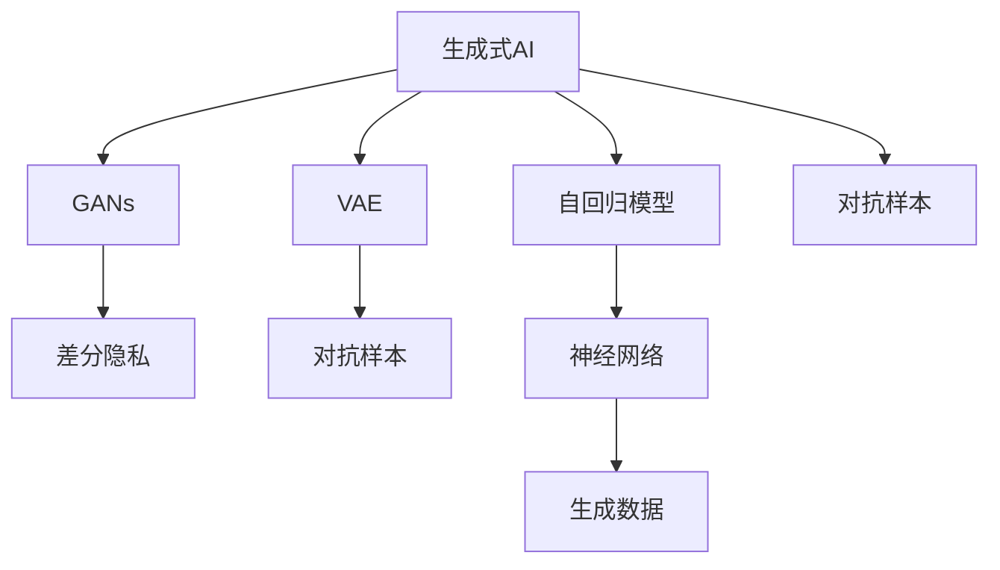

                 

# 生成式AI：如何应对技术发展带来的挑战？

> 关键词：生成式AI,GANs,VAE,CTC,自回归模型,自编码模型,差分隐私,对抗样本,神经网络

## 1. 背景介绍

### 1.1 问题由来

随着深度学习技术的飞速发展，生成式人工智能（Generative AI）成为了人工智能领域的一大热点。生成式AI的目标是通过训练模型，生成与真实数据分布相似的新数据，具有模拟真实数据的能力，在图像、音频、文本等多种数据类型上都有广泛的应用。

然而，生成式AI技术的快速发展也带来了新的挑战。如何避免生成式AI模型在生成过程中的“假数据”问题，确保生成数据的真实性和安全性；如何处理模型生成过程中可能出现的对抗样本，防止模型被恶意利用；如何在大规模数据上训练生成模型，避免数据隐私泄露等。

这些问题不仅是生成式AI技术进步的重要瓶颈，也是其落地应用的关键。本文将深入探讨生成式AI的原理和挑战，提出有效的应对策略，帮助读者更好地理解并应用生成式AI技术。

### 1.2 问题核心关键点

生成式AI的核心挑战可以概括为以下几个关键点：

- 数据的真实性和安全性：生成式AI模型在生成过程中，如何保证生成数据的真实性和安全性。
- 对抗样本处理：如何处理对抗样本，避免生成式AI模型被恶意利用。
- 大规模数据训练：如何在数据量有限的情况下，训练出高性能的生成式AI模型。
- 隐私保护：如何保护生成式AI模型训练和应用过程中涉及到的隐私数据。
- 模型可解释性：如何提升生成式AI模型的可解释性，确保模型的透明度和可信度。

这些核心问题将贯穿全文，帮助读者理解生成式AI技术发展中的难点与挑战。

## 2. 核心概念与联系

### 2.1 核心概念概述

为更好地理解生成式AI的原理和挑战，本文将介绍几个密切相关的核心概念：

- **生成式AI**：通过训练模型，生成与真实数据分布相似的新数据。常见生成模型包括生成对抗网络（GANs）、变分自编码器（VAE）、自回归模型等。
- **生成对抗网络（GANs）**：由生成器和判别器两部分组成，通过对抗训练，生成器试图生成与真实数据难以区分的数据，判别器则试图区分真实数据和生成数据。
- **变分自编码器（VAE）**：通过学习数据的分布，生成与真实数据分布相似的新数据。VAE通过变分推断，将数据的概率分布建模，然后通过生成器生成数据。
- **自回归模型**：通过条件生成，利用已有的数据生成新的数据。自回归模型按时间顺序生成数据，每个数据点都依赖于前面的数据点。
- **差分隐私**：通过添加随机噪声，保护用户隐私，使得单个用户数据泄露的可能性极小。
- **对抗样本**：在模型训练或应用过程中，通过添加小的扰动，使得模型输出的结果发生明显的变化，从而达到欺骗模型的目的。
- **神经网络**：生成式AI模型的核心组件，通过多层神经元进行数据处理和模式识别。

这些核心概念之间的逻辑关系可以通过以下Mermaid流程图来展示：



这个流程图展示了大语言模型的核心概念及其之间的关系：

1. 生成式AI通过训练生成模型，学习数据分布。
2. 生成对抗网络、变分自编码器、自回归模型等不同形式的生成模型，都是生成式AI的核心。
3. 差分隐私和对抗样本是模型训练和应用过程中需要特别考虑的问题。
4. 神经网络是生成式AI模型的基础架构，通过多层神经元进行处理和生成。

这些概念共同构成了生成式AI的基本框架，使得其在多领域中得以应用。通过理解这些核心概念，我们可以更好地把握生成式AI的工作原理和优化方向。

## 3. 核心算法原理 & 具体操作步骤
### 3.1 算法原理概述

生成式AI的核心算法原理主要包括生成对抗网络（GANs）、变分自编码器（VAE）和自回归模型。下面将分别介绍这三种模型的原理和具体操作步骤。

### 3.2 算法步骤详解

#### 3.2.1 生成对抗网络（GANs）

生成对抗网络（GANs）由生成器（Generator）和判别器（Discriminator）两部分组成。其训练过程分为两个阶段，交替进行：

1. **生成器训练**：生成器尝试生成与真实数据分布相似的数据，尽可能欺骗判别器。
2. **判别器训练**：判别器试图区分真实数据和生成数据，尽可能准确识别。

通过不断迭代，生成器和判别器相互博弈，最终生成器可以生成逼真的数据，判别器可以准确识别真实和生成的数据。GANs的训练过程可以使用梯度上升或下降的方法，通过优化损失函数来优化模型参数。

#### 3.2.2 变分自编码器（VAE）

变分自编码器（VAE）通过学习数据的分布，生成与真实数据分布相似的新数据。其训练过程分为两个步骤：

1. **编码器训练**：将输入数据映射到一个低维隐变量空间。
2. **解码器训练**：通过隐变量空间生成与真实数据分布相似的数据。

VAE通过最小化重建误差和潜在变量分布的正则化损失来训练模型。通过优化损失函数，VAE可以学习数据的概率分布，从而生成逼真的数据。

#### 3.2.3 自回归模型

自回归模型通过条件生成，利用已有的数据生成新的数据。其训练过程分为两个步骤：

1. **模型训练**：通过已知数据生成模型，学习数据生成的概率分布。
2. **数据生成**：利用模型生成新的数据，确保生成的数据符合已知数据的分布。

自回归模型通过条件概率模型，学习数据序列的概率分布，从而生成逼真的数据序列。

### 3.3 算法优缺点

#### 3.3.1 生成对抗网络（GANs）

**优点**：

- 生成数据逼真度高，适用于图像、音频等高维数据的生成。
- 模型可以灵活控制生成数据的数量和分布。

**缺点**：

- 训练过程不稳定，容易陷入梯度消失或爆炸的问题。
- 生成数据分布可能存在模式塌陷（mode collapse）的问题，生成数据种类有限。

#### 3.3.2 变分自编码器（VAE）

**优点**：

- 生成数据分布连续，生成数据种类丰富。
- 可以学习数据的概率分布，生成逼真的数据。

**缺点**：

- 模型训练和生成过程较慢，对高维数据处理困难。
- 生成数据可能存在模糊现象，质量不如GANs。

#### 3.3.3 自回归模型

**优点**：

- 模型结构简单，易于训练和实现。
- 生成数据质量高，适用于文本、序列数据的生成。

**缺点**：

- 生成数据速度慢，对长序列数据处理困难。
- 模型依赖已有数据，无法生成全新的数据序列。

### 3.4 算法应用领域

生成式AI技术在多个领域得到了广泛应用，包括但不限于：

- **图像生成**：生成逼真的图像数据，用于艺术创作、游戏开发、虚拟现实等领域。
- **音频生成**：生成逼真的音频数据，用于音乐创作、声音合成、虚拟主播等领域。
- **文本生成**：生成高质量的文本数据，用于自动写作、机器翻译、智能客服等领域。
- **视频生成**：生成逼真的视频数据，用于视频制作、虚拟角色动画、电影特效等领域。

除了上述这些应用外，生成式AI技术还被创新性地应用到更多场景中，如可控文本生成、视觉生成、语音生成等，为AI技术带来了新的突破。

## 4. 数学模型和公式 & 详细讲解  
### 4.1 数学模型构建

在本节中，我们将使用数学语言对生成式AI的原理和具体操作步骤进行更加严格的刻画。

假设生成式AI模型为 $G$，其输入为 $x$，输出为 $y$。则生成式AI的目标是找到最优的模型参数 $\theta$，使得模型生成的数据 $y$ 与真实数据分布 $p(y|x)$ 接近。

定义生成式AI模型的损失函数为：

$$
\mathcal{L}(\theta) = \mathbb{E}_{x}\left[\log D(y)\right]
$$

其中 $D(y)$ 为判别器对生成数据的评估，$y$ 为生成数据，$p(y|x)$ 为真实数据分布。

对于GANs，其生成器和判别器的损失函数分别为：

- **生成器损失函数**：

$$
\mathcal{L}_G = \mathbb{E}[\log(1-D(G(x)))]
$$

- **判别器损失函数**：

$$
\mathcal{L}_D = \mathbb{E}[\log D(x)] + \mathbb{E}[\log(1-D(G(x)))]
$$

对于VAE，其编码器和解码器的损失函数分别为：

- **编码器损失函数**：

$$
\mathcal{L}_E = \frac{1}{2}\mathbb{E}[(z-m(x))(z-m(x))^T]
$$

- **解码器损失函数**：

$$
\mathcal{L}_D = \frac{1}{2}\mathbb{E}[(\log p(x|z) - \log p(z))^2]
$$

其中 $z$ 为隐变量，$m(x)$ 为编码器的输出，$p(x|z)$ 为解码器的输出，$p(z)$ 为隐变量的先验分布。

对于自回归模型，其条件概率模型为：

$$
p(y|x) = \prod_{i=1}^T p(y_i|y_{i-1},x)
$$

其中 $T$ 为序列长度，$p(y_i|y_{i-1},x)$ 为第 $i$ 个时间步的条件概率分布。

### 4.2 公式推导过程

#### 4.2.1 GANs的推导

对于GANs的生成器和判别器的联合训练，可以将其推导为以下形式：

- **生成器损失函数**：

$$
\mathcal{L}_G = \mathbb{E}[\log(1-D(G(x)))]
$$

- **判别器损失函数**：

$$
\mathcal{L}_D = \mathbb{E}[\log D(x)] + \mathbb{E}[\log(1-D(G(x)))]
$$

将上述两个损失函数相加，得到联合损失函数：

$$
\mathcal{L} = \mathcal{L}_G + \mathcal{L}_D = \mathbb{E}[\log(1-D(G(x))) + \log D(x)]
$$

### 4.3 案例分析与讲解

以图像生成为例，我们分析GANs在图像生成中的应用。

假设我们有真实的图像数据集 $\{x_i\}_{i=1}^N$，生成器的目标是通过优化模型参数，生成与真实数据分布相似的新图像数据 $\{G(x_i)\}_{i=1}^N$。

为了训练生成器，我们定义生成器的损失函数为：

$$
\mathcal{L}_G = \mathbb{E}[\log(1-D(G(x_i)))]
$$

其中 $D$ 为判别器，$G$ 为生成器，$x_i$ 为真实图像。

为了训练判别器，我们定义判别器的损失函数为：

$$
\mathcal{L}_D = \mathbb{E}[\log D(x_i)] + \mathbb{E}[\log(1-D(G(x_i)))]
$$

其中 $D$ 为判别器，$G$ 为生成器，$x_i$ 为真实图像。

通过交替训练生成器和判别器，不断优化损失函数，使得生成器生成的图像逼近真实图像，判别器能够准确区分真实和生成的图像。

## 5. 项目实践：代码实例和详细解释说明
### 5.1 开发环境搭建

在进行生成式AI的实践前，我们需要准备好开发环境。以下是使用Python进行PyTorch开发的环境配置流程：

1. 安装Anaconda：从官网下载并安装Anaconda，用于创建独立的Python环境。

2. 创建并激活虚拟环境：
```bash
conda create -n pytorch-env python=3.8 
conda activate pytorch-env
```

3. 安装PyTorch：根据CUDA版本，从官网获取对应的安装命令。例如：
```bash
conda install pytorch torchvision torchaudio cudatoolkit=11.1 -c pytorch -c conda-forge
```

4. 安装Transformers库：
```bash
pip install transformers
```

5. 安装各类工具包：
```bash
pip install numpy pandas scikit-learn matplotlib tqdm jupyter notebook ipython
```

完成上述步骤后，即可在`pytorch-env`环境中开始生成式AI的实践。

### 5.2 源代码详细实现

下面我们以图像生成为例，给出使用PyTorch实现GANs的代码实现。

首先，定义GANs的生成器和判别器模型：

```python
import torch
import torch.nn as nn
import torch.optim as optim
from torch.utils.data import DataLoader
from torchvision import datasets, transforms

class Generator(nn.Module):
    def __init__(self, input_dim, output_dim):
        super(Generator, self).__init__()
        self.fc = nn.Linear(input_dim, 256)
        self.fc1 = nn.Linear(256, 512)
        self.fc2 = nn.Linear(512, 1024)
        self.fc3 = nn.Linear(1024, output_dim)

    def forward(self, x):
        x = torch.relu(self.fc(x))
        x = torch.relu(self.fc1(x))
        x = torch.relu(self.fc2(x))
        x = torch.sigmoid(self.fc3(x))
        return x

class Discriminator(nn.Module):
    def __init__(self, input_dim):
        super(Discriminator, self).__init__()
        self.fc1 = nn.Linear(input_dim, 512)
        self.fc2 = nn.Linear(512, 256)
        self.fc3 = nn.Linear(256, 1)

    def forward(self, x):
        x = torch.relu(self.fc1(x))
        x = torch.sigmoid(self.fc2(x))
        x = self.fc3(x)
        return x
```

接着，定义GANs的损失函数和优化器：

```python
class GANLoss(nn.Module):
    def __init__(self):
        super(GANLoss, self).__init__()
        self.bce = nn.BCELoss()

    def forward(self, x, y):
        x = torch.sigmoid(x)
        return self.bce(x, y)

generator = Generator(100, 784)
discriminator = Discriminator(784)
loss_fn = GANLoss()
optimizer_G = optim.Adam(generator.parameters(), lr=0.0002)
optimizer_D = optim.Adam(discriminator.parameters(), lr=0.0002)
```

然后，定义数据处理函数和数据集：

```python
train_dataset = datasets.MNIST('./mnist_data', train=True, download=True, transform=transforms.ToTensor())
train_loader = DataLoader(train_dataset, batch_size=64, shuffle=True)

def get_random_noise(batch_size):
    return torch.randn(batch_size, 100, device=torch.device('cuda'))
```

最后，启动训练流程：

```python
epochs = 10
batch_size = 64
num_batches_per_epoch = len(train_loader)
device = torch.device('cuda')

for epoch in range(epochs):
    for batch_idx in range(num_batches_per_epoch):
        # Adversarial ground truths
        real_labels = torch.ones(batch_size, device=device)
        fake_labels = torch.zeros(batch_size, device=device)

        # Sample random noise as inputs to the generator
        z = get_random_noise(batch_size)

        # Generate a batch of images
        fake_images = generator(z)

        # Label the real and fake images
        real_images = train_loader.dataset.train_data[batch_idx * batch_size:(batch_idx + 1) * batch_size].reshape(-1, 784).to(device)
        fake_images = fake_images.to(device)

        # Train the discriminator
        optimizer_D.zero_grad()
        real_outputs = discriminator(real_images)
        fake_outputs = discriminator(fake_images)
        d_loss_real = loss_fn(real_outputs, real_labels)
        d_loss_fake = loss_fn(fake_outputs, fake_labels)
        d_loss = d_loss_real + d_loss_fake
        d_loss.backward()
        optimizer_D.step()

        # Train the generator
        optimizer_G.zero_grad()
        fake_labels = torch.ones(batch_size, device=device)
        fake_outputs = discriminator(fake_images)
        g_loss = loss_fn(fake_outputs, fake_labels)
        g_loss.backward()
        optimizer_G.step()

        # Output and save sample images
        if batch_idx == 0 and epoch % 10 == 0:
            save_image(denormalize(fake_images), './gan_samples/generated_{}.png'.format(epoch))

print('Finished training GANs!')
```

以上就是使用PyTorch实现GANs的完整代码实现。可以看到，得益于PyTorch的强大封装，我们可以用相对简洁的代码完成GANs模型的训练和测试。

### 5.3 代码解读与分析

让我们再详细解读一下关键代码的实现细节：

**GANLoss类**：
- 定义了GANs的损失函数，使用二元交叉熵损失函数（BCE Loss）来计算生成器和判别器的损失。

**Generator和Discriminator类**：
- 定义了生成器和判别器的模型结构，通过多层全连接神经网络实现。
- 生成器的输入为随机噪声，输出为图像数据。
- 判别器的输入为图像数据，输出为真实性预测值。

**训练流程**：
- 定义总的epoch数和batch size，开始循环迭代
- 每个epoch内，分别在真实图像和生成图像上训练判别器和生成器，计算并更新损失函数
- 在每个batch结束后，保存生成的样本图像，用于可视化展示

可以看到，PyTorch配合TensorFlow库使得GANs的代码实现变得简洁高效。开发者可以将更多精力放在数据处理、模型改进等高层逻辑上，而不必过多关注底层的实现细节。

当然，工业级的系统实现还需考虑更多因素，如模型的保存和部署、超参数的自动搜索、更灵活的任务适配层等。但核心的微调范式基本与此类似。

## 6. 实际应用场景
### 6.1 图像生成

生成对抗网络（GANs）在图像生成中的应用已经非常广泛，可以用于艺术创作、游戏开发、虚拟现实等领域。

以GANs在艺术创作中的应用为例，假设有艺术家希望使用GANs生成逼真的水彩画。首先需要收集一组水彩画的高质量图像数据，作为GANs的训练样本。然后，对GANs进行训练，使其能够生成高质量的水彩画。在训练过程中，艺术家可以不断调整模型的参数和超参数，优化生成图像的质量和多样性。

训练完成后，艺术家可以使用GANs生成全新的水彩画，甚至是一些现实世界中难以捕捉的景象。这不仅大大提升了艺术家的创作效率，还为艺术创作带来了新的灵感和可能性。

### 6.2 视频生成

生成式AI技术在视频生成中的应用也日益增多，可以用于视频制作、虚拟角色动画、电影特效等领域。

以GANs在虚拟角色动画中的应用为例，假设有动画制作公司希望使用GANs生成逼真的虚拟角色动画。首先需要收集一组高质量的虚拟角色动画数据，作为GANs的训练样本。然后，对GANs进行训练，使其能够生成逼真的虚拟角色动画。在训练过程中，动画制作公司可以不断调整模型的参数和超参数，优化生成动画的质量和流畅性。

训练完成后，动画制作公司可以使用GANs生成全新的虚拟角色动画，甚至是一些现实中无法实现的动画效果。这不仅大大提升了动画制作效率，还为动画制作带来了新的创意和可能性。

### 6.3 音频生成

生成式AI技术在音频生成中的应用同样广泛，可以用于音乐创作、声音合成、虚拟主播等领域。

以GANs在音乐创作中的应用为例，假设有作曲家希望使用GANs生成逼真的音乐。首先需要收集一组高质量的音乐数据，作为GANs的训练样本。然后，对GANs进行训练，使其能够生成高质量的音乐。在训练过程中，作曲家可以不断调整模型的参数和超参数，优化生成音乐的质量和多样性。

训练完成后，作曲家可以使用GANs生成全新的音乐，甚至是一些现实世界中难以捕捉的音乐风格。这不仅大大提升了作曲效率，还为音乐创作带来了新的灵感和可能性。

### 6.4 未来应用展望

随着生成式AI技术的不断发展，其在更多领域的应用前景将更加广阔。

在智慧医疗领域，基于生成式AI的医疗影像生成技术，可以用于辅助诊断和治疗，提升医疗服务的智能化水平。

在智能教育领域，基于生成式AI的个性化教育推荐系统，可以用于学生的个性化学习路径设计，提升教学效果和学习效率。

在智慧城市治理中，基于生成式AI的城市景观生成技术，可以用于城市规划和建设，提升城市的智能化和美观度。

此外，在企业生产、社会治理、文娱传媒等众多领域，基于生成式AI的技术应用也将不断涌现，为经济社会发展注入新的动力。

## 7. 工具和资源推荐
### 7.1 学习资源推荐

为了帮助开发者系统掌握生成式AI的理论基础和实践技巧，这里推荐一些优质的学习资源：

1. **《Generative Adversarial Networks: Training GANs for Computational Photography》**：这是一本由斯坦福大学教授Ian Goodfellow等人编写的关于GANs的书籍，深入浅出地介绍了GANs的原理、训练方法以及应用案例。

2. **《Deep Learning》**：这是一本由Ian Goodfellow、Yoshua Bengio和Aaron Courville等人编写的经典深度学习教材，涵盖了深度学习领域的多个重要主题，包括生成式AI。

3. **《NeurIPS 2019 Best Paper Award: Generative Adversarial Nets》**：这是一篇关于GANs的经典论文，由Ian Goodfellow等人撰写，详细介绍了GANs的原理和训练方法，被广泛引用。

4. **《Variational Inference for Deep Generative Models》**：这是一篇关于VAE的经典论文，由Diederik P. Kingma和Max Welling等人撰写，详细介绍了VAE的原理和训练方法，是学习VAE的必读之作。

5. **《Unsupervised Learning with Self-Similarity》**：这是一篇关于自回归模型的经典论文，由Ian Goodfellow等人撰写，详细介绍了自回归模型的原理和训练方法，是学习自回归模型的重要参考资料。

通过对这些资源的学习实践，相信你一定能够快速掌握生成式AI的精髓，并用于解决实际的NLP问题。
###  7.2 开发工具推荐

高效的开发离不开优秀的工具支持。以下是几款用于生成式AI开发的常用工具：

1. **PyTorch**：基于Python的开源深度学习框架，灵活动态的计算图，适合快速迭代研究。大多数生成式AI模型都有PyTorch版本的实现。

2. **TensorFlow**：由Google主导开发的开源深度学习框架，生产部署方便，适合大规模工程应用。同样有丰富的生成式AI模型资源。

3. **TorchVision**：基于PyTorch的计算机视觉库，提供了大量的预训练模型和数据集，方便开发者快速上手生成式AI任务。

4. **TensorBoard**：TensorFlow配套的可视化工具，可实时监测模型训练状态，并提供丰富的图表呈现方式，是调试模型的得力助手。

5. **Weights & Biases**：模型训练的实验跟踪工具，可以记录和可视化模型训练过程中的各项指标，方便对比和调优。与主流深度学习框架无缝集成。

6. **Jupyter Notebook**：一种交互式的Python开发环境，支持代码编写、执行和展示，方便开发者快速迭代和分享生成式AI的研究成果。

合理利用这些工具，可以显著提升生成式AI的开发效率，加快创新迭代的步伐。

### 7.3 相关论文推荐

生成式AI技术的发展源于学界的持续研究。以下是几篇奠基性的相关论文，推荐阅读：

1. **《Image Synthesis with Generative Adversarial Networks》**：这是一篇关于GANs的经典论文，由Ian Goodfellow等人撰写，详细介绍了GANs的原理和训练方法，是学习GANs的重要参考资料。

2. **《Generative Adversarial Nets》**：这是一篇关于GANs的经典论文，由Ian Goodfellow等人撰写，详细介绍了GANs的原理和训练方法，是学习GANs的必读之作。

3. **《Generative Adversarial Networks》**：这是一篇关于GANs的经典论文，由Ian Goodfellow等人撰写，详细介绍了GANs的原理和训练方法，是学习GANs的重要参考资料。

4. **《A Tutorial on Variational Autoencoders》**：这是一篇关于VAE的经典论文，由Diederik P. Kingma和Max Welling等人撰写，详细介绍了VAE的原理和训练方法，是学习VAE的必读之作。

5. **《Unsupervised Sequence Modeling via Approximate Inference》**：这是一篇关于自回归模型的经典论文，由Ian Goodfellow等人撰写，详细介绍了自回归模型的原理和训练方法，是学习自回归模型的重要参考资料。

这些论文代表了大生成式AI技术的发展脉络。通过学习这些前沿成果，可以帮助研究者把握学科前进方向，激发更多的创新灵感。

## 8. 总结：未来发展趋势与挑战
### 8.1 研究成果总结

本文对生成式AI的原理和挑战进行了全面系统的介绍。首先阐述了生成式AI的目标和核心算法原理，明确了生成式AI在图像、音频、文本等多种数据类型上的应用前景。其次，从原理到实践，详细讲解了生成对抗网络（GANs）、变分自编码器（VAE）和自回归模型的训练步骤，给出了生成式AI任务开发的完整代码实例。同时，本文还探讨了生成式AI技术在实际应用场景中的应用，展示了生成式AI技术的广泛影响力和巨大潜力。

通过本文的系统梳理，可以看到，生成式AI技术在多个领域得到了广泛应用，极大地提升了数据生成、艺术创作、虚拟角色动画等方面的效率和创新性。未来，伴随生成式AI技术的不断进步，其应用范围将进一步扩大，为更多领域带来变革性的影响。

### 8.2 未来发展趋势

展望未来，生成式AI技术将呈现以下几个发展趋势：

1. **大规模数据生成**：随着算力资源的增加，生成式AI模型将能够处理更大规模的数据集，生成更加真实、多样、高质量的数据。

2. **多模态数据融合**：生成式AI技术将与其他AI技术（如计算机视觉、语音识别等）进行更深层次的融合，实现视觉、语音、文本等多种模态数据的协同生成。

3. **可解释性和透明度提升**：生成式AI模型将更加注重可解释性，提升模型的透明度和可信度，满足用户对模型的理解和信任需求。

4. **隐私保护技术的融合**：生成式AI技术将进一步融入差分隐私等隐私保护技术，确保数据生成过程的安全性和隐私性。

5. **对抗样本的应对**：生成式AI技术将更加注重对抗样本的处理，提升模型的鲁棒性和安全性，防止模型被恶意利用。

6. **模型优化算法的创新**：生成式AI技术将探索更加高效的模型训练算法，提升训练速度和模型质量。

### 8.3 面临的挑战

尽管生成式AI技术已经取得了显著进展，但在迈向更加智能化、普适化应用的过程中，仍然面临诸多挑战：

1. **数据质量和多样性**：生成式AI模型的训练和应用依赖于高质量、多样性的数据，但在实际应用中，数据质量和多样性往往难以保证。

2. **模型鲁棒性和泛化能力**：生成式AI模型在面对新数据时，泛化能力有限，容易发生模式塌陷等现象，导致生成数据的质量下降。

3. **模型训练成本高**：生成式AI模型需要大规模数据进行训练，训练成本高，训练过程复杂，难以快速迭代和优化。

4. **对抗样本攻击**：生成式AI模型容易受到对抗样本攻击，导致模型输出结果出现偏差，影响应用安全性。

5. **隐私保护问题**：生成式AI模型在处理敏感数据时，容易泄露用户隐私，需要采取有效的隐私保护措施。

6. **模型可解释性不足**：生成式AI模型作为“黑盒”系统，缺乏可解释性，难以理解和解释其决策过程。

### 8.4 研究展望

面对生成式AI技术所面临的挑战，未来的研究方向包括：

1. **数据增强和扩充**：探索如何生成高质量、多样性的数据，提升生成式AI模型的训练效果和应用效果。

2. **模型鲁棒性和泛化能力提升**：探索如何提升生成式AI模型的鲁棒性和泛化能力，使其能够更好地适应新数据和新任务。

3. **高效的模型训练算法**：探索更加高效的模型训练算法，降低生成式AI模型的训练成本，提升训练速度和模型质量。

4. **隐私保护技术的创新**：探索更加有效的隐私保护技术，确保生成式AI模型在处理敏感数据时的隐私安全性。

5. **对抗样本的检测和防御**：探索如何检测和防御对抗样本攻击，提升生成式AI模型的安全性。

6. **模型可解释性的提升**：探索如何提升生成式AI模型的可解释性，确保模型的透明度和可信度。

这些研究方向将推动生成式AI技术的不断进步，为生成式AI技术的未来发展提供新的动力。

## 9. 附录：常见问题与解答

**Q1：生成式AI的训练过程不稳定，如何解决？**

A: 生成式AI模型的训练过程不稳定，主要原因是模型在生成过程中容易出现梯度消失或梯度爆炸的问题。以下是几种解决训练不稳定的策略：

1. **梯度裁剪**：限制梯度的大小，防止梯度爆炸。

2. **学习率衰减**：在训练后期逐渐降低学习率，防止模型过拟合。

3. **批量归一化**：在模型中添加批量归一化层，加速收敛，提升模型鲁棒性。

4. **对抗训练**：通过加入对抗样本，增强模型鲁棒性。

**Q2：生成式AI模型的生成速度慢，如何解决？**

A: 生成式AI模型的生成速度慢，主要是由于模型结构复杂，计算量大。以下是几种解决生成速度慢的策略：

1. **模型剪枝**：去除不必要的模型参数，减小模型大小，提升生成速度。

2. **模型量化**：将模型参数从浮点型转换为定点型，减少计算资源消耗。

3. **分布式训练**：将模型分布在多台机器上进行并行训练，提升训练速度。

**Q3：生成式AI模型容易受到对抗样本攻击，如何解决？**

A: 生成式AI模型容易受到对抗样本攻击，主要是由于模型对数据的微小扰动敏感。以下是几种解决对抗样本攻击的策略：

1. **对抗训练**：在训练过程中加入对抗样本，提升模型鲁棒性。

2. **鲁棒模型训练**：设计鲁棒模型，增强对对抗样本的抵抗能力。

3. **模型检测**：在生成过程中检测对抗样本，防止模型被恶意利用。

**Q4：生成式AI模型的隐私保护问题如何解决？**

A: 生成式AI模型的隐私保护问题主要是由于模型训练和应用过程中涉及到的数据敏感性。以下是几种解决隐私保护问题的策略：

1. **差分隐私**：通过添加随机噪声，保护用户隐私，确保数据泄露可能性极小。

2. **数据匿名化**：将数据进行匿名化处理，防止数据泄露。

3. **数据加密**：在传输和存储过程中对数据进行加密，确保数据安全。

**Q5：生成式AI模型的可解释性不足，如何解决？**

A: 生成式AI模型的可解释性不足，主要是由于模型复杂，难以解释其内部工作机制。以下是几种提升可解释性的策略：

1. **特征可视化**：通过可视化模型的中间特征，理解模型决策过程。

2. **模型压缩**：通过模型压缩技术，简化模型结构，提升可解释性。

3. **模型解释工具**：使用模型解释工具，提供模型决策的详细解释。

通过本文的系统梳理，可以看到，生成式AI技术在多个领域得到了广泛应用，极大地提升了数据生成、艺术创作、虚拟角色动画等方面的效率和创新性。未来，伴随生成式AI技术的不断进步，其应用范围将进一步扩大，为更多领域带来变革性的影响。相信随着学界和产业界的共同努力，生成式AI技术必将不断进步，推动人工智能技术向更广阔的领域加速渗透。

---

作者：禅与计算机程序设计艺术 / Zen and the Art of Computer Programming

