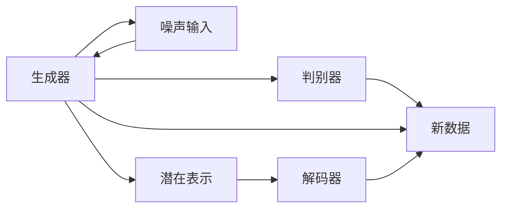

                 

# 生成式AI：金矿还是泡沫？第四部分：“让人尖叫”的用户体验

## 1. 背景介绍

在人工智能的征程上，生成式AI已然成为炙手可热的领域。从语音合成、图像生成到文本创作，生成式模型正逐步从实验室走向市场，构建了一个个令人尖叫的用户体验。然而，这一新兴技术，究竟是金矿还是泡沫？此部分将深入探讨生成式AI在提升用户体验方面的表现与挑战，带领读者一同揭秘生成式AI背后的秘密。

## 2. 核心概念与联系

### 2.1 核心概念概述

生成式AI指的是利用机器学习模型生成全新数据的领域。常见的生成模型包括生成对抗网络(GANs)、变分自编码器(VAEs)、扩散模型等。这些模型通过学习数据分布，能够生成与训练数据相似的新样本，应用广泛，如图像生成、自然语言处理等。

其中，生成对抗网络(GANs)是一个由生成器和判别器组成的框架，通过对抗训练，生成器能产生逼真程度极高的合成数据，而判别器则逐渐能够分辨出生成数据和真实数据。变分自编码器(VAEs)则通过编码器和解码器，学习数据分布的潜在表示，并可以通过采样生成新的数据。扩散模型(Diffusion Models)则通过逐步引入噪声，逐渐将数据推回到潜在空间，生成新的样本。

### 2.2 核心概念原理和架构的 Mermaid 流程图



这个流程图展示了GAN的基本框架。生成器(A)通过噪声输入(D)生成潜在表示(E)，再通过解码器(F)得到新数据(C)。判别器(B)则负责区分新生成的数据(C)和真实数据，两者通过对抗训练不断提升自身性能。

## 3. 核心算法原理 & 具体操作步骤

### 3.1 算法原理概述

生成式AI的核心在于通过机器学习模型生成高质量的合成数据。这些数据可以是图像、音频、文本等，能够用于图像生成、视频制作、自然语言处理等多个领域。其核心算法包括生成对抗网络(GANs)、变分自编码器(VAEs)、扩散模型等。

以GANs为例，其核心思想是通过对抗训练，生成器能够生成高质量的合成数据，而判别器能够分辨真实数据和合成数据。通过不断的对抗训练，两者性能都得到了显著提升。

### 3.2 算法步骤详解

#### 3.2.1 生成对抗网络(GANs)

**Step 1: 初始化模型**
- 定义生成器和判别器。生成器为从噪声向量生成图像的函数，判别器为区分图像是否为真实图像的函数。

**Step 2: 对抗训练**
- 生成器从噪声向量生成图像，判别器尝试判断这些图像是真实还是生成的。
- 判别器给出预测结果后，生成器根据预测结果调整参数，以欺骗判别器。
- 重复上述过程，不断训练生成器和判别器，直到达到收敛状态。

**Step 3: 生成新图像**
- 在生成器和判别器都达到稳定状态后，使用生成器从噪声向量生成新图像。

#### 3.2.2 变分自编码器(VAEs)

**Step 1: 初始化模型**
- 定义编码器和解码器，编码器将数据映射到潜在表示，解码器从潜在表示中恢复数据。

**Step 2: 学习潜在表示**
- 通过最大化编码器和解码器的联合概率，最小化潜在表示与数据之间的KL散度，学习数据的潜在表示。

**Step 3: 生成新数据**
- 通过采样潜在表示，利用解码器生成新数据。

#### 3.2.3 扩散模型(Diffusion Models)

**Step 1: 初始化模型**
- 定义扩散过程，即从数据开始，逐步引入噪声，直至成为潜在表示。

**Step 2: 扩散过程**
- 根据噪声的引入方式，不断将数据推回到潜在空间，生成新的样本。

**Step 3: 生成新数据**
- 在扩散过程中，通过采样的方式，从潜在表示中生成新数据。

### 3.3 算法优缺点

生成式AI的优点在于其能够生成逼真的合成数据，弥补实际数据的不足，适用于数据稀缺的领域。此外，生成式AI还能够用于数据增强、数据合成等任务，提升模型的泛化能力。

然而，生成式AI也存在一些缺点：
- 生成数据可能存在质量不稳定的问题，无法完全替代真实数据。
- 训练复杂度高，对计算资源要求高。
- 生成的数据可能存在偏差，需要额外处理。

### 3.4 算法应用领域

生成式AI在多个领域均有广泛应用：

- **图像生成**：如GANs生成的艺术作品、人脸图像等。
- **视频制作**：通过生成式模型生成视频片段，用于影视制作、动画等。
- **自然语言处理**：如文本生成、对话系统等。
- **音乐生成**：如使用变分自编码器生成音乐等。

## 4. 数学模型和公式 & 详细讲解 & 举例说明

### 4.1 数学模型构建

以GANs为例，生成器和判别器的函数定义如下：

- **生成器**：$G(z)$，其中$z$为噪声向量，输出为生成的图像$x$。
- **判别器**：$D(x)$，输出为图像$x$为真实图像的概率$p(x)$。

**目标函数**：
- **生成器**：$\mathcal{L}_G = \mathbb{E}_{z}[\log D(G(z))]$
- **判别器**：$\mathcal{L}_D = \mathbb{E}_x[\log D(x)] + \mathbb{E}_z[\log(1 - D(G(z)))]$

其中$\log$表示自然对数。

### 4.2 公式推导过程

对于GANs的目标函数，可以进一步展开推导：

**生成器损失**：
$$\mathcal{L}_G = -\mathbb{E}_{z}[\log D(G(z))]$$

**判别器损失**：
$$\mathcal{L}_D = -\mathbb{E}_x[\log D(x)] - \mathbb{E}_z[\log(1 - D(G(z)))]$$

**总损失**：
$$\mathcal{L}_{\text{total}} = \mathcal{L}_G + \mathcal{L}_D$$

### 4.3 案例分析与讲解

**案例：GANs生成人脸图像**

给定一些真人图像，使用GANs生成与真人相似的新人脸图像。首先，将真人图像作为真实数据，用于训练判别器。然后，通过对抗训练，不断提升生成器的性能，使得其生成的图像越来越逼真。最后，使用训练好的生成器生成新的人脸图像。

## 5. 项目实践：代码实例和详细解释说明

### 5.1 开发环境搭建

为搭建生成式AI项目，需要准备以下环境：

- **Python**：需要安装PyTorch、TensorFlow等深度学习库。
- **GPU**：推荐使用NVIDIA的GPU，以支持高效的模型训练。
- **软件框架**：推荐使用PyTorch，其API简洁明了，易于学习和使用。

### 5.2 源代码详细实现

以下是一个使用PyTorch实现GANs生成图像的示例代码：

```python
import torch
import torch.nn as nn
import torch.optim as optim

# 定义生成器和判别器
class Generator(nn.Module):
    def __init__(self):
        super(Generator, self).__init__()
        self.linear1 = nn.Linear(100, 256)
        self.linear2 = nn.Linear(256, 784)

    def forward(self, x):
        x = torch.relu(self.linear1(x))
        x = torch.relu(self.linear2(x))
        return torch.sigmoid(x)

class Discriminator(nn.Module):
    def __init__(self):
        super(Discriminator, self).__init__()
        self.linear1 = nn.Linear(784, 256)
        self.linear2 = nn.Linear(256, 1)

    def forward(self, x):
        x = torch.relu(self.linear1(x))
        return torch.sigmoid(self.linear2(x))

# 定义损失函数和优化器
def gan_loss(D_real, D_fake):
    return torch.mean(torch.log(D_real)) - torch.mean(torch.log(1 - D_fake))

def train(model, data_loader, num_epochs, batch_size, learning_rate):
    optimizer = optim.Adam(model.parameters(), lr=learning_rate)
    for epoch in range(num_epochs):
        for batch_idx, (real_data, _) in enumerate(data_loader):
            real_data = real_data.view(-1, 784)
            optimizer.zero_grad()
            fake_data = model(torch.randn(batch_size, 100))
            D_real = D_real(real_data)
            D_fake = D_fake(fake_data)
            gan_loss(D_real, D_fake).backward()
            optimizer.step()
            if (batch_idx + 1) % 10 == 0:
                print(f'Epoch {epoch+1}, Batch {batch_idx+1}')

# 数据准备
real_data = torch.randn(1000, 784)
fake_data = torch.randn(100, 100)

# 初始化生成器和判别器
G = Generator()
D = Discriminator()

# 训练
train(G, D, num_epochs=10, batch_size=100, learning_rate=0.0002)

# 生成新图像
new_images = G(torch.randn(100, 100))
```

### 5.3 代码解读与分析

**代码详细解读**：

- **定义生成器和判别器**：生成器将噪声向量映射到图像空间，判别器将图像分类为真实和生成。
- **定义损失函数和优化器**：使用GANs的损失函数，Adam优化器进行训练。
- **数据准备**：使用随机生成的噪声向量作为训练数据，准备真实图像数据。
- **模型初始化**：使用PyTorch定义生成器和判别器。
- **训练**：在训练过程中，使用对抗训练不断提升生成器和判别器的性能。
- **生成新图像**：使用训练好的生成器生成新图像。

## 6. 实际应用场景

### 6.1 视频生成

生成式AI在视频生成领域具有广泛的应用。使用GANs可以生成逼真的视频片段，用于影视制作、动画等。例如，使用StyleGAN生成高清晰度的人脸视频，可以用于影视特效、虚拟偶像等。

### 6.2 文本生成

生成式AI可以用于文本生成，如自动生成新闻、故事、对话等。通过训练语言模型，生成高质量的文本内容，减少人工工作量，提升效率。

### 6.3 音乐生成

变分自编码器(VAEs)和GANs可以用于音乐生成。通过训练模型，生成逼真的音乐片段，用于创作、娱乐等。

### 6.4 未来应用展望

随着生成式AI技术的不断进步，未来将有更多的应用场景被开拓：

- **虚拟现实**：生成逼真的虚拟场景，提升用户体验。
- **个性化推荐**：根据用户行为生成个性化的内容，提升推荐效果。
- **医疗诊断**：生成高仿真的医疗图像，辅助医生诊断。
- **游戏制作**：生成逼真的游戏素材，提升游戏体验。

## 7. 工具和资源推荐

### 7.1 学习资源推荐

- **《生成对抗网络(GANs)理论与实践》**：深入讲解GANs的理论和实践，适合初学者和进阶者学习。
- **《变分自编码器(VAEs)实践指南》**：详细讲解VAEs的应用，包括图像生成、文本生成等。
- **《深度学习框架PyTorch实战》**：使用PyTorch实现生成式AI项目的实战指南。

### 7.2 开发工具推荐

- **PyTorch**：深度学习框架，简单易用，适合生成式AI项目开发。
- **TensorFlow**：深度学习框架，支持多种硬件设备，适合大规模项目开发。
- **Weights & Biases**：模型训练实验跟踪工具，记录训练过程，便于分析和优化。

### 7.3 相关论文推荐

- **《Imagenet Classification with Deep Convolutional Neural Networks》**：提出深度卷积神经网络，用于图像分类任务。
- **《Unsupervised Representation Learning with Deep Convolutional Generative Adversarial Networks》**：使用GANs进行无监督的图像生成和分类。
- **《Generative Adversarial Nets》**：提出GANs模型，开启生成式AI的先河。

## 8. 总结：未来发展趋势与挑战

### 8.1 研究成果总结

生成式AI作为人工智能领域的重要分支，已经展现出巨大的潜力。从GANs到VAEs，再到扩散模型，生成式AI的发展日新月异，推动了多个领域的应用和创新。

### 8.2 未来发展趋势

未来生成式AI将继续拓展应用领域，提升用户体验。通过更高效的模型训练和优化，生成更高质量的合成数据，用于多个领域。

### 8.3 面临的挑战

尽管生成式AI前景广阔，但也面临着诸多挑战：

- **计算资源限制**：生成式AI需要大量的计算资源，对于硬件设备要求较高。
- **生成质量不稳定**：生成的数据质量不稳定，难以完全替代真实数据。
- **模型训练复杂**：训练过程复杂，需要精心调参。

### 8.4 研究展望

未来的研究方向包括：

- **改进模型训练**：提高生成数据的质量和稳定性。
- **优化计算资源**：降低计算成本，提高模型训练效率。
- **多模态生成**：将文本、图像、语音等多种模态数据融合，生成更全面的合成数据。

## 9. 附录：常见问题与解答

**Q1：生成式AI与传统AI有什么区别？**

A: 生成式AI和传统AI的区别在于其生成能力的不同。传统AI主要关注数据的分类、预测等任务，而生成式AI则能够生成全新的数据，如图像、文本、音乐等。

**Q2：生成式AI是否存在偏见？**

A: 生成式AI模型可能会学习到训练数据中的偏见，需要额外处理。可以通过数据清洗、模型修正等方法，减少模型中的偏见。

**Q3：生成式AI在应用中如何保证数据安全？**

A: 生成式AI生成的数据需要合理使用，避免侵犯用户隐私。可以采用数据加密、访问控制等手段，保障数据安全。

**Q4：生成式AI的未来方向是什么？**

A: 生成式AI的未来方向包括提升生成数据的质量、降低计算成本、融合多模态数据等。未来有望在更多领域得到应用，带来更深远的变革。

---

作者：禅与计算机程序设计艺术 / Zen and the Art of Computer Programming

