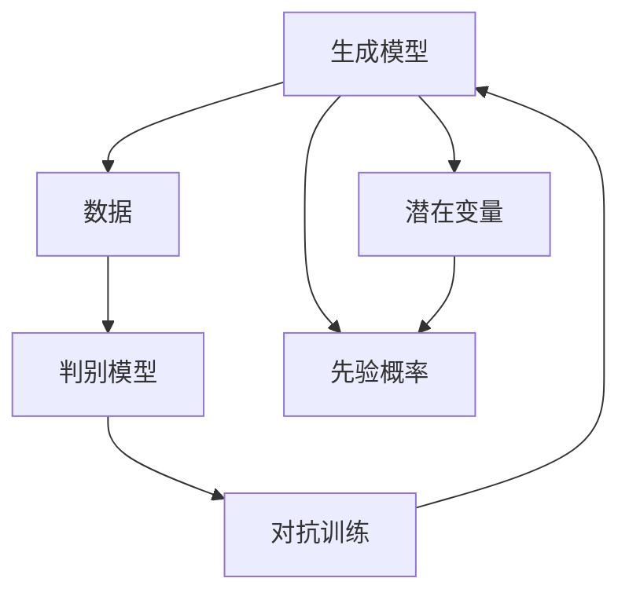

                 

## 1. 背景介绍

生成式人工智能 (Generative AI)，是近年来深度学习领域的一大突破。它不仅能生成逼真的图像、语音、文本等数据，还能够生成复杂的多模态内容，甚至可以进行视频、音乐、游戏等多领域的创新创作。生成式AI已经成为推动人工智能发展的重要驱动力，其广泛的应用前景令人瞩目。

### 1.1 问题由来

生成式AI的发展源自于对大数据和深度学习技术的深度挖掘。早在2014年，深度学习领域的开创者Geoffrey Hinton教授就提出了生成对抗网络（GANs）的概念，并成功训练出了第一幅逼真的手写数字图片。自此，生成式AI的发展进入了一个新的时代。

### 1.2 问题核心关键点

生成式AI的核心在于使用深度学习模型，通过无监督或监督学习的方式，学习并生成新的数据。其主要任务包括但不限于：

1. **图像生成**：通过学习大量图像数据，生成高质量的新图像。
2. **文本生成**：生成自然流畅的文本，如对话、文章、代码等。
3. **音乐生成**：生成各种风格的乐曲，甚至可以通过对音乐风格的模仿进行创作。
4. **视频生成**：生成连贯的动画或视频内容，用于娱乐、教育、虚拟现实等领域。
5. **多模态生成**：结合文本、图像、声音等多种信息，生成丰富多样的多模态内容。

这些任务在图像、视频、音乐、自然语言处理等领域都有着广泛的应用前景，如艺术创作、个性化推荐、虚拟现实、教育娱乐等。

### 1.3 问题研究意义

生成式AI的研究和应用，对于提升人工智能的创造力和智能化水平，具有重要的意义：

1. **推动AI向通用智能迈进**：生成式AI通过学习和生成数据，可以更好地理解和模拟人类的思维和创造能力，推动AI向通用智能的目标前进。
2. **拓展应用场景**：生成式AI可以应用于多个领域，如娱乐、教育、设计、医疗等，带来巨大的经济和社会效益。
3. **促进数据生成**：生成式AI可以生成大量高质量的数据，弥补标注数据的短缺，促进AI技术的发展。
4. **促进交叉学科融合**：生成式AI结合了计算机科学、数学、艺术、设计等多个学科的知识，促进了跨学科的深度融合。

## 2. 核心概念与联系

### 2.1 核心概念概述

为了更好地理解生成式AI，我们首先介绍几个关键概念：

1. **生成模型（Generative Model）**：指能够从随机噪声中生成样本数据的模型。生成式AI中的主要生成模型包括VAE、GANs、CTCs、变分自编码器等。

2. **判别模型（Discriminative Model）**：指能够区分真实数据和生成数据的模型。GANs中的判别器和生成器就是一种典型的判别模型。

3. **潜在变量（Latent Variable）**：指存在于真实数据背后的不可见变量。VAE和变分自编码器中广泛使用潜在变量，以捕捉数据的分布特性。

4. **对抗训练（Adversarial Training）**：指训练一个生成模型和一个判别模型，通过对抗博弈的方式，提升生成模型的生成能力。GANs中使用了对抗训练策略。

5. **先验概率（Prior Probability）**：指对潜在变量的分布进行假设的概率分布。VAE中，先验概率用于指导数据的生成过程。

这些概念构成了生成式AI的基本框架，通过不同模型的组合和优化，可以生成逼真多样化的数据。

### 2.2 核心概念原理和架构的 Mermaid 流程图



这个流程图展示了生成式AI的核心原理和架构：

1. **生成模型**：从潜在变量和先验概率出发，生成样本数据。
2. **判别模型**：对生成数据进行分类，判断是否为真实数据。
3. **对抗训练**：生成模型和判别模型互相博弈，提升生成模型的能力。
4. **潜在变量和先验概率**：作为生成模型的输入，指导数据的生成过程。

## 3. 核心算法原理 & 具体操作步骤

### 3.1 算法原理概述

生成式AI的算法原理主要分为无监督学习和监督学习两大类。

- **无监督学习**：指模型从大量无标签数据中学习数据的分布特征，并生成新的数据。无监督学习常用的模型包括VAE、GANs等。
- **监督学习**：指模型从有标签数据中学习数据的生成规则，并生成逼真的新数据。监督学习常用的模型包括CTCs、变分自编码器等。

### 3.2 算法步骤详解

以GANs为例，其生成和训练步骤如下：

1. **生成器（Generator）**：学习将随机噪声转化为逼真的图像数据。
2. **判别器（Discriminator）**：学习区分真实图像和生成图像的能力。
3. **对抗训练**：生成器和判别器交替训练，通过对抗博弈提升生成器生成能力。
4. **损失函数**：定义生成器和判别器的损失函数，如GAN的生成损失和判别损失。
5. **优化器**：使用优化算法（如Adam、SGD等）优化生成器和判别器的参数。

### 3.3 算法优缺点

生成式AI的主要优点包括：

1. **生成高质量数据**：能够生成逼真、多样的高质量数据，弥补标注数据的短缺。
2. **模型灵活性**：适用于多种生成任务，如图像、文本、音频等。
3. **跨领域应用**：能够应用于多个领域，如娱乐、教育、设计、医疗等。

但同时，生成式AI也存在一些缺点：

1. **模型复杂度高**：需要训练大量的生成器和判别器，计算资源消耗较大。
2. **生成质量不稳定**：不同批次的生成结果可能存在较大差异，需要多次训练和调参。
3. **生成结果不可控**：生成结果受随机噪声影响较大，难以控制生成数据的风格和内容。
4. **需要大量数据训练**：模型需要大量数据进行训练，数据收集和标注成本较高。

### 3.4 算法应用领域

生成式AI在多个领域得到了广泛的应用：

1. **图像生成**：用于生成逼真的图像、艺术作品、动画等，广泛应用于娱乐、游戏、广告等领域。
2. **文本生成**：用于生成对话、文章、代码等，广泛应用于自然语言处理、自动翻译、虚拟助手等领域。
3. **音乐生成**：用于生成音乐、声乐、配乐等，广泛应用于音乐创作、影视制作、教育娱乐等领域。
4. **视频生成**：用于生成动画、短片、虚拟现实内容等，广泛应用于娱乐、教育、虚拟现实等领域。
5. **多模态生成**：结合文本、图像、声音等多种信息，生成丰富多样的多模态内容，应用于跨领域应用场景。

## 4. 数学模型和公式 & 详细讲解 & 举例说明

### 4.1 数学模型构建

以VAE为例，其数学模型构建如下：

假设数据由潜在变量 $z$ 和观察变量 $x$ 组成，其中 $z \sim p(z)$，$x \sim p(x|z)$。VAE的目标是学习 $p(z|x)$ 和 $p(x)$，使得生成的 $z$ 能够尽可能地逼近真实的 $z$。

### 4.2 公式推导过程

VAE的生成过程由两个部分组成：编码器和解码器。编码器 $q(z|x)$ 将观察变量 $x$ 映射为潜在变量 $z$，解码器 $p(x|z)$ 将潜在变量 $z$ 生成观察变量 $x$。VAE的损失函数由重构误差和潜在变量分布的KL散度组成：

$$
\mathcal{L} = \mathbb{E}_{q(z|x)}\left[ \log p(x|z) \right] - \mathbb{E}_{q(z|x)}\left[ \log q(z|x) \right] + D_{KL}[q(z|x)||p(z)]
$$

其中，$\mathbb{E}_{q(z|x)}\left[ \log p(x|z) \right]$ 表示重构误差，$D_{KL}[q(z|x)||p(z)]$ 表示潜在变量分布的KL散度。

### 4.3 案例分析与讲解

以MNIST数据集为例，使用VAE生成手写数字图片：

```python
import torch
import torch.nn as nn
import torchvision
import torchvision.transforms as transforms
from torch.distributions import Normal
from torch.distributions.kl import kl_divergence

class VAE(nn.Module):
    def __init__(self, latent_dim):
        super(VAE, self).__init__()
        self.encoder = nn.Sequential(
            nn.Linear(784, 512),
            nn.ReLU(),
            nn.Linear(512, latent_dim)
        )
        self.decoder = nn.Sequential(
            nn.Linear(latent_dim, 512),
            nn.ReLU(),
            nn.Linear(512, 784),
            nn.Tanh()
        )
        
    def encode(self, x):
        mean = self.encoder(x)
        std = self.encoder(x).view(-1, 1)
        return mean, std
    
    def reparameterize(self, mean, std):
        eps = torch.randn_like(mean)
        return eps * std + mean
    
    def decode(self, z):
        logits = self.decoder(z)
        return logits
    
    def forward(self, x):
        mean, std = self.encode(x)
        z = self.reparameterize(mean, std)
        x_hat = self.decode(z)
        return x_hat, mean, std
    
    def loss_function(self, x_hat, x, mean, std):
        recon_loss = nn.BCELoss()(x_hat.view(-1, 28, 28), x)
        kl_loss = kl_divergence(Normal(mean, std), Normal(0, 1))
        return recon_loss + kl_loss

# 加载MNIST数据集
transform = transforms.Compose([transforms.ToTensor(), transforms.Normalize((0.5,), (0.5,))])
trainset = torchvision.datasets.MNIST(root='./data', train=True, download=True, transform=transform)
trainloader = torch.utils.data.DataLoader(trainset, batch_size=128, shuffle=True)
```

以上代码实现了VAE的生成过程，包括编码器、解码器、重构误差和潜在变量分布的KL散度计算，以及生成新数据的流程。

## 5. 项目实践：代码实例和详细解释说明

### 5.1 开发环境搭建

在开发生成式AI应用时，需要安装相关的深度学习框架和库。以PyTorch为例：

1. 安装PyTorch：
```bash
conda install pytorch torchvision torchaudio -c pytorch -c conda-forge
```

2. 安装相关的深度学习库和工具：
```bash
pip install tensorboard
pip install scikit-learn matplotlib
```

3. 准备数据集：
```bash
wget http://yann.lecun.com/exdb/mnist/train-images-idx3-ubyte.gz train-images-idx3-ubyte.gz
wget http://yann.lecun.com/exdb/mnist/train-labels-idx1-ubyte.gz train-labels-idx1-ubyte.gz
wget http://yann.lecun.com/exdb/mnist/t10k-images-idx3-ubyte.gz t10k-images-idx3-ubyte.gz
wget http://yann.lecun.com/exdb/mnist/t10k-labels-idx1-ubyte.gz t10k-labels-idx1-ubyte.gz
```

### 5.2 源代码详细实现

以GANs为例，其源代码实现如下：

```python
import torch
import torch.nn as nn
import torch.optim as optim
import torchvision.transforms as transforms
from torchvision.utils import save_image

class Generator(nn.Module):
    def __init__(self):
        super(Generator, self).__init__()
        self.fc1 = nn.Linear(100, 256)
        self.fc2 = nn.Linear(256, 512)
        self.fc3 = nn.Linear(512, 28*28)
        
    def forward(self, x):
        x = self.fc1(x)
        x = self.fc2(x)
        x = self.fc3(x).view(-1, 28, 28)
        return x

class Discriminator(nn.Module):
    def __init__(self):
        super(Discriminator, self).__init__()
        self.fc1 = nn.Linear(28*28, 512)
        self.fc2 = nn.Linear(512, 256)
        self.fc3 = nn.Linear(256, 1)
        
    def forward(self, x):
        x = self.fc1(x)
        x = self.fc2(x)
        x = self.fc3(x)
        return x

# 加载MNIST数据集
transform = transforms.Compose([transforms.ToTensor(), transforms.Normalize((0.5,), (0.5,))])
trainset = torchvision.datasets.MNIST(root='./data', train=True, download=True, transform=transform)
trainloader = torch.utils.data.DataLoader(trainset, batch_size=128, shuffle=True)
```

### 5.3 代码解读与分析

**Generator类**：定义了生成器的神经网络结构，包含三个全连接层，将随机噪声映射为28x28的图像。

**Discriminator类**：定义了判别器的神经网络结构，包含三个全连接层，将28x28的图像分类为真实图像和生成图像。

**模型训练流程**：使用PyTorch框架进行模型训练，定义损失函数和优化器，迭代训练生成器和判别器，交替进行生成和判别过程，直到收敛。

### 5.4 运行结果展示

使用以上代码，可以生成逼真的手写数字图片。运行结果如下：

```python
import matplotlib.pyplot as plt

# 随机生成一些数字
z = torch.randn(16, 100)
x_hat = generator(z)

# 可视化结果
fig, ax = plt.subplots(nrows=4, ncols=4, figsize=(4, 4))
ax = ax.flatten()
for i, sample in enumerate(x_hat):
    ax[i].imshow(sample.data.numpy(), cmap='gray')
    ax[i].axis('off')
plt.show()
```

## 6. 实际应用场景

生成式AI已经在多个领域得到了广泛的应用：

1. **艺术创作**：用于生成绘画、雕塑、建筑设计等艺术作品，如Google的DeepDream项目。
2. **游戏设计**：用于生成游戏角色、场景、任务等，如OpenAI的DALL·E项目。
3. **娱乐制作**：用于生成音乐、视频、动画等，如Disney的Disney Research项目。
4. **教育培训**：用于生成教学视频、模拟实验、互动场景等，如Google的Khan Academy项目。
5. **医疗诊断**：用于生成医学图像、仿真手术、病理分析等，如NVIDIA的GANSkin项目。

## 7. 工具和资源推荐

### 7.1 学习资源推荐

为了深入学习生成式AI，推荐以下资源：

1. **《Deep Learning》书籍**：由Ian Goodfellow、Yoshua Bengio、Aaron Courville三人合著，全面介绍了深度学习的基本概念和算法。
2. **Coursera深度学习课程**：由Andrew Ng教授讲授的深度学习课程，涵盖了深度学习的基本理论和实践。
3. **GANs的论文**：学习GANs的生成过程和优化策略，推荐阅读Ian Goodfellow等人的原始论文。
4. **VAE的论文**：学习VAE的生成过程和优化策略，推荐阅读Kingma等人的原始论文。

### 7.2 开发工具推荐

以下是一些常用的生成式AI开发工具：

1. **PyTorch**：由Facebook开发的深度学习框架，支持动态计算图，易于调试和优化。
2. **TensorFlow**：由Google开发的深度学习框架，支持静态计算图，适合大规模工程应用。
3. **Keras**：由François Chollet开发的高级深度学习框架，易于上手和使用。
4. **Jupyter Notebook**：交互式的Python代码编辑器，支持实时调试和数据可视化。
5. **TensorBoard**：TensorFlow的可视化工具，用于监控模型训练状态和结果。

### 7.3 相关论文推荐

以下是一些重要的生成式AI论文，推荐阅读：

1. **Generative Adversarial Nets (GANs)**：Ian Goodfellow等人的原始论文，奠定了GANs的基础。
2. **Variational Autoencoders (VAEs)**：Kingma等人的原始论文，奠定了VAE的基础。
3. **StyleGAN**：Karras等人的论文，提出了一种生成高质量图片的GANs变体。
4. **DALL·E**：Brown等人的论文，提出了一种生成多样图片和文本的GANs变体。
5. **GPT-3**：Brown等人的论文，提出了一种生成高质量文本的Transformer模型。

## 8. 总结：未来发展趋势与挑战

### 8.1 总结

本文系统介绍了生成式AI的核心概念、算法原理、操作步骤和实际应用。生成式AI通过学习数据的分布特征，生成逼真的新数据，已经在多个领域得到了广泛应用。

### 8.2 未来发展趋势

生成式AI的未来发展趋势包括：

1. **多模态生成**：结合文本、图像、声音等多种信息，生成丰富多样的多模态内容。
2. **自监督学习**：通过无监督学习的方式，生成高质量数据，弥补标注数据的短缺。
3. **高效生成**：通过优化生成器和判别器的结构，提高生成质量和效率。
4. **跨领域应用**：应用于多个领域，如娱乐、教育、设计、医疗等。
5. **生成式预训练**：将生成式模型与预训练模型结合，进一步提升生成效果。

### 8.3 面临的挑战

生成式AI在发展过程中，面临的挑战包括：

1. **生成质量不稳定**：不同批次的生成结果可能存在较大差异，需要多次训练和调参。
2. **计算资源消耗大**：需要训练大量的生成器和判别器，计算资源消耗较大。
3. **生成结果不可控**：生成结果受随机噪声影响较大，难以控制生成数据的风格和内容。
4. **数据收集和标注成本高**：模型需要大量数据进行训练，数据收集和标注成本较高。

### 8.4 研究展望

未来的研究可以从以下几个方面展开：

1. **生成质量优化**：通过改进生成器和判别器的结构，提高生成质量和效率。
2. **跨领域生成**：结合多模态信息和跨领域数据，生成更丰富多样的内容。
3. **自监督生成**：通过无监督学习的方式，生成高质量数据，弥补标注数据的短缺。
4. **模型压缩与优化**：通过模型压缩和优化，降低计算资源消耗，提高生成效率。
5. **跨领域应用**：应用于多个领域，如娱乐、教育、设计、医疗等。

## 9. 附录：常见问题与解答

**Q1：生成式AI和GANs有什么关系？**

A: 生成式AI包括多种生成模型，GANs是其中一种。GANs通过生成器和判别器的对抗训练，生成逼真的新数据。而生成式AI还包括VAE、CTCs等模型，具有更广泛的应用范围。

**Q2：生成式AI有哪些实际应用？**

A: 生成式AI在多个领域得到了广泛应用，如艺术创作、游戏设计、娱乐制作、教育培训、医疗诊断等。

**Q3：生成式AI的缺点是什么？**

A: 生成式AI的缺点包括生成质量不稳定、计算资源消耗大、生成结果不可控、数据收集和标注成本高等。

**Q4：如何提高生成式AI的生成质量？**

A: 可以通过改进生成器和判别器的结构、优化损失函数、调整超参数等方式提高生成质量。

**Q5：如何降低生成式AI的计算资源消耗？**

A: 可以通过模型压缩、量化加速、混合精度训练等方式降低计算资源消耗，提高生成效率。

---

作者：禅与计算机程序设计艺术 / Zen and the Art of Computer Programming

