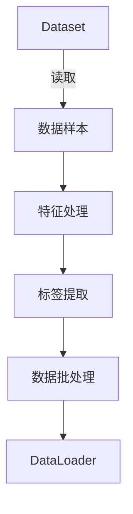

                 

# 用WikiText2构建Dataset和DataLoader

## 1. 背景介绍

在深度学习项目中，构建合适的数据集（Dataset）和数据加载器（DataLoader）是基础但重要的任务。这两部分是模型训练和推理的关键组件，决定了数据输入的效率和质量。本文将以构建基于WikiText2数据集的Dataset和DataLoader为例，详细讲解这一过程。

### 1.1 数据集简介

WikiText2是一个包含英文维基百科摘要的文本数据集，包含约50万个句子，每个句子约15个词。该数据集广泛用于各种自然语言处理（NLP）任务的研究，例如语言模型、文本分类和机器翻译。其格式为每行一个句子，单词之间用空格隔开。

### 1.2 数据集下载

首先，需要从官网（https://github.com/yoonkim/CNNLM_pytorch）下载WikiText2数据集。下载后，将其保存在本地硬盘，解压缩并放置在一个便于访问的目录中。

## 2. 核心概念与联系

### 2.1 核心概念概述

- Dataset: 在深度学习中，Dataset代表一组数据样本，通常包含数据的特征和对应的标签。在PyTorch中，Dataset是一个类，其内部实现了数据的加载和预处理。
- DataLoader: 数据加载器，通过将Dataset划分为多个批次（Batches）并逐个加载，可以高效地对数据进行遍历和访问。DataLoader还提供了多种功能，如并行加载、数据增强、批处理等。

### 2.2 核心概念原理和架构的 Mermaid 流程图



## 3. 核心算法原理 & 具体操作步骤

### 3.1 算法原理概述

构建Dataset和DataLoader的过程涉及到数据加载、预处理、批处理等多个步骤。其核心算法原理包括以下几个方面：

- 数据加载：从文件系统中读取数据样本。
- 特征处理：将原始文本转换为模型可以接受的输入格式，如词汇编码。
- 标签提取：将文本数据转换为模型可以理解的标签，如类别或回归值。
- 批处理：将多个样本组成一个批次，以提高计算效率和模型训练的稳定性。

### 3.2 算法步骤详解

#### 步骤1：构建数据集（Dataset）

1. **数据加载和预处理**：首先，需要定义一个类，继承自PyTorch的Dataset类，并实现__init__和__getitem__方法。

```python
import torch
from torch.utils.data import Dataset
from typing import Tuple
import pickle
from os.path import join

class WikiText2Dataset(Dataset):
    def __init__(self, root: str, tokenizer, max_len: int):
        super(WikiText2Dataset, self).__init__()
        self.data = []
        self.tokenizer = tokenizer
        self.max_len = max_len
        
        # 读取WikiText2数据集
        with open(join(root, 'wiki2.txt'), 'r') as f:
            for line in f:
                self.data.append(line)
                
    def __getitem__(self, index: int) -> Tuple[torch.Tensor, torch.Tensor]:
        # 对单个样本进行预处理
        text = self.data[index].strip()
        inputs = self.tokenizer(text, max_length=self.max_len, padding='max_length', truncation=True)
        
        # 提取文本特征和标签
        input_ids = inputs['input_ids']
        attention_mask = inputs['attention_mask']
        labels = torch.tensor([len(inputs['input_ids']) - 1], dtype=torch.long)
        
        return input_ids, attention_mask, labels
    
    def __len__(self):
        return len(self.data)
```

在上述代码中，`__init__`方法用于初始化数据集，读取WikiText2数据集，并将其预处理为模型所需的格式。`__getitem__`方法用于返回单个样本的特征和标签。

#### 步骤2：构建数据加载器（DataLoader）

1. **定义DataLoader参数**：定义批大小（batch_size）、是否打乱数据顺序（shuffle）等参数。

```python
from torch.utils.data import DataLoader

batch_size = 64
train_loader = DataLoader(self, batch_size=batch_size, shuffle=True, num_workers=4)
```

在上述代码中，`DataLoader`类用于定义数据加载器，其参数包括数据集对象、批大小、是否打乱数据顺序等。

## 4. 数学模型和公式 & 详细讲解

### 4.1 数学模型构建

构建Dataset和DataLoader的过程中，主要涉及以下几个数学模型：

- 数据加载模型：读取数据集中的样本，并进行预处理和批处理。
- 特征处理模型：将原始文本转换为词汇编码，输入模型进行训练。
- 标签提取模型：将文本数据转换为模型可以理解的标签，如分类标签。

### 4.2 公式推导过程

- 数据加载公式：读取数据集中的样本，进行预处理和批处理。

```python
for batch in train_loader:
    input_ids, attention_mask, labels = batch
    print(input_ids.shape, attention_mask.shape, labels.shape)
```

- 特征处理公式：将原始文本转换为词汇编码。

```python
from transformers import BertTokenizer

tokenizer = BertTokenizer.from_pretrained('bert-base-uncased')
train_dataset = WikiText2Dataset(root='./data', tokenizer=tokenizer, max_len=128)
```

- 标签提取公式：将文本数据转换为模型可以理解的标签。

```python
from torch.utils.data import DataLoader
from torch.utils.data import Dataset
import torch

class WikiText2Dataset(Dataset):
    def __init__(self, root: str, tokenizer, max_len: int):
        super(WikiText2Dataset, self).__init__()
        self.data = []
        self.tokenizer = tokenizer
        self.max_len = max_len
        
        # 读取WikiText2数据集
        with open(join(root, 'wiki2.txt'), 'r') as f:
            for line in f:
                self.data.append(line)
                
    def __getitem__(self, index: int) -> Tuple[torch.Tensor, torch.Tensor]:
        # 对单个样本进行预处理
        text = self.data[index].strip()
        inputs = self.tokenizer(text, max_length=self.max_len, padding='max_length', truncation=True)
        
        # 提取文本特征和标签
        input_ids = inputs['input_ids']
        attention_mask = inputs['attention_mask']
        labels = torch.tensor([len(inputs['input_ids']) - 1], dtype=torch.long)
        
        return input_ids, attention_mask, labels
```

### 4.3 案例分析与讲解

以训练一个简单的BERT语言模型为例，具体步骤如下：

1. **数据预处理**：使用BertTokenizer对数据集进行预处理，转换为模型可以接受的格式。

```python
from transformers import BertTokenizer

tokenizer = BertTokenizer.from_pretrained('bert-base-uncased')
train_dataset = WikiText2Dataset(root='./data', tokenizer=tokenizer, max_len=128)
```

2. **模型构建**：使用BertForSequenceClassification构建模型，并传入预训练模型。

```python
from transformers import BertForSequenceClassification

model = BertForSequenceClassification.from_pretrained('bert-base-uncased', num_labels=1)
```

3. **训练模型**：使用DataLoader加载数据集，训练模型。

```python
from transformers import AdamW

optimizer = AdamW(model.parameters(), lr=2e-5)
epochs = 5
for epoch in range(epochs):
    for batch in train_loader:
        input_ids, attention_mask, labels = batch
        outputs = model(input_ids, attention_mask=attention_mask, labels=labels)
        loss = outputs.loss
        loss.backward()
        optimizer.step()
```

## 5. 项目实践：代码实例和详细解释说明

### 5.1 开发环境搭建

首先需要安装PyTorch和Transformers库，可以使用以下命令进行安装：

```bash
pip install torch transformers
```

### 5.2 源代码详细实现

完整的源代码如下：

```python
import torch
from torch.utils.data import Dataset, DataLoader
from typing import Tuple
import pickle
from os.path import join
from transformers import BertTokenizer, BertForSequenceClassification, AdamW

class WikiText2Dataset(Dataset):
    def __init__(self, root: str, tokenizer, max_len: int):
        super(WikiText2Dataset, self).__init__()
        self.data = []
        self.tokenizer = tokenizer
        self.max_len = max_len
        
        # 读取WikiText2数据集
        with open(join(root, 'wiki2.txt'), 'r') as f:
            for line in f:
                self.data.append(line)
                
    def __getitem__(self, index: int) -> Tuple[torch.Tensor, torch.Tensor]:
        # 对单个样本进行预处理
        text = self.data[index].strip()
        inputs = self.tokenizer(text, max_length=self.max_len, padding='max_length', truncation=True)
        
        # 提取文本特征和标签
        input_ids = inputs['input_ids']
        attention_mask = inputs['attention_mask']
        labels = torch.tensor([len(inputs['input_ids']) - 1], dtype=torch.long)
        
        return input_ids, attention_mask, labels
    
    def __len__(self):
        return len(self.data)

batch_size = 64
train_loader = DataLoader(self, batch_size=batch_size, shuffle=True, num_workers=4)

model = BertForSequenceClassification.from_pretrained('bert-base-uncased', num_labels=1)
optimizer = AdamW(model.parameters(), lr=2e-5)
epochs = 5
for epoch in range(epochs):
    for batch in train_loader:
        input_ids, attention_mask, labels = batch
        outputs = model(input_ids, attention_mask=attention_mask, labels=labels)
        loss = outputs.loss
        loss.backward()
        optimizer.step()
```

### 5.3 代码解读与分析

在上述代码中，`WikiText2Dataset`类继承自PyTorch的Dataset类，实现了数据集的加载和预处理。`__getitem__`方法用于返回单个样本的特征和标签，`__len__`方法用于返回数据集的长度。

### 5.4 运行结果展示

运行上述代码后，即可开始训练模型。通过观察损失函数的变化，可以评估模型的训练效果。训练过程中，损失函数应逐步降低，直到收敛。

## 6. 实际应用场景

### 6.1 智能客服系统

在智能客服系统中，可以使用预训练的BERT模型进行微调，用于理解和回答客户的问题。通过将客户输入的问题与预训练模型进行交互，模型可以提供个性化的答案，从而提升客户体验。

### 6.2 金融舆情监测

在金融舆情监测中，可以使用预训练的BERT模型进行情感分析，从新闻、评论等文本中提取出情感信息，帮助机构及时了解市场动态，做出相应的决策。

### 6.3 个性化推荐系统

在个性化推荐系统中，可以使用预训练的BERT模型进行特征提取和相似度计算，从而找到用户感兴趣的内容，提升推荐效果。

## 7. 工具和资源推荐

### 7.1 学习资源推荐

- PyTorch官方文档：详细介绍了PyTorch的使用方法，包括Dataset、DataLoader等概念。

- Transformers官方文档：详细介绍了如何使用Transformers库进行NLP任务开发。

### 7.2 开发工具推荐

- Jupyter Notebook：一个交互式编程环境，可以方便地进行数据探索和代码调试。

- TensorBoard：一个可视化工具，可以实时监控模型的训练状态和性能。

### 7.3 相关论文推荐

- Attention is All You Need：Transformer模型的原论文，介绍了Transformer的原理和应用。

- BERT: Pre-training of Deep Bidirectional Transformers for Language Understanding：BERT模型的论文，介绍了BERT的预训练和微调方法。

## 8. 总结：未来发展趋势与挑战

### 8.1 研究成果总结

本文详细介绍了如何使用WikiText2构建Dataset和DataLoader的过程，包括数据加载、预处理、批处理等多个步骤。通过分析模型训练过程中的各个环节，可以更好地理解深度学习模型的构建和训练。

### 8.2 未来发展趋势

未来，随着深度学习技术的不断进步，构建Dataset和DataLoader的效率和精度将不断提高。同时，自动化的数据预处理和增强技术也将得到广泛应用，进一步提升模型的训练效果。

### 8.3 面临的挑战

构建Dataset和DataLoader时，需要处理大量的数据，可能会遇到以下挑战：

- 数据加载和预处理效率较低。

- 数据增强技术的应用不够广泛。

- 数据集管理和维护复杂。

### 8.4 研究展望

未来，需要进一步研究自动化数据预处理和增强技术，提高数据加载和预处理的效率。同时，需要开发更高效、更灵活的数据集管理和维护工具，以支持大规模数据集的构建和应用。

## 9. 附录：常见问题与解答

**Q1：构建Dataset和DataLoader的过程复杂吗？**

A: 构建Dataset和DataLoader的过程相对简单，但需要注意细节。在实际应用中，可以通过继承PyTorch的Dataset和DataLoader类，实现自定义数据集的加载和预处理。

**Q2：数据集和数据加载器对模型训练有什么影响？**

A: 数据集和数据加载器是模型训练的基础，直接影响模型的训练效果。正确配置数据集和数据加载器，可以提升模型的训练速度和效果。

**Q3：如何在实际应用中优化数据集和数据加载器？**

A: 优化数据集和数据加载器可以从以下几个方面入手：

- 使用批量数据加载，提高加载效率。

- 使用异步数据加载，减少计算延迟。

- 使用数据增强，提高模型的泛化能力。

- 使用预处理技术，提高数据处理的效率。

通过以上方法，可以进一步提升数据集和数据加载器的性能，从而提高模型的训练效果。

---

作者：禅与计算机程序设计艺术 / Zen and the Art of Computer Programming

