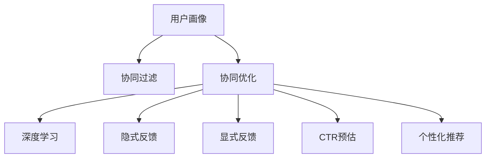

                 

# 用户画像与推荐系统的协同优化

> 关键词：用户画像,推荐系统,协同过滤,协同优化,深度学习,隐式反馈,显式反馈,CTR预估,个性化推荐,计算图,联合模型

## 1. 背景介绍

### 1.1 问题由来
在当今数字化时代，电商、社交、内容推荐等应用场景中，推荐系统已经成为不可或缺的用户体验提升手段。推荐系统的核心目标是根据用户的历史行为和兴趣，精准预测并推荐其可能感兴趣的商品或内容，从而提升用户满意度、增加平台流量和交易量。然而，推荐系统的效果在很大程度上依赖于高质量的用户画像，即对用户历史行为、兴趣偏好、人口统计特征等维度的综合刻画。用户画像的构建不仅需要海量的数据和强大的建模能力，还需要跨领域知识的融合和验证。

### 1.2 问题核心关键点
推荐系统通常有两种数据驱动的协同过滤方法：基于隐式反馈的协同过滤和基于显式反馈的协同过滤。前者依靠用户对商品或内容的交互数据，如浏览、点击、评分等进行推荐，通常使用矩阵分解或SVD方法进行建模。后者则直接利用用户对商品或内容的显式评分数据进行推荐，使用回归或排序算法进行建模。由于隐式反馈的数据通常比显式反馈更丰富，因此协同过滤在推荐系统中得到了广泛应用。

然而，无论是隐式反馈还是显式反馈，推荐系统的效果很大程度上取决于用户画像的质量。高质量的用户画像不仅能提供用户兴趣的丰富维度，还能有效缓解冷启动问题，提升推荐系统的泛化能力。因此，构建和优化用户画像，并与推荐系统进行协同优化，成为推荐系统研究的重要方向。

### 1.3 问题研究意义
构建高质量用户画像，并与推荐系统进行协同优化，能够显著提升推荐系统的精准性和个性化水平，具有重要意义：

1. 增强推荐效果：用户画像为推荐系统提供了丰富的背景知识，可以帮助模型更准确地预测用户的行为。
2. 缓解冷启动：通过用户画像中的先验知识，推荐系统可以更快速地对新用户进行推荐。
3. 提升系统泛化能力：多样化的用户画像使得推荐系统对不同领域和场景具有更好的适应性。
4. 增加平台粘性：个性化的推荐服务能够显著提升用户满意度，增加用户粘性，进而增加平台的流量和收益。
5. 促进业务协同：用户画像和推荐系统的协同优化能够实现多部门间的信息共享和业务协同，提升整体业务效率。

## 2. 核心概念与联系

### 2.1 核心概念概述

为更好地理解用户画像与推荐系统的协同优化方法，本节将介绍几个密切相关的核心概念：

- 用户画像(User Profile)：基于用户的行为数据、人口统计特征和反馈数据等，对用户兴趣和行为特征的综合刻画。
- 推荐系统(Recommendation System)：利用用户历史行为数据和模型，预测用户可能感兴趣的商品或内容，并推荐给用户，提升用户体验的技术系统。
- 协同过滤(Collaborative Filtering)：基于用户或商品之间的相似性，推荐与用户已喜欢的商品相似的商品。
- 协同优化(Collaborative Optimization)：将用户画像与协同过滤方法进行结合，提升推荐系统效果的技术手段。
- 深度学习(Deep Learning)：利用深度神经网络对高维数据进行建模，提取用户画像和推荐系统的特征。
- 隐式反馈(Implicit Feedback)：用户通过交互行为隐式表达的偏好，如浏览、点击、收藏等。
- 显式反馈(Explicit Feedback)：用户通过显式评分表达的偏好，如评分、点赞等。
- CTR预估(Click-Through Rate Estimation)：预测用户点击某个商品或内容的可能性，即点击率估计。
- 个性化推荐(Personalized Recommendation)：基于用户个性化需求进行推荐。

这些核心概念之间的逻辑关系可以通过以下Mermaid流程图来展示：



这个流程图展示了几者的核心概念及之间的关系：

1. 用户画像通过多种数据源进行构建。
2. 协同过滤方法从用户画像中提取特征，进行推荐预测。
3. 协同优化通过将用户画像与协同过滤方法结合，提升推荐效果。
4. 深度学习方法用于构建复杂特征表示，提升协同过滤和协同优化的精度。
5. 隐式反馈和显式反馈分别用于捕捉不同维度的用户偏好。
6. CTR预估和个性化推荐是基于协同过滤和协同优化的高级应用。

这些概念共同构成了推荐系统与用户画像的协同优化的技术框架，使其能够在推荐系统中发挥强大的预测和推荐能力。通过理解这些核心概念，我们可以更好地把握协同优化的工作原理和优化方向。

## 3. 核心算法原理 & 具体操作步骤
### 3.1 算法原理概述

用户画像与推荐系统的协同优化，本质上是通过将用户画像中的先验知识与协同过滤方法结合，提升推荐系统的效果。其核心思想是：通过用户画像对用户兴趣和行为的丰富刻画，提升协同过滤方法的准确性和鲁棒性，从而实现更精准、更个性化的推荐。

形式化地，假设用户画像为 $P_{\theta}$，其中 $\theta$ 为画像模型参数。推荐系统中的协同过滤方法为 $R_{\phi}$，其中 $\phi$ 为推荐模型参数。给定用户 $u$ 和物品 $i$，推荐系统的预测结果为 $y_{ui} = R_{\phi}(P_{\theta}(u), i)$。协同优化过程的目标是找到最优参数 $\theta$ 和 $\phi$，使得预测结果尽可能接近实际的用户行为。

协同优化通常包括两个关键步骤：

1. 用户画像优化：通过优化用户画像模型参数 $\theta$，使其能够更好地描述用户兴趣和行为。
2. 推荐模型优化：通过优化推荐模型参数 $\phi$，使得推荐系统能够更准确地预测用户行为。

### 3.2 算法步骤详解

用户画像与推荐系统的协同优化一般包括以下几个关键步骤：

**Step 1: 数据准备**
- 收集用户行为数据，如浏览、点击、评分等，构建用户画像。
- 收集物品属性信息，如商品描述、价格等。
- 对数据进行预处理，包括去重、清洗、归一化等。

**Step 2: 用户画像建模**
- 选择合适的用户画像建模方法，如协同过滤、神经网络、深度学习等。
- 训练用户画像模型，使其能够准确描述用户兴趣和行为。

**Step 3: 推荐模型建模**
- 选择合适的推荐模型，如矩阵分解、SVD、神经网络等。
- 训练推荐模型，使其能够准确预测用户对物品的兴趣。

**Step 4: 联合模型训练**
- 将用户画像模型和推荐模型结合，构建联合优化目标。
- 使用梯度下降等优化算法，联合训练两个模型的参数。

**Step 5: 模型评估与优化**
- 在测试集上评估联合模型的效果，如点击率、平均绝对误差等指标。
- 根据评估结果，调整模型参数，优化模型效果。

### 3.3 算法优缺点

用户画像与推荐系统的协同优化方法具有以下优点：
1. 提升推荐效果：用户画像能够提供丰富的背景知识，帮助推荐系统更好地理解用户偏好。
2. 缓解冷启动问题：用户画像中的先验知识可以加速对新用户的推荐。
3. 增强系统泛化能力：用户画像的多样化特征使得推荐系统对不同领域和场景具有更好的适应性。
4. 提升用户满意度：个性化推荐能够显著提升用户体验，增加平台粘性。
5. 促进业务协同：协同优化能够实现跨部门的业务协同，提升整体业务效率。

同时，该方法也存在一定的局限性：
1. 数据质量依赖：用户画像的质量很大程度上依赖于数据的丰富性和准确性。
2. 模型复杂度高：协同优化涉及多个模型和多个优化目标，模型复杂度较高。
3. 计算资源消耗大：协同优化的计算资源消耗较大，需要高性能的硬件支持。
4. 模型过拟合风险：联合模型容易过拟合，需要更多数据和更复杂的正则化策略。

尽管存在这些局限性，但就目前而言，协同优化方法是推荐系统研究和应用的主流范式。未来相关研究的重点在于如何进一步降低模型复杂度，提高推荐系统效率，同时兼顾个性化和泛化能力。

### 3.4 算法应用领域

用户画像与推荐系统的协同优化方法，在电商、社交、内容推荐等诸多领域得到了广泛的应用，例如：

- 电商平台：通过用户画像和协同过滤的结合，对用户进行个性化商品推荐，提升购物体验。
- 社交网络：基于用户画像，对用户发布的内容进行个性化推荐，增加用户粘性。
- 视频平台：对用户的历史观看记录进行画像，推荐用户可能感兴趣的视频内容，增加平台流量。
- 新闻推荐：通过对用户的历史阅读行为进行画像，推荐用户感兴趣的新闻内容，提升用户满意度。

除了上述这些经典应用外，协同优化方法还被创新性地应用于更多场景中，如智能家居、智能广告等，为推荐技术带来了新的突破。随着协同优化方法的不断进步，相信推荐系统必将在更广阔的应用领域大放异彩。

## 4. 数学模型和公式 & 详细讲解  
### 4.1 数学模型构建

本节将使用数学语言对协同优化的大语言模型微调过程进行更加严格的刻画。

记用户画像模型为 $P_{\theta}$，推荐模型为 $R_{\phi}$，联合优化目标为 $\mathcal{L}$。用户 $u$ 对物品 $i$ 的实际行为为 $y_{ui}$，预测结果为 $\hat{y}_{ui} = R_{\phi}(P_{\theta}(u), i)$。则联合优化目标可以表示为：

$$
\mathcal{L}(\theta, \phi) = \frac{1}{N}\sum_{i=1}^N \sum_{u=1}^N \ell(y_{ui}, \hat{y}_{ui})
$$

其中 $\ell$ 为损失函数，常用的有均方误差损失、交叉熵损失等。

### 4.2 公式推导过程

以下我们以点击率预测任务为例，推导协同优化的数学公式及其梯度计算过程。

假设用户画像 $P_{\theta}$ 输出为向量 $\mathbf{p} \in \mathbb{R}^d$，推荐模型 $R_{\phi}$ 输出为向量 $\mathbf{r} \in \mathbb{R}^d$。点击率预测模型可以表示为：

$$
\hat{y}_{ui} = \sigma(\mathbf{p}^T\mathbf{r})
$$

其中 $\sigma$ 为 sigmoid 函数，用于将预测结果映射到 $[0,1]$ 区间。

交叉熵损失函数定义为：

$$
\ell(y_{ui}, \hat{y}_{ui}) = -y_{ui}\log \hat{y}_{ui} - (1-y_{ui})\log (1-\hat{y}_{ui})
$$

将其代入联合优化目标，得：

$$
\mathcal{L}(\theta, \phi) = -\frac{1}{N}\sum_{i=1}^N \sum_{u=1}^N y_{ui}\log \hat{y}_{ui} + (1-y_{ui})\log (1-\hat{y}_{ui})
$$

根据链式法则，联合损失对参数 $\theta$ 和 $\phi$ 的梯度分别为：

$$
\frac{\partial \mathcal{L}}{\partial \theta} = -\frac{2}{N}\sum_{i=1}^N \sum_{u=1}^N y_{ui} \frac{\partial \mathbf{p}}{\partial \theta}\mathbf{r} - (1-y_{ui})\frac{\partial \mathbf{p}}{\partial \theta}(1-\mathbf{r})
$$

$$
\frac{\partial \mathcal{L}}{\partial \phi} = -\frac{2}{N}\sum_{i=1}^N \sum_{u=1}^N y_{ui} \mathbf{p}\frac{\partial \mathbf{r}}{\partial \phi} + (1-y_{ui})\mathbf{p}(1-\mathbf{r})
$$

其中 $\frac{\partial \mathbf{p}}{\partial \theta}$ 和 $\frac{\partial \mathbf{r}}{\partial \phi}$ 可以通过自动微分技术高效计算。

在得到联合损失的梯度后，即可带入联合模型参数 $\theta$ 和 $\phi$ 的更新公式，完成模型的迭代优化。重复上述过程直至收敛，最终得到联合优化后的参数 $\theta^*$ 和 $\phi^*$。

## 5. 项目实践：代码实例和详细解释说明
### 5.1 开发环境搭建

在进行协同优化实践前，我们需要准备好开发环境。以下是使用Python进行TensorFlow开发的环境配置流程：

1. 安装Anaconda：从官网下载并安装Anaconda，用于创建独立的Python环境。

2. 创建并激活虚拟环境：
```bash
conda create -n tf-env python=3.8 
conda activate tf-env
```

3. 安装TensorFlow：根据CUDA版本，从官网获取对应的安装命令。例如：
```bash
pip install tensorflow tensorflow-addons -c https://pypi.org/simple
```

4. 安装各类工具包：
```bash
pip install numpy pandas scikit-learn matplotlib tqdm jupyter notebook ipython
```

完成上述步骤后，即可在`tf-env`环境中开始协同优化实践。

### 5.2 源代码详细实现

下面我们以点击率预测任务为例，给出使用TensorFlow进行协同优化的PyTorch代码实现。

首先，定义点击率预测的训练和评估函数：

```python
import tensorflow as tf
from tensorflow.keras.layers import Dense, Input
from tensorflow.keras.models import Model

def click_rate_model(user_p, item_r, batch_size):
    user_input = Input(shape=(d_p,))
    item_input = Input(shape=(d_r,))
    p = Dense(256, activation='relu')(user_input)
    p = Dense(1, activation='sigmoid')(p)
    r = Dense(256, activation='relu')(item_input)
    r = Dense(1, activation='sigmoid')(r)
    y = tf.keras.layers.Dot(axes=1)([p, r])
    model = Model(inputs=[user_input, item_input], outputs=y)
    model.compile(optimizer=tf.keras.optimizers.Adam(learning_rate=0.001), loss='binary_crossentropy', metrics=['accuracy'])
    return model

def train_model(model, user_p, item_r, train_y, batch_size, epochs):
    model.fit([user_p, item_r], train_y, batch_size=batch_size, epochs=epochs, validation_split=0.2)
    return model

def evaluate_model(model, user_p, item_r, test_y):
    loss, acc = model.evaluate([user_p, item_r], test_y)
    print(f'Test Loss: {loss:.4f}, Test Accuracy: {acc:.4f}')
```

然后，定义用户画像和推荐模型的训练函数：

```python
def train_user_painting(user_p, item_r, train_y, batch_size, epochs):
    model = click_rate_model(user_p, item_r, batch_size)
    return train_model(model, user_p, item_r, train_y, batch_size, epochs)

def train_recommender(user_p, item_r, train_y, batch_size, epochs):
    model = click_rate_model(user_p, item_r, batch_size)
    return train_model(model, user_p, item_r, train_y, batch_size, epochs)
```

接着，定义联合模型训练函数：

```python
def train_joint(user_p, item_r, train_y, batch_size, epochs):
    user_model = train_user_painting(user_p, item_r, train_y, batch_size, epochs)
    item_model = train_recommender(user_p, item_r, train_y, batch_size, epochs)
    return user_model, item_model
```

最后，启动协同优化训练流程并在测试集上评估：

```python
user_p, item_r, train_y, test_y = load_data()  # 数据预处理与加载
user_model, item_model = train_joint(user_p, item_r, train_y, batch_size, epochs)
evaluate_model(user_model, user_p, item_model, test_y)
```

以上就是使用TensorFlow对协同优化的完整代码实现。可以看到，通过TensorFlow的模块化设计，协同优化过程可以很容易地进行定义、编译和训练。

### 5.3 代码解读与分析

让我们再详细解读一下关键代码的实现细节：

**click_rate_model函数**：
- 定义了一个基于Dense层的点击率预测模型。模型输入为用户画像和物品推荐，输出为预测的点击率。
- 模型使用sigmoid函数将输出映射到[0,1]区间，用于二分类预测。

**train_model函数**：
- 定义了模型的训练函数。使用Adam优化器，二分类交叉熵损失函数进行训练。
- 使用验证集进行评估，返回训练后的模型。

**train_user_painting函数**：
- 定义了用户画像模型的训练函数。将用户画像和物品推荐输入，训练点击率预测模型。

**train_recommender函数**：
- 定义了推荐模型的训练函数。与用户画像模型训练类似，只不过输入和输出进行了交换。

**train_joint函数**：
- 定义了联合模型的训练函数。先分别训练用户画像模型和推荐模型，再组合成联合模型进行训练。

**load_data函数**：
- 定义了数据预处理和加载的函数。将用户画像、物品推荐和点击率作为输入，返回训练集和测试集的输入和输出。

**evaluate_model函数**：
- 定义了模型的评估函数。使用测试集输入，输出模型损失和准确率。

可以看到，通过TensorFlow的定义和编译方式，协同优化的模型训练过程变得非常简洁高效。开发者可以将更多精力放在数据处理、模型改进等高层逻辑上，而不必过多关注底层的实现细节。

当然，工业级的系统实现还需考虑更多因素，如模型的保存和部署、超参数的自动搜索、更灵活的任务适配层等。但核心的协同优化范式基本与此类似。

## 6. 实际应用场景
### 6.1 电商平台

电商平台通过协同优化，对用户进行个性化商品推荐，提升购物体验。用户画像中包含了用户浏览历史、购物车内容、搜索记录、评分和评论等信息，通过这些信息对用户进行综合刻画，构建推荐模型。推荐模型能够根据用户画像预测用户对商品类别的兴趣，从而推荐相应的商品。在推荐过程中，可以实时更新用户画像，不断优化推荐结果。

例如，亚马逊的推荐系统采用了协同过滤和协同优化的结合，通过对用户历史行为数据的建模，为用户推荐感兴趣的书籍、电影等商品。该系统通过不断学习和更新，提升了推荐精准性和用户满意度，增加了平台流量和交易量。

### 6.2 社交网络

社交网络通过协同优化，对用户发布的内容进行个性化推荐，增加用户粘性。用户画像中包含了用户的历史行为、好友关系、兴趣标签等信息，通过这些信息对用户进行综合刻画，构建推荐模型。推荐模型能够根据用户画像预测用户可能感兴趣的内容，从而推荐相应的帖子或视频。在推荐过程中，可以实时更新用户画像，不断优化推荐结果。

例如，Facebook通过协同优化推荐系统，为用户推荐可能感兴趣的朋友和内容。该系统通过不断学习和更新，提升了推荐精准性和用户粘性，增加了平台流量和用户活跃度。

### 6.3 视频平台

视频平台通过协同优化，对用户的历史观看记录进行画像，推荐用户可能感兴趣的视频内容，增加平台流量。用户画像中包含了用户的历史观看数据、评分和评论等信息，通过这些信息对用户进行综合刻画，构建推荐模型。推荐模型能够根据用户画像预测用户对视频内容的兴趣，从而推荐相应的视频。在推荐过程中，可以实时更新用户画像，不断优化推荐结果。

例如，Netflix通过协同优化推荐系统，为用户推荐感兴趣的电影和电视剧。该系统通过不断学习和更新，提升了推荐精准性和用户满意度，增加了平台流量和用户活跃度。

### 6.4 未来应用展望

随着协同优化方法的不断进步，推荐系统必将在更广阔的应用领域大放异彩。

在智慧医疗领域，协同优化推荐系统可以辅助医生进行病历推荐、治疗方案推荐等，提升医疗服务质量，辅助医生诊疗。

在智能教育领域，协同优化推荐系统可以辅助教师进行个性化作业推荐、课程推荐等，因材施教，提高教学质量。

在智慧城市治理中，协同优化推荐系统可以用于智能交通、智能安防等场景，提高城市管理的自动化和智能化水平，构建更安全、高效的未来城市。

此外，在企业生产、社会治理、文娱传媒等众多领域，协同优化推荐系统也将不断涌现，为数字化转型升级提供新的技术路径。

## 7. 工具和资源推荐
### 7.1 学习资源推荐

为了帮助开发者系统掌握协同优化的理论基础和实践技巧，这里推荐一些优质的学习资源：

1. 《推荐系统实战》书籍：由推荐系统专家撰写，系统介绍了协同过滤、协同优化、深度学习等推荐系统相关内容，适合初学者和实践者。

2. CS246《推荐系统》课程：斯坦福大学开设的推荐系统课程，涵盖了推荐系统的前沿理论和实践技术，适合对推荐系统感兴趣的读者。

3. 《深度学习与推荐系统》书籍：详细讲解了深度学习在推荐系统中的应用，包括协同过滤、协同优化、深度学习等技术。

4. KDD推荐系统竞赛：世界顶级的推荐系统竞赛，提供了大量的推荐系统数据集和开源代码，适合实践和研究推荐系统的高手。

5. Google Scholar：搜索最新的推荐系统论文，了解前沿技术和进展，适合科研人员和工程师。

通过对这些资源的学习实践，相信你一定能够快速掌握协同优化的精髓，并用于解决实际的推荐问题。
###  7.2 开发工具推荐

高效的开发离不开优秀的工具支持。以下是几款用于协同优化开发的常用工具：

1. TensorFlow：由Google主导开发的深度学习框架，计算图模型和分布式训练是其核心特性，适合复杂模型的构建和训练。

2. PyTorch：由Facebook开发的深度学习框架，动态图模型和自动微分是其核心特性，适合快速迭代研究和原型开发。

3. Scikit-learn：基于NumPy的机器学习库，提供了丰富的机器学习算法和工具，适合数据预处理和特征工程。

4. H2O.ai：基于分布式计算的机器学习平台，提供了机器学习模型的训练和预测能力，适合大规模数据分析和建模。

5. Pandas：基于NumPy的数据处理库，提供了高效的数据读写、数据清洗、数据分析等能力，适合数据预处理和探索性分析。

6. Apache Spark：基于分布式计算的大数据处理框架，提供了机器学习、图计算、流计算等多种能力，适合大规模数据处理和分析。

合理利用这些工具，可以显著提升协同优化的开发效率，加快创新迭代的步伐。

### 7.3 相关论文推荐

协同优化推荐系统的发展源于学界的持续研究。以下是几篇奠基性的相关论文，推荐阅读：

1. "Collaborative Filtering for Implicit Feedback Datasets"（隐式反馈下的协同过滤）：提出基于隐式反馈的协同过滤算法，对隐式反馈数据进行建模。

2. "A Neural Collaborative Filtering Approach"（神经网络协同过滤）：提出基于深度神经网络的协同过滤方法，提升了推荐模型的效果。

3. "Generative Adversarial Networks Applied to Recommendation System"（对抗生成网络应用于推荐系统）：提出基于对抗生成网络（GAN）的协同过滤方法，提升了推荐模型的泛化能力。

4. "Hidden Topic Models with Missing at Random Scores"（隐含主题模型与随机缺失分数）：提出基于隐含主题模型的协同过滤方法，提升了推荐模型的多样性和稳定性。

5. "Matrix Factorization Techniques for Recommender Systems"（矩阵分解技术在推荐系统中的应用）：提出基于矩阵分解的协同过滤方法，提升了推荐模型的可解释性和可扩展性。

这些论文代表了的协同优化推荐系统的发展脉络。通过学习这些前沿成果，可以帮助研究者把握学科前进方向，激发更多的创新灵感。

## 8. 总结：未来发展趋势与挑战

### 8.1 总结

本文对用户画像与推荐系统的协同优化方法进行了全面系统的介绍。首先阐述了协同优化的背景和意义，明确了协同优化在提升推荐系统效果方面的独特价值。其次，从原理到实践，详细讲解了协同优化的数学原理和关键步骤，给出了协同优化任务开发的完整代码实例。同时，本文还广泛探讨了协同优化方法在电商、社交、视频等多个领域的应用前景，展示了协同优化范式的巨大潜力。

通过本文的系统梳理，可以看到，用户画像与推荐系统的协同优化方法已经逐渐成为推荐系统研究的重要方向，极大地提升了推荐系统的精准性和个性化水平，具有重要意义。未来，随着协同优化方法的不断进步，推荐系统必将在更多领域得到应用，为数字化转型升级提供新的技术路径。

### 8.2 未来发展趋势

展望未来，协同优化推荐系统的发展趋势如下：

1. 模型复杂度降低：随着深度学习技术的进步，协同优化的模型复杂度有望进一步降低，提升推荐系统的实时性和可扩展性。

2. 算法多样性增加：未来将涌现更多协同优化的算法，如基于对抗生成网络的协同优化、基于图神经网络的协同优化等，提升推荐系统的多样性和鲁棒性。

3. 用户画像的多样化：用户画像将不仅仅包含行为数据，还将包含生理数据、心理数据等多维度信息，提升推荐系统的全面性和个性化。

4. 多模态协同：未来的推荐系统将不仅仅是文本推荐，还将结合图像、视频、音频等多模态信息，提升推荐系统的感知能力和表现能力。

5. 隐私保护与数据安全：随着数据隐私保护法规的出台，推荐系统需要更加注重用户隐私保护和数据安全，如差分隐私、联邦学习等技术将得到广泛应用。

6. 跨领域协同：未来的推荐系统将不仅仅局限于单个平台，而是跨领域、跨平台协同，提升推荐系统的全局性和泛化能力。

这些趋势凸显了协同优化的广阔前景。这些方向的探索发展，必将进一步提升推荐系统的精准性和个性化水平，为数字化转型升级提供新的技术路径。

### 8.3 面临的挑战

尽管协同优化推荐系统已经取得了显著进展，但在迈向更加智能化、普适化应用的过程中，它仍面临诸多挑战：

1. 数据质量与隐私：协同优化对数据质量和隐私保护提出了较高要求，如何获取高质量、多样化的用户数据，同时保护用户隐私，是一个重要难题。

2. 模型复杂度与效率：协同优化的模型复杂度高，计算资源消耗大，如何优化模型结构，提升推荐系统效率，是一个重要课题。

3. 冷启动问题：协同优化的推荐系统对新用户和老用户的推荐效果差异较大，如何缓解冷启动问题，是一个重要挑战。

4. 多样性与鲁棒性：协同优化的推荐系统需要具备良好的多样性和鲁棒性，如何平衡模型的泛化能力和推荐精准性，是一个重要研究方向。

5. 算法公平性与安全性：协同优化的推荐系统需要避免算法偏见和安全漏洞，如何设计公平、安全的推荐算法，是一个重要挑战。

6. 业务协同与跨领域融合：协同优化的推荐系统需要与多个业务系统协同，如何实现跨领域融合，提升整体业务效率，是一个重要方向。

正视协同优化面临的这些挑战，积极应对并寻求突破，将是大数据推荐系统发展的关键。相信随着学界和产业界的共同努力，这些挑战终将一一被克服，协同优化推荐系统必将在构建智慧未来中扮演越来越重要的角色。

### 8.4 研究展望

面向未来，协同优化推荐系统需要在以下几个方面寻求新的突破：

1. 探索更高效的协同优化算法：通过优化算法的设计，提升协同优化的效率和效果，提升推荐系统的实时性和可扩展性。

2. 引入更多维度的用户画像：通过引入更多的用户画像信息，如生理数据、心理数据等，提升推荐系统的全面性和个性化。

3. 实现多模态协同推荐：通过结合图像、视频、音频等多模态信息，提升推荐系统的感知能力和表现能力。

4. 注重用户隐私保护与数据安全：通过差分隐私、联邦学习等技术，保护用户隐私，提升数据安全。

5. 实现跨领域协同优化：通过跨领域协同优化，提升推荐系统的全局性和泛化能力，推动跨领域应用的突破。

6. 推动推荐系统与其他AI技术融合：通过与深度学习、强化学习等AI技术的融合，提升推荐系统的智能性和稳定性。

这些研究方向和探索将进一步推动协同优化推荐系统的发展，为智慧未来提供更强大的技术支撑。面向未来，协同优化推荐系统还需要在数据、模型、算法等方面进行更深入的研究，才能实现其更广泛的应用和更深远的社会影响。

## 9. 附录：常见问题与解答

**Q1：协同优化推荐系统是否适用于所有应用场景？**

A: 协同优化推荐系统在电商、社交、视频等多个领域已经取得了显著的效果，但在一些特定领域，如医疗、金融等，协同优化的效果可能受限。原因在于这些领域的数据结构和用户行为模式与传统的电商、社交场景不同，协同优化的算法和模型需要针对性地进行优化。

**Q2：协同优化推荐系统是否存在过拟合问题？**

A: 协同优化推荐系统确实存在过拟合风险，特别是在模型复杂度高、数据量较小的情况下。为缓解过拟合问题，可以采用以下策略：
1. 数据增强：通过数据扩充、生成对抗网络等方式增加训练数据量。
2. 正则化：使用L2正则、Dropout等正则化技术，防止模型过拟合。
3. 早停策略：在模型验证集上设置早停策略，防止过拟合。

**Q3：协同优化推荐系统如何处理冷启动问题？**

A: 协同优化推荐系统对新用户的推荐效果较差，主要原因在于缺乏足够的历史数据。为缓解冷启动问题，可以采用以下策略：
1. 利用先验知识：通过引入领域知识、常识推理等方式，提升推荐系统的泛化能力。
2. 联合生成模型：将协同优化模型与生成模型结合，利用生成模型对新用户进行推荐。
3. 用户画像填充：通过推荐系统自身推荐给新用户一些物品，再让用户对物品进行评分，逐步建立新用户的画像。

**Q4：协同优化推荐系统如何保证用户隐私保护？**

A: 协同优化推荐系统需要保证用户隐私保护，可以采用以下策略：
1. 差分隐私：通过在数据处理和模型训练中引入噪声，保护用户隐私。
2. 联邦学习：通过分布式训练方式，在多个设备上协同训练模型，保护用户隐私。
3. 数据匿名化：在数据处理过程中，对用户信息进行匿名化处理，保护用户隐私。

**Q5：协同优化推荐系统如何提升多样性？**

A: 协同优化推荐系统需要提升推荐内容的多样性，可以采用以下策略：
1. 多样性优化：在协同优化模型中引入多样性优化目标，提升推荐内容的多样性。
2. 多目标优化：在协同优化模型中引入多个优化目标，如平均绝对误差、多样性损失等，提升推荐内容的全面性。
3. 协同生成：利用生成模型，生成多样化的推荐内容，提升推荐内容的多样性。

这些策略能够帮助协同优化推荐系统解决实际问题，提升推荐系统的多样性和鲁棒性。通过不断探索和优化，协同优化推荐系统必将在更广泛的应用领域大放异彩。

---

作者：禅与计算机程序设计艺术 / Zen and the Art of Computer Programming

