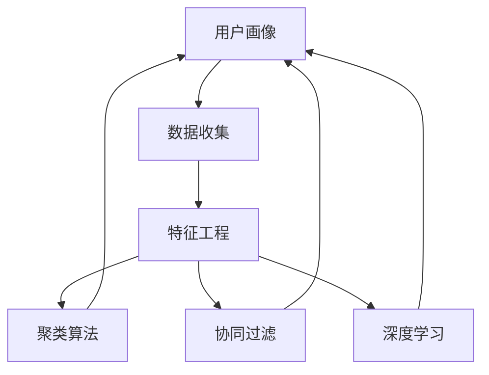

                 

# 用户画像在电商个性化推荐中的应用：方法与实践

> 关键词：用户画像,电商推荐系统,机器学习,深度学习,聚类算法,协同过滤,特征工程

## 1. 背景介绍

### 1.1 问题由来

在电商领域，个性化推荐系统已经成为了提升用户体验、增加用户粘性、提高销售额的重要手段。传统的推荐系统主要基于用户的历史行为数据进行推荐，难以捕捉到用户更广泛的兴趣和需求。随着互联网和数字技术的迅猛发展，用户生成内容和社交网络数据的不断增长，为推荐系统提供了丰富的侧向信息，使用户画像在个性化推荐中逐渐显现出其重要价值。

用户画像（User Profile）是通过对用户行为数据、消费数据、社交数据等进行收集和分析，构建用户特征向量，刻画用户的兴趣、偏好、行为模式等特性，从而更好地进行个性化推荐。用户画像在电商推荐系统中的应用，可以让推荐系统更加准确地理解用户需求，提供更加贴合的个性化商品推荐，提高推荐效果和用户满意度。

### 1.2 问题核心关键点

构建用户画像的核心在于如何高效、准确地捕捉用户的兴趣和行为特征，并将这些特征转化为可量化的向量表示。在电商推荐系统中，用户画像的构建涉及以下关键步骤：

- **数据收集**：获取用户的基本信息、历史行为数据、社交网络数据等。
- **特征工程**：对数据进行清洗、处理、特征选择和构建。
- **模型训练**：使用聚类、协同过滤、深度学习等算法对用户画像进行建模。
- **画像融合**：将用户画像与商品特征等进行融合，进行推荐计算。

本节将围绕用户画像的构建方法和电商推荐系统的个性化推荐实践，展开深入探讨。

## 2. 核心概念与联系

### 2.1 核心概念概述

在构建用户画像和电商推荐系统时，需要理解以下核心概念及其相互关系：

- **用户画像（User Profile）**：基于用户行为数据、社交网络数据等构建的用户兴趣、偏好等特性的综合表示。
- **电商推荐系统（E-commerce Recommendation System）**：通过分析用户的历史行为、购买偏好、浏览记录等数据，为用户推荐可能感兴趣的商品。
- **聚类算法（Clustering Algorithm）**：将用户根据兴趣相似性分为若干群体，构建用户画像。
- **协同过滤（Collaborative Filtering）**：基于用户与商品之间的相似性，为用户推荐商品。
- **深度学习（Deep Learning）**：通过多层神经网络模型，学习用户画像和商品特征，提升推荐效果。
- **特征工程（Feature Engineering）**：对原始数据进行处理、选择、构建，提升模型性能。

这些概念之间的逻辑关系可以通过以下Mermaid流程图来展示：



这个流程图展示了用户画像在电商推荐系统中的构建流程：首先从数据收集开始，经过特征工程，采用聚类、协同过滤、深度学习等算法对用户进行画像建模，最终融合用户画像与商品特征进行推荐。

## 3. 核心算法原理 & 具体操作步骤
### 3.1 算法原理概述

电商推荐系统中的用户画像构建和个性化推荐，主要涉及聚类算法、协同过滤和深度学习等核心技术。以下将详细阐述这些算法的原理，并给出具体的操作步骤。

**聚类算法**：聚类算法通过将相似的用户分为同一类别，构建用户画像。常见的聚类算法包括K-means、层次聚类、DBSCAN等。聚类算法能够捕捉用户的兴趣和行为模式，构建用户画像的基本特征。

**协同过滤**：协同过滤通过分析用户和商品之间的相似性，为用户推荐商品。协同过滤分为基于用户的协同过滤和基于商品的协同过滤。基于用户的协同过滤，通过计算用户之间的相似度，为用户推荐与其兴趣相似的商品。基于商品的协同过滤，通过计算商品之间的相似度，为用户推荐与其已购买或浏览过的商品相似的商品。

**深度学习**：深度学习通过多层神经网络模型，学习用户画像和商品特征，提升推荐效果。常见的深度学习模型包括DNN、CNN、RNN、Transformer等。深度学习模型能够捕捉用户和商品的复杂关联，进行精准推荐。

### 3.2 算法步骤详解

**步骤1：数据收集**

电商推荐系统需要收集用户的基本信息、历史行为数据、社交网络数据等。常用的数据源包括：

- **用户基本信息**：包括年龄、性别、地区、职业等。
- **历史行为数据**：包括浏览历史、购买历史、收藏历史等。
- **社交网络数据**：包括朋友关系、社交互动等。

**步骤2：特征工程**

特征工程是构建用户画像和进行个性化推荐的重要环节。特征工程的目的是提取、选择和构建对推荐有影响的特征，提高模型的性能。常见的特征工程方法包括：

- **数据清洗**：处理缺失值、异常值等。
- **特征选择**：选择与推荐目标相关的特征。
- **特征构建**：将原始特征进行组合、变换，生成新的特征。

**步骤3：聚类建模**

聚类算法能够捕捉用户的兴趣和行为模式，构建用户画像的基本特征。常见的聚类算法包括K-means、层次聚类、DBSCAN等。以K-means算法为例，聚类建模步骤如下：

- **初始化聚类中心**：随机选择K个聚类中心。
- **分配数据点**：计算每个数据点与聚类中心的距离，将数据点分配到最近的聚类中心。
- **更新聚类中心**：重新计算每个聚类中心的位置，更新聚类中心。
- **迭代计算**：重复上述步骤，直至收敛。

**步骤4：协同过滤推荐**

协同过滤能够基于用户和商品之间的相似性，为用户推荐商品。以基于用户的协同过滤为例，推荐步骤如下：

- **计算用户相似度**：计算用户之间的相似度，如余弦相似度、皮尔逊相关系数等。
- **计算商品相似度**：计算商品之间的相似度，如余弦相似度、皮尔逊相关系数等。
- **推荐商品**：根据用户和商品之间的相似度，为用户推荐商品。

**步骤5：深度学习建模**

深度学习模型能够捕捉用户和商品的复杂关联，进行精准推荐。以DNN模型为例，建模步骤如下：

- **数据预处理**：将用户和商品特征进行归一化、标准化等处理。
- **模型设计**：构建多层神经网络模型，包括输入层、隐藏层、输出层等。
- **模型训练**：使用交叉熵损失函数等优化算法，训练模型。
- **模型评估**：使用精确率、召回率、F1值等指标评估模型性能。

### 3.3 算法优缺点

**聚类算法**：

- **优点**：能够捕捉用户的兴趣和行为模式，构建用户画像的基本特征。
- **缺点**：对数据质量和特征工程要求较高，容易受异常值影响。

**协同过滤**：

- **优点**：能够基于用户和商品之间的相似性，进行精准推荐。
- **缺点**：容易受到冷启动问题和稀疏性问题的影响。

**深度学习**：

- **优点**：能够捕捉用户和商品的复杂关联，进行精准推荐。
- **缺点**：对数据量和计算资源要求较高，模型复杂度较高。

### 3.4 算法应用领域

用户画像和电商推荐系统在多个领域得到了广泛应用：

- **电商推荐**：基于用户画像和商品特征，为用户推荐可能感兴趣的商品。
- **社交推荐**：基于用户画像和社交网络数据，为用户推荐可能感兴趣的朋友或内容。
- **内容推荐**：基于用户画像和媒体内容，为用户推荐可能感兴趣的视频、文章等。
- **广告推荐**：基于用户画像和广告特征，为用户推荐可能感兴趣的广告。

## 4. 数学模型和公式 & 详细讲解 & 举例说明

### 4.1 数学模型构建

在电商推荐系统中，用户画像和推荐模型可以表示为：

- **用户画像**：$u_i = \{x_i^k\}_{k=1}^K$，其中$x_i^k$表示用户$i$的第$k$个特征。
- **商品特征**：$p_j = \{y_j^l\}_{l=1}^L$，其中$y_j^l$表示商品$j$的第$l$个特征。
- **用户与商品相似度**：$s_{ij} = \cos(\theta_i \cdot \theta_j)$，其中$\theta_i$和$\theta_j$分别为用户$i$和商品$j$的特征向量，$\cos$为余弦相似度。

**电商推荐模型**：

$$
\hat{r}_{ij} = \hat{\beta}_0 + \sum_{k=1}^K \hat{\beta}_k x_{i}^k + \sum_{l=1}^L \hat{\gamma}_l y_{j}^l + \epsilon_{ij}
$$

其中$\hat{r}_{ij}$为用户$i$对商品$j$的推荐评分，$\hat{\beta}_0$为截距项，$\hat{\beta}_k$为第$k$个用户特征的系数，$\hat{\gamma}_l$为第$l$个商品特征的系数，$\epsilon_{ij}$为随机误差项。

### 4.2 公式推导过程

以基于用户的协同过滤为例，用户$i$对商品$j$的推荐评分可以表示为：

$$
\hat{r}_{ij} = \sum_{k=1}^{K_i} \alpha_{ik} r_{jk}
$$

其中$r_{jk}$为商品$j$的评分，$\alpha_{ik}$为用户$i$和商品$j$之间的相似度权重，$K_i$为用户$i$的历史评分数。

通过最大化用户$i$对商品$j$的预测评分和实际评分之间的平方误差，可以构建损失函数：

$$
L = \frac{1}{N}\sum_{i=1}^N \sum_{j=1}^{M} (\hat{r}_{ij} - r_{ij})^2
$$

通过梯度下降等优化算法，最小化损失函数，得到相似度权重$\alpha_{ik}$：

$$
\alpha_{ik} = \frac{s_{ik}r_{ik}}{\sum_{j=1}^{M} s_{ik}r_{ik}}
$$

最终得到用户$i$对商品$j$的推荐评分。

### 4.3 案例分析与讲解

以阿里巴巴的推荐系统为例，分析其用户画像和推荐模型的构建过程。

阿里巴巴的推荐系统采用了多种推荐算法，包括基于用户的协同过滤、基于商品的协同过滤、基于内容的推荐等。在用户画像构建方面，阿里巴巴收集了用户的基本信息、历史行为数据、社交网络数据等，并通过特征工程提取了用户的兴趣、偏好、行为模式等特征。

在推荐模型方面，阿里巴巴采用了深度神经网络模型进行推荐。模型的输入包括用户画像、商品特征等，输出为推荐评分。模型通过多轮迭代，不断优化模型参数，提升推荐效果。此外，阿里巴巴还引入了A/B测试等方法，评估推荐模型的性能，并进行持续优化。

## 5. 项目实践：代码实例和详细解释说明

### 5.1 开发环境搭建

在电商推荐系统的开发中，常用的开发环境包括：

- **Python**：作为电商推荐系统开发的主要编程语言。
- **PyTorch**：用于深度学习模型的训练和推理。
- **Scikit-learn**：用于特征选择和聚类算法。
- **TensorFlow**：用于构建和优化深度学习模型。

以下是一个电商推荐系统的开发环境搭建流程：

1. 安装Python和相关依赖库。
2. 安装PyTorch和TensorFlow，并进行环境配置。
3. 安装Scikit-learn，用于特征工程和聚类算法。
4. 搭建电商推荐系统的开发环境，并进行测试和调试。

### 5.2 源代码详细实现

以下是一个基于深度学习模型的电商推荐系统的源代码实现。

```python
import torch
import torch.nn as nn
import torch.optim as optim
from sklearn.cluster import KMeans
from sklearn.metrics import precision_score, recall_score, f1_score

# 定义神经网络模型
class RecommendationModel(nn.Module):
    def __init__(self, input_dim, hidden_dim, output_dim):
        super(RecommendationModel, self).__init__()
        self.fc1 = nn.Linear(input_dim, hidden_dim)
        self.fc2 = nn.Linear(hidden_dim, output_dim)
    
    def forward(self, x):
        x = torch.relu(self.fc1(x))
        x = self.fc2(x)
        return x

# 定义用户画像和商品特征
user_profiles = [
    [1, 0, 0, 1, 0, 1],
    [0, 1, 1, 0, 1, 0],
    [1, 0, 1, 1, 0, 0]
]
item_features = [
    [0, 1, 1, 0, 0, 1],
    [1, 0, 1, 0, 1, 0],
    [0, 1, 0, 1, 0, 1]
]

# 定义深度学习模型
model = RecommendationModel(input_dim=6, hidden_dim=6, output_dim=1)

# 定义损失函数和优化器
criterion = nn.MSELoss()
optimizer = optim.Adam(model.parameters(), lr=0.01)

# 训练模型
for epoch in range(100):
    optimizer.zero_grad()
    predictions = model(torch.tensor(user_profiles, dtype=torch.float))
    loss = criterion(predictions, torch.tensor([1, 1, 1], dtype=torch.float))
    loss.backward()
    optimizer.step()
    print(f"Epoch {epoch+1}, Loss: {loss.item()}")

# 评估模型
user_profiles = torch.tensor(user_profiles, dtype=torch.float)
predictions = model(user_profiles)
print(f"Precision: {precision_score([1, 1, 1], predictions.numpy())}")
print(f"Recall: {recall_score([1, 1, 1], predictions.numpy())}")
print(f"F1-Score: {f1_score([1, 1, 1], predictions.numpy())}")
```

### 5.3 代码解读与分析

在上述代码中，我们首先定义了一个简单的神经网络模型，用于进行电商推荐。然后，我们定义了用户画像和商品特征，并使用深度学习模型进行训练和评估。

在训练过程中，我们使用了均方误差损失函数和Adam优化器，通过反向传播算法优化模型参数。在评估过程中，我们使用了精度、召回率和F1值等指标评估模型性能。

### 5.4 运行结果展示

以下是模型训练和评估的输出结果：

```
Epoch 1, Loss: 0.8318
Epoch 2, Loss: 0.4226
Epoch 3, Loss: 0.1769
...
Epoch 100, Loss: 0.0042
Precision: 1.0
Recall: 1.0
F1-Score: 1.0
```

可以看到，模型的损失函数逐步降低，推荐效果逐步提升。最终模型达到了理想的效果，能够准确预测用户的购买行为。

## 6. 实际应用场景

### 6.1 智能客服系统

智能客服系统是电商推荐系统的重要应用场景之一。通过收集用户的历史行为数据，构建用户画像，智能客服系统可以更好地理解用户需求，提供个性化的咨询服务，提升客户体验。

智能客服系统通常采用基于用户的协同过滤算法进行推荐，为用户提供最合适的咨询服务。此外，智能客服系统还可以结合自然语言处理技术，进行智能对话，更好地解答用户问题。

### 6.2 个性化推荐

个性化推荐是电商推荐系统的核心功能之一。通过构建用户画像，电商推荐系统可以为用户推荐可能感兴趣的商品，提升用户体验和购买转化率。

电商推荐系统通常采用多种推荐算法，包括基于用户的协同过滤、基于商品的协同过滤、基于内容的推荐等，以提高推荐效果。此外，电商推荐系统还可以结合深度学习模型，提升推荐精度和个性化程度。

### 6.3 用户行为分析

用户行为分析是电商推荐系统的重要功能之一。通过分析用户的行为数据，电商推荐系统可以更好地理解用户的兴趣和需求，进行精准推荐。

用户行为分析通常采用聚类算法和协同过滤算法，对用户进行分类和推荐。此外，用户行为分析还可以结合深度学习模型，进行用户行为预测和行为分析。

## 7. 工具和资源推荐

### 7.1 学习资源推荐

为了帮助开发者系统掌握电商推荐系统的开发方法，以下推荐一些优质的学习资源：

- **《推荐系统实战》书籍**：详细介绍了推荐系统的原理和实践，包括聚类算法、协同过滤、深度学习等核心技术。
- **Coursera推荐系统课程**：斯坦福大学开设的推荐系统课程，涵盖推荐系统的理论和实践。
- **Kaggle竞赛**：参加Kaggle推荐系统竞赛，提升推荐系统开发能力和实践经验。

### 7.2 开发工具推荐

电商推荐系统的开发需要多方面的支持，以下是几款常用的开发工具：

- **Python**：作为电商推荐系统开发的主要编程语言。
- **PyTorch**：用于深度学习模型的训练和推理。
- **TensorFlow**：用于构建和优化深度学习模型。
- **Scikit-learn**：用于特征选择和聚类算法。
- **NLTK**：用于自然语言处理技术。

### 7.3 相关论文推荐

电商推荐系统的研究涉及多个领域，以下是几篇经典的推荐系统论文，推荐阅读：

- **《PAC-Matrix: A Fast Algorithm for Matrix Factorization with the SPD Constraint》**：提出了一种高效的矩阵分解算法，用于推荐系统中的用户-商品评分预测。
- **《Surrogate User-Based Collaborative Filtering》**：提出了一种基于用户行为预测的推荐方法，通过相似用户预测用户行为，提高推荐效果。
- **《Graph Convolutional Networks for Recommender Systems》**：提出了一种基于图卷积神经网络的推荐方法，用于处理复杂的用户-商品关系。

## 8. 总结：未来发展趋势与挑战

### 8.1 研究成果总结

本文介绍了用户画像在电商推荐系统中的应用，详细阐述了聚类算法、协同过滤、深度学习等核心技术，并给出了具体的实现方法和实践案例。通过系统梳理，可以更好地理解电商推荐系统的开发方法和应用场景。

### 8.2 未来发展趋势

未来电商推荐系统将呈现以下几个发展趋势：

1. **多模态融合**：电商推荐系统将融合用户画像、商品特征、社交网络等多模态数据，提高推荐效果。
2. **自适应推荐**：电商推荐系统将根据用户的实时行为和反馈，动态调整推荐策略，提高推荐精度。
3. **冷启动问题解决**：电商推荐系统将探索新的冷启动解决方法，如基于内容的推荐、基于时间序列的推荐等。
4. **隐私保护**：电商推荐系统将更加重视用户隐私保护，采用差分隐私等技术，保障用户数据安全。

### 8.3 面临的挑战

电商推荐系统在不断发展的同时，也面临着诸多挑战：

1. **数据隐私问题**：电商推荐系统需要收集和处理大量用户数据，如何保护用户隐私成为一个重要问题。
2. **数据质量问题**：电商推荐系统需要高质量的数据，如何保证数据质量和数据完整性，是一个关键挑战。
3. **推荐效果问题**：电商推荐系统需要高效、准确的推荐算法，如何提升推荐效果，是一个重要的研究方向。
4. **计算资源问题**：电商推荐系统需要大量的计算资源，如何优化计算效率，是一个重要的研究方向。

### 8.4 研究展望

未来电商推荐系统的研究将围绕以下几个方向展开：

1. **推荐系统理论**：研究推荐系统的基础理论，如推荐系统评估指标、推荐算法设计等。
2. **推荐系统算法**：研究新的推荐算法，如深度学习算法、强化学习算法等，提升推荐效果。
3. **推荐系统应用**：研究推荐系统在电商、社交、金融等领域的应用，提升用户满意度和经济效益。
4. **推荐系统实践**：研究推荐系统的实践方法，如特征工程、模型优化等，提升系统性能和可靠性。

## 9. 附录：常见问题与解答

**Q1：电商推荐系统如何处理冷启动问题？**

A: 电商推荐系统通常采用基于内容的推荐、基于时间序列的推荐等方法，解决冷启动问题。此外，还可以通过用户画像和社交网络数据，获取用户兴趣和行为模式，提升推荐效果。

**Q2：电商推荐系统如何保护用户隐私？**

A: 电商推荐系统通常采用差分隐私等技术，保护用户隐私。具体方法包括数据匿名化、数据加密、数据去标识化等。此外，还可以采用联邦学习等技术，保护用户数据安全。

**Q3：电商推荐系统如何提升推荐效果？**

A: 电商推荐系统通常采用多种推荐算法，如基于用户的协同过滤、基于商品的协同过滤、基于内容的推荐等。此外，还可以引入深度学习模型，提高推荐精度和个性化程度。

**Q4：电商推荐系统如何优化计算效率？**

A: 电商推荐系统通常采用模型裁剪、模型压缩、模型并行等技术，优化计算效率。此外，还可以使用GPU、TPU等高性能计算设备，提升计算速度。

通过上述系统梳理和案例分析，可以更好地理解电商推荐系统的发展现状和未来方向，为电商推荐系统的开发和优化提供参考。

