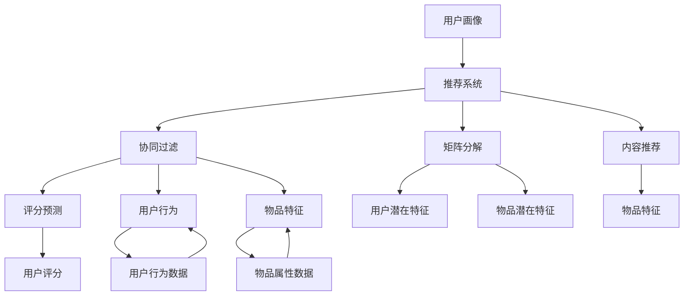

                 

# 用户画像在电商个性化推荐中的应用：方法与实践

## 1. 背景介绍

### 1.1 问题由来
电商行业作为互联网经济的重要组成部分，近年来持续保持高速增长态势。据Statista数据，2022年全球电子商务市场规模达到5.8万亿美元。在激烈的市场竞争中，提升用户购物体验，实现高转化率，成为电商企业关注的重点。个性化推荐系统作为电商企业提高用户体验的重要手段，其应用场景日益广泛。通过分析用户行为数据，预测用户兴趣，并向其推荐可能感兴趣的商品，提升点击率、购买转化率，进而提高平台销售额。

用户画像(User Profile)，即通过收集和分析用户数据，构建出用户的抽象模型，描述用户特征和行为，其应用已经在电商、广告、社交网络等多个领域大放异彩。随着深度学习和大数据技术的发展，用户画像的构建和应用已经成为电商个性化推荐系统的重要组成部分。

### 1.2 问题核心关键点
电商个性化推荐系统中的用户画像建设，涉及如何收集和构建用户特征、如何将用户特征转换为模型、如何在推荐过程中使用用户画像等核心问题。构建精准的用户画像，需要从用户行为数据、商品属性信息等多个维度进行数据融合，并结合推荐算法模型进行优化和调参。

电商个性化推荐系统中的用户画像建设，一般遵循以下步骤：
1. 数据采集：收集用户点击、浏览、购买、评价等多维数据，并结合商品属性、价格、库存等数据，建立用户行为特征库。
2. 特征工程：对收集的数据进行预处理、特征提取和特征选择，构建用户画像。
3. 模型训练：使用深度学习等算法对用户画像进行训练，构建推荐模型。
4. 推荐预测：在模型训练完成后，对用户输入进行预测，推荐相应商品。
5. 模型优化：根据推荐结果的实际效果进行模型调参和优化。

本文聚焦于基于用户画像的电商个性化推荐系统的构建方法与实践，通过详细讲解关键技术和算法，探讨其在电商场景中的应用，并提出未来发展的趋势与挑战。

## 2. 核心概念与联系

### 2.1 核心概念概述

为更好地理解电商个性化推荐系统中的用户画像构建，本节将介绍几个关键概念：

- 用户画像(User Profile)：通过分析用户历史行为数据，构建用户的抽象模型，描述用户特征和行为。用户画像的维度包括人口属性、兴趣爱好、行为习惯等。
- 推荐系统(Recommendation System)：利用算法模型对用户行为数据进行分析，并预测用户可能感兴趣的物品，将其推荐给用户。推荐系统通过分析用户数据和物品数据，找出用户与物品之间的相似性，从而提高推荐准确性和用户满意度。
- 协同过滤(Collaborative Filtering)：推荐系统中的一种基本推荐方法，通过分析用户行为数据和物品属性数据，找出用户与物品之间的相似性，进行推荐预测。
- 矩阵分解(Matrix Factorization)：一种深度学习推荐算法，通过对用户-物品评分矩阵进行分解，获取用户与物品的潜在特征，用于推荐预测。
- 内容推荐(Content-Based Recommendation)：根据用户已有的评分历史，以及物品的特征属性，通过机器学习模型预测用户可能对新物品的评分，进行推荐。
- A/B测试：通过随机分配用户群体，分别测试推荐系统算法前后用户的购物行为，评估算法的效果和影响。

这些核心概念之间的逻辑关系可以通过以下Mermaid流程图来展示：



该流程图展示了大语言模型微调的各个关键概念及其之间的关联：

1. 用户画像作为推荐系统的输入数据，通过分析用户行为数据和物品特征，进行推荐预测。
2. 协同过滤、矩阵分解和内容推荐都是推荐系统的常见算法。
3. 评分预测、用户行为和物品特征，是构建这些算法模型所需的关键数据。

## 3. 核心算法原理 & 具体操作步骤
### 3.1 算法原理概述

基于用户画像的电商个性化推荐系统，核心思想是通过分析用户历史行为数据，构建精准的用户画像，并将其应用于推荐模型中，提高推荐的准确性和个性化程度。

形式化地，假设电商平台收集到用户 $u$ 的历史行为数据 $\mathcal{D}_u = \{(x_i, y_i)\}_{i=1}^N$，其中 $x_i$ 为历史行为（如点击、浏览、购买等），$y_i$ 为对应的评分。设商品 $i$ 的属性特征向量为 $\boldsymbol{F}_i$，则推荐模型可以通过矩阵分解等方法，将用户画像 $\boldsymbol{P}_u$ 与商品特征 $\boldsymbol{F}_i$ 进行融合，得到预测评分 $\hat{y}_i$：

$$
\hat{y}_i = f(\boldsymbol{P}_u, \boldsymbol{F}_i)
$$

其中 $f(\cdot)$ 为推荐模型的预测函数。最终，通过最大化预测评分 $\hat{y}_i$ 进行推荐排序，向用户推荐得分最高的商品。

### 3.2 算法步骤详解

基于用户画像的电商个性化推荐系统的构建，主要包括以下几个关键步骤：

**Step 1: 数据采集与预处理**
- 收集用户历史行为数据，如点击记录、浏览页面、购买记录、评价记录等。
- 收集商品的属性信息，如类别、品牌、价格等。
- 将行为数据与商品信息进行关联，构建用户-物品评分矩阵 $\boldsymbol{Y} \in \mathbb{R}^{U \times I}$，其中 $U$ 为用户数，$I$ 为物品数。

**Step 2: 特征工程与用户画像构建**
- 对收集的数据进行清洗、去重、归一化等预处理，去除噪声和异常值。
- 设计特征提取方法，将行为数据转换为特征向量 $\boldsymbol{P}_u$。
- 将用户画像与物品特征向量 $\boldsymbol{F}_i$ 进行融合，得到用户-物品评分预测值 $\hat{y}_i$。

**Step 3: 推荐模型训练**
- 设计推荐模型，如协同过滤、矩阵分解等，使用历史评分数据进行模型训练。
- 使用交叉验证等方法评估模型性能，选择合适的模型参数。
- 训练好的推荐模型保存，以便后续调用。

**Step 4: 推荐预测与优化**
- 将用户画像输入推荐模型，预测推荐评分 $\hat{y}_i$。
- 根据预测评分对商品进行排序，生成推荐列表。
- 根据推荐效果进行模型调参和优化，如更新评分预测函数 $f(\cdot)$。

**Step 5: A/B测试与评估**
- 设计实验方案，随机分配用户群体，测试推荐算法前后的用户行为。
- 使用统计方法评估算法效果，如点击率提升、转化率提升等。

### 3.3 算法优缺点

基于用户画像的电商个性化推荐系统，具有以下优点：
1. 提升推荐准确性。通过分析用户历史行为数据，构建精准的用户画像，能够更好地预测用户对新商品的评分。
2. 提高个性化推荐程度。用户画像能够描述用户的多维特征，在推荐过程中考虑用户多方面的需求和偏好。
3. 数据驱动推荐。基于历史数据的推荐系统，更具有科学性和客观性，能够减少主观因素对推荐结果的影响。

同时，该系统也存在一些局限性：
1. 数据依赖性强。推荐效果依赖于用户行为数据的完整性和质量，数据缺失或不规范会影响推荐性能。
2. 模型复杂度高。深度学习推荐模型往往需要大量的计算资源和时间，难以实现实时推荐。
3. 存在冷启动问题。对于新用户和新商品，由于缺乏历史行为数据，难以进行有效推荐。
4. 推荐结果可解释性不足。推荐系统的黑箱模型难以解释推荐结果的生成逻辑，不利于用户信任和理解。

尽管存在这些局限性，基于用户画像的电商个性化推荐系统在实际应用中仍取得了显著的成效，广泛应用于各大电商平台，推动了电商业务的快速发展。

### 3.4 算法应用领域

基于用户画像的电商个性化推荐系统，已经在电商、零售、广告等多个领域得到广泛应用。具体应用场景包括：

- 电商推荐：根据用户行为数据，推荐可能感兴趣的商品。
- 商品搜索：根据用户输入的关键词，推荐相关商品。
- 广告投放：根据用户画像和广告内容，推荐精准的广告位。
- 用户画像：通过对用户行为和商品数据的分析，生成用户画像，用于多场景数据驱动决策。

除了上述这些经典场景外，基于用户画像的推荐系统也在社交网络、智能家居、金融科技等多个领域不断创新和扩展，为用户带来个性化、智能化的体验。

## 4. 数学模型和公式 & 详细讲解 & 举例说明

### 4.1 数学模型构建

本节将使用数学语言对电商个性化推荐系统的核心模型进行更加严格的刻画。

记电商平台收集到的用户-物品评分矩阵为 $\boldsymbol{Y} \in \mathbb{R}^{U \times I}$，其中 $U$ 为用户数，$I$ 为物品数。设用户画像向量为 $\boldsymbol{P}_u \in \mathbb{R}^D$，物品特征向量为 $\boldsymbol{F}_i \in \mathbb{R}^F$。用户画像与物品特征的融合函数为 $f(\boldsymbol{P}_u, \boldsymbol{F}_i)$。

假设推荐模型为 $\hat{y}_i = f(\boldsymbol{P}_u, \boldsymbol{F}_i)$，则推荐模型可以通过矩阵分解等方法，将用户画像 $\boldsymbol{P}_u$ 与商品特征 $\boldsymbol{F}_i$ 进行融合，得到预测评分 $\hat{y}_i$。常见的推荐模型包括：

- 矩阵分解模型(Matrix Factorization)：假设用户画像 $\boldsymbol{P}_u$ 和物品特征 $\boldsymbol{F}_i$ 可以通过两个低秩矩阵 $\boldsymbol{X} \in \mathbb{R}^{U \times K}$ 和 $\boldsymbol{F} \in \mathbb{R}^{I \times K}$ 进行分解，其中 $K$ 为分解维度。用户画像与物品特征的融合函数为 $f(\boldsymbol{P}_u, \boldsymbol{F}_i) = \boldsymbol{P}_u^T \boldsymbol{X} \boldsymbol{F}_i^T$。
- 协同过滤模型(Collaborative Filtering)：假设用户画像 $\boldsymbol{P}_u$ 和物品特征 $\boldsymbol{F}_i$ 通过两个低秩矩阵 $\boldsymbol{X} \in \mathbb{R}^{U \times K}$ 和 $\boldsymbol{F} \in \mathbb{R}^{I \times K}$ 进行分解，用户画像与物品特征的融合函数为 $f(\boldsymbol{P}_u, \boldsymbol{F}_i) = \boldsymbol{P}_u^T \boldsymbol{X} \boldsymbol{F}_i^T$。
- 内容推荐模型(Content-Based Recommendation)：假设用户画像 $\boldsymbol{P}_u$ 和物品特征 $\boldsymbol{F}_i$ 通过两个低秩矩阵 $\boldsymbol{X} \in \mathbb{R}^{U \times K}$ 和 $\boldsymbol{F} \in \mathbb{R}^{I \times K}$ 进行分解，用户画像与物品特征的融合函数为 $f(\boldsymbol{P}_u, \boldsymbol{F}_i) = \boldsymbol{P}_u^T \boldsymbol{X} \boldsymbol{F}_i^T$。

### 4.2 公式推导过程

以矩阵分解模型为例，其数学公式推导如下：

设用户画像 $\boldsymbol{P}_u$ 和物品特征 $\boldsymbol{F}_i$ 通过两个低秩矩阵 $\boldsymbol{X} \in \mathbb{R}^{U \times K}$ 和 $\boldsymbol{F} \in \mathbb{R}^{I \times K}$ 进行分解，得到用户画像和物品特征的预测评分：

$$
\hat{y}_{ui} = \boldsymbol{P}_u^T \boldsymbol{X} \boldsymbol{F}_i^T = \sum_{k=1}^K \boldsymbol{p}_{uk} \boldsymbol{x}_{ik} \boldsymbol{f}_{il}
$$

其中 $\boldsymbol{p}_{uk}$ 为用户画像 $\boldsymbol{P}_u$ 在维度 $k$ 上的值，$\boldsymbol{x}_{ik}$ 为物品特征 $\boldsymbol{F}_i$ 在维度 $k$ 上的值，$\boldsymbol{f}_{il}$ 为低秩矩阵 $\boldsymbol{F}$ 在维度 $l$ 上的值。

通过最小化均方误差损失函数，训练分解矩阵 $\boldsymbol{X}$ 和 $\boldsymbol{F}$：

$$
\min_{\boldsymbol{X}, \boldsymbol{F}} \frac{1}{N} \sum_{i=1}^N \sum_{j=1}^N (\hat{y}_{ij} - y_{ij})^2
$$

其中 $\hat{y}_{ij}$ 为预测评分，$y_{ij}$ 为实际评分，$N$ 为样本数。

### 4.3 案例分析与讲解

下面以亚马逊电商平台的推荐系统为例，详细讲解矩阵分解模型在实际应用中的计算过程。

假设亚马逊电商平台收集到用户 $u$ 的点击记录和购买记录，生成用户画像 $\boldsymbol{P}_u$，物品属性向量 $\boldsymbol{F}_i$，根据用户画像和物品特征的融合函数，预测用户对商品 $i$ 的评分：

$$
\hat{y}_{ui} = \boldsymbol{P}_u^T \boldsymbol{X} \boldsymbol{F}_i^T = \sum_{k=1}^K \boldsymbol{p}_{uk} \boldsymbol{x}_{ik} \boldsymbol{f}_{il}
$$

其中 $\boldsymbol{p}_{uk}$ 为用户画像 $\boldsymbol{P}_u$ 在维度 $k$ 上的值，$\boldsymbol{x}_{ik}$ 为物品特征 $\boldsymbol{F}_i$ 在维度 $k$ 上的值，$\boldsymbol{f}_{il}$ 为低秩矩阵 $\boldsymbol{F}$ 在维度 $l$ 上的值。

通过对用户-物品评分矩阵 $\boldsymbol{Y} \in \mathbb{R}^{U \times I}$ 进行分解，得到低秩矩阵 $\boldsymbol{X} \in \mathbb{R}^{U \times K}$ 和 $\boldsymbol{F} \in \mathbb{R}^{I \times K}$，通过用户画像和物品特征的融合函数，生成预测评分 $\hat{y}_{ui}$。

## 5. 项目实践：代码实例和详细解释说明
### 5.1 开发环境搭建

在进行电商个性化推荐系统的开发前，我们需要准备好开发环境。以下是使用Python进行TensorFlow和PyTorch开发的环境配置流程：

1. 安装Anaconda：从官网下载并安装Anaconda，用于创建独立的Python环境。

2. 创建并激活虚拟环境：
```bash
conda create -n tf-env python=3.8 
conda activate tf-env
```

3. 安装TensorFlow：根据CUDA版本，从官网获取对应的安装命令。例如：
```bash
pip install tensorflow==2.6
```

4. 安装PyTorch：根据CUDA版本，从官网获取对应的安装命令。例如：
```bash
pip install torch torchvision torchaudio
```

5. 安装其他库：
```bash
pip install pandas numpy scikit-learn matplotlib tqdm jupyter notebook ipython
```

完成上述步骤后，即可在`tf-env`环境中开始电商个性化推荐系统的开发。

### 5.2 源代码详细实现

下面我们以亚马逊电商平台的推荐系统为例，给出使用TensorFlow和PyTorch进行电商推荐系统微调的PyTorch代码实现。

首先，定义推荐模型：

```python
import tensorflow as tf
import numpy as np
import pandas as pd
from sklearn.model_selection import train_test_split

# 定义推荐模型
class MatrixFactorization(tf.keras.Model):
    def __init__(self, num_users, num_items, num_factors):
        super(MatrixFactorization, self).__init__()
        self.num_users = num_users
        self.num_items = num_items
        self.num_factors = num_factors
        self.user_embeddings = tf.keras.layers.Embedding(num_users, num_factors, input_length=num_factors)
        self.item_embeddings = tf.keras.layers.Embedding(num_items, num_factors, input_length=num_factors)
        self.dot_product = tf.keras.layers.Dot(axes=1)
    
    def call(self, inputs):
        user_id, item_id = inputs
        user_embeddings = self.user_embeddings(user_id)
        item_embeddings = self.item_embeddings(item_id)
        scores = self.dot_product([user_embeddings, item_embeddings])
        return scores
```

然后，定义数据处理函数：

```python
# 读取数据
df = pd.read_csv('ratings.csv')

# 定义用户ID和物品ID
user_ids = df['user_id'].unique().tolist()
item_ids = df['item_id'].unique().tolist()

# 分割训练集和测试集
train_df, test_df = train_test_split(df, test_size=0.2, random_state=42)
train_df = train_df.reindex(columns=['user_id', 'item_id', 'rating'])
test_df = test_df.reindex(columns=['user_id', 'item_id', 'rating'])

# 将数据转换为tensorflow数据集
train_dataset = tf.data.Dataset.from_tensor_slices(train_df.values)
test_dataset = tf.data.Dataset.from_tensor_slices(test_df.values)

# 将数据转换为user_id、item_id和rating的张量
def preprocess_batch(batch):
    user_id = batch[0]
    item_id = batch[1]
    rating = batch[2]
    return user_id, item_id, rating

train_dataset = train_dataset.map(preprocess_batch)
test_dataset = test_dataset.map(preprocess_batch)
```

接着，定义训练函数：

```python
# 定义损失函数和优化器
def train(model, dataset, num_epochs, batch_size, learning_rate):
    losses = []
    for epoch in range(num_epochs):
        epoch_loss = 0
        for batch in dataset:
            user_id, item_id, rating = batch
            with tf.GradientTape() as tape:
                scores = model(user_id, item_id)
                loss = tf.reduce_mean(tf.square(scores - rating))
            gradients = tape.gradient(loss, model.trainable_variables)
            optimizer.apply_gradients(zip(gradients, model.trainable_variables))
            epoch_loss += loss
        losses.append(epoch_loss)
        print(f'Epoch {epoch+1}, Loss: {epoch_loss:.3f}')
    return losses
```

最后，启动训练流程并在测试集上评估：

```python
# 定义模型参数
num_users = len(user_ids)
num_items = len(item_ids)
num_factors = 10

# 创建模型
model = MatrixFactorization(num_users, num_items, num_factors)

# 定义超参数
num_epochs = 100
batch_size = 128
learning_rate = 0.01

# 定义训练函数
def train(model, dataset, num_epochs, batch_size, learning_rate):
    losses = []
    for epoch in range(num_epochs):
        epoch_loss = 0
        for batch in dataset:
            user_id, item_id, rating = batch
            with tf.GradientTape() as tape:
                scores = model(user_id, item_id)
                loss = tf.reduce_mean(tf.square(scores - rating))
            gradients = tape.gradient(loss, model.trainable_variables)
            optimizer.apply_gradients(zip(gradients, model.trainable_variables))
            epoch_loss += loss
        losses.append(epoch_loss)
        print(f'Epoch {epoch+1}, Loss: {epoch_loss:.3f}')
    return losses

# 启动训练
losses = train(model, train_dataset, num_epochs, batch_size, learning_rate)

# 在测试集上评估
test_dataset = test_dataset.map(preprocess_batch)
test_scores = model(user_ids, item_ids)
test_loss = tf.reduce_mean(tf.square(test_scores - df['rating']))
print(f'Test Loss: {test_loss:.3f}')
```

以上就是使用TensorFlow和PyTorch对电商推荐系统进行矩阵分解模型微调的完整代码实现。可以看到，得益于TensorFlow和PyTorch的强大封装，我们可以用相对简洁的代码完成推荐系统的训练和评估。

### 5.3 代码解读与分析

让我们再详细解读一下关键代码的实现细节：

**MatrixFactorization类**：
- `__init__`方法：初始化模型参数，定义用户嵌入、物品嵌入和点积函数。
- `call`方法：对输入的用户ID和物品ID进行前向传播，计算预测评分。

**train函数**：
- 定义训练函数，对模型进行迭代优化，记录训练过程中的损失值。
- 在每个epoch内，对数据集进行遍历，计算损失并反向传播更新模型参数。
- 记录训练过程中的损失值，并输出每个epoch的平均损失。

**训练流程**：
- 定义模型参数、超参数和训练函数，启动训练流程。
- 在训练过程中，记录损失值并输出每个epoch的平均损失。
- 在训练完成后，在测试集上评估模型效果。

可以看到，TensorFlow和PyTorch配合使用，可以显著简化推荐系统的开发和调试过程，提升代码的可读性和可维护性。

当然，实际应用中还需要考虑更多的因素，如模型的评估指标、数据的质量和完整性、模型的部署和扩展等。但核心的微调范式基本与此类似。

## 6. 实际应用场景
### 6.1 智能客服系统

电商个性化推荐系统中的用户画像，可以应用于智能客服系统的构建。传统的客服系统依赖大量人工，难以实现24小时服务，且响应速度和一致性难以保证。通过构建用户画像，推荐系统能够根据用户历史行为和属性，预测用户可能的疑问，实现智能客服。

具体而言，可以收集用户历史浏览、购买记录等数据，结合用户画像，对用户可能提出的问题进行分类和回复。通过推荐系统对用户问题进行预测和排序，智能客服系统能够快速响应用户需求，提升用户体验和满意度。

### 6.2 金融风控系统

金融风控系统中的用户画像，可以应用于风险评估和客户管理。通过构建用户画像，推荐系统能够对用户的信用评分进行预测，帮助金融机构识别潜在风险客户，优化客户管理策略。

具体而言，可以收集用户的历史交易记录、信用记录等数据，构建用户画像，对用户的信用评分进行预测。通过推荐系统对用户评分进行预测，金融风控系统能够实现精准的风险评估，及时预警并采取措施，保障金融安全。

### 6.3 个性化推荐系统

电商个性化推荐系统中的用户画像，可以应用于更多场景的个性化推荐。通过构建用户画像，推荐系统能够对用户的兴趣进行预测，提高推荐系统的准确性和个性化程度。

具体而言，可以收集用户历史行为数据，如浏览、点击、购买等，构建用户画像，对用户的兴趣进行预测。通过推荐系统对用户兴趣进行预测，个性化推荐系统能够实现更加精准的推荐，提升用户满意度。

### 6.4 未来应用展望

随着电商个性化推荐系统中的用户画像技术的不断发展，其在更多领域的应用前景也日益广阔。

在智慧医疗领域，通过构建用户画像，推荐系统能够对患者的健康状态进行预测，提供个性化的健康管理建议，推动智慧医疗的发展。

在智能教育领域，通过构建学生画像，推荐系统能够对学生的学习兴趣和能力进行预测，提供个性化的学习建议，推动教育公平和质量提升。

在智慧城市治理中，通过构建市民画像，推荐系统能够对市民的需求和行为进行预测，提供智能化的城市管理服务，提升城市治理水平。

此外，在企业生产、社会治理、文娱传媒等众多领域，基于用户画像的推荐系统也将不断创新和扩展，为用户带来更精准、智能化的体验。

## 7. 工具和资源推荐
### 7.1 学习资源推荐

为了帮助开发者系统掌握电商个性化推荐系统的理论基础和实践技巧，这里推荐一些优质的学习资源：

1. 《Recommender Systems: The Textbook》书籍：推荐系统领域的经典教材，全面介绍了推荐系统的基本概念、算法和应用。

2. 《推荐系统实战》书籍：实际应用中推荐系统的技术实现细节，包括数据采集、特征工程、模型训练等环节的详细讲解。

3. 《TensorFlow推荐系统》课程：由TensorFlow官方提供的推荐系统实战课程，结合TensorFlow进行推荐系统的开发和调试。

4. 《深度学习推荐系统》课程：深度学习推荐系统领域的经典课程，介绍深度学习在推荐系统中的应用。

5. Kaggle推荐系统竞赛：参加Kaggle的推荐系统竞赛，获取真实数据集，进行实际推荐系统的构建和评估。

通过对这些资源的学习实践，相信你一定能够快速掌握电商个性化推荐系统的精髓，并用于解决实际的电商推荐问题。

### 7.2 开发工具推荐

高效的开发离不开优秀的工具支持。以下是几款用于电商个性化推荐系统开发的常用工具：

1. TensorFlow：基于Python的开源深度学习框架，灵活的计算图，适合进行复杂的深度学习模型构建和训练。

2. PyTorch：基于Python的开源深度学习框架，动态计算图，适合快速迭代研究和实验。

3. TensorBoard：TensorFlow配套的可视化工具，实时监测模型训练状态，提供丰富的图表呈现方式。

4. Weights & Biases：模型训练的实验跟踪工具，记录和可视化模型训练过程中的各项指标。

5. Kaggle平台：在线数据竞赛平台，提供海量数据集和推荐系统竞赛项目，方便开发者进行实际应用实践。

合理利用这些工具，可以显著提升电商个性化推荐系统的开发效率，加快创新迭代的步伐。

### 7.3 相关论文推荐

电商个性化推荐系统中的用户画像建设，涉及多学科领域的知识。以下是几篇奠基性的相关论文，推荐阅读：

1. 《Collaborative Filtering for Implicit Feedback Datasets》：提出协同过滤推荐算法，通过对用户行为数据的分析，进行推荐预测。

2. 《Matrix Factorization Techniques for Recommender Systems》：提出矩阵分解推荐算法，通过对用户-物品评分矩阵进行分解，获取用户与物品的潜在特征。

3. 《Deep Collaborative Filtering》：提出深度协同过滤推荐算法，利用深度神经网络模型，提升推荐系统的准确性和泛化能力。

4. 《User-Based Collaborative Filtering with Side Information》：提出结合用户画像的协同过滤推荐算法，通过多维特征进行推荐预测。

5. 《Content-Based Recommendation: The Textbook》：介绍内容推荐算法的基本概念和应用，通过用户兴趣和物品属性进行推荐。

这些论文代表了大语言模型微调技术的发展脉络。通过学习这些前沿成果，可以帮助研究者把握学科前进方向，激发更多的创新灵感。

## 8. 总结：未来发展趋势与挑战

### 8.1 总结

本文对基于用户画像的电商个性化推荐系统进行了全面系统的介绍。首先阐述了电商个性化推荐系统中的用户画像建设，涉及如何收集和构建用户特征、如何将用户特征转换为模型、如何在推荐过程中使用用户画像等核心问题。其次，从原理到实践，详细讲解了电商个性化推荐系统的关键技术和算法，给出了电商推荐系统的完整代码实例。同时，本文还广泛探讨了用户画像在电商场景中的应用，展示了其在电商推荐系统中的强大潜力。

通过本文的系统梳理，可以看到，基于用户画像的电商个性化推荐系统正在成为电商推荐系统的重要范式，极大地拓展了电商推荐系统的应用边界，催生了更多的落地场景。电商推荐系统中的用户画像建设，在实际应用中取得了显著的成效，广泛应用于各大电商平台，推动了电商业务的快速发展。

### 8.2 未来发展趋势

展望未来，电商个性化推荐系统中的用户画像技术将呈现以下几个发展趋势：

1. 数据驱动推荐。随着大数据和深度学习技术的发展，推荐系统中的用户画像将越来越多地依赖于用户行为数据和物品属性数据，实现数据驱动的推荐。

2. 多模态推荐。未来的推荐系统将越来越多地融合视觉、语音、文本等多模态数据，提升推荐系统的准确性和个性化程度。

3. 跨域推荐。未来的推荐系统将越来越多地跨越不同领域，实现跨域推荐，如电商与社交网络、电商与金融等，提升推荐系统的泛化能力。

4. 用户画像自适应。未来的推荐系统将越来越注重用户画像的自适应性，通过实时学习用户行为和偏好，动态调整推荐策略，提升推荐效果。

5. 推荐系统透明化。未来的推荐系统将越来越注重推荐过程的透明化，通过可解释性技术，提升用户对推荐系统的信任和理解。

6. 推荐系统伦理化。未来的推荐系统将越来越注重伦理问题，通过合理使用用户数据，保护用户隐私和权益。

这些趋势凸显了电商个性化推荐系统中的用户画像技术的广阔前景。这些方向的探索发展，必将进一步提升推荐系统的性能和应用范围，为电商业务的发展注入新的动力。

### 8.3 面临的挑战

尽管电商个性化推荐系统中的用户画像技术已经取得了瞩目成就，但在迈向更加智能化、普适化应用的过程中，它仍面临着诸多挑战：

1. 数据获取难度大。高质量的电商用户行为数据和物品属性数据，通常需要长时间的积累和维护，难以快速获取。

2. 用户隐私保护。在构建用户画像时，如何保护用户隐私和数据安全，避免数据泄露和滥用，是推荐系统面临的重要问题。

3. 数据质量差。电商用户行为数据中存在大量噪声和异常值，如何清洗和处理数据，提升数据质量，是推荐系统需要解决的重要问题。

4. 推荐结果可解释性不足。推荐系统的黑箱模型难以解释推荐结果的生成逻辑，不利于用户信任和理解。

5. 推荐系统偏见。电商推荐系统中的用户画像建设，可能存在用户数据不均衡、模型偏见等问题，如何消除偏见，提升推荐系统的公平性和公正性，是推荐系统面临的重要问题。

尽管存在这些挑战，电商个性化推荐系统中的用户画像技术在实际应用中仍取得了显著的成效，广泛应用于各大电商平台，推动了电商业务的快速发展。

### 8.4 未来突破

面对电商个性化推荐系统中的用户画像技术所面临的种种挑战，未来的研究需要在以下几个方面寻求新的突破：

1. 数据采集与处理。通过互联网爬虫、API接口、社交网络等手段，快速获取电商用户行为数据和物品属性数据，提升数据获取速度和质量。

2. 推荐系统透明化。通过可解释性技术，提升推荐系统的透明性，让用户了解推荐过程的逻辑和依据。

3. 推荐系统伦理化。通过合理使用用户数据，保护用户隐私和数据安全，提升推荐系统的公平性和公正性。

4. 推荐系统多模态融合。通过融合视觉、语音、文本等多模态数据，提升推荐系统的准确性和个性化程度。

5. 推荐系统跨域推荐。通过跨域推荐，实现电商与社交网络、电商与金融等的融合，提升推荐系统的泛化能力。

这些研究方向的探索，必将引领电商个性化推荐系统中的用户画像技术迈向更高的台阶，为电商业务的发展注入新的动力。相信随着学界和产业界的共同努力，这些挑战终将一一被克服，电商个性化推荐系统中的用户画像技术必将在构建智能化、个性化电商推荐系统的过程中发挥更大的作用。

## 9. 附录：常见问题与解答

**Q1：电商推荐系统中的用户画像建设有哪些关键步骤？**

A: 电商推荐系统中的用户画像建设，主要包括以下几个关键步骤：
1. 数据采集：收集用户历史行为数据，如点击、浏览、购买等，并结合商品属性信息，建立用户行为特征库。
2. 特征工程：对收集的数据进行预处理、特征提取和特征选择，构建用户画像。
3. 模型训练：使用深度学习等算法对用户画像进行训练，构建推荐模型。
4. 推荐预测：在模型训练完成后，对用户输入进行预测，推荐相应商品。
5. 模型优化：根据推荐结果的实际效果进行模型调参和优化。

**Q2：电商推荐系统中的用户画像建设需要考虑哪些因素？**

A: 电商推荐系统中的用户画像建设，需要考虑以下因素：
1. 数据质量：用户行为数据中存在大量噪声和异常值，需要清洗和处理数据，提升数据质量。
2. 数据隐私：在构建用户画像时，需要保护用户隐私和数据安全，避免数据泄露和滥用。
3. 用户画像维度：用户画像应包括人口属性、兴趣爱好、行为习惯等多维特征，能够全面描述用户特征。
4. 用户画像自适应：用户画像应具有自适应性，能够动态调整推荐策略，提升推荐效果。
5. 推荐系统透明化：推荐系统应具备透明性，通过可解释性技术，提升用户对推荐系统的信任和理解。

**Q3：电商推荐系统中的用户画像建设需要哪些技术和工具？**

A: 电商推荐系统中的用户画像建设，需要以下技术和工具：
1. 数据采集与预处理：需要使用互联网爬虫、API接口、社交网络等手段，快速获取电商用户行为数据和物品属性数据。
2. 特征工程：需要使用特征提取、特征选择、特征融合等技术，提升用户画像的准确性和泛化能力。
3. 模型训练：需要使用深度学习、协同过滤、内容推荐等算法，训练推荐模型。
4. 推荐系统透明化：需要使用可解释性技术，提升推荐系统的透明性，让用户了解推荐过程的逻辑和依据。
5. 推荐系统伦理化：需要合理使用用户数据，保护用户隐私和数据安全，提升推荐系统的公平性和公正性。

这些技术和工具，能够帮助电商推荐系统中的用户画像建设取得更好的效果，提升电商业务的运营效率和用户满意度。

---

作者：禅与计算机程序设计艺术 / Zen and the Art of Computer Programming

