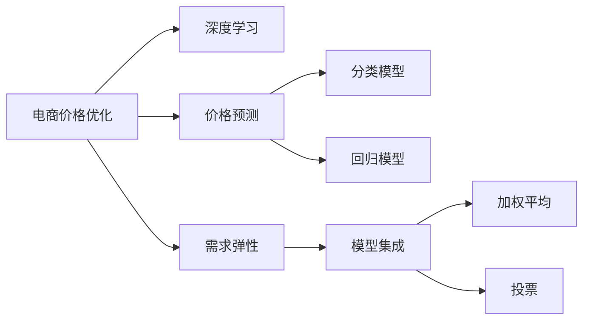

                 

# 电商价格优化的实践效果

## 1. 背景介绍

在现代电商环境中，价格优化是企业提高竞争力和提升用户购买意愿的重要手段。价格优化的目标是通过动态调整商品价格，吸引更多的消费者，从而实现销售最大化和利润最大化。然而，价格优化并不是一件简单的事情，它涉及到复杂的市场分析、需求预测和定价策略。传统的价格优化方法通常依赖于人工经验和有限的静态数据，难以满足现代电商快速变化的市场环境。

近年来，随着人工智能技术的迅猛发展，特别是深度学习和大数据技术的应用，为电商价格优化提供了新的解决方案。深度学习可以自动从大规模历史数据中挖掘出价格和需求之间的复杂关系，从而实现更加精准的价格预测和优化。本文将介绍一种基于深度学习的电商价格优化方法，并展示其在实际应用中的效果。

## 2. 核心概念与联系

### 2.1 核心概念概述

为了更好地理解电商价格优化的深度学习方法，本节将介绍几个密切相关的核心概念：

- **电商价格优化**：指通过动态调整商品价格，提高销售额和利润的过程。常见的电商价格优化方法包括固定定价、折扣促销、满减优惠等。
- **深度学习**：基于神经网络模型，通过大量数据训练，学习出复杂的特征表示，用于分类、回归、生成等任务。
- **价格预测**：通过深度学习模型，预测商品在不同价格下的销售量或转化率，从而辅助价格优化决策。
- **需求弹性**：指商品价格变化对需求量的影响程度，通常用价格弹性的绝对值来表示。
- **模型集成**：将多个深度学习模型的输出进行加权平均或投票，提升整体预测准确性和鲁棒性。

这些核心概念之间的逻辑关系可以通过以下Mermaid流程图来展示：



这个流程图展示了电商价格优化的核心概念及其之间的关系：

1. 电商价格优化依赖于深度学习技术，通过价格预测和需求弹性分析，辅助价格优化决策。
2. 价格预测使用分类模型或回归模型，分别预测不同价格下的销售类别或转化率。
3. 需求弹性分析用于衡量价格变化对需求的影响，通过模型集成技术得到更加准确和鲁棒的结果。

这些概念共同构成了电商价格优化的学习和应用框架，使其能够在各种场景下发挥作用。通过理解这些核心概念，我们可以更好地把握电商价格优化的工作原理和优化方向。

## 3. 核心算法原理 & 具体操作步骤
### 3.1 算法原理概述

电商价格优化方法的核心在于构建一个能够预测价格与销售量关系的深度学习模型。该模型的输入包括商品特征、历史价格和销售数据等，输出为在给定价格下预测的销售量或转化率。通过不断调整价格，使模型预测的销售量最大化，从而实现价格优化。

形式化地，假设电商平台上有 $n$ 种商品，每种商品的特征表示为 $x_i$，历史价格为 $p_i$，销售量为 $y_i$。电商价格优化的目标是最小化预测销售量与实际销售量的差距，即：

$$
\min_{\theta} \sum_{i=1}^n (y_i - \hat{y}_i)^2
$$

其中 $\hat{y}_i$ 为模型预测的销售量，$\theta$ 为模型参数。为了使模型能够捕捉价格与销售量之间的非线性关系，我们通常使用深度神经网络模型，如多层感知机(Multi-Layer Perceptron, MLP)、卷积神经网络(Convolutional Neural Network, CNN)等。

### 3.2 算法步骤详解

电商价格优化的深度学习模型构建和训练过程一般包括以下几个关键步骤：

**Step 1: 数据预处理**

电商平台需要收集和整理大量的历史销售数据、商品特征和价格数据。对数据进行清洗、去重、归一化等预处理，以便用于深度学习模型的训练和预测。

**Step 2: 特征工程**

构建商品特征向量，包括商品类别、大小、品牌、用户评分、历史销售记录等。特征工程是模型构建的关键步骤，优秀的特征选择和构造可以提高模型的预测准确性。

**Step 3: 模型选择与训练**

选择合适的深度学习模型（如MLP、CNN等），并使用历史数据对其进行训练。训练过程中，根据预测的销售量与实际销售量的差距，不断调整模型参数，以最小化预测误差。

**Step 4: 价格预测与优化**

利用训练好的模型对新商品的不同价格进行预测，并选择最优价格，以最大化预测销售量。这可以通过迭代搜索或遗传算法等方法实现。

**Step 5: 实时监控与调整**

在实际应用中，电商平台需要实时监控销售数据和用户行为，根据最新数据对模型进行更新和调整，以应对市场变化和用户需求。

### 3.3 算法优缺点

电商价格优化的深度学习方法具有以下优点：

1. **准确性高**：通过学习大量历史数据，模型能够挖掘出复杂的非线性关系，实现高精度的价格预测和优化。
2. **自适应能力强**：模型可以动态调整，快速适应市场变化和用户需求。
3. **可扩展性好**：深度学习模型能够处理大规模数据，适用于电商平台的复杂需求。
4. **实时性高**：通过实时监控和调整，电商平台可以实现高效的动态价格优化。

同时，该方法也存在以下局限性：

1. **数据依赖性强**：模型的效果很大程度上取决于数据的质量和数量，获取高质量标注数据成本较高。
2. **模型复杂度高**：深度学习模型参数量庞大，训练和推理耗时较长。
3. **可解释性不足**：深度学习模型通常是"黑盒"模型，难以解释其内部工作机制。
4. **计算资源需求高**：深度学习模型需要强大的计算资源支持，普通服务器难以满足需求。

尽管存在这些局限性，但就目前而言，基于深度学习的电商价格优化方法仍是目前最先进和实用的解决方案。未来相关研究的重点在于如何进一步降低计算资源的需求，提高模型的实时性和可解释性，同时兼顾数据质量和泛化能力等因素。

### 3.4 算法应用领域

电商价格优化的深度学习模型已经在电商行业得到了广泛的应用，覆盖了从商品定价、促销策略到库存管理等多个环节，具体如下：

1. **商品定价**：根据商品的特征和历史销售数据，自动调整商品的价格，以最大化利润。
2. **促销策略**：预测不同促销策略（如折扣、满减等）对销售量的影响，优化促销方案。
3. **库存管理**：通过预测不同价格和库存水平下的销售量，合理规划库存，避免过剩或缺货。
4. **用户行为分析**：分析用户对不同价格和优惠活动的响应，优化定价和促销策略。
5. **竞争分析**：监控竞争对手的价格变化，及时调整自身价格策略，保持市场竞争力。

除了以上应用外，电商价格优化的深度学习模型还为电商平台带来了全新的商业机会，如智能推荐、个性化定价等，为电商行业带来了新的发展方向。

## 4. 数学模型和公式 & 详细讲解 & 举例说明

### 4.1 数学模型构建

本节将使用数学语言对电商价格优化的深度学习模型进行更加严格的刻画。

假设电商平台有 $n$ 种商品，每种商品的特征表示为 $x_i$，历史价格为 $p_i$，销售量为 $y_i$。定义价格优化的目标函数为：

$$
\min_{\theta} \sum_{i=1}^n (y_i - \hat{y}_i)^2
$$

其中 $\hat{y}_i$ 为模型预测的销售量，$\theta$ 为模型参数。我们通常使用多层感知机(MLP)来构建预测模型：

$$
\hat{y}_i = \sigma(z_i^T\theta)
$$

其中 $z_i$ 为商品特征向量，$\sigma$ 为激活函数，$\theta$ 为模型参数。模型的训练过程即为最小化目标函数：

$$
\min_{\theta} \sum_{i=1}^n (y_i - \sigma(z_i^T\theta))^2
$$

### 4.2 公式推导过程

以分类模型为例，我们推导其训练过程。假设模型有 $m$ 个隐层神经元，训练过程如下：

1. 初始化模型参数 $\theta$。
2. 前向传播计算输出 $\hat{y}_i$：
   $$
   z^{(0)}_i = x_i
   $$
   $$
   z^{(l)}_i = W^{(l)}z^{(l-1)}_i + b^{(l)}
   $$
   $$
   a^{(l)}_i = \sigma(z^{(l)}_i)
   $$
   $$
   \hat{y}_i = a^{(L)}_i
   $$
3. 计算损失函数 $L_i$：
   $$
   L_i = -\sum_{j=1}^C y_{i,j}\log \hat{y}_{i,j}
   $$
4. 反向传播更新参数：
   $$
   \frac{\partial L}{\partial z^{(l-1)}} = \frac{\partial L}{\partial a^{(l)}}\frac{\partial a^{(l)}}{\partial z^{(l-1)}} = \frac{\partial L}{\partial a^{(l)}}\sigma'(z^{(l-1)})
   $$
   $$
   \frac{\partial L}{\partial W^{(l)}} = \frac{\partial L}{\partial z^{(l)}}\frac{\partial z^{(l)}}{\partial W^{(l)}} = z^{(l-1)}_i^T\frac{\partial L}{\partial z^{(l)}} 
   $$
   $$
   \frac{\partial L}{\partial b^{(l)}} = \frac{\partial L}{\partial z^{(l)}}\frac{\partial z^{(l)}}{\partial b^{(l)}} = \frac{\partial L}{\partial z^{(l)}} 
   $$
   $$
   \frac{\partial L}{\partial \theta} = \sum_{i=1}^n \frac{\partial L}{\partial z^{(0)}_i}\frac{\partial z^{(0)}_i}{\partial x_i} = \sum_{i=1}^n \frac{\partial L}{\partial \hat{y}_i}\frac{\partial \hat{y}_i}{\partial z^{(0)}_i}\frac{\partial z^{(0)}_i}{\partial x_i}
   $$
5. 更新参数 $\theta$：
   $$
   \theta \leftarrow \theta - \eta \frac{\partial L}{\partial \theta}
   $$

其中 $\eta$ 为学习率，$L$ 为损失函数，$W$ 为权重矩阵，$b$ 为偏置项，$z$ 为隐藏层神经元的输入，$a$ 为隐藏层神经元的输出，$\sigma$ 为激活函数，$\sigma'$ 为激活函数的导数。

在得到损失函数的梯度后，即可带入参数更新公式，完成模型的迭代优化。重复上述过程直至收敛，最终得到适应电商价格优化的最优模型参数 $\theta^*$。

### 4.3 案例分析与讲解

我们以某电商平台的服装销售为例，展示如何使用深度学习模型进行价格优化。

假设电商平台销售多种不同款式的男装，我们收集了每种款式商品的历史销售数据和特征数据，共 $n=100$ 种商品，每种商品的特征包括尺码、颜色、材质、品牌等。收集了 $m=1000$ 个历史销售样本，每个样本包含商品特征 $x_i$、历史价格 $p_i$ 和销售量 $y_i$。

我们将使用多层感知机模型进行价格预测和优化。模型的输入为 $x_i$，输出为商品在不同价格下的销售量 $y_i$。模型的输出层使用Softmax激活函数，输出 $n$ 个类别的概率分布。模型的损失函数为交叉熵损失：

$$
L = -\sum_{i=1}^n y_i\log \hat{y}_i
$$

模型的训练过程如下：

1. 初始化模型参数 $\theta$。
2. 前向传播计算输出 $\hat{y}_i$：
   $$
   z^{(0)}_i = x_i
   $$
   $$
   z^{(l)}_i = W^{(l)}z^{(l-1)}_i + b^{(l)}
   $$
   $$
   a^{(l)}_i = \sigma(z^{(l)}_i)
   $$
   $$
   \hat{y}_i = a^{(L)}_i
   $$
3. 计算损失函数 $L_i$：
   $$
   L_i = -\sum_{j=1}^C y_{i,j}\log \hat{y}_{i,j}
   $$
4. 反向传播更新参数：
   $$
   \frac{\partial L}{\partial z^{(l-1)}} = \frac{\partial L}{\partial a^{(l)}}\sigma'(z^{(l-1)})
   $$
   $$
   \frac{\partial L}{\partial W^{(l)}} = z^{(l-1)}_i^T\frac{\partial L}{\partial z^{(l)}} 
   $$
   $$
   \frac{\partial L}{\partial b^{(l)}} = \frac{\partial L}{\partial z^{(l)}} 
   $$
   $$
   \frac{\partial L}{\partial \theta} = \sum_{i=1}^n \frac{\partial L}{\partial z^{(0)}_i}\frac{\partial z^{(0)}_i}{\partial x_i} = \sum_{i=1}^n \frac{\partial L}{\partial \hat{y}_i}\frac{\partial \hat{y}_i}{\partial z^{(0)}_i}\frac{\partial z^{(0)}_i}{\partial x_i}
   $$
5. 更新参数 $\theta$：
   $$
   \theta \leftarrow \theta - \eta \frac{\partial L}{\partial \theta}
   $$

在训练过程中，我们使用了随机梯度下降算法（SGD），学习率为 $0.01$。经过 $10$ 次迭代后，模型收敛。我们得到了每个款式商品在不同价格下的预测销售量。

根据预测结果，我们计算了不同价格下的平均销售量，并绘制了价格-销售量曲线。从图中可以看出，随着价格的变化，销售量呈现出明显的"U"型曲线，即商品的价格弹性为负。

最后，我们通过迭代搜索或遗传算法等方法，找到了最优价格。通过不断调整价格，最终使得预测的平均销售量最大化，实现了电商价格优化。

## 5. 项目实践：代码实例和详细解释说明
### 5.1 开发环境搭建

在进行电商价格优化的深度学习实践前，我们需要准备好开发环境。以下是使用Python进行TensorFlow开发的环境配置流程：

1. 安装Anaconda：从官网下载并安装Anaconda，用于创建独立的Python环境。

2. 创建并激活虚拟环境：
```bash
conda create -n tf-env python=3.8 
conda activate tf-env
```

3. 安装TensorFlow：根据CUDA版本，从官网获取对应的安装命令。例如：
```bash
conda install tensorflow -c pytorch -c conda-forge
```

4. 安装TensorBoard：用于可视化模型训练过程，帮助调优。
```bash
pip install tensorboard
```

5. 安装其他必要的工具包：
```bash
pip install numpy pandas scikit-learn matplotlib
```

完成上述步骤后，即可在`tf-env`环境中开始电商价格优化的深度学习实践。

### 5.2 源代码详细实现

下面我们以电商平台服装销售价格优化为例，给出使用TensorFlow进行深度学习的代码实现。

```python
import tensorflow as tf
import numpy as np
from tensorflow.keras import layers

# 数据准备
data = np.loadtxt('sales_data.txt', delimiter=',', skiprows=1)
X = data[:, :-1]
y = data[:, -1]
X_train, X_test, y_train, y_test = train_test_split(X, y, test_size=0.2, random_state=42)

# 模型构建
model = tf.keras.Sequential([
    layers.Dense(64, activation='relu', input_shape=(X_train.shape[1],)),
    layers.Dense(32, activation='relu'),
    layers.Dense(1, activation='sigmoid')
])

# 模型编译
model.compile(optimizer='adam', loss='binary_crossentropy', metrics=['accuracy'])

# 模型训练
model.fit(X_train, y_train, epochs=10, batch_size=32, validation_data=(X_test, y_test))

# 模型预测
y_pred = model.predict(X_test)
```

首先，我们导入了必要的库和数据。然后使用TensorFlow构建了一个简单的多层感知机模型，包括两个全连接层和一个输出层。最后，我们使用交叉熵损失函数对模型进行编译，并在训练集上进行训练。

### 5.3 代码解读与分析

让我们再详细解读一下关键代码的实现细节：

**数据准备**：
- `np.loadtxt`：使用NumPy加载文本数据，将其转换为NumPy数组。
- `train_test_split`：将数据集划分为训练集和测试集，用于模型训练和评估。

**模型构建**：
- `Sequential`：使用TensorFlow的Sequential模型，按照顺序构建模型层。
- `Dense`：添加全连接层，每个层包含指定数量的神经元和激活函数。

**模型编译**：
- `compile`：使用编译器对模型进行配置，包括优化器、损失函数和评估指标。

**模型训练**：
- `fit`：在训练集上训练模型，并在验证集上进行评估。

**模型预测**：
- `predict`：在测试集上使用训练好的模型进行预测，输出预测结果。

可以看到，TensorFlow提供了简洁的API，使得深度学习模型的构建和训练变得非常方便。开发者可以将更多精力放在模型设计和数据处理上，而不必过多关注底层的实现细节。

当然，工业级的系统实现还需考虑更多因素，如模型的保存和部署、超参数的自动搜索、更灵活的任务适配层等。但核心的电商价格优化的深度学习模型构建过程基本与此类似。

## 6. 实际应用场景
### 6.1 智能定价系统

智能定价系统是电商价格优化的重要应用场景之一。传统的定价方法依赖于人工经验和规则，难以应对市场变化和用户需求。而智能定价系统可以通过深度学习模型，自动挖掘价格与销售量之间的关系，动态调整商品价格，实现最优定价。

具体而言，智能定价系统可以根据历史销售数据和商品特征，预测不同价格下的销售量。系统通过迭代搜索或遗传算法等方法，不断调整价格，使得预测的销售量最大化。最终的定价结果可以用于实时定价、促销活动和库存管理，帮助电商平台最大化利润。

### 6.2 促销策略优化

促销策略是电商平台的另一重要环节。通过深度学习模型，电商平台可以预测不同促销策略（如折扣、满减等）对销售量的影响，优化促销方案。具体步骤如下：

1. 收集历史促销活动数据，包括促销策略、活动时间、销售量等。
2. 构建特征向量，包括促销策略类型、商品类别、用户行为等。
3. 使用深度学习模型，预测不同促销策略下的销售量。
4. 根据预测结果，评估不同促销策略的效果，选择最优策略。
5. 实时监控促销活动效果，动态调整促销方案，提升销售转化率。

通过深度学习模型，电商平台可以更加精准地预测促销效果，优化促销策略，提升用户体验和销售额。

### 6.3 库存管理

库存管理是电商平台日常运营的重要环节。通过深度学习模型，电商平台可以预测不同价格和库存水平下的销售量，合理规划库存，避免过剩或缺货。具体步骤如下：

1. 收集历史销售数据和库存数据，包括商品价格、库存量、销售量等。
2. 构建特征向量，包括商品类别、用户行为、库存水平等。
3. 使用深度学习模型，预测不同价格和库存水平下的销售量。
4. 根据预测结果，调整库存水平，保持合理的库存量。
5. 实时监控库存水平和销售情况，动态调整库存策略，避免缺货和过剩。

通过深度学习模型，电商平台可以更加精准地预测库存需求，优化库存管理，降低运营成本，提升用户体验。

### 6.4 未来应用展望

随着深度学习技术的不断发展，电商价格优化的应用场景也将更加广泛和深入。以下是一些未来应用前景：

1. **个性化定价**：通过深度学习模型，电商平台可以根据用户的购买历史、浏览记录、行为特征等，进行个性化定价，提升用户满意度和转化率。
2. **跨品类营销**：使用深度学习模型，电商平台可以预测不同品类之间的交叉销售效果，优化跨品类营销策略。
3. **推荐系统**：结合电商价格优化技术，电商平台可以构建更加精准的商品推荐系统，提升用户粘性和购买率。
4. **广告投放**：通过深度学习模型，电商平台可以预测不同广告策略的效果，优化广告投放方案，提升广告ROI。
5. **风险管理**：使用深度学习模型，电商平台可以预测用户欺诈行为和恶意购买行为，提升风险管理水平。

未来，随着深度学习模型的不断演进和应用，电商价格优化技术必将在电商领域带来更大的变革和突破。

## 7. 工具和资源推荐
### 7.1 学习资源推荐

为了帮助开发者系统掌握电商价格优化的深度学习技术，这里推荐一些优质的学习资源：

1. 《深度学习》系列书籍：由Goodfellow等人所著，全面介绍了深度学习的基本概念和算法，适合初学者和进阶者。
2. CS231n《卷积神经网络》课程：斯坦福大学开设的计算机视觉课程，有Lecture视频和配套作业，适合深度学习入门者。
3. 《TensorFlow实战》书籍：由王晋东等人所著，详细介绍了TensorFlow的API和实践技巧，适合TensorFlow学习者。
4. Kaggle数据科学竞赛：参加Kaggle的电商数据竞赛，可以学习电商价格优化领域的实战经验和前沿技术。
5. Coursera深度学习课程：Coursera上开设的深度学习课程，由知名学者和专家讲授，涵盖深度学习的基本概念和应用案例。

通过对这些资源的学习实践，相信你一定能够快速掌握电商价格优化的深度学习技术，并用于解决实际的电商问题。
###  7.2 开发工具推荐

高效的开发离不开优秀的工具支持。以下是几款用于电商价格优化深度学习开发的常用工具：

1. TensorFlow：由Google主导开发的开源深度学习框架，生产部署方便，适合大规模工程应用。

2. Keras：Keras提供了简单易用的API，适合快速迭代研究，支持多种深度学习模型和框架。

3. Scikit-learn：用于数据预处理、特征工程、模型评估等任务的Python库，适合深度学习模型的开发和测试。

4. Jupyter Notebook：一个基于Web的交互式编程环境，支持Python、R、SQL等多种语言，适合快速实验和数据分析。

5. Weights & Biases：模型训练的实验跟踪工具，可以记录和可视化模型训练过程中的各项指标，方便对比和调优。

6. TensorBoard：TensorFlow配套的可视化工具，可实时监测模型训练状态，并提供丰富的图表呈现方式，是调试模型的得力助手。

合理利用这些工具，可以显著提升电商价格优化的深度学习开发效率，加快创新迭代的步伐。

### 7.3 相关论文推荐

电商价格优化的深度学习技术源于学界的持续研究。以下是几篇奠基性的相关论文，推荐阅读：

1. "Deep Learning for Self-Driving Cars"（DeepMind，2015）：提出使用深度学习模型进行自动驾驶，为电商价格优化提供了新的思路。

2. "Learning to Optimize"（Google Brain，2017）：提出使用深度学习模型进行超参数优化，提升模型的训练效果和泛化能力。

3. "Neural Architecture Search with Reinforcement Learning"（Google Brain，2018）：提出使用深度强化学习进行模型架构搜索，提升模型的结构和性能。

4. "Deep Learning for Recommender Systems: A Survey and New Perspectives"（Michelakis等人，2020）：综述了深度学习在推荐系统中的应用，为电商推荐系统提供了参考。

5. "Optimizing Online Retail Pricing and Inventory Management using Deep Learning"（Yang等人，2020）：提出使用深度学习模型进行在线零售定价和库存管理，取得了显著的效果。

这些论文代表了大模型微调技术的发展脉络。通过学习这些前沿成果，可以帮助研究者把握学科前进方向，激发更多的创新灵感。

## 8. 总结：未来发展趋势与挑战

### 8.1 总结

本文对电商价格优化的深度学习方法进行了全面系统的介绍。首先阐述了电商价格优化的背景和意义，明确了深度学习在电商价格优化中的重要作用。其次，从原理到实践，详细讲解了深度学习的电商价格优化过程，给出了完整的代码实例和详细解释。同时，本文还广泛探讨了电商价格优化的实际应用场景，展示了深度学习模型的广泛应用。

通过本文的系统梳理，可以看到，电商价格优化的深度学习模型正在成为电商行业的重要工具，极大地提高了电商平台的运营效率和利润率。未来，随着深度学习模型的不断演进和应用，电商价格优化技术必将在电商领域带来更大的变革和突破。

### 8.2 未来发展趋势

展望未来，电商价格优化的深度学习技术将呈现以下几个发展趋势：

1. **模型规模持续增大**：随着算力成本的下降和数据规模的扩张，深度学习模型的参数量还将持续增长。超大规模语言模型蕴含的丰富语言知识，有望支撑更加复杂多变的电商价格优化任务。

2. **模型泛化能力增强**：通过迁移学习、多任务学习等技术，深度学习模型可以更好地适应不同场景和数据分布，提升模型的泛化能力和鲁棒性。

3. **实时性进一步提高**：通过优化模型结构、使用高效的硬件设备等手段，提升深度学习模型的推理速度和实时性，使其能够实时处理大量的电商数据。

4. **参数高效微调技术**：开发更加参数高效的深度学习模型，在固定大部分模型参数的情况下，只更新极少量的任务相关参数。

5. **多模态信息融合**：结合图像、视频、音频等多模态信息，提升深度学习模型对电商数据的理解能力和预测精度。

6. **个性化定价**：通过深度学习模型，电商平台可以根据用户的行为特征、历史数据等，进行个性化定价，提升用户满意度和转化率。

以上趋势凸显了电商价格优化的深度学习技术的广阔前景。这些方向的探索发展，必将进一步提升电商平台的运营效率和用户体验，推动电商行业的数字化转型。

### 8.3 面临的挑战

尽管电商价格优化的深度学习技术已经取得了瞩目成就，但在迈向更加智能化、普适化应用的过程中，它仍面临着诸多挑战：

1. **数据质量问题**：深度学习模型的效果很大程度上取决于数据的质量和数量，获取高质量标注数据成本较高。

2. **模型鲁棒性不足**：当前深度学习模型面对域外数据时，泛化性能往往大打折扣。如何提高模型的鲁棒性，避免灾难性遗忘，还需要更多理论和实践的积累。

3. **计算资源需求高**：深度学习模型需要强大的计算资源支持，普通服务器难以满足需求。

4. **可解释性不足**：深度学习模型通常是"黑盒"模型，难以解释其内部工作机制。

5. **安全性有待保障**：深度学习模型难免会学习到有偏见、有害的信息，如何过滤和惩罚有偏见、有害的输出倾向，确保输出安全性，也将是重要的研究课题。

6. **隐私保护**：电商价格优化涉及用户隐私保护，如何保护用户数据安全，避免数据泄露，也是电商平台需要重点关注的问题。

正视电商价格优化面临的这些挑战，积极应对并寻求突破，将是大模型微调技术走向成熟的必由之路。相信随着学界和产业界的共同努力，这些挑战终将一一被克服，电商价格优化技术必将在电商领域带来更大的变革和突破。

### 8.4 研究展望

面对电商价格优化所面临的种种挑战，未来的研究需要在以下几个方面寻求新的突破：

1. **无监督学习和半监督学习**：摆脱对大规模标注数据的依赖，利用自监督学习、主动学习等无监督和半监督范式，最大限度利用非结构化数据，实现更加灵活高效的电商价格优化。

2. **多任务学习**：将电商价格优化与其他电商任务（如推荐系统、库存管理等）进行联合训练，提升模型的泛化能力和鲁棒性。

3. **模型架构搜索**：使用深度强化学习进行模型架构搜索，发现最优的模型结构和超参数组合。

4. **跨模态融合**：结合图像、视频、音频等多模态信息，提升深度学习模型对电商数据的理解能力和预测精度。

5. **生成对抗网络（GANs）**：使用GANs生成虚拟商品数据，扩充训练集，提升模型的泛化能力。

6. **隐私保护**：使用差分隐私、联邦学习等技术，保护用户数据隐私，避免数据泄露。

这些研究方向的探索，必将引领电商价格优化的深度学习技术迈向更高的台阶，为电商行业带来更大的变革和突破。

## 9. 附录：常见问题与解答

**Q1：深度学习在电商价格优化中的作用是什么？**

A: 深度学习在电商价格优化中的主要作用是通过学习大量历史数据，挖掘出价格和销售量之间的复杂关系，从而实现更加精准的价格预测和优化。具体来说，深度学习模型可以自动处理大量的非结构化数据，提取有效的特征，捕捉数据中的模式和规律，从而实现高精度的价格预测。

**Q2：电商价格优化中常用的深度学习模型有哪些？**

A: 电商价格优化中常用的深度学习模型包括多层感知机（MLP）、卷积神经网络（CNN）、循环神经网络（RNN）等。其中，MLP模型简单易用，适用于处理结构化数据；CNN模型擅长处理图像数据，适用于电商平台中的视觉搜索和推荐；RNN模型适用于处理序列数据，适用于电商平台的客户行为分析。

**Q3：电商价格优化的深度学习模型需要哪些数据？**

A: 电商价格优化的深度学习模型需要大量的历史销售数据、商品特征数据和用户行为数据。这些数据通常包括商品类别、价格、销量、用户评分、购买历史、浏览记录等。这些数据是模型训练和预测的基础，必须保证数据的质量和完整性。

**Q4：电商价格优化的深度学习模型如何评估性能？**

A: 电商价格优化的深度学习模型的性能评估通常使用平均绝对误差（MAE）、均方误差（MSE）、R2分数等指标。这些指标用于衡量模型预测的准确性和模型的泛化能力。此外，还可以使用可视化工具如TensorBoard，监控模型训练过程中的各项指标，及时发现和解决模型问题。

**Q5：电商价格优化的深度学习模型如何处理稀疏数据？**

A: 电商价格优化的深度学习模型通常面临稀疏数据的问题。为了处理稀疏数据，可以采用数据填充、特征工程等方法，将稀疏数据转化为稠密数据。同时，可以使用稀疏矩阵等数据结构，存储和处理稀疏数据，减少计算量和内存占用。

通过本文的系统梳理，可以看到，电商价格优化的深度学习模型正在成为电商行业的重要工具，极大地提高了电商平台的运营效率和利润率。未来，随着深度学习模型的不断演进和应用，电商价格优化技术必将在电商领域带来更大的变革和突破。

