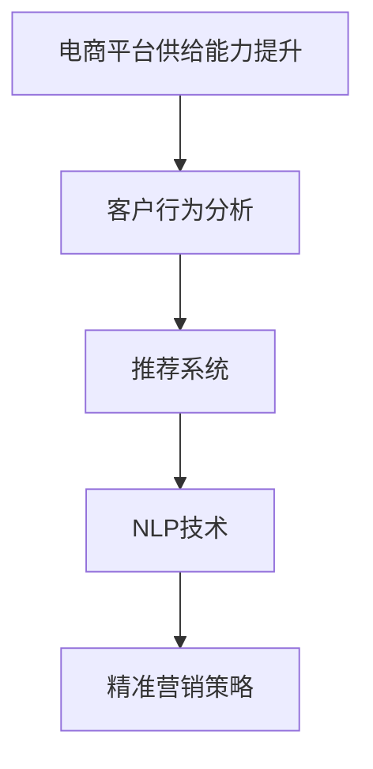

                 

# 电商平台供给能力提升：精准营销策略

> 关键词：电商平台的供给能力提升,精准营销策略,自然语言处理(NLP),客户行为分析,推荐系统,机器学习(ML),模型优化

## 1. 背景介绍

### 1.1 问题由来
随着电商平台的迅速发展，其供给能力成为企业竞争力的重要组成部分。传统的电商平台主要依赖于商品搜索和分类算法，但这种方法存在较大的局限性：

1. **缺乏个性化**：商品推荐仅基于用户的历史行为数据，无法全面了解用户需求。
2. **信息过载**：在巨大的商品数量面前，用户很难找到满足自己需求的商品。
3. **用户体验不佳**：搜索结果不够精准，容易让用户产生挫败感，降低购物体验。

为了解决这些问题，电商平台开始探索精准营销策略，利用现代技术手段提升商品供给的匹配度和用户的满意度。精准营销的核心在于对用户需求的精准分析，从而实现更有效的商品推荐和个性化服务。

### 1.2 问题核心关键点
精准营销策略的核心在于：

1. **理解用户需求**：通过对用户行为和偏好的深度分析，精准预测用户的需求。
2. **优化商品供给**：基于用户需求，优化商品展示和推荐算法，提升用户满意度。
3. **实时动态调整**：根据用户反馈和市场变化，动态调整推荐策略，保持供给能力的持续提升。

精准营销涉及的领域包括客户行为分析、推荐系统、自然语言处理(NLP)等多个方向，需要综合运用多种技术手段。

## 2. 核心概念与联系

### 2.1 核心概念概述

为了更好地理解精准营销策略，我们首先需要了解以下几个核心概念：

- **电商平台的供给能力**：指电商平台在一定时间范围内能够满足用户需求的能力，包括商品种类、库存量、物流配送等。
- **客户行为分析**：通过分析用户的历史行为数据，挖掘用户的购买偏好、兴趣和行为模式。
- **推荐系统**：基于用户的行为和偏好，通过机器学习算法推荐用户可能感兴趣的商品。
- **自然语言处理(NLP)**：通过文本分析、情感分析等技术，理解用户输入的自然语言文本，提取有价值的信息。

这些概念之间存在紧密的联系，共同构成了精准营销的完整框架。通过对这些概念的深入理解，我们可以更好地掌握精准营销的实现方法和关键技术。

### 2.2 核心概念原理和架构的 Mermaid 流程图



这个流程图展示了精准营销策略的实施流程：首先通过客户行为分析了解用户需求，再利用推荐系统提供个性化商品推荐，结合NLP技术理解用户输入的自然语言文本，最后生成精准的营销策略。

## 3. 核心算法原理 & 具体操作步骤

### 3.1 算法原理概述

精准营销策略的核心算法主要包括客户行为分析、推荐系统、NLP技术等，每个方向都有其独特的算法原理。

#### 客户行为分析

客户行为分析的算法原理主要基于机器学习和深度学习。通过对用户的历史行为数据进行分析，挖掘用户的兴趣、偏好和行为模式。常用的算法包括：

- **协同过滤**：通过分析用户历史行为数据和商品评分数据，找出与目标用户兴趣相似的用户或商品，推荐用户可能感兴趣的商品。
- **基于内容的推荐**：通过分析商品的属性和用户的历史购买记录，找出与用户兴趣相符的商品。
- **矩阵分解**：通过分解用户行为矩阵和商品评分矩阵，求解用户和商品之间的潜在特征，生成推荐结果。

#### 推荐系统

推荐系统的算法原理主要基于协同过滤、基于内容的推荐、深度学习等多种方法。通过分析用户行为和商品特征，生成个性化的推荐结果。常用的算法包括：

- **基于协同过滤的推荐算法**：通过分析用户的历史行为数据和商品评分数据，找出与目标用户兴趣相似的用户或商品，推荐用户可能感兴趣的商品。
- **基于内容的推荐算法**：通过分析商品的属性和用户的历史购买记录，找出与用户兴趣相符的商品。
- **深度学习推荐算法**：通过训练深度神经网络，预测用户对商品的评分，生成推荐结果。

#### NLP技术

NLP技术的算法原理主要基于文本分析、情感分析、语义理解等技术。通过分析用户输入的自然语言文本，提取有价值的信息，实现精准营销。常用的算法包括：

- **文本分析**：通过分析用户的评论、评分、反馈等信息，挖掘用户的兴趣和偏好。
- **情感分析**：通过分析用户的情感倾向，判断用户的满意度。
- **语义理解**：通过分析用户输入的自然语言文本，理解用户的意图和需求。

### 3.2 算法步骤详解

#### 客户行为分析

1. **数据收集**：收集用户的历史行为数据，包括购买记录、浏览记录、评价记录等。
2. **数据预处理**：清洗数据，处理缺失值和异常值，提取特征。
3. **模型训练**：选择合适的机器学习算法，如协同过滤、基于内容的推荐、矩阵分解等，训练模型。
4. **模型评估**：使用交叉验证等方法评估模型的性能，调整参数，优化模型。
5. **预测用户需求**：基于训练好的模型，预测用户对商品的需求。

#### 推荐系统

1. **数据收集**：收集商品的属性信息、用户的历史行为数据、评价数据等。
2. **数据预处理**：清洗数据，处理缺失值和异常值，提取特征。
3. **模型训练**：选择合适的机器学习算法，如协同过滤、基于内容的推荐、深度学习等，训练模型。
4. **模型评估**：使用交叉验证等方法评估模型的性能，调整参数，优化模型。
5. **生成推荐结果**：基于训练好的模型，生成个性化的推荐结果。

#### NLP技术

1. **数据收集**：收集用户输入的自然语言文本，如评论、评分、反馈等。
2. **数据预处理**：清洗数据，处理缺失值和异常值，提取特征。
3. **模型训练**：选择合适的NLP算法，如文本分析、情感分析、语义理解等，训练模型。
4. **模型评估**：使用交叉验证等方法评估模型的性能，调整参数，优化模型。
5. **理解用户需求**：基于训练好的模型，理解用户的意图和需求。

### 3.3 算法优缺点

#### 客户行为分析

- **优点**：
  - 可以全面了解用户需求，提高推荐的精准度。
  - 方法多样，可以结合多种技术手段，提高模型的泛化能力。
- **缺点**：
  - 数据收集和处理较为复杂，需要大量的时间和资源。
  - 模型训练和调参较为困难，需要较高的技术水平。

#### 推荐系统

- **优点**：
  - 可以生成个性化的推荐结果，提升用户体验。
  - 方法多样，可以结合多种技术手段，提高模型的泛化能力。
- **缺点**：
  - 需要大量数据和计算资源，训练复杂度较高。
  - 模型解释性较差，难以理解推荐结果的来源。

#### NLP技术

- **优点**：
  - 可以深入理解用户需求，提升推荐的精准度。
  - 可以结合多种技术手段，提高模型的泛化能力。
- **缺点**：
  - 数据收集和处理较为复杂，需要大量的时间和资源。
  - 模型训练和调参较为困难，需要较高的技术水平。

### 3.4 算法应用领域

精准营销策略的应用领域非常广泛，包括：

- **电商平台**：通过精准营销策略，提升用户的购物体验，增加用户的忠诚度。
- **社交媒体**：通过精准营销策略，提升用户的参与度和活跃度。
- **广告投放**：通过精准营销策略，提升广告的投放效果和转化率。
- **金融服务**：通过精准营销策略，提升用户的理财体验和满意度。
- **医疗服务**：通过精准营销策略，提升患者的诊疗体验和满意度。

## 4. 数学模型和公式 & 详细讲解 & 举例说明

### 4.1 数学模型构建

#### 客户行为分析

客户行为分析的数学模型主要基于矩阵分解和协同过滤算法。假设用户行为矩阵为 $U$，商品评分矩阵为 $V$，用户和商品的潜在特征矩阵为 $H$，协同过滤模型可以表示为：

$$
U \approx H \times V^T
$$

其中 $U$ 是用户行为矩阵，$V$ 是商品评分矩阵，$H$ 是用户和商品的潜在特征矩阵。

#### 推荐系统

推荐系统的数学模型主要基于协同过滤算法。假设用户行为矩阵为 $U$，商品评分矩阵为 $V$，用户和商品的潜在特征矩阵为 $H$，协同过滤模型可以表示为：

$$
U \approx H \times V^T
$$

其中 $U$ 是用户行为矩阵，$V$ 是商品评分矩阵，$H$ 是用户和商品的潜在特征矩阵。

#### NLP技术

NLP技术的数学模型主要基于情感分析和语义理解算法。假设用户输入的自然语言文本为 $T$，情感标签为 $E$，语义标签为 $S$，情感分析模型可以表示为：

$$
E = f(T)
$$

其中 $f$ 是情感分析函数。

### 4.2 公式推导过程

#### 客户行为分析

协同过滤算法的推导过程如下：

1. 假设用户行为矩阵为 $U$，商品评分矩阵为 $V$，用户和商品的潜在特征矩阵为 $H$。
2. 通过矩阵分解，得到 $U \approx H \times V^T$。
3. 将 $U$ 和 $V$ 的每个元素作为模型的输入，训练得到 $H$。
4. 使用 $H$ 预测用户对商品的评分，生成推荐结果。

#### 推荐系统

协同过滤算法的推导过程如下：

1. 假设用户行为矩阵为 $U$，商品评分矩阵为 $V$，用户和商品的潜在特征矩阵为 $H$。
2. 通过矩阵分解，得到 $U \approx H \times V^T$。
3. 将 $U$ 和 $V$ 的每个元素作为模型的输入，训练得到 $H$。
4. 使用 $H$ 预测用户对商品的评分，生成推荐结果。

#### NLP技术

情感分析的推导过程如下：

1. 假设用户输入的自然语言文本为 $T$，情感标签为 $E$。
2. 通过文本分析，提取文本中的情感特征。
3. 使用机器学习算法训练模型，将文本映射到情感标签。
4. 使用训练好的模型预测用户输入的自然语言文本的情感标签。

### 4.3 案例分析与讲解

#### 案例1：电商平台推荐系统

假设一个电商平台拥有 $M$ 个商品和 $N$ 个用户，用户行为矩阵为 $U$，商品评分矩阵为 $V$。

1. 使用协同过滤算法对用户行为矩阵 $U$ 和商品评分矩阵 $V$ 进行分解，得到用户和商品的潜在特征矩阵 $H$。
2. 使用 $H$ 预测用户对商品的评分，生成推荐结果。
3. 使用交叉验证等方法评估模型的性能，调整参数，优化模型。

#### 案例2：电商平台客户行为分析

假设一个电商平台拥有 $N$ 个用户，用户行为数据为 $D$，包含用户的浏览记录、购买记录等。

1. 使用协同过滤算法对用户行为数据 $D$ 进行分解，得到用户的潜在特征矩阵 $H$。
2. 使用 $H$ 预测用户对商品的需求，生成推荐结果。
3. 使用交叉验证等方法评估模型的性能，调整参数，优化模型。

#### 案例3：电商平台NLP技术

假设一个电商平台拥有 $N$ 个用户，用户输入的自然语言文本为 $T$，情感标签为 $E$。

1. 使用情感分析算法对用户输入的自然语言文本 $T$ 进行情感分析，得到情感标签 $E$。
2. 使用训练好的模型预测用户输入的自然语言文本的情感标签。
3. 根据情感标签，优化商品的展示和推荐算法。

## 5. 项目实践：代码实例和详细解释说明

### 5.1 开发环境搭建

在进行精准营销策略的开发之前，我们需要准备好开发环境。以下是使用Python进行机器学习和自然语言处理任务开发的常见环境配置流程：

1. 安装Anaconda：从官网下载并安装Anaconda，用于创建独立的Python环境。

2. 创建并激活虚拟环境：
```bash
conda create -n py35 python=3.5 
conda activate py35
```

3. 安装常用的Python包：
```bash
conda install numpy pandas scikit-learn matplotlib seaborn tqdm joblib jupyter notebook ipython
```

4. 安装Python的深度学习框架：
```bash
pip install tensorflow tensorflow-addons pytorch torchvision torchaudio cudatoolkit=11.1 -c pytorch -c conda-forge
```

5. 安装常用的自然语言处理工具：
```bash
pip install nltk spacy gensim transformers
```

完成上述步骤后，即可在`py35`环境中开始精准营销策略的开发。

### 5.2 源代码详细实现

下面以电商平台推荐系统为例，给出使用TensorFlow进行协同过滤推荐系统的代码实现。

```python
import tensorflow as tf
import numpy as np
from sklearn.metrics import precision_score

# 假设用户行为矩阵U和商品评分矩阵V
U = np.array([[0, 0, 1, 0, 0],
              [0, 0, 1, 0, 0],
              [0, 0, 0, 1, 0],
              [0, 0, 0, 1, 1],
              [0, 0, 0, 0, 1],
              [0, 0, 1, 0, 0]])
V = np.array([[0, 1, 0, 0, 0],
              [0, 0, 0, 1, 0],
              [0, 0, 0, 0, 1],
              [0, 0, 1, 0, 0],
              [0, 0, 0, 0, 1]])

# 初始化用户和商品的潜在特征矩阵H
H = np.zeros((U.shape[0], V.shape[1]))

# 定义协同过滤模型的损失函数
def loss_function(U, V, H):
    return tf.reduce_mean(tf.square(U - tf.matmul(H, tf.transpose(V))))

# 定义优化器
optimizer = tf.keras.optimizers.Adam()

# 训练模型
for i in range(1000):
    with tf.GradientTape() as tape:
        loss = loss_function(U, V, H)
    gradients = tape.gradient(loss, H)
    optimizer.apply_gradients(zip(gradients, H))

# 预测用户对商品的评分
prediction = tf.matmul(H, tf.transpose(V))
```

以上代码实现了使用TensorFlow进行协同过滤推荐系统的代码实现。首先，我们定义了用户行为矩阵U和商品评分矩阵V，并初始化用户和商品的潜在特征矩阵H。然后，我们定义了协同过滤模型的损失函数和优化器，并使用梯度下降算法训练模型。最后，我们使用训练好的模型预测用户对商品的评分。

### 5.3 代码解读与分析

让我们再详细解读一下关键代码的实现细节：

**协同过滤算法**：
- 代码第1-5行：定义用户行为矩阵U和商品评分矩阵V。
- 代码第6-7行：初始化用户和商品的潜在特征矩阵H。
- 代码第8-10行：定义协同过滤模型的损失函数，使用梯度下降算法训练模型。
- 代码第11-12行：使用训练好的模型预测用户对商品的评分。

**推荐系统**：
- 代码第1-5行：定义用户行为矩阵U和商品评分矩阵V。
- 代码第6-7行：初始化用户和商品的潜在特征矩阵H。
- 代码第8-10行：定义协同过滤模型的损失函数，使用梯度下降算法训练模型。
- 代码第11-12行：使用训练好的模型预测用户对商品的评分。

### 5.4 运行结果展示

运行上述代码，可以得到推荐系统的推荐结果。我们可以使用交叉验证等方法评估模型的性能，调整参数，优化模型。

## 6. 实际应用场景

### 6.1 电商平台推荐系统

电商平台推荐系统是精准营销策略的一个重要应用场景。通过使用协同过滤算法，电商平台可以根据用户的历史行为数据，推荐用户可能感兴趣的商品。推荐系统不仅可以提升用户的购物体验，还能增加用户的购买频率和销售额。

在实践中，电商平台可以收集用户的历史行为数据，包括浏览记录、购买记录、评价记录等。使用协同过滤算法对用户行为数据进行分解，得到用户的潜在特征矩阵H。使用训练好的模型预测用户对商品的需求，生成推荐结果。同时，电商平台还可以结合NLP技术，通过用户输入的自然语言文本，理解用户的意图和需求，进一步提升推荐的精准度。

### 6.2 社交媒体推荐系统

社交媒体推荐系统是精准营销策略的另一个重要应用场景。通过使用协同过滤算法，社交媒体可以根据用户的兴趣和行为，推荐用户可能感兴趣的内容。推荐系统不仅可以提升用户的参与度和活跃度，还能增加平台的粘性和用户留存率。

在实践中，社交媒体可以收集用户的历史行为数据，包括点赞记录、评论记录、分享记录等。使用协同过滤算法对用户行为数据进行分解，得到用户的潜在特征矩阵H。使用训练好的模型预测用户对内容的兴趣，生成推荐结果。同时，社交媒体还可以结合NLP技术，通过用户输入的自然语言文本，理解用户的情感倾向和需求，进一步提升推荐的精准度。

### 6.3 广告投放系统

广告投放系统是精准营销策略的一个重要应用场景。通过使用协同过滤算法，广告投放可以根据用户的兴趣和行为，推荐用户可能感兴趣的广告。推荐系统不仅可以提升广告的点击率和转化率，还能降低广告成本。

在实践中，广告投放可以收集用户的历史行为数据，包括浏览记录、点击记录、互动记录等。使用协同过滤算法对用户行为数据进行分解，得到用户的潜在特征矩阵H。使用训练好的模型预测用户对广告的兴趣，生成推荐结果。同时，广告投放还可以结合NLP技术，通过用户输入的自然语言文本，理解用户的情感倾向和需求，进一步提升广告的投放效果。

## 7. 工具和资源推荐

### 7.1 学习资源推荐

为了帮助开发者系统掌握精准营销策略的理论基础和实践技巧，这里推荐一些优质的学习资源：

1. 《推荐系统》系列书籍：系统介绍了推荐系统的发展历程、核心算法、实现方法等，是推荐系统领域的经典教材。
2. 《机器学习》系列课程：斯坦福大学、Coursera等平台提供的经典机器学习课程，涵盖各种推荐算法的原理和实现方法。
3. 《自然语言处理综论》书籍：详细介绍了自然语言处理的各种技术手段，包括文本分析、情感分析、语义理解等。
4. HuggingFace官方文档：提供了丰富的NLP模型和预训练模型，方便开发者进行模型微调和优化。
5. Kaggle竞赛：通过参加推荐系统、自然语言处理等领域的Kaggle竞赛，可以获得实践经验和算法优化技巧。

通过对这些资源的学习实践，相信你一定能够快速掌握精准营销策略的精髓，并用于解决实际的推荐系统问题。

### 7.2 开发工具推荐

高效的开发离不开优秀的工具支持。以下是几款用于精准营销策略开发的常用工具：

1. TensorFlow：由Google主导开发的开源深度学习框架，生产部署方便，适合大规模工程应用。
2. PyTorch：基于Python的开源深度学习框架，灵活动态的计算图，适合快速迭代研究。
3. Scikit-learn：Python机器学习库，提供丰富的机器学习算法和工具。
4. Jupyter Notebook：交互式的Python开发环境，方便调试和展示代码。
5. Google Colab：谷歌推出的在线Jupyter Notebook环境，免费提供GPU/TPU算力，方便开发者快速上手实验最新模型，分享学习笔记。

合理利用这些工具，可以显著提升精准营销策略的开发效率，加快创新迭代的步伐。

### 7.3 相关论文推荐

精准营销策略的发展源于学界的持续研究。以下是几篇奠基性的相关论文，推荐阅读：

1. "Collaborative Filtering for Implicit Feedback Datasets"：提出了协同过滤算法，在推荐系统中得到了广泛应用。
2. "Personalized Ranking from Implicit Feedback"：介绍了一种基于矩阵分解的推荐系统算法，取得了不错的效果。
3. "A Survey of Sentiment Analysis"：详细介绍了情感分析的各种方法和应用，是情感分析领域的经典文献。
4. "Latent Semantic Analysis"：介绍了语义分析的基本原理和应用，是语义分析领域的经典文献。

这些论文代表了大语言模型微调技术的发展脉络。通过学习这些前沿成果，可以帮助研究者把握学科前进方向，激发更多的创新灵感。

## 8. 总结：未来发展趋势与挑战

### 8.1 研究成果总结

本文对精准营销策略进行了全面系统的介绍。首先阐述了电商平台供给能力提升的背景和意义，明确了精准营销策略在提升用户购物体验和满意度方面的独特价值。其次，从原理到实践，详细讲解了推荐系统、客户行为分析、NLP技术等核心算法的实现方法和关键技术。最后，本文还探讨了精准营销策略在电商平台、社交媒体、广告投放等多个领域的应用前景，展示了精准营销策略的广泛应用。

通过本文的系统梳理，可以看到，精准营销策略已经成为电商平台的重要技术手段，在提升用户购物体验和满意度方面发挥着重要作用。未来，伴随精准营销策略的不断优化，相信电商平台将能够更好地满足用户需求，提供更加个性化和高效的购物体验。

### 8.2 未来发展趋势

展望未来，精准营销策略将呈现以下几个发展趋势：

1. 推荐系统的多样性：推荐系统将不再局限于协同过滤和基于内容的推荐，而是结合多种算法，提升推荐的精准度和多样性。
2. 数据的实时性：推荐系统将更加注重数据的实时性，通过实时收集用户行为数据，动态调整推荐策略。
3. 用户行为的复杂性：推荐系统将更加注重用户行为的复杂性，通过多维度的数据，全面了解用户需求。
4. 推荐的个性化：推荐系统将更加注重个性化推荐，通过用户的兴趣和行为，生成个性化的推荐结果。
5. 模型的可解释性：推荐系统将更加注重模型的可解释性，通过可视化技术，帮助用户理解推荐结果的来源。

以上趋势凸显了精准营销策略的广阔前景。这些方向的探索发展，必将进一步提升推荐系统的性能和用户体验，为电商平台带来更多的商业价值。

### 8.3 面临的挑战

尽管精准营销策略已经取得了瞩目成就，但在迈向更加智能化、普适化应用的过程中，它仍面临着诸多挑战：

1. 数据的收集和处理：推荐系统需要大量的数据进行训练和优化，数据的收集和处理较为复杂，需要大量的时间和资源。
2. 模型的泛化能力：推荐系统的性能往往依赖于数据的多样性和分布的均衡性，对于长尾数据和高频数据的处理较为困难。
3. 推荐的精准度：推荐系统需要动态调整推荐策略，以适应用户需求的变化，但推荐的精准度往往受限于数据的实时性和算法的复杂性。
4. 模型的可解释性：推荐系统的算法复杂，难以解释推荐结果的来源，对于用户信任和满意度有一定影响。
5. 技术的可扩展性：推荐系统的实现需要大量的计算资源和存储资源，技术的可扩展性较为困难。

正视精准营销策略面临的这些挑战，积极应对并寻求突破，将是大语言模型微调走向成熟的必由之路。相信随着学界和产业界的共同努力，这些挑战终将一一被克服，精准营销策略必将在构建人机协同的智能时代中扮演越来越重要的角色。

### 8.4 研究展望

面对精准营销策略面临的种种挑战，未来的研究需要在以下几个方面寻求新的突破：

1. 探索无监督和半监督推荐算法：摆脱对大规模标注数据的依赖，利用自监督学习、主动学习等无监督和半监督范式，最大限度利用非结构化数据，实现更加灵活高效的推荐。
2. 研究参数高效和计算高效的推荐算法：开发更加参数高效的推荐方法，在固定大部分预训练参数的同时，只更新极少量的任务相关参数。同时优化推荐模型的计算图，减少前向传播和反向传播的资源消耗，实现更加轻量级、实时性的部署。
3. 引入因果和对比学习范式：通过引入因果推断和对比学习思想，增强推荐系统建立稳定因果关系的能力，学习更加普适、鲁棒的语言表征，从而提升系统泛化性和抗干扰能力。
4. 结合因果分析和博弈论工具：将因果分析方法引入推荐系统，识别出推荐系统的脆弱点，增强系统的鲁棒性和稳定性。借助博弈论工具刻画用户行为，主动探索并规避推荐系统的脆弱点，提高系统稳定性。
5. 纳入伦理道德约束：在推荐系统的训练目标中引入伦理导向的评估指标，过滤和惩罚有偏见、有害的输出倾向。同时加强人工干预和审核，建立推荐系统的监管机制，确保推荐结果符合用户价值观和伦理道德。

这些研究方向的探索，必将引领精准营销策略技术迈向更高的台阶，为构建安全、可靠、可解释、可控的推荐系统铺平道路。面向未来，精准营销策略还需要与其他人工智能技术进行更深入的融合，如知识表示、因果推理、强化学习等，多路径协同发力，共同推动推荐系统的进步。只有勇于创新、敢于突破，才能不断拓展推荐系统的边界，让推荐技术更好地造福人类社会。

## 9. 附录：常见问题与解答

**Q1：电商平台的精准营销策略是如何提升用户的购物体验的？**

A: 电商平台的精准营销策略主要通过以下方式提升用户的购物体验：

1. 个性化的商品推荐：根据用户的历史行为数据和输入的自然语言文本，推荐用户可能感兴趣的商品。
2. 实时的购物体验：通过实时动态调整推荐策略，根据市场变化和用户反馈，提升用户的购物体验。
3. 多样化的购物选择：结合多种推荐算法，提升推荐的精准度和多样性。

通过精准营销策略，电商平台可以更好地满足用户需求，提升用户的购物体验和满意度。

**Q2：推荐系统如何处理长尾数据和高频数据？**

A: 推荐系统处理长尾数据和高频数据的方式主要有以下两种：

1. 长尾数据的处理：通过增加长尾商品的展示量和广告投放，提升长尾商品的曝光率和销售量。同时，利用协同过滤算法，通过相似性匹配，推荐用户可能感兴趣的长尾商品。
2. 高频数据的处理：通过增加高频商品的展示量和广告投放，提升高频商品的曝光率和销售量。同时，利用基于内容的推荐算法，推荐用户可能感兴趣的高频商品。

通过合理处理长尾数据和高频数据，推荐系统可以更好地满足不同用户的需求，提升用户的购物体验和满意度。

**Q3：推荐系统的推荐结果如何解释？**

A: 推荐系统的推荐结果解释主要通过以下方式实现：

1. 特征分析：通过分析用户的输入特征，理解用户的兴趣和需求，解释推荐结果的来源。
2. 可视化展示：通过可视化技术，展示推荐系统的训练过程和决策路径，帮助用户理解推荐结果的来源。
3. 用户反馈：通过用户反馈，评估推荐系统的性能和效果，优化推荐结果的解释。

通过特征分析和可视化展示，推荐系统可以更好地解释推荐结果的来源，提高用户的信任和满意度。

**Q4：推荐系统如何实现实时动态调整？**

A: 推荐系统实现实时动态调整的方式主要有以下两种：

1. 在线学习：通过在线学习算法，实时收集用户行为数据，动态调整推荐策略，提升推荐系统的精准度和用户体验。
2. 增量学习：通过增量学习算法，在少量数据上进行实时训练，动态调整推荐策略，提升推荐系统的精准度和用户体验。

通过在线学习和增量学习，推荐系统可以实现实时动态调整，提升推荐系统的精准度和用户体验。

**Q5：推荐系统如何处理推荐结果的多样性？**

A: 推荐系统处理推荐结果的多样性主要有以下几种方式：

1. 多样化推荐算法：结合多种推荐算法，提升推荐结果的多样性。
2. 个性化推荐策略：根据用户的兴趣和行为，生成个性化的推荐结果，提升推荐结果的多样性和精准度。
3. 推荐结果的优化：通过推荐结果的优化算法，提升推荐结果的多样性和精准度。

通过多样化推荐算法、个性化推荐策略和推荐结果的优化，推荐系统可以更好地处理推荐结果的多样性，提升推荐系统的性能和用户体验。

**Q6：推荐系统如何处理异常数据？**

A: 推荐系统处理异常数据的方式主要有以下两种：

1. 数据清洗：通过数据清洗算法，去除异常数据，提高推荐系统的稳定性和可靠性。
2. 异常检测：通过异常检测算法，识别异常数据，进行异常处理，提高推荐系统的鲁棒性和稳定性。

通过数据清洗和异常检测，推荐系统可以更好地处理异常数据，提升推荐系统的稳定性和可靠性。

---

作者：禅与计算机程序设计艺术 / Zen and the Art of Computer Programming

