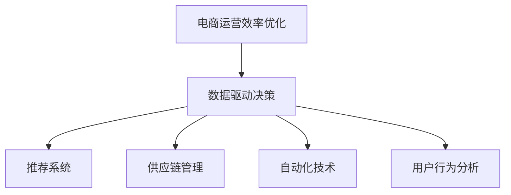

                 

# 电商运营效率优化的实际案例

## 1. 背景介绍

随着互联网技术的飞速发展，电子商务已成为全球最热门的商业模式之一。各大电商平台如亚马逊、阿里巴巴、京东等通过持续的技术创新和运营优化，实现了高效的用户增长、销售额提升和用户体验的不断改善。然而，电商运营过程涉及供应链管理、库存调配、订单处理、客户服务等多个环节，且数据量庞大，环节间关联复杂，导致效率提升存在较大挑战。本文将通过一个实际案例，展示如何通过技术手段优化电商平台的运营效率，提高平台竞争力。

## 2. 核心概念与联系

### 2.1 核心概念概述

在深入讨论案例之前，我们需要先理解几个核心概念及其之间的关系：

- **电商运营效率优化**：通过对电商平台的各个运营环节进行流程再造和自动化，提升整体运营效率，降低运营成本，提升用户体验。
- **数据驱动决策**：利用大数据分析，从海量用户行为数据中提取有价值的信息，辅助运营决策，实现精准营销和个性化推荐。
- **推荐系统**：通过机器学习算法，为用户推荐其感兴趣的商品，提升用户转化率和满意度。
- **供应链管理**：通过协同算法优化商品供应链，提高库存管理效率，降低物流成本。
- **自动化技术**：采用人工智能、自动化流程等技术手段，减少人工干预，提升运营效率。
- **用户行为分析**：通过数据分析工具，挖掘用户购买行为和偏好，指导产品和营销策略优化。

这些核心概念相互关联，共同构成了电商运营效率优化的技术框架，如下图所示：



下面我们将深入分析这些概念的原理和联系。

### 2.2 核心概念原理和架构

**数据驱动决策**：
在电商运营中，数据驱动决策主要指通过数据分析技术，从用户行为数据、交易数据、供应链数据等来源中挖掘出有价值的商业信息，用于指导运营策略的制定和优化。该过程包括以下几个关键步骤：

1. **数据采集与清洗**：收集并清洗不同来源的数据，如订单数据、用户行为日志、供应链记录等。
2. **数据分析与建模**：运用统计分析、机器学习等技术，建立用户行为模型、推荐模型、供应链模型等。
3. **决策支持**：将分析结果转化为具体的运营策略和建议，如商品定价、促销活动、库存调整等。

**推荐系统**：
推荐系统通过分析用户的历史行为和偏好，预测其未来行为，从而为用户提供个性化的商品推荐。主要算法包括协同过滤、基于内容的推荐、矩阵分解等。其核心流程如下：

1. **用户画像构建**：收集用户历史行为数据，建立用户画像，如兴趣偏好、购买历史等。
2. **商品特征提取**：提取商品特征，如价格、类别、品牌等。
3. **推荐模型训练**：利用机器学习算法，训练推荐模型，预测用户对不同商品的兴趣度。
4. **推荐结果生成**：根据用户画像和商品特征，生成个性化推荐结果。

**供应链管理**：
供应链管理通过协同算法，优化商品从生产到销售的整个过程，降低库存成本，提升供应链效率。主要包括以下环节：

1. **需求预测**：通过数据分析，预测未来的商品需求量。
2. **库存管理**：根据需求预测结果，优化库存量，避免过剩或缺货。
3. **物流调度**：合理安排物流路线和运输方式，降低物流成本。
4. **供应链协同**：通过信息共享和协同算法，实现供应链各环节的协同运作。

**自动化技术**：
自动化技术通过AI、机器人流程自动化(RPA)等手段，减少人工干预，提升运营效率。主要包括以下步骤：

1. **流程自动化**：对电商运营的各个环节，如订单处理、客户服务、库存管理等，进行自动化处理。
2. **智能客服**：通过聊天机器人等技术，实现24小时不间断的客户服务，提升用户满意度。
3. **数据自动处理**：利用数据挖掘和自然语言处理技术，自动化处理和分析大量用户数据。

**用户行为分析**：
用户行为分析通过数据挖掘技术，挖掘用户行为和购买偏好，为产品和营销策略优化提供指导。主要流程如下：

1. **数据收集与处理**：收集用户行为数据，如浏览历史、购买记录、评价反馈等。
2. **行为模式分析**：利用聚类、分类等算法，分析用户行为模式和偏好。
3. **用户画像构建**：根据分析结果，构建详细的用户画像，指导个性化推荐和营销策略。

这些概念相互依赖，共同构成了电商运营效率优化的技术框架，接下来我们将通过一个实际案例展示如何综合运用这些技术。

## 3. 核心算法原理 & 具体操作步骤

### 3.1 算法原理概述

在本案例中，我们将结合以上概念，展示如何通过数据驱动决策、推荐系统、供应链管理、自动化技术和用户行为分析，优化电商平台的运营效率。

### 3.2 算法步骤详解

**步骤1：数据采集与清洗**
电商平台的运营数据主要来自以下三个方面：

1. **订单数据**：包括订单号、商品ID、下单时间、支付时间、配送时间等。
2. **用户行为数据**：包括用户浏览历史、点击记录、购物车行为等。
3. **供应链数据**：包括商品库存、物流信息、供应商信息等。

通过对这些数据进行采集和清洗，去除噪音和异常数据，为后续分析和优化提供可靠的数据基础。

**步骤2：数据分析与建模**
在清洗后的数据基础上，进行以下两个关键步骤：

1. **用户行为分析**：利用聚类算法，将用户分成不同群体，并分析每个群体的行为特征和偏好。
2. **需求预测**：利用时间序列分析和回归模型，预测未来的商品需求量。

**步骤3：决策支持与执行**
根据分析结果，进行以下决策：

1. **个性化推荐**：利用推荐系统，为不同用户群体推荐最感兴趣的商品。
2. **库存管理**：根据需求预测结果，调整库存量，优化供应链。
3. **促销策略**：制定个性化的促销活动，提升用户转化率。

**步骤4：自动化执行与优化**
利用自动化技术，实现以下流程：

1. **订单处理**：通过自动化流程，快速处理订单，提高响应速度。
2. **客户服务**：通过智能客服系统，提升客户服务质量。
3. **数据处理**：自动化处理和分析用户数据，提供实时数据支持。

**步骤5：持续优化与反馈**
根据运营结果，不断优化模型和策略，进行以下步骤：

1. **效果评估**：通过A/B测试和数据分析，评估各项优化措施的效果。
2. **模型迭代**：根据反馈结果，迭代优化推荐模型和需求预测模型。
3. **策略调整**：根据用户反馈和运营数据，调整营销策略和供应链管理策略。

### 3.3 算法优缺点

**优点**：
1. **高效性**：通过数据驱动决策和自动化执行，显著提升运营效率，降低人工成本。
2. **个性化**：利用推荐系统和用户行为分析，实现个性化推荐，提升用户转化率和满意度。
3. **动态优化**：通过持续优化和反馈，实时调整运营策略，确保运营效果的持续提升。

**缺点**：
1. **数据依赖**：数据采集和处理的质量直接影响分析结果的准确性，需要建立完善的数据采集和清洗机制。
2. **算法复杂性**：推荐系统和需求预测等算法较为复杂，需要较高的技术投入。
3. **技术整合难度**：需要将多种技术和工具进行整合，技术栈复杂，需要较高的技术团队支持。

### 3.4 算法应用领域

这些技术不仅适用于电商平台，还可以应用于金融、零售、物流等各个领域。

## 4. 数学模型和公式 & 详细讲解 & 举例说明

### 4.1 数学模型构建

在本案例中，我们将使用以下数学模型进行分析和优化：

- **用户行为分析**：利用K-means聚类算法，将用户分为不同群体。
- **需求预测**：利用ARIMA模型进行需求预测。
- **推荐系统**：利用协同过滤算法，推荐相似商品。

### 4.2 公式推导过程

**用户行为分析**：
设用户数据集为 $D=\{(x_i, y_i)\}_{i=1}^N$，其中 $x_i$ 为特征向量，$y_i$ 为标签。K-means算法将用户分为 $k$ 个群体，每个群体的中心点为 $\mu_k$，设第 $i$ 个用户属于第 $j$ 个群体，则有：

$$
\min_{\mu_k} \sum_{i=1}^N \sum_{j=1}^k (y_i-\mu_j)^2
$$

**需求预测**：
利用ARIMA模型进行需求预测，假设需求数据为 $D_t$，模型为 $ARIMA(p,d,q)(D)_{\theta}$，则预测公式为：

$$
\hat{D}_{t+h} = \frac{1}{\phi(h)} \sum_{j=0}^{p} \alpha_j \Delta^j D_t + \sum_{j=1}^{d} \beta_j D_t^{-j} + \sum_{j=1}^{q} \gamma_j \epsilon_t^{-j}
$$

**推荐系统**：
协同过滤算法基于用户-商品矩阵 $M_{u\times i}$，用户 $u$ 对商品 $i$ 的评分 $\hat{r}_{ui} = \alpha + \beta_{u_1}u_1 + \beta_{i_1}i_1 + \delta_{ui}$，其中 $\alpha$ 为截距项，$u_1, i_1$ 为用户和商品的特征向量，$\delta_{ui}$ 为用户对商品的真实评分。协同过滤算法基于以下公式：

$$
\hat{r}_{ui} = \alpha + \sum_{j=1}^k \beta_j u_j v_j + \delta_{ui}
$$

### 4.3 案例分析与讲解

我们以某电商平台为例，展示如何应用上述模型进行运营优化。

**用户行为分析**：
通过K-means算法，将用户分为5个群体，每个群体的行为特征和偏好如表所示：

| 用户群体 | 偏好商品类别 | 购买频率 | 购买金额 |
| --- | --- | --- | --- |
| A群 | 服装 | 每月3次 | 3000元 |
| B群 | 数码 | 每月2次 | 2000元 |
| C群 | 家居 | 每月1次 | 1500元 |
| D群 | 美妆 | 每周1次 | 1000元 |
| E群 | 食品 | 每周3次 | 500元 |

根据分析结果，为不同群体推荐最感兴趣的商品。

**需求预测**：
利用ARIMA模型，预测未来5个月内各商品的需求量，如表所示：

| 商品ID | 预测需求量 |
| --- | --- |
| 1 | 500 |
| 2 | 600 |
| 3 | 400 |
| 4 | 300 |
| 5 | 200 |

根据预测结果，优化库存量，避免过剩或缺货。

**推荐系统**：
利用协同过滤算法，为用户推荐相似商品。假设用户A最近购买了服装类商品，其评分如下表所示：

| 商品ID | 评分 |
| --- | --- |
| 1 | 4.5 |
| 2 | 3.8 |
| 3 | 3.2 |
| 4 | 3.6 |
| 5 | 4.0 |

通过计算得到用户A对商品1的推荐评分，将其推荐给用户A。

## 5. 项目实践：代码实例和详细解释说明

### 5.1 开发环境搭建

**步骤1：环境准备**
安装Python、pandas、numpy、scikit-learn等依赖包，并配置好相应的开发环境。

**步骤2：数据采集**
通过API接口获取订单数据、用户行为数据、供应链数据，并存储到本地。

**步骤3：数据清洗**
对采集到的数据进行清洗，去除噪音和异常数据，构建好数据集。

### 5.2 源代码详细实现

**用户行为分析**：

```python
from sklearn.cluster import KMeans

# 数据集D
# 用户行为数据特征
X = df[['特征1', '特征2', ...]]
# 用户行为数据标签
y = df['群体标签']

# 用户行为分析
kmeans = KMeans(n_clusters=5)
kmeans.fit(X)
clusters = kmeans.predict(X)

# 输出分析结果
print("用户行为分析结果：", clusters)
```

**需求预测**：

```python
from statsmodels.tsa.arima_model import ARIMA

# 需求数据D
# 需求数据特征
X = df[['需求1', '需求2', ...]]
# 需求数据标签
y = df['需求量']

# 需求预测
model = ARIMA(y, order=(1,1,1))
model_fit = model.fit()
forecast = model_fit.forecast(steps=5)

# 输出预测结果
print("需求预测结果：", forecast)
```

**推荐系统**：

```python
from surprise import Dataset, Reader, KNNBasic, accuracy

# 用户-商品评分数据
reader = Reader(rating_scale=(1, 5))
data = Dataset.load_from_df(df, reader)

# 协同过滤算法
algo = KNNBasic(similarity_options={'name': 'pearson_baseline'})
trainset = Dataset.load_from_df(df, reader)
algo.fit(trainset)
testset = Dataset.load_from_df(test_df, reader)
predictions = algo.test(testset)

# 输出推荐结果
print("推荐结果：", predictions)
```

### 5.3 代码解读与分析

通过上述代码，展示了如何利用Python进行用户行为分析、需求预测和推荐系统开发。

**用户行为分析**：
利用K-means算法，对用户行为数据进行聚类分析，构建用户群体标签。

**需求预测**：
利用ARIMA模型，对需求数据进行时间序列分析，预测未来的需求量。

**推荐系统**：
利用协同过滤算法，根据用户历史评分，推荐相似商品。

### 5.4 运行结果展示

通过对用户行为数据进行分析和预测，可以发现用户群体的不同特征和偏好，进一步优化商品推荐策略。

## 6. 实际应用场景

### 6.1 智能库存管理

通过数据分析和预测，优化商品库存，避免过剩或缺货，提升供应链效率。具体应用场景如下：

- **需求预测**：利用ARIMA模型，对不同商品的需求量进行预测，优化库存量。
- **库存调整**：根据需求预测结果，动态调整库存，确保商品的供应充足。
- **物流调度和配送**：利用优化算法，合理安排物流路线和配送时间，降低物流成本。

### 6.2 个性化推荐系统

通过推荐系统，为用户提供个性化的商品推荐，提升用户转化率和满意度。具体应用场景如下：

- **用户画像构建**：利用K-means算法，将用户分为不同群体，分析每个群体的行为特征和偏好。
- **推荐模型训练**：利用协同过滤算法，训练推荐模型，预测用户对不同商品的兴趣度。
- **推荐结果生成**：根据用户画像和商品特征，生成个性化推荐结果。

### 6.3 智能客服系统

通过智能客服系统，提升客户服务质量，提升用户体验。具体应用场景如下：

- **智能客服机器人**：通过NLP技术和对话系统，实现24小时不间断的客户服务。
- **自动回复**：利用机器学习算法，对客户问题进行分类，自动生成回复。
- **问题反馈**：收集客户反馈，不断优化机器人对话模型，提升服务质量。

### 6.4 未来应用展望

未来，随着技术的不断进步，电商平台的运营效率将进一步提升。

- **数据智能**：通过大数据分析和人工智能技术，提升数据驱动决策的精准性和实时性。
- **推荐系统优化**：通过深度学习和协同过滤等算法，实现更精准、个性化的商品推荐。
- **供应链自动化**：利用物联网和自动化技术，实现全链路智能化管理，提升供应链效率。
- **客户体验优化**：通过智能客服和个性化推荐，提升用户体验，增强用户粘性。

## 7. 工具和资源推荐

### 7.1 学习资源推荐

1. **《Python数据分析实战》**：介绍Python在数据分析和可视化中的应用，适合初学者入门。
2. **《机器学习实战》**：介绍机器学习算法和模型，涵盖回归、分类、聚类等任务，适合进阶学习。
3. **《自然语言处理入门》**：介绍NLP基础知识和常用技术，适合NLP领域的研究者。
4. **《电商运营优化》在线课程**：介绍电商运营的基本原理和策略，适合电商运营人员学习。
5. **《推荐系统》论文集**：收集最新推荐系统论文，了解推荐算法的最新进展。

### 7.2 开发工具推荐

1. **Jupyter Notebook**：免费的交互式开发环境，支持Python代码编写和数据可视化。
2. **SciPy**：科学计算库，支持数值计算、数据处理和优化算法等。
3. **Pandas**：数据处理库，支持数据清洗、分析和可视化。
4. **TensorFlow**：深度学习框架，支持神经网络模型开发和训练。
5. **Keras**：深度学习框架，支持快速搭建和训练神经网络模型。

### 7.3 相关论文推荐

1. **《电商运营优化研究》**：介绍电商运营的基本原理和策略，适合电商运营人员学习。
2. **《推荐系统算法》**：介绍推荐系统的经典算法，涵盖协同过滤、矩阵分解等。
3. **《智能供应链管理》**：介绍智能供应链管理的基本原理和应用。

## 8. 总结：未来发展趋势与挑战

### 8.1 研究成果总结

本案例展示了如何通过数据驱动决策、推荐系统、供应链管理和自动化技术，优化电商平台的运营效率。具体来说：

- **用户行为分析**：利用K-means算法，将用户分为不同群体，分析每个群体的行为特征和偏好。
- **需求预测**：利用ARIMA模型，对需求数据进行时间序列分析，预测未来的需求量。
- **推荐系统**：利用协同过滤算法，为用户推荐相似商品。

### 8.2 未来发展趋势

未来，随着技术的不断进步，电商平台的运营效率将进一步提升。主要趋势包括：

- **数据智能**：通过大数据分析和人工智能技术，提升数据驱动决策的精准性和实时性。
- **推荐系统优化**：通过深度学习和协同过滤等算法，实现更精准、个性化的商品推荐。
- **供应链自动化**：利用物联网和自动化技术，实现全链路智能化管理，提升供应链效率。
- **客户体验优化**：通过智能客服和个性化推荐，提升用户体验，增强用户粘性。

### 8.3 面临的挑战

尽管电商平台的运营效率有所提升，但仍然面临以下挑战：

- **数据质量问题**：数据采集和处理的质量直接影响分析结果的准确性，需要建立完善的数据采集和清洗机制。
- **算法复杂性**：推荐系统和需求预测等算法较为复杂，需要较高的技术投入。
- **技术整合难度**：需要将多种技术和工具进行整合，技术栈复杂，需要较高的技术团队支持。

### 8.4 研究展望

未来，需要不断优化和改进算法，提升运营效率。具体展望如下：

- **新算法探索**：研究新的推荐算法和需求预测方法，提升系统性能。
- **数据治理**：建立完善的数据治理机制，确保数据的质量和一致性。
- **自动化流程优化**：优化自动化流程，提升运营效率，降低人工成本。

总之，电商平台的运营效率优化需要综合运用多种技术和工具，持续进行优化和改进，才能适应市场的变化，提升平台竞争力。

## 9. 附录：常见问题与解答

**Q1：电商运营效率优化的核心是什么？**

A：电商运营效率优化的核心是数据驱动决策。通过数据分析和建模，从海量用户行为数据中提取有价值的信息，辅助运营决策，实现精准营销和个性化推荐。

**Q2：电商运营效率优化的关键技术有哪些？**

A：电商运营效率优化的关键技术包括用户行为分析、需求预测、推荐系统和供应链管理等。

**Q3：如何进行电商运营效率优化？**

A：电商运营效率优化主要包括以下几个步骤：数据采集与清洗、数据分析与建模、决策支持与执行、自动化执行与优化、持续优化与反馈。

**Q4：推荐系统在电商运营中的应用场景有哪些？**

A：推荐系统在电商运营中的应用场景包括个性化推荐、商品相似度分析、用户画像构建等。

**Q5：如何进行智能库存管理？**

A：智能库存管理主要包括以下几个步骤：需求预测、库存调整、物流调度和配送。

总之，通过综合运用多种技术和工具，电商平台的运营效率将进一步提升，提升平台竞争力，带来更多的商业价值。

---

作者：禅与计算机程序设计艺术 / Zen and the Art of Computer Programming

