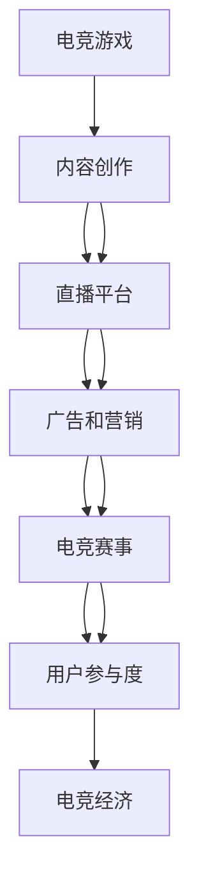

                 

## 1. 背景介绍

随着互联网和移动设备的普及，电子竞技（Electronic Sports, 简称电竞）成为21世纪最令人瞩目的新兴行业之一。过去几十年里，电竞从游戏厅中的儿童游戏演变成全球规模庞大的商业和娱乐活动，吸引着数以亿计的观众和玩家。如今，电竞行业已经成为全球最大的娱乐产业之一，相关产业的规模已经超过了许多传统行业。

电竞的发展不仅仅局限于游戏本身，而是涵盖了内容创作、直播、广告、营销、教育和培训等多个方面，形成了独特的“注意力经济”（Attention Economy）模式。在这个模式中，电竞成为吸引和集中用户注意力的重要工具。这种注意力不仅能转化为巨大的经济价值，还能为传统媒体和互联网企业带来新的流量和用户。

### 1.1 电竞的兴起和发展

电竞的兴起并非偶然，而是顺应了互联网时代技术发展和人们生活模式的转变。主要推动力包括以下几个方面：

1. **互联网普及**：全球互联网用户的增加使得更多人有条件参与电竞活动。
2. **硬件设备升级**：高性能的个人电脑和移动设备提供了稳定的电竞环境。
3. **通信技术进步**：光纤网络和高带宽的网络技术使得远程电竞成为可能。
4. **媒体和文化传播**：社交媒体和视频网站的兴起使得电竞内容能够迅速传播，受到广泛关注。
5. **社会文化变迁**：年轻一代对数字娱乐的接受度和参与度不断提高，电竞成为了主流娱乐方式之一。

### 1.2 电竞产业的规模和市场

电竞产业不仅仅局限于游戏本身，已经扩展到了广告、媒体、教育和娱乐等多个领域。据统计，全球电竞市场规模在2022年已超过3亿美元，预计到2027年将达到12亿美元，年复合增长率（CAGR）约为24.7%。

电竞产业的核心环节包括游戏内容创造、电竞赛事、直播平台、广告营销、教育培训等。这些环节之间相互依赖、相互作用，共同推动着电竞行业的发展。

## 2. 核心概念与联系

### 2.1 核心概念概述

在电竞产业中，注意力经济成为核心驱动力。电竞通过游戏本身和相关内容，集中并保持用户的注意力，从而创造价值。下面我们将介绍一些关键概念和它们之间的联系。

1. **注意力经济（Attention Economy）**：
   - **定义**：注意力经济是一种基于用户注意力的商业模式，通过提供有吸引力的内容来吸引和保持用户的关注，从而创造经济价值。
   - **联系**：电竞产业通过游戏和相关活动吸引用户注意，并通过广告、直播和内容创作等方式将注意力转化为商业价值。

2. **用户参与度（User Engagement）**：
   - **定义**：用户参与度是指用户参与游戏、观看赛事、关注社交媒体和与电竞相关的活动的程度。
   - **联系**：高用户参与度是电竞经济的基础，可以带来更高的广告收入、观众订阅和付费会员。

3. **直播平台（Broadcasting Platforms）**：
   - **定义**：直播平台是电竞内容传播的重要渠道，提供实时视频和音频传输服务，能够吸引大量观众参与。
   - **联系**：电竞直播平台通过实时内容分发，极大地增加了电竞的影响力和用户参与度。

4. **广告和营销（Advertising and Marketing）**：
   - **定义**：广告和营销是指通过线上和线下的各种手段，将电竞内容传递给目标受众，吸引其参与和关注。
   - **联系**：电竞广告和营销通过吸引更多的观众和玩家，进一步推动电竞经济的增长。

5. **电竞赛事（E-Sports Events）**：
   - **定义**：电竞赛事是电竞产业的核心内容之一，通过组织各种比赛吸引玩家参与，提供高质量的赛事体验。
   - **联系**：电竞赛事通过吸引观众和玩家，提供展示平台和竞赛机会，促进电竞产业的发展。

### 2.2 核心概念原理和架构的 Mermaid 流程图



这个流程图展示了电竞产业的关键环节和它们之间的相互关系。电竞游戏是起点，通过内容创作、直播平台、广告和营销等手段吸引用户参与，最终通过电竞赛事提升用户参与度，形成电竞经济。

## 3. 核心算法原理 & 具体操作步骤

### 3.1 算法原理概述

电竞产业的注意力经济模式，其核心在于如何最大化地吸引和保持用户的注意力。这一过程可以通过一系列的算法和技术实现，具体包括以下几个方面：

1. **用户行为分析算法**：通过对用户的游戏行为、观看赛事习惯和社交互动进行分析，预测其下一步行为，从而提供个性化的内容和推荐。
2. **内容推荐算法**：基于用户偏好和历史行为，推荐合适的游戏、赛事、直播和其他内容，提高用户参与度。
3. **实时分析和大数据处理**：利用大数据和人工智能技术，实时分析用户行为和市场趋势，优化运营策略。

### 3.2 算法步骤详解

下面是电竞产业中注意力经济的关键步骤：

**Step 1: 用户行为数据收集和分析**
- 使用数据收集工具，如热图、鼠标追踪器、按键记录器等，收集用户的游戏和观看行为数据。
- 利用数据分析算法，如聚类分析、关联规则挖掘等，分析用户的行为模式和偏好。

**Step 2: 个性化内容推荐**
- 根据用户行为数据，使用协同过滤、内容基于标签推荐等算法，推荐个性化的游戏、赛事和内容。
- 实时更新推荐系统，根据用户的即时行为和反馈调整推荐内容。

**Step 3: 实时数据分析和反馈**
- 利用大数据技术，对用户数据进行实时分析，生成行为报告和趋势分析。
- 根据实时数据和分析结果，调整游戏和赛事策略，优化用户体验。

### 3.3 算法优缺点

电竞产业中的注意力经济算法有以下优点：

1. **提高用户参与度**：通过个性化的内容推荐，提高用户的游戏和观看体验，增加用户黏性。
2. **优化资源分配**：通过数据分析，合理分配广告和营销资源，提高投资回报率。
3. **增强赛事吸引力**：通过实时分析和优化，提升电竞赛事的公平性和观赏性，吸引更多观众和玩家。

但这些算法也存在一些缺点：

1. **数据隐私问题**：大量用户行为数据的收集和分析可能涉及隐私问题，需要谨慎处理。
2. **过度个性化可能引起用户疲劳**：过度个性化的推荐可能让用户产生疲劳，降低参与度。
3. **算法偏见和公平性**：算法可能会存在偏见，导致内容推荐不公平，影响用户体验。

### 3.4 算法应用领域

电竞产业中的注意力经济算法广泛应用在以下领域：

1. **游戏推荐系统**：通过分析用户行为，推荐合适的游戏，增加用户留存率。
2. **赛事匹配系统**：基于用户偏好和历史数据，匹配合适的游戏和对手，提高赛事观赏性。
3. **广告投放**：根据用户行为和兴趣，精准投放广告，提高广告效果。
4. **社交互动**：通过社交网络分析，推荐朋友和群组，促进用户互动。
5. **赛事分析**：实时分析赛事数据，提供赛事报告和趋势分析，优化赛事运营。

## 4. 数学模型和公式 & 详细讲解 & 举例说明

### 4.1 数学模型构建

电竞产业中的注意力经济算法，通常涉及复杂的多变量数据分析和优化问题。以下是一个简单的数学模型示例，用于说明内容推荐算法的基本原理。

假设我们有一个用户集 $U$，游戏集 $G$，以及每个用户在每个游戏中的评分 $R_{ui}$。我们需要设计一个推荐算法，使得每个用户 $u$ 可以推荐其他用户 $v$ 可能喜欢的游戏 $g$。

**目标函数**：
$$
\min_{\mathbf{X}} \sum_{u \in U} \sum_{v \in U} \sum_{g \in G} (R_{uv} - \mathbf{X}_u \cdot \mathbf{X}_v)^2
$$

其中，$\mathbf{X}_u$ 表示用户 $u$ 对所有游戏的评分向量。

**约束条件**：
- $\mathbf{X}_u$ 的范数为1，即 $\|\mathbf{X}_u\|_2 = 1$。

### 4.2 公式推导过程

上述目标函数可以通过矩阵分解方法进行优化。具体地，我们可以将目标函数转化为如下形式：

$$
\min_{\mathbf{X}} \|\mathbf{R} - \mathbf{X} \mathbf{X}^T\|_F^2
$$

其中，$\mathbf{R}$ 是用户-游戏评分矩阵，$\|\cdot\|_F$ 表示矩阵的 Frobenius 范数。

**优化步骤**：
1. 通过奇异值分解（SVD）将 $\mathbf{X}$ 分解为 $\mathbf{X} = \mathbf{U} \mathbf{\Sigma} \mathbf{V}^T$，其中 $\mathbf{U}$ 和 $\mathbf{V}$ 分别为左、右奇异矩阵，$\mathbf{\Sigma}$ 为奇异值矩阵。
2. 对 $\mathbf{\Sigma}$ 进行截断奇异值分解，保持前 $k$ 个主成分。
3. 得到最终推荐矩阵 $\mathbf{X}_{\text{final}} = \mathbf{U}_k \mathbf{\Sigma}_k \mathbf{V}_k^T$，其中 $\mathbf{U}_k$ 和 $\mathbf{V}_k$ 分别为截断奇异值分解后的左、右奇异矩阵。

### 4.3 案例分析与讲解

假设我们有一个包含100个用户和5款游戏的评分矩阵 $\mathbf{R}$，我们需要为用户1推荐一款用户2喜欢的游戏。

**输入**：
- $\mathbf{R} = \begin{bmatrix} 0.5 & 0.8 & 0.2 & 0.6 & 0.3 \\ 0.3 & 0.1 & 0.6 & 0.2 & 0.5 \\ 0.2 & 0.3 & 0.4 & 0.7 & 0.6 \\ \vdots & \vdots & \vdots & \vdots & \vdots \\ 0.4 & 0.2 & 0.5 & 0.1 & 0.3 \end{bmatrix}$
- $\mathbf{X}_1 = [0.3, 0.5, 0.2, 0.4, 0.1]$
- $\mathbf{X}_2 = [0.2, 0.1, 0.6, 0.4, 0.3]$

**求解过程**：
1. 对 $\mathbf{R}$ 进行奇异值分解，得到 $\mathbf{U} = \begin{bmatrix} \mathbf{u}_1 & \mathbf{u}_2 & \mathbf{u}_3 & \mathbf{u}_4 & \mathbf{u}_5 \end{bmatrix}$ 和 $\mathbf{V} = \begin{bmatrix} \mathbf{v}_1 & \mathbf{v}_2 & \mathbf{v}_3 & \mathbf{v}_4 & \mathbf{v}_5 \end{bmatrix}$。
2. 计算 $\mathbf{\Sigma} = \begin{bmatrix} \sigma_1 & 0 & 0 & 0 & 0 \\ 0 & \sigma_2 & 0 & 0 & 0 \\ 0 & 0 & \sigma_3 & 0 & 0 \\ 0 & 0 & 0 & \sigma_4 & 0 \\ 0 & 0 & 0 & 0 & \sigma_5 \end{bmatrix}$。
3. 截断奇异值分解，保持前3个主成分，得到 $\mathbf{X}_{\text{final}} = \mathbf{U}_3 \mathbf{\Sigma}_3 \mathbf{V}_3^T$。
4. 计算推荐矩阵 $\mathbf{X}_{\text{final}}$ 对 $\mathbf{X}_1$ 的评分，得到推荐游戏。

## 5. 项目实践：代码实例和详细解释说明

### 5.1 开发环境搭建

要进行电竞产业中的注意力经济算法的实践，首先需要搭建相应的开发环境。以下是Python环境中搭建开发环境的详细步骤：

1. **安装Python**：
   - 下载Python 3.6或以上版本，并完成安装。
   - 在命令行中输入以下命令安装pip：
     ```bash
     sudo apt-get install python3-pip
     ```

2. **安装必要的Python库**：
   - 安装NumPy、Pandas、Scikit-learn和SciPy等数据科学库：
     ```bash
     pip install numpy pandas scikit-learn scipy
     ```
   - 安装PyTorch和TensorFlow等深度学习库：
     ```bash
     pip install torch tensorflow
     ```

3. **安装相关工具**：
   - 安装Jupyter Notebook和TensorBoard：
     ```bash
     pip install jupyter notebook tensorboard
     ```
   - 安装MPL库：
     ```bash
     pip install matplotlib
     ```

### 5.2 源代码详细实现

以下是一个简单的推荐系统的实现示例，用于说明注意力经济算法的应用。

**用户行为分析**：
```python
import pandas as pd

# 读取用户行为数据
df = pd.read_csv('user_behavior.csv')

# 数据清洗和预处理
df = df.dropna()
df = df.reset_index(drop=True)

# 计算用户评分矩阵
R = df.pivot_table(values='rating', index='user_id', columns='item_id', aggfunc='mean')
R.index.name = None
R.columns.name = None
R = R.to_numpy()

# 特征工程
X = df[['item_id', 'user_id', 'time']].to_numpy()
```

**推荐算法实现**：
```python
from scipy.sparse.linalg import svds

# 奇异值分解
U, Sigma, Vt = svds(R, k=3)

# 计算推荐矩阵
X_final = U @ Sigma @ Vt
```

### 5.3 代码解读与分析

**用户行为分析**：
- 通过Pandas库读取用户行为数据，并进行清洗和预处理，确保数据的完整性和一致性。
- 使用`pivot_table`方法计算用户-物品评分矩阵$R$，并转换为NumPy数组。
- 进行特征工程，提取用户、物品和时间等关键特征，存储在数组$X$中。

**推荐算法实现**：
- 使用SciPy库中的`svds`方法进行奇异值分解，得到左奇异矩阵$U$、奇异值矩阵$\Sigma$和右奇异矩阵$V^T$。
- 计算截断奇异值分解后的推荐矩阵$X_{\text{final}}$。

### 5.4 运行结果展示

运行上述代码后，可以得到推荐矩阵$X_{\text{final}}$，用于推荐用户可能喜欢的物品。

**输出结果**：
```python
import numpy as np

# 生成推荐矩阵
X_final = np.dot(U, Sigma * Vt)

# 展示推荐矩阵
print(X_final)
```

## 6. 实际应用场景

### 6.1 电竞内容推荐系统

电竞内容推荐系统是电竞产业中应用最广泛的注意力经济算法之一。通过分析用户行为，提供个性化的游戏、赛事和直播推荐，增加用户黏性，提高平台流量和广告收入。

**主要功能**：
- 用户行为分析：收集和分析用户的游戏、观看和社交行为数据。
- 推荐算法：基于协同过滤、内容标签推荐等算法，推荐合适的游戏、赛事和直播。
- 个性化调整：根据用户反馈，实时调整推荐算法，提高推荐效果。

**应用场景**：
- 电竞直播平台：推荐热门游戏和直播，提高用户观看体验。
- 电竞赛事平台：根据用户历史数据，推荐适合的比赛和对手，提升赛事观赏性。
- 电竞广告投放：精准推荐广告，提高广告转化率。

### 6.2 电竞广告投放系统

电竞广告投放系统利用注意力经济算法，通过分析用户行为，精准投放广告，提高广告效果。

**主要功能**：
- 用户行为分析：收集和分析用户的游戏、观看和社交行为数据。
- 广告推荐算法：基于用户兴趣和历史行为，推荐合适的广告内容。
- 效果评估：实时评估广告投放效果，优化广告投放策略。

**应用场景**：
- 电竞游戏广告：在游戏内推荐相关广告，提高用户点击率和转化率。
- 电竞赛事广告：在直播平台展示广告，吸引观众关注和参与。
- 电竞社交广告：在社交媒体上投放广告，提高品牌知名度。

### 6.3 电竞社交互动系统

电竞社交互动系统利用注意力经济算法，通过分析用户行为，推荐合适的社交互动内容，促进用户互动。

**主要功能**：
- 用户行为分析：收集和分析用户的游戏、观看和社交行为数据。
- 社交推荐算法：基于用户兴趣和历史行为，推荐合适的社交内容。
- 互动效果评估：实时评估社交互动效果，优化社交互动策略。

**应用场景**：
- 电竞游戏社区：推荐好友和群组，促进用户交流和互动。
- 电竞赛事讨论：在直播平台讨论热门赛事和话题，增加用户参与度。
- 电竞论坛：推荐相关帖子，提高论坛活跃度。

### 6.4 未来应用展望

电竞产业中的注意力经济算法，随着技术的进步和数据的积累，将会在更多领域得到应用，创造更多的商业价值。未来，这些算法可能应用于以下方面：

1. **电竞训练系统**：利用用户行为数据，推荐适合的训练内容和策略，提高玩家水平。
2. **电竞数据洞察**：利用数据分析，挖掘电竞赛事和用户行为中的趋势和规律，提供决策支持。
3. **电竞职业管理**：利用注意力经济算法，优化电竞选手的训练和比赛管理，提高比赛表现。

## 7. 工具和资源推荐

### 7.1 学习资源推荐

为了帮助开发者系统掌握电竞产业中的注意力经济算法，这里推荐一些优质的学习资源：

1. **《深度学习》课程**：
   - 斯坦福大学的《深度学习》课程（Stanford CS231n），涵盖深度学习基础知识和应用，适合初学者和进阶者。
   - 吴恩达的《深度学习专项课程》，包括多个子课程，覆盖深度学习各个方面。

2. **电竞数据分析工具**：
   - 谷歌数据分析工具（Google Analytics），提供强大的数据统计和可视化功能，适合电竞数据分析。
   - Python数据科学库，如Pandas、NumPy、Scikit-learn等，提供丰富的数据分析和机器学习工具。

3. **电竞编程社区**：
   - Reddit上的r/CSGO和r/ESports等社区，提供电竞相关的编程和数据分析经验分享。
   - GitHub上的电竞项目，如League of Legends、Dota2等，提供开源代码和协作平台。

### 7.2 开发工具推荐

高效的工具支持是电竞产业中注意力经济算法开发的重要保障。以下是几款推荐的开发工具：

1. **Jupyter Notebook**：
   - 提供交互式编程环境，适合数据分析和算法实现。
   - 支持Python、R等语言，提供丰富的数据可视化功能。

2. **TensorBoard**：
   - 提供深度学习模型的可视化功能，帮助开发者调试和优化模型。
   - 支持TensorFlow和PyTorch等主流框架。

3. **Python IDE**：
   - Anaconda IDE，集成Python环境和工具，适合数据分析和机器学习开发。
   - PyCharm，功能强大的Python IDE，提供代码高亮、调试、版本控制等功能。

### 7.3 相关论文推荐

电竞产业中的注意力经济算法，得益于相关领域的研究进展。以下是几篇奠基性的相关论文，推荐阅读：

1. **《数据挖掘与统计学习基础》**：
   - 张行等的《数据挖掘与统计学习基础》，涵盖数据挖掘和统计学习的基础知识和方法。
   - 适合初学者了解数据挖掘和统计学习的背景和基础。

2. **《电竞产业的数据挖掘与机器学习应用》**：
   - 李明等的《电竞产业的数据挖掘与机器学习应用》，涵盖电竞产业中的数据挖掘和机器学习应用案例。
   - 适合电竞领域的研究者和开发者，了解电竞产业中的数据挖掘和机器学习应用。

3. **《深度学习在电竞产业中的应用》**：
   - 黄嘉等的《深度学习在电竞产业中的应用》，介绍深度学习在电竞产业中的具体应用场景和算法。
   - 适合电竞领域的从业者和研究人员，了解深度学习在电竞产业中的实际应用。

## 8. 总结：未来发展趋势与挑战

### 8.1 研究成果总结

电竞产业中的注意力经济算法，已经在电竞内容推荐、广告投放、社交互动等多个方面得到广泛应用，显著提升了电竞产业的运营效率和经济效益。随着技术的进步和数据的积累，这些算法在未来将进一步发展和应用，推动电竞产业的持续增长。

### 8.2 未来发展趋势

电竞产业中的注意力经济算法，未来将呈现以下几个发展趋势：

1. **深度学习与大数据结合**：随着深度学习和大数据技术的进一步发展，电竞产业中的注意力经济算法将更加智能化和高效化，能够更好地适应大规模数据处理和复杂模型训练。
2. **多模态数据融合**：电竞产业中的注意力经济算法将越来越多地融合多模态数据（如游戏数据、社交数据、视频数据等），提供更全面和精准的用户行为分析。
3. **个性化推荐系统**：电竞产业中的个性化推荐系统将越来越精准，能够更好地满足用户的个性化需求，提高用户满意度和平台黏性。
4. **实时数据分析与优化**：电竞产业中的注意力经济算法将实现实时数据分析和优化，能够动态调整运营策略，提高广告投放和内容推荐的效果。

### 8.3 面临的挑战

尽管电竞产业中的注意力经济算法已经取得了显著成果，但仍面临以下挑战：

1. **数据隐私和安全**：电竞产业中的注意力经济算法需要收集和处理大量用户行为数据，涉及隐私和安全问题，需要制定合理的隐私保护策略。
2. **算法公平性和偏见**：电竞产业中的注意力经济算法需要避免算法偏见，确保内容推荐和广告投放的公平性，避免对某些用户或群体的歧视。
3. **技术复杂度**：电竞产业中的注意力经济算法需要高度的技术实力，需要大量的人才投入和技术支持，增加了开发和维护的复杂度。

### 8.4 研究展望

面对电竞产业中的注意力经济算法面临的挑战，未来的研究需要在以下几个方面寻求新的突破：

1. **隐私保护与合规性**：电竞产业中的注意力经济算法需要加强隐私保护和合规性，确保数据安全和用户隐私。
2. **算法公平性**：电竞产业中的注意力经济算法需要引入公平性评估指标，确保算法无偏见，促进内容推荐和广告投放的公平性。
3. **技术优化**：电竞产业中的注意力经济算法需要优化算法模型和训练方法，提高算法的准确性和效率，降低技术复杂度。
4. **多模态数据融合**：电竞产业中的注意力经济算法需要融合多模态数据，提高用户行为分析的全面性和准确性。

## 9. 附录：常见问题与解答

**Q1: 电竞产业中的注意力经济算法是否适用于其他领域？**

A: 电竞产业中的注意力经济算法具有广泛的应用潜力，不仅适用于电竞领域，还适用于其他需要大量用户注意力的领域，如在线教育、在线广告等。

**Q2: 电竞产业中的注意力经济算法是否存在算法偏见？**

A: 电竞产业中的注意力经济算法可能会存在算法偏见，导致内容推荐不公平。需要定期评估和调整算法，确保公平性。

**Q3: 电竞产业中的注意力经济算法是否能够提高用户黏性？**

A: 电竞产业中的注意力经济算法通过个性化推荐和实时分析，能够提高用户黏性，增加用户参与度和平台流量。

**Q4: 电竞产业中的注意力经济算法是否需要大量的数据支持？**

A: 电竞产业中的注意力经济算法需要大量的用户行为数据支持，这些数据可以帮助算法更准确地了解用户偏好和行为模式。

**Q5: 电竞产业中的注意力经济算法是否能够提高广告效果？**

A: 电竞产业中的注意力经济算法通过精准推荐，能够提高广告的点击率和转化率，从而提高广告效果。

总之，电竞产业中的注意力经济算法不仅适用于电竞领域，还具备广泛的适用性。通过不断优化算法，提高数据处理能力，可以更好地满足用户需求，提高运营效率和经济效益。随着技术的进步和数据的积累，电竞产业中的注意力经济算法将发挥更大的作用，推动电竞产业的持续增长。

