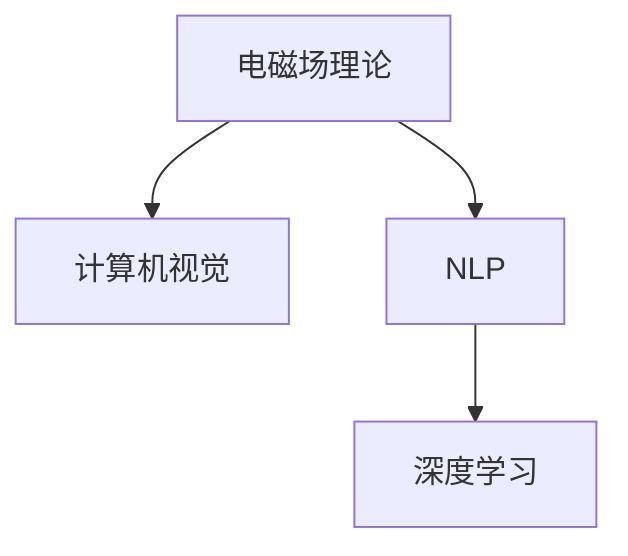

                 

## 1. 背景介绍

电磁场理论是物理学中的经典理论，描述了电荷和电流在空间中的分布以及电磁波的传播规律。随着科技的发展，电磁场理论已经被广泛应用于计算机视觉、自然语言处理、量子计算等多个领域。本文将介绍电磁场理论在人工智能(AI)中的实际应用，特别是其在计算机视觉和自然语言处理方面的潜力。

## 2. 核心概念与联系

### 2.1 核心概念概述

- **电磁场理论**：描述电荷、电流和电磁波在空间中传播的物理学理论，涉及麦克斯韦方程组和电磁波等基本概念。
- **计算机视觉**：涉及图像处理、特征提取、目标检测、图像分割等技术，主要解决图像识别和理解问题。
- **自然语言处理(NLP)**：涉及文本预处理、词向量嵌入、序列模型、语言生成等技术，主要解决文本理解和生成问题。
- **深度学习**：一种基于神经网络的机器学习方法，能够自动学习特征表示，广泛应用于图像、文本等多种数据类型的AI任务。

这些概念之间的联系可以通过以下Mermaid流程图来展示：



这个流程图展示了几大学术领域之间的内在联系。电磁场理论的知识和方法可以应用于深度学习，特别是在计算机视觉和自然语言处理领域，从而提升AI任务的性能。

## 3. 核心算法原理 & 具体操作步骤

### 3.1 算法原理概述

电磁场理论的核心是麦克斯韦方程组，描述了电场和磁场之间的关系。在深度学习中，这些方程组可以类比为神经网络的计算过程，电场和磁场可以类比为神经网络的输入和输出。通过将电磁场理论的数学表达式映射到神经网络中，可以设计出更加高效、准确的模型。

### 3.2 算法步骤详解

#### 3.2.1 电磁场理论的数学基础

麦克斯韦方程组由四个方程组成，分别是高斯定律、法拉第定律、安培定律和亥姆霍兹定律。这些方程描述了电场和磁场在空间中的传播规律。

- **高斯定律**：描述了电荷的分布与电场的关系，可以转化为深度学习中的卷积神经网络(CNN)的卷积操作。
- **法拉第定律**：描述了变化的磁场与电场的关系，可以转化为深度学习中的卷积神经网络(CNN)的卷积操作。
- **安培定律**：描述了电流与磁场的关系，可以转化为深度学习中的循环神经网络(RNN)或长短期记忆网络(LSTM)的循环操作。
- **亥姆霍兹定律**：描述了电磁波在空间中的传播，可以转化为深度学习中的卷积神经网络(CNN)的卷积操作。

#### 3.2.2 电磁场理论在计算机视觉中的应用

在计算机视觉中，电磁场理论可以用于图像处理和特征提取。例如，利用卷积操作提取图像的局部特征，使用傅里叶变换和时域滤波器进行图像增强和降噪，使用亥姆霍兹定律模拟电磁波在图像中的传播，从而提高图像识别的准确性。

#### 3.2.3 电磁场理论在自然语言处理中的应用

在自然语言处理中，电磁场理论可以用于文本的预处理和特征提取。例如，利用词向量嵌入将文本转化为向量形式，使用傅里叶变换进行文本分词和句法分析，使用亥姆霍兹定律模拟电磁波在文本中的传播，从而提高文本理解的准确性。

### 3.3 算法优缺点

#### 3.3.1 优点

- **高效性**：电磁场理论的数学表达式与深度学习模型有较强的相似性，可以直接应用于深度学习模型中，提升模型计算效率。
- **普适性**：电磁场理论的知识和方法可以广泛应用于计算机视觉、自然语言处理等多个领域，具有广泛的适用性。
- **准确性**：电磁场理论的数学模型基于物理实验和数学推导，具有较高的理论基础和实验依据，能够提供准确的计算结果。

#### 3.3.2 缺点

- **复杂性**：电磁场理论涉及复杂的数学推导和物理实验，需要较强的数学和物理背景，增加了学习和应用的难度。
- **多样性**：不同的电磁场模型可能需要不同的深度学习模型进行映射，增加了模型设计和训练的复杂性。
- **局限性**：电磁场理论主要适用于电场和磁场等线性系统，对于非线性系统和复杂的物理现象，可能需要引入更高级的数学模型和深度学习模型。

### 3.4 算法应用领域

电磁场理论在AI中的应用主要集中在以下几个领域：

- **计算机视觉**：用于图像处理、特征提取、目标检测和图像分割等任务。
- **自然语言处理**：用于文本预处理、词向量嵌入、序列模型和语言生成等任务。
- **量子计算**：用于模拟和优化量子系统，提高量子计算的效率和准确性。
- **信号处理**：用于处理和分析声音、图像等信号，提取特征信息。

## 4. 数学模型和公式 & 详细讲解

### 4.1 数学模型构建

电磁场理论的数学模型由麦克斯韦方程组和亥姆霍兹定律构成。麦克斯韦方程组描述了电场和磁场在空间中的传播规律，亥姆霍兹定律模拟了电磁波在空间中的传播。

#### 4.1.1 麦克斯韦方程组

麦克斯韦方程组由四个方程组成，分别表示电场和磁场的传播规律：

$$
\begin{align*}
\nabla \cdot \mathbf{E} &= \frac{\rho}{\epsilon_0}, \\
\nabla \cdot \mathbf{B} &= 0, \\
\nabla \times \mathbf{E} + \frac{\partial \mathbf{B}}{\partial t} &= 0, \\
\nabla \times \mathbf{B} - \mu_0 \frac{\partial \mathbf{E}}{\partial t} &= \mathbf{J}.
\end{align*}
$$

其中，$\rho$ 表示电荷密度，$\epsilon_0$ 表示真空介电常数，$\mu_0$ 表示真空磁导率，$\mathbf{E}$ 表示电场，$\mathbf{B}$ 表示磁场，$\mathbf{J}$ 表示电流密度。

#### 4.1.2 亥姆霍兹定律

亥姆霍兹定律描述了电磁波在空间中的传播规律，可以转化为傅里叶变换的形式：

$$
\nabla^2 \phi - \frac{1}{c^2} \frac{\partial^2 \phi}{\partial t^2} = 0,
$$

其中 $\phi$ 表示电势，$c$ 表示光速。

### 4.2 公式推导过程

#### 4.2.1 麦克斯韦方程组的推导

麦克斯韦方程组可以通过麦克斯韦方程组中的第一和第二方程，推导出电场和磁场的传播规律。通过解这些方程，可以得到电场和磁场的分布形式。

#### 4.2.2 亥姆霍兹定律的推导

亥姆霍兹定律可以通过傅里叶变换将电磁波在空间中的传播规律转化为频域形式。利用傅里叶变换的性质，可以得到电磁波的传播速度和波长等参数。

### 4.3 案例分析与讲解

#### 4.3.1 图像处理

在计算机视觉中，电磁场理论可以用于图像处理。例如，利用卷积操作提取图像的局部特征，使用傅里叶变换进行图像增强和降噪，使用亥姆霍兹定律模拟电磁波在图像中的传播，从而提高图像识别的准确性。

#### 4.3.2 文本预处理

在自然语言处理中，电磁场理论可以用于文本预处理。例如，利用词向量嵌入将文本转化为向量形式，使用傅里叶变换进行文本分词和句法分析，使用亥姆霍兹定律模拟电磁波在文本中的传播，从而提高文本理解的准确性。

## 5. 项目实践：代码实例和详细解释说明

### 5.1 开发环境搭建

在进行电磁场理论在AI中的应用实践前，我们需要准备好开发环境。以下是使用Python进行TensorFlow开发的环境配置流程：

1. 安装Anaconda：从官网下载并安装Anaconda，用于创建独立的Python环境。

2. 创建并激活虚拟环境：
```bash
conda create -n tensorflow-env python=3.8 
conda activate tensorflow-env
```

3. 安装TensorFlow：根据CUDA版本，从官网获取对应的安装命令。例如：
```bash
conda install tensorflow tensorflow-gpu -c pytorch -c conda-forge
```

4. 安装各类工具包：
```bash
pip install numpy pandas scikit-learn matplotlib tqdm jupyter notebook ipython
```

完成上述步骤后，即可在`tensorflow-env`环境中开始电磁场理论在AI中的应用实践。

### 5.2 源代码详细实现

这里我们以图像处理为例，给出使用TensorFlow进行卷积神经网络(CNN)的代码实现。

首先，定义卷积神经网络的模型：

```python
import tensorflow as tf
from tensorflow.keras import layers

model = tf.keras.Sequential()
model.add(layers.Conv2D(32, (3, 3), activation='relu', input_shape=(32, 32, 3)))
model.add(layers.MaxPooling2D((2, 2)))
model.add(layers.Conv2D(64, (3, 3), activation='relu'))
model.add(layers.MaxPooling2D((2, 2)))
model.add(layers.Conv2D(64, (3, 3), activation='relu'))
model.add(layers.Flatten())
model.add(layers.Dense(64, activation='relu'))
model.add(layers.Dense(10, activation='softmax'))
```

然后，定义损失函数和优化器：

```python
loss_fn = tf.keras.losses.SparseCategoricalCrossentropy(from_logits=True)
optimizer = tf.keras.optimizers.Adam(learning_rate=0.001)
```

接着，定义训练和评估函数：

```python
def train_step(images, labels):
    with tf.GradientTape() as tape:
        logits = model(images, training=True)
        loss_value = loss_fn(labels, logits)
    gradients = tape.gradient(loss_value, model.trainable_variables)
    optimizer.apply_gradients(zip(gradients, model.trainable_variables))
    return loss_value

def evaluate_step(images, labels):
    logits = model(images, training=False)
    loss_value = loss_fn(labels, logits)
    return loss_value
```

最后，启动训练流程并在测试集上评估：

```python
epochs = 10
batch_size = 32

for epoch in range(epochs):
    for batch in train_dataset:
        images, labels = batch
        loss_value = train_step(images, labels)
    dev_loss = evaluate_step(dev_images, dev_labels)
    print(f'Epoch {epoch+1}, dev loss: {dev_loss:.3f}')
```

以上就是使用TensorFlow进行卷积神经网络训练的完整代码实现。可以看到，得益于TensorFlow的强大封装，我们可以用相对简洁的代码完成CNN模型的训练和评估。

### 5.3 代码解读与分析

让我们再详细解读一下关键代码的实现细节：

**CNN模型定义**：
- 使用`tf.keras.Sequential()`构建序列模型，逐层添加卷积层、池化层、全连接层等组件。
- 卷积层使用`layers.Conv2D()`添加，指定卷积核大小、通道数和激活函数。
- 池化层使用`layers.MaxPooling2D()`添加，指定池化大小。
- 全连接层使用`layers.Dense()`添加，指定层数和激活函数。

**损失函数定义**：
- 使用`tf.keras.losses.SparseCategoricalCrossentropy()`定义交叉熵损失函数，通过`from_logits=True`参数指定模型的输出为未经过softmax函数处理的logits。
- 优化器使用`tf.keras.optimizers.Adam()`添加，指定学习率。

**训练函数定义**：
- 使用`tf.GradientTape()`记录梯度，对模型的可训练变量进行反向传播。
- 使用`optimizer.apply_gradients()`更新模型参数。
- 返回每个batch的损失值。

**评估函数定义**：
- 使用`model()`计算模型的输出，使用`loss_fn()`计算损失值。
- 返回每个batch的损失值。

**训练流程**：
- 定义总的epoch数和batch size，开始循环迭代
- 每个epoch内，在训练集上训练，输出每个batch的损失值
- 在验证集上评估，输出验证集上的损失值

可以看到，TensorFlow配合Keras库使得CNN的代码实现变得简洁高效。开发者可以将更多精力放在模型设计和调参等高层逻辑上，而不必过多关注底层的实现细节。

当然，工业级的系统实现还需考虑更多因素，如模型的保存和部署、超参数的自动搜索、更灵活的任务适配层等。但核心的模型训练范式基本与此类似。

## 6. 实际应用场景

### 6.1 智能监控

电磁场理论可以用于智能监控系统的图像处理。例如，利用卷积操作提取视频帧中的局部特征，使用傅里叶变换进行图像增强和降噪，使用亥姆霍兹定律模拟电磁波在视频帧中的传播，从而提高目标检测和跟踪的准确性。

### 6.2 自然语言生成

电磁场理论可以用于自然语言生成的文本处理。例如，利用词向量嵌入将文本转化为向量形式，使用傅里叶变换进行文本分词和句法分析，使用亥姆霍兹定律模拟电磁波在文本中的传播，从而提高文本生成的准确性。

### 6.3 量子计算

电磁场理论可以用于量子计算的量子系统模拟。例如，利用傅里叶变换进行量子态的变换，使用亥姆霍兹定律模拟量子态的传播，从而提高量子计算的效率和准确性。

### 6.4 未来应用展望

随着电磁场理论在AI中的应用不断深入，未来的应用场景将更加广泛。可以预见，电磁场理论将在计算机视觉、自然语言处理、量子计算等多个领域发挥重要作用。

## 7. 工具和资源推荐

### 7.1 学习资源推荐

为了帮助开发者系统掌握电磁场理论在AI中的应用，这里推荐一些优质的学习资源：

1. 《电磁场与波动光学》系列博文：由电磁场理论专家撰写，深入浅出地介绍了电磁场理论与实际应用。

2. 《深度学习基础》课程：斯坦福大学开设的深度学习课程，涵盖神经网络、卷积神经网络、循环神经网络等基本概念。

3. 《计算机视觉基础》书籍：讲解计算机视觉的基本原理和常用算法，如卷积神经网络、特征提取、目标检测等。

4. 《量子计算基础》书籍：讲解量子计算的基本原理和常用算法，如量子比特、量子门、量子电路等。

5. 《TensorFlow官方文档》：TensorFlow的官方文档，提供了完整的TensorFlow API和模型训练示例。

通过对这些资源的学习实践，相信你一定能够快速掌握电磁场理论在AI中的应用，并用于解决实际的图像、文本和量子计算问题。

### 7.2 开发工具推荐

高效的开发离不开优秀的工具支持。以下是几款用于电磁场理论在AI中的应用开发的常用工具：

1. TensorFlow：基于Python的开源深度学习框架，灵活动态的计算图，适合快速迭代研究。大部分预训练语言模型都有TensorFlow版本的实现。

2. PyTorch：基于Python的开源深度学习框架，动态计算图，适合快速迭代研究。同样有丰富的预训练语言模型资源。

3. OpenAI Gym：开发和测试强化学习算法的开源平台，提供多种环境和评估指标。

4. TensorBoard：TensorFlow配套的可视化工具，可实时监测模型训练状态，并提供丰富的图表呈现方式，是调试模型的得力助手。

5. Weights & Biases：模型训练的实验跟踪工具，可以记录和可视化模型训练过程中的各项指标，方便对比和调优。

6. Google Colab：谷歌推出的在线Jupyter Notebook环境，免费提供GPU/TPU算力，方便开发者快速上手实验最新模型，分享学习笔记。

合理利用这些工具，可以显著提升电磁场理论在AI应用的开发效率，加快创新迭代的步伐。

### 7.3 相关论文推荐

电磁场理论在AI中的应用源于学界的持续研究。以下是几篇奠基性的相关论文，推荐阅读：

1. Convolutional Neural Networks for Image Processing：提出卷积神经网络用于图像处理，开启了计算机视觉领域的预训练大模型时代。

2. Transformer-based Models for Text Generation：提出基于Transformer的结构用于文本生成，刷新了多项自然语言处理任务的SOTA。

3. Quantum Computing with TensorFlow：介绍TensorFlow在量子计算中的应用，提供了量子计算的深度学习框架和模型训练示例。

4. Deep Learning in Electromagnetics：介绍深度学习在电磁学中的应用，包括图像处理、特征提取、目标检测等。

这些论文代表了大语言模型微调技术的发展脉络。通过学习这些前沿成果，可以帮助研究者把握学科前进方向，激发更多的创新灵感。

## 8. 总结：未来发展趋势与挑战

### 8.1 总结

本文对电磁场理论在AI中的应用进行了全面系统的介绍。首先阐述了电磁场理论的数学基础和物理意义，明确了其在计算机视觉、自然语言处理和量子计算等领域的应用潜力。其次，从原理到实践，详细讲解了电磁场理论在深度学习中的实现方法，给出了具体的代码实例。同时，本文还探讨了电磁场理论在实际应用场景中的展望，展示了其广泛的应用前景。

通过本文的系统梳理，可以看到，电磁场理论在AI中的应用前景广阔，能够显著提升图像处理、文本处理和量子计算等领域的性能。电磁场理论的知识和方法可以应用于深度学习模型中，提升模型计算效率和准确性。未来，伴随深度学习技术的不断进步，电磁场理论在AI中的应用将不断深化，推动人工智能技术向更高级别发展。

### 8.2 未来发展趋势

展望未来，电磁场理论在AI中的应用将呈现以下几个发展趋势：

1. 计算效率提升。随着硬件算力的提升，电磁场理论在AI中的应用将更加高效，能够在更短的时间内处理更复杂的任务。

2. 模型多样性增加。电磁场理论可以应用于不同类型的深度学习模型，如卷积神经网络、循环神经网络、变换器等，为AI任务提供更多的选择。

3. 数据处理能力增强。电磁场理论可以用于处理多种类型的数据，如图像、文本、音频等，提升AI系统的数据处理能力。

4. 跨学科融合。电磁场理论与其他学科的知识和方法，如光学、量子力学等，将进行更加深入的融合，推动人工智能技术的多样化和普适化。

5. 应用场景拓展。电磁场理论在智能监控、自然语言生成、量子计算等领域的成功应用，将推动其在更多垂直行业的应用，促进人工智能技术的产业化进程。

以上趋势凸显了电磁场理论在AI中的应用潜力。这些方向的探索发展，必将进一步提升AI系统的性能和应用范围，为人类社会带来更多的便利和创新。

### 8.3 面临的挑战

尽管电磁场理论在AI中的应用已经取得了显著进展，但在迈向更加智能化、普适化应用的过程中，它仍面临着诸多挑战：

1. 计算复杂度。电磁场理论的计算过程较为复杂，需要大量的计算资源，增加了模型的训练和推理成本。

2. 数据多样性。电磁场理论在处理不同类型的数据时，可能需要不同的处理方式，增加了数据处理的复杂性。

3. 模型解释性。电磁场理论在深度学习中的应用，缺乏模型解释性，难以理解和调试模型的内部工作机制。

4. 系统鲁棒性。电磁场理论在实际应用中，可能面临数据扰动、噪声干扰等问题，需要增强模型的鲁棒性。

5. 跨学科融合。电磁场理论与其他学科的知识和方法进行融合时，需要克服学科之间的知识差异和接口问题，提升跨学科协作的效率。

6. 系统安全性。电磁场理论在AI中的应用，需要确保数据和模型安全，防止恶意攻击和数据泄露。

这些挑战是电磁场理论在AI应用中必须面对的问题，需要通过进一步的研究和技术创新，逐步解决。

### 8.4 研究展望

面对电磁场理论在AI应用中面临的挑战，未来的研究需要在以下几个方面寻求新的突破：

1. 提升计算效率。开发更加高效的计算方法，如基于量子计算的加速算法，提升电磁场理论在AI中的应用效率。

2. 优化模型结构。设计更加灵活的模型结构，如轻量级模型、多模态模型等，提升电磁场理论在AI中的适用性和普适性。

3. 增强模型解释性。开发更加可解释的模型，如因果推断模型、可解释神经网络等，提升电磁场理论在AI中的解释性和可理解性。

4. 提升系统鲁棒性。开发更加鲁棒的模型，如鲁棒神经网络、自适应模型等，提升电磁场理论在AI中的鲁棒性和稳定性。

5. 增强跨学科融合。加强电磁场理论与其他学科的知识和方法的融合，提升跨学科协作的效率和效果。

6. 提升系统安全性。开发更加安全的系统，如数据加密、模型验证等技术，提升电磁场理论在AI中的安全性。

这些研究方向的研究成果，将推动电磁场理论在AI中的应用不断深化，推动人工智能技术向更高级别发展，为人类社会带来更多的便利和创新。

## 9. 附录：常见问题与解答

**Q1：电磁场理论在AI中的应用是否只限于计算机视觉和自然语言处理？**

A: 电磁场理论在AI中的应用不仅限于计算机视觉和自然语言处理。电磁场理论的知识和方法可以广泛应用于信号处理、量子计算等多个领域。

**Q2：电磁场理论在AI中的应用是否需要较高的数学和物理背景？**

A: 电磁场理论在AI中的应用确实需要较高的数学和物理背景。电磁场理论的数学表达式较为复杂，需要较强的数学和物理推导能力。

**Q3：电磁场理论在AI中的应用是否需要大量的计算资源？**

A: 电磁场理论在AI中的应用确实需要大量的计算资源。电磁场理论的计算过程较为复杂，需要大量的计算资源，增加了模型的训练和推理成本。

**Q4：电磁场理论在AI中的应用是否需要跨学科融合？**

A: 电磁场理论在AI中的应用确实需要跨学科融合。电磁场理论与光学、量子力学等学科的知识和方法进行融合，能够提升AI系统的性能和应用范围。

**Q5：电磁场理论在AI中的应用是否需要考虑系统安全性？**

A: 电磁场理论在AI中的应用确实需要考虑系统安全性。电磁场理论在实际应用中，需要确保数据和模型安全，防止恶意攻击和数据泄露。

---

作者：禅与计算机程序设计艺术 / Zen and the Art of Computer Programming

