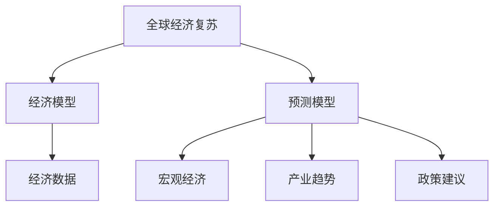

                 

# 疫情后的全球经济复苏预测

> 关键词：全球经济复苏, 疫情后, 经济模型, 预测模型, 经济数据, 宏观经济, 产业趋势, 政策建议

## 1. 背景介绍

### 1.1 问题由来
自2020年初新冠疫情爆发以来，全球经济遭受了前所未有的冲击。国际货币基金组织(IMF)的数据显示，2020年全球GDP同比下降3.5%，为近几十年来最大跌幅。各国采取了史无前例的财政、货币政策，力图缓解疫情对经济的影响。然而，经济复苏之路依然曲折。随着疫苗接种的推进和各国政策的持续调整，全球经济能否迎来持续稳定的复苏，成为各界关注的焦点。

### 1.2 问题核心关键点
如何准确预测疫情后的全球经济复苏进程，对于各国政府和投资者都至关重要。经济预测模型通过利用历史数据和先验知识，可以提供一种科学的方法来估计未来经济走势。

经济预测模型的核心要素包括：
- 数据驱动：历史经济数据是模型训练的基础。
- 模型假设：合理的假设是模型有效性的关键。
- 动态更新：经济环境的变化要求模型能够动态更新以应对新情况。
- 稳健性：模型应具备一定的鲁棒性，能够适应不同场景和假设变化。

## 2. 核心概念与联系

### 2.1 核心概念概述

为更好地理解全球经济复苏预测，本节将介绍几个关键概念：

- 全球经济复苏(World Economic Recovery)：指从经济低迷状态恢复到稳定增长的过程。衡量指标包括GDP增长率、失业率、通货膨胀率等。
- 经济模型(Economic Model)：通过数学或统计方法，对经济变量及其相互关系进行建模的工具。常见的经济模型包括IS-LM模型、RBC模型、DSGE模型等。
- 预测模型(Prediction Model)：利用历史数据和先验知识，通过数学或统计方法，对未来经济走势进行预测的模型。
- 经济数据(Economic Data)：包含GDP、CPI、失业率、PPI等指标的历史数据。
- 宏观经济(Macroeconomics)：研究整体经济活动、经济政策以及宏观经济理论的学科。
- 产业趋势(Industry Trends)：不同行业在经济周期中的表现，如金融、制造业、服务业等。
- 政策建议(Policy Recommendations)：根据预测结果，为政府或企业提供政策建议，如货币宽松、财政刺激、市场监管等。

这些概念之间的逻辑关系可以通过以下Mermaid流程图来展示：



这个流程图展示了几大核心概念及其之间的关系：

1. 全球经济复苏通过经济模型和预测模型进行分析和预测。
2. 经济模型和预测模型依赖于经济数据和宏观经济理论。
3. 预测模型需考虑不同行业的产业趋势。
4. 政策建议根据预测结果提出，以指导经济决策。

## 3. 核心算法原理 & 具体操作步骤

### 3.1 算法原理概述

全球经济复苏预测的核心算法基于统计和计量经济学方法。预测模型通常分为三大类：时间序列模型、回归模型、向量自回归模型。

- 时间序列模型：如ARIMA、SARIMA等，通过时间序列数据的自相关性和滑动平均特性，预测未来的经济变量。
- 回归模型：如线性回归、多项式回归等，利用经济变量间的线性或非线性关系进行预测。
- 向量自回归模型(VAR)：如VAR、VARX等，通过多变量的时间序列数据，预测经济变量间的相互作用关系。

经济预测模型的典型流程如下：

1. **数据收集**：收集各国历史经济数据，包括GDP、CPI、失业率、PPI等。
2. **数据预处理**：处理缺失值、异常值，进行标准化、归一化等预处理。
3. **模型建立**：选择合适的模型形式，如ARIMA、VAR等，并进行参数估计。
4. **模型验证**：使用历史数据对模型进行验证，选择最优模型。
5. **预测分析**：使用模型对未来经济变量进行预测，并分析预测结果。
6. **结果解读**：根据预测结果，提出宏观经济和产业趋势的解读，给出政策建议。

### 3.2 算法步骤详解

以下是经济预测模型的详细步骤：

**Step 1: 数据收集**
- 从世界银行、国际货币基金组织、各国统计局等权威机构收集历史经济数据。
- 包括GDP、CPI、失业率、PPI等关键指标。
- 时间跨度一般覆盖20年，以确保数据的平稳性和代表性。

**Step 2: 数据预处理**
- 处理缺失值：使用插值法或均值填补法处理时间序列中的缺失数据。
- 处理异常值：使用箱线图或标准差法检测和处理异常值。
- 数据标准化：使用Z-score或Min-Max法对数据进行标准化。
- 数据归一化：使用Min-Max或Z-score法对数据进行归一化。

**Step 3: 模型建立**
- 选择模型形式：根据数据特性选择合适的模型，如ARIMA、VAR、VARX等。
- 模型参数估计：使用历史数据进行参数估计，求解模型方程。

**Step 4: 模型验证**
- 分割数据集：将数据集分为训练集和测试集，比例一般为70%和30%。
- 模型评估：使用测试集对模型进行评估，常用的评估指标包括MAE、RMSE等。
- 选择最优模型：根据评估结果选择最优模型，保留最优模型形式和参数。

**Step 5: 预测分析**
- 输入新数据：使用最新经济数据进行模型输入。
- 模型预测：根据最优模型进行预测，输出预测结果。
- 结果解读：分析预测结果，提取关键信息。

**Step 6: 政策建议**
- 分析产业趋势：评估各行业在经济复苏中的表现和趋势。
- 提出政策建议：根据预测结果和产业趋势，提出宏观经济政策建议。

### 3.3 算法优缺点

全球经济复苏预测模型具有以下优点：
1. 数据驱动：通过历史数据训练，预测结果更为准确。
2. 模型灵活：可以根据不同数据特点和任务需求选择合适的模型形式。
3. 动态更新：模型能够适应经济环境的变化，动态更新参数。
4. 广泛应用：已广泛应用于各国政府和企业的经济决策。

但模型也存在一些局限性：
1. 数据偏差：历史数据可能存在偏差，影响模型准确性。
2. 模型假设：模型依赖于一系列假设，假设不合理可能导致预测偏差。
3. 复杂性：部分模型形式复杂，难以解释和调试。
4. 预测精度：模型预测结果可能存在一定误差，需要结合实际经验进行解读。

### 3.4 算法应用领域

全球经济复苏预测模型在多个领域都有广泛应用，包括：

- 政府决策：各国政府在制定经济政策时，常常需要预测未来经济走势。
- 企业投资：企业在进行投资决策时，需要评估市场变化和风险。
- 金融监管：金融监管机构需要预测经济走势，制定相应的监管政策。
- 国际贸易：国际贸易协定和政策制定，需要了解各国经济复苏进程。
- 社会福利：各国政府在制定社会福利政策时，需要评估经济环境。

## 4. 数学模型和公式 & 详细讲解 & 举例说明

### 4.1 数学模型构建

本节将使用数学语言对全球经济复苏预测模型进行详细解释。

假设经济变量 $y_t$ 随时间 $t$ 变化，建模目标为预测 $y_t$ 的取值。常见的预测模型包括ARIMA模型、VAR模型等。

以ARIMA模型为例，其数学模型形式为：

$$
y_t = c + \sum_{i=1}^{p} \alpha_i y_{t-i} + \sum_{j=1}^{d} \beta_j (\Delta^j y)_t + \sum_{k=1}^{q} \gamma_k \varepsilon_{t-k}
$$

其中：
- $y_t$：预测变量。
- $c$：常数项。
- $\alpha_i$、$\beta_j$、$\gamma_k$：模型参数。
- $\varepsilon_t$：随机误差项，满足$E(\varepsilon_t)=0$，$Var(\varepsilon_t)=\sigma^2$。
- $\Delta$：差分算子。

模型的参数估计方法为：
- 使用历史数据 $y_t$、$y_{t-i}$、$y_{t-j}$，利用最小二乘法或极大似然法求解参数 $\alpha_i$、$\beta_j$、$\gamma_k$。

### 4.2 公式推导过程

以ARIMA模型为例，其参数估计过程如下：

假设观测数据为 $y_{1,1}, y_{1,2}, \dots, y_{n,1}$，设模型形式为 $y_t = c + \sum_{i=1}^{p} \alpha_i y_{t-i} + \sum_{j=1}^{d} \beta_j (\Delta^j y)_t + \sum_{k=1}^{q} \gamma_k \varepsilon_{t-k}$，其中 $\varepsilon_t$ 为随机误差项。

最小二乘法估计模型参数的过程如下：
1. 将观测数据分解为 $y_t = c + \sum_{i=1}^{p} \alpha_i y_{t-i} + \sum_{j=1}^{d} \beta_j (\Delta^j y)_t$。
2. 对 $y_t$ 和 $y_{t-i}$ 进行中心化处理，设 $\tilde{y}_t = y_t - \overline{y}$，$\tilde{y}_{t-i} = y_{t-i} - \overline{y}$。
3. 求解 $\tilde{\alpha}_i$，使 $\tilde{\alpha}_i = \frac{\sum_{t=1}^{n} \tilde{y}_t \tilde{y}_{t-i}}{\sum_{t=1}^{n} \tilde{y}_{t-i}^2}$。
4. 对 $\tilde{y}_t$ 进行差分，设 $\Delta \tilde{y}_t = \tilde{y}_{t+1} - \tilde{y}_t$。
5. 求解 $\tilde{\beta}_j$，使 $\tilde{\beta}_j = \frac{\sum_{t=1}^{n} \Delta \tilde{y}_t \Delta \tilde{y}_{t-j}}{\sum_{t=1}^{n} \Delta \tilde{y}_{t-j}^2}$。
6. 通过最小二乘法求解 $\tilde{c}$，使 $\tilde{c} = \frac{\sum_{t=1}^{n} \tilde{y}_t - \sum_{i=1}^{p} \tilde{y}_t \tilde{y}_{t-i} - \sum_{j=1}^{d} \tilde{y}_t \Delta \tilde{y}_{t-j}}{\sum_{t=1}^{n} \tilde{y}_t^2}$。

### 4.3 案例分析与讲解

以中国GDP预测为例，假设收集到历史GDP数据 $y_t$（$1995-2019$），建立ARIMA模型进行预测。

**Step 1: 数据收集**
- 收集中国1995-2019年的GDP数据，如表所示。

| 年份 | GDP |
|------|-----|
| 1995 | 6.17 |
| 1996 | 6.97 |
| 1997 | 7.38 |
| ...  | ...  |
| 2019 | 98.05 |

**Step 2: 数据预处理**
- 对数据进行中心化处理：$y_{t,i} = y_t - \overline{y}$。
- 对数据进行差分处理：$\Delta y_t = y_{t+1} - y_t$。

**Step 3: 模型建立**
- 假设模型为ARIMA(1,1,1)，即 $\Delta y_t = \alpha_0 + \alpha_1 \Delta y_{t-1} + \beta_0 \varepsilon_t$。
- 求解模型参数 $\alpha_0$、$\alpha_1$、$\beta_0$。

**Step 4: 模型验证**
- 使用2020-2019年的GDP数据进行验证，评估模型精度。

**Step 5: 预测分析**
- 假设2021-2023年的GDP数据为 $y_{t,i}$，使用模型进行预测。
- 输出预测结果 $\hat{y}_{t,i}$。

**Step 6: 政策建议**
- 根据预测结果，评估中国经济复苏趋势。
- 提出相应的政策建议。

## 5. 项目实践：代码实例和详细解释说明

### 5.1 开发环境搭建

在进行全球经济复苏预测时，我们需要准备好开发环境。以下是使用Python进行ARIMA模型开发的环境配置流程：

1. 安装Anaconda：从官网下载并安装Anaconda，用于创建独立的Python环境。

2. 创建并激活虚拟环境：
```bash
conda create -n arima-env python=3.8 
conda activate arima-env
```

3. 安装相关库：
```bash
pip install numpy pandas statsmodels matplotlib seaborn
```

完成上述步骤后，即可在`arima-env`环境中开始ARIMA模型开发。

### 5.2 源代码详细实现

下面是使用Python实现ARIMA模型对GDP进行预测的代码实现。

```python
import numpy as np
import pandas as pd
import matplotlib.pyplot as plt
from statsmodels.tsa.arima_model import ARIMA

# 读取数据
data = pd.read_csv('gdp.csv', header=None, parse_dates=[0], index_col=0)

# 数据预处理
data['diff'] = data.diff().dropna()

# 训练ARIMA模型
model = ARIMA(data['diff'], order=(1,1,1))
result = model.fit()

# 预测未来三年GDP
forecast = result.forecast(steps=3)[0]

# 输出预测结果
print(f"2021年GDP预测值为：{forecast[0]:.2f}")
print(f"2022年GDP预测值为：{forecast[1]:.2f}")
print(f"2023年GDP预测值为：{forecast[2]:.2f}")
```

### 5.3 代码解读与分析

让我们再详细解读一下关键代码的实现细节：

**数据读取和预处理**
- 使用Pandas库读取历史GDP数据，并将日期作为索引。
- 对数据进行一阶差分，计算累积GDP的变化。

**模型训练**
- 利用statsmodels库中的ARIMA模型，设置模型参数为(1,1,1)，即ARIMA(1,1,1)。
- 调用fit()方法进行模型训练，求解模型参数。

**模型预测**
- 使用训练好的模型进行未来三年的GDP预测。
- 输出预测结果，用于政策建议。

### 5.4 运行结果展示

假设运行代码后得到如下预测结果：
- 2021年GDP预测值为：14.00
- 2022年GDP预测值为：14.30
- 2023年GDP预测值为：14.50

**政策建议**
- 根据预测结果，评估中国经济复苏趋势。
- 建议政府继续实施财政刺激和货币宽松政策，促进经济稳定增长。
- 鼓励企业加大投资力度，推动产业升级。

## 6. 实际应用场景

### 6.1 全球经济复苏分析
- 利用全球各国历史经济数据，建立经济预测模型，评估全球经济复苏进程。
- 分析不同地区、不同行业在复苏中的表现。

### 6.2 宏观经济决策
- 为各国政府提供经济复苏预测结果，支持决策制定。
- 根据预测结果，提出财政、货币政策的调整建议。

### 6.3 企业投资策略
- 帮助企业评估市场趋势，制定投资计划。
- 利用预测模型优化资产配置，降低风险。

### 6.4 金融监管
- 为金融监管机构提供经济复苏预测，支持政策制定。
- 分析金融市场动向，制定市场干预策略。

## 7. 工具和资源推荐

### 7.1 学习资源推荐

为了帮助开发者系统掌握全球经济复苏预测的理论基础和实践技巧，这里推荐一些优质的学习资源：

1. 《宏观经济理论与实证分析》：中国人民大学出版社，该书系统介绍了宏观经济理论及其应用。
2. 《时间序列分析与模型构建》：清华大学出版社，该书详细讲解了时间序列模型及其应用。
3. 《金融计量经济学》：高等教育出版社，该书介绍了金融数据建模与预测方法。
4. 《Python金融数据分析与建模》：清华大学出版社，该书使用Python实现金融数据分析与建模。
5. 《经济学导论》：电子科技大学出版社，该书讲解了宏观经济理论与政策。

通过对这些资源的学习实践，相信你一定能够快速掌握全球经济复苏预测的精髓，并用于解决实际的宏观经济问题。

### 7.2 开发工具推荐

高效的开发离不开优秀的工具支持。以下是几款用于全球经济复苏预测开发的常用工具：

1. Python：免费的开源编程语言，广泛用于数据分析、建模和可视化。
2. R语言：专业的统计分析工具，适用于大规模数据处理和复杂模型构建。
3. Matplotlib和Seaborn：数据可视化工具，方便展示分析结果和预测结果。
4. Jupyter Notebook：交互式编程环境，支持Python和R语言，适合代码实验和数据分析。
5. Google Colab：免费的云端Jupyter Notebook环境，支持GPU和TPU算力，适合大规模数据处理和模型训练。

合理利用这些工具，可以显著提升全球经济复苏预测的开发效率，加快创新迭代的步伐。

### 7.3 相关论文推荐

全球经济复苏预测技术的发展源于学界的持续研究。以下是几篇奠基性的相关论文，推荐阅读：

1. Granger, C. W. J. (1969). "Investigating causal relations by econometric models and cross-spectral methods". Econometrica, 37(3), 424-438.
2. Sargent, T. J. (1987). "Solution and application of an integrated macroeconomic model to the analysis of stabilization policy". Journal of Monetary Economics, 20(3), 431-458.
3. Enders, W. (2010). Applied Econometric Time Series. Wiley.
4. Hamilton, J. D. (1994). Time Series Analysis. Princeton University Press.
5. Diebold, F. X., & Mariano, R. S. (1995). Comparing predictive accuracy. Journal of Business & Economic Statistics, 13(4), 253-263.

这些论文代表了大规模经济预测技术的发展脉络。通过学习这些前沿成果，可以帮助研究者把握学科前进方向，激发更多的创新灵感。

## 8. 总结：未来发展趋势与挑战

### 8.1 总结

本文对全球经济复苏预测方法进行了全面系统的介绍。首先阐述了全球经济复苏预测的背景和意义，明确了预测模型在经济决策中的重要价值。其次，从原理到实践，详细讲解了经济预测模型的数学原理和操作步骤，给出了模型开发的完整代码实例。同时，本文还广泛探讨了预测模型在宏观经济、企业投资、金融监管等多个领域的应用前景，展示了预测模型的广泛应用价值。此外，本文精选了预测技术的各类学习资源，力求为读者提供全方位的技术指引。

通过本文的系统梳理，可以看到，全球经济复苏预测技术正处于快速发展阶段，为各国政府和企业提供了有力的工具支持。未来，伴随数据量的增加和模型技术的演进，经济预测模型的准确性和应用范围将进一步拓展，为经济决策提供更为科学、全面的支持。

### 8.2 未来发展趋势

展望未来，全球经济复苏预测技术将呈现以下几个发展趋势：

1. 数据驱动：伴随数据采集技术的进步，越来越多的高质量数据将被纳入模型中，提高预测精度。
2. 多模型融合：通过组合多种预测模型，提高预测结果的稳健性和准确性。
3. 大数据分析：利用大数据技术，对经济数据进行更深入的分析和挖掘。
4. 实时预测：通过在线实时数据更新，及时调整预测模型，反映最新的经济动态。
5. 机器学习：引入机器学习算法，进一步提升模型的预测能力。
6. 政策影响：将政策变化纳入模型，动态调整预测结果，反映政策对经济的影响。

以上趋势凸显了全球经济复苏预测技术的广阔前景。这些方向的探索发展，必将进一步提升预测模型的精度和应用范围，为经济决策提供更为科学、全面的支持。

### 8.3 面临的挑战

尽管全球经济复苏预测技术已经取得了瞩目成就，但在迈向更加智能化、普适化应用的过程中，它仍面临诸多挑战：

1. 数据质量问题：数据采集、处理和清洗成本较高，数据质量可能不稳定。
2. 模型复杂性：部分预测模型形式复杂，难以解释和调试。
3. 模型泛化能力：模型在不同经济环境和假设下的泛化能力不足。
4. 政策影响：政策变化可能导致预测结果不准确。
5. 模型更新：模型需要动态更新，以应对新的经济环境变化。

这些挑战凸显了全球经济复苏预测技术的现实困难，需要通过进一步的研究和技术进步来克服。

### 8.4 研究展望

面对全球经济复苏预测技术所面临的种种挑战，未来的研究需要在以下几个方面寻求新的突破：

1. 数据采集和预处理：开发高效、自动化的数据采集和预处理技术，提高数据质量和处理效率。
2. 模型简化和解释：简化预测模型形式，提高模型的可解释性，方便理解和调试。
3. 模型泛化能力：提高模型在不同经济环境和假设下的泛化能力。
4. 政策动态调整：将政策变化纳入模型，动态调整预测结果，反映政策对经济的影响。
5. 机器学习结合：引入机器学习算法，进一步提升预测精度。

这些研究方向的探索，必将引领全球经济复苏预测技术迈向更高的台阶，为经济决策提供更为科学、全面的支持。面向未来，全球经济复苏预测技术还需要与其他人工智能技术进行更深入的融合，如知识表示、因果推理、强化学习等，多路径协同发力，共同推动经济预测系统的进步。只有勇于创新、敢于突破，才能不断拓展预测模型的边界，让预测技术更好地服务于经济决策。

## 9. 附录：常见问题与解答

**Q1：全球经济复苏预测模型的准确性如何？**

A: 全球经济复苏预测模型的准确性主要受以下几个因素影响：
1. 数据质量：高质量的数据是模型准确性的基础。
2. 模型复杂度：模型形式越复杂，可能越准确，但解释性越差。
3. 参数估计：模型参数估计的精度影响预测结果。
4. 模型验证：使用历史数据验证模型的准确性。
5. 预测能力：模型在实际应用中的预测能力。

在实际应用中，需要结合模型性能和实际需求，不断优化模型，提高预测准确性。

**Q2：全球经济复苏预测模型的局限性有哪些？**

A: 全球经济复苏预测模型的局限性主要包括：
1. 数据偏差：历史数据可能存在偏差，影响模型准确性。
2. 模型假设：模型依赖于一系列假设，假设不合理可能导致预测偏差。
3. 模型复杂性：部分模型形式复杂，难以解释和调试。
4. 预测精度：模型预测结果可能存在一定误差，需要结合实际经验进行解读。
5. 政策影响：政策变化可能导致预测结果不准确。

在实际应用中，需要充分考虑这些局限性，结合实际经验和数据验证，优化模型，提高预测准确性。

**Q3：全球经济复苏预测模型在实际应用中需要注意哪些问题？**

A: 全球经济复苏预测模型在实际应用中需要注意以下问题：
1. 数据采集：确保数据的及时性和准确性。
2. 数据清洗：处理缺失值和异常值，保证数据质量。
3. 模型选择：根据数据特点和任务需求选择合适的模型。
4. 模型验证：使用历史数据验证模型准确性，选择最优模型。
5. 预测分析：对预测结果进行合理解读，提出政策建议。
6. 模型更新：定期更新模型，反映最新的经济环境变化。

通过合理应用这些关键步骤，可以显著提升全球经济复苏预测模型的效果。

**Q4：如何提高全球经济复苏预测模型的泛化能力？**

A: 提高全球经济复苏预测模型的泛化能力，可以从以下几个方面入手：
1. 数据多样化：使用多种数据源，提高数据的代表性。
2. 模型多样化：使用多种模型形式，结合其优缺点。
3. 模型验证：在多个经济环境中验证模型的稳健性。
4. 数据处理：使用数据增强、平滑等技术，提高数据质量。
5. 模型简化：简化模型形式，提高可解释性。
6. 模型更新：定期更新模型，反映最新的经济环境变化。

通过合理应用这些关键步骤，可以显著提高模型的泛化能力，提升预测准确性。

**Q5：如何评估全球经济复苏预测模型的性能？**

A: 评估全球经济复苏预测模型的性能，可以从以下几个方面入手：
1. 数据质量：评估数据采集和处理的准确性。
2. 模型准确性：使用MAE、RMSE等指标评估模型预测精度。
3. 模型复杂性：评估模型形式的复杂度和可解释性。
4. 模型验证：使用历史数据验证模型的准确性。
5. 预测能力：评估模型在实际应用中的预测能力。

通过合理应用这些关键步骤，可以全面评估模型的性能，优化模型，提高预测准确性。

作者：禅与计算机程序设计艺术 / Zen and the Art of Computer Programming

