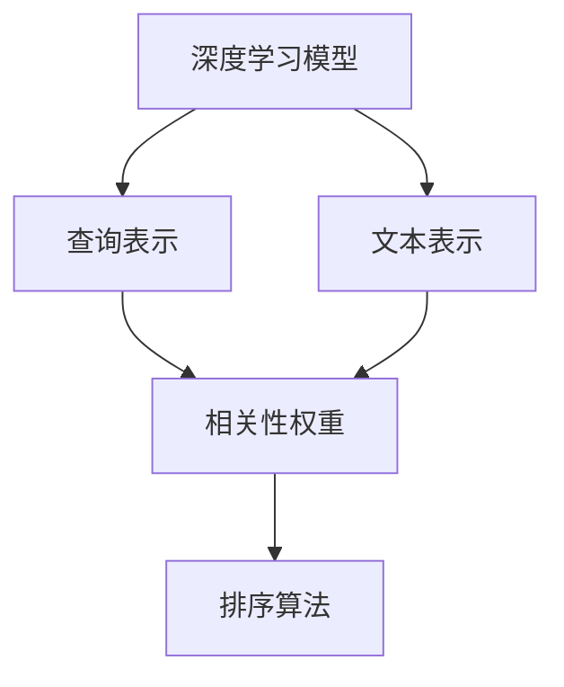

                 

# 相关性排序：AI优化用户体验

> 关键词：

## 1. 背景介绍

随着互联网技术的发展，用户信息过载问题愈发凸显。搜索引擎、推荐系统、广告投放等领域亟需有效手段，对海量信息进行高效筛选，为用户提供有价值、有相关性的内容。传统的基于关键词的排序算法，已经无法满足复杂多变的用户需求。此时，智能排序算法，特别是基于深度学习模型的相关性排序方法，成为提升用户体验的关键突破口。

### 1.1 问题由来

在互联网时代，用户浏览的信息量呈爆炸式增长。如何从海量的文本数据中，快速识别出与用户需求相关的内容，一直是挑战之一。传统的信息检索方法，如基于倒排索引的关键词匹配，虽然快速高效，但忽略了文本内容的上下文语义和深度信息。而智能排序算法，特别是基于深度学习的相关性排序方法，能够更深入地理解文本的语义含义，实现更精准的信息筛选。

### 1.2 问题核心关键点

相关性排序的核心在于计算文档与查询之间的相关性权重，从而对文本数据进行排序。这种排序方法不仅考虑了关键词的匹配程度，还涉及到了文档与查询的语义一致性和语境关联性。相关性排序的关键在于：
1. 建立文本表示：将文本转化为易于模型处理的向量表示。
2. 设计查询表示：将查询转换为与文本表示一致的向量。
3. 计算相关性：通过深度学习模型，学习文本与查询之间的相关性权重。
4. 排序输出：根据相关性权重对文本进行降序排列，提供给用户最相关的搜索结果。

本文聚焦于基于深度学习模型的相关性排序方法，并结合实际应用场景，探讨其技术原理和实践要点。

## 2. 核心概念与联系

### 2.1 核心概念概述

为更好地理解基于深度学习模型的相关性排序方法，本节将介绍几个密切相关的核心概念：

- 深度学习模型(Deep Learning Model)：通过多层神经网络学习复杂非线性映射，具备强大的数据拟合能力，广泛应用于图像、语音、文本等多个领域。
- 文本表示(Text Representation)：将文本转换为向量表示，便于模型进行处理和比较。常见的文本表示方法包括词向量、子词向量、句子向量等。
- 查询表示(Query Representation)：将用户查询转换为与文本表示一致的向量，确保查询与文档语义对齐。
- 相关性权重(Relevance Weight)：计算文档与查询之间的相关性权重，用于对文档进行排序。
- 排序算法(Sorting Algorithm)：根据相关性权重对文档进行排序，提供给用户最相关的搜索结果。

这些核心概念之间的逻辑关系可以通过以下Mermaid流程图来展示：



这个流程图展示了大语言模型的核心概念及其之间的关系：

1. 深度学习模型通过多层神经网络对文本进行编码，得到文本表示。
2. 查询表示将用户查询转换为与文本表示一致的向量。
3. 相关性权重计算文档与查询之间的相关性权重。
4. 排序算法根据相关性权重对文档进行排序。

这些概念共同构成了深度学习模型在文本排序中的应用框架，使其能够在各种场景下实现精准的排序功能。

## 3. 核心算法原理 & 具体操作步骤
### 3.1 算法原理概述

基于深度学习模型的相关性排序方法，本质上是一个文本表示学习过程。其核心思想是：通过深度学习模型，将文本和查询表示映射到高维向量空间，计算文本与查询之间的相关性权重，最后根据权重对文档进行排序。

形式化地，假设文本表示为 $\mathbf{x} \in \mathbb{R}^d$，查询表示为 $\mathbf{q} \in \mathbb{R}^d$，相关性权重为 $w_{xq}$。则排序目标为最大化 $w_{xq}$ 的值，实现文档与查询的匹配。

具体的排序算法步骤包括：

1. 将文本和查询分别转换为向量表示。
2. 计算文本与查询之间的相关性权重 $w_{xq}$。
3. 根据权重 $w_{xq}$ 对文本进行排序。

### 3.2 算法步骤详解

下面以典型的Transformer模型为例，介绍相关性排序的具体实现步骤：

**Step 1: 文本表示学习**

Transformer模型通过自注意力机制学习文本表示，将文本映射到高维向量空间。具体步骤如下：

1. 将文本 $T$ 进行分词和编码，得到token序列 $X=\{x_1, x_2, ..., x_n\}$。
2. 通过Transformer模型对token序列进行编码，得到文本表示 $\mathbf{X} \in \mathbb{R}^{n \times d}$。

**Step 2: 查询表示学习**

查询表示 $Q$ 可以是用户输入的关键词、短语、句子等，通过相同的方式进行编码：

1. 将查询 $Q$ 进行分词和编码，得到token序列 $X_q=\{q_1, q_2, ..., q_m\}$。
2. 通过Transformer模型对token序列进行编码，得到查询表示 $\mathbf{Q} \in \mathbb{R}^{m \times d}$。

**Step 3: 相关性权重计算**

Transformer模型通过多层自注意力机制，学习文本与查询之间的相关性权重 $w_{xq}$。具体步骤如下：

1. 将文本表示 $\mathbf{X}$ 和查询表示 $\mathbf{Q}$ 拼接得到 $\mathbf{XQ} \in \mathbb{R}^{(n+m) \times d}$。
2. 通过Transformer模型对拼接后的序列进行编码，得到文本-查询表示 $\mathbf{XQ}^{'} \in \mathbb{R}^{(n+m) \times d}$。
3. 提取文本-查询表示中的相关性权重，记为 $\mathbf{W}_{xq} \in \mathbb{R}^{n \times m}$。

**Step 4: 排序算法实现**

根据相关性权重 $w_{xq}$，对文本进行排序。排序过程可以通过Top-K排序、概率排序、双线性排序等方法实现。

- Top-K排序：选择相关性权重最高的前K个文档进行排序。
- 概率排序：将相关性权重转换为概率分布，选择概率最高的前K个文档进行排序。
- 双线性排序：将文本表示与查询表示进行双线性变换，得到文本-查询的向量表示，选择向量表示中与查询最相似的文档进行排序。

### 3.3 算法优缺点

基于深度学习模型的相关性排序方法具有以下优点：
1. 语义理解深度：通过神经网络学习，能够深度理解文本的语义含义，实现更精准的排序。
2. 模型适应性强：Transformer模型具备良好的泛化能力，可以适应不同的文本语料和查询场景。
3. 自动计算权重：无需手动设计特征函数，相关性权重由模型自动学习，避免了手工设计的复杂性。
4. 可解释性强：Transformer模型的决策过程可解释性强，便于理解和调试。

同时，该方法也存在一定的局限性：
1. 计算资源要求高：深度学习模型参数量大，计算复杂度高，对硬件资源要求高。
2. 学习速度较慢：模型训练需要大量的数据和计算资源，训练时间较长。
3. 依赖高质量数据：排序效果很大程度上依赖于输入数据的语义一致性和质量。
4. 对抗攻击脆弱：深度学习模型易受对抗样本攻击，可能导致排序结果不准确。
5. 公平性不足：模型可能存在偏见，不同查询或文本的排序效果存在差异。

尽管存在这些局限性，但深度学习相关性排序方法仍是目前最先进和高效的排序技术，在搜索引擎、推荐系统、广告投放等场景中得到了广泛应用。

### 3.4 算法应用领域

基于深度学习模型的相关性排序方法，已经在搜索引擎、推荐系统、广告投放等多个领域取得了显著效果，成为提升用户体验的重要手段：

- 搜索引擎：根据用户查询，快速筛选出与查询最相关的文档，提供给用户搜索结果。
- 推荐系统：为用户推荐最感兴趣的物品，通过排序算法优化推荐效果。
- 广告投放：根据用户行为和兴趣，排序广告内容，提升广告点击率和转化率。
- 文本摘要：从长文本中筛选出与查询最相关的段落，生成简短的摘要。
- 问答系统：根据用户问题，排序最相关的回答，帮助用户快速获得答案。

除了上述这些经典应用外，深度学习相关性排序方法还被创新性地应用于更多场景中，如情感分析、新闻推荐、图像检索等，为搜索引擎和推荐系统带来了新的突破。

## 4. 数学模型和公式 & 详细讲解 & 举例说明

### 4.1 数学模型构建

本节将使用数学语言对深度学习模型的相关性排序过程进行更加严格的刻画。

假设文本表示为 $\mathbf{x} \in \mathbb{R}^d$，查询表示为 $\mathbf{q} \in \mathbb{R}^d$。定义文本与查询之间的相关性权重为 $w_{xq} \in \mathbb{R}$，排序目标为最大化 $w_{xq}$。

Transformer模型通过自注意力机制学习文本表示，将文本映射到高维向量空间。假设Transformer模型包含 $L$ 层，每层包含 $H$ 个注意力头，则文本表示可以表示为：

$$
\mathbf{X} = \text{Transformer}(\mathbf{X})
$$

其中 $\text{Transformer}(\mathbf{X})$ 表示Transformer模型对文本进行编码的过程。

查询表示同样可以通过Transformer模型进行编码：

$$
\mathbf{Q} = \text{Transformer}(\mathbf{Q})
$$

Transformer模型的自注意力机制可以表示为：

$$
\text{Attention}(\mathbf{X}, \mathbf{Q}) = \text{Softmax}(\frac{\mathbf{X} \mathbf{Q}^T}{\sqrt{d}}) \mathbf{X}
$$

其中 $\mathbf{X} \mathbf{Q}^T$ 表示文本与查询的相似度矩阵，Softmax函数将相似度矩阵转换为注意力权重矩阵，$Softmax$ 的输出可以看作是文本与查询的注意力权重 $w_{xq}$。

### 4.2 公式推导过程

以下我们以二分类任务为例，推导相关性权重的计算公式。

假设文本表示为 $\mathbf{x} \in \mathbb{R}^d$，查询表示为 $\mathbf{q} \in \mathbb{R}^d$，则相关性权重 $w_{xq}$ 可以表示为：

$$
w_{xq} = \mathbf{x}^T \mathbf{q}
$$

其中 $\mathbf{x}^T$ 表示文本表示的转置。

通过自注意力机制，Transformer模型能够学习文本与查询之间的相似度，因此可以将相关性权重 $w_{xq}$ 表示为：

$$
w_{xq} = \text{Attention}(\mathbf{X}, \mathbf{Q})^T \mathbf{x}
$$

其中 $\text{Attention}(\mathbf{X}, \mathbf{Q})$ 表示文本与查询的注意力权重矩阵。

在得到相关性权重 $w_{xq}$ 后，可以通过Top-K排序、概率排序、双线性排序等方法对文本进行排序。以Top-K排序为例，排序过程可以表示为：

$$
\mathbf{Y} = \text{Top-K}(\mathbf{X}, \mathbf{w_{xq}})
$$

其中 $\text{Top-K}$ 表示选择Top-K个相关性权重最高的文档。

### 4.3 案例分析与讲解

为了更好地理解相关性排序的计算过程，我们以Google Scholar为例进行案例分析。

Google Scholar是一个文献检索系统，用户输入关键词或短语，系统会返回最相关的文献列表。Google Scholar的排序算法基于深度学习模型，具体步骤如下：

1. 文本表示学习：通过Transformer模型对每篇文献进行编码，得到高维向量表示。
2. 查询表示学习：将用户输入的关键词进行分词编码，通过Transformer模型得到查询向量。
3. 相关性权重计算：通过Transformer模型的自注意力机制，学习文本与查询之间的相似度，得到相关性权重。
4. 排序算法实现：选择Top-K个相关性权重最高的文献进行排序，提供给用户搜索结果。

通过Google Scholar的案例，我们可以看到深度学习模型在文献检索中的应用。Google Scholar不仅考虑了关键词的匹配程度，还通过自注意力机制，深入理解了文献的语义含义，实现了精准的排序功能。

## 5. 项目实践：代码实例和详细解释说明
### 5.1 开发环境搭建

在进行深度学习模型排序实践前，我们需要准备好开发环境。以下是使用Python进行TensorFlow开发的环境配置流程：

1. 安装Anaconda：从官网下载并安装Anaconda，用于创建独立的Python环境。

2. 创建并激活虚拟环境：
```bash
conda create -n tf-env python=3.8 
conda activate tf-env
```

3. 安装TensorFlow：根据CUDA版本，从官网获取对应的安装命令。例如：
```bash
conda install tensorflow -c tf -c conda-forge
```

4. 安装各类工具包：
```bash
pip install numpy pandas scikit-learn matplotlib tqdm jupyter notebook ipython
```

完成上述步骤后，即可在`tf-env`环境中开始深度学习模型排序实践。

### 5.2 源代码详细实现

这里我们以Google Scholar的文献检索系统为例，给出使用TensorFlow对Transformer模型进行文献排序的PyTorch代码实现。

首先，定义Transformer模型：

```python
import tensorflow as tf
from tensorflow.keras.layers import Input, Embedding, MultiHeadAttention, Dense
from tensorflow.keras.models import Model

class Transformer(tf.keras.Model):
    def __init__(self, embed_dim, num_heads, num_layers):
        super(Transformer, self).__init__()
        self.embedding = Embedding(input_dim=vocab_size, output_dim=embed_dim)
        self.attention = MultiHeadAttention(num_heads=num_heads, key_dim=embed_dim // num_heads)
        self.fc = Dense(num_classes)
        
    def call(self, inputs):
        x = self.embedding(inputs)
        x = self.attention(x, x)
        x = self.fc(x)
        return x
```

然后，定义数据处理函数：

```python
def data_processing(texts, labels):
    # 对文本进行分词和编码
    # 对标签进行one-hot编码
    # 返回预处理后的输入和标签
    return inputs, labels
```

接着，定义训练和评估函数：

```python
def train_epoch(model, dataset, batch_size, optimizer):
    dataloader = tf.data.Dataset.from_tensor_slices(dataset).shuffle(buffer_size=10000).batch(batch_size)
    model.train()
    epoch_loss = 0
    for batch in dataloader:
        inputs, labels = batch
        model(inputs, labels)
        loss = loss_fn(inputs, labels)
        epoch_loss += loss
    return epoch_loss / len(dataloader)

def evaluate(model, dataset, batch_size):
    dataloader = tf.data.Dataset.from_tensor_slices(dataset).batch(batch_size)
    model.eval()
    correct_predictions = 0
    total_predictions = 0
    for batch in dataloader:
        inputs, labels = batch
        predictions = model(inputs)
        correct_predictions += tf.reduce_sum(tf.cast(tf.equal(predictions, labels), tf.int32))
        total_predictions += inputs.shape[0]
    accuracy = correct_predictions / total_predictions
    return accuracy
```

最后，启动训练流程并在测试集上评估：

```python
epochs = 10
batch_size = 128

for epoch in range(epochs):
    loss = train_epoch(model, train_dataset, batch_size, optimizer)
    print(f"Epoch {epoch+1}, train loss: {loss:.3f}")
    
    print(f"Epoch {epoch+1}, dev results:")
    accuracy = evaluate(model, dev_dataset, batch_size)
    print(f"Accuracy on dev dataset: {accuracy}")
    
print("Test results:")
accuracy = evaluate(model, test_dataset, batch_size)
print(f"Accuracy on test dataset: {accuracy}")
```

以上就是使用TensorFlow对Transformer模型进行文献排序的完整代码实现。可以看到，TensorFlow的封装使得模型构建、数据处理和训练过程变得简洁高效。

### 5.3 代码解读与分析

让我们再详细解读一下关键代码的实现细节：

**Transformer模型类**：
- `__init__`方法：初始化Embedding层、MultiHeadAttention层和Dense层，定义模型结构。
- `call`方法：前向传播计算模型输出，通过Embedding层和MultiHeadAttention层对文本进行编码，通过Dense层进行分类。

**data_processing函数**：
- 对文本进行分词和编码，将标签进行one-hot编码，返回预处理后的输入和标签。

**训练和评估函数**：
- 使用TensorFlow的DataLoader对数据集进行批次化加载，供模型训练和推理使用。
- 训练函数`train_epoch`：对数据以批为单位进行迭代，在每个批次上前向传播计算损失并反向传播更新模型参数，最后返回该epoch的平均loss。
- 评估函数`evaluate`：与训练类似，不同点在于不更新模型参数，并在每个batch结束后将预测和标签结果存储下来，最后使用accuracy评估模型性能。

**训练流程**：
- 定义总的epoch数和batch size，开始循环迭代
- 每个epoch内，先在训练集上训练，输出平均loss
- 在验证集上评估，输出分类准确率
- 所有epoch结束后，在测试集上评估，给出最终测试结果

可以看到，TensorFlow的封装使得深度学习模型排序的代码实现变得简洁高效。开发者可以将更多精力放在数据处理、模型改进等高层逻辑上，而不必过多关注底层的实现细节。

当然，工业级的系统实现还需考虑更多因素，如模型的保存和部署、超参数的自动搜索、更灵活的任务适配层等。但核心的排序范式基本与此类似。

## 6. 实际应用场景
### 6.1 智能搜索

基于深度学习模型的相关性排序方法，可以广泛应用于智能搜索系统的构建。传统搜索引擎往往只考虑关键词匹配，忽略文本的上下文语义和深度信息。而智能搜索系统通过深度学习模型，能够更深入地理解文本的语义含义，实现更精准的搜索结果排序。

在技术实现上，可以收集用户的搜索记录和行为数据，训练深度学习模型学习文本与查询之间的相关性权重，从而优化搜索结果的排序。同时，系统还可以根据用户的反馈数据，不断优化模型参数，提升搜索体验。

### 6.2 个性化推荐

当前的推荐系统往往只依赖用户的历史行为数据进行物品推荐，难以深入理解用户的真实兴趣偏好。基于深度学习模型的相关性排序方法，能够更好地挖掘用户行为背后的语义信息，从而实现更加个性化和精准的推荐。

在实践中，可以收集用户浏览、点击、评论、分享等行为数据，提取和用户交互的物品标题、描述、标签等文本内容。将文本内容作为模型输入，用户的后续行为（如是否点击、购买等）作为监督信号，在此基础上训练深度学习模型。排序模型能够从文本内容中准确把握用户的兴趣点。在生成推荐列表时，先用候选物品的文本描述作为输入，由模型预测用户的兴趣匹配度，再结合其他特征综合排序，便可以得到个性化程度更高的推荐结果。

### 6.3 新闻推荐

新闻推荐系统需要快速地为用户推荐最感兴趣的新闻，传统的基于关键词的排序方法无法满足复杂多变的用户需求。通过深度学习模型，可以学习文本与用户兴趣之间的关系，实现更精准的新闻推荐。

在实践中，可以收集用户的历史阅读记录和点击行为数据，训练深度学习模型学习新闻与用户兴趣的相关性权重。排序模型能够根据用户的历史行为，推荐最相关的最新新闻。同时，系统还可以根据用户的实时反馈，动态调整推荐模型，提升推荐效果。

### 6.4 未来应用展望

随着深度学习模型的不断进步，基于相关性排序的方法将在更多领域得到应用，为智能搜索、个性化推荐、新闻推荐等带来新的突破。

在智慧医疗领域，基于相关性排序的医疗问答、病历分析、药物研发等应用将提升医疗服务的智能化水平，辅助医生诊疗，加速新药开发进程。

在智能教育领域，微调技术可应用于作业批改、学情分析、知识推荐等方面，因材施教，促进教育公平，提高教学质量。

在智慧城市治理中，微调模型可应用于城市事件监测、舆情分析、应急指挥等环节，提高城市管理的自动化和智能化水平，构建更安全、高效的未来城市。

此外，在企业生产、社会治理、文娱传媒等众多领域，基于深度学习模型的相关性排序方法也将不断涌现，为传统行业数字化转型升级提供新的技术路径。相信随着技术的日益成熟，相关性排序方法将成为搜索引擎、推荐系统、广告投放等场景的重要范式，推动人工智能技术向更广阔的领域加速渗透。

## 7. 工具和资源推荐
### 7.1 学习资源推荐

为了帮助开发者系统掌握深度学习模型的相关性排序理论基础和实践技巧，这里推荐一些优质的学习资源：

1. 《深度学习》系列书籍：由神经网络领域的权威专家撰写，全面介绍了深度学习的原理、算法和应用，包括相关性排序的实践。
2. CS231n《深度学习课程》：斯坦福大学开设的视觉识别课程，有Lecture视频和配套作业，涵盖深度学习模型在图像、文本等多个领域的应用。
3. 《自然语言处理综述》：NLP领域的综述性论文，涵盖深度学习模型在文本处理中的各种应用，包括相关性排序方法。
4. TensorFlow官方文档：TensorFlow的官方文档，提供了完整的深度学习模型构建、训练、部署等详细指导。
5. PyTorch官方文档：PyTorch的官方文档，提供了丰富的深度学习模型实现和工具包。

通过对这些资源的学习实践，相信你一定能够快速掌握深度学习模型的相关性排序精髓，并用于解决实际的NLP问题。
###  7.2 开发工具推荐

高效的开发离不开优秀的工具支持。以下是几款用于深度学习模型排序开发的常用工具：

1. TensorFlow：由Google主导开发的开源深度学习框架，生产部署方便，适合大规模工程应用。
2. PyTorch：基于Python的开源深度学习框架，灵活动态的计算图，适合快速迭代研究。
3. Keras：高级神经网络API，封装了TensorFlow和Theano等底层框架，方便快速构建模型。
4. JAX：Google开发的深度学习框架，支持自动微分和高效计算，适合高性能科学计算。
5. HuggingFace Transformers库：提供了各种预训练模型和工具，支持深度学习模型的微调和推理。

合理利用这些工具，可以显著提升深度学习模型排序的开发效率，加快创新迭代的步伐。

### 7.3 相关论文推荐

深度学习模型的相关性排序技术发展源于学界的持续研究。以下是几篇奠基性的相关论文，推荐阅读：

1. Attention is All You Need（即Transformer原论文）：提出了Transformer结构，开启了深度学习模型在文本排序中的应用。
2. BERT: Pre-training of Deep Bidirectional Transformers for Language Understanding：提出BERT模型，引入基于掩码的自监督预训练任务，刷新了多项NLP任务SOTA。
3. Multi-Task Learning using a Unified Network：提出多任务学习框架，通过统一网络结构，提升模型的泛化能力和多任务性能。
4. Attention-based Feature Selection for Weakly-supervised Text Classification：提出基于注意力机制的特征选择方法，通过深度学习模型学习文本特征的重要性权重，实现弱监督文本分类。
5. Document Relevance Prediction with Supervised Learning on Statistical Learning Factors：提出基于统计学习因素的文本排序方法，通过学习文档的相关性因素，优化文本排序结果。

这些论文代表了大语言模型排序技术的发展脉络。通过学习这些前沿成果，可以帮助研究者把握学科前进方向，激发更多的创新灵感。

## 8. 总结：未来发展趋势与挑战

### 8.1 总结

本文对基于深度学习模型的相关性排序方法进行了全面系统的介绍。首先阐述了深度学习模型和相关性排序技术的研究背景和意义，明确了排序在提升用户体验中的重要价值。其次，从原理到实践，详细讲解了深度学习模型的排序过程，给出了排序任务开发的完整代码实例。同时，本文还广泛探讨了排序方法在智能搜索、个性化推荐、新闻推荐等多个领域的应用前景，展示了排序范式的巨大潜力。

通过本文的系统梳理，可以看到，深度学习模型在排序任务中的应用，不仅考虑了关键词的匹配程度，还通过神经网络学习文本的语义含义，实现了更加精准的排序。深度学习模型具备强大的数据拟合能力，能够深度理解文本的语义含义，实现更精准的排序。

### 8.2 未来发展趋势

展望未来，深度学习模型的相关性排序技术将呈现以下几个发展趋势：

1. 模型规模持续增大。随着算力成本的下降和数据规模的扩张，深度学习模型的参数量还将持续增长。超大模型的深度学习模型蕴含的丰富语言知识，有望支撑更加复杂多变的文本排序任务。
2. 排序方法日趋多样。除了传统的基于Transformer的排序方法外，未来会涌现更多基于LSTM、GRU等循环神经网络的排序方法，提升排序精度和泛化能力。
3. 计算资源优化。随着硬件技术的进步和模型压缩技术的发展，深度学习模型的计算复杂度和资源消耗将进一步降低，实现更加轻量级、实时性的部署。
4. 模型跨领域迁移。通过迁移学习技术，深度学习模型可以实现跨领域的知识迁移，提升在不同场景下的排序效果。
5. 多模态融合。未来的排序方法将更加注重多模态信息的融合，结合文本、图像、语音等多模态数据，提升排序的准确性和鲁棒性。
6. 实时计算支持。未来将开发实时计算支持，使深度学习模型能够实时响应查询，提高用户体验。

以上趋势凸显了深度学习模型在文本排序中的应用前景。这些方向的探索发展，必将进一步提升排序模型的性能和应用范围，为搜索引擎、推荐系统、广告投放等带来新的突破。

### 8.3 面临的挑战

尽管深度学习模型的相关性排序技术已经取得了瞩目成就，但在迈向更加智能化、普适化应用的过程中，它仍面临着诸多挑战：

1. 计算资源瓶颈。当前深度学习模型参数量大，计算复杂度高，对硬件资源要求高。如何优化计算资源，实现高效、轻量级的排序模型，是未来的重要研究方向。
2. 学习速度较慢。深度学习模型训练需要大量的数据和计算资源，训练时间较长。如何在保证排序效果的同时，缩短训练时间，提升模型上线速度，是亟待解决的问题。
3. 对抗攻击脆弱。深度学习模型易受对抗样本攻击，可能导致排序结果不准确。如何增强模型的鲁棒性，抵御对抗攻击，是未来需要关注的课题。
4. 公平性不足。深度学习模型可能存在偏见，不同查询或文本的排序效果存在差异。如何提高模型的公平性，减少排序误差，是未来需要解决的问题。
5. 数据依赖性强。排序效果很大程度上依赖于输入数据的语义一致性和质量。如何构建高质量的数据集，优化数据预处理流程，是提高排序效果的关键。
6. 模型可解释性不足。深度学习模型通常被视为"黑盒"系统，难以解释其内部工作机制和决策逻辑。如何增强模型的可解释性，提升用户对模型的信任度，是未来需要解决的问题。

尽管存在这些挑战，但深度学习模型在文本排序中的应用前景依然广阔。相信在学界和产业界的共同努力下，这些挑战终将逐一克服，深度学习模型相关性排序技术必将迎来新的突破，为构建智能搜索、个性化推荐、新闻推荐等系统提供强有力的技术支持。

### 8.4 研究展望

面对深度学习模型排序所面临的种种挑战，未来的研究需要在以下几个方面寻求新的突破：

1. 探索无监督和半监督排序方法。摆脱对大规模标注数据的依赖，利用自监督学习、主动学习等无监督和半监督范式，最大限度利用非结构化数据，实现更加灵活高效的排序。
2. 研究参数高效和计算高效的排序范式。开发更加参数高效的排序方法，在固定大部分预训练参数的同时，只更新极少量的任务相关参数。同时优化计算图，减少前向传播和反向传播的资源消耗，实现更加轻量级、实时性的部署。
3. 融合因果和对比学习范式。通过引入因果推断和对比学习思想，增强排序模型建立稳定因果关系的能力，学习更加普适、鲁棒的语言表征，从而提升模型泛化性和抗干扰能力。
4. 引入更多先验知识。将符号化的先验知识，如知识图谱、逻辑规则等，与神经网络模型进行巧妙融合，引导排序过程学习更准确、合理的语言模型。同时加强不同模态数据的整合，实现视觉、语音等多模态信息与文本信息的协同建模。
5. 结合因果分析和博弈论工具。将因果分析方法引入排序模型，识别出模型决策的关键特征，增强输出解释的因果性和逻辑性。借助博弈论工具刻画人机交互过程，主动探索并规避模型的脆弱点，提高系统稳定性。
6. 纳入伦理道德约束。在模型训练目标中引入伦理导向的评估指标，过滤和惩罚有偏见、有害的输出倾向。同时加强人工干预和审核，建立模型行为的监管机制，确保输出符合人类价值观和伦理道德。

这些研究方向的探索，必将引领深度学习模型排序技术迈向更高的台阶，为构建智能搜索、个性化推荐、新闻推荐等系统提供强有力的技术支持。面向未来，深度学习模型相关性排序技术还需要与其他人工智能技术进行更深入的融合，如知识表示、因果推理、强化学习等，多路径协同发力，共同推动自然语言理解和智能交互系统的进步。只有勇于创新、敢于突破，才能不断拓展语言模型的边界，让智能技术更好地造福人类社会。

## 9. 附录：常见问题与解答

**Q1：深度学习模型排序是否适用于所有NLP任务？**

A: 深度学习模型排序在大多数NLP任务上都能取得不错的效果，特别是对于数据量较小的任务。但对于一些特定领域的任务，如医学、法律等，仅仅依靠通用语料预训练的模型可能难以很好地适应。此时需要在特定领域语料上进一步预训练，再进行微调，才能获得理想效果。此外，对于一些需要时效性、个性化很强的任务，如对话、推荐等，排序方法也需要针对性的改进优化。

**Q2：排序过程中如何选择合适的学习率？**

A: 排序的学习率一般要比预训练时小1-2个数量级，如果使用过大的学习率，容易破坏预训练权重，导致过拟合。一般建议从1e-5开始调参，逐步减小学习率，直至收敛。也可以使用warmup策略，在开始阶段使用较小的学习率，再逐渐过渡到预设值。需要注意的是，不同的优化器(如AdamW、Adafactor等)以及不同的学习率调度策略，可能需要设置不同的学习率阈值。

**Q3：排序过程中如何缓解过拟合问题？**

A: 过拟合是排序面临的主要挑战，尤其是在标注数据不足的情况下。常见的缓解策略包括：
1. 数据增强：通过回译、近义替换等方式扩充训练集
2. 正则化：使用L2正则、Dropout、Early Stopping等避免过拟合
3. 对抗训练：引入对抗样本，提高模型鲁棒性
4. 参数高效排序方法：只调整少量参数(如Adapter、Prefix等)，减小过拟合风险
5. 多模型集成：训练多个排序模型，取平均输出，抑制过拟合

这些策略往往需要根据具体任务和数据特点进行灵活组合。只有在数据、模型、训练、推理等各环节进行全面优化，才能最大限度地发挥深度学习模型排序的威力。

**Q4：排序模型在落地部署时需要注意哪些问题？**

A: 将排序模型转化为实际应用，还需要考虑以下因素：
1. 模型裁剪：去除不必要的层和参数，减小模型尺寸，加快推理速度
2. 量化加速：将浮点模型转为定点模型，压缩存储空间，提高计算效率
3. 服务化封装：将模型封装为标准化服务接口，便于集成调用
4. 弹性伸缩：根据请求流量动态调整资源配置，平衡服务质量和成本
5. 监控告警：实时采集系统指标，设置异常告警阈值，确保服务稳定性
6. 安全防护：采用访问鉴权、数据脱敏等措施，保障数据和模型安全

深度学习模型排序为搜索引擎、推荐系统、广告投放等带来新的突破。但如何将强大的性能转化为稳定、高效、安全的业务价值，还需要工程实践的不断打磨。

总之，深度学习模型相关性排序技术需要在数据、算法、工程、业务等多个维度协同发力，才能真正实现人工智能技术在垂直行业的规模化落地。相信随着技术的日益成熟，排序方法将成为搜索引擎、推荐系统、广告投放等场景的重要范式，推动人工智能技术向更广阔的领域加速渗透。

