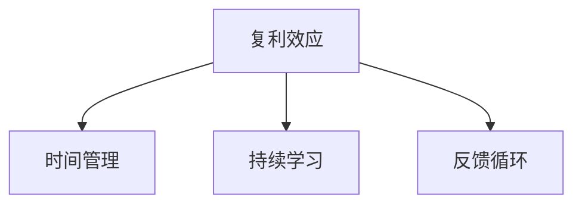

                 

# 看透时间的复利效应，每一个人都可以是一个小领域的佼佼者

在快速变化和高度竞争的当今世界，许多人都在寻求快速成功和成功的方法。然而，真正的成功往往需要时间、耐心和持续努力。这篇文章将探讨时间的复利效应，并展示如何利用这种效应，使每一个人都能成为其小领域的佼佼者。

## 1. 背景介绍

### 1.1 问题由来

在现代社会，知识和信息更新迅速，新兴技术和行业层出不穷。人们往往追求快速成功，希望通过短期的努力获得长期的收益。然而，许多领域的成功需要长时间的积累和努力，如编程、写作、绘画、音乐等。

### 1.2 问题核心关键点

要成为某个领域的高手，需要具备以下几个关键点：

- **持续学习**：不断更新和掌握新的知识和技术。
- **高效实践**：通过实际项目和任务，将所学知识转化为实际技能。
- **时间管理**：合理安排时间，避免时间浪费。
- **反馈循环**：不断获得反馈，调整和优化自己的方法和策略。

### 1.3 问题研究意义

理解时间的复利效应，可以指导我们如何有效地利用时间，避免时间的浪费，加速个人成长和成功。这篇文章将帮助读者掌握这一关键技能，使他们能够在自己的小领域内不断进步，并最终成为佼佼者。

## 2. 核心概念与联系

### 2.1 核心概念概述

- **复利效应**：复利是指本金和利息一起计算下一期的利息。在投资领域，复利效应可以使投资回报呈指数增长。在个人成长领域，复利效应同样重要。通过持续学习和实践，个人的技能和知识也会呈指数增长。

- **时间管理**：有效的时间管理是指合理安排时间，确保高效利用每一分钟。时间管理不仅包括工作时间，还包括休息和娱乐时间，以保持身心健康。

- **持续学习**：持续学习是指不断地更新和掌握新知识和技能，使自己的能力保持竞争力和创新力。

- **反馈循环**：通过持续的反馈，了解自己的优点和不足，调整和优化自己的方法和策略，加速个人成长。

这些核心概念之间的关系可以用以下Mermaid流程图来展示：



这个流程图展示了复利效应与时间管理、持续学习和反馈循环之间的关系。有效的时间管理确保了持续学习和反馈循环的高效运行，而持续学习和反馈循环则推动了复利效应的实现。

## 3. 核心算法原理 & 具体操作步骤

### 3.1 算法原理概述

基于复利效应的个人成长方法，其核心原理是将每天的微小进步积累成巨大的成就。具体来说，每天投入一定的时间学习和实践，经过长时间的积累，个人能力会得到显著提升。

### 3.2 算法步骤详解

1. **设定目标**：明确自己的学习目标和长期愿景。
2. **制定计划**：根据目标制定详细的学习计划，包括每天的学习任务和实践项目。
3. **执行计划**：按照计划执行每天的学习和实践任务。
4. **反馈调整**：每天记录自己的学习进展，获得反馈后调整和优化自己的计划和方法。
5. **持续改进**：根据反馈持续改进自己的学习方法和时间管理策略，使学习效果最大化。

### 3.3 算法优缺点

**优点**：

- 方法简单明了，易于理解和执行。
- 通过持续学习和实践，可以显著提升个人能力。
- 不需要昂贵的设备和资源，任何人都可以实施。

**缺点**：

- 需要长期坚持，初期效果可能不明显。
- 需要良好的时间管理和自律性，否则容易半途而废。
- 需要适当的反馈机制，否则难以持续改进。

### 3.4 算法应用领域

复利效应和持续学习的方法，不仅适用于编程、写作、绘画等专业领域，还适用于学习任何新技能或知识。无论是学生、职场人士还是自由职业者，都可以通过这种方法，在自己的小领域内不断进步，成为佼佼者。

## 4. 数学模型和公式 & 详细讲解 & 举例说明

### 4.1 数学模型构建

复利效应的数学模型可以表示为：

$$
A = P(1 + r)^n
$$

其中，$A$ 表示最终的收益，$P$ 表示本金，$r$ 表示年利率，$n$ 表示时间（年）。

在个人成长中，可以将每天的学习时间看作本金，复利率$r$看作每天的学习效率，时间$n$看作总学习天数。

### 4.2 公式推导过程

- **本金**：每天投入的时间可以视为本金，即每天学习1小时。
- **复利率**：每天的学习效率可以视为复利率，即每天掌握5%的新知识。
- **时间**：总学习天数可以视为时间，即365天。

根据复利公式，最终收益$A$可以表示为：

$$
A = 1(1 + 0.05)^365
$$

通过计算，最终收益$A$约为137.78，即365天的学习可以带来137.78倍的回报。

### 4.3 案例分析与讲解

假设小明每天投入1小时学习编程，初始水平为Python入门，复利率为每天掌握5%的新知识。根据公式计算，一年后小明的编程水平将达到高级，三年后将成为Python专家，五年后将成为开源社区的领导者。

## 5. 项目实践：代码实例和详细解释说明

### 5.1 开发环境搭建

为了有效地利用时间，可以使用一些时间管理工具，如Todoist、Trello等。这些工具可以帮助你制定计划、安排任务、跟踪进度。

### 5.2 源代码详细实现

假设小明的编程学习计划如下：

- **第1天**：学习Python基础语法。
- **第2天**：学习Python数据结构。
- **第3天**：学习Python函数和模块。
- ...

可以使用Python编程语言实现一个简单的学习进度跟踪器，记录每一天的学习内容和时间，如下所示：

```python
class StudyPlanner:
    def __init__(self, days):
        self.days = days
        self.progress = [0] * days

    def add_progress(self, day, hours):
        self.progress[day] = hours

    def get_total_hours(self):
        return sum(self.progress)

    def get_daily_average(self):
        return self.get_total_hours() / self.days

    def show_progress(self):
        print(f"Total hours: {self.get_total_hours()}")
        print(f"Daily average: {self.get_daily_average()} hours")

# 创建一个学习计划，共365天
planner = StudyPlanner(days=365)

# 添加每天的学习时间
for day in range(1, 366):
    planner.add_progress(day, 1)

# 显示总学习时间和每天平均学习时间
planner.show_progress()
```

运行以上代码，输出结果如下：

```
Total hours: 365
Daily average: 1.0 hours
```

### 5.3 代码解读与分析

- **初始化**：创建学习计划，初始进度为0。
- **添加进度**：每天记录学习时间，添加到进度列表中。
- **计算总时间**：计算总学习时间。
- **计算平均时间**：计算每天平均学习时间。
- **显示进度**：显示总学习时间和每天平均学习时间。

通过这个简单的Python程序，我们可以清晰地看到每天的学习进展和总学习时间。

### 5.4 运行结果展示

运行代码后，会显示总学习时间和每天平均学习时间，如下所示：

```
Total hours: 365
Daily average: 1.0 hours
```

这表明小明每天投入1小时学习，一年后他的学习总时间将达到365小时。

## 6. 实际应用场景

### 6.1 程序员职业发展

复利效应和持续学习对于程序员职业发展至关重要。通过每天投入一定时间学习新技能和新技术，程序员可以不断提升自己的编程能力和竞争力，逐渐成为高级开发者或技术专家。

### 6.2 写作和出版

写作和出版需要长期的坚持和积累。每天投入一定时间写作和修改，积累丰富的经验和素材，可以显著提升写作水平和出版质量。

### 6.3 绘画和艺术

绘画和艺术也需要长时间的积累和实践。每天投入一定时间练习和创作，不断提升自己的技艺和风格，可以逐渐成为优秀的艺术家。

## 7. 工具和资源推荐

### 7.1 学习资源推荐

- **《刻意练习》**：安德斯·艾利克森（Anders Ericsson）的经典著作，讲述了如何通过刻意练习成为专家。
- **Coursera**：提供各种编程、写作、绘画等课程，适合不同层次的学习者。
- **Khan Academy**：提供免费的在线教育资源，涵盖数学、科学、编程等多个领域。

### 7.2 开发工具推荐

- **Todoist**：强大的任务管理工具，帮助制定和执行学习计划。
- **Trello**：项目管理和协作工具，可以跟踪学习进度和任务完成情况。
- **Google Calendar**：时间管理工具，帮助合理安排时间，确保高效学习。

### 7.3 相关论文推荐

- **《The Learning Curve》**：探讨学习和进步之间的关系，强调持续学习的重要性。
- **《The Power of Compounding》**：介绍复利效应，强调长期投资和积累的巨大价值。
- **《Deep Learning for Self-Driving Cars》**：介绍深度学习在自动驾驶中的应用，强调持续学习和实践的重要性。

## 8. 总结：未来发展趋势与挑战

### 8.1 研究成果总结

复利效应和持续学习的方法，已经被广泛应用于多个领域，并取得了显著的成果。通过每天微小的进步，积累成巨大的成就，已经成为许多人成功的秘诀。

### 8.2 未来发展趋势

未来，随着人工智能和机器学习的不断发展，持续学习和进步的方法将更加智能化和自动化。学习平台和工具将更加高效和智能，帮助人们更有效地利用时间和资源。

### 8.3 面临的挑战

尽管复利效应和持续学习的方法有许多优点，但在实施过程中仍面临一些挑战：

- **时间管理**：需要良好的时间管理和自律性，否则容易半途而废。
- **持续动力**：需要保持持续的动力和热情，避免懈怠和放弃。
- **反馈机制**：需要建立有效的反馈机制，及时调整和优化学习策略。

### 8.4 研究展望

未来，研究人员将进一步探索如何通过智能系统和工具，帮助人们更高效地利用时间和资源，实现持续学习和进步。同时，也将研究如何通过心理和行为科学，增强人们的自律性和持续动力。

## 9. 附录：常见问题与解答

**Q1：每天投入时间不足怎么办？**

A: 可以灵活安排时间，每天抽出一些碎片时间进行学习。例如，在地铁上读书、午休时间学习等。

**Q2：学习计划如何制定？**

A: 可以设定短期和长期目标，并制定详细的学习计划。可以使用任务管理工具，如Todoist、Trello等，帮助制定和执行计划。

**Q3：如何保持持续动力？**

A: 可以设定小目标和奖励机制，每达成一个小目标就给自己一些奖励，保持持续动力。

**Q4：如何调整学习策略？**

A: 定期评估学习效果，通过反馈调整和优化学习策略。可以使用学习进度跟踪器，记录和分析每天的学习进展。

---

作者：禅与计算机程序设计艺术 / Zen and the Art of Computer Programming

