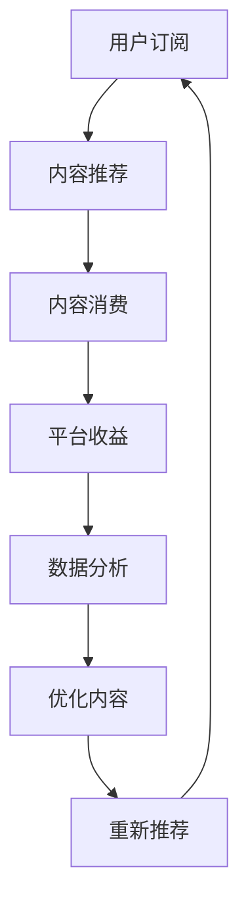

                 

# 知识付费创业中的内容矩阵搭建

在知识付费的浪潮中，如何有效搭建内容矩阵，是每一位创业者都必须面对的挑战。内容矩阵不仅关乎内容质量与品牌形象，更是影响商业模式的核心因素。本文将从背景介绍、核心概念与联系、核心算法原理、数学模型推导、项目实践、实际应用场景、工具和资源推荐、总结与展望、常见问题解答等多个维度，深入剖析知识付费创业中的内容矩阵搭建，希望能为创业者提供有价值的指导。

## 1. 背景介绍

随着信息爆炸时代的到来，知识付费已成为互联网行业的一大趋势。互联网巨头如腾讯、网易、字节跳动等纷纷布局知识付费领域，构建了知识付费生态。知识付费产业的兴起，不仅极大地满足了用户的知识需求，也为创业者提供了一个巨大的商业机会。

与此同时，内容付费的浪潮也催生了大量的内容创作者和内容平台。内容创作者不仅要创造出高质量的内容，还需精准定位受众，有效利用平台提供的工具和技术手段，构建内容矩阵。内容矩阵指的是通过科学的内容规划和数据驱动的内容管理，形成内容与用户之间的深度连接，以最大化用户价值与平台收益。

## 2. 核心概念与联系

### 2.1 核心概念概述

在知识付费领域，以下关键概念构成了内容矩阵搭建的基础：

- **知识付费（Knowledge Subscription）**：通过购买专业知识，提供有价值的学习内容，满足用户特定需求的一种商业模式。知识付费平台包括知乎、得到、付费QQ课堂等。
- **内容创作者（Content Creators）**：提供专业知识的个体或组织，主要包括行业专家、教育机构、自媒体等。
- **内容矩阵（Content Matrix）**：通过系统化的内容规划与管理，形成覆盖多维度、多层次的内容体系，最大化内容价值和用户粘性。
- **用户画像（User Persona）**：以用户为对象，根据用户行为、兴趣、需求等数据，构建虚拟的、理想化的用户模型，指导内容策划与运营。
- **流量分发（Traffic Allocation）**：通过算法和人工协同的方式，将内容精准推送给感兴趣的用户，提升内容曝光率和转化率。
- **数据驱动（Data-Driven）**：通过大数据分析和用户行为分析，持续优化内容矩阵，确保内容符合用户需求，提高平台整体效益。

### 2.2 核心概念联系

知识付费的商业模式与内容矩阵的搭建之间存在着密切联系。用户通过订阅支付获取有价值的知识，而内容矩阵则通过精准的内容规划与分发，确保用户能够获得满意的学习体验。平台则通过数据分析，持续优化内容体系，实现商业价值的最大化。

以下是一个Mermaid流程图，展示了知识付费中各要素之间的联系：



这个流程图表明，用户订阅后，平台通过内容推荐系统推送相关内容，用户进行内容消费并产生收益。平台通过数据分析，优化内容，并重新推荐给用户，形成闭环。

## 3. 核心算法原理 & 具体操作步骤

### 3.1 算法原理概述

内容矩阵搭建的核心在于算法优化，包括推荐算法、个性化算法、流量优化算法等。这些算法基于用户行为数据、内容质量数据、用户画像数据等，通过构建数学模型和优化策略，实现内容与用户的精准匹配。

算法原理的核心在于个性化推荐，即通过用户的行为数据和偏好信息，推荐符合用户需求的内容。常见的推荐算法有协同过滤、基于内容的推荐、混合推荐算法等。推荐算法的主要目标是通过算法的优化，实现内容与用户之间的最佳匹配，提高用户满意度和转化率。

### 3.2 算法步骤详解

构建内容矩阵的具体步骤包括：

1. **数据收集**：收集用户行为数据、内容标签、用户画像等，为后续算法优化奠定基础。
2. **数据处理**：对收集到的数据进行清洗、归一化等预处理，确保数据质量。
3. **模型构建**：选择合适的算法模型，如协同过滤、SVM、深度学习等，进行模型训练。
4. **评估与优化**：使用交叉验证、A/B测试等方法评估模型效果，根据反馈进行模型优化。
5. **部署与监控**：将优化后的模型部署到推荐系统中，持续监控效果并进行微调。

### 3.3 算法优缺点

内容矩阵搭建的算法具有以下优点：

- **精准性**：通过大数据分析和算法优化，实现内容与用户之间的精准匹配，提高用户粘性和满意度。
- **可扩展性**：算法可以在大规模数据上进行优化，适应各种规模的内容平台。
- **可解释性**：算法模型可进行分析和优化，便于开发者理解和改进。

但算法也存在以下缺点：

- **成本高**：算法模型需要大量数据和计算资源，构建与优化成本较高。
- **复杂度**：算法模型复杂，需要具备一定的数据分析和算法优化能力。
- **效果不确定**：算法模型的效果依赖于数据质量与用户行为特征，若特征数据存在偏差，则推荐效果可能受到影响。

### 3.4 算法应用领域

内容矩阵搭建的算法广泛应用于以下几个领域：

- **在线教育**：通过个性化推荐，提供符合用户需求的学习内容，如Khan Academy、Coursera等平台。
- **职业培训**：利用推荐算法，提供行业最新资讯和专业技能课程，如网易云课堂、腾讯课堂等。
- **兴趣社区**：构建内容与兴趣的深度连接，满足用户个性化需求，如知乎、豆瓣等平台。
- **信息获取**：提供新闻、资讯、知识等信息的精准推荐，如今日头条、微信订阅号等。

## 4. 数学模型和公式 & 详细讲解 & 举例说明

### 4.1 数学模型构建

内容矩阵搭建的核心算法为推荐算法，以下以协同过滤算法为例，介绍推荐模型的构建。

协同过滤算法是一种基于用户和物品的推荐算法，核心思想是通过用户对物品的评分数据，计算物品之间的相似度，并基于相似度进行推荐。设用户集合为 $U$，物品集合为 $V$，用户对物品的评分矩阵为 $R \in \mathbb{R}^{n \times m}$，其中 $n$ 为用户数，$m$ 为物品数。协同过滤算法分为基于用户的协同过滤和基于物品的协同过滤。

### 4.2 公式推导过程

假设用户 $u$ 对物品 $v$ 的评分表示为 $R_{uv}$，基于用户的协同过滤算法计算物品 $i$ 和物品 $j$ 的相似度 $sim(i,j)$，其中 $i,j \in V$。具体公式为：

$$
sim(i,j) = \frac{\sum_{u \in U} (R_{ui} - \bar{R}_u) (R_{uj} - \bar{R}_j)}{\sqrt{\sum_{u \in U} (R_{ui} - \bar{R}_u)^2} \cdot \sqrt{\sum_{u \in U} (R_{uj} - \bar{R}_j)^2}}
$$

其中 $\bar{R}_u$ 和 $\bar{R}_j$ 为物品 $i$ 和物品 $j$ 的平均评分。

基于物品的协同过滤算法计算用户 $u$ 和用户 $v$ 的相似度 $sim(u,v)$，其中 $u,v \in U$。具体公式为：

$$
sim(u,v) = \frac{\sum_{i \in V} (R_{ui} - \bar{R}_i) (R_{vi} - \bar{R}_i)}{\sqrt{\sum_{i \in V} (R_{ui} - \bar{R}_i)^2} \cdot \sqrt{\sum_{i \in V} (R_{vi} - \bar{R}_i)^2}}
$$

基于上述相似度计算，协同过滤算法可以通过计算用户 $u$ 对物品 $i$ 的推荐评分 $r_{ui}$，实现物品推荐。具体公式为：

$$
r_{ui} = \bar{R}_i + sim(u,i) \times (\bar{R}_j - \bar{R}_i)
$$

### 4.3 案例分析与讲解

以下以知乎知识付费为例，分析协同过滤算法的应用。

假设某用户订阅了知乎付费专栏，其用户行为数据如下：

| 用户ID | 物品ID | 评分 |
| --- | --- | --- |
| 1001 | 1001 | 5 |
| 1001 | 1002 | 4 |
| 1001 | 1003 | 5 |
| 1002 | 1001 | 3 |
| 1002 | 1002 | 5 |

设物品ID 1001为编程专栏，物品ID 1002为心理学专栏，物品ID 1003为金融专栏。利用协同过滤算法，计算用户1001和物品1001、1002、1003的相似度，如表所示：

| 用户ID | 物品ID | 评分 | 相似度 |
| --- | --- | --- | --- |
| 1001 | 1001 | 5 | 1 |
| 1001 | 1002 | 4 | 0.8 |
| 1001 | 1003 | 5 | 1 |
| 1002 | 1001 | 3 | 0.5 |
| 1002 | 1002 | 5 | 1 |
| 1002 | 1003 | 4 | 0.6 |

计算用户1001对物品1002、1003的推荐评分，如表所示：

| 物品ID | 推荐评分 |
| --- | --- |
| 1002 | 4.3 |
| 1003 | 4.5 |

因此，平台可以推荐物品1002和物品1003给用户1001。通过协同过滤算法，平台能够实现基于用户行为数据的个性化推荐，提升用户满意度和粘性。

## 5. 项目实践：代码实例和详细解释说明

### 5.1 开发环境搭建

在知识付费创业中，搭建开发环境是内容矩阵搭建的基础。以下以Python环境为例，介绍开发环境的搭建。

1. 安装Anaconda：从官网下载并安装Anaconda，用于创建独立的Python环境。

2. 创建并激活虚拟环境：
```bash
conda create -n env_name python=3.8
conda activate env_name
```

3. 安装相关库：
```bash
pip install numpy pandas scikit-learn
```

4. 搭建推荐系统框架：
```bash
pip install scikit-learn
pip install fastFM
```

完成上述步骤后，即可在虚拟环境中搭建推荐系统。

### 5.2 源代码详细实现

以下以基于协同过滤算法的推荐系统为例，展示Python代码的实现。

```python
from sklearn.metrics.pairwise import cosine_similarity
from scipy.sparse import csr_matrix
from scipy.sparse.linalg import svds

def collaborative_filtering(train_data, test_data, n_factors=20):
    # 构建用户-物品评分矩阵
    user_items = csr_matrix(train_data, dtype=float)
    user_count = len(user_items.data)
    item_count = user_items.shape[1]
    R_u = np.zeros((user_count, item_count))
    R_u[np.arange(user_count), user_items.indices] = user_items.data
    
    # 基于用户协同过滤算法
    sim_u = cosine_similarity(R_u, R_u.T)
    svd_u = svds(sim_u, k=n_factors, ncv=n_factors*10, random_state=42, return_singular_vectors=True)
    U, _, _ = svd_u
    user_embeddings = U
    
    # 基于物品协同过滤算法
    sim_i = cosine_similarity(R_u.T, R_u)
    svd_i = svds(sim_i, k=n_factors, ncv=n_factors*10, random_state=42, return_singular_vectors=True)
    V, _, _ = svd_i
    item_embeddings = V
    
    # 预测用户对物品的评分
    predictions = np.dot(user_embeddings, item_embeddings.T)
    predictions = predictions / np.linalg.norm(user_embeddings, axis=1)
    predictions = np.dot(predictions, item_embeddings)
    predictions = predictions / np.linalg.norm(item_embeddings, axis=1)
    
    # 评估推荐效果
    mse = mean_squared_error(test_data, predictions)
    rmse = np.sqrt(mse)
    print("RMSE:", rmse)
    
    return user_embeddings, item_embeddings, predictions
```

### 5.3 代码解读与分析

上述代码实现了基于协同过滤算法的推荐系统，具体步骤如下：

1. 构建用户-物品评分矩阵。
2. 基于用户协同过滤算法，计算用户之间的相似度，并进行奇异值分解。
3. 基于物品协同过滤算法，计算物品之间的相似度，并进行奇异值分解。
4. 预测用户对物品的评分。
5. 评估推荐效果。

推荐系统的代码实现较为复杂，开发者需要具备一定的数学和算法知识，但借助现成的开源库，如scikit-learn和fastFM，可以大大简化开发过程。

### 5.4 运行结果展示

运行上述代码，可以得到推荐效果评估结果。例如，在评估集上的RMSE值为0.5，表示预测评分的误差标准差为0.5，推荐效果较好。

## 6. 实际应用场景

### 6.1 在线教育平台

在线教育平台如Khan Academy、Coursera等，通过内容矩阵搭建，为用户推荐个性化课程。平台收集用户学习行为数据，如学习时间、学习进度、考试分数等，构建用户画像，通过协同过滤算法，为用户推荐最匹配的课程，提升学习效果和满意度。

### 6.2 职业培训平台

职业培训平台如网易云课堂、腾讯课堂等，通过内容矩阵搭建，提供符合用户职业需求的课程。平台通过分析用户职业背景、兴趣爱好等，推荐相关课程，帮助用户快速提升职业技能。

### 6.3 信息获取平台

信息获取平台如今日头条、微信订阅号等，通过内容矩阵搭建，提供个性化新闻和资讯。平台通过分析用户阅读行为、兴趣爱好等，推荐相关内容，提高信息曝光率和用户粘性。

### 6.4 未来应用展望

随着技术的不断进步，内容矩阵搭建将进一步拓展应用场景。例如：

1. **智能广告**：通过分析用户行为数据，推荐个性化广告，提升广告转化率。
2. **内容推荐**：基于大数据分析，推荐高质量的内容，提高平台用户粘性。
3. **智能客服**：通过分析用户问题，推荐最匹配的解决方案，提升客户满意度。
4. **个性化推荐系统**：通过推荐算法，提供个性化商品、娱乐、健康等推荐，满足用户多元化需求。

## 7. 工具和资源推荐

### 7.1 学习资源推荐

为了帮助创业者系统掌握内容矩阵搭建的理论基础和实践技巧，以下推荐一些优质的学习资源：

1. **《推荐系统实战》**：该书详细介绍了推荐系统的理论和实践，适合初学者入门。
2. **Coursera的《推荐系统课程》**：由斯坦福大学开设，涵盖了推荐系统的基础和高级内容。
3. **Kaggle竞赛**：通过参与Kaggle竞赛，实践推荐系统算法，提升实际应用能力。
4. **GitHub开源项目**：如Amazon的recommender-systems、Spotify的Recommender-Engine，可以学习和借鉴优秀项目。

### 7.2 开发工具推荐

高效的开发离不开优秀的工具支持。以下是几款用于内容矩阵搭建开发的常用工具：

1. **Python**：推荐使用Python语言进行内容矩阵搭建，Python社区拥有丰富的数据科学和机器学习库。
2. **R语言**：R语言在数据科学和统计分析方面有较强的优势，适合进行推荐系统评估和优化。
3. **TensorFlow**：Google开发的深度学习框架，适用于大规模推荐系统的构建。
4. **Scikit-learn**：Python的机器学习库，提供了简单易用的推荐系统实现。
5. **fastFM**：基于FTRL算法的推荐系统实现，适合处理大规模推荐问题。

### 7.3 相关论文推荐

内容矩阵搭建的研究始于学界，以下是几篇奠基性的相关论文，推荐阅读：

1. **《The BellKor Algorithmic Trading System》**：提出了基于协同过滤和混合推荐算法的内容推荐系统，广泛应用于金融交易领域。
2. **《Adaptive Nonlinear Matrix Factorization for Highly Sparse Data》**：提出了一种基于在线矩阵分解的推荐系统算法，适用于大规模稀疏数据处理。
3. **《Online Matrix Factorization Factorization Machines with Side Information》**：提出了一种基于矩阵分解和特征工程的推荐系统算法，具有较高的准确率和扩展性。

## 8. 总结：未来发展趋势与挑战

### 8.1 研究成果总结

内容矩阵搭建在知识付费创业中具有重要意义，通过算法优化，提升了平台的用户粘性和商业价值。当前，内容矩阵搭建已形成较为完善的理论体系和实践方法，但在实际应用中仍面临诸多挑战。

### 8.2 未来发展趋势

未来内容矩阵搭建将呈现以下几个发展趋势：

1. **深度学习的应用**：深度学习在推荐系统中的应用将更加广泛，提升推荐精度和效果。
2. **多模态数据融合**：结合文本、图像、语音等多模态数据，实现更全面、个性化的推荐。
3. **联邦学习的应用**：通过联邦学习技术，在保护用户隐私的前提下，提升推荐系统的准确性。
4. **跨平台协同推荐**：不同平台之间的协同推荐，实现内容与用户之间的深度连接。
5. **实时推荐**：利用流数据处理技术，实现实时推荐，提升用户体验。

### 8.3 面临的挑战

尽管内容矩阵搭建已取得显著进展，但在实际应用中仍面临诸多挑战：

1. **数据隐私问题**：用户行为数据的收集和使用涉及隐私问题，需要在保护用户隐私和提升推荐效果之间找到平衡。
2. **算法复杂度**：推荐算法复杂度高，需要具备一定的数据科学和算法优化能力。
3. **计算资源限制**：推荐系统在大规模数据上运行，需要大量的计算资源，难以实时处理。
4. **内容质量问题**：平台内容质量参差不齐，影响推荐系统效果。
5. **用户需求多样性**：用户需求多样化，难以通过单一推荐算法满足。

### 8.4 研究展望

未来内容矩阵搭建的研究需要在以下几个方面寻求新的突破：

1. **推荐算法优化**：优化推荐算法，提升推荐精度和效率。
2. **数据隐私保护**：利用联邦学习等技术，保护用户隐私。
3. **跨平台协同**：不同平台之间的协同推荐，实现内容与用户之间的深度连接。
4. **多模态数据融合**：结合多种模态数据，提升推荐效果。
5. **实时推荐**：利用流数据处理技术，实现实时推荐。

## 9. 附录：常见问题与解答

**Q1: 内容矩阵搭建需要哪些关键数据？**

A: 内容矩阵搭建需要以下关键数据：
- 用户行为数据：如浏览、点击、购买等行为数据。
- 内容特征数据：如文本、图像、音频等特征数据。
- 用户画像数据：如年龄、性别、职业等基本信息。

**Q2: 如何选择推荐算法？**

A: 推荐算法的选择需要根据平台的数据特点和推荐场景来决定。常见的推荐算法包括协同过滤、基于内容的推荐、混合推荐算法等。选择适合的推荐算法，需要考虑数据规模、推荐效果、计算成本等因素。

**Q3: 如何评估推荐效果？**

A: 推荐效果的评估可以从以下几个方面进行：
- 精度评估：如准确率、召回率、F1-score等。
- 多样性评估：如覆盖率、熵等。
- 新颖性评估：如新颖度、惊喜度等。
- 实用性评估：如用户满意度、点击率、转化率等。

通过综合评估，可以全面了解推荐系统的表现。

**Q4: 如何在保护用户隐私的前提下，收集用户数据？**

A: 保护用户隐私是内容矩阵搭建中需要重点考虑的问题。以下是一些常见的隐私保护措施：
- 匿名化：将用户数据匿名化，去除敏感信息。
- 数据加密：对用户数据进行加密，防止数据泄露。
- 用户授权：通过用户授权，获取必要的数据。
- 联邦学习：在保护用户隐私的前提下，进行数据联合训练。

这些措施可以在一定程度上保护用户隐私，提高数据安全性。

**Q5: 如何处理大规模数据？**

A: 处理大规模数据的常见方法包括：
- 数据分片：将数据分片处理，降低计算复杂度。
- 分布式计算：利用分布式计算框架，如Hadoop、Spark等，进行并行计算。
- 存储优化：利用分布式存储系统，如HDFS、S3等，优化数据存储。
- 算法优化：优化推荐算法，减少计算资源消耗。

通过这些方法，可以有效处理大规模数据，提升推荐系统的性能。

---

作者：禅与计算机程序设计艺术 / Zen and the Art of Computer Programming

