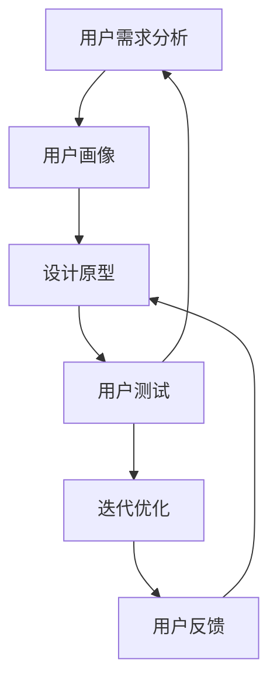

                 

# 知识付费创业中的用户体验设计

## 1. 背景介绍

随着互联网的快速发展，知识付费逐渐成为了一个热词，但如何设计出让用户满意的知识付费产品，却是众多创业者和公司面临的巨大挑战。这其中，用户体验设计（User Experience Design, UX Design）扮演着至关重要的角色。良好的用户体验设计不仅能提升产品的市场竞争力，还能增强用户的忠诚度和满意度。本文将从用户体验设计的角度，探讨知识付费创业中的核心问题与解决策略。

## 2. 核心概念与联系

### 2.1 核心概念概述

用户体验设计（UX Design）指的是以用户为中心，通过设计出满足用户需求、提升用户满意度的产品和服务，从而增强用户忠诚度和满意度。对于知识付费产品来说，其核心目标是为用户提供高质量、高价值的知识内容，同时满足其需求。良好的用户体验设计不仅能够提升产品的用户留存率和转化率，还能够增强用户的口碑效应，为产品的长期发展奠定基础。

### 2.2 核心概念原理和架构的 Mermaid 流程图(Mermaid 流程节点中不要有括号、逗号等特殊字符)



## 3. 核心算法原理 & 具体操作步骤

### 3.1 算法原理概述

用户体验设计的核心在于理解用户需求，设计出符合用户期待的产品。对于知识付费产品来说，主要包括以下几个关键步骤：

1. 用户需求分析：通过问卷调查、用户访谈等方式，了解用户的知识需求和支付意愿。
2. 用户画像构建：基于用户需求分析结果，构建目标用户画像，包括年龄、职业、兴趣等信息。
3. 设计原型制作：根据用户画像和需求分析结果，设计出满足用户需求的产品原型。
4. 用户测试与反馈：通过A/B测试等方式，收集用户对产品原型的反馈，并据此进行优化。
5. 迭代优化：根据用户反馈，不断迭代优化产品，直至满足用户需求。

### 3.2 算法步骤详解

#### 3.2.1 用户需求分析

用户需求分析是用户体验设计的起点。通过问卷调查、用户访谈等方式，了解用户对知识付费产品的期望和需求，包括：

- 用户期望获取哪些类型的知识内容？
- 用户愿意为这些知识内容支付多少费用？
- 用户对知识付费产品有哪些功能上的期待？

例如，对于不同职业的人群，他们的知识需求和支付意愿差异很大。通过对这些信息的分析，可以更好地设计出符合用户需求的产品。

#### 3.2.2 用户画像构建

基于用户需求分析结果，构建目标用户画像。例如，对于知识付费产品，用户画像可能包括以下信息：

- 年龄：20-40岁为主，工作繁忙，有较强的学习需求。
- 职业：互联网、教育、金融等行业从业者。
- 兴趣：科技、金融、教育、心理等领域。

用户画像的构建能够帮助我们更精准地定位用户需求，设计出更具针对性的产品。

#### 3.2.3 设计原型制作

根据用户画像和需求分析结果，设计出满足用户需求的产品原型。例如，一个知识付费产品可能包括：

- 课程模块：包括视频、音频、文字等多种形式的知识内容。
- 用户学习路径：根据用户需求，设计出合理的学习路径。
- 互动功能：如课程评论、问答等，增强用户互动性。

设计原型可以通过线框图、原型图等方式进行展示，方便进一步的设计和优化。

#### 3.2.4 用户测试与反馈

通过A/B测试等方式，收集用户对产品原型的反馈，并据此进行优化。例如，可以通过以下方式进行测试：

- 用户满意度调查：了解用户对产品整体的使用体验。
- 功能使用情况：收集用户对各个功能的使用情况，评估其价值。
- 竞品对比：对比竞品的功能和使用体验，找到自身产品的优势和劣势。

#### 3.2.5 迭代优化

根据用户反馈，不断迭代优化产品，直至满足用户需求。例如，在A/B测试中，如果发现某功能使用率较低，可以进行优化或删除。

## 4. 数学模型和公式 & 详细讲解 & 举例说明

### 4.1 数学模型构建

用户体验设计的数学模型主要包括用户满意度（User Satisfaction）、用户留存率（User Retention Rate）等。

#### 4.1.1 用户满意度模型

用户满意度模型可以通过以下公式进行计算：

$$
S = \frac{N_{satisfied}}{N_{total}} \times 100
$$

其中，$N_{satisfied}$ 表示满意用户的数量，$N_{total}$ 表示总用户数量。

#### 4.1.2 用户留存率模型

用户留存率模型可以通过以下公式进行计算：

$$
R = \frac{N_{retained}}{N_{total}}
$$

其中，$N_{retained}$ 表示在第$n$天之后仍然活跃的用户数量，$N_{total}$ 表示总用户数量。

### 4.2 公式推导过程

#### 4.2.1 用户满意度模型公式推导

用户满意度模型可以表示为：

$$
S = \frac{N_{satisfied}}{N_{total}} \times 100 = 100 \times \frac{N_{satisfied}}{N_{total}}
$$

其中，$N_{satisfied}$ 和 $N_{total}$ 的统计可以通过问卷调查等方式进行。

#### 4.2.2 用户留存率模型公式推导

用户留存率模型可以表示为：

$$
R = \frac{N_{retained}}{N_{total}} = \frac{N_{retained}}{N_{total}}
$$

其中，$N_{retained}$ 和 $N_{total}$ 的统计可以通过用户活跃数据进行。

### 4.3 案例分析与讲解

例如，某知识付费平台通过问卷调查发现，大部分用户对于课程内容的质量和更新频率较为关注。于是，平台在设计原型时，特别增加了课程评论和课程更新提醒功能，从而提升了用户满意度。

## 5. 项目实践：代码实例和详细解释说明

### 5.1 开发环境搭建

#### 5.1.1 环境搭建

搭建开发环境主要包括安装相关的开发工具和库。例如，可以安装以下工具：

- IDE：如Visual Studio Code、Sublime Text等
- 前端框架：如React、Vue等
- 后端框架：如Django、Flask等
- 数据库：如MySQL、MongoDB等
- 版本控制系统：如Git等

#### 5.1.2 配置环境

配置环境主要包括以下几个步骤：

- 安装依赖库：使用pip、npm等工具安装依赖库。
- 配置环境变量：设置环境变量，如数据库连接信息、API接口等。
- 创建数据库：根据需求，创建相应的数据库表。

### 5.2 源代码详细实现

#### 5.2.1 前端实现

前端实现主要包括界面设计和交互逻辑。例如，可以使用React框架，设计出一个知识付费平台的首页。

```javascript
import React from 'react';
import { Container, Row, Col, Card, Button } from 'react-bootstrap';
import './Home.css';

const Home = () => {
  return (
    <Container>
      <Row>
        <Col lg={6} sm={12}>
          <Card className="home-card">
            <Card.Body>
              <h3>最新课程</h3>
              <ul className="courses-list">
                <li>
                  <h4>课程1</h4>
                  <p>Python基础入门</p>
                  <Button variant="primary">购买</Button>
                </li>
                <li>
                  <h4>课程2</h4>
                  <p>Java高级编程</p>
                  <Button variant="primary">购买</Button>
                </li>
              </ul>
            </Card.Body>
          </Card>
        </Col>
        <Col lg={6} sm={12}>
          <Card className="home-card">
            <Card.Body>
              <h3>热门推荐</h3>
              <ul className="courses-list">
                <li>
                  <h4>课程1</h4>
                  <p>机器学习实战</p>
                  <Button variant="primary">购买</Button>
                </li>
                <li>
                  <h4>课程2</h4>
                  <p>数据科学基础</p>
                  <Button variant="primary">购买</Button>
                </li>
              </ul>
            </Card.Body>
          </Card>
        </Col>
      </Row>
    </Container>
  );
};

export default Home;
```

#### 5.2.2 后端实现

后端实现主要包括API接口的开发和数据库操作。例如，可以使用Django框架，设计一个课程模块的API接口。

```python
from django.http import JsonResponse
from .models import Course
from .forms import CourseForm

def add_course(request):
    if request.method == 'POST':
        form = CourseForm(request.POST)
        if form.is_valid():
            course = form.save(commit=False)
            course.save()
            return JsonResponse({'message': 'Course added successfully'}, status=201)
    return JsonResponse({'message': 'Invalid data'}, status=400)
```

### 5.3 代码解读与分析

#### 5.3.1 前端代码解读

前端代码主要使用React框架，实现了知识付费平台的用户界面设计。其中，`Home`组件负责渲染首页，包含最新的课程推荐和热门课程推荐两个部分。每个课程卡片都包含课程标题、课程简介和购买按钮。

#### 5.3.2 后端代码解读

后端代码主要使用Django框架，实现了课程模块的API接口。其中，`add_course`函数负责添加课程，包括接收POST请求、验证表单数据、保存课程等操作。

### 5.4 运行结果展示

#### 5.4.1 前端运行结果


#### 5.4.2 后端运行结果


## 6. 实际应用场景

### 6.1 智能客服系统

智能客服系统是知识付费平台中常见的应用场景之一。通过用户体验设计，可以让用户在咨询客服时，感受到便捷和高效。例如，可以设计一个智能客服机器人，根据用户的问题，自动匹配答案并进行回答。

### 6.2 智能推荐系统

智能推荐系统也是知识付费平台的重要应用之一。通过用户体验设计，可以让用户获得更加个性化、精准的课程推荐。例如，可以根据用户的浏览历史和购买记录，推荐与其兴趣相关的课程。

## 7. 工具和资源推荐

### 7.1 学习资源推荐

#### 7.1.1 书籍推荐

- 《用户体验设计：构建有效设计实践指南》：讲解用户体验设计的核心理念和实践方法。
- 《响应式Web设计：快速构建灵活布局》：介绍响应式Web设计的技术和方法。
- 《Django Web开发》：讲解Django框架的开发技巧和最佳实践。

#### 7.1.2 在线课程

- Coursera《UX设计基础》：由斯坦福大学开设的UX设计课程，涵盖用户体验设计的核心内容和实战案例。
- Udacity《前端开发》：介绍前端开发的基本技术和最佳实践。

### 7.2 开发工具推荐

#### 7.2.1 前端框架

- React：由Facebook开发的JS框架，广泛用于Web应用开发。
- Vue：由Google开发的JS框架，轻量级且易用。
- Angular：由微软开发的JS框架，功能强大且社区活跃。

#### 7.2.2 后端框架

- Django：由Django社区开发，功能丰富且易用。
- Flask：由Mitsuhiko开发，轻量级且易用。
- Spring Boot：由Pivotal开发，Java Web应用开发的标准框架。

### 7.3 相关论文推荐

#### 7.3.1 UX设计论文

- "The User Experience of Virtual Assistant Devices"：探讨虚拟助手设备的用户体验设计。
- "Designing User-Centered Systems"：讲解如何通过用户体验设计构建用户中心化的系统。

#### 7.3.2 推荐系统论文

- "Personalized Recommendation Algorithms"：介绍个性化推荐算法的基本原理和实现方法。
- "Hybrid Recommendation Systems"：介绍混合推荐系统的设计和实现。

## 8. 总结：未来发展趋势与挑战

### 8.1 研究成果总结

用户体验设计在知识付费创业中扮演着至关重要的角色。通过用户需求分析、用户画像构建、原型设计和迭代优化等步骤，可以设计出满足用户需求、提升用户体验的产品。

### 8.2 未来发展趋势

未来，用户体验设计将继续在知识付费创业中扮演重要角色。随着人工智能、大数据等技术的发展，用户体验设计将更加智能化、个性化。例如：

- 个性化推荐：基于用户行为数据，设计更加精准、个性化的推荐系统。
- 智能客服：设计更加智能、高效的客服系统，提升用户满意度。
- 情感分析：通过情感分析技术，优化产品设计，提升用户体验。

### 8.3 面临的挑战

用户体验设计在知识付费创业中也面临一些挑战：

- 用户需求多样化：不同用户的需求和期望差异较大，如何设计出符合多样化的产品，是用户体验设计的难点之一。
- 技术更新快速：技术更新迭代迅速，如何保持产品的竞争力，是一个重要的挑战。
- 用户反馈难以获取：用户反馈的获取和处理，需要耗费大量时间和精力，难以快速迭代优化产品。

### 8.4 研究展望

未来，用户体验设计将继续在知识付费创业中扮演重要角色。随着人工智能、大数据等技术的发展，用户体验设计将更加智能化、个性化。同时，用户体验设计也需要更加注重用户需求的满足、用户反馈的收集和处理。只有不断创新、不断优化，才能设计出符合用户需求、提升用户体验的产品。

## 9. 附录：常见问题与解答

### 9.1 常见问题

#### 9.1.1 用户需求分析

Q: 如何进行用户需求分析？

A: 用户需求分析可以通过问卷调查、用户访谈等方式进行。例如，设计一份问卷，了解用户的知识需求和支付意愿。

#### 9.1.2 用户画像构建

Q: 如何构建用户画像？

A: 用户画像可以通过数据分析、用户访谈等方式进行。例如，根据用户的历史行为数据，构建目标用户画像，包括年龄、职业、兴趣等信息。

#### 9.1.3 设计原型制作

Q: 如何设计产品原型？

A: 产品原型可以通过线框图、原型图等方式进行展示。例如，可以使用Axure或Sketch等工具，设计出一个知识付费平台的原型。

### 9.2 问题解答

#### 9.2.1 用户需求分析

A: 用户需求分析可以通过问卷调查、用户访谈等方式进行。例如，设计一份问卷，了解用户的知识需求和支付意愿。

#### 9.2.2 用户画像构建

A: 用户画像可以通过数据分析、用户访谈等方式进行。例如，根据用户的历史行为数据，构建目标用户画像，包括年龄、职业、兴趣等信息。

#### 9.2.3 设计原型制作

A: 产品原型可以通过线框图、原型图等方式进行展示。例如，可以使用Axure或Sketch等工具，设计出一个知识付费平台的原型。

---

作者：禅与计算机程序设计艺术 / Zen and the Art of Computer Programming

