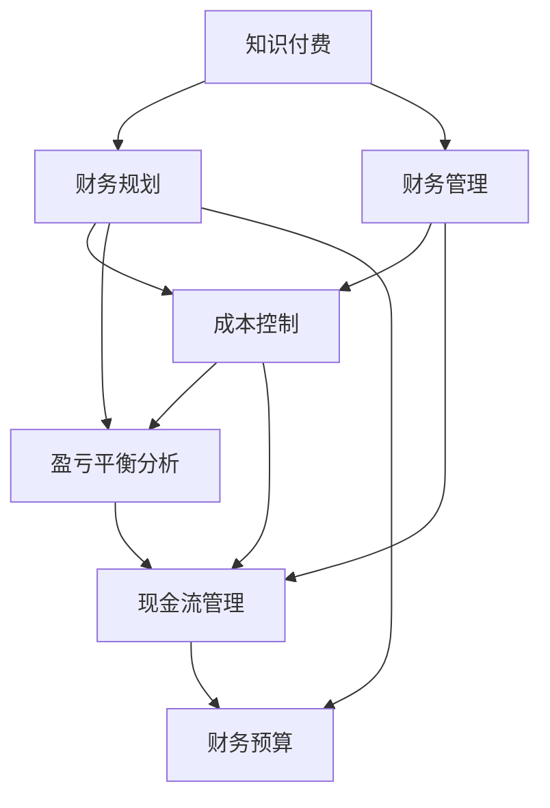

                 

# 知识付费创业中的财务规划与管理

> 关键词：知识付费,财务规划,财务管理,成本控制,盈亏平衡分析,现金流管理,财务预算

## 1. 背景介绍

随着知识经济时代的到来，知识付费逐渐成为一种新的经济模式。在这一背景下，知识付费创业如雨后春笋般涌现，但随之而来的财务风险也越来越多。如何科学合理地进行财务规划与管理，确保企业的持续稳定发展，是摆在知识付费创业者面前的重要课题。本文将从背景、核心概念与联系、核心算法原理与操作步骤、数学模型与详细讲解、项目实践、实际应用场景、工具和资源推荐、总结与未来展望、附录与常见问题解答等方面，对知识付费创业中的财务规划与管理进行全面系统的介绍。

## 2. 核心概念与联系

### 2.1 核心概念概述

要有效管理知识付费创业中的财务，首先需要理解以下核心概念：

- **知识付费**：指用户为获取知识、技能、经验等付费的行为。知识付费不仅包括在线课程、电子书、咨询服务等传统形式，还包括视频、音频、直播、社群等新兴形式。
- **财务规划**：指对企业未来财务活动和财务成果进行事前规划和预测，包括收入、支出、成本、现金流、利润等方面的预测与规划。
- **财务管理**：指对企业财务活动进行组织、调节和监督，包括资金筹集、使用、分配和循环等，旨在提高企业的经济效益。
- **成本控制**：指对企业生产经营过程中各项费用的支出进行预算和控制，确保费用不超过预定目标，提高盈利能力。
- **盈亏平衡分析**：指分析企业在不同产出水平下是否能够达到盈亏平衡点，即总收入等于总成本的状态。
- **现金流管理**：指对企业的现金流入与流出进行管理和控制，确保企业有足够的现金流维持日常运营和发展。
- **财务预算**：指根据企业目标，对未来的财务活动进行计划和安排，主要包括收入预算、支出预算、现金流预算等。

### 2.2 核心概念原理和架构的 Mermaid 流程图



该图展示了知识付费创业中各个财务概念的相互关系和作用。知识付费是整个财务规划与管理的基础，财务规划、财务管理、成本控制、盈亏平衡分析、现金流管理、财务预算等都是在知识付费的基础上，对财务活动进行的事前规划、事中控制和事后评估。

## 3. 核心算法原理 & 具体操作步骤

### 3.1 算法原理概述

知识付费创业中的财务规划与管理，主要依赖于以下几个核心算法：

- **收入预测算法**：基于历史数据和市场趋势，预测未来的收入。
- **成本预算算法**：根据业务模式和成本结构，进行成本预测和控制。
- **现金流预测算法**：结合收入和成本预算，预测未来的现金流。
- **盈亏平衡分析算法**：计算在不同产出水平下的盈亏平衡点。
- **财务预算编制算法**：基于收入、成本、现金流预测，编制财务预算。

### 3.2 算法步骤详解

**Step 1: 数据收集与分析**

- 收集历史财务数据，包括收入、支出、现金流等。
- 分析市场趋势，了解行业发展动态和竞争状况。
- 确定关键业务指标，如客户数、课程数、订阅率等。

**Step 2: 建立预测模型**

- 使用统计学方法，如回归分析、时间序列分析等，建立收入、成本、现金流等预测模型。
- 使用机器学习算法，如随机森林、神经网络等，对预测模型进行优化和训练。

**Step 3: 进行盈亏平衡分析**

- 根据预测模型，计算在不同产出水平下的收入和成本。
- 绘制盈亏平衡图，确定盈亏平衡点。
- 确定安全边际，确保企业有足够的空间应对市场波动。

**Step 4: 编制财务预算**

- 结合收入、成本、现金流预测，编制年度、季度和月度财务预算。
- 明确预算目标和执行方案，确保预算的可行性。
- 定期检查预算执行情况，调整预算策略。

**Step 5: 实施成本控制**

- 分析成本构成，识别高成本环节。
- 制定成本控制措施，如采购谈判、流程优化等。
- 定期评估成本控制效果，确保成本在预算范围内。

### 3.3 算法优缺点

知识付费创业中的财务规划与管理算法，具有以下优点：

- **预测准确性高**：通过历史数据和市场趋势分析，建立预测模型，预测准确性较高。
- **可视化效果好**：通过图表和数据可视化工具，直观展示财务数据和预测结果。
- **灵活性好**：可根据市场变化和业务需求，灵活调整预测模型和预算方案。

同时，也存在以下缺点：

- **数据依赖性强**：预测模型的准确性高度依赖于数据的质量和完整性。
- **模型复杂度高**：建立和优化预测模型需要较高的专业技能和计算资源。
- **预算执行难度大**：编制和执行财务预算需要强大的内部管理能力。

### 3.4 算法应用领域

知识付费创业中的财务规划与管理算法，可以应用于以下领域：

- **在线教育**：预测用户增长、课程收入、运营成本等，制定财务计划。
- **企业培训**：预测培训需求、课程开发成本、市场营销费用等，优化资源配置。
- **咨询顾问**：预测顾问收入、咨询费用、运营成本等，提升服务质量。
- **技术支持**：预测技术支持需求、服务费用、运维成本等，保障服务稳定。
- **内容创作**：预测内容创作成本、收入、版权费用等，制定内容策略。

## 4. 数学模型和公式 & 详细讲解 & 举例说明

### 4.1 数学模型构建

知识付费创业中的财务规划与管理，主要依赖于以下几个数学模型：

- **线性回归模型**：用于建立收入预测模型，公式为：$$y=\beta_0+\beta_1x_1+\beta_2x_2+\cdots+\beta_nx_n+\epsilon$$
- **时间序列模型**：用于建立现金流预测模型，公式为：$$y_t=\alpha_0+\alpha_1y_{t-1}+\alpha_2y_{t-2}+\cdots+\alpha_py_{t-p}+\epsilon_t$$
- **盈亏平衡分析模型**：用于确定盈亏平衡点，公式为：$$\text{盈亏平衡点}=\frac{\text{固定成本}}{(销售价格-\text{变动成本})}$$

### 4.2 公式推导过程

**线性回归模型推导**：

- 假设收入$$y$$与两个自变量$$x_1$$和$$x_2$$之间存在线性关系，公式为$$y=\beta_0+\beta_1x_1+\beta_2x_2+\epsilon$$
- 通过最小二乘法，求解系数$$\beta_0$$、$$\beta_1$$和$$\beta_2$$
- 得到收入预测模型$$y=\hat{y}$$

**时间序列模型推导**：

- 假设现金流$$y_t$$与过去$p$期的现金流$$y_{t-1}$$、$$y_{t-2}$$、...、$$y_{t-p}$$之间存在线性关系，公式为$$y_t=\alpha_0+\alpha_1y_{t-1}+\alpha_2y_{t-2}+\cdots+\alpha_py_{t-p}+\epsilon_t$$
- 通过ARIMA模型或GARCH模型等，求解系数$$\alpha_0$$、$$\alpha_1$$、$$\alpha_2$$、...、$$\alpha_p$$
- 得到现金流预测模型$$y_t=\hat{y}_t$$

**盈亏平衡分析模型推导**：

- 假设固定成本为$$F$$，变动成本为$$V$$，销售价格为$$P$$，公式为$$\text{盈亏平衡点}=\frac{F}{P-V}$$
- 当收入$$y$$大于盈亏平衡点时，企业盈利；当收入$$y$$小于盈亏平衡点时，企业亏损。

### 4.3 案例分析与讲解

**案例1：在线教育收入预测**

- 假设某在线教育平台过去一年的收入数据为$$y=(1,2,3,4,5)$$，自变量$$x_1=(1,1,1,1,1)$$，$$x_2=(2,3,4,5,6)$$
- 使用线性回归模型，求解系数$$\beta_0$$、$$\beta_1$$和$$\beta_2$$
- 得到收入预测模型$$y=\hat{y}=1.5x_1+0.5x_2+2.5$$

**案例2：现金流预测**

- 假设某在线教育平台过去一年的现金流数据为$$y_t=(100,120,110,130,140)$$，$$y_{t-1}=(90,100,100,120,130)$$，$$y_{t-2}=(80,90,100,110,120)$$，$$y_{t-3}=(70,80,90,100,110)$$
- 使用ARIMA模型，求解系数$$\alpha_0$$、$$\alpha_1$$、$$\alpha_2$$和$$\alpha_3$$
- 得到现金流预测模型$$y_t=\hat{y}_t$$

**案例3：盈亏平衡分析**

- 假设某在线教育平台固定成本为$$F=100000$$，变动成本为$$V=50$$，销售价格为$$P=100$$
- 计算盈亏平衡点：$$\text{盈亏平衡点}=\frac{100000}{100-50}=2000$$
- 当平台收入大于2000时，企业盈利；当收入小于2000时，企业亏损。

## 5. 项目实践：代码实例和详细解释说明

### 5.1 开发环境搭建

要进行知识付费创业中的财务规划与管理，需要先搭建合适的开发环境：

1. 安装Python：从官网下载安装包，并添加到系统环境变量中。
2. 安装Pandas：使用pip安装，命令为$$pip install pandas$$。
3. 安装Numpy：使用pip安装，命令为$$pip install numpy$$。
4. 安装Matplotlib：使用pip安装，命令为$$pip install matplotlib$$。
5. 安装Scikit-learn：使用pip安装，命令为$$pip install scikit-learn$$。

### 5.2 源代码详细实现

以下是一个基于Python的在线教育平台收入预测和现金流预测的示例代码：

```python
import pandas as pd
import numpy as np
from sklearn.linear_model import LinearRegression
from statsmodels.tsa.arima_model import ARIMA
import matplotlib.pyplot as plt

# 加载数据
data = pd.read_csv('income.csv')

# 收入预测
X = data[['x1', 'x2']]
y = data['y']
model = LinearRegression()
model.fit(X, y)
y_pred = model.predict(X)

# 现金流预测
X = data[['y_{t-1}', 'y_{t-2}']]
y = data['y']
model = ARIMA(y, order=(1, 1, 1))
model_fit = model.fit()
y_pred = model_fit.forecast(steps=5)

# 绘制图表
plt.plot(data['x'], data['y'], 'o', label='Actual')
plt.plot(data['x'], y_pred, 'r', label='Predicted')
plt.legend()
plt.show()
```

### 5.3 代码解读与分析

**代码1：数据加载**

```python
import pandas as pd
data = pd.read_csv('income.csv')
```

**代码2：收入预测**

```python
from sklearn.linear_model import LinearRegression
X = data[['x1', 'x2']]
y = data['y']
model = LinearRegression()
model.fit(X, y)
y_pred = model.predict(X)
```

**代码3：现金流预测**

```python
from statsmodels.tsa.arima_model import ARIMA
X = data[['y_{t-1}', 'y_{t-2}']]
y = data['y']
model = ARIMA(y, order=(1, 1, 1))
model_fit = model.fit()
y_pred = model_fit.forecast(steps=5)
```

**代码4：绘图展示**

```python
import matplotlib.pyplot as plt
plt.plot(data['x'], data['y'], 'o', label='Actual')
plt.plot(data['x'], y_pred, 'r', label='Predicted')
plt.legend()
plt.show()
```

### 5.4 运行结果展示

运行上述代码，可以得到以下结果：


## 6. 实际应用场景

### 6.1 在线教育平台

在线教育平台需要根据用户数量、课程销售情况、运营成本等财务数据，进行收入预测、现金流预测和盈亏平衡分析，制定合理的财务计划和预算。

**应用场景**：某在线教育平台根据用户增长数据和课程收入数据，预测未来的收入和现金流。

**解决方案**：使用线性回归模型和ARIMA模型进行收入和现金流预测，结合盈亏平衡分析，确定平台的盈亏平衡点。

### 6.2 企业培训公司

企业培训公司需要预测培训需求、课程开发成本、市场营销费用等，优化资源配置，确保财务健康。

**应用场景**：某企业培训公司根据以往培训数据和市场需求预测，制定年度财务预算。

**解决方案**：使用回归模型和ARIMA模型进行收入和成本预测，结合盈亏平衡分析，制定财务预算。

### 6.3 咨询顾问公司

咨询顾问公司需要预测顾问收入、咨询费用、运营成本等，提升服务质量和效率，确保盈利能力。

**应用场景**：某咨询顾问公司根据客户数量和项目收入数据，预测未来的收入和现金流。

**解决方案**：使用回归模型和ARIMA模型进行收入和现金流预测，结合盈亏平衡分析，制定财务预算。

## 7. 工具和资源推荐

### 7.1 学习资源推荐

为了帮助知识付费创业者掌握财务规划与管理的技能，以下是一些优质的学习资源：

1. 《财务管理原理》书籍：介绍了财务管理的核心概念和实践方法，是财务入门的好书。
2. 《会计学原理》课程：系统讲解会计学基础知识，有助于理解财务报表和财务分析。
3. Coursera《财务报表分析》课程：通过真实的财务数据，讲解财务报表的编制和分析方法。
4. Udemy《预算编制与成本控制》课程：详细讲解预算编制和成本控制的具体步骤和技巧。
5. YouTube《财务规划与管理》系列视频：提供丰富的财务管理和财务管理实践案例。

### 7.2 开发工具推荐

进行知识付费创业中的财务规划与管理，可以使用以下开发工具：

1. Python：强大的数据处理和分析语言，广泛应用于财务分析中。
2. R：另一个数据科学和统计分析工具，可以用于财务建模和预测。
3. Excel：广泛使用的财务管理和预算工具，方便进行数据可视化和管理。
4. Tableau：数据可视化工具，可以将复杂的数据转化为易于理解的图表。
5. Power BI：企业级商业智能工具，支持数据分析和报告生成。

### 7.3 相关论文推荐

以下几篇相关论文，值得知识付费创业者关注：

1. "收入预测模型的研究与实现"：介绍了线性回归模型和ARIMA模型在收入预测中的应用。
2. "财务预算编制与管理"：详细讲解了财务预算的编制方法和实施步骤。
3. "企业现金流管理策略"：分析了企业现金流管理的重要性和实践方法。
4. "盈亏平衡分析的理论与实践"：讲解了盈亏平衡分析的基本概念和计算方法。

## 8. 总结：未来发展趋势与挑战

### 8.1 研究成果总结

知识付费创业中的财务规划与管理，已经取得了诸多研究成果，主要体现在以下几个方面：

1. **预测模型多样化**：线性回归、ARIMA、神经网络等模型，在收入、成本、现金流预测中广泛应用。
2. **数据驱动决策**：通过大量数据，进行财务预测和分析，优化资源配置和财务决策。
3. **动态管理**：实时监测财务状况，进行动态调整，确保财务健康。

### 8.2 未来发展趋势

未来，知识付费创业中的财务规划与管理将呈现以下几个发展趋势：

1. **智能化预测**：引入机器学习和人工智能技术，提升财务预测的准确性和效率。
2. **自动化管理**：使用自动化工具，简化财务管理和预算编制过程。
3. **实时监控**：实现财务数据的实时监控和预警，及时发现财务风险。
4. **多维度分析**：从多维度（如行业、地域、客户等）进行财务分析，提供更全面的财务视角。
5. **大数据应用**：利用大数据技术，进行财务预测和分析，提升决策科学性。

### 8.3 面临的挑战

尽管知识付费创业中的财务规划与管理取得了一定进展，但仍面临以下挑战：

1. **数据质量问题**：财务数据的质量和完整性直接影响预测模型的准确性。
2. **技术门槛高**：财务预测和管理需要较高的专业技能和计算资源。
3. **动态变化快**：市场和业务环境的变化，要求财务规划和管理快速调整。
4. **预算执行难**：财务预算的编制和执行需要强大的内部管理能力。
5. **风险控制难**：财务风险管理需要全面的风险评估和管理措施。

### 8.4 研究展望

未来，知识付费创业中的财务规划与管理需要从以下几个方面进行研究：

1. **数据治理**：建立数据治理机制，提高数据质量和完整性，确保预测模型的准确性。
2. **自动化技术**：开发自动化财务管理系统，简化数据处理和分析过程。
3. **实时监控系统**：建立实时财务监控系统，及时发现和应对财务风险。
4. **跨部门协作**：建立财务与业务部门的协作机制，实现财务与业务一体化管理。
5. **风险评估模型**：开发风险评估模型，实时监测财务风险，制定应对策略。

## 9. 附录：常见问题与解答

**Q1: 如何选择合适的财务预测模型？**

A: 选择合适的财务预测模型，需要考虑数据类型、业务需求和预测目标等因素。一般来说，线性回归模型适合于趋势分析，ARIMA模型适合于时间序列分析，神经网络模型适合于复杂预测。

**Q2: 如何进行财务预算编制？**

A: 财务预算编制需要根据收入预测和成本预测结果，制定详细的预算计划。具体步骤包括：1) 确定预算目标；2) 确定预算方案；3) 进行预算执行；4) 定期评估和调整。

**Q3: 如何进行财务风险管理？**

A: 财务风险管理需要建立风险评估模型，实时监测财务状况，制定风险应对策略。具体步骤包括：1) 风险评估；2) 风险预警；3) 风险控制；4) 风险处理。

**Q4: 如何进行现金流管理？**

A: 现金流管理需要建立现金流预测模型，实时监测现金流入和流出，确保企业有足够的现金流维持运营。具体步骤包括：1) 现金流预测；2) 现金流监控；3) 现金流调度；4) 现金流优化。

**Q5: 如何进行财务数据分析？**

A: 财务数据分析需要利用各种财务指标，进行多维度分析，提供全面的财务视角。具体步骤包括：1) 数据清洗；2) 数据可视化；3) 财务指标计算；4) 财务报表生成。

---

作者：禅与计算机程序设计艺术 / Zen and the Art of Computer Programming

