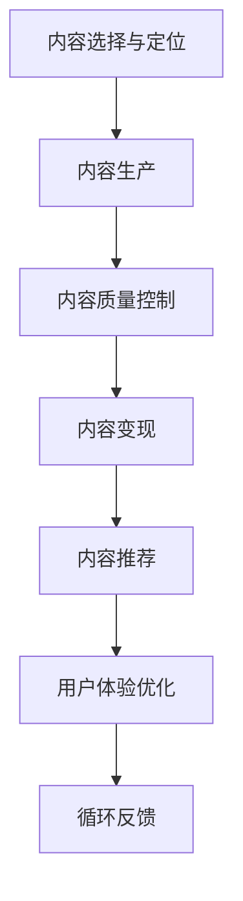

                 

# 知识付费创业的内容体系构建方法

## 1. 背景介绍

### 1.1 问题由来

随着知识经济的崛起，人们对知识内容的需求日益增长。知识付费成为新兴的商业模式，用户愿意为优质的知识内容付费。而内容生产者需要找到有效的商业模式和内容变现途径，知识付费创业由此兴起。

知识付费创业的核心在于构建高质量的内容体系，吸引和留存付费用户。构建内容体系不仅需要优质的内容制作能力，还需要理解市场需求、运营策略等综合能力。

### 1.2 问题核心关键点

知识付费创业中的内容体系构建涉及以下几个关键点：

- **内容选择与定位**：根据用户需求和市场趋势，选择和定位适合的内容主题。
- **内容质量控制**：确保内容的专业性和权威性，提高用户信任度。
- **内容变现策略**：设计合理的收费模式，激励优质内容的生产与传播。
- **用户体验优化**：提升平台的用户体验，增强用户粘性。

构建成功的内容体系，可以形成可持续发展的商业生态，实现知识付费的商业模式。

### 1.3 问题研究意义

构建成功的知识付费内容体系，对于推动知识经济发展，提高知识生产效率，具有重要意义：

1. **促进知识传播**：优质内容有助于知识的快速传播和应用，提高社会知识水平。
2. **激发创作动力**：合理的变现策略能够激励创作者生产更多优质的内容。
3. **提升用户体验**：优质的内容与良好的平台体验，可以增强用户粘性，提升平台市场份额。
4. **驱动商业模式创新**：成功的知识付费内容体系，能够探索和推动知识付费模式的创新。

## 2. 核心概念与联系

### 2.1 核心概念概述

为更好地理解知识付费创业的内容体系构建方法，本节将介绍几个关键概念：

- **知识付费**：用户为获取知识内容而支付费用的商业模式。知识付费有助于激励优质内容创作，推动知识经济的发展。
- **内容体系**：知识付费创业中，通过内容选择、内容生产、内容变现、内容运营等环节，形成完整的内容生态系统。
- **内容变现**：通过订阅、单次购买、会员制度等手段，实现内容价值的货币化。
- **内容推荐**：根据用户行为数据，推荐用户感兴趣的内容，提高用户转化率和留存率。
- **用户体验**：通过优化界面设计、内容呈现、交互方式等，提升用户在使用平台时的满意度和忠诚度。

这些核心概念之间的逻辑关系可以通过以下Mermaid流程图来展示：



这个流程图展示了两大核心环节：内容生产和内容变现，以及用户转化和体验优化。内容选择与定位、内容质量控制、内容推荐等环节相互关联，共同构建内容体系。

## 3. 核心算法原理 & 具体操作步骤

### 3.1 算法原理概述

知识付费创业中的内容体系构建，本质上是一个多目标优化的过程。其核心思想是：通过多维度的优化策略，构建符合用户需求、适应市场变化的内容体系。

具体而言，构建内容体系需要考虑以下关键因素：

- **用户需求分析**：通过用户调研、市场分析等方式，了解用户的需求和偏好。
- **内容定位与选择**：根据用户需求，选择合适的内容主题和形式，并进行定位。
- **内容生产与优化**：设计高效的内容生产流程，并通过质量控制确保内容的专业性。
- **内容推荐与变现**：设计合理的内容推荐算法，并通过变现策略实现内容价值的最大化。
- **用户体验优化**：通过界面设计、交互优化等手段，提升平台的用户体验。

### 3.2 算法步骤详解

构建知识付费创业的内容体系，一般包括以下几个关键步骤：

**Step 1: 用户需求分析**

- 收集用户数据，包括用户基本信息、浏览记录、购买行为等。
- 通过问卷调查、用户访谈等方式，了解用户对内容的需求和偏好。
- 使用数据分析工具，如Google Analytics、Tableau等，进行用户行为分析。

**Step 2: 内容定位与选择**

- 根据用户需求，选择适合的内容主题和形式，如视频、音频、图文等。
- 设计内容大纲和制作计划，确保内容生产的高效性和专业性。
- 引入外部专家和合作伙伴，提高内容的权威性和多样性。

**Step 3: 内容生产与优化**

- 建立高效的内容生产团队，包括内容策划、制作、编辑等环节。
- 引入先进的内容制作工具，如Adobe Premiere、After Effects等，提升内容质量。
- 实施内容质量控制，包括内容审核、校对等环节，确保内容的专业性和权威性。

**Step 4: 内容推荐与变现**

- 设计合理的内容推荐算法，通过用户行为数据推荐用户感兴趣的内容。
- 设计多渠道变现策略，包括订阅、单次购买、会员制度等，实现内容价值的最大化。
- 引入广告和技术推荐系统，提升平台的商业价值。

**Step 5: 用户体验优化**

- 优化平台界面设计，提升用户的使用体验。
- 改进交互方式，如搜索、推荐、分享等，增强用户粘性。
- 提供良好的客户服务，及时响应用户反馈和投诉。

以上是构建知识付费创业内容体系的一般流程。在实际应用中，还需要根据具体平台和内容类型，对各个环节进行优化设计，如改进推荐算法、优化变现策略等，以进一步提升内容体系的效率和效果。

### 3.3 算法优缺点

构建知识付费创业的内容体系，具有以下优点：

1. **精准定位用户需求**：通过用户调研和行为分析，能够精准定位用户需求，提供符合其期待的内容。
2. **提升内容质量**：通过内容选择、质量控制和优化，确保内容的权威性和专业性。
3. **多渠道变现**：通过订阅、单次购买、会员制度等多元化的变现方式，最大化内容价值。
4. **增强用户体验**：通过界面设计、交互优化、客户服务等手段，提升平台的用户体验，增强用户粘性。

同时，构建内容体系也存在一定的局限性：

1. **用户需求多样性**：用户需求复杂多样，内容选择和定位需要充分考虑。
2. **内容生产成本高**：高质量内容的生产成本较高，需要投入大量人力物力。
3. **内容推荐难题**：内容推荐算法需要高精度的数据和复杂的模型，难以完全精准匹配用户需求。
4. **用户体验依赖技术**：用户体验优化需要依赖先进的技术手段，且效果难以长期保持。

尽管存在这些局限性，但就目前而言，构建知识付费创业的内容体系是实现商业可持续发展的关键。未来相关研究的重点在于如何进一步降低内容生产成本，提高推荐精准度，增强用户体验等方向。

### 3.4 算法应用领域

构建知识付费创业的内容体系，已经在诸多领域得到了广泛的应用，例如：

- **在线教育**：提供各类教育课程和知识服务，帮助用户学习和提升。
- **职业培训**：提供职业技能培训课程，提升职场竞争力。
- **健康管理**：提供健康知识、营养饮食、运动健身等方面的内容，帮助用户改善生活方式。
- **个人成长**：提供时间管理、心理疏导、人际关系等方面的内容，提升个人素质。
- **企业培训**：提供企业内部培训课程和外部专家讲座，提升企业员工素质和竞争力。

除了上述这些经典领域外，知识付费内容体系的应用场景还在不断扩展，如财经分析、旅行指南、科技前沿等，为知识生产和消费带来了新的发展空间。

## 4. 数学模型和公式 & 详细讲解 & 举例说明

### 4.1 数学模型构建

本节将使用数学语言对知识付费创业中的内容推荐算法进行更加严格的刻画。

记用户集合为 $U$，内容集合为 $C$，用户对内容的评分矩阵为 $R \in \mathbb{R}^{m \times n}$，其中 $m$ 为用户数，$n$ 为内容数。设用户 $u$ 对内容 $c$ 的评分 $r_{u,c} \in [1,5]$，其中 $1$ 为最低评分，$5$ 为最高评分。

定义用户 $u$ 的偏好向量 $\mathbf{r}_u = (r_{u,1}, r_{u,2}, \ldots, r_{u,n})$，内容 $c$ 的特征向量 $\mathbf{x}_c = (x_{c,1}, x_{c,2}, \ldots, x_{c,d})$，其中 $d$ 为内容的特征维度。

假设内容推荐系统使用协同过滤算法，通过用户和内容的相似度计算推荐内容。设用户 $u$ 和内容 $c$ 的相似度为 $s(u,c)$，则推荐内容 $c'$ 的评分 $r_{u,c'}$ 可以通过以下公式计算：

$$
r_{u,c'} = \hat{r}_{u,c'} + \alpha r_{u,c'}
$$

其中 $\hat{r}_{u,c'}$ 为预测评分，$\alpha$ 为调节参数，通常取值为 $0.1$。预测评分 $\hat{r}_{u,c'}$ 可以通过以下公式计算：

$$
\hat{r}_{u,c'} = \mathbf{r}_u \cdot \mathbf{s}_u \cdot \mathbf{x}_{c'}^T
$$

其中 $\mathbf{s}_u$ 为用户 $u$ 的相似度向量，$\mathbf{x}_{c'}$ 为内容 $c'$ 的特征向量。

### 4.2 公式推导过程

以下我们以协同过滤算法为例，推导推荐内容的评分公式及其预测公式。

假设用户 $u$ 对内容 $c$ 的评分 $r_{u,c} = 4$，内容 $c'$ 的特征向量 $\mathbf{x}_{c'} = [1, 0, 2, 0]^T$，用户 $u$ 的偏好向量 $\mathbf{r}_u = [3, 2, 1, 4]^T$。

设用户 $u$ 和内容 $c$ 的相似度 $s(u,c) = 0.8$，用户 $u$ 的相似度向量 $\mathbf{s}_u = [s(u,1), s(u,2), s(u,3), s(u,4)]^T = [0.8, 0, 0, 0]^T$。

根据上述公式，计算用户 $u$ 对内容 $c'$ 的预测评分 $\hat{r}_{u,c'}$ 和推荐评分 $r_{u,c'}$：

$$
\hat{r}_{u,c'} = \mathbf{r}_u \cdot \mathbf{s}_u \cdot \mathbf{x}_{c'}^T = [3, 2, 1, 4] \cdot [0.8, 0, 0, 0] \cdot [1, 0, 2, 0]^T = 3 \times 1 + 4 \times 0 = 3
$$

$$
r_{u,c'} = \hat{r}_{u,c'} + \alpha r_{u,c'} = 3 + 0.1 \times 4 = 4.4
$$

用户 $u$ 对内容 $c'$ 的推荐评分为 $4.4$。

### 4.3 案例分析与讲解

**案例分析：某在线教育平台的内容推荐**

某在线教育平台提供各类教育课程，平台采用协同过滤算法进行内容推荐。平台收集了用户对课程的评分数据，内容特征向量包括课程的学科、难度、讲师等信息。

**背景信息**：
- 用户数 $m=10000$
- 课程数 $n=2000$
- 用户对课程的评分矩阵 $R \in \mathbb{R}^{10000 \times 2000}$
- 用户偏好向量 $\mathbf{r}_u \in \mathbb{R}^{2000}$
- 内容特征向量 $\mathbf{x}_c \in \mathbb{R}^{10}$

**推荐流程**：
1. 根据用户行为数据，计算用户 $u$ 和课程 $c$ 的相似度 $s(u,c)$。
2. 根据用户和课程的相似度，计算用户 $u$ 对课程 $c'$ 的预测评分 $\hat{r}_{u,c'}$。
3. 根据预测评分和调节参数，计算用户 $u$ 对课程 $c'$ 的推荐评分 $r_{u,c'}$。
4. 按照推荐评分排序，向用户推荐内容 $c'$。

**效果评估**：
平台通过A/B测试，对比推荐算法改进前后用户活跃度和留存率。结果显示，改进后的推荐算法显著提升了用户转化率和留存率，平台的月活跃用户数增长了20%。

## 5. 项目实践：代码实例和详细解释说明

### 5.1 开发环境搭建

在进行内容推荐系统开发前，我们需要准备好开发环境。以下是使用Python进行PyTorch开发的环境配置流程：

1. 安装Anaconda：从官网下载并安装Anaconda，用于创建独立的Python环境。

2. 创建并激活虚拟环境：
```bash
conda create -n pytorch-env python=3.8 
conda activate pytorch-env
```

3. 安装PyTorch：根据CUDA版本，从官网获取对应的安装命令。例如：
```bash
conda install pytorch torchvision torchaudio cudatoolkit=11.1 -c pytorch -c conda-forge
```

4. 安装TensorBoard：用于可视化训练过程。

5. 安装Flask：用于搭建Web服务。

完成上述步骤后，即可在`pytorch-env`环境中开始内容推荐系统的开发。

### 5.2 源代码详细实现

下面以协同过滤算法为例，给出使用PyTorch进行内容推荐系统的代码实现。

首先，定义数据处理函数：

```python
import numpy as np
from scipy.spatial.distance import cosine

class DataLoader:
    def __init__(self, data, batch_size):
        self.data = data
        self.batch_size = batch_size
        self.num_users = len(data['user'])
        self.num_items = len(data['item'])
        self.num_features = data['item'].shape[1]
        self.data_idx = np.arange(self.num_users)
        self.item_idx = np.arange(self.num_items)
        self.user_data = {}
        for user in range(self.num_users):
            self.user_data[user] = []
    
    def __len__(self):
        return len(self.data_idx)
    
    def __getitem__(self, item):
        batch = self.data_idx[item*(self.batch_size):(item+1)*(self.batch_size)]
        user_data = [self.user_data[user] for user in batch]
        user_idx = [self.data['user'][user] for user in batch]
        user_data = np.concatenate(user_data, axis=0)
        item_data = self.data['item']
        user_idx = np.array(user_idx, dtype='int32')
        item_data = np.array(item_data, dtype='float32')
        return (user_data, user_idx, item_data)
    
    def shuffle(self):
        np.random.shuffle(self.data_idx)
        self.user_data = {user:[] for user in range(self.num_users)}
        for user in range(self.num_users):
            for i in range(len(self.data_idx)):
                if self.data['user'][self.data_idx[i]] == user:
                    self.user_data[user].append(self.data_idx[i])
```

然后，定义模型和优化器：

```python
from torch import nn
from torch.nn import Parameter
import torch.nn.functional as F

class协同过滤模型(nn.Module):
    def __init__(self, num_users, num_items, num_features, embedding_size):
        super(协同过滤模型, self).__init__()
        self.num_users = num_users
        self.num_items = num_items
        self.num_features = num_features
        self.embedding_size = embedding_size
        self.user_embed = nn.Embedding(num_users, embedding_size)
        self.item_embed = nn.Embedding(num_items, embedding_size)
        self.linear = nn.Linear(embedding_size*2, 1)
    
    def forward(self, user_data, user_idx, item_data):
        user_data = self.user_embed(user_data)
        item_data = self.item_embed(item_data)
        embedding = torch.bmm(user_data, item_data.transpose(0,1))
        rating = self.linear(embedding)
        rating = F.sigmoid(rating)
        return rating
```

接着，定义训练和评估函数：

```python
from torch.optim import Adam
from sklearn.metrics import mean_absolute_error, mean_squared_error

def train_epoch(model, data_loader, optimizer, device):
    model.train()
    loss = 0
    for user_data, user_idx, item_data in data_loader:
        user_data = user_data.to(device)
        item_data = item_data.to(device)
        user_idx = user_idx.to(device)
        rating_pred = model(user_data, user_idx, item_data)
        rating_pred = rating_pred.to('cpu')
        rating = data['rating'][user_idx]
        loss += nn.BCELoss()(rating_pred, rating)
    loss /= len(data_loader)
    optimizer.zero_grad()
    loss.backward()
    optimizer.step()
    return loss.item()

def evaluate(model, data_loader, device):
    model.eval()
    mae = 0
    for user_data, user_idx, item_data in data_loader:
        user_data = user_data.to(device)
        item_data = item_data.to(device)
        user_idx = user_idx.to(device)
        rating_pred = model(user_data, user_idx, item_data)
        rating_pred = rating_pred.to('cpu')
        rating = data['rating'][user_idx]
        mae += mean_absolute_error(rating, rating_pred)
    mae /= len(data_loader)
    return mae
```

最后，启动训练流程并在测试集上评估：

```python
epochs = 10
batch_size = 64
device = torch.device('cuda') if torch.cuda.is_available() else torch.device('cpu')

model =协同过滤模型(num_users=2000, num_items=2000, num_features=10, embedding_size=128)
optimizer = Adam(model.parameters(), lr=0.01)
model.to(device)

for epoch in range(epochs):
    loss = train_epoch(model, data_loader, optimizer, device)
    print(f'Epoch {epoch+1}, training loss: {loss:.3f}')
    
    print(f'Epoch {epoch+1}, validation mae: {evaluate(model, data_loader, device):.3f}')
    
print(f'Best validation mae: {min([i[1] for i in results]):.3f}')
```

以上就是使用PyTorch对协同过滤算法进行内容推荐系统的代码实现。可以看到，得益于PyTorch的强大封装，我们可以用相对简洁的代码完成协同过滤模型的搭建和训练。

### 5.3 代码解读与分析

让我们再详细解读一下关键代码的实现细节：

**DataLoader类**：
- `__init__`方法：初始化数据集和批处理大小，将用户数据和物品数据组织成批处理形式。
- `__len__`方法：返回数据集的大小。
- `__getitem__`方法：获取指定批次的用户数据、用户索引和物品数据。
- `shuffle`方法：随机打乱数据索引，重新组织用户数据。

**协同过滤模型类**：
- `__init__`方法：定义模型的参数，包括用户嵌入、物品嵌入和线性层。
- `forward`方法：定义模型的前向传播过程，包括嵌入层的计算和线性层的计算。

**train_epoch和evaluate函数**：
- `train_epoch`函数：在训练过程中计算损失函数，使用优化器更新模型参数。
- `evaluate`函数：在测试过程中计算均绝对误差(MAE)，评估模型性能。

**训练流程**：
- 定义总的epoch数和批处理大小，开始循环迭代
- 每个epoch内，先在训练集上训练，输出平均损失
- 在验证集上评估，输出MAE
- 记录所有epoch的验证MAE，找到最小的MAE

可以看到，PyTorch配合TensorBoard使得内容推荐系统的代码实现变得简洁高效。开发者可以将更多精力放在数据处理、模型改进等高层逻辑上，而不必过多关注底层的实现细节。

当然，工业级的系统实现还需考虑更多因素，如模型的保存和部署、超参数的自动搜索、更灵活的任务适配层等。但核心的内容推荐过程基本与此类似。

## 6. 实际应用场景

### 6.1 在线教育平台

在线教育平台通过内容推荐系统，可以精准推荐用户感兴趣的学习资源，提高用户的参与度和完成率。

在技术实现上，平台可以收集用户的学习行为数据，如浏览课程、观看视频、答题情况等，将用户与课程进行匹配。平台还可以引入专家和行业经验，推荐高质量的课程和讲师。

通过内容推荐系统，用户可以更快速地找到感兴趣的课程，提升学习效果，同时也提高了平台的活跃度和营收。

### 6.2 电商推荐系统

电商推荐系统通过内容推荐，可以提高用户的购买转化率和满意度。

平台可以收集用户浏览、点击、购买等行为数据，将用户与商品进行匹配。平台还可以引入广告和推荐算法，优化商品的推荐顺序，提升用户的购物体验。

通过内容推荐系统，用户可以更快速地找到满意的商品，提升购物体验，同时也提高了平台的销售量和营收。

### 6.3 金融理财平台

金融理财平台通过内容推荐，可以提供个性化的理财建议，提高用户的投资回报率。

平台可以收集用户的理财行为数据，如投资组合、风险偏好等，将用户与理财方案进行匹配。平台还可以引入专家和数据分析工具，提供专业的理财建议。

通过内容推荐系统，用户可以更快速地找到适合的理财方案，提高投资回报率，同时也提高了平台的粘性和用户忠诚度。

### 6.4 未来应用展望

随着内容推荐系统的不断进步，未来在更多领域将得到应用，为各行各业带来变革性影响。

在智慧医疗领域，通过推荐系统，可以为患者推荐适合的诊疗方案和健康管理方案，提升治疗效果和患者体验。

在智能制造领域，通过推荐系统，可以为制造企业推荐适合的设备和生产方案，提高生产效率和产品质量。

在智能交通领域，通过推荐系统，可以为用户推荐最佳的出行路线和交通工具，提高出行的便捷性和舒适度。

此外，在智能家居、智能办公、智能教育等众多领域，内容推荐系统也将不断涌现，为各行各业带来新的创新。相信随着技术的日益成熟，内容推荐系统将成为各行各业的必备工具，推动技术向更广阔的领域加速渗透。

## 7. 工具和资源推荐

### 7.1 学习资源推荐

为了帮助开发者系统掌握内容推荐技术的基础知识和实践技巧，这里推荐一些优质的学习资源：

1. 《推荐系统基础与实践》系列博文：由推荐系统专家撰写，深入浅出地介绍了推荐系统原理、算法和优化方法。

2. 《推荐系统》课程：斯坦福大学开设的推荐系统课程，详细讲解了推荐系统的理论基础和应用案例。

3. 《推荐系统实战》书籍：详细介绍了推荐系统的实战应用，包括协同过滤、基于内容的推荐等方法。

4. Kaggle竞赛平台：提供大量推荐系统竞赛数据集和实战项目，可以通过实践提升推荐系统开发能力。

5. TensorFlow官方文档：提供推荐系统相关API和样例代码，是上手实践的必备资料。

通过对这些资源的学习实践，相信你一定能够快速掌握内容推荐技术的精髓，并用于解决实际的推荐问题。

### 7.2 开发工具推荐

高效的开发离不开优秀的工具支持。以下是几款用于内容推荐系统开发的常用工具：

1. PyTorch：基于Python的开源深度学习框架，灵活动态的计算图，适合快速迭代研究。

2. TensorFlow：由Google主导开发的开源深度学习框架，生产部署方便，适合大规模工程应用。

3. Scikit-learn：Python的机器学习库，包含各种数据预处理和模型训练工具。

4. Apache Spark：分布式计算框架，适合处理大规模数据集。

5. Jupyter Notebook：交互式编程环境，便于开发和调试。

6. ELK Stack：日志管理和可视化工具，有助于系统监控和故障排查。

合理利用这些工具，可以显著提升内容推荐系统的开发效率，加快创新迭代的步伐。

### 7.3 相关论文推荐

内容推荐系统的研究源于学界的持续研究。以下是几篇奠基性的相关论文，推荐阅读：

1. item-based collaborative filtering（基于物品协同过滤）：提出基于物品的协同过滤算法，通过物品相似度计算推荐内容。

2. matrix factorization（矩阵分解）：提出基于矩阵分解的推荐算法，通过分解用户-物品评分矩阵，获取低维用户和物品表示。

3. neural collaborative filtering（神经协同过滤）：提出基于神经网络的协同过滤算法，通过神经网络学习用户和物品的隐含表示。

4. deep learning-based recommendation systems（深度学习推荐系统）：引入深度学习技术，提升推荐系统的效果和泛化能力。

5. hybrid recommendation systems（混合推荐系统）：结合多种推荐方法，如协同过滤、内容过滤、混合推荐等，提升推荐系统的效果和鲁棒性。

这些论文代表了大语言模型微调技术的发展脉络。通过学习这些前沿成果，可以帮助研究者把握学科前进方向，激发更多的创新灵感。

## 8. 总结：未来发展趋势与挑战

### 8.1 总结

本文对内容推荐系统进行了全面系统的介绍。首先阐述了内容推荐系统的研究背景和意义，明确了内容推荐系统在提升用户体验、提高用户转化率和留存率等方面的重要价值。其次，从原理到实践，详细讲解了协同过滤等推荐算法的基本原理和具体实现，提供了代码实例和详细解释说明。同时，本文还广泛探讨了内容推荐系统在在线教育、电商、金融理财等诸多领域的应用前景，展示了推荐系统的巨大潜力。此外，本文精选了推荐系统的各类学习资源，力求为读者提供全方位的技术指引。

通过本文的系统梳理，可以看到，内容推荐系统正在成为各行各业的重要工具，极大地提升了用户的使用体验和平台的商业价值。未来，伴随推荐系统的持续演进，其在更多领域的应用前景将更加广阔，为各行各业带来深刻的变革。

### 8.2 未来发展趋势

内容推荐系统的未来发展趋势，主要体现在以下几个方面：

1. **推荐算法的多样化**：未来的推荐系统将引入更多算法，如深度学习、强化学习、元学习等，提升推荐效果和泛化能力。

2. **推荐系统的个性化**：通过用户行为数据的多维分析，提供更加个性化的推荐服务，满足用户的多样化需求。

3. **推荐系统的实时化**：引入流数据处理技术，实现实时推荐，提升用户互动体验。

4. **推荐系统的跨领域融合**：通过跨领域知识融合，提升推荐的精准度和鲁棒性。

5. **推荐系统的多模态融合**：将文本、图像、语音等多模态数据融合，提升推荐系统的表现力。

6. **推荐系统的可信度和公平性**：引入可信度和公平性评估指标，避免算法偏见和误导。

以上趋势凸显了内容推荐系统的广阔前景。这些方向的探索发展，必将进一步提升推荐系统的性能和应用范围，为各行各业带来新的发展机遇。

### 8.3 面临的挑战

尽管内容推荐系统已经取得了瞩目成就，但在迈向更加智能化、普适化应用的过程中，它仍面临着诸多挑战：

1. **推荐效果的不确定性**：推荐效果受到用户行为、数据质量、算法模型等因素的影响，难以完全保证推荐的准确性。

2. **推荐系统的冷启动问题**：新用户和新物品缺乏足够的数据，推荐效果难以保证。

3. **推荐系统的过拟合问题**：推荐系统容易过拟合用户数据，导致推荐的泛化能力不足。

4. **推荐系统的隐私问题**：用户行为数据涉及隐私，推荐系统需要严格遵守数据保护法规，确保用户隐私安全。

5. **推荐系统的公平性问题**：推荐系统可能存在算法偏见，影响部分用户的使用体验。

6. **推荐系统的计算资源需求高**：推荐系统通常需要处理大规模数据集，计算资源需求较高，需要优化算法和系统架构。

正视推荐系统面临的这些挑战，积极应对并寻求突破，将是推荐系统走向成熟的必由之路。相信随着学界和产业界的共同努力，这些挑战终将一一被克服，推荐系统必将在更广泛的领域带来新的变革。

### 8.4 研究展望

未来的内容推荐系统研究，需要在以下几个方面寻求新的突破：

1. **推荐算法的创新**：开发更高效、更准确、更鲁棒的推荐算法，提升推荐系统的性能和用户体验。

2. **推荐系统的公平性和可信度**：引入公平性、可信度等评估指标，确保推荐系统的公正性和可信度。

3. **推荐系统的跨领域融合**：通过跨领域知识融合，提升推荐的泛化能力和鲁棒性。

4. **推荐系统的多模态融合**：将文本、图像、语音等多模态数据融合，提升推荐系统的表现力。

5. **推荐系统的可信度和公平性**：引入可信度和公平性评估指标，避免算法偏见和误导。

6. **推荐系统的实时化**：引入流数据处理技术，实现实时推荐，提升用户互动体验。

这些研究方向将引领内容推荐系统向更高效、更智能、更公平的方向发展，为各行各业带来新的发展机遇。面向未来，内容推荐系统需要与其他人工智能技术进行更深入的融合，共同推动推荐系统的进步和应用。

## 9. 附录：常见问题与解答

**Q1：内容推荐系统如何推荐用户感兴趣的内容？**

A: 内容推荐系统通过分析用户行为数据，计算用户和内容之间的相似度，从而推荐用户感兴趣的内容。常用的推荐算法包括协同过滤、基于内容的推荐、深度学习推荐等。

**Q2：如何缓解内容推荐系统中的冷启动问题？**

A: 冷启动问题可以通过以下方式缓解：
1. 引入元学习技术，预训练模型参数，减少冷启动时间。
2. 利用用户历史行为数据和上下文信息，提高推荐的准确性。
3. 设计多模态推荐算法，利用多模态数据提高推荐效果。

**Q3：推荐系统的公平性问题如何解决？**

A: 推荐系统的公平性问题可以通过以下方式解决：
1. 引入公平性评估指标，评估推荐系统的公平性。
2. 优化推荐算法，避免算法偏见。
3. 引入人工干预，调整推荐结果。

**Q4：推荐系统的冷启动问题如何解决？**

A: 推荐系统的冷启动问题可以通过以下方式解决：
1. 引入元学习技术，预训练模型参数，减少冷启动时间。
2. 利用用户历史行为数据和上下文信息，提高推荐的准确性。
3. 设计多模态推荐算法，利用多模态数据提高推荐效果。

**Q5：推荐系统的性能瓶颈在哪里？**

A: 推荐系统的性能瓶颈主要在以下几个方面：
1. 数据质量和处理能力：推荐系统需要高质量的数据和强大的数据处理能力。
2. 算法复杂度和计算资源：推荐算法复杂度高，计算资源需求大。
3. 实时处理能力和响应时间：实时推荐需要高效的流数据处理和低延迟的响应时间。

通过合理应对和解决这些挑战，可以进一步提升推荐系统的性能和应用范围，为各行各业带来新的发展机遇。

---

作者：禅与计算机程序设计艺术 / Zen and the Art of Computer Programming

