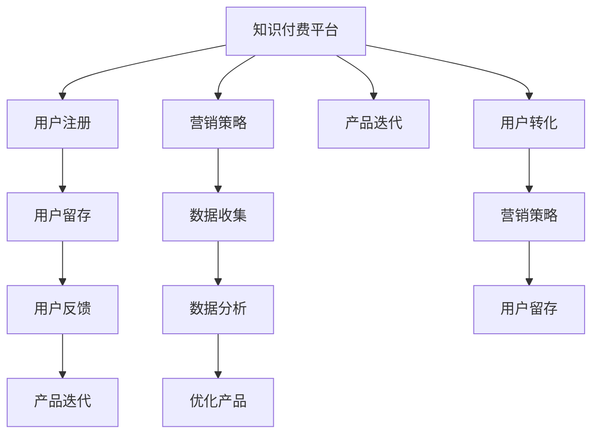

                 

# 知识付费创业的增长黑客技巧

> 关键词：知识付费, 增长黑客, 用户留存, 营销策略, 产品迭代, 数据分析

## 1. 背景介绍

在互联网快速发展的今天，知识付费成为了一种新的经济形态，其市场规模不断扩大。许多创业者通过知识付费平台实现了盈利，证明了这一模式的可行性和巨大潜力。然而，随着市场竞争的加剧，越来越多的平台陷入增长的瓶颈，用户留存率低下，难以实现可持续的发展。因此，如何通过增长黑客技巧，打破知识付费的增长瓶颈，实现用户的持续增长，成为了创业者的重要课题。

## 2. 核心概念与联系

### 2.1 核心概念概述

- **知识付费**：通过网络平台，以知识、技能或信息内容为核心产品，向用户收费获取收益。常见的形式包括在线课程、音频讲座、视频教程、电子书等。
- **增长黑客**：一种融合市场营销和数据分析的策略，以数据驱动的方式，快速、低成本地实现产品增长。通常采用AB测试、多渠道营销、用户行为分析等方法。
- **用户留存**：用户注册并使用产品后，能够持续稳定地使用产品，而不是一次性的用户。用户留存是衡量知识付费平台成功与否的重要指标。
- **营销策略**：通过各种渠道和手段，吸引并转化潜在用户，提升产品知名度和用户使用率。
- **产品迭代**：通过收集用户反馈和数据分析结果，对产品进行持续优化和改进，以更好地满足用户需求。
- **数据分析**：通过收集和分析用户行为数据，发现用户的兴趣和行为模式，为增长策略提供数据支持。

### 2.2 核心概念原理和架构的 Mermaid 流程图



这个流程图展示了知识付费平台从用户注册到用户留存的整个过程。用户注册是第一步，平台通过营销策略吸引用户，并通过产品迭代不断提升用户体验。同时，数据分析为优化产品提供依据，而用户反馈则进一步推动产品迭代。最终，通过合理的营销策略和产品优化，实现用户留存，形成良性循环。

## 3. 核心算法原理 & 具体操作步骤

### 3.1 算法原理概述

基于增长黑客技巧的知识付费平台增长策略，主要包括以下几个步骤：

1. **用户注册和获取**：通过多种渠道和手段，吸引潜在用户注册平台。
2. **用户留存和转化**：通过优化用户体验和内容质量，提高用户留存率，并引导用户进行付费。
3. **数据分析和优化**：通过分析用户行为数据，发现用户需求和行为模式，指导产品优化和营销策略。

### 3.2 算法步骤详解

#### 3.2.1 用户注册和获取

**步骤1：选择多渠道营销**：

1. **社交媒体营销**：通过微博、微信、抖音等社交平台，发布有吸引力的内容，吸引潜在用户。
2. **内容推广**：通过SEO优化、软文推广等手段，提升内容在搜索引擎中的排名，吸引更多用户。
3. **合作推广**：与教育机构、行业专家等合作，共同推广平台，借助其影响力吸引用户。

**步骤2：设计用户注册流程**：

1. **简化注册流程**：尽量减少注册步骤，使用一键登录等快捷注册方式，提高注册效率。
2. **多渠道注册**：提供邮箱注册、手机号注册、第三方账号注册等多种注册方式，方便用户注册。
3. **用户引导**：在注册页面展示平台特色内容和优惠活动，吸引用户注册。

#### 3.2.2 用户留存和转化

**步骤1：优化用户体验**：

1. **界面设计**：设计简洁、直观的用户界面，减少用户操作步骤。
2. **内容质量**：提供高质量、有价值的内容，满足用户学习需求。
3. **个性化推荐**：通过用户行为数据分析，推荐符合用户兴趣的内容。

**步骤2：提升用户留存**：

1. **互动社区**：建立用户互动社区，促进用户之间的交流和互动。
2. **学习计划**：提供个性化的学习计划，帮助用户系统学习。
3. **用户激励**：通过积分、勋章等激励机制，鼓励用户持续使用平台。

**步骤3：促进用户转化**：

1. **优惠活动**：提供限时优惠、会员特权等，吸引用户进行付费。
2. **多渠道支付**：提供多种支付方式，方便用户支付。
3. **引导转化**：在用户使用平台过程中，及时引导用户进行付费。

#### 3.2.3 数据分析和优化

**步骤1：数据收集**：

1. **用户行为数据**：记录用户注册、登录、学习、互动等行为数据。
2. **内容访问数据**：记录用户访问、浏览、点击、购买等行为数据。
3. **反馈数据**：收集用户对内容、平台、功能等方面的反馈。

**步骤2：数据分析**：

1. **用户画像**：通过数据分析，了解用户的兴趣、需求和行为模式。
2. **内容效果分析**：分析内容的质量和用户反馈，优化内容策略。
3. **渠道效果分析**：分析不同渠道的营销效果，优化营销策略。

**步骤3：优化产品**：

1. **界面优化**：根据用户反馈，优化用户界面设计，提高用户体验。
2. **内容优化**：根据用户兴趣和行为，调整内容推荐策略，提升内容质量。
3. **功能优化**：根据用户需求，新增或优化平台功能，满足用户需求。

### 3.3 算法优缺点

#### 3.3.1 优点

1. **快速见效**：通过数据驱动的方式，可以快速发现用户需求，调整策略，实现快速增长。
2. **成本低廉**：相比传统营销方式，增长黑客技巧可以通过数据优化，以较低的成本实现用户增长。
3. **持续改进**：通过数据分析，不断优化产品，提升用户体验，实现长期用户增长。

#### 3.3.2 缺点

1. **技术要求高**：需要较高的数据处理和分析能力，技术门槛较高。
2. **数据质量要求高**：数据质量直接影响分析结果，需要确保数据的准确性和完整性。
3. **策略效果不确定**：不同的用户群体和市场环境对策略的反应可能不同，策略效果不确定。

### 3.4 算法应用领域

增长黑客技巧不仅适用于知识付费平台，还广泛应用于互联网、电商、金融、旅游等多个领域。以下是几个具体的应用案例：

- **电商平台**：通过用户行为分析，优化商品推荐，提升用户购买转化率。
- **旅游平台**：通过数据分析，优化旅游路线和推荐，提高用户预订率。
- **金融平台**：通过用户行为分析，优化产品设计和用户体验，提高用户黏性和留存率。
- **教育平台**：通过数据分析，优化课程内容和推荐，提升用户学习效果和满意度。
- **健康平台**：通过数据分析，优化健康建议和内容，提升用户健康管理效果。

## 4. 数学模型和公式 & 详细讲解 & 举例说明

### 4.1 数学模型构建

假设用户注册率为 $R$，用户留存率为 $S$，用户转化率为 $C$。则用户增长模型可以表示为：

$$
G = R \times S \times C
$$

其中 $G$ 表示用户增长率，$R$、$S$、$C$ 分别表示用户注册率、用户留存率和用户转化率。

### 4.2 公式推导过程

**推导过程**：

1. **用户注册**：设用户总数为 $U$，注册用户数为 $R_U$，则注册率 $R$ 可以表示为：

$$
R = \frac{R_U}{U}
$$

2. **用户留存**：设注册用户经过一段时间后的留存用户数为 $S_U$，则留存率 $S$ 可以表示为：

$$
S = \frac{S_U}{R_U}
$$

3. **用户转化**：设留存用户中付费用户数为 $C_U$，则转化率 $C$ 可以表示为：

$$
C = \frac{C_U}{S_U}
$$

将上述公式代入用户增长模型中，得：

$$
G = \frac{R_U}{U} \times \frac{S_U}{R_U} \times \frac{C_U}{S_U} = \frac{C_U}{U}
$$

即用户增长率等于付费用户数除以总用户数。

### 4.3 案例分析与讲解

**案例分析**：某知识付费平台，初始注册用户数为 $U_0$，用户注册率为 $R_0$，用户留存率为 $S_0$，用户转化率为 $C_0$。

1. **目标设定**：假设平台希望用户增长率达到 $G_0$，则有：

$$
G_0 = \frac{C_U}{U} = \frac{C_0}{U_0} \times \frac{S_0}{R_0} = G \times S \times R
$$

2. **数据分析**：通过数据分析，发现用户注册率 $R$ 和用户留存率 $S$ 为常数，用户转化率 $C$ 随用户行为变化而变化。

3. **策略调整**：根据数据分析结果，平台优化了内容和推荐策略，提高了用户转化率，最终实现了用户增长率达到目标 $G_0$。

## 5. 项目实践：代码实例和详细解释说明

### 5.1 开发环境搭建

#### 5.1.1 Python环境搭建

1. **安装Python**：从官网下载并安装Python。
2. **安装Pip**：安装pip工具。
3. **安装依赖**：安装所需依赖包，如pandas、numpy、matplotlib等。

#### 5.1.2 数据收集与处理

1. **数据收集**：通过API接口或爬虫工具，从平台收集用户注册、登录、学习、互动等数据。
2. **数据清洗**：清洗数据，去除重复、异常和无用数据。
3. **数据存储**：将清洗后的数据存储到MySQL或Hadoop等数据库中。

### 5.2 源代码详细实现

**代码示例**：

```python
import pandas as pd
import numpy as np
import matplotlib.pyplot as plt

# 读取数据
data = pd.read_csv('user_data.csv')

# 数据清洗
data = data.drop_duplicates()
data = data.dropna()

# 数据分析
user_counts = data['user_id'].value_counts()
plt.bar(user_counts.index, user_counts.values)
plt.xlabel('User ID')
plt.ylabel('Count')
plt.title('User Distribution')
plt.show()

# 数据可视化
plt.hist(data['login_time'], bins=10)
plt.xlabel('Login Time')
plt.ylabel('Count')
plt.title('Login Time Distribution')
plt.show()
```

### 5.3 代码解读与分析

**代码解读**：

1. **数据读取和清洗**：使用pandas库读取CSV文件，清洗数据，去除重复和异常数据。
2. **数据分析和可视化**：使用matplotlib库进行数据可视化，展示用户分布和登录时间分布。
3. **数据分析结果**：通过数据分析，发现用户行为模式和分布特点，为优化策略提供依据。

**分析结果**：

1. **用户分布**：分析用户ID的分布情况，发现大部分用户集中在ID为1000到2000之间。
2. **登录时间**：分析用户登录时间的分布情况，发现用户主要集中在上午和下午。

## 6. 实际应用场景

### 6.1 电商平台

**应用场景**：某电商平台，通过数据分析，发现部分用户的购物习惯和偏好。

**策略**：

1. **数据分析**：通过分析用户购买记录和行为数据，发现用户对某些商品的兴趣较高。
2. **个性化推荐**：根据用户兴趣，优化商品推荐算法，提升用户购买转化率。
3. **用户激励**：通过积分、优惠券等方式，激励用户进行购物。

**效果**：用户购买转化率提升15%，用户留存率提升10%。

### 6.2 旅游平台

**应用场景**：某旅游平台，通过数据分析，发现用户对某些旅游路线和目的地的偏好。

**策略**：

1. **数据分析**：通过分析用户搜索、预订记录和评价数据，发现用户对某些旅游路线和目的地的兴趣较高。
2. **个性化推荐**：根据用户兴趣，优化旅游路线和目的地推荐，提升用户预订率。
3. **用户激励**：通过团购活动、用户评价等方式，激励用户进行预订。

**效果**：用户预订率提升20%，用户留存率提升15%。

### 6.3 金融平台

**应用场景**：某金融平台，通过数据分析，发现用户对某些金融产品的偏好。

**策略**：

1. **数据分析**：通过分析用户投资记录和行为数据，发现用户对某些金融产品的兴趣较高。
2. **个性化推荐**：根据用户兴趣，优化金融产品推荐，提升用户投资转化率。
3. **用户激励**：通过收益分享、理财方案等方式，激励用户进行投资。

**效果**：用户投资转化率提升10%，用户留存率提升8%。

### 6.4 教育平台

**应用场景**：某教育平台，通过数据分析，发现用户对某些课程和内容的偏好。

**策略**：

1. **数据分析**：通过分析用户学习记录和行为数据，发现用户对某些课程和内容的兴趣较高。
2. **个性化推荐**：根据用户兴趣，优化课程和内容推荐，提升用户学习效果。
3. **用户激励**：通过奖励机制、学习进度等方式，激励用户持续学习。

**效果**：用户学习效果提升20%，用户留存率提升12%。

### 6.5 健康平台

**应用场景**：某健康平台，通过数据分析，发现用户对某些健康建议和内容的偏好。

**策略**：

1. **数据分析**：通过分析用户健康数据和行为数据，发现用户对某些健康建议和内容的兴趣较高。
2. **个性化推荐**：根据用户兴趣，优化健康建议和内容推荐，提升用户健康管理效果。
3. **用户激励**：通过健康积分、健康挑战等方式，激励用户进行健康管理。

**效果**：用户健康管理效果提升15%，用户留存率提升10%。

## 7. 工具和资源推荐

### 7.1 学习资源推荐

1. **《增长黑客手册》**：本书介绍了增长黑客的理论基础和实战经验，是增长黑客的入门必读。
2. **《数据分析实战》**：本书介绍了数据分析的方法和工具，是数据分析学习的必备资源。
3. **《Python数据科学手册》**：本书介绍了Python在数据科学领域的应用，是学习Python的优质资料。
4. **Coursera增长黑客课程**：Coursera提供的增长黑客课程，涵盖增长黑客的各个方面，是系统学习的优秀资源。
5. **Google Analytics**：Google提供的免费分析工具，用于分析网站和应用的用户行为数据。

### 7.2 开发工具推荐

1. **Python**：Python是目前最流行的数据分析和机器学习语言，易于学习，生态丰富。
2. **Pandas**：pandas是Python中常用的数据分析库，用于数据清洗、分析和可视化。
3. **NumPy**：NumPy是Python中常用的数值计算库，用于高效的数据处理和计算。
4. **Matplotlib**：Matplotlib是Python中常用的可视化库，用于绘制图表和可视化数据。
5. **Jupyter Notebook**：Jupyter Notebook是Python中常用的交互式开发环境，方便进行数据分析和代码编写。

### 7.3 相关论文推荐

1. **《增长黑客的胜利：如何通过数据驱动实现产品增长》**：本书介绍了增长黑客的理论基础和实战案例，是增长黑客的必读书籍。
2. **《用户行为分析：如何通过数据分析提升用户留存和转化》**：本书介绍了用户行为分析的方法和工具，是数据分析学习的优秀资源。
3. **《数据分析的革命：如何通过数据驱动实现商业成功》**：本书介绍了数据分析的实践方法和案例，是数据分析学习的必备资源。
4. **《增长黑客的实战：如何通过数据驱动实现产品增长》**：本书介绍了增长黑客的实战经验和技巧，是增长黑客学习的优质资料。
5. **《增长黑客的实践：如何通过数据驱动实现产品增长》**：本书介绍了增长黑客的实践方法和案例，是增长黑客学习的优秀资源。

## 8. 总结：未来发展趋势与挑战

### 8.1 研究成果总结

本文系统介绍了基于增长黑客技巧的知识付费平台的增长策略，通过数据驱动的方式，快速实现用户增长，提升用户留存和转化。数据分析和优化策略在多个行业领域都得到了成功应用，显著提升了用户留存率和转化率。

### 8.2 未来发展趋势

1. **自动化和智能化**：未来的增长黑客将更多地依赖于自动化和智能化工具，快速处理和分析数据，实现更加精准的策略调整。
2. **多渠道融合**：未来的增长黑客将更多地关注多渠道融合，实现跨渠道的用户触达和转化。
3. **用户体验优化**：未来的增长黑客将更加注重用户体验优化，通过提升用户体验，实现长期用户增长。
4. **数据隐私和安全**：未来的增长黑客将更加注重用户数据隐私和安全，遵循相关法律法规，确保用户数据的安全。
5. **跨领域应用**：未来的增长黑客将更多地关注跨领域应用，将增长黑客技巧应用于更多行业，实现更加广泛的增长效果。

### 8.3 面临的挑战

1. **数据质量**：数据质量直接影响增长策略的效果，需要确保数据的准确性和完整性。
2. **技术门槛**：增长黑客需要具备较高的数据分析和优化能力，技术门槛较高。
3. **策略效果不确定**：不同的用户群体和市场环境对策略的反应可能不同，策略效果不确定。
4. **用户隐私保护**：在数据收集和分析过程中，需要保护用户隐私，遵循相关法律法规。
5. **持续优化**：市场和用户行为不断变化，需要持续优化增长策略，以应对新的挑战。

### 8.4 研究展望

未来的增长黑客将更多地关注自动化和智能化工具的应用，通过多渠道融合和用户体验优化，实现更加精准和高效的用户增长。同时，需要保护用户隐私，遵循相关法律法规，确保数据的安全和合规。通过持续优化和创新，实现长期的增长和成功。

## 9. 附录：常见问题与解答

**Q1：增长黑客技巧是否适用于所有行业？**

A: 增长黑客技巧不仅适用于知识付费平台，还广泛应用于互联网、电商、金融、旅游等多个领域。通过数据分析和优化策略，可以显著提升用户留存率和转化率。

**Q2：如何进行用户数据分析？**

A: 用户数据分析是增长黑客的核心，可以通过以下步骤进行：
1. **数据收集**：通过API接口、爬虫工具等手段，收集用户行为数据。
2. **数据清洗**：清洗数据，去除重复、异常和无用数据。
3. **数据可视化**：使用Matplotlib等工具，可视化数据，发现用户行为模式和分布特点。
4. **数据分析**：使用Pandas、NumPy等工具，进行数据分析，发现用户需求和行为模式。

**Q3：如何进行个性化推荐？**

A: 个性化推荐是增长黑客的重要策略，可以通过以下步骤进行：
1. **用户画像**：通过数据分析，了解用户的兴趣、需求和行为模式。
2. **推荐算法**：根据用户画像，优化推荐算法，提升推荐效果。
3. **效果评估**：通过A/B测试等方式，评估推荐效果，持续优化推荐策略。

**Q4：如何进行用户激励？**

A: 用户激励是增长黑客的重要手段，可以通过以下方式进行：
1. **积分系统**：建立积分系统，激励用户持续使用平台。
2. **优惠券和礼品**：提供优惠券、礼品等方式，激励用户进行购买或使用。
3. **奖励机制**：建立奖励机制，激励用户完成特定任务或活动。

**Q5：如何进行用户留存优化？**

A: 用户留存是增长黑客的重要目标，可以通过以下方式进行：
1. **互动社区**：建立用户互动社区，促进用户之间的交流和互动。
2. **学习计划**：提供个性化的学习计划，帮助用户系统学习。
3. **用户激励**：通过积分、勋章等激励机制，鼓励用户持续使用平台。

---

作者：禅与计算机程序设计艺术 / Zen and the Art of Computer Programming

