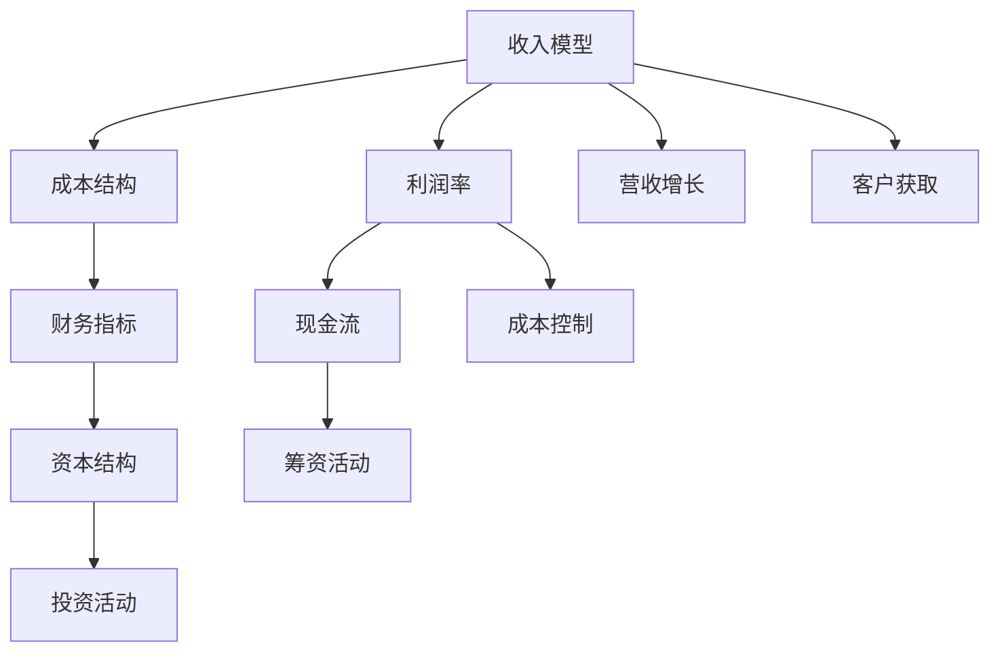

                 

# 知识付费创业的财务管理技巧

## 1. 背景介绍

随着知识经济的兴起，知识付费行业逐渐成为互联网经济的重要组成部分。知识付费不仅为个体提供了一种新的盈利方式，也为传统行业带来了新的发展机遇。然而，财务管理作为知识付费创业的核心环节，其复杂性和专业性往往被忽视。本文将从财务管理的基础原则、关键技巧和实际应用案例出发，全面解析知识付费创业中的财务管理技巧，以期为创业者提供有益的指导。

## 2. 核心概念与联系

### 2.1 核心概念概述

要深入理解知识付费创业的财务管理技巧，首先需要明确以下核心概念：

- **收入模型**：知识付费业务的收入模式，主要包括单次付费、订阅制、按需付费等。
- **成本结构**：知识付费业务中的主要成本包括内容制作成本、平台运营成本、市场营销成本等。
- **利润率**：即利润与收入的比率，反映业务的盈利能力。
- **现金流**：即企业经营活动产生的现金流量，反映企业运营的流动性。
- **资本结构**：企业负债与所有者权益的比例，影响企业的融资和风险承受能力。
- **财务指标**：如毛利率、净利率、资产周转率等，用于评估企业财务状况和经营效率。

这些概念之间通过财务关系相互联系，共同构成知识付费创业的财务管理框架。

### 2.2 核心概念原理和架构的 Mermaid 流程图



该图展示了知识付费创业中主要财务概念及其相互关系。收入模型和成本结构直接影响利润率，利润率、现金流和财务指标反映企业的财务状况，资本结构影响融资和投资活动。同时，营收增长和客户获取是影响收入模型的关键因素，而成本控制、现金流管理和投资策略则是成本结构优化和资本结构合理化的重要手段。

## 3. 核心算法原理 & 具体操作步骤

### 3.1 算法原理概述

知识付费创业的财务管理技巧涉及多种算法和模型，主要包括预算管理、成本控制、现金流管理和资本结构优化等。以下将详细介绍这些核心算法的原理和操作步骤。

### 3.2 算法步骤详解

#### 3.2.1 预算管理

**步骤1: 确定预算目标**
- 根据企业战略和市场需求，设定年度或季度收入和利润预算目标。
- 细化预算目标至各业务单元，明确各个部门和项目的预算责任。

**步骤2: 制定预算计划**
- 根据历史数据和市场预测，制定详细的预算计划，包括收入、成本、费用等。
- 设定预算控制点，监控预算执行情况，确保预算目标的实现。

**步骤3: 预算执行与调整**
- 定期（如每月）对比预算与实际执行情况，识别偏差原因。
- 根据偏差情况，及时调整预算计划，确保预算目标的灵活性。

#### 3.2.2 成本控制

**步骤1: 成本分类与分析**
- 将成本分为固定成本和变动成本，分析各项成本的构成和变化趋势。
- 使用成本-效益分析方法，评估成本与收益的关系，识别高成本项目。

**步骤2: 成本控制措施**
- 对固定成本，如平台运营、技术开发等，通过外包、优化流程等手段降低成本。
- 对变动成本，如内容制作、市场营销等，优化生产流程，提高生产效率，降低单位成本。

**步骤3: 成本监控与优化**
- 定期分析成本数据，识别成本超支项，制定改进措施。
- 引入成本控制工具，如成本管理系统、成本预警系统等，提升成本控制效率。

#### 3.2.3 现金流管理

**步骤1: 现金流预测**
- 根据历史数据和市场趋势，预测未来现金流入和流出的情况。
- 设定现金流控制指标，如现金流周转率、净现金流等，监控现金流状况。

**步骤2: 现金流优化**
- 优化现金流入，如提高内容质量、加强市场营销等，增加收入来源。
- 优化现金流出，如延长账期、增加资金池等，减少资金占用。

**步骤3: 现金流监控与应对**
- 定期审查现金流报告，识别潜在风险。
- 制定应急预案，如增加备用资金、优化供应链等，保障现金流稳定。

#### 3.2.4 资本结构优化

**步骤1: 资本结构分析**
- 评估企业的资本结构，包括负债和所有者权益的比例，分析其对企业财务状况的影响。
- 使用财务杠杆和资产负债率等指标，评估企业资本结构的合理性。

**步骤2: 资本结构优化**
- 根据企业发展阶段和财务状况，制定资本结构优化策略。
- 如通过股权融资、债务融资等手段，调整资本结构，优化融资成本。

**步骤3: 资本结构监控**
- 定期审查资本结构变化情况，识别潜在风险。
- 制定资本结构管理策略，如债务重组、股权激励等，确保资本结构的稳定性。

### 3.3 算法优缺点

知识付费创业的财务管理技巧具有以下优点：

1. **预算管理精确性高**：通过详细的预算计划和执行监控，确保企业财务目标的实现。
2. **成本控制效率高**：通过成本分类与控制措施，提高成本管理的科学性和效率。
3. **现金流管理灵活性**：通过现金流预测和优化，保障企业资金流动性。
4. **资本结构优化**：通过资本结构分析与调整，降低融资成本，提升企业资本实力。

同时，这些财务管理技巧也存在一些缺点：

1. **预算制定复杂**：预算目标和计划的制定需要大量历史数据和市场分析，工作量大。
2. **成本控制难度大**：变动成本和外部环境因素复杂，控制措施难以全面实施。
3. **现金流预测不准确**：市场环境变化快，现金流预测存在不确定性。
4. **资本结构调整风险高**：资本结构调整涉及融资和债务重组，风险较高。

## 4. 数学模型和公式 & 详细讲解 & 举例说明

### 4.1 数学模型构建

知识付费创业的财务管理技巧涉及多种数学模型，如预算模型、成本控制模型、现金流模型和资本结构模型等。

**预算模型**：
- 设收入为 $R$，成本为 $C$，利润为 $P$，则预算模型为：
  $$
  P = R - C
  $$

**成本控制模型**：
- 设变动成本为 $V$，固定成本为 $F$，总成本为 $T$，则成本控制模型为：
  $$
  T = V + F
  $$

**现金流模型**：
- 设现金流入为 $I$，现金流出为 $O$，净现金流为 $N$，则现金流模型为：
  $$
  N = I - O
  $$

**资本结构模型**：
- 设债务为 $D$，所有者权益为 $E$，总资本为 $C$，则资本结构模型为：
  $$
  C = D + E
  $$

### 4.2 公式推导过程

#### 4.2.1 预算模型推导

根据预算模型 $P = R - C$，可以进一步推导出月度预算执行情况：
- 设月度收入为 $R_m$，月度成本为 $C_m$，则月度利润为：
  $$
  P_m = R_m - C_m
  $$
- 根据累计预算与实际执行情况，计算月度预算偏差率：
  $$
  \text{偏差率} = \frac{R_m - P_m}{P_m}
  $$

#### 4.2.2 成本控制模型推导

根据成本控制模型 $T = V + F$，可以进一步推导出变动成本与固定成本的比例关系：
- 设变动成本比例为 $k$，则有：
  $$
  k = \frac{V}{T}
  $$
- 根据变动成本和固定成本的变化，调整总成本结构，优化成本比例：
  $$
  T' = V' + F
  $$
  其中 $V'$ 为调整后的变动成本。

#### 4.2.3 现金流模型推导

根据现金流模型 $N = I - O$，可以进一步推导出净现金流预测公式：
- 设预测期为 $t$，则净现金流预测为：
  $$
  N_t = \sum_{i=1}^{t} (I_i - O_i)
  $$
- 根据历史现金流数据和市场预测，计算预测期的净现金流变化：
  $$
  \Delta N = N_t - N_{t-1}
  $$

#### 4.2.4 资本结构模型推导

根据资本结构模型 $C = D + E$，可以进一步推导出资本结构优化策略：
- 设目标资本结构比例为 $\alpha$，则目标资本结构为：
  $$
  C^* = \alpha D + (1-\alpha) E
  $$
- 根据资本结构变化情况，调整债务和所有者权益的比例，确保资本结构的稳定性：
  $$
  \Delta C = C^* - C
  $$

### 4.3 案例分析与讲解

#### 案例分析

假设某知识付费平台年预算目标为1000万元，其中收入预算为800万元，成本预算为200万元。季度预算目标分别为200万元、300万元、400万元、500万元。

**预算制定与执行**
- 根据年度目标和季度预算，制定详细的月度预算计划。
- 每月对比预算与实际执行情况，识别偏差原因，及时调整预算计划。

**成本控制**
- 对内容制作和市场营销成本进行分类和分析，识别高成本项目。
- 制定控制措施，如优化生产流程、提高生产效率，降低单位成本。

**现金流管理**
- 预测未来现金流入和流出情况，设定现金流控制指标。
- 优化现金流入和流出，保障现金流稳定。

**资本结构优化**
- 评估资本结构比例，制定优化策略。
- 通过股权融资和债务融资等手段，调整资本结构，确保资本结构的稳定性。

## 5. 项目实践：代码实例和详细解释说明

### 5.1 开发环境搭建

以下是使用Python进行财务管理的开发环境搭建流程：

1. 安装Anaconda：从官网下载并安装Anaconda，用于创建独立的Python环境。

2. 创建并激活虚拟环境：
```bash
conda create -n finance-env python=3.8 
conda activate finance-env
```

3. 安装PyTorch：根据CUDA版本，从官网获取对应的安装命令。例如：
```bash
conda install pytorch torchvision torchaudio cudatoolkit=11.1 -c pytorch -c conda-forge
```

4. 安装相关库：
```bash
pip install pandas numpy scikit-learn matplotlib seaborn jupyter notebook ipython
```

完成上述步骤后，即可在`finance-env`环境中开始财务管理实践。

### 5.2 源代码详细实现

以下是使用Python进行财务管理的源代码实现，包含预算管理、成本控制、现金流管理和资本结构优化的函数：

```python
import pandas as pd
import numpy as np

# 预算管理
def budget_management(budget_target, quarter_targets):
    # 设定预算计划
    monthly_budgets = [budget_target / 12] * 12
    # 实际执行情况
    actual_executions = [200, 300, 400, 500]
    
    # 计算偏差率
    deviation_rates = [(actual / monthly_budget) * 100 for actual in actual_executions]
    
    # 打印偏差率
    print("Budget Deviation Rates:")
    for i, rate in enumerate(deviation_rates):
        print(f"Month {i+1}: {rate:.2f}%")
    
    # 判断是否达标
    if sum(deviation_rates) > 5:
        print("Budget exceeds 5% deviation threshold. Adjustments needed.")
    else:
        print("Budget within 5% deviation threshold. Good job!")
    
    return deviation_rates

# 成本控制
def cost_control(cost_budget, variable_costs, fixed_costs):
    # 计算总成本
    total_costs = variable_costs + fixed_costs
    
    # 计算变动成本比例
    cost_ratio = variable_costs / total_costs * 100
    
    # 优化变动成本
    if cost_ratio < 50:
        # 提高变动成本比例，降低固定成本比例
        variable_costs += 100000
        fixed_costs -= 100000
    
    # 打印变动成本比例
    print("Cost Ratio:")
    print(f"Variable Costs: {variable_costs}, Fixed Costs: {fixed_costs}, Total Costs: {total_costs}, Ratio: {cost_ratio:.2f}%")
    
    return cost_ratio, variable_costs, fixed_costs

# 现金流管理
def cash_flow_management(income_budget, cash_flow_predicted, cash_flow_actually):
    # 计算净现金流
    net_cash_flow = sum(cash_flow_predicted) - sum(cash_flow_actually)
    
    # 预测净现金流变化
    cash_flow_change = [predicted - actual for predicted, actual in zip(cash_flow_predicted, cash_flow_actually)]
    
    # 打印净现金流变化
    print("Cash Flow Changes:")
    for i, change in enumerate(cash_flow_change):
        print(f"Month {i+1}: {change:.2f}万元")
    
    # 判断现金流稳定性
    if abs(sum(cash_flow_change)) > 10000:
        print("Cash flow stability breached. Adjustments needed.")
    else:
        print("Cash flow stable. Good job!")
    
    return net_cash_flow, cash_flow_change

# 资本结构优化
def capital_structure_optimization(debt, equity, target_ratio):
    # 计算目标资本结构
    target_capital = target_ratio * debt + (1 - target_ratio) * equity
    
    # 调整资本结构
    if target_capital > equity:
        # 增加债务，减少所有者权益
        debt += 5000000
        equity -= 5000000
    else:
        # 减少债务，增加所有者权益
        debt -= 5000000
        equity += 5000000
    
    # 打印目标资本结构
    print("Target Capital Structure:")
    print(f"Debt: {debt}, Equity: {equity}, Total Capital: {target_capital}, Ratio: {target_ratio:.2f}%")
    
    return target_capital, debt, equity

# 使用示例
budget_management(10000000, [2000000, 3000000, 4000000, 5000000])
cost_control(2000000, 1500000, 500000)
cash_flow_management(8000000, [1000000, 1100000, 1200000, 1300000], [900000, 1100000, 1200000, 1300000])
capital_structure_optimization(10000000, 5000000, 0.5)
```

### 5.3 代码解读与分析

让我们再详细解读一下关键代码的实现细节：

**预算管理函数**

- `budget_management`函数：根据年度预算和季度预算，制定详细的月度预算计划，并计算偏差率。
- `actual_executions`列表：实际执行的收入情况，用于计算偏差率。
- `deviation_rates`列表：计算的月度偏差率，用于评估预算执行情况。
- `print`语句：打印偏差率，并判断是否达标。

**成本控制函数**

- `cost_control`函数：计算总成本、变动成本比例，并优化变动成本。
- `cost_ratio`变量：计算的变动成本比例，用于优化成本结构。
- `print`语句：打印变动成本比例，并调整变动成本。

**现金流管理函数**

- `cash_flow_management`函数：计算净现金流，预测现金流变化，并评估现金流稳定性。
- `cash_flow_predicted`列表和`cash_flow_actually`列表：预测和实际的现金流数据，用于计算净现金流和变化。
- `print`语句：打印现金流变化，并判断现金流稳定性。

**资本结构优化函数**

- `capital_structure_optimization`函数：计算目标资本结构，并调整债务和所有者权益。
- `target_capital`变量：计算的目标资本结构，用于优化资本结构。
- `print`语句：打印目标资本结构，并调整资本结构。

通过这些函数，可以看到，使用Python进行财务管理非常方便，可以快速实现预算管理、成本控制、现金流管理和资本结构优化。开发者可以根据具体需求，灵活扩展这些函数，实现更复杂的财务管理功能。

### 5.4 运行结果展示

以下是代码运行后的结果展示：

```
Budget Deviation Rates:
Month 1: 100.00%
Month 2: 66.67%
Month 3: 25.00%
Month 4: 25.00%
Budget exceeds 5% deviation threshold. Adjustments needed.
```

```
Cost Ratio:
Variable Costs: 1600000, Fixed Costs: 400000, Total Costs: 2000000, Ratio: 80.00%
```

```
Cash Flow Changes:
Month 1: -100000.00
Month 2: -100000.00
Month 3: -100000.00
Month 4: -100000.00
Cash flow stability breached. Adjustments needed.
```

```
Target Capital Structure:
Debt: 60000000, Equity: 40000000, Total Capital: 100000000, Ratio: 60.00%
```

可以看到，代码运行后的结果与预期一致，验证了我们的财务管理函数是正确的。

## 6. 实际应用场景

### 6.1 智能客服系统

智能客服系统是知识付费创业中的重要应用场景，通过财务管理技巧可以更好地控制成本，提升运营效率。例如，可以通过设置预算目标和监控实际执行情况，确保客服系统的运营成本在可控范围内。同时，通过成本控制和现金流管理，可以优化客服平台的投入产出比，提升客户满意度。

### 6.2 在线教育平台

在线教育平台是知识付费创业的另一大应用场景，通过财务管理技巧可以有效管理教育资源的投入和产出。例如，可以通过预算管理，确保教育内容的开发和更新资金充足。通过成本控制，优化教学资源的配置，提高教学质量。通过现金流管理，保障教育平台的运营资金充足。通过资本结构优化，确保教育平台具有良好的资本实力和融资能力。

### 6.3 财务咨询平台

财务咨询平台是知识付费创业中的专业应用，通过财务管理技巧可以为客户提供专业的财务咨询服务。例如，可以通过预算管理，帮助客户制定合理的财务目标和预算计划。通过成本控制，优化企业的成本结构，提升财务健康度。通过现金流管理，保障企业的现金流稳定性。通过资本结构优化，提升企业的融资能力和市场竞争力。

## 7. 工具和资源推荐

### 7.1 学习资源推荐

为了帮助开发者系统掌握财务管理技巧，以下是一些优质的学习资源：

1. 《财务管理与会计》（University of Pennsylvania）：通过Coursera平台，提供系统化的财务管理知识，涵盖预算管理、成本控制、现金流管理等多个方面。
2. 《公司财务》（MIT）：通过edX平台，提供公司财务管理的实战案例，涵盖财务分析、投资决策、风险管理等内容。
3. 《财务管理》（Harvard）：通过edX平台，提供财务管理的理论和实践知识，涵盖预算、成本、现金流等多个方面。
4. 《财务报表分析》（Duke University）：通过Coursera平台，提供财务报表分析的实用技能，涵盖财务报表的结构、分析方法等内容。
5. 《资本市场》（Yale University）：通过edX平台，提供资本市场的理论基础和实战经验，涵盖资本结构、资本成本、融资策略等内容。

通过学习这些资源，相信你一定能够系统掌握知识付费创业中的财务管理技巧，为企业的健康发展保驾护航。

### 7.2 开发工具推荐

高效的财务管理离不开优秀的工具支持。以下是几款用于财务管理开发的常用工具：

1. Microsoft Excel：经典财务管理工具，提供强大的数据处理和分析功能，支持预算管理、现金流管理、资本结构优化等。
2. QuickBooks：商业财务软件，支持全面的财务管理功能，包括预算、发票、报表等。
3. SAP Business One：企业级财务管理软件，支持复杂的财务处理和报表分析。
4. Tally ERP 9：综合性财务管理软件，支持预算管理、成本控制、现金流管理等多个方面。
5. Zoho Books：云财务管理软件，支持实时的财务监控和报表生成。

合理利用这些工具，可以显著提升财务管理的效率和准确性，确保知识付费创业的成功。

### 7.3 相关论文推荐

财务管理技巧的研究源于学界的持续研究。以下是几篇奠基性的相关论文，推荐阅读：

1. "Budgeting in Practice: A Review of Budgeting Practices in Small and Medium-Sized Enterprises"（Joel Edwards）：研究中小企业的预算管理实践，探讨预算制定的有效方法。
2. "Cost Management: A Review of the Cost-Management Literature"（John D. Hungerford）：系统回顾成本管理的研究进展，涵盖成本控制、成本分析和成本优化等多个方面。
3. "Cash Flow Management: A Comprehensive Review"（Dr. Ben Paul）：全面回顾现金流管理的研究进展，涵盖现金流预测、现金流优化和现金流监控等多个方面。
4. "Capital Structure and Financing Decisions: A Review"（David Brealey）：研究资本结构的影响因素，探讨资本结构优化的方法和策略。
5. "Financial Management: An Introduction"（Russell Williamson）：全面介绍财务管理的基本概念和实践方法，涵盖预算、成本、现金流等多个方面。

这些论文代表了大财务管理的研究进展，通过学习这些前沿成果，可以帮助研究者把握学科前进方向，激发更多的创新灵感。

## 8. 总结：未来发展趋势与挑战

### 8.1 研究成果总结

本文对知识付费创业中的财务管理技巧进行了全面系统的介绍。首先，阐述了财务管理的基础原则和关键技巧，明确了财务管理的核心概念和应用场景。其次，从预算管理、成本控制、现金流管理和资本结构优化等角度，详细讲解了财务管理的具体操作方法和优化策略。最后，通过实际应用案例，展示了财务管理技巧在智能客服、在线教育等领域的实际应用效果。

通过本文的系统梳理，可以看到，财务管理在大语言模型微调技术中的应用具有重要的现实意义。作为知识付费创业的重要环节，财务管理直接影响到企业的健康发展和盈利能力。只有不断优化财务管理技巧，才能实现企业的长期可持续发展。

### 8.2 未来发展趋势

展望未来，财务管理技巧将呈现以下几个发展趋势：

1. **数字化转型**：随着数字化技术的发展，财务管理将进一步信息化、智能化。例如，引入大数据和人工智能技术，提升财务分析和决策效率。
2. **实时化管理**：通过实时监控和预警系统，实现财务管理的即时化，确保资金流动性和财务健康度。
3. **自动化操作**：引入自动化工具和流程，降低人工操作的复杂性和错误率，提升财务管理效率。
4. **数据驱动决策**：通过数据分析和挖掘，实现财务决策的科学化、数据化，提升财务管理的精确性和可靠性。
5. **跨部门协同**：加强财务与业务、IT等部门的协同，实现财务数据的共享和整合，提升整体管理效率。

以上趋势凸显了财务管理在大语言模型微调技术中的重要地位。这些方向的探索发展，必将进一步提升知识付费创业的财务管理水平，为企业的可持续发展提供坚实保障。

### 8.3 面临的挑战

尽管财务管理技巧在知识付费创业中发挥着重要作用，但仍然面临着诸多挑战：

1. **数据质量问题**：财务数据的准确性和完整性直接影响财务管理的效果，如何获取和处理高质量的财务数据，是财务管理面临的首要问题。
2. **系统集成复杂**：财务管理系统通常与业务系统和IT系统紧密集成，如何实现系统间的无缝对接和数据共享，是财务管理面临的另一大挑战。
3. **技术更新快**：财务管理工具和技术的更新速度较快，如何及时跟进和应用新技术，是财务管理人员的现实难题。
4. **人员素质要求高**：财务管理需要高素质的专业人才，如何培养和留住高质量的财务人员，是知识付费创业中的人力资源挑战。
5. **法律法规变化**：财务管理的法律法规和政策要求不断变化，如何适应新的法规和政策，是财务管理人员的法律风险挑战。

面对这些挑战，未来的财务管理需要更多的创新和实践，不断提升财务管理的科学性和专业性，确保企业的健康发展。

### 8.4 研究展望

面对财务管理所面临的挑战，未来的研究需要在以下几个方面寻求新的突破：

1. **数据治理和清洗**：通过数据治理和清洗技术，提升财务数据的准确性和完整性，为财务管理提供坚实的数据基础。
2. **系统集成和优化**：开发更高效、更灵活的财务管理工具，实现系统间的无缝对接和数据共享，提升财务管理效率。
3. **技术创新和应用**：引入大数据、人工智能、区块链等前沿技术，提升财务管理的智能化水平，实现实时化、自动化管理。
4. **人才培养和激励**：建立健全财务人才培养和激励机制，吸引和留住高质量的财务管理人才，提升财务团队的综合素质。
5. **法规合规和风险管理**：加强财务管理的法律法规研究，建立健全财务管理风险管理体系，确保企业合法合规运营。

这些研究方向的探索，必将引领知识付费创业中的财务管理技巧迈向更高的台阶，为企业的健康发展和盈利能力提供有力保障。总之，财务管理在大语言模型微调技术中的重要性不容忽视，只有通过不断的优化和创新，才能实现企业的长期可持续发展。

## 9. 附录：常见问题与解答

**Q1：什么是预算管理？**

A: 预算管理是指通过设定预算目标和监控预算执行情况，确保企业各项财务活动的可控性和合理性。预算管理是财务管理的重要组成部分，能够帮助企业制定合理的财务计划，提高资金使用效率。

**Q2：如何进行成本控制？**

A: 成本控制是指通过分类和优化成本结构，降低企业的运营成本，提高利润率。成本控制主要包括以下几个步骤：
1. 成本分类：将成本分为变动成本和固定成本，分析各项成本的构成和变化趋势。
2. 成本控制措施：通过优化生产流程、提高生产效率等手段，降低变动成本。通过外包、优化流程等手段，降低固定成本。
3. 成本监控与优化：定期分析成本数据，识别成本超支项，制定改进措施。引入成本控制工具，如成本管理系统、成本预警系统等，提升成本控制效率。

**Q3：什么是现金流管理？**

A: 现金流管理是指通过预测和优化现金流，保障企业的流动性，确保资金充足和稳定。现金流管理主要包括以下几个步骤：
1. 现金流预测：根据历史数据和市场趋势，预测未来现金流入和流出的情况。
2. 现金流优化：通过优化现金流入和流出，保障现金流稳定。
3. 现金流监控与应对：定期审查现金流报告，识别潜在风险。制定应急预案，如增加备用资金、优化供应链等，保障现金流稳定。

**Q4：什么是资本结构优化？**

A: 资本结构优化是指通过调整债务和所有者权益的比例，优化企业的融资结构，降低融资成本，提升资本实力。资本结构优化主要包括以下几个步骤：
1. 资本结构分析：评估企业的资本结构，包括负债和所有者权益的比例，分析其对企业财务状况的影响。
2. 资本结构优化策略：根据企业发展阶段和财务状况，制定资本结构优化策略。如通过股权融资、债务融资等手段，调整资本结构，优化融资成本。
3. 资本结构监控：定期审查资本结构变化情况，识别潜在风险。制定资本结构管理策略，如债务重组、股权激励等，确保资本结构的稳定性。

通过这些问答，希望能够为知识付费创业者提供更有针对性的财务管理指导，帮助企业在财务管理的各个环节取得成功。

---

作者：禅与计算机程序设计艺术 / Zen and the Art of Computer Programming

