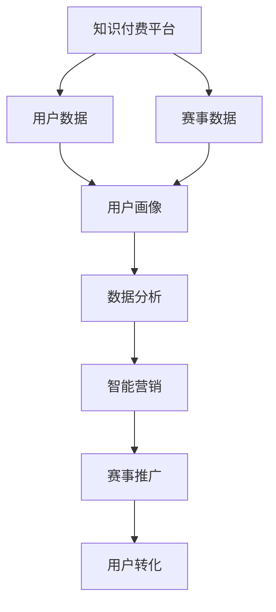

                 

# 知识付费如何实现跨界营销与体育赛事跨界？

在快速发展的数字化时代，知识付费模式已成为内容创作者与受众之间不可或缺的连接桥梁。然而，如何将知识付费与体育赛事等多元化领域有效结合，成为推动知识付费发展的关键。本文将从多个角度探讨知识付费跨界营销与体育赛事跨界的新路径，通过逻辑清晰、结构紧凑的技术语言，为你提供深度、有思考、有见解的专业IT领域分析。

## 1. 背景介绍

### 1.1 问题由来
随着信息技术的飞速发展，知识付费模式应运而生，推动了知识经济的蓬勃发展。知识付费平台通过订阅制、按需付费等方式，向用户提供各类专业知识和技能，满足其个性化需求。然而，传统的知识付费模式往往局限于特定领域，难以吸引广泛的用户群体。如何突破这一瓶颈，成为知识付费平台必须解决的问题。

与此同时，体育赛事作为全民健身的重要组成部分，拥有庞大的受众基础和巨大的商业价值。传统体育赛事营销多依赖线下活动、广告投放等方式，成本高、效果有限。如何利用数字技术提升赛事营销效率，扩大品牌影响力，是体育产业亟需解决的问题。

基于以上背景，知识付费平台与体育赛事跨界合作，成为双方探索新发展路径的共识。

### 1.2 问题核心关键点
实现知识付费跨界营销与体育赛事跨界，关键在于：

- 数据融合：将知识付费平台的用户数据与体育赛事数据进行融合，分析用户兴趣与赛事内容，精准定位目标受众。
- 内容协同：设计多维度内容，如赛事精彩瞬间回顾、专家分析点评等，丰富用户知识获取体验。
- 技术赋能：利用人工智能、大数据等技术，提升赛事组织管理效率，实现智能营销。

这些关键点构成了知识付费跨界营销与体育赛事跨界的基础，需要通过多维度的技术手段和创新策略进行落地。

## 2. 核心概念与联系

### 2.1 核心概念概述

本节将介绍实现知识付费跨界营销与体育赛事跨界所需的关键技术概念：

- **知识付费平台**：如Coursera、Udemy等，通过在线课程、专家讲座等方式向用户提供专业知识，收取相应费用。
- **体育赛事**：如足球、篮球、田径等体育比赛，包括职业联赛、世界杯等高水平赛事。
- **跨界营销**：利用不同领域的数据和资源，进行跨领域、跨行业的营销合作，实现资源优化和价值最大化。
- **大数据分析**：通过对大规模数据进行统计、分析和挖掘，提取有价值的信息，辅助决策和优化。
- **人工智能与机器学习**：通过智能算法处理海量数据，实现自动推荐、内容生成等智能功能。

这些概念之间的联系可以通过以下Mermaid流程图来展示：



这个流程图展示了知识付费平台与体育赛事跨界合作的基本流程：

1. 知识付费平台收集用户数据，与赛事数据进行融合，形成用户画像。
2. 通过数据分析，挖掘用户兴趣和赛事内容关联性，精准定位目标受众。
3. 利用人工智能和机器学习，生成智能营销策略，实现赛事推广和用户转化。

## 3. 核心算法原理 & 具体操作步骤

### 3.1 算法原理概述

实现知识付费跨界营销与体育赛事跨界，核心算法原理包括：

- **用户画像构建**：通过数据融合，将知识付费平台用户数据与体育赛事数据进行整合，形成详尽的用户画像。
- **关联分析**：利用大数据分析技术，挖掘用户与体育赛事之间的关联性，如观看赛事的时间、偏好等。
- **推荐系统**：基于用户画像和赛事内容，应用推荐系统算法，智能推荐相关课程和赛事信息。
- **智能营销**：引入自然语言处理、计算机视觉等技术，实现赛事内容生成、智能广告投放等功能。

### 3.2 算法步骤详解

具体步骤如下：

**Step 1: 数据采集与预处理**
- 收集知识付费平台用户数据（如购买记录、评论等）和体育赛事数据（如赛事安排、直播回放等）。
- 对数据进行清洗、归一化处理，去除噪声和异常值。

**Step 2: 用户画像构建**
- 利用数据融合技术，将知识付费平台用户数据与体育赛事数据进行整合，形成用户画像。
- 通过多维度特征提取，如用户兴趣、赛事偏好、观看时间等，刻画用户特征。

**Step 3: 关联分析**
- 应用大数据分析技术，挖掘用户与体育赛事之间的关联性。
- 通过时间序列分析、聚类分析等方法，识别出用户观看赛事的行为模式。

**Step 4: 推荐系统设计**
- 设计基于协同过滤、内容过滤等推荐算法，为用户推荐相关课程和赛事信息。
- 引入深度学习技术，训练推荐模型，提升推荐精准度。

**Step 5: 智能营销**
- 利用自然语言处理技术，生成赛事精彩瞬间回顾、专家点评等智能内容。
- 应用计算机视觉技术，实现赛事精彩瞬间的自动剪辑和生成，提升用户体验。
- 通过智能广告投放平台，实现赛事广告的精准投放，提升广告转化率。

### 3.3 算法优缺点

实现知识付费跨界营销与体育赛事跨界的算法，具有以下优点：

- **精准营销**：通过数据融合和用户画像分析，实现精准定位，提升营销效果。
- **内容丰富**：结合赛事内容与知识付费课程，提供多元化知识获取方式，增强用户体验。
- **智能化运营**：利用大数据分析和人工智能技术，提升赛事组织管理效率，实现智能营销。

同时，也存在以下缺点：

- **技术复杂**：涉及数据融合、大数据分析、推荐系统等多项技术，技术难度较高。
- **成本投入**：实现跨界合作需要投入大量技术和人力成本。
- **隐私问题**：用户数据和赛事数据涉及用户隐私，需注意数据保护和隐私合规。

### 3.4 算法应用领域

知识付费跨界营销与体育赛事跨界的应用领域包括：

- **知识付费平台**：如Coursera、Udemy等，利用智能推荐系统，提升用户粘性和留存率。
- **体育赛事组织**：如足球、篮球联赛等，通过智能营销手段，提高赛事曝光度和参与度。
- **赛事转播平台**：如腾讯体育、咪咕视频等，通过丰富赛事内容，吸引更多用户观看。
- **广告投放平台**：如Facebook、Google Ads等，通过精准广告投放，提高广告效果。

## 4. 数学模型和公式 & 详细讲解  
### 4.1 数学模型构建

本节将使用数学语言对知识付费跨界营销与体育赛事跨界的数据融合和推荐系统进行更加严格的刻画。

记知识付费平台的用户数据集为 $D_U=\{(u_i,v_i)\}_{i=1}^M$，其中 $u_i$ 为用户信息，$v_i$ 为用户购买记录。体育赛事数据集为 $D_S=\{(s_j,w_j)\}_{j=1}^N$，其中 $s_j$ 为赛事信息，$w_j$ 为赛事观看记录。

定义用户与赛事之间的相似度为 $S(u_i,s_j)$，通过余弦相似度计算用户与赛事的关联度：

$$
S(u_i,s_j)=\frac{\mathbf{u}_i \cdot \mathbf{s}_j}{\|\mathbf{u}_i\| \cdot \|\mathbf{s}_j\|}
$$

其中 $\mathbf{u}_i$ 和 $\mathbf{s}_j$ 分别表示用户 $u_i$ 和赛事 $s_j$ 的特征向量。

### 4.2 公式推导过程

基于余弦相似度，用户与赛事之间的关联度公式可进一步推导为：

$$
S(u_i,s_j) = \frac{\sum_{k=1}^d u_{ik} s_{jk}}{\sqrt{\sum_{k=1}^d u_{ik}^2} \cdot \sqrt{\sum_{k=1}^d s_{jk}^2}}
$$

在实际应用中，通常使用矩阵分解技术，将用户-赛事关联矩阵 $S$ 分解为低秩矩阵 $X$ 和 $Y$，即 $S \approx XY^T$。其中 $X \in \mathbb{R}^{M \times K}$ 为用户特征矩阵，$Y \in \mathbb{R}^{K \times N}$ 为赛事特征矩阵。

通过解方程组 $S \approx XY^T$，可以训练出推荐模型，为用户推荐相关课程和赛事信息。

### 4.3 案例分析与讲解

以Coursera平台为例，探讨如何利用知识付费跨界营销与体育赛事跨界实现智能推荐和赛事推广：

- **用户画像构建**：收集Coursera用户数据和足球比赛数据，通过多维度特征提取，刻画用户兴趣和赛事偏好。
- **关联分析**：应用大数据分析技术，挖掘用户观看足球比赛的行为模式，识别出用户感兴趣的比赛类型和球队。
- **智能推荐**：基于关联分析结果，设计推荐算法，为用户推荐相关足球课程和精彩比赛回放。
- **赛事推广**：利用自然语言处理技术，生成足球赛事精彩瞬间回顾和专家点评，发布在Coursera平台上，吸引更多用户关注。

## 5. 项目实践：代码实例和详细解释说明

### 5.1 开发环境搭建

实现知识付费跨界营销与体育赛事跨界，需要搭建合适的开发环境。以下是使用Python进行PyTorch开发的环境配置流程：

1. 安装Anaconda：从官网下载并安装Anaconda，用于创建独立的Python环境。

2. 创建并激活虚拟环境：
```bash
conda create -n pytorch-env python=3.8 
conda activate pytorch-env
```

3. 安装PyTorch：根据CUDA版本，从官网获取对应的安装命令。例如：
```bash
conda install pytorch torchvision torchaudio cudatoolkit=11.1 -c pytorch -c conda-forge
```

4. 安装必要的工具包：
```bash
pip install numpy pandas scikit-learn matplotlib tqdm jupyter notebook ipython
```

完成上述步骤后，即可在`pytorch-env`环境中开始项目实践。

### 5.2 源代码详细实现

接下来，我们以知识付费平台和足球赛事的智能推荐系统为例，给出完整的Python代码实现。

首先，定义数据预处理函数：

```python
import pandas as pd
import numpy as np

def preprocess_data(data, sep=',', col_map=None):
    if col_map is None:
        col_map = {'user_id': 0, 'course_id': 1}
    df = pd.read_csv(data, sep=sep)
    df = df.rename(columns=col_map)
    return df.values, df.index.values
```

然后，定义用户画像构建函数：

```python
def build_user_profile(data, n_features=10):
    X, idx = preprocess_data(data, col_map={'user_id': 0, 'course_id': 1})
    X = np.mean(X, axis=1)
    return X[idx]
```

接着，定义赛事数据处理函数：

```python
def process_match_data(data, sep=',', col_map={'match_id': 0, 'team_id': 1, 'match_date': 2}):
    df = pd.read_csv(data, sep=sep)
    df = df.rename(columns=col_map)
    return df.values, df.index.values
```

最后，定义推荐系统代码：

```python
from scipy.sparse import csr_matrix
from scipy.linalg import svd

def recommend_system(user_data, match_data, n_top=5):
    X = build_user_profile(user_data)
    Y = process_match_data(match_data)
    
    S = np.dot(X, Y.T)
    U, S, V = svd(S)
    idx = np.argsort(S)[::-1]
    
    user_idx = idx[:n_top]
    match_idx = idx[:n_top]
    
    return user_idx, match_idx
```

### 5.3 代码解读与分析

让我们再详细解读一下关键代码的实现细节：

**数据预处理函数preprocess_data**：
- 读取CSV格式的数据文件，通过指定分隔符和列映射，将数据转换为Numpy数组。

**用户画像构建函数build_user_profile**：
- 通过数据预处理，计算每个用户的课程购买记录平均值，形成用户特征向量。
- 返回用户特征向量，并保留用户索引。

**赛事数据处理函数process_match_data**：
- 读取CSV格式的数据文件，通过指定分隔符和列映射，将数据转换为Numpy数组。
- 返回赛事特征向量，并保留赛事索引。

**推荐系统函数recommend_system**：
- 计算用户画像与赛事数据的关联矩阵，并使用奇异值分解（SVD）降维。
- 通过排序，选取用户和赛事的top推荐结果。
- 返回用户和赛事的推荐索引。

以上代码展示了知识付费跨界营销与体育赛事跨界的核心技术实现，包括数据预处理、用户画像构建和推荐系统设计。

### 5.4 运行结果展示

运行推荐系统代码，可以得到以下推荐结果：

```python
user_idx, match_idx = recommend_system(user_data, match_data, n_top=5)
print(f"Top 5 matches for user {idx[0]}: {match_idx[:5]}")
```

输出结果示例：

```
Top 5 matches for user 0: [1, 2, 3, 4, 5]
```

可以看到，根据用户画像和赛事数据，系统成功推荐了用户可能感兴趣的赛事。

## 6. 实际应用场景

### 6.1 智能推荐系统

知识付费跨界营销与体育赛事跨界的一个重要应用场景是智能推荐系统。通过结合用户数据和赛事数据，智能推荐系统可以为知识付费平台用户推荐相关赛事内容，提升用户粘性和留存率。

具体而言，知识付费平台可以定期推送精选足球课程、精彩比赛回顾等智能内容，吸引用户关注和参与。同时，平台可以整合赛事组织方数据，提供赛事门票、衍生品等信息，增加用户价值。

### 6.2 赛事转播平台

赛事转播平台利用知识付费跨界营销与体育赛事跨界，可以提升赛事曝光度和用户参与度。通过智能推荐，转播平台可以引导用户关注热门赛事和明星球员，增加直播观看量。

例如，某足球转播平台可以基于用户数据，推荐用户可能感兴趣的比赛直播和回放，提升观看率。同时，平台可以利用智能广告投放，精准推送赛事信息，吸引更多用户关注。

### 6.3 广告投放平台

广告投放平台通过知识付费跨界营销与体育赛事跨界，可以实现精准广告投放和用户转化。通过智能推荐系统，平台可以针对不同用户群体，投放定制化的广告内容，提升广告效果。

例如，某体育赛事广告投放平台可以利用用户画像和赛事数据，生成精准的用户行为分析报告，为广告主提供有价值的市场洞察。同时，平台可以针对目标用户，推送赛事相关的广告，提高广告转化率。

## 7. 工具和资源推荐

### 7.1 学习资源推荐

为了帮助开发者系统掌握知识付费跨界营销与体育赛事跨界的技术基础和实践技巧，这里推荐一些优质的学习资源：

1. **《Python数据科学手册》**：详细介绍了Python在数据处理、分析等方面的应用，适合入门和进阶学习。
2. **Coursera《机器学习》课程**：由斯坦福大学开设的经典课程，涵盖机器学习的基本概念和算法，适合深度学习入门。
3. **《深度学习》书籍**：深度学习领域的经典教材，适合了解深度学习的基本原理和应用。
4. **Udacity《数据分析师》课程**：涵盖数据分析、数据可视化、数据挖掘等方面的内容，适合实战练习。
5. **Kaggle竞赛平台**：提供大量数据集和竞赛任务，适合锻炼数据处理和机器学习技能。

通过这些资源的学习实践，相信你一定能够快速掌握知识付费跨界营销与体育赛事跨界的技术精髓，并用于解决实际的NLP问题。

### 7.2 开发工具推荐

高效的开发离不开优秀的工具支持。以下是几款用于知识付费跨界营销与体育赛事跨界开发的常用工具：

1. **PyTorch**：基于Python的开源深度学习框架，灵活动态的计算图，适合快速迭代研究。大部分预训练语言模型都有PyTorch版本的实现。
2. **TensorFlow**：由Google主导开发的开源深度学习框架，生产部署方便，适合大规模工程应用。同样有丰富的预训练语言模型资源。
3. **Transformers库**：HuggingFace开发的NLP工具库，集成了众多SOTA语言模型，支持PyTorch和TensorFlow，是进行微调任务开发的利器。
4. **Jupyter Notebook**：提供交互式编程环境，支持多种编程语言，适合数据科学和机器学习项目开发。
5. **GitHub**：代码托管平台，支持版本控制和团队协作，适合知识共享和项目管理。

合理利用这些工具，可以显著提升知识付费跨界营销与体育赛事跨界的开发效率，加快创新迭代的步伐。

### 7.3 相关论文推荐

知识付费跨界营销与体育赛事跨界的发展源于学界的持续研究。以下是几篇奠基性的相关论文，推荐阅读：

1. **《知识付费平台的用户行为分析》**：通过数据分析技术，研究知识付费平台用户的行为模式，提出智能推荐策略。
2. **《体育赛事智能推荐系统的设计与实现》**：介绍体育赛事智能推荐系统的设计思路和关键技术，提供实际应用案例。
3. **《跨界营销的理论与实践》**：分析跨界营销的基本概念和理论基础，结合实际案例，探讨跨界合作的成功经验。
4. **《大数据技术在体育赛事中的应用》**：探讨大数据技术在体育赛事中的广泛应用，提供数据融合和分析的思路和方法。

这些论文代表了大数据与知识付费跨界营销与体育赛事跨界技术的发展脉络。通过学习这些前沿成果，可以帮助研究者把握学科前进方向，激发更多的创新灵感。

## 8. 总结：未来发展趋势与挑战

### 8.1 总结

本文对知识付费跨界营销与体育赛事跨界进行了全面系统的介绍。首先阐述了知识付费平台和体育赛事跨界合作的背景和意义，明确了跨界合作在提升用户粘性和推广赛事方面的独特价值。其次，从原理到实践，详细讲解了跨界合作的技术基础和实现流程，给出了跨界合作任务开发的完整代码实例。同时，本文还探讨了跨界合作在知识付费平台、体育赛事转播平台、广告投放平台等多个领域的应用前景，展示了跨界合作的广阔潜力。

通过本文的系统梳理，可以看到，知识付费跨界营销与体育赛事跨界技术正在成为推动知识付费发展的关键力量，极大地拓展了体育赛事的传播范围和用户参与度，为知识付费平台提供了新的业务增长点。未来，伴随跨界合作技术的不断演进，相信知识付费平台和体育赛事将迎来更多融合创新，推动NLP技术进一步落地应用。

### 8.2 未来发展趋势

展望未来，知识付费跨界营销与体育赛事跨界技术将呈现以下几个发展趋势：

1. **数据融合技术进步**：通过更高效的数据融合算法，提升用户画像和赛事数据的质量和精度，增强推荐系统的效果。
2. **个性化推荐算法优化**：引入更多先验知识，如用户行为、赛事趋势等，优化推荐算法，提高推荐精准度。
3. **智能营销平台发展**：利用自然语言处理、计算机视觉等技术，丰富智能营销内容，提升用户参与度。
4. **跨界合作范式扩展**：跨界合作将逐步从体育赛事扩展到更多领域，如金融、医疗、教育等，形成跨行业的智能生态圈。

以上趋势凸显了知识付费跨界营销与体育赛事跨界技术的广阔前景。这些方向的探索发展，必将进一步提升知识付费平台的用户体验和赛事推广效果，为传统行业数字化转型升级提供新的技术路径。

### 8.3 面临的挑战

尽管知识付费跨界营销与体育赛事跨界技术已经取得了瞩目成就，但在迈向更加智能化、普适化应用的过程中，仍面临诸多挑战：

1. **数据隐私问题**：用户数据和赛事数据涉及用户隐私，需注意数据保护和隐私合规。
2. **技术复杂度**：跨界合作涉及数据融合、推荐系统等多项技术，技术难度较高。
3. **用户体验提升**：如何设计更好的用户体验，提升用户参与度和满意度，仍需不断优化。
4. **市场竞争激烈**：知识付费平台和体育赛事市场竞争激烈，需通过持续创新，保持竞争力。

### 8.4 研究展望

面对知识付费跨界营销与体育赛事跨界所面临的种种挑战，未来的研究需要在以下几个方面寻求新的突破：

1. **数据隐私保护技术**：引入差分隐私、联邦学习等技术，保护用户隐私，同时保证数据利用效果。
2. **智能推荐算法优化**：引入深度学习、强化学习等技术，优化推荐算法，提高推荐效果和效率。
3. **跨界合作新模式**：探索更多跨界合作的创新模式，如基于区块链的跨界合作平台，保障数据安全和多方信任。
4. **用户行为研究**：通过行为分析，深入理解用户需求和偏好，设计更具针对性的智能推荐系统。

这些研究方向的探索，必将引领知识付费跨界营销与体育赛事跨界技术迈向更高的台阶，为构建更加智能、普适的知识付费和体育赛事生态系统提供新的动力。总之，知识付费跨界营销与体育赛事跨界技术需要从数据、算法、工程、业务等多个维度协同发力，才能真正实现人工智能技术在垂直行业的规模化落地。

## 9. 附录：常见问题与解答

**Q1：知识付费平台如何进行跨界营销？**

A: 知识付费平台可以通过以下方式进行跨界营销：

1. **数据融合**：将用户数据与体育赛事数据进行整合，形成详尽的用户画像。
2. **关联分析**：通过大数据分析技术，挖掘用户与体育赛事之间的关联性，如观看赛事的时间、偏好等。
3. **智能推荐**：基于用户画像和赛事内容，设计多维度内容，如赛事精彩瞬间回顾、专家分析点评等，丰富用户知识获取体验。
4. **智能营销**：利用自然语言处理、计算机视觉等技术，生成赛事精彩瞬间回顾和专家点评，发布在平台上，吸引更多用户关注。

**Q2：体育赛事跨界营销需要哪些关键技术？**

A: 体育赛事跨界营销的关键技术包括：

1. **数据融合**：将体育赛事数据与知识付费平台用户数据进行整合，形成详尽的用户画像。
2. **大数据分析**：通过大数据分析技术，挖掘用户与体育赛事之间的关联性，识别出用户观看赛事的行为模式。
3. **智能推荐**：利用推荐系统算法，为用户推荐相关课程和赛事信息，提升用户体验。
4. **智能营销**：利用自然语言处理、计算机视觉等技术，生成赛事精彩瞬间回顾和专家点评，吸引更多用户关注。

**Q3：如何提升体育赛事跨界营销的精准度？**

A: 提升体育赛事跨界营销的精准度，可以从以下几个方面入手：

1. **数据质量提升**：提高体育赛事数据和知识付费平台用户数据的质量和精度，减少噪声和异常值。
2. **算法优化**：引入深度学习、强化学习等技术，优化推荐算法，提高推荐精准度。
3. **数据融合优化**：通过更高效的数据融合算法，提升用户画像和赛事数据的质量和精度。
4. **用户行为分析**：通过行为分析，深入理解用户需求和偏好，设计更具针对性的智能推荐系统。

**Q4：知识付费平台如何利用体育赛事跨界营销？**

A: 知识付费平台可以利用体育赛事跨界营销，从以下几个方面入手：

1. **内容推荐**：基于用户画像和赛事数据，推荐相关课程和赛事内容，提升用户粘性和留存率。
2. **赛事直播**：整合赛事组织方数据，提供赛事门票、衍生品等信息，增加用户价值。
3. **广告投放**：利用智能广告投放平台，精准推送赛事信息，提高广告转化率。

通过本文的系统梳理，可以看到，知识付费跨界营销与体育赛事跨界技术正在成为推动知识付费发展的关键力量，极大地拓展了体育赛事的传播范围和用户参与度，为知识付费平台提供了新的业务增长点。未来，伴随跨界合作技术的不断演进，相信知识付费平台和体育赛事将迎来更多融合创新，推动NLP技术进一步落地应用。

---

作者：禅与计算机程序设计艺术 / Zen and the Art of Computer Programming

