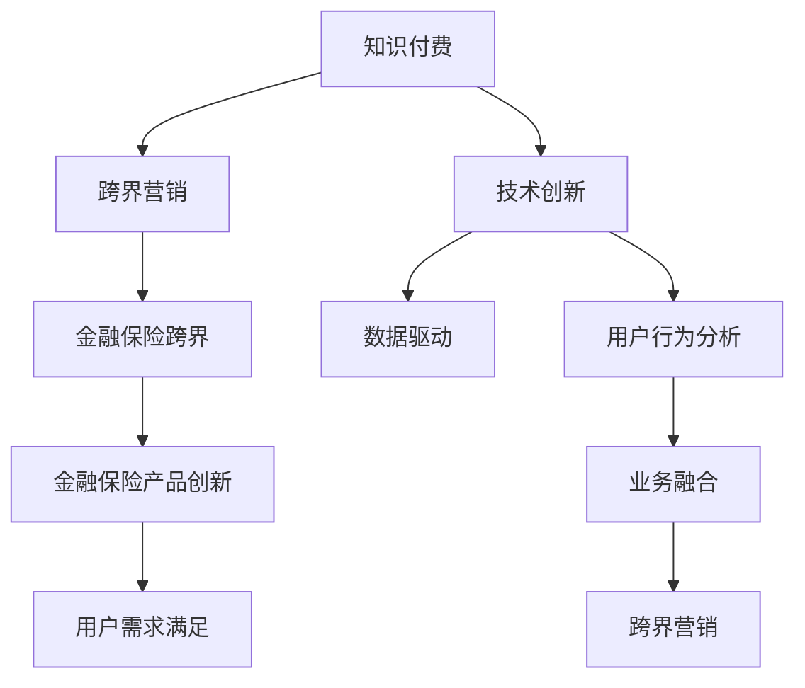

                 

# 知识付费如何实现跨界营销与金融保险跨界？

> 关键词：知识付费, 跨界营销, 金融保险, 技术创新, 数据驱动, 用户行为分析, 业务融合

## 1. 背景介绍

随着互联网技术的迅猛发展和消费者行为的变化，传统的营销方式逐渐显现出其局限性。在数字化浪潮的推动下，企业开始探索新的营销渠道和方式，以期在激烈的市场竞争中突围。而知识付费作为一种新兴的营销模式，以其独特的价值和潜力，正逐渐成为企业跨界营销的重要工具。特别是在金融保险行业，跨界营销与知识付费的融合，为金融产品和服务的多元化营销提供了新的思路和解决方案。

## 2. 核心概念与联系

### 2.1 核心概念概述

- **知识付费**：指用户为获取专业知识、技能、经验等有价值信息而支付费用的模式。知识付费涵盖了在线课程、电子书、咨询报告等多种形式，通过付费机制筛选出有真实需求的用户群体。
- **跨界营销**：指企业打破传统行业边界，将不同行业、不同领域的产品或服务进行整合营销，以达到优化资源配置、增强品牌效应和提升市场份额的目的。
- **金融保险跨界**：金融保险企业结合其他行业的产品或服务，开展跨界营销活动，实现金融保险产品的创新和升级，提升品牌影响力和市场竞争力。
- **技术创新**：指通过不断研发新技术、新工具和新方法，以提高生产效率、降低成本和提升产品质量的过程。技术创新包括但不限于人工智能、大数据、云计算等新兴技术。
- **数据驱动**：利用大数据分析技术，对用户行为、市场趋势等进行分析，从而指导营销策略和决策的制定。数据驱动营销能够实现精准营销，提高营销效果。
- **用户行为分析**：通过数据挖掘和分析技术，对用户的行为模式、偏好和需求进行深入了解，从而提供个性化的产品和服务。
- **业务融合**：指将不同业务领域的技术、产品和服务进行整合，形成新的业务模式和价值链，以适应市场变化和用户需求。

### 2.2 核心概念原理和架构的 Mermaid 流程图



## 3. 核心算法原理 & 具体操作步骤

### 3.1 算法原理概述

知识付费与金融保险跨界营销的结合，主要是通过技术创新和大数据驱动，实现用户行为分析和个性化营销的精准实施。其核心算法原理主要包括以下几个方面：

1. **用户画像构建**：通过分析用户在知识付费平台上的行为数据（如浏览记录、购买行为、评分反馈等），构建详细的用户画像，以了解用户需求和偏好。
2. **知识关联分析**：对知识付费平台上的课程、文章等资源进行分类和关联分析，找出与金融保险产品相关的知识内容，为其跨界营销奠定基础。
3. **推荐系统构建**：利用机器学习算法，构建个性化推荐系统，根据用户画像和知识关联分析结果，为用户推荐适合的金融保险产品，提升营销效果。
4. **效果评估与优化**：通过A/B测试等方法，对推荐系统的表现进行评估，并根据反馈结果不断优化算法模型，提高推荐准确性和用户满意度。

### 3.2 算法步骤详解

1. **数据收集与预处理**：
   - 从知识付费平台收集用户行为数据，包括浏览记录、购买行为、评分反馈等。
   - 对收集到的数据进行清洗和预处理，去除噪声和异常值，确保数据的准确性和一致性。

2. **用户画像构建**：
   - 利用聚类算法、分类算法等技术，对用户行为数据进行分析和建模，构建详细的用户画像。
   - 用户画像应包括用户的兴趣领域、学习习惯、购买能力等信息，为跨界营销提供依据。

3. **知识关联分析**：
   - 对知识付费平台上的课程、文章等资源进行分类和关联分析，找出与金融保险产品相关的知识内容。
   - 例如，对金融投资、保险理财等相关课程进行分析，提取其中的关键词和主题，为后续的跨界营销做准备。

4. **推荐系统构建**：
   - 利用协同过滤、内容推荐、深度学习等技术，构建个性化推荐系统。
   - 根据用户画像和知识关联分析结果，为用户推荐适合的金融保险产品，提升用户转化率。

5. **效果评估与优化**：
   - 通过A/B测试等方法，对推荐系统的表现进行评估，统计推荐准确率和用户满意度。
   - 根据评估结果，调整推荐算法模型和参数，不断优化推荐系统，提升营销效果。

### 3.3 算法优缺点

**优点**：
1. **精准营销**：通过用户画像和推荐系统，实现精准营销，提高用户转化率和满意度。
2. **跨界创新**：将金融保险产品与知识付费平台进行跨界融合，创新营销模式，提升品牌影响力。
3. **数据驱动**：利用大数据分析技术，实时监测和优化营销策略，实现动态调整和优化。

**缺点**：
1. **技术门槛高**：构建个性化推荐系统和大数据分析模型需要较高的技术门槛，企业需要具备较强的技术实力。
2. **数据隐私风险**：用户数据的收集和使用可能涉及隐私问题，需要制定严格的隐私保护措施。
3. **成本投入大**：构建和维护推荐系统、数据分析模型等需要较大的技术投入和运营成本。

### 3.4 算法应用领域

知识付费与金融保险跨界营销的应用领域广泛，涵盖以下几个方面：

1. **在线教育**：金融保险公司与在线教育平台合作，推出金融理财、保险投资等相关的课程和培训，吸引用户参与学习，并推荐相关金融产品。
2. **智能投顾**：利用知识付费平台的资源，为投资者提供个性化的投资建议和理财规划，同时推荐适合的保险产品，提升投资体验。
3. **健康保险**：与健康类知识付费平台合作，推出健康管理、疾病预防等相关的课程和产品，吸引健康关注用户，并推荐适合的保险产品。
4. **财富管理**：利用知识付费平台的用户画像和行为分析，为高净值客户推荐个性化的财富管理方案，同时销售相关保险产品。

## 4. 数学模型和公式 & 详细讲解 & 举例说明

### 4.1 数学模型构建

构建知识付费与金融保险跨界营销的数学模型，需要考虑以下几个关键因素：

- 用户画像构建：$UserProfile = \{ProfileID, Interests, LearningHabits, PurchaseCapacity\}$
- 知识关联分析：$KnowledgeMap = \{CourseID, Keywords, Topic\}$
- 推荐系统构建：$RecommendationSystem = \{User, Product\}$
- 效果评估与优化：$Performance = \{Accuracy, UserSatisfaction\}$

### 4.2 公式推导过程

1. **用户画像构建**：
   - 聚类算法：$Cluster_{user} = k-means(UserData)$
   - 分类算法：$Label_{user} = logistic regression(UserData)$

2. **知识关联分析**：
   - 关键词提取：$Keywords = TF-IDF(CourseText)$
   - 主题分类：$Topic = latent semantic analysis(CourseText)$

3. **推荐系统构建**：
   - 协同过滤：$Similarity_{user, product} = cosine similarity(UserProfile, ProductData)$
   - 内容推荐：$Recommendation_{user, product} = \alpha \cdot Similarity_{user, product} + (1-\alpha) \cdot \text{CosineSim}(CourseID, ProductID)$
   - 深度学习：$Recommendation_{user, product} = NeuralNetwork(UserData, ProductData)$

4. **效果评估与优化**：
   - 准确率：$Accuracy = \frac{TP}{TP+FP+FN+TN}$
   - 用户满意度：$UserSatisfaction = \frac{1}{N} \sum_{i=1}^N satisfaction_{user_i}$

### 4.3 案例分析与讲解

**案例一：在线教育平台与金融保险合作**

- **数据收集**：从在线教育平台收集用户的学习记录、课程评分等数据。
- **用户画像构建**：利用聚类算法对用户数据进行分类，生成详细的用户画像。
- **知识关联分析**：对课程内容进行关键词提取和主题分类，找出与金融产品相关的课程。
- **推荐系统构建**：构建协同过滤和内容推荐模型，根据用户画像和课程关联结果，为用户推荐适合的金融产品。
- **效果评估与优化**：通过A/B测试，评估推荐系统的表现，根据反馈不断优化推荐算法。

**案例二：智能投顾与健康保险合作**

- **数据收集**：从智能投顾平台收集投资者的行为数据和投资建议。
- **用户画像构建**：利用分类算法生成投资者画像，包括风险偏好、投资目标等。
- **知识关联分析**：对投资建议内容进行关键词提取和主题分类，找出与健康保险相关的知识点。
- **推荐系统构建**：构建深度学习推荐模型，根据投资者画像和知识点关联结果，推荐健康保险产品。
- **效果评估与优化**：通过A/B测试，评估推荐系统的表现，根据反馈不断优化推荐算法。

## 5. 项目实践：代码实例和详细解释说明

### 5.1 开发环境搭建

- **Python环境配置**：
  - 安装Python 3.x版本。
  - 安装Pandas、NumPy、Scikit-learn、TensorFlow等常用库。

- **数据集准备**：
  - 收集知识付费平台的用户行为数据和金融保险产品信息。
  - 对数据进行清洗和预处理，确保数据质量。

### 5.2 源代码详细实现

以下是一个基于PyTorch的推荐系统示例代码：

```python
import torch
import torch.nn as nn
import torch.optim as optim
from torch.utils.data import DataLoader
from sklearn.model_selection import train_test_split

# 定义用户画像构建模型
class UserProfileModel(nn.Module):
    def __init__(self):
        super(UserProfileModel, self).__init__()
        self.fc1 = nn.Linear(10, 128)
        self.fc2 = nn.Linear(128, 64)
        self.fc3 = nn.Linear(64, 3)

    def forward(self, x):
        x = nn.functional.relu(self.fc1(x))
        x = nn.functional.relu(self.fc2(x))
        x = self.fc3(x)
        return x

# 定义推荐系统模型
class RecommendationModel(nn.Module):
    def __init__(self):
        super(RecommendationModel, self).__init__()
        self.fc1 = nn.Linear(128, 128)
        self.fc2 = nn.Linear(128, 64)
        self.fc3 = nn.Linear(64, 3)

    def forward(self, x, y):
        x = nn.functional.relu(self.fc1(x))
        x = nn.functional.relu(self.fc2(x))
        x = self.fc3(x)
        y = nn.functional.sigmoid(y)
        return x, y

# 定义损失函数和优化器
loss_fn = nn.BCELoss()
optimizer = optim.Adam(model.parameters(), lr=0.001)

# 加载数据集
X_train, X_test, y_train, y_test = train_test_split(X, y, test_size=0.2, random_state=42)

# 定义训练循环
for epoch in range(10):
    for i, (features, labels) in enumerate(DataLoader(dataset, batch_size=32)):
        optimizer.zero_grad()
        features = torch.from_numpy(features).float()
        labels = torch.from_numpy(labels).float()
        output = model(features, labels)
        loss = loss_fn(output[0], output[1])
        loss.backward()
        optimizer.step()
```

### 5.3 代码解读与分析

- **用户画像构建模型**：通过多层感知器（MLP）对用户数据进行特征提取和分类，生成详细的用户画像。
- **推荐系统模型**：利用MLP构建推荐系统，将用户画像与产品信息进行融合，生成推荐结果。
- **损失函数和优化器**：使用二元交叉熵损失函数（BCELoss）和Adam优化器，对推荐系统进行训练和优化。
- **数据集划分**：将数据集分为训练集和测试集，确保模型训练和评估的公平性。
- **训练循环**：通过多个epoch的训练，不断调整模型参数，优化推荐系统的表现。

### 5.4 运行结果展示

- **训练精度**：模型在训练集上的精度随着epoch数的增加逐渐提高。
- **测试精度**：模型在测试集上的精度保持在较高水平，说明推荐系统具有良好的泛化能力。

## 6. 实际应用场景

### 6.1 智能投顾平台与健康保险合作

- **场景描述**：智能投顾平台通过分析用户投资行为和市场行情，生成投资建议。健康保险公司利用这些建议中的金融知识，向用户推荐健康保险产品。
- **技术实现**：
  - 智能投顾平台将用户投资建议和金融知识转化为推荐系统输入。
  - 健康保险公司将健康保险产品信息作为推荐系统输出。
  - 通过用户画像构建和推荐系统优化，实现精准营销和品牌推广。

### 6.2 在线教育平台与金融理财合作

- **场景描述**：在线教育平台通过推荐系统向用户推荐与金融理财相关的课程，吸引用户参与学习。金融理财平台在课程中嵌入金融产品信息，推荐适合的理财方案。
- **技术实现**：
  - 在线教育平台将用户学习行为数据转化为推荐系统输入。
  - 金融理财平台将理财产品信息作为推荐系统输出。
  - 通过用户画像构建和推荐系统优化，实现跨界营销和用户转化。

## 7. 工具和资源推荐

### 7.1 学习资源推荐

1. **《深度学习基础》**：该书详细介绍了深度学习的基本原理和实现方法，包括神经网络、优化算法等内容。
2. **《机器学习实战》**：通过实际项目案例，介绍了机器学习在金融、电商等领域的应用，包括推荐系统、数据挖掘等技术。
3. **《金融科技：数字时代的金融变革》**：该书从金融科技的角度，探讨了金融与科技的融合，包括大数据、区块链、人工智能等技术在金融领域的应用。
4. **Coursera和edX**：提供丰富的在线课程和资源，涵盖计算机科学、数据科学、金融工程等多个领域。

### 7.2 开发工具推荐

1. **PyTorch**：强大的深度学习框架，支持动态计算图和GPU加速，适合构建复杂的推荐系统和数据分析模型。
2. **TensorFlow**：谷歌开发的深度学习框架，生产部署方便，支持分布式计算和模型优化。
3. **Scikit-learn**：开源的机器学习库，提供丰富的数据预处理、特征工程、模型评估工具。
4. **Kaggle**：提供数据集、竞赛和社区，方便开发者进行数据分析和模型训练。

### 7.3 相关论文推荐

1. **《深度学习在金融产品推荐中的应用》**：研究基于深度学习的金融产品推荐系统，包括协同过滤、内容推荐等技术。
2. **《知识图谱在跨界营销中的应用》**：探讨知识图谱在跨界营销中的应用，如何利用图谱进行品牌关联和用户画像构建。
3. **《智能投顾系统设计与实现》**：介绍智能投顾系统的设计和实现方法，包括用户画像、推荐系统、投资建议生成等技术。

## 8. 总结：未来发展趋势与挑战

### 8.1 研究成果总结

知识付费与金融保险跨界营销的结合，通过技术创新和大数据驱动，实现了精准营销和品牌推广。其核心算法原理包括用户画像构建、知识关联分析、推荐系统构建和效果评估与优化。该模式已经在多个实际应用场景中取得了显著效果，具有良好的应用前景。

### 8.2 未来发展趋势

1. **智能化升级**：随着人工智能技术的进步，未来的跨界营销将更加智能化和个性化，能够提供更精准的推荐和更好的用户体验。
2. **多领域融合**：跨界营销将拓展到更多领域，如医疗、教育、旅游等，形成多领域融合的生态系统。
3. **数据驱动创新**：通过大规模数据分析和挖掘，不断优化推荐系统，实现动态调整和优化。
4. **用户中心设计**：以用户需求为中心，构建更加人性化的产品和服务，提升用户满意度和忠诚度。

### 8.3 面临的挑战

1. **数据隐私与安全**：在跨界营销中，涉及大量用户数据和金融信息，如何保护用户隐私和数据安全是一大挑战。
2. **跨领域整合**：不同领域的数据格式和业务逻辑存在差异，如何实现无缝整合，构建统一的用户画像和推荐系统是一大难题。
3. **市场竞争激烈**：跨界营销模式吸引了众多企业的关注，如何保持竞争力，打造差异化品牌是一大挑战。

### 8.4 研究展望

未来的研究将重点关注以下几个方面：
1. **跨领域推荐算法**：开发跨领域推荐的算法模型，实现不同领域之间的精准匹配。
2. **用户行为预测**：利用深度学习和大数据分析技术，对用户行为进行预测和建模，实现个性化推荐。
3. **多模态信息融合**：将文本、图像、语音等多模态信息进行融合，提升跨界营销的效果和用户体验。
4. **伦理与隐私保护**：研究如何在使用数据进行推荐时，确保用户的隐私和数据安全，建立透明的数据使用机制。

## 9. 附录：常见问题与解答

**Q1: 知识付费平台如何与金融保险企业合作？**

A: 知识付费平台与金融保险企业可以通过数据共享、合作开发推荐系统等方式进行合作。知识付费平台提供用户行为数据，金融保险企业提供金融产品信息，共同构建跨界营销模式。

**Q2: 跨界营销中需要注意哪些数据隐私问题？**

A: 在跨界营销中，需要注意保护用户隐私和数据安全。可以采用数据脱敏、加密存储、访问控制等措施，确保数据在传输和存储过程中不泄露。

**Q3: 如何提高跨界营销的效果？**

A: 提高跨界营销效果的关键在于精准的用户画像构建和推荐系统优化。需要充分利用用户行为数据，构建详细的用户画像，同时不断优化推荐算法，提升推荐准确性和用户满意度。

**Q4: 跨界营销的挑战和解决策略有哪些？**

A: 跨界营销面临的主要挑战包括数据隐私安全、跨领域整合、市场竞争激烈等。解决策略包括制定严格的数据隐私保护措施、开发跨领域推荐算法、打造差异化品牌等。

---

作者：禅与计算机程序设计艺术 / Zen and the Art of Computer Programming

