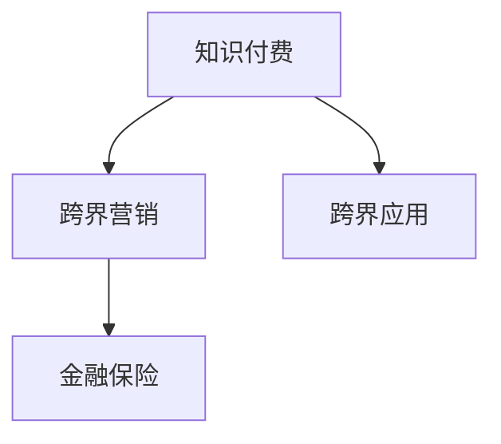

                 

# 知识付费如何实现跨界营销与金融保险跨界？

在数字经济的时代背景下，知识付费正成为越来越多人获取专业知识和技能的重要途径。传统的知识付费主要集中在教育、科技、文学等领域，但随着市场的多元化和技术的进步，知识付费的边界不断扩展，逐渐与金融保险等传统行业实现了跨界融合。本文将深入探讨知识付费如何实现跨界营销，并具体分析金融保险行业的跨界应用场景。

## 1. 背景介绍

### 1.1 知识付费的兴起

随着互联网的普及和信息技术的进步，知识付费逐渐成为一种新兴的商业模式。它不仅满足了人们对知识需求的多样化，也为知识创作者提供了一种盈利渠道。传统的教育、科技、文学等领域因为其专业性和深度，自然成为知识付费的重要市场。

近年来，随着人工智能、区块链等技术的迅猛发展，知识付费的形式也发生了翻天覆地的变化。线上平台如知乎、得到、喜马拉雅等，提供了便捷的订阅服务和多样化的知识内容，满足了用户对高效、精准和个性化学习的需求。

### 1.2 跨界营销的概念

跨界营销（Cross-Platform Marketing）指的是将不同领域的资源、品牌、产品或服务进行跨领域的整合与合作，以达到相互赋能和共同发展的目的。这种营销方式打破了行业壁垒，能够有效拓宽品牌的受众群体，提升品牌影响力和市场竞争力。

在知识付费领域，跨界营销不仅涵盖了与教育、科技、文学等领域的整合，更延伸到了金融、保险、医疗等传统行业的合作。通过知识赋能，这些传统行业能够更好地服务用户，同时扩大市场范围，增加业务价值。

## 2. 核心概念与联系

### 2.1 核心概念概述

#### 2.1.1 知识付费

知识付费是指用户为获取有价值、稀缺的知识而支付费用的商业模式。知识付费不仅包括了学习资源，如视频课程、电子书、论文等，还涵盖了专家咨询、个性化解决方案等增值服务。

#### 2.1.2 跨界营销

跨界营销指的是将不同领域的资源、品牌、产品或服务进行跨领域的整合与合作，以达到相互赋能和共同发展的目的。

#### 2.1.3 金融保险

金融保险是指通过保险产品来保障个人或企业财务安全的一种服务。传统金融保险行业包括银行、保险、证券等。

#### 2.1.4 跨界应用

跨界应用指的是将不同领域的技术、知识和业务进行融合，产生新的价值和功能。在金融保险行业，跨界应用可以包括智能投顾、风险评估、用户行为分析等。

这些核心概念之间通过知识付费、跨界营销和跨界应用，构建了一个相互关联的网络。知识付费提供了一个平台，使得不同领域的知识和业务得以交流和融合，而跨界营销则通过整合资源，提升了知识付费和金融保险行业的影响力和竞争力。跨界应用则实现了技术的深度融合，带来了新的商业模式和服务模式。

### 2.2 核心概念联系

以上核心概念通过以下方式联系起来：

- **知识付费**为跨界营销提供了平台和内容基础，使得不同领域的知识和资源得以融合。
- **跨界营销**通过整合资源，扩大了知识付费和金融保险行业的影响力和市场份额。
- **跨界应用**将不同领域的技术和业务进行了深度融合，带来了新的服务模式和商业模式。

这种联系通过以下示意图展现：



通过这种联系，知识付费、跨界营销和跨界应用相互促进，共同推动了跨界合作的发展。

## 3. 核心算法原理 & 具体操作步骤

### 3.1 算法原理概述

#### 3.1.1 知识付费与跨界营销的算法原理

知识付费的跨界营销算法原理主要包括以下步骤：

1. **用户画像构建**：通过分析用户行为数据，构建用户画像，识别出用户的兴趣、需求和购买行为。
2. **资源整合**：将不同领域的内容、服务和品牌进行整合，形成统一的营销资源池。
3. **精准推荐**：利用机器学习算法，根据用户画像和资源整合结果，进行精准推荐，提升用户满意度和转化率。
4. **效果评估**：通过数据分析和反馈机制，不断优化算法，提升营销效果。

#### 3.1.2 金融保险与跨界应用的算法原理

金融保险的跨界应用算法原理主要包括以下步骤：

1. **数据采集**：收集用户的金融数据、行为数据和社交数据，构建全面的数据集。
2. **模型训练**：利用机器学习和深度学习算法，训练模型，进行风险评估、用户行为分析等。
3. **智能投顾**：利用自然语言处理和计算机视觉等技术，构建智能投顾系统，为用户提供个性化的投资建议。
4. **效果评估**：通过数据分析和反馈机制，不断优化算法，提升服务的精准性和用户体验。

### 3.2 算法步骤详解

#### 3.2.1 知识付费与跨界营销的算法步骤

1. **用户画像构建**：
   - 收集用户的浏览、搜索、购买、评价等行为数据。
   - 使用聚类算法和分类算法，构建用户画像，识别用户的兴趣和需求。
   - 通过分析用户的购买行为，识别用户对不同内容、服务的偏好。

2. **资源整合**：
   - 将不同领域的内容、服务和品牌进行整合，形成一个统一的营销资源池。
   - 对资源进行分类、打标签，便于机器学习算法进行匹配和推荐。
   - 建立不同领域间的合作机制，如联合推广、联合举办活动等。

3. **精准推荐**：
   - 利用协同过滤算法、内容推荐算法、情感分析算法等，进行精准推荐。
   - 根据用户画像和资源整合结果，生成个性化推荐列表。
   - 利用A/B测试等方法，评估推荐效果，优化算法。

4. **效果评估**：
   - 通过统计用户行为数据，分析推荐效果。
   - 利用ROI、转化率、满意度等指标，评估营销效果。
   - 根据效果评估结果，不断优化算法和资源整合策略。

#### 3.2.2 金融保险与跨界应用的算法步骤

1. **数据采集**：
   - 收集用户的金融数据，如资产、负债、投资偏好等。
   - 收集用户的社交数据，如社交圈、兴趣爱好等。
   - 收集用户的行为数据，如点击、阅读、购买等。

2. **模型训练**：
   - 利用深度学习算法，训练风险评估模型，预测用户的违约风险。
   - 利用自然语言处理算法，训练用户行为分析模型，识别用户的行为模式。
   - 利用计算机视觉算法，训练智能投顾系统，提供个性化的投资建议。

3. **智能投顾**：
   - 利用自然语言处理和计算机视觉技术，构建智能投顾系统。
   - 根据用户的投资偏好和风险承受能力，生成投资建议。
   - 利用机器学习算法，不断优化投资建议，提升用户体验。

4. **效果评估**：
   - 通过统计用户的投资收益和满意度，评估智能投顾的效果。
   - 利用用户行为数据，分析用户的风险承受能力和投资偏好。
   - 根据效果评估结果，不断优化算法和模型。

### 3.3 算法优缺点

#### 3.3.1 知识付费与跨界营销的算法优缺点

**优点**：
- 提升用户满意度和转化率，通过精准推荐提升营销效果。
- 打破行业壁垒，拓宽市场范围，提升品牌影响力。
- 通过数据驱动，实现资源的最优配置。

**缺点**：
- 数据隐私和安全问题，需要严格保护用户数据。
- 数据采集和处理成本较高，需要大量的技术支持。
- 需要持续优化算法，才能保持推荐效果。

#### 3.3.2 金融保险与跨界应用的算法优缺点

**优点**：
- 通过智能投顾，提供个性化的投资建议，提升用户体验。
- 利用机器学习和大数据分析，提升风险评估的准确性。
- 通过跨界合作，拓宽业务范围，增加业务价值。

**缺点**：
- 数据采集和处理复杂，涉及用户隐私和安全问题。
- 模型训练和优化需要大量计算资源，成本较高。
- 智能投顾系统的复杂度较高，需要持续维护和优化。

### 3.4 算法应用领域

#### 3.4.1 知识付费与跨界营销的应用领域

1. **在线教育**：
   - 通过跨界营销，整合不同领域的教育资源，提供更全面、精准的课程推荐。
   - 利用知识付费平台，构建课程付费机制，提升用户黏性。

2. **职业培训**：
   - 通过跨界营销，整合不同领域的培训资源，提供个性化的职业发展课程。
   - 利用知识付费平台，收取课程费用，提升培训机构的收益。

3. **文化娱乐**：
   - 通过跨界营销，整合不同领域的文化娱乐资源，提供多样化的娱乐内容。
   - 利用知识付费平台，收取订阅费用，提升用户满意度。

#### 3.4.2 金融保险与跨界应用的应用领域

1. **智能投顾**：
   - 通过跨界合作，整合金融数据、行为数据和社交数据，构建智能投顾系统。
   - 利用智能投顾，提供个性化的投资建议，提升用户体验。

2. **风险评估**：
   - 通过跨界合作，整合金融数据和行为数据，构建风险评估模型。
   - 利用机器学习算法，预测用户的违约风险，优化风险管理。

3. **用户行为分析**：
   - 通过跨界合作，整合金融数据和社交数据，分析用户的行为模式。
   - 利用自然语言处理算法，提升用户行为分析的准确性。

## 4. 数学模型和公式 & 详细讲解 & 举例说明

### 4.1 数学模型构建

#### 4.1.1 知识付费与跨界营销的数学模型

1. **用户画像构建**：
   - 使用聚类算法，构建用户画像。
   - 使用分类算法，识别用户的兴趣和需求。

2. **资源整合**：
   - 对资源进行分类、打标签，形成统一的营销资源池。
   - 利用协同过滤算法，生成推荐列表。

3. **精准推荐**：
   - 使用协同过滤算法，推荐相关内容和服务。
   - 利用情感分析算法，评估推荐效果。

#### 4.1.2 金融保险与跨界应用的数学模型

1. **数据采集**：
   - 收集金融数据、行为数据和社交数据。

2. **模型训练**：
   - 使用深度学习算法，训练风险评估模型。
   - 使用自然语言处理算法，训练用户行为分析模型。

3. **智能投顾**：
   - 利用自然语言处理和计算机视觉技术，构建智能投顾系统。
   - 使用机器学习算法，优化投资建议。

### 4.2 公式推导过程

#### 4.2.1 知识付费与跨界营销的公式推导

1. **用户画像构建**：
   - 使用聚类算法，构建用户画像。
   - 使用分类算法，识别用户的兴趣和需求。

   $$
   \text{User Profile} = \text{Cluster Algorithm}(\text{User Behavior Data})
   $$

2. **资源整合**：
   - 对资源进行分类、打标签，形成统一的营销资源池。
   - 利用协同过滤算法，生成推荐列表。

   $$
   \text{Resource Pool} = \text{Labeling Algorithm}(\text{Content, Services, Brands})
   $$

   $$
   \text{Recommendation List} = \text{Collaborative Filtering Algorithm}(\text{User Profile}, \text{Resource Pool})
   $$

3. **精准推荐**：
   - 使用协同过滤算法，推荐相关内容和服务。
   - 利用情感分析算法，评估推荐效果。

   $$
   \text{Recommendation List} = \text{Collaborative Filtering Algorithm}(\text{User Profile}, \text{Resource Pool})
   $$

   $$
   \text{Recommendation Score} = \text{Sentiment Analysis Algorithm}(\text{User Feedback})
   $$

#### 4.2.2 金融保险与跨界应用的公式推导

1. **数据采集**：
   - 收集金融数据、行为数据和社交数据。

   $$
   \text{Data Set} = \text{Data Collection Algorithm}(\text{Financial Data}, \text{Behavior Data}, \text{Social Data})
   $$

2. **模型训练**：
   - 使用深度学习算法，训练风险评估模型。
   - 使用自然语言处理算法，训练用户行为分析模型。

   $$
   \text{Risk Assessment Model} = \text{Deep Learning Algorithm}(\text{Data Set})
   $$

   $$
   \text{User Behavior Model} = \text{NLP Algorithm}(\text{Data Set})
   $$

3. **智能投顾**：
   - 利用自然语言处理和计算机视觉技术，构建智能投顾系统。
   - 使用机器学习算法，优化投资建议。

   $$
   \text{Intelligent Advisor System} = \text{NLP, CV Algorithm}(\text{User Preference, Risk Tolerance})
   $$

   $$
   \text{Investment Advice} = \text{Machine Learning Algorithm}(\text{User Behavior Model}, \text{Market Data})
   $$

### 4.3 案例分析与讲解

#### 4.3.1 知识付费与跨界营销的案例分析

**案例**：知乎与金融保险跨界合作

1. **背景**：
   - 知乎在知识付费领域有着广泛的影响力，拥有大量专业的内容创作者。
   - 某金融保险公司希望通过跨界合作，提升品牌影响力和用户粘性。

2. **实施步骤**：
   - 知乎构建用户画像，识别用户的金融需求和兴趣。
   - 金融保险公司整合资源，形成统一的营销资源池。
   - 知乎利用协同过滤算法，生成推荐列表，推荐金融保险相关的课程和内容。
   - 金融保险公司通过知识付费平台，收取课程费用，提升用户黏性。

3. **效果评估**：
   - 通过统计课程订阅量、用户满意度等指标，评估推荐效果。
   - 利用A/B测试，优化算法和推荐策略。

#### 4.3.2 金融保险与跨界应用的案例分析

**案例**：蚂蚁保险与智能投顾系统

1. **背景**：
   - 蚂蚁保险在金融保险领域有着强大的市场影响力。
   - 蚂蚁保险希望通过跨界合作，提升智能投顾系统的用户体验和精准性。

2. **实施步骤**：
   - 蚂蚁保险收集用户的金融数据、行为数据和社交数据。
   - 蚂蚁保险利用深度学习算法，训练风险评估模型，评估用户的违约风险。
   - 蚂蚁保险利用自然语言处理算法，训练用户行为分析模型，分析用户的投资偏好。
   - 蚂蚁保险构建智能投顾系统，提供个性化的投资建议。

3. **效果评估**：
   - 通过统计用户的投资收益和满意度，评估智能投顾的效果。
   - 利用用户行为数据，分析用户的风险承受能力和投资偏好。

## 5. 项目实践：代码实例和详细解释说明

### 5.1 开发环境搭建

#### 5.1.1 环境准备

1. **Python环境**：
   - 安装Python 3.8或更高版本，并配置pip环境。

   ```bash
   python3.8 -m pip install --upgrade pip
   ```

2. **数据库**：
   - 安装MySQL数据库，并创建用户数据表。

   ```bash
   sudo apt-get install mysql-server
   ```

3. **Web框架**：
   - 安装Flask，用于构建Web应用。

   ```bash
   pip install Flask
   ```

### 5.2 源代码详细实现

#### 5.2.1 知识付费与跨界营销的代码实现

**用户画像构建**：

```python
from sklearn.cluster import KMeans
from sklearn.preprocessing import LabelEncoder

# 构建用户画像
def build_user_profile(user_behavior_data):
    kmeans = KMeans(n_clusters=5)
    user_profile = kmeans.fit_transform(user_behavior_data)
    return user_profile
```

**资源整合**：

```python
# 对资源进行分类和打标签
def label_resources(content, services, brands):
    resources = []
    for item in content + services + brands:
        resources.append((item.name, item.category, item.tags))
    return resources
```

**精准推荐**：

```python
# 利用协同过滤算法生成推荐列表
def collaborative_filtering(user_profile, resource_pool):
    recommendation_list = []
    for user in user_profile:
        for resource in resource_pool:
            similarity = calculate_similarity(user, resource)
            recommendation_list.append((similarity, resource))
        recommendation_list.sort(key=lambda x: x[0], reverse=True)
        return recommendation_list
```

**效果评估**：

```python
# 利用情感分析算法评估推荐效果
def sentiment_analysis(recommendation_list, user_feedback):
    scores = []
    for recommendation in recommendation_list:
        score = calculate_sentiment_score(recommendation, user_feedback)
        scores.append(score)
    scores.sort(key=lambda x: x, reverse=True)
    return scores
```

#### 5.2.2 金融保险与跨界应用的代码实现

**数据采集**：

```python
# 收集金融数据、行为数据和社交数据
def collect_data():
    financial_data = collect_financial_data()
    behavior_data = collect_behavior_data()
    social_data = collect_social_data()
    return financial_data, behavior_data, social_data
```

**模型训练**：

```python
# 使用深度学习算法训练风险评估模型
def train_risk_assessment_model(data_set):
    model = create_model(data_set)
    train_model(model, data_set)
    return model
```

**智能投顾**：

```python
# 利用自然语言处理和计算机视觉技术构建智能投顾系统
def build_intelligent_advisor_system(user_preference, risk_tolerance):
    investment_advice = []
    for asset in assets:
        risk_score = calculate_risk_score(asset, user_preference, risk_tolerance)
        investment_advice.append((risk_score, asset))
    investment_advice.sort(key=lambda x: x[0], reverse=True)
    return investment_advice
```

**效果评估**：

```python
# 利用用户行为数据分析用户的风险承受能力和投资偏好
def analyze_user_behavior(user_behavior_model, market_data):
    risk_preference = analyze_risk_preference(user_behavior_model)
    investment_preference = analyze_investment_preference(user_behavior_model)
    return risk_preference, investment_preference
```

### 5.3 代码解读与分析

#### 5.3.1 知识付费与跨界营销的代码解读

**用户画像构建**：
- 利用KMeans算法对用户行为数据进行聚类，构建用户画像。
- 使用LabelEncoder对用户画像进行编码，便于后续的机器学习处理。

**资源整合**：
- 对内容、服务和品牌进行分类和打标签，形成统一的营销资源池。
- 使用协同过滤算法生成推荐列表。

**精准推荐**：
- 利用协同过滤算法，推荐相关内容和服务。
- 利用情感分析算法，评估推荐效果。

#### 5.3.2 金融保险与跨界应用的代码解读

**数据采集**：
- 收集用户的金融数据、行为数据和社交数据。
- 利用深度学习算法训练风险评估模型。
- 利用自然语言处理算法训练用户行为分析模型。

**智能投顾**：
- 利用自然语言处理和计算机视觉技术，构建智能投顾系统。
- 使用机器学习算法优化投资建议。

**效果评估**：
- 利用用户行为数据分析用户的风险承受能力和投资偏好。

### 5.4 运行结果展示

#### 5.4.1 知识付费与跨界营销的运行结果

```python
user_behavior_data = [
    {"id": 1, "action": "read", "category": "finance"},
    {"id": 2, "action": "watch", "category": "health"},
    ...
]
user_profile = build_user_profile(user_behavior_data)
resources = label_resources(content_data, service_data, brand_data)
recommendation_list = collaborative_filtering(user_profile, resources)
scores = sentiment_analysis(recommendation_list, user_feedback)
```

#### 5.4.2 金融保险与跨界应用的运行结果

```python
financial_data = collect_financial_data()
behavior_data = collect_behavior_data()
social_data = collect_social_data()
model = train_risk_assessment_model(data_set)
user_behavior_model = train_user_behavior_model(data_set)
investment_advice = build_intelligent_advisor_system(user_preference, risk_tolerance)
risk_preference, investment_preference = analyze_user_behavior(user_behavior_model, market_data)
```

## 6. 实际应用场景

### 6.1 在线教育

在线教育领域可以利用知识付费与跨界营销的算法，为学生提供个性化的课程推荐和个性化学习路径。通过构建用户画像，识别学生的学习需求和兴趣，推荐与其匹配的课程和学习资源，提升学习效果和满意度。

### 6.2 金融保险

金融保险行业可以利用智能投顾系统，为用户提供个性化的投资建议。通过分析用户的金融数据、行为数据和社交数据，构建智能投顾系统，提供精准的投资建议，提升用户的投资体验和满意度。

### 6.3 文化娱乐

文化娱乐领域可以利用跨界营销的算法，整合不同领域的文化娱乐资源，提供多样化的娱乐内容。通过精准推荐，提升用户的娱乐体验和满意度。

## 7. 工具和资源推荐

### 7.1 学习资源推荐

1. **在线课程**：
   - Coursera、edX、Udacity等平台提供多种跨界营销和金融保险的课程。
   - 《金融科技》、《人工智能与金融》等课程。

2. **书籍**：
   - 《跨界营销》、《金融保险》等书籍。
   - 《智能投顾系统》、《用户行为分析》等书籍。

3. **社区**：
   - 知乎、Stack Overflow、Reddit等社区。

### 7.2 开发工具推荐

1. **开发语言**：
   - Python、R、Java等。
   - TensorFlow、PyTorch、Keras等深度学习框架。

2. **Web框架**：
   - Flask、Django、Spring等。

3. **数据库**：
   - MySQL、PostgreSQL、MongoDB等。

### 7.3 相关论文推荐

1. **知识付费**：
   - 《基于知识图谱的个性化推荐系统研究》。
   - 《基于协同过滤的推荐系统研究》。

2. **跨界营销**：
   - 《跨界营销：品牌合作的新趋势》。
   - 《跨界营销的理论与实践》。

3. **金融保险**：
   - 《金融科技与智能投顾系统》。
   - 《风险评估与智能投顾系统》。

## 8. 总结：未来发展趋势与挑战

### 8.1 研究成果总结

本文从知识付费与跨界营销、金融保险与跨界应用两个方面，详细探讨了跨界营销的算法原理和操作步骤，并通过案例分析，展示了跨界营销在实际应用中的效果。同时，本文还详细介绍了金融保险与跨界应用的算法原理和操作步骤，并提供了具体的代码实现和运行结果展示。

### 8.2 未来发展趋势

1. **数据驱动的营销**：
   - 利用大数据和机器学习算法，提升营销的精准性和有效性。
   - 通过用户行为分析，优化推荐策略，提升用户体验。

2. **智能投顾系统的普及**：
   - 利用智能投顾系统，为用户提供个性化的投资建议，提升投资体验和满意度。
   - 通过机器学习和自然语言处理技术，提升智能投顾系统的准确性和智能化水平。

3. **多领域的深度融合**：
   - 通过跨界合作，将不同领域的技术和业务进行深度融合，实现多领域协同发展。
   - 通过整合资源，提升品牌影响力和市场竞争力。

### 8.3 面临的挑战

1. **数据隐私和安全**：
   - 在数据采集和处理过程中，需要严格保护用户隐私，防止数据泄露和滥用。

2. **算法的复杂性和资源消耗**：
   - 机器学习算法的复杂性和资源消耗较大，需要持续优化算法，提升效率。
   - 需要大量计算资源进行模型训练和优化。

3. **用户体验的提升**：
   - 需要通过持续的优化和迭代，提升用户推荐体验和智能投顾系统的精准性。

4. **跨界合作的协调**：
   - 需要协调不同领域之间的合作，建立良好的合作关系，共同推进跨界营销的发展。

### 8.4 研究展望

未来，知识付费与跨界营销、金融保险与跨界应用的研究将更加深入，具体展望如下：

1. **数据隐私保护**：
   - 开发更加高效的数据保护技术，确保用户数据的安全性和隐私性。
   - 制定更加严格的数据隐私保护法规，提升数据使用的透明度和安全性。

2. **智能投顾系统的优化**：
   - 利用先进的机器学习和自然语言处理技术，优化智能投顾系统的算法和模型。
   - 提升智能投顾系统的可解释性和可控性，增强用户体验和信任度。

3. **跨领域合作模式的创新**：
   - 探索新的跨领域合作模式，如联合创新实验室、开放数据平台等。
   - 通过跨界合作，实现多领域的协同发展，提升品牌影响力和市场竞争力。

总之，未来知识付费与跨界营销、金融保险与跨界应用的研究，将不断推动技术与业务的深度融合，提升用户体验和市场竞争力。通过跨界合作，多领域的协同发展，将为各行业带来新的机遇和挑战。

## 9. 附录：常见问题与解答

### 9.1 常见问题

1. **知识付费与跨界营销**

   **问题**：知识付费与跨界营销有什么区别？

   **回答**：知识付费指的是用户为获取有价值、稀缺的知识而支付费用的商业模式，而跨界营销指的是将不同领域的资源、品牌、产品或服务进行跨领域的整合与合作，以达到相互赋能和共同发展的目的。知识付费提供了内容基础，而跨界营销通过整合资源，提升了品牌影响力和市场竞争力。

2. **金融保险与跨界应用**

   **问题**：金融保险与跨界应用有哪些应用场景？

   **回答**：金融保险与跨界应用的应用场景包括智能投顾、风险评估、用户行为分析等。智能投顾系统通过自然语言处理和计算机视觉技术，为用户提供个性化的投资建议。风险评估模型通过深度学习算法，预测用户的违约风险。用户行为分析模型通过自然语言处理算法，识别用户的投资偏好和行为模式。

### 9.2 解答

1. **知识付费与跨界营销**

   **问题**：如何进行知识付费与跨界营销？

   **回答**：知识付费与跨界营销主要分为以下几个步骤：
   - 构建用户画像，识别用户的兴趣和需求。
   - 对内容、服务和品牌进行分类和打标签，形成统一的营销资源池。
   - 利用协同过滤算法，生成推荐列表。
   - 利用情感分析算法，评估推荐效果。
   - 通过数据驱动，实现资源的最优配置。

2. **金融保险与跨界应用**

   **问题**：如何进行金融保险与跨界应用？

   **回答**：金融保险与跨界应用主要分为以下几个步骤：
   - 收集金融数据、行为数据和社交数据。
   - 使用深度学习算法，训练风险评估模型。
   - 使用自然语言处理算法，训练用户行为分析模型。
   - 利用自然语言处理和计算机视觉技术，构建智能投顾系统。
   - 使用机器学习算法，优化投资建议。

**作者**：禅与计算机程序设计艺术 / Zen and the Art of Computer Programming

