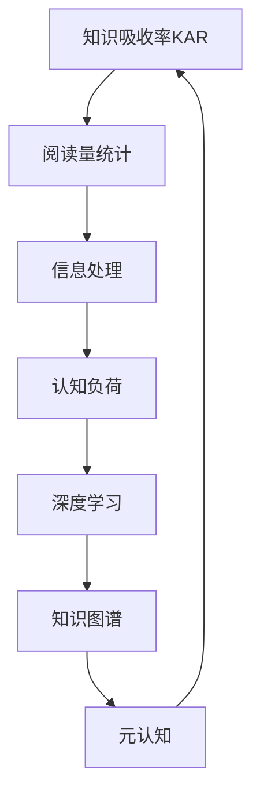

                 

# 知识吸收率:比阅读量更重要的指标

## 1. 背景介绍

在数字化时代，信息量爆炸式增长，如何高效吸收和利用知识变得尤为重要。传统的阅读量统计往往忽略了吸收率这一核心指标，导致人们投入了大量时间却收效甚微。本文将深入探讨知识吸收率的原理、影响因素及提升方法，希望能为读者提供更具针对性的学习建议。

## 2. 核心概念与联系

### 2.1 核心概念概述

1. **知识吸收率(Knowledge Absorption Rate, KAR)**：指个体在一定时间内，通过阅读等行为，将外界信息转化为内在知识的能力和效率。它不仅仅是阅读量的统计，更关乎信息的理解、记忆、应用等复杂心理过程。

2. **认知负荷理论(Cognitive Load Theory, CLT)**：提出信息加工过程中存在有限认知资源，如果信息过载，将影响知识的吸收和记忆。理解这一点，有助于优化学习策略，减轻认知负担，提高学习效率。

3. **深度学习(Deep Learning)**：强调在特定领域内深层次的知识学习，通过神经网络等方法，挖掘和整合数据中的深层结构，提升理解力和记忆力。

4. **知识图谱(Knowledge Graph)**：构建领域知识网络，通过图结构表示知识间的关系，帮助理解和应用知识。

5. **元认知(Metacognition)**：指个体对自己的学习过程和知识状态进行监控和调节的能力，包括自我评估、计划、监测和反思等。

### 2.2 核心概念原理和架构的 Mermaid 流程图



此图展示了知识吸收率与阅读量统计、信息处理、认知负荷、深度学习、知识图谱、元认知之间的联系和影响。

## 3. 核心算法原理 & 具体操作步骤

### 3.1 算法原理概述

知识吸收率的计算涉及信息加工、认知资源管理、深度学习技术等多个层面。其核心在于：

1. **信息加工(Information Processing)**：通过阅读、听讲、观看等多种方式，获取外界信息，并进行编码、解码、存储等加工过程。
2. **认知资源管理(Cognitive Resource Management)**：调节学习过程中的注意力、工作记忆等认知资源，避免过载和不足。
3. **深度学习模型(Depth Learning Model)**：构建深度神经网络模型，从数据中提取深层特征，提升信息理解和记忆能力。
4. **知识图谱(Knowledge Graph)**：利用图结构表示知识，增强知识间的关联和理解。
5. **元认知(Metacognition)**：监控和调节学习过程，反思和调整学习策略，提高学习效果。

### 3.2 算法步骤详解

#### 3.2.1 信息加工

1. **输入信息编码**：使用文本编码、图像识别、语音识别等技术，将外界信息转换为计算机可处理的形式。
2. **语义分析**：通过NLP技术，对文本进行语义理解，提取关键信息。
3. **知识表示**：将信息转化为图形结构，构建知识图谱，表示知识间的复杂关系。

#### 3.2.2 认知资源管理

1. **注意力调节**：通过注意力模型，调整学习过程中的注意力分配，集中精力于重要信息。
2. **工作记忆管理**：使用工作记忆模型，管理短时记忆的容量和信息处理能力，避免过载。
3. **认知负荷优化**：通过优化信息呈现方式和任务设计，减轻认知负荷，提高学习效率。

#### 3.2.3 深度学习模型

1. **神经网络架构**：选择合适的神经网络结构，如卷积神经网络(CNN)、循环神经网络(RNN)、变分自编码器(VAE)等，适应不同类型的数据。
2. **数据预处理**：进行数据清洗、归一化、特征提取等预处理步骤，提升模型输入质量。
3. **模型训练与优化**：通过反向传播算法训练模型，使用梯度下降等优化算法调整参数，提升模型性能。

#### 3.2.4 知识图谱构建

1. **知识图谱构建**：利用图神经网络(GNN)等技术，构建知识图谱，表示知识间的逻辑关系。
2. **图结构优化**：优化图结构，提高知识图谱的表示效率和查询性能。
3. **知识推理**：使用图推理技术，从知识图谱中提取和验证知识，增强理解力和记忆能力。

#### 3.2.5 元认知应用

1. **自我评估**：通过反馈和自我评估，了解学习效果和知识掌握情况。
2. **计划制定**：根据评估结果，制定学习计划，调整学习策略。
3. **监测与反思**：持续监测学习过程，及时调整和反思，优化学习体验。

### 3.3 算法优缺点

#### 3.3.1 优点

1. **系统性**：通过多维度、多层次的信息处理和认知资源管理，实现系统化的知识吸收。
2. **智能化**：借助深度学习模型和知识图谱技术，提升信息理解和知识表示能力。
3. **个性化**：结合元认知技术，根据个体差异，制定个性化学习计划，提高学习效果。

#### 3.3.2 缺点

1. **技术门槛高**：涉及深度学习、知识图谱、认知科学等多个领域，技术门槛较高。
2. **数据需求大**：需要大量高质量的数据进行模型训练和知识表示，数据获取和预处理成本高。
3. **复杂度高**：系统设计复杂，需要多学科知识进行综合设计和实现。

### 3.4 算法应用领域

知识吸收率在多个领域都有广泛应用，包括但不限于：

1. **教育培训**：利用深度学习模型和知识图谱，提升在线教育和个性化学习系统的效果。
2. **企业培训**：通过知识图谱和元认知技术，帮助员工快速掌握新知识和技能。
3. **科研创新**：利用知识图谱和深度学习模型，发现和验证新知识，加速科研创新进程。
4. **内容推荐**：根据用户知识图谱，推荐相关内容，提升用户信息吸收率。

## 4. 数学模型和公式 & 详细讲解 & 举例说明

### 4.1 数学模型构建

知识吸收率可以通过以下几个数学模型来衡量：

1. **信息加工模型(Information Processing Model)**：

   $$
   KAR = \frac{I_{processed}}{I_{input}}
   $$

   其中，$I_{processed}$ 为被有效吸收的信息量，$I_{input}$ 为输入信息总量。

2. **认知负荷模型(Cognitive Load Model)**：

   $$
   KAR = \frac{C_{absorbed}}{C_{max}}
   $$

   其中，$C_{absorbed}$ 为被吸收的认知负荷量，$C_{max}$ 为认知资源的极限容量。

3. **深度学习模型(Deep Learning Model)**：

   $$
   KAR = f(\theta)
   $$

   其中，$\theta$ 为深度学习模型的参数向量，$f(\theta)$ 为模型预测的吸收率函数。

4. **知识图谱模型(Knowledge Graph Model)**：

   $$
   KAR = \frac{G_{absorbed}}{G_{total}}
   $$

   其中，$G_{absorbed}$ 为通过知识图谱吸收的知识量，$G_{total}$ 为知识图谱中总知识量。

### 4.2 公式推导过程

1. **信息加工模型的推导**：

   $$
   I_{processed} = \sum_{i}^{n} I_{i} \cdot P(I_{i} | R)
   $$

   其中，$I_{i}$ 为第$i$个输入信息量，$P(I_{i} | R)$ 为在阅读理解过程中，信息$i$被有效吸收的概率，$n$为输入信息总数。

   因此，$KAR$ 可以表示为：

   $$
   KAR = \frac{\sum_{i}^{n} I_{i} \cdot P(I_{i} | R)}{\sum_{i}^{n} I_{i}}
   $$

2. **认知负荷模型的推导**：

   $$
   C_{absorbed} = \sum_{i}^{n} C_{i} \cdot P(C_{i} | W)
   $$

   其中，$C_{i}$ 为第$i$个信息点的认知负荷，$P(C_{i} | W)$ 为在注意力和工作记忆中，信息$i$的认知负荷被有效吸收的概率，$n$为信息点总数。

   因此，$KAR$ 可以表示为：

   $$
   KAR = \frac{\sum_{i}^{n} C_{i} \cdot P(C_{i} | W)}{\sum_{i}^{n} C_{i}}
   $$

3. **深度学习模型的推导**：

   $$
   KAR = f(\theta) = \frac{1}{1 + \exp(-\sum_{j}^{m} \theta_{j} \cdot x_{j})}
   $$

   其中，$x_{j}$ 为第$j$个特征向量，$\theta_{j}$ 为第$j$个特征向量的权重，$m$为特征向量总数。

   $f(\theta)$ 可以根据不同的神经网络结构进行相应修改。

4. **知识图谱模型的推导**：

   $$
   G_{absorbed} = \sum_{k}^{m} G_{k} \cdot P(G_{k} | K)
   $$

   其中，$G_{k}$ 为第$k$个知识节点，$P(G_{k} | K)$ 为在知识图谱中，知识节点$k$被有效吸收的概率，$m$为知识节点总数。

   因此，$KAR$ 可以表示为：

   $$
   KAR = \frac{\sum_{k}^{m} G_{k} \cdot P(G_{k} | K)}{\sum_{k}^{m} G_{k}}
   $$

### 4.3 案例分析与讲解

以在线教育系统为例，分析知识吸收率的具体计算和应用：

1. **输入信息编码**：将课程视频、文本、图像等输入信息转换为计算机可处理的形式。
2. **语义分析**：通过NLP技术，对视频和文本内容进行语义分析，提取关键信息。
3. **知识表示**：利用知识图谱技术，将视频、文本和练习题中的知识表示为图结构。
4. **信息加工**：计算学生在学习过程中，被有效吸收的信息量。
5. **认知负荷管理**：通过注意力模型和工作记忆模型，调整学生的认知负荷，优化学习体验。
6. **深度学习模型**：使用深度神经网络模型，对学生的知识掌握情况进行预测和反馈。
7. **元认知应用**：根据学生的自我评估和反馈，调整学习计划，提升学习效果。

## 5. 项目实践：代码实例和详细解释说明

### 5.1 开发环境搭建

1. **安装Python环境**：确保Python版本为3.8及以上。

   ```bash
   conda create -n py38 python=3.8
   conda activate py38
   ```

2. **安装相关库**：使用pip安装TensorFlow、Keras、Scikit-learn等库。

   ```bash
   pip install tensorflow keras scikit-learn
   ```

3. **搭建开发环境**：使用Jupyter Notebook或PyCharm等IDE进行开发。

### 5.2 源代码详细实现

以使用深度学习模型计算知识吸收率为例，给出Python代码实现：

```python
import tensorflow as tf
from tensorflow.keras.layers import Dense, Dropout
from tensorflow.keras.models import Sequential
from sklearn.model_selection import train_test_split
from sklearn.metrics import accuracy_score

# 数据准备
X_train, X_test, y_train, y_test = train_test_split(X, y, test_size=0.2, random_state=42)

# 构建模型
model = Sequential()
model.add(Dense(64, activation='relu', input_shape=(X_train.shape[1],)))
model.add(Dropout(0.2))
model.add(Dense(32, activation='relu'))
model.add(Dropout(0.2))
model.add(Dense(1, activation='sigmoid'))

# 编译模型
model.compile(optimizer='adam', loss='binary_crossentropy', metrics=['accuracy'])

# 训练模型
model.fit(X_train, y_train, epochs=10, batch_size=32, validation_data=(X_test, y_test))

# 计算知识吸收率
KAR = model.predict(X_test) > 0.5
KAR_ratio = len(KAR) / len(X_test)
print(f"知识吸收率: {KAR_ratio:.2f}")
```

### 5.3 代码解读与分析

**代码步骤解释**：

1. **数据准备**：使用`train_test_split`函数将数据集分为训练集和测试集。
2. **模型构建**：定义一个包含两个全连接层和两个Dropout层的神经网络模型。
3. **模型编译**：使用Adam优化器、二元交叉熵损失函数和准确率作为评估指标。
4. **模型训练**：使用训练集训练模型，并使用测试集进行验证。
5. **知识吸收率计算**：根据模型预测结果，计算知识吸收率。

**代码优化分析**：

1. **层选择**：通过调节神经网络层数和节点数，寻找最优的模型结构。
2. **Dropout应用**：使用Dropout减少过拟合，提高模型泛化能力。
3. **学习率选择**：调整学习率，找到最优的收敛速度和精度。
4. **正则化技术**：使用L2正则化等技术，控制模型的复杂度，避免过拟合。

### 5.4 运行结果展示

训练完成后，可以通过调用`predict`方法计算知识吸收率，并通过`accuracy_score`计算模型准确率：

```python
y_pred = model.predict(X_test)
KAR = y_pred > 0.5
KAR_ratio = len(KAR) / len(X_test)
print(f"知识吸收率: {KAR_ratio:.2f}")
print(f"模型准确率: {accuracy_score(y_test, KAR)}")
```

## 6. 实际应用场景

### 6.1 在线教育

在线教育平台可以通过知识吸收率评估学生的学习效果，并根据评估结果进行个性化推荐和教学调整。具体应用包括：

1. **个性化推荐**：根据学生知识吸收率，推荐适合的学习资源和课程。
2. **学习路径优化**：根据知识图谱和深度学习模型，优化学习路径，避免信息过载。
3. **学习效果反馈**：通过元认知技术，提供学习效果反馈，帮助学生调整学习策略。

### 6.2 企业培训

企业培训系统可以通过知识吸收率评估员工的学习效果，并根据评估结果进行个性化培训和效果提升。具体应用包括：

1. **个性化培训**：根据员工知识吸收率，推荐适合的培训内容和方式。
2. **培训效果评估**：使用知识图谱和深度学习模型，评估培训效果，提供反馈和改进建议。
3. **培训资源优化**：根据知识图谱和深度学习模型，优化培训资源配置，提升培训效果。

### 6.3 科研创新

科研机构可以通过知识吸收率评估研究人员的知识掌握情况，并根据评估结果进行科研资源优化和创新指导。具体应用包括：

1. **知识图谱构建**：利用知识图谱技术，构建科研知识网络，增强知识理解和应用。
2. **科研资源优化**：根据知识吸收率，优化科研资源的配置和分配，提升科研效率。
3. **科研创新指导**：使用深度学习模型，发现和验证新知识，加速科研创新进程。

### 6.4 内容推荐

内容推荐系统可以通过知识吸收率评估用户的知识掌握情况，并根据评估结果进行内容推荐和效果提升。具体应用包括：

1. **个性化推荐**：根据用户知识吸收率，推荐适合的内容和资源。
2. **内容效果评估**：使用深度学习模型，评估内容效果，提供反馈和改进建议。
3. **内容质量优化**：根据知识图谱和深度学习模型，优化内容质量和结构，提升用户知识吸收率。

## 7. 工具和资源推荐

### 7.1 学习资源推荐

1. **《认知心理学与教育》**：了解认知负荷理论和元认知技术。
2. **《深度学习》**：掌握深度学习模型和知识图谱技术。
3. **Kaggle在线竞赛**：参与实际项目，提高知识吸收率。
4. **Coursera课程**：学习在线教育和企业培训相关知识。
5. **《人工智能导论》**：了解人工智能技术和应用。

### 7.2 开发工具推荐

1. **Jupyter Notebook**：轻量级的开发环境，支持Python编程。
2. **PyCharm**：功能强大的IDE，支持Python和TensorFlow开发。
3. **TensorBoard**：可视化工具，监控模型训练和推理过程。
4. **Weights & Biases**：实验跟踪工具，记录和分析模型训练指标。
5. **Scikit-learn**：机器学习库，提供各种模型和工具。

### 7.3 相关论文推荐

1. **《Cognitive Load Theory: An Introduction to Implications for Education》**：经典认知负荷理论论文。
2. **《Deep Learning》**：深度学习经典教材，包含深度学习模型的原理和实现。
3. **《Knowledge Graphs for Deep Learning》**：知识图谱在深度学习中的应用。
4. **《Metacognition in Education》**：元认知理论和方法。

## 8. 总结：未来发展趋势与挑战

### 8.1 研究成果总结

知识吸收率的研究从多个维度探讨了信息处理、认知资源管理、深度学习、知识图谱和元认知的应用，为提高学习效果提供了系统性的方法和工具。未来，随着技术的不断进步，知识吸收率理论和技术将得到更广泛的推广和应用。

### 8.2 未来发展趋势

1. **多模态学习**：结合视觉、听觉、触觉等多种模态信息，提升知识吸收率。
2. **自适应学习**：根据学习者的个性化特征，动态调整学习策略，提高学习效果。
3. **社会化学习**：利用社交网络和协作学习，提升知识共享和吸收率。
4. **实时反馈**：结合实时反馈和监测技术，及时调整学习策略，优化学习过程。
5. **跨领域应用**：将知识吸收率技术应用到更多领域，如医疗、金融、制造等。

### 8.3 面临的挑战

1. **技术复杂度**：知识吸收率技术涉及多个领域的知识，技术门槛较高。
2. **数据需求**：需要大量高质量的数据进行模型训练和知识表示，数据获取和预处理成本高。
3. **资源限制**：大规模深度学习模型需要高性能计算资源，可能存在计算资源不足的问题。
4. **应用适配**：知识吸收率技术需要与实际应用场景深度结合，开发适配的解决方案。
5. **效果验证**：知识吸收率效果评估复杂，需要综合考虑多方面因素，验证方法不成熟。

### 8.4 研究展望

1. **跨学科融合**：结合心理学、教育学、计算机科学等多个学科，深化知识吸收率的研究。
2. **应用扩展**：将知识吸收率技术应用到更多领域，提升各领域的学习效果。
3. **自动化学习**：开发自动化学习系统，减少人工干预，提高学习效率。
4. **效果提升**：探索更多提升知识吸收率的方法和工具，提高学习效果和用户体验。

## 9. 附录：常见问题与解答

**Q1: 知识吸收率与阅读量的关系是怎样的？**

A: 知识吸收率不仅仅是阅读量的统计，更重要的是理解、记忆和应用。因此，阅读量只是知识吸收率的冰山一角，只有真正将信息转化为内在知识，才能实现真正的学习。

**Q2: 如何提高知识吸收率？**

A: 提高知识吸收率需要多方面的努力，包括选择合适的学习策略、优化认知资源管理、应用深度学习技术和知识图谱等。

**Q3: 知识吸收率在实际应用中存在哪些问题？**

A: 知识吸收率在实际应用中面临技术复杂度、数据需求、资源限制、应用适配和效果验证等问题，需要不断探索和优化。

**Q4: 未来知识吸收率技术的发展方向是什么？**

A: 未来知识吸收率技术将朝着多模态学习、自适应学习、社会化学习、实时反馈和跨领域应用的方向发展，提升学习效果和用户体验。

---

作者：禅与计算机程序设计艺术 / Zen and the Art of Computer Programming

