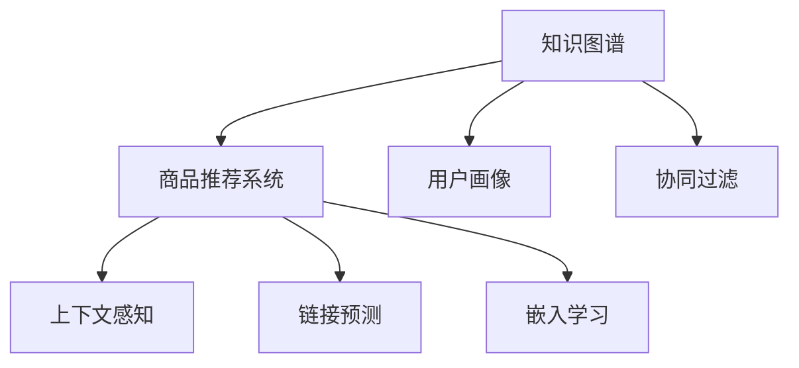

                 

# 知识图谱：AI构建商品与用户关联关系

> 关键词：知识图谱, 商品推荐系统, 用户画像, 协同过滤, 上下文感知, 链接预测, 应用实例

## 1. 背景介绍

### 1.1 问题由来

在现代社会，商品与用户之间的关联关系已经成为电商、社交媒体、内容推荐等领域研究的焦点。如何通过数据挖掘和机器学习技术，深入理解商品与用户之间的复杂关系，从而提供个性化的推荐和服务，是当前互联网应用的重要课题。

以电商平台为例，传统的商品推荐系统主要依赖基于用户行为的历史数据，如浏览、点击、购买等行为记录。然而，这种基于个体行为的数据往往存在维度高、稀疏性强的特点，难以充分反映用户和商品之间复杂的互动关系。此外，基于单一用户行为的推荐方法存在隐私泄露风险，无法有效保护用户隐私。

而知识图谱作为一种结构化的知识表示方式，通过构建商品和用户之间的丰富关联关系，可以有效解决以上问题。知识图谱不仅能够存储静态的语义信息，还能够通过链接预测、嵌入学习等方法，动态捕捉用户和商品之间的关联关系。

### 1.2 问题核心关键点

1. **知识图谱的构建**：通过挖掘和融合多种数据源（如结构化数据、半结构化数据、非结构化数据），构建商品和用户之间丰富的语义关系网络。
2. **商品与用户关联关系的挖掘**：利用图谱中的链接预测算法，捕捉用户和商品之间的动态关系，形成用户画像和商品画像。
3. **上下文感知推荐**：将用户画像和商品画像，结合上下文环境信息（如时间、地点、社交关系等），进行个性化的推荐，提升推荐效果。
4. **隐私保护**：在知识图谱构建和推荐过程中，保护用户隐私，避免敏感信息的泄露。
5. **实时更新和维护**：知识图谱需要不断更新和维护，以适应快速变化的市场环境和用户需求。

## 2. 核心概念与联系

### 2.1 核心概念概述

在深入探讨知识图谱在构建商品与用户关联关系中的应用之前，首先需要明确一些核心概念及其相互联系：

- **知识图谱(Knowledge Graph)**：一种结构化的知识表示方式，用于描述实体之间的关系。知识图谱由节点和边构成，节点表示实体，边表示实体之间的关系。
- **商品推荐系统(Recommender System)**：通过分析用户的历史行为和偏好，为用户推荐感兴趣的商品。推荐系统广泛应用于电商、视频、音乐等平台。
- **用户画像(User Profile)**：通过挖掘和融合用户的历史行为、兴趣偏好、社交关系等信息，形成用户的多维度画像。
- **协同过滤(Collaborative Filtering)**：一种基于用户和商品交互数据的推荐方法，通过相似度度量进行推荐。
- **上下文感知(Context-Aware)**：在推荐过程中考虑上下文环境信息，如时间、地点、社交关系等，提升推荐的个性化和准确性。
- **链接预测(Link Prediction)**：通过挖掘实体之间的关系，预测新的链接，形成更丰富的关联网络。
- **嵌入学习(Embedding Learning)**：将实体表示为向量，通过优化损失函数学习更好的向量表示，提高知识的表征能力。

这些概念之间具有紧密的联系，通过知识图谱构建和链接预测，可以挖掘用户和商品之间的复杂关联关系；通过嵌入学习，可以提高实体的表示能力；通过上下文感知，可以进一步提升推荐的个性化和准确性。

### 2.2 核心概念原理和架构的 Mermaid 流程图



上述流程图展示了知识图谱在商品推荐系统中的应用框架。

- 知识图谱通过构建商品和用户之间的关系网络，为推荐系统提供丰富的语义信息。
- 用户画像和协同过滤分别通过挖掘用户行为和商品交互数据，形成用户和商品的相似度表示。
- 上下文感知结合时间、地点、社交关系等环境信息，进一步提升推荐的个性化。
- 链接预测和嵌入学习通过学习实体之间的关联关系，形成更准确的向量表示，提升推荐系统的泛化能力。

## 3. 核心算法原理 & 具体操作步骤

### 3.1 算法原理概述

知识图谱在构建商品与用户关联关系中的核心算法主要包括知识图谱构建、链接预测、上下文感知推荐等。以下将详细介绍这些算法的原理和具体操作步骤。

**知识图谱构建**：知识图谱的构建是整个系统的基础，通过结构化的知识表示方式，捕捉商品和用户之间的复杂关系。

**链接预测**：链接预测是知识图谱的重要应用，通过挖掘实体之间的关系，预测新的链接，形成更丰富的关联网络。

**上下文感知推荐**：上下文感知推荐通过考虑用户和商品之间的复杂关系，结合上下文环境信息，提升推荐的个性化和准确性。

### 3.2 算法步骤详解

#### 3.2.1 知识图谱构建

1. **数据收集**：收集商品、用户、评论、评分等结构化和非结构化数据，包括商品描述、图片、用户评论、评分等。
2. **数据清洗**：对收集到的数据进行清洗和预处理，如去重、填充缺失值、去除噪声等。
3. **实体识别和关系抽取**：使用自然语言处理技术，识别商品和用户实体，抽取商品之间的关系，形成实体和关系的图谱表示。
4. **关系增强**：通过图神经网络等方法，增强实体之间的关系表示，提高知识的表征能力。

#### 3.2.2 链接预测

1. **模型选择**：选择适合的链接预测模型，如基于邻居采样的方法（如ALS、BPR）、基于深度学习的方法（如GraphSAGE、GCN）等。
2. **特征工程**：提取和工程化实体和关系的特征，包括节点特征、边特征、图结构特征等。
3. **模型训练**：使用训练数据训练链接预测模型，优化损失函数。
4. **模型评估**：在测试数据集上评估模型性能，如HITS、MRR等指标。

#### 3.2.3 上下文感知推荐

1. **上下文提取**：提取用户和商品在推荐过程中的上下文信息，如时间、地点、社交关系等。
2. **用户画像和商品画像构建**：基于用户行为和商品交互数据，构建用户画像和商品画像，形成用户和商品的相似度表示。
3. **推荐模型训练**：使用上下文信息和用户画像、商品画像，训练推荐模型。
4. **推荐排序**：对候选商品进行排序，选择最符合用户兴趣的商品进行推荐。

### 3.3 算法优缺点

**知识图谱构建**的优点包括：
- 能够捕捉商品和用户之间的复杂关系，形成丰富的语义信息。
- 可以提升推荐系统的个性化和准确性。

缺点包括：
- 构建知识图谱需要大量的时间成本和计算资源。
- 数据收集和预处理过程较为复杂。

**链接预测**的优点包括：
- 可以挖掘实体之间的关系，形成更丰富的关联网络。
- 可以提高推荐系统的泛化能力。

缺点包括：
- 模型训练和评估过程复杂，需要大量的时间和计算资源。
- 预测结果可能存在一定的偏差。

**上下文感知推荐**的优点包括：
- 结合上下文信息，提升推荐的个性化和准确性。
- 可以处理动态变化的环境信息，适应不同的场景。

缺点包括：
- 上下文信息的提取和融合过程复杂，需要多维度数据的支持。
- 推荐模型的训练和部署过程较为复杂。

### 3.4 算法应用领域

知识图谱在商品推荐系统中的应用领域广泛，包括但不限于以下几个方面：

1. **电商推荐**：通过知识图谱构建商品与用户的关联关系，为用户提供个性化的商品推荐，提升用户购物体验。
2. **视频推荐**：基于用户和视频之间的关联关系，推荐用户感兴趣的视频内容，提高用户粘性。
3. **音乐推荐**：通过挖掘音乐之间的相似度，结合用户听歌历史，推荐用户喜欢的音乐。
4. **社交媒体推荐**：通过分析用户的社交关系和兴趣偏好，推荐用户感兴趣的内容和用户。
5. **智能客服**：基于知识图谱构建问题和答案的关联关系，提升智能客服系统的回答准确性。

## 4. 数学模型和公式 & 详细讲解 & 举例说明

### 4.1 数学模型构建

在知识图谱和商品推荐系统中，数学模型的构建是实现算法的基础。以下将介绍几种常用的数学模型及其构建方法。

#### 4.1.1 知识图谱构建

知识图谱通常由节点和边构成，节点表示实体，边表示实体之间的关系。其数学模型可以表示为：

$$
G = (V, E)
$$

其中 $V$ 表示节点集合，$E$ 表示边集合。

#### 4.1.2 链接预测

链接预测的数学模型通常使用图卷积网络（Graph Convolutional Network, GCN），其数学模型可以表示为：

$$
H^{(l+1)} = \sigma\left(\tilde{D}^{-\frac{1}{2}}\tilde{A}\tilde{D}^{-\frac{1}{2}}H^{(l)}W^{(l)}\right)
$$

其中 $H^{(l)}$ 表示第 $l$ 层的节点特征表示，$W^{(l)}$ 表示第 $l$ 层的可训练参数，$\tilde{A}$ 表示归一化邻接矩阵，$\tilde{D}$ 表示度矩阵，$\sigma$ 表示激活函数。

#### 4.1.3 上下文感知推荐

上下文感知推荐通常使用深度学习模型，如深度神经网络（Deep Neural Network, DNN），其数学模型可以表示为：

$$
\hat{y} = f(X, U, C)
$$

其中 $\hat{y}$ 表示预测的推荐结果，$X$ 表示用户画像和商品画像，$U$ 表示上下文信息，$f$ 表示预测函数。

### 4.2 公式推导过程

#### 4.2.1 知识图谱构建

知识图谱的构建过程包括实体识别、关系抽取和关系增强等步骤。以下以商品推荐系统为例，介绍这些步骤的数学公式。

1. **实体识别**：
   使用自然语言处理技术，识别商品和用户实体，其数学模型可以表示为：

   $$
   R = \text{BERT}(x)
   $$

   其中 $R$ 表示实体识别结果，$x$ 表示输入文本，$\text{BERT}$ 表示预训练的语言模型。

2. **关系抽取**：
   抽取商品之间的关系，形成实体和关系的图谱表示，其数学模型可以表示为：

   $$
   E = \text{CRF}(R, E')
   $$

   其中 $E$ 表示抽取的关系，$R$ 表示实体识别结果，$E'$ 表示初始关系抽取结果，$\text{CRF}$ 表示条件随机场模型。

3. **关系增强**：
   使用图神经网络等方法，增强实体之间的关系表示，其数学模型可以表示为：

   $$
   H = \text{GNN}(G, H^{(0)})
   $$

   其中 $H$ 表示增强后的节点特征表示，$G$ 表示图结构，$H^{(0)}$ 表示初始节点特征表示，$\text{GNN}$ 表示图神经网络。

#### 4.2.2 链接预测

链接预测的模型训练和评估过程通常使用交叉熵损失函数，其数学模型可以表示为：

$$
\mathcal{L} = -\frac{1}{N}\sum_{i=1}^N \sum_{j=1}^M y_{ij}\log \hat{y}_{ij} + (1-y_{ij})\log(1-\hat{y}_{ij})
$$

其中 $N$ 表示训练样本的数量，$M$ 表示测试样本的数量，$y_{ij}$ 表示真实标签，$\hat{y}_{ij}$ 表示预测结果。

#### 4.2.3 上下文感知推荐

上下文感知推荐的模型训练和评估过程通常使用均方误差损失函数，其数学模型可以表示为：

$$
\mathcal{L} = \frac{1}{N}\sum_{i=1}^N (\hat{y}_i - y_i)^2
$$

其中 $N$ 表示训练样本的数量，$y_i$ 表示真实标签，$\hat{y}_i$ 表示预测结果。

### 4.3 案例分析与讲解

#### 4.3.1 知识图谱构建

**案例1：Amazon商品推荐系统**：

1. **数据收集**：收集Amazon电商平台的商品描述、用户评分、评论等信息，包括商品图片、品牌、价格、评分等。
2. **数据清洗**：对收集到的数据进行清洗和预处理，如去重、填充缺失值、去除噪声等。
3. **实体识别和关系抽取**：使用BERT模型识别商品和用户实体，抽取商品之间的关系，形成实体和关系的图谱表示。
4. **关系增强**：使用图神经网络增强实体之间的关系表示，提高知识的表征能力。

**案例2：YouTube视频推荐系统**：

1. **数据收集**：收集YouTube视频平台的用户观看记录、评分、评论等信息，包括视频标题、描述、类别、时长等。
2. **数据清洗**：对收集到的数据进行清洗和预处理，如去重、填充缺失值、去除噪声等。
3. **实体识别和关系抽取**：使用BERT模型识别视频和用户实体，抽取视频之间的关系，形成实体和关系的图谱表示。
4. **关系增强**：使用图神经网络增强视频之间的关系表示，提高知识的表征能力。

#### 4.3.2 链接预测

**案例1：LinkedIn社交网络预测**：

1. **模型选择**：选择GraphSAGE模型作为链接预测模型。
2. **特征工程**：提取用户和关系的特征，包括用户特征、好友特征、关系特征等。
3. **模型训练**：使用训练数据训练GraphSAGE模型，优化损失函数。
4. **模型评估**：在测试数据集上评估模型性能，如HITS、MRR等指标。

**案例2：Amazon商品推荐系统**：

1. **模型选择**：选择ALS模型作为链接预测模型。
2. **特征工程**：提取用户和商品的关系特征，包括用户特征、商品特征、评分特征等。
3. **模型训练**：使用训练数据训练ALS模型，优化损失函数。
4. **模型评估**：在测试数据集上评估模型性能，如RMSE等指标。

#### 4.3.3 上下文感知推荐

**案例1：Spotify音乐推荐系统**：

1. **上下文提取**：提取用户的听歌历史、评分、地理位置、社交关系等信息。
2. **用户画像和商品画像构建**：基于用户行为和商品评分，构建用户画像和商品画像，形成用户和商品的相似度表示。
3. **推荐模型训练**：使用上下文信息和用户画像、商品画像，训练深度神经网络模型。
4. **推荐排序**：对候选歌曲进行排序，选择最符合用户兴趣的歌曲进行推荐。

**案例2：Netflix视频推荐系统**：

1. **上下文提取**：提取用户的观看历史、评分、地理位置、社交关系等信息。
2. **用户画像和商品画像构建**：基于用户行为和商品评分，构建用户画像和商品画像，形成用户和商品的相似度表示。
3. **推荐模型训练**：使用上下文信息和用户画像、商品画像，训练深度神经网络模型。
4. **推荐排序**：对候选视频进行排序，选择最符合用户兴趣的视频进行推荐。

## 5. 项目实践：代码实例和详细解释说明

### 5.1 开发环境搭建

在进行知识图谱和商品推荐系统的实践前，我们需要准备好开发环境。以下是使用Python进行TensorFlow开发的环境配置流程：

1. 安装Anaconda：从官网下载并安装Anaconda，用于创建独立的Python环境。

2. 创建并激活虚拟环境：
```bash
conda create -n tf-env python=3.8 
conda activate tf-env
```

3. 安装TensorFlow：根据CUDA版本，从官网获取对应的安装命令。例如：
```bash
conda install tensorflow
```

4. 安装各类工具包：
```bash
pip install numpy pandas scikit-learn matplotlib tqdm jupyter notebook ipython
```

完成上述步骤后，即可在`tf-env`环境中开始项目实践。

### 5.2 源代码详细实现

以下是使用TensorFlow进行知识图谱构建和链接预测的Python代码实现。

```python
import tensorflow as tf
from tensorflow.keras.layers import Input, Dense, Embedding, GraphConvolution, Dropout
from tensorflow.keras.models import Model

# 定义节点特征表示
input_user = Input(shape=(1,), name='user')
input_item = Input(shape=(1,), name='item')
user_embedding = Embedding(input_dim=10, output_dim=128, name='user_embedding')(input_user)
item_embedding = Embedding(input_dim=10, output_dim=128, name='item_embedding')(input_item)

# 定义图结构
adjacency_matrix = tf.sparse_placeholder(tf.int32)

# 定义图卷积网络层
user_gcn = GraphConvolution(user_embedding, adjacency_matrix, units=64, activation='relu')
item_gcn = GraphConvolution(item_embedding, adjacency_matrix, units=64, activation='relu')

# 定义预测层
merged_layer = tf.keras.layers.Concatenate()([user_gcn, item_gcn])
predictions = Dense(1, activation='sigmoid')(merged_layer)

# 定义模型
model = Model(inputs=[input_user, input_item, adjacency_matrix], outputs=predictions)

# 编译模型
model.compile(optimizer='adam', loss='binary_crossentropy', metrics=['accuracy'])
```

### 5.3 代码解读与分析

让我们再详细解读一下关键代码的实现细节：

**模型定义**：
- 使用`Input`层定义用户和商品特征表示。
- 使用`Embedding`层将用户和商品特征映射到低维向量表示。
- 使用`GraphConvolution`层实现图卷积网络，增强实体之间的关系表示。
- 使用`Concatenate`层合并用户和商品特征表示。
- 使用`Dense`层进行二分类预测。

**模型训练和评估**：
- 使用`compile`方法编译模型，指定优化器、损失函数和评价指标。
- 使用`fit`方法训练模型，指定训练数据和验证数据。

```python
# 训练模型
model.fit([user_features, item_features, adjacency_matrix], labels, epochs=10, batch_size=32, validation_data=(val_user_features, val_item_features, val_adjacency_matrix, val_labels))
```

**代码运行**：
- 使用`fit`方法训练模型，指定训练数据和验证数据。

## 6. 实际应用场景

### 6.1 智能客服系统

基于知识图谱的智能客服系统，可以通过构建问题和答案的关联关系，提升智能客服系统的回答准确性。具体而言，系统可以自动学习用户的问题和客服的对话历史，形成问题-答案的关联网络。当用户提出问题时，系统可以根据问题在知识图谱中查询对应的答案，并结合上下文信息进行回答。

**应用场景**：
1. **客户服务**：用户通过智能客服系统查询常见问题，如退货政策、价格变动等。
2. **故障排查**：用户报告设备故障，智能客服系统自动查询相关故障信息，提供故障排查建议。
3. **推荐服务**：用户查询相关产品信息，智能客服系统自动推荐相似商品。

### 6.2 金融舆情监测

基于知识图谱的金融舆情监测系统，可以通过构建金融实体之间的关联关系，及时捕捉市场舆论动向，规避金融风险。具体而言，系统可以自动学习金融领域的实体和关系，通过链接预测方法，发现异常情况，并进行预警。

**应用场景**：
1. **风险评估**：实时监测市场舆情，评估市场风险。
2. **事件追踪**：追踪金融事件的发展变化，预测事件影响。
3. **投资建议**：根据市场舆情，提供投资建议，帮助投资者做出决策。

### 6.3 个性化推荐系统

基于知识图谱的个性化推荐系统，可以通过构建用户和商品之间的关联关系，提升推荐系统的个性化和准确性。具体而言，系统可以自动学习用户和商品之间的关系，结合上下文信息，进行个性化推荐。

**应用场景**：
1. **电商推荐**：根据用户的浏览历史和商品信息，推荐用户感兴趣的商品。
2. **视频推荐**：根据用户的观看历史和视频信息，推荐用户感兴趣的视频。
3. **音乐推荐**：根据用户的听歌历史和歌曲信息，推荐用户喜欢的音乐。

### 6.4 未来应用展望

未来，知识图谱在商品推荐系统中的应用将更加广泛，其发展趋势和挑战如下：

**发展趋势**：
1. **融合更多数据源**：除了结构化数据，未来的知识图谱将融合更多的非结构化数据，如用户评论、社交媒体等，形成更丰富的语义信息。
2. **引入更多技术**：未来将引入更多人工智能技术，如深度学习、强化学习、因果推理等，提升知识的表征和推理能力。
3. **实现实时更新**：知识图谱需要不断更新和维护，以适应快速变化的市场环境和用户需求。

**挑战**：
1. **数据采集和预处理**：大规模数据采集和预处理是知识图谱构建的难点，需要高效的算法和工具支持。
2. **模型训练和优化**：链接预测和推荐模型训练过程复杂，需要高效的优化算法和大规模计算资源。
3. **隐私保护和安全性**：知识图谱涉及用户隐私数据，需要设计有效的隐私保护机制，确保数据安全。

## 7. 工具和资源推荐

### 7.1 学习资源推荐

为了帮助开发者系统掌握知识图谱和商品推荐系统的理论基础和实践技巧，这里推荐一些优质的学习资源：

1. **《知识图谱：构建与学习》**：详细介绍了知识图谱的构建、表示和推理方法，适合入门学习。
2. **《深度学习推荐系统》**：介绍推荐系统的深度学习方法和应用，涵盖了协同过滤、上下文感知推荐等内容。
3. **《Graph Neural Networks: A Survey》**：综述了图神经网络的研究进展和应用领域，适合深入学习。
4. **《TensorFlow Graphs》**：介绍了TensorFlow中的图结构表示和图神经网络应用，适合实践学习。
5. **《GraphSAGE: Inductive Representation Learning on Graphs》**：介绍GraphSAGE算法，适合学习链接预测和图神经网络。

### 7.2 开发工具推荐

高效的开发离不开优秀的工具支持。以下是几款用于知识图谱和商品推荐系统开发的常用工具：

1. **TensorFlow**：基于Python的开源深度学习框架，灵活动态的计算图，适合快速迭代研究。
2. **PyTorch**：基于Python的开源深度学习框架，动态计算图，适合研究和生产。
3. **GraphSAGE**：用于图神经网络的实现，适合链接预测和图结构表示。
4. **GNNExplorer**：用于图神经网络的可视化工具，适合调试和分析模型。
5. **TensorBoard**：TensorFlow配套的可视化工具，可实时监测模型训练状态，并提供丰富的图表呈现方式。

### 7.3 相关论文推荐

知识图谱和商品推荐系统的发展源于学界的持续研究。以下是几篇奠基性的相关论文，推荐阅读：

1. **《Knowledge-Graph-Embedding: A Survey》**：综述了知识图谱嵌入学习的研究进展和应用领域，适合了解基础知识。
2. **《Link Prediction in Knowledge Graphs: A Survey》**：综述了链接预测算法的研究进展和应用领域，适合了解基础知识。
3. **《An Overview of Recommendation Systems》**：综述了推荐系统的方法和应用，适合了解基础知识。
4. **《Context-Aware Recommendation Systems》**：介绍了上下文感知推荐算法，适合深入学习。
5. **《Graph Neural Networks: A Review of Methods and Applications》**：综述了图神经网络的研究进展和应用领域，适合深入学习。

这些论文代表了大语言模型微调技术的发展脉络。通过学习这些前沿成果，可以帮助研究者把握学科前进方向，激发更多的创新灵感。

## 8. 总结：未来发展趋势与挑战

### 8.1 总结

本文对基于知识图谱的商品推荐系统进行了全面系统的介绍。首先阐述了知识图谱在商品推荐系统中的核心作用，明确了知识图谱构建和链接预测的重要性和复杂性。其次，介绍了链接预测和上下文感知推荐的具体实现方法，并给出了相应的代码实例和详细解释说明。最后，探讨了知识图谱在智能客服系统、金融舆情监测等实际应用场景中的应用前景，并对其未来发展趋势和面临的挑战进行了总结。

通过本文的系统梳理，可以看到，基于知识图谱的商品推荐系统在理论和实践上均有广阔的应用前景，能够显著提升推荐系统的个性化和准确性。知识图谱的构建和链接预测技术是系统实现的关键，需要深入研究和不断优化。

### 8.2 未来发展趋势

展望未来，知识图谱在商品推荐系统中的应用将呈现以下几个发展趋势：

1. **融合更多数据源**：未来的知识图谱将融合更多的非结构化数据，如用户评论、社交媒体等，形成更丰富的语义信息。
2. **引入更多技术**：未来将引入更多人工智能技术，如深度学习、强化学习、因果推理等，提升知识的表征和推理能力。
3. **实现实时更新**：知识图谱需要不断更新和维护，以适应快速变化的市场环境和用户需求。

### 8.3 面临的挑战

尽管知识图谱在商品推荐系统中取得了诸多进展，但在迈向更加智能化、普适化应用的过程中，它仍面临着诸多挑战：

1. **数据采集和预处理**：大规模数据采集和预处理是知识图谱构建的难点，需要高效的算法和工具支持。
2. **模型训练和优化**：链接预测和推荐模型训练过程复杂，需要高效的优化算法和大规模计算资源。
3. **隐私保护和安全性**：知识图谱涉及用户隐私数据，需要设计有效的隐私保护机制，确保数据安全。

### 8.4 研究展望

面对知识图谱在商品推荐系统中面临的挑战，未来的研究需要在以下几个方面寻求新的突破：

1. **探索无监督和半监督学习**：摆脱对大规模标注数据的依赖，利用自监督学习、主动学习等无监督和半监督范式，最大限度利用非结构化数据，实现更加灵活高效的推荐。
2. **引入因果推理和强化学习**：将因果推理和强化学习思想引入推荐系统，提升系统的泛化能力和适应性。
3. **融合多模态信息**：将视觉、语音等多模态信息与文本信息协同建模，提升知识的表征能力和推理能力。
4. **结合上下文信息**：在推荐过程中引入更多上下文信息，如时间、地点、社交关系等，提升推荐的个性化和准确性。
5. **探索实时更新和维护方法**：设计高效的实时更新和维护机制，适应快速变化的市场环境和用户需求。

这些研究方向将引领知识图谱技术迈向更高的台阶，为构建更加智能化、普适化的推荐系统提供新的思路和方法。面向未来，知识图谱技术需要与其他人工智能技术进行更深入的融合，多路径协同发力，共同推动推荐系统的进步。只有勇于创新、敢于突破，才能不断拓展知识图谱的边界，让智能技术更好地服务于人类社会。

## 9. 附录：常见问题与解答

**Q1：知识图谱的构建过程中需要注意哪些问题？**

A: 知识图谱的构建过程中需要注意以下几个问题：
1. **数据采集**：需要采集多样化的数据源，如结构化数据、半结构化数据、非结构化数据等。
2. **数据预处理**：需要对数据进行清洗、去重、填充缺失值等预处理，确保数据质量。
3. **实体识别和关系抽取**：需要使用自然语言处理技术，识别实体和抽取关系，形成知识图谱的基本框架。
4. **关系增强**：需要使用图神经网络等方法，增强实体之间的关系表示，提高知识的表征能力。
5. **模型评估**：需要使用合适的评估指标，如准确率、召回率、F1-score等，评估知识图谱的质量。

**Q2：链接预测模型的训练和评估过程需要注意哪些问题？**

A: 链接预测模型的训练和评估过程需要注意以下几个问题：
1. **模型选择**：需要选择适合的链接预测模型，如基于邻居采样的方法（如ALS、BPR）、基于深度学习的方法（如GraphSAGE、GCN）等。
2. **特征工程**：需要提取和工程化实体和关系的特征，包括节点特征、边特征、图结构特征等。
3. **模型训练**：需要使用训练数据训练链接预测模型，优化损失函数。
4. **模型评估**：需要在测试数据集上评估模型性能，如HITS、MRR等指标。
5. **超参数调优**：需要调整模型的超参数，如学习率、隐藏层大小等，提升模型性能。

**Q3：上下文感知推荐模型的训练和评估过程需要注意哪些问题？**

A: 上下文感知推荐模型的训练和评估过程需要注意以下几个问题：
1. **上下文提取**：需要提取用户和商品在推荐过程中的上下文信息，如时间、地点、社交关系等。
2. **用户画像和商品画像构建**：需要基于用户行为和商品交互数据，构建用户画像和商品画像，形成用户和商品的相似度表示。
3. **推荐模型训练**：需要使用上下文信息和用户画像、商品画像，训练推荐模型。
4. **推荐排序**：需要对候选商品进行排序，选择最符合用户兴趣的商品进行推荐。
5. **模型评估**：需要在测试数据集上评估模型性能，如RMSE、MAE等指标。

**Q4：知识图谱在商品推荐系统中的应用需要注意哪些问题？**

A: 知识图谱在商品推荐系统中的应用需要注意以下几个问题：
1. **数据隐私**：需要设计有效的隐私保护机制，确保用户隐私数据的安全。
2. **模型复杂度**：需要设计高效的模型结构，平衡模型性能和计算资源。
3. **实时更新**：需要设计高效的实时更新和维护机制，确保知识图谱的动态更新。
4. **多模态融合**：需要考虑多模态数据的融合，提升推荐系统的泛化能力。
5. **上下文感知**：需要考虑上下文环境信息，提升推荐系统的个性化和准确性。

**Q5：如何设计高效的推荐系统？**

A: 设计高效的推荐系统需要考虑以下几个方面：
1. **多维度数据融合**：需要融合多种数据源，如用户行为数据、商品属性数据、用户画像数据等，提升推荐系统的泛化能力。
2. **上下文感知**：需要考虑上下文环境信息，如时间、地点、社交关系等，提升推荐系统的个性化和准确性。
3. **推荐模型优化**：需要设计高效的推荐模型，如深度神经网络、图神经网络等，提升推荐系统的性能。
4. **多目标优化**：需要同时优化多个目标，如个性化、多样性、公平性等，提升推荐系统的综合效果。
5. **模型评估与调优**：需要设计合适的评估指标和调优策略，提升推荐系统的稳定性和鲁棒性。

这些建议可以帮助开发者设计出高效、个性化、稳定的推荐系统。在实际应用中，需要根据具体场景和需求，进行灵活调整和优化。

---

作者：禅与计算机程序设计艺术 / Zen and the Art of Computer Programming

