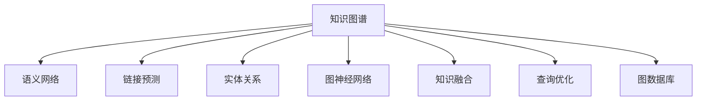

                 

# 知识图谱：构建和应用结构化知识

> 关键词：知识图谱, 语义网络, 链接预测, 实体关系, 图神经网络, 知识融合, 查询优化

## 1. 背景介绍

### 1.1 问题由来
在当今信息爆炸的时代，数据量呈指数级增长，而数据的质量和结构化程度却远远不足。人们正处于知识社会，海量数据中蕴含着大量的知识和智慧，但如何高效、准确地利用这些知识，成为一个重要且紧迫的问题。知识图谱(Knowledge Graph)作为知识工程领域的前沿技术，其构建和应用逐渐成为行业焦点。

知识图谱是一种结构化的知识表示方式，通过将实体和它们之间的关系链接起来，形成了一个网状的知识体系。它结合了关系数据库、本体论和语义网络等技术，能够很好地描述实体之间的复杂关系，并提供高效的知识查询、推理和应用。在医疗、金融、教育、互联网等诸多领域，知识图谱已展现出强大的应用价值。

### 1.2 问题核心关键点
构建和应用知识图谱的核心问题包括：
- 如何从非结构化数据中高效抽取实体和关系？
- 如何构建具有丰富语义的、可靠的实体关系链接？
- 如何高效地融合多源异构数据，形成统一的知识体系？
- 如何设计高效的知识查询与推理算法，实现知识检索和应用？
- 如何通过自动化的方式维护和更新知识图谱？

这些核心问题构成了知识图谱的构建与应用框架，使得知识图谱在数据密集型任务中发挥出巨大的价值。

## 2. 核心概念与联系

### 2.1 核心概念概述

为更好地理解知识图谱的构建与应用方法，本节将介绍几个密切相关的核心概念：

- 知识图谱(Knowledge Graph)：以节点和边为基本单元，通过关系描述实体之间关系的结构化数据体系。通过语义网络技术，知识图谱能够更好地表达知识间的关联性，为数据挖掘、推理等任务提供支持。

- 语义网络(Semantic Network)：一种图结构的知识表示方式，每个节点代表一个实体，每条边表示一个属性或关系。语义网络通过明确定义实体和关系，实现知识的高效存储和应用。

- 链接预测(Link Prediction)：知识图谱中的一个重要问题，通过已知实体和关系，预测新的实体关系是否存在。预测精度直接影响了知识图谱的完整性和准确性。

- 实体关系(Relation)：知识图谱中的核心元素，描述实体间的一对一、一对多或多对多的关系，如“学生”与“学校”之间的“在学校”关系。

- 图神经网络(Graph Neural Network, GNN)：一种专门用于处理图数据的神经网络模型，能够有效捕捉实体间的关系特征，用于知识推理和融合。

- 知识融合(Knowledge Fusion)：将来自不同数据源的知识进行整合，形成统一的、一致的知识图谱。知识融合需要解决数据冲突、缺失、冗余等问题。

- 查询优化(Query Optimization)：设计高效的知识查询算法，能够快速从知识图谱中检索和推理知识。优化目标是提高查询速度和准确性。

- 图数据库(Graph Database)：专门存储和处理图数据的数据库系统，提供高效的图存储和查询能力。

这些核心概念之间的逻辑关系可以通过以下Mermaid流程图来展示：



这个流程图展示了一个典型的知识图谱系统框架，其中实体和关系构成了基本的网络结构，而链接预测、图神经网络等技术则丰富了知识图谱的功能，知识融合和查询优化则保障了知识图谱的完整性和高效性。

## 3. 核心算法原理 & 具体操作步骤
### 3.1 算法原理概述

知识图谱的构建和应用过程涉及多个步骤，主要包括知识抽取、知识建模、知识融合、知识推理和知识查询。本文将重点介绍知识建模、知识融合和知识推理这三步的算法原理。

**知识建模(Knowledge Modeling)：** 知识建模的目的是将现实世界中的实体和关系映射为知识图谱中的节点和边。此过程涉及两个主要步骤：
1. 实体抽取(Entity Extraction)：从非结构化数据中提取实体，如姓名、地点、组织机构等。
2. 关系抽取(Relation Extraction)：从非结构化数据中提取实体之间的关系，如“中国”与“上海”之间的“首都”关系。

**知识融合(Knowledge Fusion)：** 知识融合是指将来自不同数据源的知识整合，形成统一的、一致的知识图谱。此过程涉及三个主要步骤：
1. 数据清洗(Data Cleaning)：消除数据中的噪声、错误和不一致性。
2. 数据对齐(Data Alignment)：将不同数据源中的实体和关系进行对齐，确保同一实体在不同数据源中具有相同的标识。
3. 数据合并(Data Integration)：将不同数据源中的知识合并成一个知识图谱。

**知识推理(Knowledge Reasoning)：** 知识推理是指从知识图谱中推理出新的知识，如预测缺失的实体关系。此过程涉及两个主要步骤：
1. 知识表示(Knowledge Representation)：通过图神经网络等模型，将实体和关系转换为图结构表示。
2. 推理算法(Rule-based Reasoning/AI-based Reasoning)：设计高效的推理算法，从知识图谱中推理出新的实体关系。

### 3.2 算法步骤详解

**知识建模步骤：**

1. **实体抽取(Entity Extraction)：** 通过自然语言处理(NLP)技术，从文本数据中抽取实体，如使用命名实体识别(NER)模型识别人名、地名、组织机构名等。
2. **关系抽取(Relation Extraction)：** 对抽取的实体对进行关系抽取，识别它们之间的语义关系。可以采用基于规则、统计模型或深度学习的方法进行关系抽取。

**知识融合步骤：**

1. **数据清洗(Data Cleaning)：** 对不同数据源的实体和关系进行清洗，如去除重复记录、纠正错误、消除不一致性等。
2. **数据对齐(Data Alignment)：** 对清洗后的数据进行对齐，如通过公共属性进行实体对齐，确保同一实体在不同数据源中具有相同的标识。
3. **数据合并(Data Integration)：** 将对齐后的数据合并，形成统一的知识图谱。可以采用基于图结构的整合方法，如GATE(Generalized Attribute Value Theory)、ONTONotes等。

**知识推理步骤：**

1. **知识表示(Knowledge Representation)：** 通过图神经网络(GNN)等模型，将实体和关系转换为图结构表示。可以采用GCN(Graph Convolutional Network)、GAT(Graph Attention Network)等模型。
2. **推理算法(Rule-based Reasoning/AI-based Reasoning)：** 设计推理算法，从知识图谱中推理出新的实体关系。可以采用基于规则的推理方法，如RDFS(RDF Schema)、OWL(Web Ontology Language)等；也可以采用基于AI的推理方法，如使用深度学习模型进行推理。

### 3.3 算法优缺点

知识图谱的构建和应用具有以下优点：
1. 提供结构化知识：通过图结构表示，知识图谱能够清晰地描述实体之间的关系，便于进行知识推理和应用。
2. 支持高效查询：通过图数据库等技术，知识图谱能够提供高效的查询和推理能力。
3. 提升决策质量：知识图谱中的知识具有语义信息，能够提供更准确、可靠的决策支持。
4. 促进知识创新：知识图谱能够帮助发现新的知识和关系，促进知识的创新和发现。

同时，知识图谱的构建和应用也存在一定的局限性：
1. 数据获取困难：构建知识图谱需要大量的高质量数据，数据的获取和标注成本较高。
2. 数据更新困难：知识图谱需要定期更新，以反映现实世界的变化，但更新过程复杂且耗时。
3. 知识泛化能力不足：知识图谱中的知识往往是静态的，缺乏动态更新的能力。
4. 推理复杂度高：知识图谱中的推理过程复杂，需要高效的推理算法和模型支持。
5. 应用场景受限：知识图谱的应用主要依赖于具体领域，适用范围较窄。

尽管存在这些局限性，但知识图谱作为一种高效的知识表示方式，在许多领域展现出巨大的应用潜力，值得进一步探索和优化。

### 3.4 算法应用领域

知识图谱已经广泛应用于多个领域，以下是一些典型的应用场景：

- **医疗领域：** 知识图谱可以帮助医生快速查询患者的病史、诊断结果等信息，辅助诊疗决策。此外，知识图谱还可以用于药物发现、疾病预测等任务。
- **金融领域：** 知识图谱可以用于金融机构的信用评估、风险管理、反欺诈等任务。通过知识图谱，金融机构能够更全面地了解客户的财务状况和行为，提升金融服务质量。
- **教育领域：** 知识图谱可以用于个性化推荐、智能辅导等教育应用。通过知识图谱，教育系统能够更精准地识别学生的学习行为和需求，提供个性化的学习建议。
- **电商领域：** 知识图谱可以用于商品推荐、市场分析等电商任务。通过知识图谱，电商平台能够更全面地了解消费者的需求和行为，提供更精准的商品推荐。
- **智能交通：** 知识图谱可以用于交通管理、智能导航等交通应用。通过知识图谱，交通系统能够更全面地了解交通状况和需求，提升交通管理的效率和智能化水平。

除了上述这些典型场景，知识图谱在更多领域显示出其独特的价值和应用潜力，如城市规划、社会治理、物流管理等。随着知识图谱技术的不断发展和优化，其在各行各业的应用将更加广泛和深入。

## 4. 数学模型和公式 & 详细讲解 & 举例说明

### 4.1 数学模型构建

知识图谱的数学模型主要包括以下几个部分：

- **节点表示(Node Representation)：** 每个节点表示一个实体，可以用向量的形式表示节点的属性和特征。
- **边表示(Edge Representation)：** 每条边表示一个关系，可以用向量的形式表示关系属性和特征。
- **图表示(Graph Representation)：** 整个知识图谱可以表示为一个图，节点和边构成图的结构。

以一个简单的知识图谱为例，设有一个包含人、公司和关系的图，节点包括人、公司和城市，边包括“工作于”、“创建于”等关系。可以表示为：

$$
G = (V, E)
$$

其中，$V$ 表示节点集合，$E$ 表示边集合。每个节点和边可以用向量形式表示，如：

$$
v_i = (x_{i1}, x_{i2}, ..., x_{im})
$$

$$
e_j = (y_{j1}, y_{j2}, ..., y_{jn})
$$

其中，$x_{ik}$ 表示节点$i$的第$k$个属性值，$y_{jk}$ 表示边$j$的第$k$个属性值。

### 4.2 公式推导过程

知识图谱的构建和应用涉及多个数学模型，以下以节点表示和图神经网络为例，推导相关数学公式。

**节点表示：**

假设有一个包含$m$个属性的节点，其属性值可以用$m$维向量$v$表示。在图神经网络中，节点表示可以通过多层的卷积操作更新，如下所示：

$$
v^{t+1} = \text{AGGREGATE}(v^t, \mathcal{N}(v^t))
$$

其中，$\text{AGGREGATE}$ 表示聚合函数，$\mathcal{N}(v^t)$ 表示节点$v^t$的邻居节点集合。

**图神经网络：**

图神经网络是一种专门用于处理图数据的神经网络模型，能够捕捉节点之间的关系特征。以GCN为例，其更新公式如下：

$$
h_i^{t+1} = \alpha(\mathbf{D}^{-\frac{1}{2}}\mathbf{A}\mathbf{h}^t)_i
$$

其中，$\mathbf{h}^t$ 表示节点$i$在第$t$层的表示向量，$\mathbf{A}$ 表示邻接矩阵，$\mathbf{D}$ 表示邻接矩阵的度数矩阵，$\alpha$ 表示可学习的线性变换参数。

### 4.3 案例分析与讲解

假设有一个包含人、公司和关系的知识图谱，其中包含“工作于”和“创建于”两个关系。可以构建如下的知识图谱：

$$
G = (V, E)
$$

其中，$V$ 包括人、公司和城市三个节点集合，$E$ 包括“工作于”和“创建于”两个边集合。可以表示为：

$$
V = \{ \text{Person}, \text{Company}, \text{City} \}
$$

$$
E = \{ \text{WorksAt}, \text{CreatedIn} \}
$$

设有一个包含“工作于”和“创建于”两个关系的知识图谱，其中包含“阿里巴巴”公司和“创始人”马化腾之间的“创建于”关系。可以表示为：

$$
G = (V, E)
$$

其中，$V = \{ \text{阿里巴巴}, \text{马化腾}, \text{杭州} \}$，$E = \{ \text{CreatedIn} \}$。

通过构建知识图谱，可以设计高效的查询和推理算法，如查询“阿里巴巴”公司的“工作于”关系，可以表示为：

$$
\text{WorksAt}(阿里巴巴, \text{杭州})
$$

## 5. 项目实践：代码实例和详细解释说明

### 5.1 开发环境搭建

在进行知识图谱实践前，我们需要准备好开发环境。以下是使用Python进行知识图谱开发的环境配置流程：

1. 安装Anaconda：从官网下载并安装Anaconda，用于创建独立的Python环境。

2. 创建并激活虚拟环境：
```bash
conda create -n knowledge-graph-env python=3.8 
conda activate knowledge-graph-env
```

3. 安装相关库：
```bash
pip install networkx py2neo pyowl pykggraph pytorch torchvision torchaudio cudatoolkit=11.1 -c pytorch -c conda-forge
```

4. 安装各类工具包：
```bash
pip install numpy pandas scikit-learn matplotlib tqdm jupyter notebook ipython
```

完成上述步骤后，即可在`knowledge-graph-env`环境中开始知识图谱实践。

### 5.2 源代码详细实现

这里我们以构建一个简单的知识图谱为例，给出一个使用NetworkX库进行知识图谱构建和查询的PyTorch代码实现。

```python
import networkx as nx
import pyowl
import pykggraph

# 创建知识图谱
G = nx.DiGraph()
G.add_node('阿里巴巴')
G.add_node('马化腾')
G.add_node('杭州')
G.add_edge('阿里巴巴', '马化腾', label='创始人')
G.add_edge('阿里巴巴', '杭州', label='创建于')

# 输出知识图谱信息
print(G.nodes(data=True))
print(G.edges(data=True))

# 查询“阿里巴巴”公司的“工作于”关系
# 使用pyowl和pykggraph进行查询
graph = pykggraph.kg_graph(G)
query = '阿里巴巴 工作于 杭州'
result = graph.query(query)
print(result)
```

在这个例子中，我们首先使用NetworkX库构建了一个简单的知识图谱，包含“阿里巴巴”公司、“马化腾”和“杭州”三个节点，以及“创始人”和“创建于”两个关系。然后，使用pyowl和pykggraph库进行查询，查询“阿里巴巴”公司的“工作于”关系，并输出结果。

### 5.3 代码解读与分析

让我们再详细解读一下关键代码的实现细节：

**知识图谱构建：**

1. 使用NetworkX库创建一个有向图G，添加节点和边，表示实体和关系。
2. 使用add_node和add_edge方法，添加节点和边，设置节点和边的标签属性。

**查询知识图谱：**

1. 使用pyowl和pykggraph库进行查询，首先创建一个知识图谱graph。
2. 设计查询语句query，表示需要查询的实体和关系。
3. 调用query方法，查询知识图谱中的信息，并输出结果。

可以看到，使用NetworkX库和相关库，知识图谱的构建和查询变得相对简单和高效。在实际应用中，知识图谱的构建和查询还需要进一步的优化和改进，以应对更大规模、更复杂的数据集。

## 6. 实际应用场景

### 6.1 医疗领域

知识图谱在医疗领域具有广泛的应用前景。医疗知识图谱可以帮助医生快速查询患者的病史、诊断结果等信息，辅助诊疗决策。

例如，医生可以通过查询知识图谱，快速获取患者的病史、治疗记录、药物反应等信息，辅助进行诊断和制定治疗方案。此外，知识图谱还可以用于药物发现、疾病预测等任务，通过查询和推理，预测新的药物和疾病关系，加速新药研发进程。

### 6.2 金融领域

在金融领域，知识图谱可以用于信用评估、风险管理、反欺诈等任务。通过知识图谱，金融机构能够更全面地了解客户的财务状况和行为，提升金融服务质量。

例如，金融机构可以通过查询知识图谱，获取客户的信用记录、资产情况、交易记录等信息，辅助进行信用评估和风险管理。此外，知识图谱还可以用于反欺诈任务，通过查询和推理，识别潜在的欺诈行为，提升金融机构的安全性。

### 6.3 电商领域

在电商领域，知识图谱可以用于商品推荐、市场分析等任务。通过知识图谱，电商平台能够更全面地了解消费者的需求和行为，提供更精准的商品推荐。

例如，电商平台可以通过查询知识图谱，获取用户的购买历史、浏览记录、评价等信息，推荐符合用户兴趣的商品。此外，知识图谱还可以用于市场分析，通过查询和推理，识别市场趋势和用户偏好，优化商品策略。

### 6.4 智能交通

在智能交通领域，知识图谱可以用于交通管理、智能导航等任务。通过知识图谱，交通系统能够更全面地了解交通状况和需求，提升交通管理的效率和智能化水平。

例如，交通系统可以通过查询知识图谱，获取道路交通状况、天气信息、事故信息等信息，辅助进行交通管理。此外，知识图谱还可以用于智能导航，通过查询和推理，生成最优的导航路径，提升用户的出行体验。

## 7. 工具和资源推荐

### 7.1 学习资源推荐

为了帮助开发者系统掌握知识图谱的构建与应用理论，这里推荐一些优质的学习资源：

1. 《知识图谱与语义搜索》书籍：详细介绍了知识图谱的基本概念和构建方法，涵盖实体抽取、关系抽取、知识融合等技术。

2. 《图数据库理论与实践》课程：介绍图数据库的基本原理和应用场景，讲解图查询和推理算法。

3. 《图神经网络入门》课程：介绍图神经网络的基本原理和应用场景，讲解图神经网络模型的设计与实现。

4. 《知识图谱构建与应用》课程：介绍知识图谱的构建与应用的详细流程，讲解知识图谱的构建与查询技术。

5. 《智能问答系统》课程：介绍智能问答系统构建的基本方法，讲解知识图谱在智能问答中的应用。

通过对这些资源的学习实践，相信你一定能够快速掌握知识图谱的构建与应用技能，并用于解决实际的业务问题。

### 7.2 开发工具推荐

高效的开发离不开优秀的工具支持。以下是几款用于知识图谱开发和应用的常用工具：

1. NetworkX：Python库，用于构建和处理图数据，支持复杂图结构的表示和查询。

2. PyTorch：基于Python的开源深度学习框架，支持图神经网络的实现。

3. PyOwl：Python库，用于构建和管理知识图谱，支持多种知识图谱格式和查询语言。

4. Pykggraph：Python库，用于构建和管理知识图谱，支持图数据库和图神经网络的应用。

5. Neo4j：商业图数据库，支持复杂图结构的存储和查询，提供高效的图处理能力。

6. Amazon Neptune：亚马逊图数据库，支持大规模图数据的存储和查询，提供分布式图处理能力。

7. VisualDlime：可视化工具，支持知识图谱的可视化展示，帮助开发者更好地理解和应用知识图谱。

合理利用这些工具，可以显著提升知识图谱的开发效率，加快创新迭代的步伐。

### 7.3 相关论文推荐

知识图谱的研究源于学界的持续研究。以下是几篇奠基性的相关论文，推荐阅读：

1. A Survey on Knowledge Graph Construction and Applications：综述性文章，详细介绍知识图谱的构建与应用方法，涵盖多个领域的实际应用。

2. Knowledge Graph Embeddings：介绍知识图谱嵌入技术，通过向量表示知识图谱中的实体和关系，实现高效的查询和推理。

3. Neural Architecture Search for Object Detection：介绍神经网络架构搜索技术，通过自动搜索最优网络结构，提高知识图谱推理的准确性。

4. Multimodal Knowledge Graph Embedding with Transductive Learning：介绍多模态知识图谱嵌入技术，将视觉、文本等不同模态的信息进行融合，提升知识图谱的表达能力。

5. Knowledge Graph Neural Networks：介绍知识图谱神经网络模型，通过神经网络捕捉知识图谱中的关系特征，实现高效的推理和融合。

这些论文代表的知识图谱领域的研究进展，帮助你掌握最新的知识图谱构建与应用方法。

## 8. 总结：未来发展趋势与挑战

### 8.1 总结

本文对知识图谱的构建与应用方法进行了全面系统的介绍。首先阐述了知识图谱在数据密集型任务中的重要应用，明确了知识图谱的构建与应用框架。其次，从原理到实践，详细讲解了知识图谱的数学模型、核心算法和操作步骤，给出了知识图谱开发实践的完整代码实例。同时，本文还广泛探讨了知识图谱在医疗、金融、电商等多个行业领域的应用前景，展示了知识图谱的巨大应用潜力。此外，本文精选了知识图谱相关的学习资源，力求为读者提供全方位的技术指引。

通过本文的系统梳理，可以看到，知识图谱作为一种高效的知识表示方式，在多个领域展现出巨大的应用价值。得益于图神经网络和深度学习等技术的不断进步，知识图谱的应用场景将更加广阔和深入，为各行各业带来更加精准和高效的知识服务。

### 8.2 未来发展趋势

展望未来，知识图谱技术将呈现以下几个发展趋势：

1. 图神经网络技术将持续发展。图神经网络作为知识图谱的核心技术，其准确性和效率将持续提升，进一步丰富知识图谱的功能和应用场景。

2. 知识图谱将进一步集成多模态数据。将视觉、语音、文本等不同模态的信息进行融合，提升知识图谱的表达能力和应用效果。

3. 知识图谱将变得更加动态化。通过引入时间序列信息，知识图谱能够更好地描述实体和关系的时序变化，适应动态化的知识场景。

4. 知识图谱的应用将更加广泛。随着知识图谱技术的不断发展和优化，其在更多领域展现出其独特的应用价值，如智能家居、智能制造等新兴领域。

5. 知识图谱的构建将更加自动化。通过自动化知识抽取、知识融合等技术，知识图谱的构建过程将更加高效和便捷。

6. 知识图谱的安全性和隐私保护将更加重视。通过引入隐私保护技术，知识图谱在应用过程中能够更好地保障数据安全和个人隐私。

以上趋势凸显了知识图谱技术的广泛应用前景，未来将有更多行业和领域受益于知识图谱技术的发展和应用。

### 8.3 面临的挑战

尽管知识图谱技术已经取得了瞩目成就，但在迈向更加智能化、普适化应用的过程中，它仍面临诸多挑战：

1. 数据获取困难。构建知识图谱需要大量的高质量数据，数据的获取和标注成本较高。如何高效获取和标注数据，是知识图谱构建的主要挑战。

2. 数据更新困难。知识图谱需要定期更新，以反映现实世界的变化，但更新过程复杂且耗时。如何高效更新知识图谱，是知识图谱维护的主要挑战。

3. 推理复杂度高。知识图谱中的推理过程复杂，需要高效的推理算法和模型支持。如何设计高效的推理算法，是知识图谱应用的主要挑战。

4. 应用场景受限。知识图谱的应用主要依赖于具体领域，适用范围较窄。如何拓展知识图谱的应用场景，是知识图谱应用的主要挑战。

5. 技术落地困难。知识图谱技术尽管先进，但在实际应用中面临诸多技术难题，如模型压缩、推理加速等。如何优化技术，提升知识图谱的实用性，是知识图谱技术落地应用的主要挑战。

尽管存在这些挑战，但随着知识图谱技术的不断发展和优化，其在各行各业的应用将更加广泛和深入。

### 8.4 研究展望

面向未来，知识图谱技术需要在以下几个方面寻求新的突破：

1. 探索无监督和半监督学习技术。摆脱对大规模标注数据的依赖，利用无监督和半监督学习技术，提高知识图谱构建的效率和效果。

2. 研究高效的知识融合方法。开发高效的跨模态融合技术，实现不同模态数据的统一表示和融合，提升知识图谱的表达能力。

3. 引入更多先验知识。将符号化的先验知识，如知识图谱、逻辑规则等，与神经网络模型进行融合，增强知识图谱的推理能力。

4. 引入因果分析技术。通过引入因果分析方法，增强知识图谱的推理能力和准确性，避免虚假推理和错误结果。

5. 引入博弈论和系统理论。将博弈论和系统理论引入知识图谱，增强知识图谱的稳定性和鲁棒性，避免知识图谱在实际应用中出现不稳定或错误。

6. 引入伦理道德约束。在知识图谱构建与应用过程中，引入伦理道德约束，确保知识图谱的应用符合社会规范和伦理道德。

这些研究方向将引领知识图谱技术的不断进步，为构建更加智能、可靠、可解释的知识图谱提供新的思路和方法。

## 9. 附录：常见问题与解答

**Q1：什么是知识图谱？**

A: 知识图谱是一种结构化的知识表示方式，通过将实体和它们之间的关系链接起来，形成了一个网状的知识体系。知识图谱能够清晰地描述实体之间的关系，提供高效的知识查询和推理能力，广泛应用于医疗、金融、教育、电商等领域。

**Q2：知识图谱的构建和应用需要哪些步骤？**

A: 知识图谱的构建和应用需要以下步骤：
1. 实体抽取：从非结构化数据中提取实体，如姓名、地名、组织机构等。
2. 关系抽取：从非结构化数据中提取实体之间的关系，如“中国”与“上海”之间的“首都”关系。
3. 数据清洗：对不同数据源的实体和关系进行清洗，如去除重复记录、纠正错误、消除不一致性等。
4. 数据对齐：对清洗后的数据进行对齐，如通过公共属性进行实体对齐，确保同一实体在不同数据源中具有相同的标识。
5. 数据合并：将对齐后的数据合并，形成统一的知识图谱。
6. 查询和推理：设计高效的查询和推理算法，从知识图谱中检索和推理知识。

**Q3：知识图谱的主要应用场景有哪些？**

A: 知识图谱在多个领域具有广泛的应用前景，以下是一些典型的应用场景：
1. 医疗领域：帮助医生快速查询患者的病史、诊断结果等信息，辅助诊疗决策。
2. 金融领域：用于信用评估、风险管理、反欺诈等任务。
3. 电商领域：用于商品推荐、市场分析等任务。
4. 智能交通：用于交通管理、智能导航等任务。

**Q4：知识图谱与传统数据库的区别是什么？**

A: 知识图谱与传统数据库的主要区别在于：
1. 数据表示方式：传统数据库采用关系型数据表示，而知识图谱采用图数据表示。
2. 查询方式：传统数据库采用SQL查询语言，而知识图谱采用图查询语言，如SPARQL。
3. 应用场景：传统数据库主要用于结构化数据的管理和查询，而知识图谱主要用于非结构化数据的建模和推理。

**Q5：知识图谱的构建和应用需要哪些工具和资源？**

A: 知识图谱的构建和应用需要以下工具和资源：
1. 数据收集和预处理工具，如Python的pandas、NLTK等。
2. 知识图谱构建和查询工具，如NetworkX、PyTorch等。
3. 图数据库系统，如Neo4j、Amazon Neptune等。
4. 知识图谱学习资源，如书籍、课程等。

合理利用这些工具和资源，可以显著提升知识图谱的开发效率，加快创新迭代的步伐。

---

作者：禅与计算机程序设计艺术 / Zen and the Art of Computer Programming

