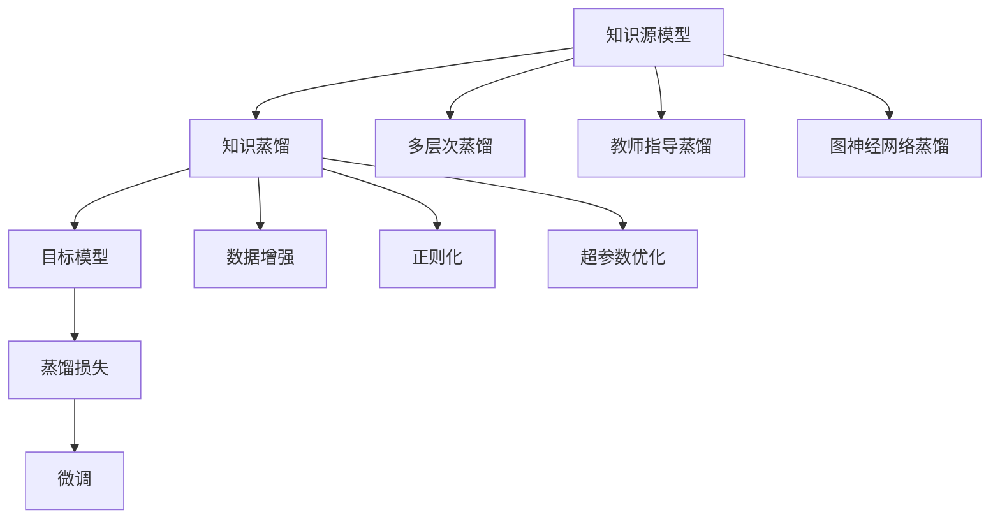

                 

# 知识蒸馏在自然语言处理任务中的应用

## 1. 背景介绍

### 1.1 问题由来

在自然语言处理（NLP）领域，大模型如BERT、GPT等在各种任务中取得了令人瞩目的成就。这些模型通过大规模无监督学习，在通用语言表示上建立了强大的知识基础。然而，大模型的计算资源消耗大，训练时间长，对于许多实际应用场景而言并不经济。同时，过大的模型可能会引入不必要的复杂性，影响推理速度和稳定性。因此，如何在大模型的基础上进行知识蒸馏，构建既高效又准确的小模型，成为NLP研究的重要课题。

### 1.2 问题核心关键点

知识蒸馏是一种将大型预训练模型的知识转移给小型模型的技术，以提高小模型的泛化能力和性能。在NLP任务中，知识蒸馏旨在通过多层次的模型融合、知识转移等方式，将大模型的知识提炼并应用到更小、更轻量的模型中，以适应不同的应用需求。

知识蒸馏在NLP中的核心关键点包括：

- 知识源：选择哪种预训练模型作为知识源，不同模型之间的知识差异如何？
- 知识蒸馏方法：如何从知识源模型中提取知识，并传递给目标模型？
- 目标模型：构建什么样的模型结构，以最优地接收和利用知识源的输出？
- 蒸馏效果：蒸馏后的目标模型在特定任务上的性能如何，与知识源模型相比有何提升？

### 1.3 问题研究意义

知识蒸馏技术可以显著降低模型计算资源的需求，加快模型训练和推理的速度，同时保持或提升模型性能。这对于NLP领域的应用推广具有重要意义：

- 加速模型落地：小模型可以更快速地部署到移动设备、嵌入式系统等资源受限的环境中。
- 提升模型性能：知识蒸馏可以在保证模型轻量化的同时，通过融合知识源模型的高层次知识，提高目标模型在特定任务上的表现。
- 降低计算成本：通过蒸馏技术，避免使用大规模预训练模型的开销，降低整体的计算成本。

## 2. 核心概念与联系

### 2.1 核心概念概述

为更好地理解知识蒸馏在NLP中的应用，本节将介绍几个密切相关的核心概念：

- **知识蒸馏**：从知识源模型中提取知识，并将其传递给目标模型，以提高目标模型的泛化能力和性能。

- **知识源模型**：通常是大型的预训练模型，如BERT、GPT等，拥有丰富的语言表示和知识。

- **目标模型**：通常是小型的模型，用于特定任务，如文本分类、命名实体识别等。

- **蒸馏损失**：知识蒸馏过程的核心，通过最小化蒸馏损失函数，将知识源模型的输出和目标模型的输出对齐。

- **蒸馏方法**：包括多层次蒸馏、教师指导蒸馏、图神经网络蒸馏等。

这些概念之间的逻辑关系可以通过以下Mermaid流程图来展示：



这个流程图展示的知识蒸馏核心概念及其之间的关系：

1. 知识源模型通过预训练获得知识。
2. 知识蒸馏过程将知识传递给目标模型。
3. 蒸馏损失函数指导知识源与目标模型的对齐。
4. 不同的蒸馏方法可以提高蒸馏效果。
5. 蒸馏过程可能伴随着数据增强、正则化、超参数优化等技术手段。
6. 微调可以用来进一步提升蒸馏后的模型性能。

## 3. 核心算法原理 & 具体操作步骤
### 3.1 算法原理概述

知识蒸馏的根本原理是通过教师指导学习，将知识源模型的预测能力转移给目标模型。具体而言，知识源模型作为"教师"，目标模型作为"学生"，通过最小化蒸馏损失函数，使得学生模型在特定任务上的输出尽量接近教师模型的预测。蒸馏损失函数通常由两个部分组成：

1. **预测一致性损失**：保证学生模型在输入样本上的预测概率分布与教师模型的预测概率分布一致。
2. **任务损失**：确保学生模型在特定任务上的性能提升。

形式化地，设知识源模型为 $M_{\text{teacher}}$，目标模型为 $M_{\text{student}}$，输入数据为 $x$，任务标签为 $y$。蒸馏过程的目标是最小化蒸馏损失函数 $\mathcal{L}_{\text{distill}}$：

$$
\mathcal{L}_{\text{distill}} = \mathcal{L}_{\text{KL}} + \mathcal{L}_{\text{task}}
$$

其中 $\mathcal{L}_{\text{KL}}$ 为KL散度损失，$\mathcal{L}_{\text{task}}$ 为目标任务的损失函数。

### 3.2 算法步骤详解

知识蒸馏的具体步骤包括：

**Step 1: 选择合适的知识源和目标模型**
- 知识源模型通常是大规模的预训练模型，如BERT、GPT等。
- 目标模型需要根据具体任务需求设计，如文本分类模型、序列标注模型等。

**Step 2: 数据准备**
- 收集任务相关的标注数据集，划分为训练集、验证集和测试集。
- 确保训练集和验证集的数据分布与知识源模型一致。

**Step 3: 设计蒸馏损失函数**
- 根据具体任务，设计蒸馏损失函数。对于分类任务，通常使用KL散度损失和交叉熵损失。
- 设计任务损失函数，如准确率、精确度、召回率等，评估目标模型在特定任务上的性能。

**Step 4: 训练目标模型**
- 使用知识源模型的预测作为教师信号，优化目标模型的参数。
- 对于大型知识源模型，可以只使用其顶层作为教师，减少计算资源消耗。

**Step 5: 评估和微调**
- 在验证集上评估目标模型的性能，根据评估结果调整蒸馏参数。
- 使用微调进一步提升目标模型的性能，特别是在小样本学习情况下。

### 3.3 算法优缺点

知识蒸馏方法具有以下优点：

1. 提升模型泛化能力：通过将知识源模型的知识传递给目标模型，可以显著提高目标模型在特定任务上的泛化能力。
2. 降低计算资源需求：小型目标模型通常比大型知识源模型更轻量，计算资源需求更低。
3. 加速模型训练：蒸馏过程减少了目标模型的训练时间，可以更快地部署到实际应用中。

同时，该方法也存在一些局限性：

1. 数据需求较大：蒸馏过程需要大量标注数据，特别是在多层次蒸馏中，数据量要求更高。
2. 性能波动：蒸馏后的目标模型性能可能受到知识源模型的质量和多样性的影响，需要进行多次实验优化。
3. 适应性有限：对于目标任务与知识源模型分布差异较大的情况，蒸馏效果可能不佳。
4. 对模型的结构要求高：目标模型的结构设计需要合理，才能有效地接收和利用知识源模型的输出。

### 3.4 算法应用领域

知识蒸馏方法在NLP领域得到了广泛应用，覆盖了各种任务，例如：

- 文本分类：如情感分析、主题分类等。知识蒸馏可以从大模型中提取对特定主题的预测能力。
- 命名实体识别：识别文本中的人名、地名、机构名等实体。蒸馏过程可以帮助目标模型学习如何更好地处理实体边界和类型。
- 关系抽取：从文本中抽取实体之间的语义关系。蒸馏过程可以传递大模型对实体关系的理解。
- 问答系统：对自然语言问题给出答案。蒸馏过程可以传递大模型对问题-答案对的理解。
- 机器翻译：将源语言文本翻译成目标语言。蒸馏过程可以传递大模型对语言映射的理解。
- 文本摘要：将长文本压缩成简短摘要。蒸馏过程可以传递大模型对摘要生成的理解。

除了上述这些经典任务外，知识蒸馏也被创新性地应用到更多场景中，如可控文本生成、常识推理、代码生成、数据增强等，为NLP技术带来了全新的突破。随着蒸馏方法的不断进步，相信NLP技术将在更广阔的应用领域大放异彩。

## 4. 数学模型和公式 & 详细讲解 & 举例说明

### 4.1 数学模型构建

本节将使用数学语言对知识蒸馏过程进行更加严格的刻画。

设知识源模型为 $M_{\text{teacher}}$，目标模型为 $M_{\text{student}}$，输入数据为 $x$，任务标签为 $y$。蒸馏过程的目标是最小化蒸馏损失函数 $\mathcal{L}_{\text{distill}}$，其中：

$$
\mathcal{L}_{\text{distill}} = \mathcal{L}_{\text{KL}} + \mathcal{L}_{\text{task}}
$$

对于分类任务，$\mathcal{L}_{\text{KL}}$ 为KL散度损失，$\mathcal{L}_{\text{task}}$ 为目标任务的损失函数，通常为交叉熵损失：

$$
\mathcal{L}_{\text{KL}} = \frac{1}{N} \sum_{i=1}^N \sum_{j=1}^K KL(p_j||q_j)
$$

$$
\mathcal{L}_{\text{task}} = \frac{1}{N} \sum_{i=1}^N -y_i \log p(y_i)
$$

其中 $p(y_i)$ 为目标模型在输入 $x_i$ 上的预测概率分布，$q_j$ 为知识源模型在输入 $x_i$ 上的预测概率分布。$K$ 为类别数，$N$ 为样本数。

### 4.2 公式推导过程

以下我们以二分类任务为例，推导知识蒸馏损失函数的计算公式。

设知识源模型为 $M_{\text{teacher}}$，目标模型为 $M_{\text{student}}$，输入为 $x$，标签为 $y$。蒸馏过程的目标是最小化蒸馏损失函数：

$$
\mathcal{L}_{\text{distill}} = \mathcal{L}_{\text{KL}} + \mathcal{L}_{\text{task}}
$$

对于分类任务，蒸馏损失函数可以表示为：

$$
\mathcal{L}_{\text{KL}} = \frac{1}{N} \sum_{i=1}^N \sum_{j=1}^K KL(p_j||q_j) = \frac{1}{N} \sum_{i=1}^N -y_i \log \hat{y}_i - (1-y_i) \log (1-\hat{y}_i)
$$

$$
\mathcal{L}_{\text{task}} = \frac{1}{N} \sum_{i=1}^N -y_i \log p(y_i)
$$

其中 $p(y_i) = \sigma(\hat{y}_i)$，$\hat{y}_i = M_{\text{student}}(x_i)$ 为目标模型在输入 $x_i$ 上的预测概率分布。$\sigma$ 为sigmoid函数。

### 4.3 案例分析与讲解

考虑一个简单的情感分析任务，目标模型为文本分类器，知识源模型为BERT模型。假设训练集中有 $N$ 个样本，每个样本有 $K=2$ 个类别（正向和负向）。

**Step 1: 数据准备**
- 收集标注数据集，划分为训练集、验证集和测试集。
- 确保训练集和验证集的数据分布与BERT模型一致。

**Step 2: 设计蒸馏损失函数**
- 使用交叉熵损失作为任务损失 $\mathcal{L}_{\text{task}}$。
- 使用KL散度损失作为预测一致性损失 $\mathcal{L}_{\text{KL}}$。

**Step 3: 训练目标模型**
- 使用BERT模型的预测作为教师信号，优化目标模型的参数。
- 目标模型可以采用简单的线性分类器，参数包括权重 $W$ 和偏置 $b$。

**Step 4: 评估和微调**
- 在验证集上评估目标模型的性能，根据评估结果调整蒸馏参数。
- 使用微调进一步提升目标模型的性能，特别是在小样本学习情况下。

例如，使用TensorFlow实现蒸馏过程的代码如下：

```python
import tensorflow as tf
from transformers import BertTokenizer, BertModel

# 初始化BERT模型和分词器
tokenizer = BertTokenizer.from_pretrained('bert-base-cased')
model = BertModel.from_pretrained('bert-base-cased')

# 定义蒸馏损失函数
def distill_loss(student_logits, teacher_logits):
    return tf.keras.losses.KLDivergence()(student_logits, teacher_logits)

# 定义目标模型
def build_student_model():
    input_ids = tf.keras.layers.Input(shape=(128,))
    token_type_ids = tf.keras.layers.Input(shape=(128,))
    attention_mask = tf.keras.layers.Input(shape=(128,))
    bert_layer = model(input_ids, token_type_ids=token_type_ids, attention_mask=attention_mask)
    output = tf.keras.layers.Dense(2, activation='softmax')(bert_layer)
    return tf.keras.Model(inputs=[input_ids, token_type_ids, attention_mask], outputs=output)

# 构建目标模型和教师模型
student_model = build_student_model()
teacher_model = model

# 定义蒸馏过程
@tf.function
def distill_train(student_model, teacher_model, inputs):
    with tf.GradientTape() as tape:
        student_logits = student_model(inputs)
        teacher_logits = teacher_model(inputs)
        loss = distill_loss(student_logits, teacher_logits)
    return loss

# 训练过程
inputs = ...  # 输入数据
epochs = 10
batch_size = 16

for epoch in range(epochs):
    for i in range(0, len(inputs), batch_size):
        batch = inputs[i:i+batch_size]
        with tf.GradientTape() as tape:
            loss = distill_train(student_model, teacher_model, batch)
        gradients = tape.gradient(loss, student_model.trainable_variables)
        optimizer.apply_gradients(zip(gradients, student_model.trainable_variables))

    print(f"Epoch {epoch+1}, loss: {loss:.4f}")
```

以上代码展示了如何使用TensorFlow实现蒸馏过程，通过蒸馏损失函数最小化学生模型和教师模型的输出差异，从而实现知识转移。

## 5. 项目实践：代码实例和详细解释说明
### 5.1 开发环境搭建

在进行知识蒸馏实践前，我们需要准备好开发环境。以下是使用Python进行TensorFlow开发的开发环境配置流程：

1. 安装Anaconda：从官网下载并安装Anaconda，用于创建独立的Python环境。

2. 创建并激活虚拟环境：
```bash
conda create -n tf-env python=3.8 
conda activate tf-env
```

3. 安装TensorFlow：根据CUDA版本，从官网获取对应的安装命令。例如：
```bash
conda install tensorflow==2.7 -c tf -c conda-forge
```

4. 安装TensorFlow Addons：用于扩展TensorFlow的功能，如注意力机制、优化器等。
```bash
conda install tensorflow-addons
```

5. 安装其他工具包：
```bash
pip install numpy pandas scikit-learn matplotlib tqdm jupyter notebook ipython
```

完成上述步骤后，即可在`tf-env`环境中开始知识蒸馏实践。

### 5.2 源代码详细实现

下面我们以情感分析任务为例，给出使用TensorFlow实现知识蒸馏的代码实现。

首先，定义情感分析任务的标注数据：

```python
from tensorflow.keras.preprocessing import sequence
from tensorflow.keras.datasets import imdb

max_features = 20000
max_len = 128

(x_train, y_train), (x_test, y_test) = imdb.load_data(num_words=max_features)
x_train = sequence.pad_sequences(x_train, maxlen=max_len)
x_test = sequence.pad_sequences(x_test, maxlen=max_len)
```

然后，定义知识源模型BERT：

```python
from transformers import BertTokenizer, BertModel

tokenizer = BertTokenizer.from_pretrained('bert-base-cased')
model = BertModel.from_pretrained('bert-base-cased')
```

接着，定义目标模型，可以是简单的线性分类器或更复杂的模型：

```python
from tensorflow.keras.layers import Dense
from tensorflow.keras.models import Sequential

model = Sequential([
    Dense(128, activation='relu', input_shape=(max_len,)),
    Dense(1, activation='sigmoid')
])
model.compile(optimizer='adam', loss='binary_crossentropy', metrics=['accuracy'])
```

然后，定义蒸馏损失函数：

```python
from tensorflow.keras.losses import KLDivergence

def distill_loss(student_logits, teacher_logits):
    return KLDivergence()(student_logits, teacher_logits)
```

最后，定义蒸馏过程：

```python
from tensorflow.keras import Model, Input

def build_student_model():
    input_ids = Input(shape=(max_len,))
    token_type_ids = Input(shape=(max_len,))
    attention_mask = Input(shape=(max_len,))
    bert_layer = model(input_ids, token_type_ids=token_type_ids, attention_mask=attention_mask)
    output = Dense(1, activation='sigmoid')(bert_layer)
    return Model(inputs=[input_ids, token_type_ids, attention_mask], outputs=output)

student_model = build_student_model()
teacher_model = model

@tf.function
def distill_train(student_model, teacher_model, inputs):
    with tf.GradientTape() as tape:
        student_logits = student_model(inputs)
        teacher_logits = teacher_model(inputs)
        loss = distill_loss(student_logits, teacher_logits)
    return loss

epochs = 10
batch_size = 16

inputs = (x_train, y_train, x_test, y_test)

for epoch in range(epochs):
    for i in range(0, len(inputs[0]), batch_size):
        batch = inputs[0][i:i+batch_size]
        labels = inputs[1][i:i+batch_size]
        targets = inputs[2][i:i+batch_size]
        with tf.GradientTape() as tape:
            loss = distill_train(student_model, teacher_model, batch)
        gradients = tape.gradient(loss, student_model.trainable_variables)
        optimizer.apply_gradients(zip(gradients, student_model.trainable_variables))

    print(f"Epoch {epoch+1}, loss: {loss:.4f}")
```

以上代码展示了如何使用TensorFlow实现情感分析任务的蒸馏过程。可以看到，通过蒸馏损失函数最小化学生模型和教师模型的输出差异，从而实现知识转移。

### 5.3 代码解读与分析

让我们再详细解读一下关键代码的实现细节：

**标注数据准备**：
- 使用IMDB数据集，将其转换为序列数据，并进行填充。

**知识源模型定义**：
- 使用预训练的BERT模型作为知识源。

**目标模型定义**：
- 使用简单的线性分类器作为目标模型，包含一个全连接层和sigmoid激活函数。

**蒸馏损失函数定义**：
- 使用KLDivergence作为蒸馏损失函数，计算学生模型和教师模型在二分类任务上的预测差异。

**蒸馏过程实现**：
- 定义学生模型和教师模型。
- 定义蒸馏损失函数，并在每个批次上进行计算和优化。
- 在每个epoch结束时打印损失值，评估模型性能。

可以看出，TensorFlow和TensorFlow Addons的使用极大简化了蒸馏过程的实现，使得开发者可以更加专注于模型的设计和调参。

## 6. 实际应用场景

### 6.1 智能客服系统

基于知识蒸馏的对话技术，可以广泛应用于智能客服系统的构建。传统客服往往需要配备大量人力，高峰期响应缓慢，且一致性和专业性难以保证。使用知识蒸馏的对话模型，可以7x24小时不间断服务，快速响应客户咨询，用自然流畅的语言解答各类常见问题。

在技术实现上，可以收集企业内部的历史客服对话记录，将问题和最佳答复构建成监督数据，在此基础上对BERT模型进行蒸馏。蒸馏后的对话模型能够自动理解用户意图，匹配最合适的答案模板进行回复。对于客户提出的新问题，还可以接入检索系统实时搜索相关内容，动态组织生成回答。如此构建的智能客服系统，能大幅提升客户咨询体验和问题解决效率。

### 6.2 金融舆情监测

金融机构需要实时监测市场舆论动向，以便及时应对负面信息传播，规避金融风险。传统的人工监测方式成本高、效率低，难以应对网络时代海量信息爆发的挑战。基于知识蒸馏的文本分类和情感分析技术，为金融舆情监测提供了新的解决方案。

具体而言，可以收集金融领域相关的新闻、报道、评论等文本数据，并对其进行主题标注和情感标注。在此基础上对BERT模型进行蒸馏，使其能够自动判断文本属于何种主题，情感倾向是正面、中性还是负面。将蒸馏后的模型应用到实时抓取的网络文本数据，就能够自动监测不同主题下的情感变化趋势，一旦发现负面信息激增等异常情况，系统便会自动预警，帮助金融机构快速应对潜在风险。

### 6.3 个性化推荐系统

当前的推荐系统往往只依赖用户的历史行为数据进行物品推荐，无法深入理解用户的真实兴趣偏好。基于知识蒸馏的个性化推荐系统可以更好地挖掘用户行为背后的语义信息，从而提供更精准、多样的推荐内容。

在实践中，可以收集用户浏览、点击、评论、分享等行为数据，提取和用户交互的物品标题、描述、标签等文本内容。将文本内容作为模型输入，用户的后续行为（如是否点击、购买等）作为监督信号，在此基础上蒸馏BERT模型。蒸馏后的模型能够从文本内容中准确把握用户的兴趣点。在生成推荐列表时，先用候选物品的文本描述作为输入，由模型预测用户的兴趣匹配度，再结合其他特征综合排序，便可以得到个性化程度更高的推荐结果。

### 6.4 未来应用展望

随着知识蒸馏方法的发展，其在NLP领域的应用前景更加广阔：

1. 知识蒸馏可以将预训练模型的知识高效传递给目标模型，提高模型泛化能力和性能。
2. 知识蒸馏可以在保持模型轻量化的同时，提升模型在特定任务上的表现，加速模型落地。
3. 知识蒸馏可以灵活应用于多种任务，如文本分类、命名实体识别、关系抽取等，适应不同应用需求。
4. 知识蒸馏可以与其他技术进行结合，如多模态融合、自监督学习等，构建更全面的模型。
5. 知识蒸馏可以用于实时数据处理，通过动态蒸馏，适应数据分布变化，提高模型适应性。

## 7. 工具和资源推荐
### 7.1 学习资源推荐

为了帮助开发者系统掌握知识蒸馏的理论基础和实践技巧，这里推荐一些优质的学习资源：

1. **《深度学习中的知识蒸馏》**：一本系统介绍知识蒸馏原理和实践方法的书籍，涵盖了知识蒸馏的基本概念、方法和应用案例。

2. **《Transformer from Principle to Practice》**：一篇详细讲解Transformer架构及其在知识蒸馏中应用的博客，提供了丰富的代码和实验结果。

3. **CS231n《Convolutional Neural Networks for Visual Recognition》**：斯坦福大学开设的计算机视觉课程，介绍了多层次知识蒸馏方法。

4. **《Deep Learning for NLP》**：一本介绍深度学习在NLP中应用的书籍，涵盖知识蒸馏等多个前沿话题。

5. **HuggingFace官方文档**：提供了大量预训练模型和知识蒸馏样例代码，是学习知识蒸馏的重要参考。

通过这些资源的学习实践，相信你一定能够快速掌握知识蒸馏的精髓，并用于解决实际的NLP问题。

### 7.2 开发工具推荐

高效的开发离不开优秀的工具支持。以下是几款用于知识蒸馏开发的常用工具：

1. **TensorFlow**：基于Python的开源深度学习框架，灵活动态的计算图，适合快速迭代研究。

2. **PyTorch**：另一个流行的深度学习框架，提供了丰富的深度学习模型库和优化器。

3. **TensorFlow Addons**：用于扩展TensorFlow的功能，如注意力机制、优化器等。

4. **JAX**：Google开发的张量计算库，支持JIT编译、自动微分等先进特性，提高了知识蒸馏的计算效率。

5. **TensorBoard**：TensorFlow配套的可视化工具，可实时监测模型训练状态，并提供丰富的图表呈现方式。

6. **Weights & Biases**：模型训练的实验跟踪工具，可以记录和可视化模型训练过程中的各项指标，方便对比和调优。

合理利用这些工具，可以显著提升知识蒸馏任务的开发效率，加快创新迭代的步伐。

### 7.3 相关论文推荐

知识蒸馏技术在NLP领域的发展源于学界的持续研究。以下是几篇奠基性的相关论文，推荐阅读：

1. **Distilling the Knowledge in a Neural Network**：提出知识蒸馏的概念和方法，是知识蒸馏领域的开创性工作。

2. **A Distillation Framework for Deep Neural Networks**：提出多层次蒸馏方法，进一步提升了知识蒸馏的效果。

3. **Knowledge Distillation: A Survey**：综述了知识蒸馏领域的最新研究成果，提供了全面的知识蒸馏方法总结。

4. **Leveraging Deep Structured Representations in NLP**：提出使用知识蒸馏提高NLP模型性能的方法，并应用于多个NLP任务。

5. **Neural Architecture Search with Knowledge Distillation**：提出使用知识蒸馏优化神经网络架构搜索，提高了模型设计效率和性能。

这些论文代表了大语言模型知识蒸馏技术的发展脉络。通过学习这些前沿成果，可以帮助研究者把握学科前进方向，激发更多的创新灵感。

## 8. 总结：未来发展趋势与挑战

### 8.1 总结

本文对知识蒸馏在NLP任务中的应用进行了全面系统的介绍。首先阐述了知识蒸馏的技术背景和研究意义，明确了其在提升模型性能、降低计算资源需求方面的独特价值。其次，从原理到实践，详细讲解了知识蒸馏的数学原理和关键步骤，给出了知识蒸馏任务开发的完整代码实例。同时，本文还广泛探讨了知识蒸馏方法在智能客服、金融舆情、个性化推荐等多个领域的应用前景，展示了知识蒸馏范式的巨大潜力。此外，本文精选了知识蒸馏技术的各类学习资源，力求为读者提供全方位的技术指引。

通过本文的系统梳理，可以看到，知识蒸馏技术在大模型微调中的重要性，通过多层次的知识传递，有效利用大模型的语言表示，提升小模型的泛化能力和性能。知识蒸馏可以在保持模型轻量化的同时，提高模型在特定任务上的表现，加速模型落地。未来，随着知识蒸馏方法的不断进步，知识蒸馏技术将在NLP领域得到更广泛的应用，为NLP技术的产业化进程注入新的动力。

### 8.2 未来发展趋势

展望未来，知识蒸馏技术将呈现以下几个发展趋势：

1. **参数高效蒸馏**：未来的知识蒸馏方法将更加注重参数效率，只调整少量参数，以提升蒸馏效率和模型性能。

2. **动态蒸馏**：知识蒸馏过程将更加灵活，通过动态蒸馏，实时调整模型参数，适应数据分布变化。

3. **多模态蒸馏**：知识蒸馏将拓展到多模态数据，融合视觉、语音等多模态信息，构建更全面的模型。

4. **自监督蒸馏**：知识蒸馏将更多地利用自监督学习，从未标注数据中学习知识，提升模型泛化能力。

5. **知识图谱蒸馏**：知识蒸馏将结合知识图谱，引入先验知识，提升模型的推理能力。

6. **混合蒸馏**：知识蒸馏将结合多种蒸馏方法，如多层次蒸馏、教师指导蒸馏、图神经网络蒸馏等，提升蒸馏效果。

这些趋势凸显了知识蒸馏技术的广阔前景。这些方向的探索发展，必将进一步提升NLP系统的性能和应用范围，为构建人机协同的智能系统铺平道路。

### 8.3 面临的挑战

尽管知识蒸馏技术已经取得了瞩目成就，但在迈向更加智能化、普适化应用的过程中，它仍面临着诸多挑战：

1. **计算资源需求**：知识蒸馏需要大量的计算资源，特别是在多层次蒸馏中，数据量要求更高。如何降低蒸馏过程中的计算成本，提高资源利用率，是需要解决的关键问题。

2. **知识转移质量**：知识蒸馏的效果依赖于知识源模型的质量和多样性，如何选择合适的知识源模型，并设计有效的蒸馏策略，是知识蒸馏成功的关键。

3. **模型适应性**：对于目标任务与知识源模型分布差异较大的情况，蒸馏效果可能不佳。如何提高模型的适应性，使其能够更好地处理新任务和新数据，是知识蒸馏的重要研究方向。

4. **模型复杂度**：蒸馏过程可能会增加模型的复杂度，如何平衡模型性能和复杂度，保持模型轻量化，是需要解决的问题。

5. **模型可解释性**：蒸馏后的模型通常具有较高的复杂度，难以解释其内部工作机制和决策逻辑。如何赋予模型更强的可解释性，使其输出更加透明，是知识蒸馏技术面临的挑战。

6. **模型伦理安全性**：知识蒸馏可能会引入知识源模型中的有害信息，如何确保模型的伦理安全性和输出正确性，是知识蒸馏技术需要考虑的重要问题。

正视知识蒸馏面临的这些挑战，积极应对并寻求突破，将知识蒸馏技术推向新的高度。相信随着学界和产业界的共同努力，这些挑战终将一一被克服，知识蒸馏技术必将在构建安全、可靠、可解释、可控的智能系统中扮演越来越重要的角色。

### 8.4 研究展望

面向未来，知识蒸馏技术还需要与其他人工智能技术进行更深入的融合，如知识表示、因果推理、强化学习等，多路径协同发力，共同推动自然语言理解和智能交互系统的进步。只有勇于创新、敢于突破，才能不断拓展知识蒸馏技术的边界，让智能技术更好地造福人类社会。

## 9. 附录：常见问题与解答

**Q1: 知识蒸馏可以应用于所有NLP任务吗？**

A: 知识蒸馏可以应用于大多数NLP任务，特别是那些数据量较小、模型性能要求较高的任务。但对于一些特定领域的任务，如医学、法律等，单一的知识源模型可能无法满足需求，此时需要结合多个知识源进行蒸馏。

**Q2: 如何选择知识源模型？**

A: 知识源模型的选择需要根据具体任务和数据集特点来决定。一般选择经过大规模预训练、性能优越的模型，如BERT、GPT等。对于多领域任务，可以结合多个知识源进行混合蒸馏。

**Q3: 知识蒸馏过程是否需要大量标注数据？**

A: 知识蒸馏过程需要大量标注数据，特别是在多层次蒸馏中，数据量要求更高。但对于小规模数据集，可以考虑使用数据增强等技术，提升数据多样性。

**Q4: 知识蒸馏的蒸馏效果如何评估？**

A: 知识蒸馏效果的评估可以从多个角度进行，如模型精度、泛化能力、计算效率等。一般使用交叉验证、性能指标（如准确率、召回率、F1值等）来评估蒸馏效果。

**Q5: 知识蒸馏是否适用于大规模模型？**

A: 知识蒸馏适用于大规模模型，特别是在多层次蒸馏中，可以有效地利用大规模模型的知识，提升小模型性能。但需要注意计算资源的消耗和模型的复杂度。

通过以上问答，可以看出知识蒸馏技术在大语言模型微调中的重要性和应用前景。随着知识蒸馏方法的不断进步，相信NLP技术将在更广阔的应用领域大放异彩，深刻影响人类的生产生活方式。

