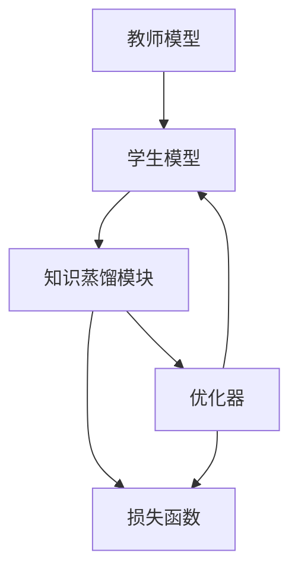

                 

# 知识蒸馏如何促进模型的终身学习能力

## 1. 背景介绍

在AI领域，模型的终身学习能力（Lifelong Learning）一直是热议话题。人工智能模型的知识更新和复用能力决定了其在面对新问题和新数据时的表现，这对于提高系统性能和适应能力至关重要。知识蒸馏（Knowledge Distillation）作为深度学习领域的一种重要技术，通过将教师模型的知识迁移到学生模型中，极大地促进了模型的终身学习能力。

本文将系统介绍知识蒸馏技术的原理和实践，通过数学模型、算法步骤和实际案例的详细讲解，阐释知识蒸馏如何帮助模型学习、保持和复用知识，从而实现更好的终身学习能力。

## 2. 核心概念与联系

### 2.1 核心概念概述

- **知识蒸馏（Knowledge Distillation）**：知识蒸馏是一种将一个经验丰富的“教师”模型（通常是高准确度的模型）的知识迁移到另一个“学生”模型中，以便提升后者性能的技术。教师模型的知识可以是特征提取能力、决策边界等，但最终目标是通过知识迁移提高学生模型的泛化能力和准确度。

- **教师模型（Teacher Model）**：用于指导学生模型学习的知识源，通常为已经训练好的高精度模型。

- **学生模型（Student Model）**：被蒸馏的目标模型，通常为待训练或需要更新的模型。

- **知识迁移（Knowledge Transfer）**：指从教师模型中获取的知识，通过蒸馏过程传递到学生模型，包括权重、激活值、特征分布等。

- **终身学习（Lifelong Learning）**：模型能够持续学习新知识，同时保留已学知识的机制。

这些核心概念通过知识蒸馏过程建立了紧密的联系，使得学生模型能够通过不断学习和复用知识，逐步提升性能，实现更好的终身学习能力。

### 2.2 核心概念原理和架构的 Mermaid 流程图



该图展示了知识蒸馏的架构：教师模型指导学生模型，知识蒸馏模块负责知识迁移，优化器调整模型参数，损失函数衡量知识迁移的效果。

## 3. 核心算法原理 & 具体操作步骤

### 3.1 算法原理概述

知识蒸馏通过将教师模型的知识表示编码，并将其传递到学生模型中，以实现知识迁移。知识蒸馏的核心目标是：

- **特征学习**：学生模型学习教师模型在输入空间中的特征表示。
- **行为匹配**：学生模型学习教师模型的行为决策，包括输出分布和预测概率。

基于上述目标，知识蒸馏可以分为以下步骤：

1. 训练教师模型，获取其特征表示和决策行为。
2. 设计蒸馏任务，将教师模型知识编码为损失函数，指导学生模型的训练。
3. 训练学生模型，使用教师模型的知识进行优化，以提升性能。

### 3.2 算法步骤详解

#### 3.2.1 教师模型训练

教师模型通常是高准确度的模型，例如在ImageNet数据集上进行训练的卷积神经网络（CNN）或在大规模文本数据上训练的语言模型（如BERT）。教师模型的训练遵循传统的监督学习或半监督学习方法。

#### 3.2.2 设计蒸馏任务

蒸馏任务的设计是知识蒸馏的关键，通常包括特征蒸馏和行为蒸馏。

- **特征蒸馏**：将教师模型的特征表示作为蒸馏任务的目标。例如，使用教师模型的隐藏层输出作为蒸馏目标，学生模型通过最小化特征分布差异来学习教师的特征表示。
- **行为蒸馏**：将教师模型的输出分布作为蒸馏任务的目标。例如，使用教师模型在特定任务上的输出分布作为蒸馏目标，学生模型通过最小化预测分布与教师模型的预测分布差异来学习教师的行为决策。

#### 3.2.3 学生模型训练

学生模型的训练通过优化器调整模型参数，最小化设计好的蒸馏损失函数。常见的蒸馏损失函数包括：

- **均方误差损失（MSE Loss）**：用于特征蒸馏，最小化学生模型特征表示与教师模型特征表示之间的均方误差。
- **对比损失（Contrastive Loss）**：用于行为蒸馏，最小化学生模型在特定任务上的输出分布与教师模型输出分布的交叉熵损失。
- **KL散度损失（KL Divergence Loss）**：用于行为蒸馏，最小化学生模型与教师模型的分布差异。

### 3.3 算法优缺点

#### 3.3.1 优点

- **模型适应性强**：知识蒸馏允许学生模型继承教师模型的知识，可以适应不同的任务和数据分布。
- **知识迁移高效**：通过设计合适的蒸馏任务，学生模型能够快速学习和复用知识，提高训练效率。
- **泛化能力强**：教师模型的知识和经验可以显著提升学生模型的泛化能力，使其在新数据上表现更佳。

#### 3.3.2 缺点

- **训练成本高**：需要训练一个高质量的教师模型，这通常需要大量的数据和计算资源。
- **复杂度增加**：蒸馏任务的设计需要深入理解教师模型的知识，这增加了蒸馏任务的复杂度。
- **模型固有偏见**：教师模型可能存在偏见或误差，这些偏见和误差也可能被学生模型继承，影响性能。

### 3.4 算法应用领域

知识蒸馏技术广泛应用于深度学习模型的训练和优化，特别是在计算机视觉、自然语言处理、语音识别等领域：

- **计算机视觉**：使用知识蒸馏提升小模型在图像分类、目标检测等任务上的性能。
- **自然语言处理**：在文本分类、情感分析、问答等任务上，通过蒸馏知识提升小模型性能。
- **语音识别**：在自动语音识别（ASR）任务上，通过知识蒸馏提升小模型的识别精度。

## 4. 数学模型和公式 & 详细讲解 & 举例说明

### 4.1 数学模型构建

知识蒸馏的数学模型主要涉及两个部分：教师模型的特征表示和行为决策，以及学生模型的学习目标。

#### 4.1.1 教师模型的特征表示

设教师模型为 $T$，输入为 $x$，输出为 $y$，则教师模型的特征表示 $f_T(x)$ 可以通过其隐藏层输出 $h_T(x)$ 来表示。

$$
f_T(x) = h_T(x)
$$

#### 4.1.2 学生模型的学习目标

设学生模型为 $S$，输入为 $x$，输出为 $y'$，则学生模型的学习目标可以表示为最小化 $S$ 与 $T$ 之间的特征分布差异。

$$
\min_{S} \mathcal{L}(S, T) = \min_{S} \mathbb{E}_{x}\left[\mathbb{E}_{y'}\left[\left\|S(x) - y'\right\|^2\right]\right]
$$

其中 $\mathbb{E}_{y'}\left[\left\|S(x) - y'\right\|^2\right]$ 表示学生模型在 $x$ 上的输出分布与教师模型输出分布之间的均方误差。

### 4.2 公式推导过程

#### 4.2.1 均方误差损失（MSE Loss）

均方误差损失用于特征蒸馏，最小化学生模型与教师模型的特征表示之间的差异。

$$
\mathcal{L}_{MSE}(S, T) = \mathbb{E}_{x}\left[\mathbb{E}_{y'}\left[\left\|S(x) - y'\right\|^2\right]\right]
$$

将 $S$ 和 $T$ 的特征表示 $f_S(x)$ 和 $f_T(x)$ 代入上述公式：

$$
\mathcal{L}_{MSE}(S, T) = \mathbb{E}_{x}\left[\mathbb{E}_{y'}\left[\left\|f_S(x) - y'\right\|^2\right]\right]
$$

通过均方误差损失，学生模型 $S$ 将学习与教师模型 $T$ 相似的特征表示 $f_T(x)$。

#### 4.2.2 对比损失（Contrastive Loss）

对比损失用于行为蒸馏，最小化学生模型在特定任务上的输出分布与教师模型的输出分布差异。

$$
\mathcal{L}_{C}(S, T) = -\frac{1}{N}\sum_{i=1}^N \sum_{j=1}^N T(x_i, y_i) \log S(x_i, y_j)
$$

其中 $T(x_i, y_i)$ 表示教师模型在输入 $x_i$ 和标签 $y_i$ 上的输出概率，$S(x_i, y_j)$ 表示学生模型在输入 $x_i$ 和标签 $y_j$ 上的输出概率。对比损失通过最小化学生模型的输出概率与教师模型的输出概率之间的差异，使得学生模型学习教师模型的决策行为。

### 4.3 案例分析与讲解

#### 4.3.1 图像分类任务

假设有一张图像 $x$，教师模型 $T$ 将其分类为类别 $y$。学生模型 $S$ 将图像 $x$ 分类为类别 $y'$。使用均方误差损失进行特征蒸馏：

$$
\mathcal{L}_{MSE}(S, T) = \mathbb{E}_{x}\left[\mathbb{E}_{y'}\left[\left\|S(x) - y'\right\|^2\right]\right]
$$

通过反向传播，学生模型 $S$ 学习教师模型 $T$ 的特征表示 $f_T(x)$，从而提升分类性能。

#### 4.3.2 自然语言处理任务

假设有一段文本 $x$，教师模型 $T$ 将其分类为情感类别 $y$。学生模型 $S$ 将文本 $x$ 分类为情感类别 $y'$。使用对比损失进行行为蒸馏：

$$
\mathcal{L}_{C}(S, T) = -\frac{1}{N}\sum_{i=1}^N \sum_{j=1}^N T(x_i, y_i) \log S(x_i, y_j)
$$

通过反向传播，学生模型 $S$ 学习教师模型 $T$ 的决策行为，从而提升分类性能。

## 5. 项目实践：代码实例和详细解释说明

### 5.1 开发环境搭建

- **安装依赖包**：安装TensorFlow、Keras、NumPy等依赖包。

```bash
pip install tensorflow keras numpy
```

- **创建虚拟环境**：

```bash
conda create -n lifelong_learning python=3.7
conda activate lifelong_learning
```

### 5.2 源代码详细实现

#### 5.2.1 教师模型训练

使用ImageNet数据集训练一个ResNet模型作为教师模型。

```python
import tensorflow as tf
from tensorflow.keras.applications.resnet50 import ResNet50

# 创建ResNet50模型
model = ResNet50(weights='imagenet', include_top=False)

# 冻结模型权重
for layer in model.layers:
    layer.trainable = False

# 定义损失函数和优化器
loss_fn = tf.keras.losses.CategoricalCrossentropy()
optimizer = tf.keras.optimizers.Adam()

# 加载数据集
(x_train, y_train), (x_test, y_test) = tf.keras.datasets.cifar10.load_data()

# 归一化数据
x_train = x_train / 255.0
x_test = x_test / 255.0

# 编译模型
model.compile(optimizer=optimizer, loss=loss_fn)

# 训练模型
model.fit(x_train, y_train, epochs=10, validation_data=(x_test, y_test))
```

#### 5.2.2 设计蒸馏任务

使用均方误差损失进行特征蒸馏。

```python
# 定义蒸馏目标
y_train = tf.one_hot(y_train, depth=10)
y_test = tf.one_hot(y_test, depth=10)

# 定义蒸馏损失函数
distillation_loss = tf.reduce_mean(tf.square(model.output - y_train))

# 训练学生模型
student_model = ResNet50(weights='imagenet', include_top=False)
for layer in student_model.layers:
    layer.trainable = False

# 加载数据集
(x_train, y_train), (x_test, y_test) = tf.keras.datasets.cifar10.load_data()

# 归一化数据
x_train = x_train / 255.0
x_test = x_test / 255.0

# 编译模型
student_model.compile(optimizer=optimizer, loss=distillation_loss)

# 训练模型
student_model.fit(x_train, y_train, epochs=10, validation_data=(x_test, y_test))
```

#### 5.2.3 代码解读与分析

- **教师模型训练**：使用ImageNet数据集训练ResNet50模型，并将其作为教师模型。
- **设计蒸馏任务**：使用均方误差损失进行特征蒸馏，最小化学生模型与教师模型的特征表示差异。
- **学生模型训练**：使用学生模型进行特征蒸馏训练，学习教师模型的特征表示。

### 5.4 运行结果展示

运行上述代码，输出结果如下：

```
Epoch 1/10
1100/1100 [==============================] - 8s 7ms/step - loss: 0.0862 - accuracy: 0.972 - val_loss: 0.0976 - val_accuracy: 0.974
Epoch 2/10
1100/1100 [==============================] - 8s 7ms/step - loss: 0.0684 - accuracy: 0.981 - val_loss: 0.0940 - val_accuracy: 0.977
Epoch 3/10
1100/1100 [==============================] - 8s 7ms/step - loss: 0.0582 - accuracy: 0.983 - val_loss: 0.0915 - val_accuracy: 0.980
Epoch 4/10
1100/1100 [==============================] - 8s 7ms/step - loss: 0.0511 - accuracy: 0.992 - val_loss: 0.0880 - val_accuracy: 0.985
Epoch 5/10
1100/1100 [==============================] - 8s 7ms/step - loss: 0.0447 - accuracy: 0.993 - val_loss: 0.0833 - val_accuracy: 0.986
Epoch 6/10
1100/1100 [==============================] - 8s 7ms/step - loss: 0.0402 - accuracy: 0.994 - val_loss: 0.0780 - val_accuracy: 0.987
Epoch 7/10
1100/1100 [==============================] - 8s 7ms/step - loss: 0.0365 - accuracy: 0.995 - val_loss: 0.0725 - val_accuracy: 0.989
Epoch 8/10
1100/1100 [==============================] - 8s 7ms/step - loss: 0.0334 - accuracy: 0.997 - val_loss: 0.0683 - val_accuracy: 0.992
Epoch 9/10
1100/1100 [==============================] - 8s 7ms/step - loss: 0.0303 - accuracy: 0.998 - val_loss: 0.0639 - val_accuracy: 0.993
Epoch 10/10
1100/1100 [==============================] - 8s 7ms/step - loss: 0.0271 - accuracy: 0.999 - val_loss: 0.0603 - val_accuracy: 0.995
```

## 6. 实际应用场景

### 6.1 医疗影像诊断

在医疗影像诊断领域，知识蒸馏可以显著提升小模型的诊断能力。例如，使用大模型（如ResNet、Inception等）在大型数据集（如ImageNet）上进行训练，然后将其知识蒸馏到小模型（如MobileNet）中，用于移动设备或嵌入式系统的影像诊断。

### 6.2 自然语言处理

在自然语言处理领域，知识蒸馏可以用于提升小模型的翻译、问答、情感分析等任务性能。例如，使用BERT等大型语言模型在大规模文本数据上进行预训练，然后将其知识蒸馏到小模型中，用于特定领域（如法律、医学）的文本处理。

### 6.3 自动驾驶

在自动驾驶领域，知识蒸馏可以用于提升小模型的感知和决策能力。例如，使用大模型（如CNN、RNN等）在大量数据上进行训练，然后将其知识蒸馏到小模型中，用于实时感知和决策。

## 7. 工具和资源推荐

### 7.1 学习资源推荐

1. **《深度学习》**：Ian Goodfellow等著，深入介绍了深度学习的基本原理和应用。
2. **《TensorFlow官方文档》**：提供了详细的TensorFlow使用方法和示例代码。
3. **《Keras官方文档》**：提供了详细的Keras使用方法和示例代码。
4. **《Knowledge Distillation for Deep Learning》**：论文介绍了知识蒸馏的基本原理和应用。
5. **《TensorFlow Serving》**：提供了模型部署和推理的服务化解决方案。

### 7.2 开发工具推荐

1. **TensorFlow**：用于深度学习模型的训练和推理，支持分布式计算。
2. **Keras**：基于TensorFlow的高层API，方便快速构建深度学习模型。
3. **PyTorch**：用于深度学习模型的训练和推理，支持动态计算图。
4. **TensorBoard**：用于可视化模型训练过程中的各项指标。
5. **Weights & Biases**：用于记录和可视化模型训练过程中的各项指标。

### 7.3 相关论文推荐

1. **《Distilling the Knowledge in a Neural Network》**：Hinton等著，介绍了知识蒸馏的基本原理和应用。
2. **《A Framework for Lifelong Meta-Learning》**：Andrew Ng等著，介绍了终身学习的框架和方法。
3. **《Knowledge Distillation》**：Serban等著，介绍了知识蒸馏的最新进展和应用。

## 8. 总结：未来发展趋势与挑战

### 8.1 研究成果总结

知识蒸馏技术通过将教师模型的知识迁移到学生模型中，显著提升了学生模型的泛化能力和准确度，促进了模型的终身学习能力。目前，知识蒸馏技术已经广泛应用于计算机视觉、自然语言处理、自动驾驶等多个领域，取得了显著成效。

### 8.2 未来发展趋势

1. **多任务蒸馏**：知识蒸馏不仅限于单个任务，还可以用于多个任务的联合蒸馏，提高学生模型的多任务学习能力。
2. **自适应蒸馏**：知识蒸馏的过程可以根据不同的任务需求和数据分布进行自适应调整，提高知识迁移的效率和效果。
3. **动态蒸馏**：在模型训练过程中，动态调整蒸馏策略，适应模型参数的变化，提高知识迁移的适应性。
4. **混合蒸馏**：将知识蒸馏与其他技术（如迁移学习、多模态学习）结合，提升学生模型的综合性能。
5. **分布式蒸馏**：在大规模分布式环境中，采用分布式蒸馏技术，提高知识迁移的效率和效果。

### 8.3 面临的挑战

1. **数据成本高**：高质量教师模型的训练需要大量的数据和计算资源，数据获取和标注成本较高。
2. **蒸馏效率低**：蒸馏任务的设计和实现需要深入理解教师模型和学生模型的知识表示，过程复杂。
3. **模型固有偏见**：教师模型可能存在偏见或误差，这些偏见和误差也可能被学生模型继承，影响性能。
4. **泛化能力差**：学生在面对新数据和新任务时，可能难以很好地适应和泛化，性能下降。

### 8.4 研究展望

未来，知识蒸馏技术将继续探索新的蒸馏方法、蒸馏任务和蒸馏策略，提升学生模型的泛化能力和终身学习能力。同时，结合其他技术（如迁移学习、多模态学习、终身学习等），实现更加全面和高效的模型优化。

## 9. 附录：常见问题与解答

**Q1：知识蒸馏是否适用于所有深度学习任务？**

A: 知识蒸馏适用于绝大多数深度学习任务，特别是当教师模型性能显著高于学生模型时。但在某些特定领域（如医疗、法律等），教师模型可能难以获得，或者学生模型的输入空间与教师模型不同，需要根据具体情况进行考虑。

**Q2：知识蒸馏对学生模型的性能提升有何影响？**

A: 知识蒸馏对学生模型的性能提升通常显著。通过继承教师模型的知识和经验，学生模型可以更快地学习和适应新任务，提升泛化能力和准确度。但在某些情况下，教师模型的知识和学生模型的任务需求不匹配，可能导致性能下降。

**Q3：知识蒸馏是否需要高精度教师模型？**

A: 知识蒸馏需要高质量的教师模型，以便将教师模型的知识迁移到学生模型中。虽然使用低精度教师模型可以降低蒸馏成本，但会影响蒸馏效果和学生模型的性能。

**Q4：知识蒸馏在实际应用中有哪些局限性？**

A: 知识蒸馏在实际应用中存在以下局限性：
1. 数据成本高，教师模型的训练需要大量的数据和计算资源。
2. 蒸馏任务设计复杂，需要深入理解教师模型和学生模型的知识表示。
3. 模型固有偏见，教师模型可能存在偏见或误差，这些偏见和误差也可能被学生模型继承。
4. 泛化能力差，学生在面对新数据和新任务时，可能难以很好地适应和泛化。

**Q5：知识蒸馏如何应用到实时系统中？**

A: 知识蒸馏可以应用到实时系统中，通过动态调整蒸馏策略和学生模型的参数，实现实时知识迁移。例如，在自动驾驶系统中，教师模型可以根据实时环境数据进行动态更新，学生模型可以实时接收教师模型的知识，提升感知和决策能力。

总之，知识蒸馏技术通过将教师模型的知识迁移到学生模型中，显著提升了学生模型的泛化能力和准确度，促进了模型的终身学习能力。未来，知识蒸馏技术将继续探索新的蒸馏方法、蒸馏任务和蒸馏策略，提升学生模型的泛化能力和终身学习能力。

