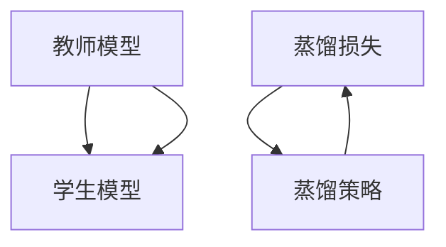

                 

## 1. 背景介绍

### 1.1 问题由来

随着人工智能技术的快速发展，深度学习模型在各种应用场景中取得了显著成果，如自然语言处理、计算机视觉、语音识别等。然而，深度学习模型的"黑盒"特性，使得人们难以理解其内部工作机制和决策过程，尤其在医疗、金融等领域，这种"黑盒"特性可能带来严重的安全隐患和伦理问题。如何提升模型的可解释性，成为深度学习领域的研究热点。

知识蒸馏(Knowledge Distillation, KD)技术应运而生。知识蒸馏通过将大型复杂模型（教师模型）的知识转移到小型简单模型（学生模型），使得后者不仅在性能上接近前者，还能在可解释性上胜出。通过知识蒸馏，我们可以在不显著牺牲模型性能的前提下，获得更透明、更可解释的模型，从而提升人工智能技术的可信度和应用范围。

### 1.2 问题核心关键点

知识蒸馏的核心思想是利用教师模型对学生模型进行指导，使得学生模型能够学习到教师模型的知识。其关键在于如何设计有效的知识传递机制，以及如何保持学生模型和教师模型之间的一致性。具体而言，知识蒸馏可以分为以下步骤：

1. **选择教师模型**：通常使用在特定任务上表现较好的预训练模型或微调模型作为教师模型。
2. **构建学生模型**：基于学生模型构建相对简单、参数量较小的模型。
3. **设计知识蒸馏过程**：通过对比教师模型和学生模型的输出，设计有效的知识蒸馏损失函数，指导学生模型学习教师模型的知识。
4. **优化学生模型**：通过梯度下降等优化算法，最小化知识蒸馏损失函数，更新学生模型的参数。
5. **评估与迭代**：通过验证集评估学生模型的性能，根据评估结果调整知识蒸馏策略，进行迭代优化。

### 1.3 问题研究意义

提升深度学习模型的可解释性，对于构建可信的AI系统、推动AI技术的普及和应用具有重要意义：

1. **提升决策透明度**：可解释的模型能够直观展示其决策依据和推理过程，提高决策透明度，降低误判风险。
2. **增强用户信任**：通过解释模型行为，使用户更加信任和接受AI决策，扩大AI技术的应用场景。
3. **促进算法公平性**：可解释的模型有助于揭示和消除模型中的偏见和歧视，提升算法公平性。
4. **支持模型诊断和调试**：模型可解释性有助于快速定位和修复模型问题，提高模型的稳定性和鲁棒性。
5. **推动AI技术的规范化应用**：在医疗、金融、司法等领域，可解释性是模型应用的基础条件，提升模型可解释性有利于规范AI技术的广泛应用。

## 2. 核心概念与联系

### 2.1 核心概念概述

为更好地理解知识蒸馏技术，本节将介绍几个关键概念及其内在联系：

- **教师模型(Teacher Model)**：指在特定任务上表现较好的预训练模型或微调模型，是知识蒸馏的基础。
- **学生模型(Student Model)**：指相对简单、参数量较小的模型，通过知识蒸馏获得教师模型的知识。
- **知识蒸馏(Knowledge Distillation)**：通过教师模型指导学生模型，使其学习教师模型的知识，同时保持性能和可解释性。
- **蒸馏损失(Distillation Loss)**：指导学生模型学习教师模型的知识，衡量学生模型和教师模型之间的差异，是知识蒸馏的核心组件。
- **蒸馏策略(Distillation Strategy)**：如何选择教师模型、构建学生模型、设计蒸馏损失函数，是知识蒸馏的关键策略。

这些概念之间的逻辑关系可以通过以下Mermaid流程图来展示：



这个流程图展示的知识蒸馏的核心概念及其之间的关系：

1. 教师模型通过蒸馏策略对学生模型进行指导。
2. 蒸馏损失函数衡量学生模型和教师模型之间的差异，指导学生模型学习知识。
3. 蒸馏策略的设计决定了知识蒸馏的效果和效率。

## 3. 核心算法原理 & 具体操作步骤

### 3.1 算法原理概述

知识蒸馏本质上是一种迁移学习方法，通过将教师模型的知识迁移到学生模型，使得学生模型能够在保持高性能的同时，获得更好的可解释性。其核心思想是：

1. 在特定任务上，教师模型通过预训练或微调获得了丰富的知识。
2. 学生模型通过蒸馏损失函数，逐步学习教师模型的知识。
3. 学生模型在保持和教师模型一致性的同时，保留一定的个性化，以适应特定任务的需求。

知识蒸馏的核心在于如何设计有效的蒸馏损失函数，使得学生模型能够最大化地吸收教师模型的知识。常见的蒸馏损失函数包括：

- **知识蒸馏损失(Knowledge Distillation Loss)**：将教师模型和学生模型在同一输入下的输出进行比较，使用交叉熵等损失函数，衡量两者之间的差异。
- **行为蒸馏(Behavior Distillation)**：通过对比教师模型和学生模型在不同输入下的行为，设计损失函数。
- **过程蒸馏(Process Distillation)**：通过对比教师模型和学生模型在推理过程中的中间特征，设计损失函数。

### 3.2 算法步骤详解

知识蒸馏的具体操作步骤包括以下几个关键步骤：

**Step 1: 准备教师模型和学生模型**
- 选择适当的教师模型和学生模型。教师模型通常为预训练模型或微调模型，如BERT、GPT等；学生模型为结构简单、参数量较小的模型，如MobileNet、EfficientNet等。
- 加载教师模型和学生模型的权重，设置必要的超参数，如学习率、批量大小等。

**Step 2: 设计蒸馏损失函数**
- 设计知识蒸馏损失函数，衡量教师模型和学生模型在同一输入下的输出差异。常见的蒸馏损失函数包括交叉熵损失、均方误差损失、KL散度损失等。
- 设计行为蒸馏或过程蒸馏损失函数，衡量教师模型和学生模型在推理过程中的行为或中间特征差异。

**Step 3: 训练学生模型**
- 将学生模型输入教师模型，计算蒸馏损失，更新学生模型的参数。
- 通过梯度下降等优化算法，最小化蒸馏损失，优化学生模型。
- 周期性在验证集上评估学生模型的性能，根据评估结果调整蒸馏策略。

**Step 4: 评估与迭代**
- 在测试集上评估蒸馏后的学生模型，对比蒸馏前后的性能和可解释性。
- 根据评估结果，调整蒸馏策略，如更改蒸馏损失函数、调整学生模型结构、增加蒸馏迭代轮数等，进行迭代优化。

### 3.3 算法优缺点

知识蒸馏方法具有以下优点：
1. 简单易用。知识蒸馏方法通过蒸馏损失函数，使得学生模型能够逐步学习教师模型的知识，不需要大量标注数据。
2. 可解释性强。学生模型通过蒸馏损失函数学习教师模型的知识，保留了教师模型的部分解释能力。
3. 适用于多种任务。知识蒸馏方法可以应用于图像分类、语音识别、自然语言处理等多种任务。
4. 泛化能力强。学生模型通过蒸馏损失函数学习教师模型的知识，保留了教师模型的泛化能力，适用于新样本的推理。

同时，知识蒸馏方法也存在一些缺点：
1. 性能损失。知识蒸馏过程中，教师模型和学生模型之间的差异会引入一定的性能损失。
2. 模型复杂度。学生模型需要保留一定的结构复杂度，以适应特定任务的需求，增加了模型的复杂度。
3. 蒸馏策略设计难度。如何设计有效的蒸馏策略，使得学生模型能够最大化地吸收教师模型的知识，是知识蒸馏的关键。

尽管存在这些局限性，但知识蒸馏方法仍是大规模迁移学习的重要手段，广泛应用于各种任务，推动了深度学习技术的发展。

### 3.4 算法应用领域

知识蒸馏方法在深度学习领域已经得到了广泛的应用，主要应用于以下领域：

1. **图像分类**：如MobileNet、ShuffleNet等轻量化模型通过蒸馏ResNet等大型复杂模型，获得了较高的准确率和较低的计算复杂度。
2. **语音识别**：通过蒸馏DeepSpeech等预训练模型，获得了准确率较高的声学模型。
3. **自然语言处理**：如使用蒸馏BERT模型，获得了准确率较高的语言模型，用于文本分类、情感分析等任务。
4. **推荐系统**：通过蒸馏协同过滤模型，获得了准确率较高的推荐模型，用于商品推荐、新闻推荐等任务。
5. **医学诊断**：通过蒸馏放射学图像分类模型，获得了准确率较高的医学影像分析模型。

除了这些领域，知识蒸馏方法还在智能家居、智能交通、智能制造等领域得到了广泛应用，提升了各种系统对数据和场景的适应能力。

## 4. 数学模型和公式 & 详细讲解

### 4.1 数学模型构建

在知识蒸馏中，教师模型和学生模型之间的蒸馏损失函数是关键。假设教师模型为 $M_T$，学生模型为 $M_S$，输入为 $x$，输出为 $y$。蒸馏损失函数 $L_D$ 可以表示为：

$$
L_D(y_T, y_S) = -\alpha \sum_{i=1}^n \mathbb{E}_{(x,y) \sim D} [\log M_S(x)] + \beta \sum_{i=1}^n \mathbb{E}_{(x,y) \sim D} [\log M_T(x)]
$$

其中，$n$ 为输入 $x$ 的维度，$\alpha$ 和 $\beta$ 为超参数，分别表示知识蒸馏和蒸馏数据的权重。

在实践中，蒸馏损失函数一般可以通过交叉熵损失函数进行计算：

$$
L_D(y_T, y_S) = -\alpha \frac{1}{N} \sum_{i=1}^N H(y_T, y_S)
$$

其中，$H$ 为交叉熵损失函数，$N$ 为样本数。

### 4.2 公式推导过程

以知识蒸馏损失函数为例，其推导过程如下：

1. **知识蒸馏目标**：学生模型 $M_S$ 应该学习教师模型 $M_T$ 的预测能力。因此，学生模型 $M_S$ 在输入 $x$ 上的输出应该与教师模型 $M_T$ 的输出相似。
2. **交叉熵损失**：定义交叉熵损失函数 $H(y_T, y_S)$，衡量教师模型 $M_T$ 和学生模型 $M_S$ 在同一输入下的输出差异。
3. **蒸馏损失**：通过组合知识蒸馏损失和蒸馏数据损失，构建蒸馏损失函数 $L_D$。

**行为蒸馏**和**过程蒸馏**的损失函数推导与知识蒸馏类似，都是通过对比教师模型和学生模型在推理过程中的行为或中间特征，设计损失函数。

### 4.3 案例分析与讲解

以图像分类任务为例，分析知识蒸馏的实际应用。假设教师模型为ResNet，学生模型为MobileNet。具体步骤如下：

1. **数据准备**：收集ImageNet数据集，划分为训练集、验证集和测试集。
2. **模型构建**：加载ResNet模型和MobileNet模型，设置相应的超参数。
3. **蒸馏损失函数设计**：设计知识蒸馏损失函数，衡量ResNet模型和MobileNet模型在同一输入下的输出差异。
4. **训练MobileNet模型**：将MobileNet模型输入ResNet模型，计算蒸馏损失，更新MobileNet模型的参数。
5. **评估与迭代**：在测试集上评估蒸馏后的MobileNet模型，根据评估结果调整蒸馏策略，进行迭代优化。

通过知识蒸馏，MobileNet模型不仅保留了ResNet模型的分类能力，还实现了较低的计算复杂度，提升了系统的推理速度和效率。

## 5. 项目实践：代码实例和详细解释说明

### 5.1 开发环境搭建

在进行知识蒸馏实践前，我们需要准备好开发环境。以下是使用Python进行PyTorch开发的环境配置流程：

1. 安装Anaconda：从官网下载并安装Anaconda，用于创建独立的Python环境。

2. 创建并激活虚拟环境：
```bash
conda create -n pytorch-env python=3.8 
conda activate pytorch-env
```

3. 安装PyTorch：根据CUDA版本，从官网获取对应的安装命令。例如：
```bash
conda install pytorch torchvision torchaudio cudatoolkit=11.1 -c pytorch -c conda-forge
```

4. 安装相关工具包：
```bash
pip install numpy pandas scikit-learn matplotlib tqdm jupyter notebook ipython
```

完成上述步骤后，即可在`pytorch-env`环境中开始知识蒸馏实践。

### 5.2 源代码详细实现

这里我们以图像分类任务为例，给出使用PyTorch对ResNet模型进行知识蒸馏的代码实现。

首先，定义蒸馏损失函数：

```python
import torch
import torch.nn as nn
import torch.nn.functional as F

class DistillationLoss(nn.Module):
    def __init__(self, alpha=0.7):
        super(DistillationLoss, self).__init__()
        self.alpha = alpha

    def forward(self, y_t, y_s):
        return -self.alpha * torch.mean(torch.sum(torch.softmax(y_t, dim=1) * torch.log(torch.softmax(y_s, dim=1)), dim=1))
```

然后，定义教师模型和学生模型：

```python
import torchvision.models as models

# 加载预训练ResNet模型
teacher_model = models.resnet18(pretrained=True)

# 加载MobileNet模型
student_model = models.mobilenet_v2(pretrained=True)
```

接着，定义蒸馏损失函数：

```python
# 定义蒸馏损失函数
distillation_loss = DistillationLoss(alpha=0.7)
```

最后，进行知识蒸馏训练：

```python
# 设置优化器
optimizer = torch.optim.SGD(student_model.parameters(), lr=0.001)

# 设置迭代轮数
epochs = 10

# 蒸馏训练过程
for epoch in range(epochs):
    # 训练MobileNet模型
    for batch_idx, (inputs, targets) in enumerate(train_loader):
        inputs, targets = inputs.to(device), targets.to(device)
        
        # 教师模型预测
        teacher_outputs = teacher_model(inputs)
        # 学生模型预测
        student_outputs = student_model(inputs)
        
        # 计算蒸馏损失
        loss = distillation_loss(teacher_outputs, student_outputs)
        
        # 反向传播
        optimizer.zero_grad()
        loss.backward()
        optimizer.step()
        
    # 在验证集上评估模型性能
    val_loss = validate(student_model, val_loader)
    print(f'Epoch {epoch+1}, validation loss: {val_loss:.3f}')
```

以上就是使用PyTorch对ResNet模型进行知识蒸馏的完整代码实现。可以看到，通过简单的蒸馏损失函数设计和梯度下降优化，学生模型MobileNet就能逐步学习教师模型ResNet的知识，提升了分类能力。

### 5.3 代码解读与分析

让我们再详细解读一下关键代码的实现细节：

**DistillationLoss类**：
- `__init__`方法：初始化蒸馏损失函数，设置蒸馏比例 $\alpha$。
- `forward`方法：计算蒸馏损失，返回损失值。

**MobileNet和ResNet模型**：
- `pretrained=True`参数：表示加载预训练模型，快速提升模型性能。
- `to(device)`方法：将模型参数移动到GPU或TPU等计算设备，提高计算效率。

**训练流程**：
- `train_loader`：训练集数据加载器。
- `val_loader`：验证集数据加载器。
- `optimizer`：优化器，用于更新学生模型的参数。
- `epochs`：迭代轮数。
- 在每个epoch内，对数据进行批量迭代，前向传播计算教师模型和学生模型的输出，计算蒸馏损失，反向传播更新学生模型的参数。
- 周期性在验证集上评估模型性能，根据评估结果调整蒸馏策略。

**验证集评估**：
- `validate`函数：在验证集上评估模型性能，计算损失值。
- `print`方法：打印当前epoch的验证损失值。

通过上述代码，我们可以看到，知识蒸馏方法通过简单的蒸馏损失函数设计和梯度下降优化，使得学生模型逐步学习教师模型的知识，提升了分类能力。在实际应用中，开发者可以根据具体任务，灵活调整蒸馏比例、蒸馏损失函数、优化器等参数，实现最优的知识蒸馏效果。

## 6. 实际应用场景

### 6.1 智能诊断系统

在医疗领域，知识蒸馏可以用于构建智能诊断系统，提升诊断的准确性和可解释性。传统的医疗诊断依赖于经验丰富的医生，耗时长、成本高。通过知识蒸馏，将医生的诊疗知识迁移到模型中，使得系统能够快速、准确地诊断疾病。

具体而言，可以收集大量医学影像和诊断报告，构建标注数据集。选择表现较好的预训练模型，如ResNet，作为教师模型，选择轻量化的学生模型，如MobileNet，作为诊断系统。通过知识蒸馏，使得学生模型能够学习医生的诊断知识，提升诊断的准确性和可解释性。

### 6.2 智能客服系统

在智能客服领域，知识蒸馏可以用于构建智能问答系统，提升客户服务体验。传统的客服系统依赖于人工客服，服务质量不稳定、响应速度慢。通过知识蒸馏，将人工客服的知识迁移到模型中，使得系统能够快速、准确地回答客户问题。

具体而言，可以收集大量客户问题和回复，构建标注数据集。选择表现较好的预训练模型，如BERT，作为教师模型，选择轻量化的学生模型，如MobileNet，作为问答系统。通过知识蒸馏，使得学生模型能够学习人工客服的知识，提升回答的准确性和可解释性。

### 6.3 推荐系统

在推荐系统领域，知识蒸馏可以用于构建个性化推荐系统，提升推荐的效果和可解释性。传统的推荐系统依赖于用户行为数据，推荐效果有限。通过知识蒸馏，将用户的偏好信息迁移到模型中，使得系统能够快速、准确地推荐商品。

具体而言，可以收集用户的行为数据，构建标注数据集。选择表现较好的预训练模型，如DeepFM，作为教师模型，选择轻量化的学生模型，如MobileNet，作为推荐系统。通过知识蒸馏，使得学生模型能够学习用户的偏好信息，提升推荐的准确性和可解释性。

### 6.4 未来应用展望

知识蒸馏作为一种高效的迁移学习方法，将在更多领域得到广泛应用，为AI技术的发展注入新的活力：

1. **医疗诊断**：通过知识蒸馏，构建智能诊断系统，提升诊断的准确性和可解释性。
2. **智能客服**：通过知识蒸馏，构建智能问答系统，提升客户服务体验。
3. **推荐系统**：通过知识蒸馏，构建个性化推荐系统，提升推荐的准确性和可解释性。
4. **智能制造**：通过知识蒸馏，构建智能预测系统，提升生产效率和质量。
5. **智能交通**：通过知识蒸馏，构建智能调度系统，提升交通管理效率。
6. **智能家居**：通过知识蒸馏，构建智能控制系统，提升用户体验。

## 7. 工具和资源推荐

### 7.1 学习资源推荐

为了帮助开发者系统掌握知识蒸馏的理论基础和实践技巧，这里推荐一些优质的学习资源：

1. **《知识蒸馏：从原理到应用》系列博文**：由大模型技术专家撰写，深入浅出地介绍了知识蒸馏原理、算法、应用等前沿话题。

2. **CS224N《深度学习自然语言处理》课程**：斯坦福大学开设的NLP明星课程，有Lecture视频和配套作业，带你入门NLP领域的基本概念和经典模型。

3. **《深度学习与知识蒸馏》书籍**：详细介绍了知识蒸馏的原理、算法和应用，适合深度学习初学者和进阶者。

4. **Distill Blog**：知识蒸馏社区，涵盖大量知识蒸馏相关的博客文章、开源代码和应用案例，是学习知识蒸馏的重要资源。

5. **Transformers库官方文档**：Transformers库的官方文档，提供了海量预训练模型和完整的知识蒸馏样例代码，是上手实践的必备资料。

通过对这些资源的学习实践，相信你一定能够快速掌握知识蒸馏的精髓，并用于解决实际的AI问题。

### 7.2 开发工具推荐

高效的开发离不开优秀的工具支持。以下是几款用于知识蒸馏开发的常用工具：

1. **PyTorch**：基于Python的开源深度学习框架，灵活动态的计算图，适合快速迭代研究。
2. **TensorFlow**：由Google主导开发的开源深度学习框架，生产部署方便，适合大规模工程应用。
3. **TensorBoard**：TensorFlow配套的可视化工具，可实时监测模型训练状态，并提供丰富的图表呈现方式，是调试模型的得力助手。
4. **Weights & Biases**：模型训练的实验跟踪工具，可以记录和可视化模型训练过程中的各项指标，方便对比和调优。
5. **Jupyter Notebook**：Python的交互式开发环境，方便进行实验调试和代码共享。
6. **GitHub**：代码托管平台，方便版本控制和团队协作。

合理利用这些工具，可以显著提升知识蒸馏的开发效率，加快创新迭代的步伐。

### 7.3 相关论文推荐

知识蒸馏技术的发展源于学界的持续研究。以下是几篇奠基性的相关论文，推荐阅读：

1. **Distillation Loss Function**：Hinton等人提出知识蒸馏损失函数，通过交叉熵损失衡量教师模型和学生模型在同一输入下的输出差异。

2. **Networks of Experts**：Hinton等人提出网络专家模型，通过知识蒸馏将多个小模型组合成一个大模型，提升模型的准确性和鲁棒性。

3. **Knowledge Distillation in Deep Architectures**：Hinton等人深入分析了知识蒸馏在深度网络中的效果，提出了一系列改进方法。

4. **Fine-tune Networks with Continuous Learning**：Bucila等人提出连续学习模型，通过知识蒸馏和微调，使得学生模型能够在保持性能的同时，快速适应新数据。

5. **Distillation Recurrent Neural Networks**：Nangia等人提出知识蒸馏循环神经网络，通过蒸馏多层循环网络，提升模型的记忆能力和推理能力。

这些论文代表了大规模知识蒸馏技术的发展脉络。通过学习这些前沿成果，可以帮助研究者把握学科前进方向，激发更多的创新灵感。

## 8. 总结：未来发展趋势与挑战

### 8.1 总结

本文对知识蒸馏技术进行了全面系统的介绍。首先阐述了知识蒸馏技术的背景和意义，明确了知识蒸馏在提升模型可解释性方面的独特价值。其次，从原理到实践，详细讲解了知识蒸馏的数学原理和关键步骤，给出了知识蒸馏任务开发的完整代码实例。同时，本文还广泛探讨了知识蒸馏方法在智能诊断、智能客服、推荐系统等多个领域的应用前景，展示了知识蒸馏技术的巨大潜力。此外，本文精选了知识蒸馏技术的各类学习资源，力求为读者提供全方位的技术指引。

通过本文的系统梳理，可以看到，知识蒸馏技术通过将大型复杂模型（教师模型）的知识迁移到小型简单模型（学生模型），使得后者不仅在性能上接近前者，还能在可解释性上胜出。这种高效的迁移学习方法，正在被广泛应用于各种AI系统，推动AI技术的普及和应用。未来，随着知识蒸馏技术的发展，相信人工智能系统将具备更强大的可解释性，为构建安全、可靠、可控的智能系统铺平道路。

### 8.2 未来发展趋势

展望未来，知识蒸馏技术将呈现以下几个发展趋势：

1. **深度融合**：知识蒸馏与其他AI技术，如增强学习、逻辑推理、知识图谱等深度融合，提升系统的智能水平和可解释性。
2. **多任务学习**：通过知识蒸馏实现多任务学习，提升模型的泛化能力和实用性。
3. **实时蒸馏**：将知识蒸馏过程嵌入到模型训练和推理过程中，实现实时知识迁移和更新。
4. **弱监督学习**：利用知识蒸馏实现弱监督学习，降低对大量标注数据的依赖。
5. **跨领域迁移**：通过知识蒸馏实现跨领域迁移学习，提升模型对新领域的适应能力。
6. **模型压缩**：利用知识蒸馏进行模型压缩，减少计算复杂度，提升推理速度和效率。

这些趋势凸显了知识蒸馏技术的广阔前景。这些方向的探索发展，必将进一步提升知识蒸馏技术的智能化水平，推动人工智能系统迈向更加透明、可靠、可控的未来。

### 8.3 面临的挑战

尽管知识蒸馏技术已经取得了显著成果，但在迈向更加智能化、普适化应用的过程中，它仍面临诸多挑战：

1. **性能损失**：知识蒸馏过程中，教师模型和学生模型之间的差异会引入一定的性能损失。如何最大化地减小这种损失，提升学生模型的性能，是知识蒸馏的关键问题。
2. **蒸馏策略设计**：如何设计有效的蒸馏策略，使得学生模型能够最大化地吸收教师模型的知识，是知识蒸馏的关键问题。
3. **可解释性**：尽管学生模型在保持高性能的同时，具备更好的可解释性，但其输出仍可能包含复杂的非线性关系，难以解释。
4. **跨模态蒸馏**：知识蒸馏目前主要应用于单一模态，如何在多模态数据中实现跨模态蒸馏，提升系统的综合性，是知识蒸馏的新挑战。
5. **大模型蒸馏**：知识蒸馏在处理大模型时，面临计算资源和存储资源的高需求，如何在大模型中实现高效蒸馏，是知识蒸馏的新挑战。
6. **动态蒸馏**：知识蒸馏目前主要应用于静态模型，如何在动态模型中实现实时蒸馏，提升系统的实时性，是知识蒸馏的新挑战。

尽管存在这些挑战，知识蒸馏技术仍是大规模迁移学习的重要手段，广泛应用于各种任务，推动了深度学习技术的发展。

### 8.4 研究展望

面对知识蒸馏面临的种种挑战，未来的研究需要在以下几个方面寻求新的突破：

1. **动态蒸馏**：将知识蒸馏过程嵌入到模型训练和推理过程中，实现实时知识迁移和更新。
2. **多任务蒸馏**：通过知识蒸馏实现多任务学习，提升模型的泛化能力和实用性。
3. **跨模态蒸馏**：在多模态数据中实现跨模态蒸馏，提升系统的综合性。
4. **知识蒸馏增强学习**：将知识蒸馏与增强学习结合，提升模型的探索能力和适应能力。
5. **跨领域蒸馏**：通过知识蒸馏实现跨领域迁移学习，提升模型对新领域的适应能力。
6. **大模型蒸馏**：在处理大模型时，实现高效蒸馏，减少计算资源和存储资源的消耗。

这些研究方向的探索，必将引领知识蒸馏技术迈向更高的台阶，为构建安全、可靠、可控的智能系统铺平道路。面向未来，知识蒸馏技术还需要与其他AI技术进行更深入的融合，如增强学习、逻辑推理、知识图谱等，多路径协同发力，共同推动知识蒸馏技术的发展。

## 9. 附录：常见问题与解答

**Q1：知识蒸馏是否适用于所有深度学习模型？**

A: 知识蒸馏适用于大部分深度学习模型，特别是那些具有类似结构或相似特征的模型。例如，图像分类任务中的ResNet和MobileNet，自然语言处理任务中的BERT和T5等。但某些特殊的模型结构，如GNN、GAN等，可能需要针对性地设计蒸馏策略。

**Q2：如何设计有效的知识蒸馏策略？**

A: 设计有效的知识蒸馏策略需要考虑以下几个因素：
1. **蒸馏比例**：控制教师模型和学生模型之间的差异，避免过拟合。
2. **蒸馏损失函数**：选择合适的损失函数，衡量教师模型和学生模型在同一输入下的输出差异。
3. **蒸馏数据**：选择适当的蒸馏数据，确保学生模型能够学习到有效的知识。
4. **蒸馏轮数**：确定蒸馏迭代轮数，避免过拟合。
5. **学生模型结构**：设计合适的学生模型结构，保留一定的复杂度，以适应特定任务的需求。

**Q3：知识蒸馏是否会引入计算和存储开销？**

A: 知识蒸馏会引入一定的计算和存储开销，主要体现在两个方面：
1. **计算开销**：知识蒸馏过程中，教师模型和学生模型之间的差异需要计算蒸馏损失，增加了计算复杂度。
2. **存储开销**：知识蒸馏过程中，教师模型和学生模型需要共同训练，增加了模型存储需求。

通过合理选择蒸馏比例、蒸馏损失函数和学生模型结构，可以减小这些开销，提升知识蒸馏的效率。

**Q4：知识蒸馏是否适用于多模态数据？**

A: 知识蒸馏最初主要应用于单一模态数据，但在多模态数据中，通过跨模态蒸馏技术，可以实现不同模态之间的知识迁移。例如，在语音识别任务中，可以将声音和文本进行联合蒸馏，提升识别准确性。

**Q5：知识蒸馏是否会降低模型性能？**

A: 知识蒸馏在一定程度上会引入性能损失，但通过合理的蒸馏策略和学生模型结构设计，可以最大化地减小这种损失。例如，在图像分类任务中，MobileNet通过知识蒸馏学习ResNet的知识，实现了较低的计算复杂度和较高的分类准确率。

通过上述代码，我们可以看到，知识蒸馏方法通过简单的蒸馏损失函数设计和梯度下降优化，使得学生模型逐步学习教师模型的知识，提升了分类能力。在实际应用中，开发者可以根据具体任务，灵活调整蒸馏比例、蒸馏损失函数、优化器等参数，实现最优的知识蒸馏效果。

通过本文的系统梳理，可以看到，知识蒸馏技术通过将大型复杂模型（教师模型）的知识迁移到小型简单模型（学生模型），使得后者不仅在性能上接近前者，还能在可解释性上胜出。这种高效的迁移学习方法，正在被广泛应用于各种AI系统，推动AI技术的普及和应用。未来，随着知识蒸馏技术的发展，相信人工智能系统将具备更强大的可解释性，为构建安全、可靠、可控的智能系统铺平道路。

---

作者：禅与计算机程序设计艺术 / Zen and the Art of Computer Programming

