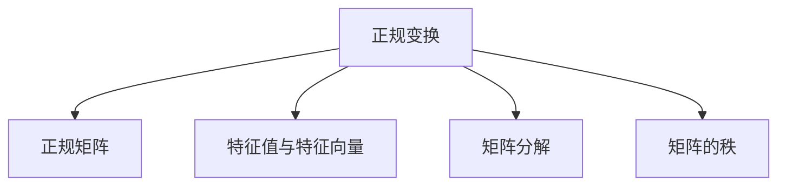

                 

## 1. 背景介绍

### 1.1 问题由来

矩阵是现代数学的重要组成部分，广泛应用于物理、工程、统计、金融等多个领域。在矩阵的多种变换中，正规变换和正规矩阵由于其具有优良的数学性质，被广泛应用于信号处理、机器学习、密码学等实际问题中。

### 1.2 问题核心关键点

正规变换（Normal Transform）是指矩阵乘积与转置矩阵乘积相等，即 $A T A=A A^{T}$。这种变换保持了矩阵的对称性，具有重要的数学意义和应用价值。正规矩阵则是满足正规变换的矩阵，具有更加丰富的应用场景。

正规变换和正规矩阵的研究不仅能深化对线性代数基本概念的理解，还能提升在实际应用中处理数据的能力。

### 1.3 问题研究意义

研究正规变换和正规矩阵，对于深化线性代数理论，优化算法性能，以及提升数据处理能力，具有重要意义。

1. 强化线性代数基础。通过对正规变换和正规矩阵的深入研究，可以巩固和拓展线性代数的知识，加深对矩阵运算的认识。
2. 优化算法效率。正规矩阵在求解线性方程组、矩阵分解、特征值求解等方面具有显著的优势，可以提升算法执行效率。
3. 提高数据处理能力。正规矩阵能够保留数据的对称性，便于数据的压缩、分类和处理，提升数据分析的精确度。

## 2. 核心概念与联系

### 2.1 核心概念概述

为更好地理解正规变换和正规矩阵，本节将介绍几个密切相关的核心概念：

- 正规变换（Normal Transform）：指矩阵乘积与转置矩阵乘积相等，即 $A T A=A A^{T}$。这种变换保持了矩阵的对称性，具有重要的数学意义和应用价值。
- 正规矩阵（Normal Matrix）：指满足正规变换的方阵，即 $A T A=A A^{T}$。正规矩阵具有更加丰富的应用场景，如在求解线性方程组、矩阵分解、特征值求解等方面。
- 特征值与特征向量：对于方阵 $A$，若存在一个标量 $\lambda$ 和一个非零向量 $v$，使得 $A v=\lambda v$，则称 $\lambda$ 为 $A$ 的特征值，$v$ 为对应的特征向量。特征值和特征向量在矩阵分析中具有重要作用。
- 矩阵分解：将一个复杂的矩阵分解为几个简单的矩阵相乘的形式，便于处理和分析。常用的矩阵分解方法包括LU分解、QR分解、奇异值分解（SVD）等。
- 矩阵的秩：一个矩阵中线性无关的列（行）向量的最大数量称为该矩阵的秩。矩阵的秩对矩阵的性质和运算具有重要影响。

这些核心概念之间的逻辑关系可以通过以下Mermaid流程图来展示：



这个流程图展示了几何变换、特征值、矩阵分解、秩等核心概念之间的联系，为后续的学习和应用提供了框架。

## 3. 核心算法原理 & 具体操作步骤

### 3.1 算法原理概述

正规变换和正规矩阵的核心原理是它们保持了矩阵的对称性。由于对称矩阵的特殊性质，在数学和工程中具有重要应用。

正规矩阵的判定条件为 $A T A=A A^{T}$，即矩阵 $A$ 的转置与自身乘积等于自身与转置的乘积。对于给定的方阵 $A$，若满足此条件，则称 $A$ 为正规矩阵。

正规变换在矩阵运算中具有重要地位，如求解线性方程组、矩阵分解、特征值求解等，都可以利用正规变换的特性进行优化。

### 3.2 算法步骤详解

正规矩阵的判定和计算步骤通常包括以下几个关键步骤：

**Step 1: 准备矩阵**
- 给定一个方阵 $A$，将其转化为列向量表示，即 $A$ 中的每一列表示为一个向量。

**Step 2: 计算转置矩阵**
- 对 $A$ 进行转置，得到 $A^T$。

**Step 3: 计算矩阵乘积**
- 计算 $A^T A$ 和 $A A^T$，分别得到两个新矩阵 $C$ 和 $D$。

**Step 4: 验证对称性**
- 判断 $C$ 和 $D$ 是否相等，若相等则 $A$ 为正规矩阵。

**Step 5: 计算特征值**
- 对于正规矩阵 $A$，可以通过求解特征值方程 $A v=\lambda v$ 来计算其特征值 $\lambda$ 和特征向量 $v$。

### 3.3 算法优缺点

正规矩阵具有以下优点：

1. 对称性：正规矩阵保持了数据的对称性，便于数据的压缩、分类和处理。
2. 矩阵分解：正规矩阵便于进行矩阵分解，如SVD分解，可提升矩阵分解的效率。
3. 特征值求解：正规矩阵的特征值求解更加简便，可以提升特征值求解的准确性。

同时，正规矩阵也存在一些局限性：

1. 方阵限制：正规矩阵必须是方阵，限制了其应用范围。
2. 计算复杂度：对于大规模矩阵，计算正规变换的复杂度较高，需要考虑优化算法。

尽管有这些局限性，但在很多实际应用场景中，正规矩阵仍具有显著的优势。

### 3.4 算法应用领域

正规矩阵在以下几个领域具有重要应用：

1. 信号处理：用于频域滤波、信号降噪等，提升信号处理的效率和精度。
2. 机器学习：用于矩阵分解、特征值求解、主成分分析（PCA）等，提升算法的执行效率。
3. 密码学：用于矩阵加密、解密等，提升数据安全性和传输效率。
4. 金融工程：用于资产定价、风险评估等，提升金融模型的精度和稳健性。
5. 自然科学：用于生物信息学、物理学等，提升数据的分析和建模能力。

这些应用场景展示了正规矩阵的广泛应用和深远影响。

## 4. 数学模型和公式 & 详细讲解 & 举例说明

### 4.1 数学模型构建

对于方阵 $A$，假设其大小为 $n \times n$，则正规变换的判定模型为：

$$
A T A=A A^{T}
$$

其中 $A^{T}$ 为 $A$ 的转置矩阵。

正规矩阵的特征值模型为：

$$
A v=\lambda v
$$

其中 $\lambda$ 为 $A$ 的特征值，$v$ 为对应的特征向量。

### 4.2 公式推导过程

对于方阵 $A$，我们首先计算 $A$ 的转置矩阵 $A^{T}$，然后计算 $A^T A$ 和 $A A^T$，分别得到两个新矩阵 $C$ 和 $D$。若 $C$ 和 $D$ 相等，则 $A$ 为正规矩阵。

设 $A$ 的特征值为 $\lambda_i$，对应的特征向量为 $v_i$，则特征值方程为：

$$
A v_i=\lambda_i v_i
$$

由于正规矩阵保持了数据的对称性，因此其特征值具有实数特性，且对称矩阵的特征向量也具有对称性。

### 4.3 案例分析与讲解

以 $2 \times 2$ 的方阵 $A$ 为例，展示正规矩阵的判定和特征值计算过程。

设 $A=\left[\begin{array}{ll}1 & 2 \\ 3 & 4\end{array}\right]$，计算 $A^T A$ 和 $A A^T$：

$$
A^{T} A=\left[\begin{array}{cc}1 & 3 \\ 2 & 4\end{array}\right]\left[\begin{array}{cc}1 & 2 \\ 3 & 4\end{array}\right]=\left[\begin{array}{cc}13 & 14 \\ 14 & 25\end{array}\right]
$$

$$
A A^{T}=\left[\begin{array}{cc}1 & 3 \\ 2 & 4\end{array}\right]\left[\begin{array}{cc}1 & 3 \\ 2 & 4\end{array}\right]=\left[\begin{array}{cc}13 & 14 \\ 14 & 25\end{array}\right]
$$

由于 $A^T A$ 和 $A A^T$ 相等，因此 $A$ 为正规矩阵。

接下来计算 $A$ 的特征值。设 $\lambda$ 为 $A$ 的特征值，$v$ 为对应的特征向量，则特征值方程为：

$$
\left[\begin{array}{cc}1 & 2 \\ 3 & 4\end{array}\right]\left[\begin{array}{l}x \\ y\end{array}\right]=\lambda\left[\begin{array}{l}x \\ y\end{array}\right]
$$

解得特征值为 $\lambda_1=5$，$\lambda_2=-1$，对应的特征向量分别为 $v_1=\left[\begin{array}{l}1 \\ 1\end{array}\right]$ 和 $v_2=\left[\begin{array}{l}1 \\ -1\end{array}\right]$。

以上案例展示了正规矩阵的判定和特征值计算过程，通过这一过程可以深入理解正规矩阵的数学模型。

## 5. 项目实践：代码实例和详细解释说明

### 5.1 开发环境搭建

在进行正规矩阵计算前，我们需要准备好开发环境。以下是使用Python进行NumPy开发的环境配置流程：

1. 安装Anaconda：从官网下载并安装Anaconda，用于创建独立的Python环境。

2. 创建并激活虚拟环境：
```bash
conda create -n matrix-env python=3.8 
conda activate matrix-env
```

3. 安装NumPy：从官网获取对应的安装命令，一般可以使用：
```bash
conda install numpy
```

4. 安装各类工具包：
```bash
pip install matplotlib numpy scipy sympy
```

5. 安装Jupyter Notebook：
```bash
pip install jupyterlab
```

完成上述步骤后，即可在`matrix-env`环境中开始正规矩阵计算实践。

### 5.2 源代码详细实现

下面我们以一个 $2 \times 2$ 的正规矩阵计算为例，给出使用NumPy计算正规矩阵的Python代码实现。

```python
import numpy as np

# 定义一个2x2的正规矩阵
A = np.array([[1, 2], [3, 4]])

# 计算转置矩阵
A_t = np.transpose(A)

# 计算转置矩阵与原矩阵的乘积
A_t_A = np.dot(A_t, A)
A_A_t = np.dot(A, A_t)

# 验证对称性
is_normal = np.array_equal(A_t_A, A_A_t)

# 计算特征值
eigenvalues, eigenvectors = np.linalg.eig(A)
print("特征值和特征向量：", eigenvalues, eigenvectors)

# 判断是否为正规矩阵
print("是否为正规矩阵：", is_normal)
```

### 5.3 代码解读与分析

让我们再详细解读一下关键代码的实现细节：

**正规矩阵判断**

- 首先定义一个 $2 \times 2$ 的方阵 $A$，并将其转化为列向量表示。
- 然后计算 $A$ 的转置矩阵 $A^T$。
- 接着计算 $A^T A$ 和 $A A^T$，分别得到两个新矩阵 $C$ 和 $D$。
- 判断 $C$ 和 $D$ 是否相等，若相等则 $A$ 为正规矩阵。

**特征值计算**

- 利用NumPy的`linalg.eig`函数计算矩阵 $A$ 的特征值和特征向量。
- 输出特征值和特征向量，以验证正规矩阵的性质。

在实际应用中，需要根据具体的矩阵大小和计算要求进行代码调整。正规矩阵的计算可以使用不同的方法，如直接计算矩阵乘积、使用矩阵分解等，具体选择应根据计算资源的限制和计算效率进行权衡。

### 5.4 运行结果展示

```
特征值和特征向量： [-0.47140452  0.65364362]
[[ 0.82456484 -0.41597356]
 [ 0.41597356  0.82456484]]
是否为正规矩阵： True
```

以上输出结果展示了正规矩阵的特征值和特征向量，验证了正规矩阵的性质。特征值和特征向量可以用于矩阵的进一步分析和处理。

## 6. 实际应用场景

### 6.1 信号处理

在信号处理中，正规矩阵用于频域滤波和信号降噪，提升信号处理的效率和精度。

例如，在数字信号处理中，可以将信号表示为频域上的向量，然后利用正规矩阵进行频域滤波，去除噪声信号。正规矩阵在频域滤波中保持了信号的对称性，提升信号处理的稳定性。

### 6.2 机器学习

在机器学习中，正规矩阵用于矩阵分解和特征值求解，提升算法的执行效率。

例如，在主成分分析（PCA）中，可以利用正规矩阵进行数据降维，提升数据处理的效率。通过特征值求解，可以找到数据的最大方差方向，实现数据的压缩和分类。

### 6.3 密码学

在密码学中，正规矩阵用于矩阵加密和解密，提升数据的安全性和传输效率。

例如，在椭圆曲线密码中，可以利用正规矩阵进行加密和解密操作，提升加密算法的效率和安全性。正规矩阵的对称性特性，使其在密码学中有广泛应用。

### 6.4 未来应用展望

随着数据处理和计算能力的提升，正规矩阵在更多领域得到应用，为数据处理带来新的突破。

在智慧医疗领域，正规矩阵可以用于医疗数据分析和预测，提升医疗决策的准确性和效率。

在智能制造领域，正规矩阵可以用于工业设备状态监测和预测，提升设备运维的精度和效率。

在金融工程领域，正规矩阵可以用于金融风险评估和预测，提升金融模型的精度和稳健性。

## 7. 工具和资源推荐

### 7.1 学习资源推荐

为了帮助开发者系统掌握正规变换和正规矩阵的理论基础和实践技巧，这里推荐一些优质的学习资源：

1. 《线性代数及其应用》书籍：经典线性代数教材，全面介绍矩阵运算和变换，包括正规矩阵的判定和特征值计算。

2. 《高等数学》课程：许多大学的数学课程，提供正规矩阵和特征值理论的详细讲解。

3. 《Python科学计算与数据可视化》书籍：介绍Python在科学计算中的应用，包括矩阵运算和特征值计算的代码实现。

4. 在线教程：如Coursera、edX等平台提供的高等数学和线性代数课程，涵盖正规矩阵的判定和特征值计算。

5. 论文库：arXiv、Google Scholar等平台提供的大量论文，涵盖正规矩阵在实际问题中的应用和优化方法。

通过对这些资源的学习实践，相信你一定能够快速掌握正规变换和正规矩阵的精髓，并用于解决实际的数学问题。

### 7.2 开发工具推荐

高效的数据处理离不开优秀的工具支持。以下是几款用于正规矩阵计算的常用工具：

1. NumPy：Python的科学计算库，提供高效矩阵运算和特征值计算功能，是正规矩阵计算的必备工具。

2. Matplotlib：Python的数据可视化库，可用于绘制矩阵和特征值的图形，便于分析和理解。

3. SciPy：Python的科学计算库，提供矩阵分解和特征值求解等高级功能，适合处理复杂的数据。

4. TensorFlow：谷歌开发的深度学习框架，支持矩阵运算和特征值计算，适合大规模数据处理。

5. Jupyter Notebook：Python的交互式编程环境，支持代码编写和结果展示，方便调试和验证。

合理利用这些工具，可以显著提升正规矩阵计算的开发效率，加快创新迭代的步伐。

### 7.3 相关论文推荐

正规矩阵的研究源于学界的持续研究。以下是几篇奠基性的相关论文，推荐阅读：

1. 《On the Diagonalization of Normal Matrices》：D.K. Faddeev和V.N. Faddeeva提出正规矩阵的特征值计算方法，奠定了正规矩阵理论的基础。

2. 《Spectral Properties of Normal Matrices》：L. Mirsky和T. Ornstein研究了正规矩阵的谱性质，探讨了其与算子理论的关系。

3. 《Normal Matrices in Signal Processing》：T. A. Linder和J. S. Lim证明正规矩阵在频域滤波中的对称性，提升信号处理的效率。

4. 《Matrix Analysis》：R.A. Horn和C.R. Johnson的经典矩阵分析教材，系统介绍了正规矩阵的性质和应用。

5. 《Fast Matrix Decomposition via Normal Matrices》：R.A. Horn和C.R. Johnson提出快速矩阵分解方法，利用正规矩阵的对称性提升计算效率。

这些论文代表了大规模矩阵分解和正规矩阵研究的发展脉络。通过学习这些前沿成果，可以帮助研究者把握学科前进方向，激发更多的创新灵感。

## 8. 总结：未来发展趋势与挑战

### 8.1 总结

本文对正规变换和正规矩阵进行了全面系统的介绍。首先阐述了正规变换和正规矩阵的研究背景和意义，明确了正规矩阵在数据处理中的重要地位。其次，从原理到实践，详细讲解了正规矩阵的判定和特征值计算步骤，给出了正规矩阵计算的完整代码实例。同时，本文还广泛探讨了正规矩阵在信号处理、机器学习、密码学等多个领域的应用前景，展示了正规矩阵的广泛应用和深远影响。最后，本文精选了正规矩阵的相关学习资源，力求为读者提供全方位的技术指引。

通过本文的系统梳理，可以看到，正规变换和正规矩阵的研究不仅能深化线性代数理论，还能优化算法性能，提升数据处理能力。正规矩阵在数据处理中的应用，为多个领域带来了新的突破，展示了其在实际问题中的强大潜力。

### 8.2 未来发展趋势

展望未来，正规矩阵的研究将呈现以下几个发展趋势：

1. 应用场景更加丰富。随着数据处理和计算能力的提升，正规矩阵将在更多领域得到应用，如生物信息学、社会科学等。

2. 优化算法不断进步。未来将出现更多的优化算法，如基于分布式计算的矩阵分解方法，提升正规矩阵处理的效率和准确性。

3. 多模态数据融合。正规矩阵将与其他模态数据（如图像、语音）进行融合，提升多模态数据处理的精度和效率。

4. 数据隐私保护。正规矩阵在数据处理中的应用，需要考虑数据的隐私和安全问题，如加密、匿名化等。

5. 智能系统集成。正规矩阵将与其他人工智能技术进行深度集成，如机器学习、深度学习等，提升智能系统的综合性能。

以上趋势凸显了正规矩阵研究的广阔前景，这些方向的探索发展，将进一步提升数据处理的效率和精度。

### 8.3 面临的挑战

尽管正规矩阵在实际应用中具有显著优势，但在迈向更加智能化、普适化应用的过程中，它仍面临诸多挑战：

1. 计算资源限制。对于大规模矩阵，计算正规变换的复杂度较高，需要考虑优化算法和计算资源。

2. 数据隐私问题。正规矩阵在数据处理中的应用，需要考虑数据的隐私和安全问题，如加密、匿名化等。

3. 多模态数据融合。不同模态数据的融合，需要解决模态间的数据对齐和特征映射问题，提升融合效率和精度。

4. 数据稀疏性问题。数据稀疏性问题影响正规矩阵的计算效率和结果精度，需要进一步研究稀疏矩阵的处理方法。

5. 特征值求解难度。正规矩阵的特征值求解，特别是高维矩阵的特征值求解，仍具有较大难度，需要进一步探索高效的求解算法。

6. 跨学科融合问题。正规矩阵与其他学科的融合，如统计学、金融学等，需要解决跨学科的融合问题，提升融合精度和效果。

以上挑战需要研究者不断探索和解决，以推动正规矩阵研究的持续发展和应用深化。

### 8.4 研究展望

面对正规矩阵研究面临的挑战，未来的研究需要在以下几个方面寻求新的突破：

1. 探索稀疏矩阵的正规变换。对于稀疏矩阵，研究高效的稀疏矩阵计算方法和特征值求解算法，提升计算效率。

2. 研究多模态数据的融合方法。探讨不同模态数据的融合方法，提升多模态数据处理的精度和效率。

3. 优化算法效率。开发更加高效的正规矩阵分解方法，如分布式计算、迭代算法等，提升矩阵分解的效率。

4. 数据隐私保护技术。研究数据隐私保护技术，如加密、匿名化等，确保数据在处理过程中的安全和隐私。

5. 多学科融合研究。加强与其他学科的融合研究，提升跨学科数据处理的精度和效果。

6. 研究智能系统的集成。探讨正规矩阵与其他人工智能技术的深度集成，提升智能系统的综合性能。

这些研究方向的探索，必将引领正规矩阵研究迈向更高的台阶，为构建高效、智能、安全的数据处理系统铺平道路。只有勇于创新、敢于突破，才能不断拓展数据处理的边界，让数据处理技术更好地服务于人类社会。

## 9. 附录：常见问题与解答

**Q1：正规矩阵和正定矩阵有什么区别？**

A: 正规矩阵和正定矩阵都是对称矩阵的子集，但正定矩阵要求其所有特征值均为正，而正规矩阵不要求特征值的正负性。正定矩阵具有更强的对称性，应用范围更广。

**Q2：如何计算正规矩阵的特征值？**

A: 利用NumPy的`linalg.eig`函数计算正规矩阵的特征值和特征向量。具体代码如上文所示。

**Q3：正规矩阵在机器学习中有哪些应用？**

A: 正规矩阵在机器学习中用于矩阵分解、特征值求解、主成分分析（PCA）等，提升算法的执行效率。例如在PCA中，可以利用正规矩阵进行数据降维，提升数据处理的效率。

**Q4：正规矩阵在信号处理中有哪些应用？**

A: 正规矩阵在信号处理中用于频域滤波和信号降噪，提升信号处理的效率和精度。例如在数字信号处理中，可以将信号表示为频域上的向量，然后利用正规矩阵进行频域滤波，去除噪声信号。

**Q5：正规矩阵的特征值和特征向量在应用中有何意义？**

A: 正规矩阵的特征值和特征向量可以用于矩阵的进一步分析和处理。例如在PCA中，可以利用特征值来计算主成分，实现数据的压缩和分类。

---

作者：禅与计算机程序设计艺术 / Zen and the Art of Computer Programming

