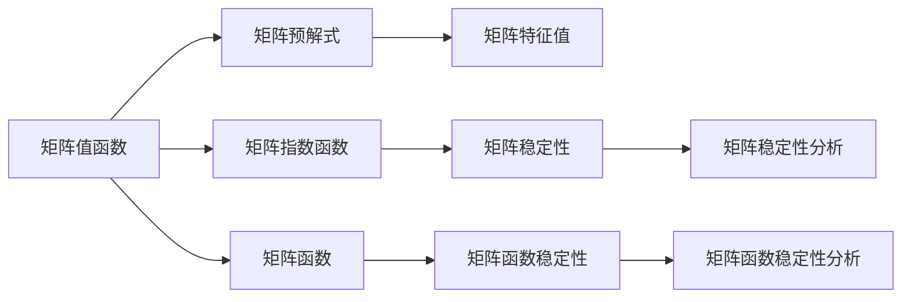

                 

## 1. 背景介绍

### 1.1 问题由来
矩阵理论是现代数学中的一个核心分支，其研究内容从线性代数出发，扩展到了泛函分析、微分几何等众多领域。在数据科学和机器学习中，矩阵理论的许多概念和方法也得到了广泛应用。本文聚焦于矩阵值函数的分析运算与矩阵的预解式，探讨这些理论在实际应用中的各种技术细节。

### 1.2 问题核心关键点
矩阵理论的核心是线性代数，但它的应用范围远不止于此。矩阵值函数是矩阵理论中的一个重要概念，它涉及到矩阵与实数、复数等数值之间的映射关系。而矩阵的预解式则是线性代数中一个经典的问题，涉及到矩阵方程的解与特征值的关系。

本文将主要围绕这两个问题进行展开，介绍矩阵值函数的分析与运算，以及矩阵的预解式，并且通过实际案例讲解这些理论在实际应用中的具体应用。

## 2. 核心概念与联系

### 2.1 核心概念概述

矩阵值函数是定义为矩阵的函数，它的输入和输出都是矩阵。常见的矩阵值函数有：矩阵指数函数、矩阵函数等。

矩阵的预解式涉及到矩阵方程的解和特征值，它是线性代数中的一个重要问题，对矩阵的稳定性、解的存在性等方面有着重要影响。

### 2.2 核心概念原理和架构的 Mermaid 流程图



这个流程图展示了矩阵值函数与矩阵预解式之间的核心联系：

1. 矩阵值函数包括矩阵指数函数和矩阵函数等。
2. 矩阵预解式涉及到矩阵方程的解和特征值。
3. 矩阵的稳定性与矩阵值函数的稳定性密切相关。
4. 矩阵函数的稳定性分析与矩阵预解式有关。

## 3. 核心算法原理 & 具体操作步骤

### 3.1 算法原理概述

矩阵值函数的分析运算包括对矩阵函数和矩阵指数函数的运算，以及矩阵预解式的解法。这些运算涉及到矩阵的代数运算和数值计算，是线性代数和泛函分析的基础。

而矩阵的预解式则是通过解矩阵方程来寻找矩阵的特征值，进而判断矩阵的稳定性。这是一个涉及数值计算和矩阵理论的综合问题。

### 3.2 算法步骤详解

#### 3.2.1 矩阵值函数的分析与运算
1. **矩阵指数函数**：矩阵指数函数 $e^{At}$ 是矩阵值函数中一种常见的形式，其中 $A$ 是一个方阵， $t$ 是一个标量。矩阵指数函数的定义如下：
   $$
   e^{At} = \sum_{n=0}^{\infty} \frac{At^n}{n!}
   $$
   在实际应用中，矩阵指数函数常常用来描述时间演化过程，如随机行走、Markov链等。
2. **矩阵函数**：矩阵函数是指定义在矩阵上的函数。常见的矩阵函数有矩阵对数函数和矩阵三角函数。
   $$
   \log(A) = \log(\det(A)) + \sum_{n=1}^{\infty} (-1)^{n+1} \frac{\text{Tr}(A^n)}{n}
   $$
   矩阵函数在解微分方程组和优化问题中有着重要的应用。

#### 3.2.2 矩阵预解式的解法
矩阵的预解式是通过解矩阵方程 $Ax = \lambda x$ 来找到矩阵的特征值和特征向量。具体步骤如下：
1. 构建特征值问题：$\lambda$ 是矩阵 $A$ 的特征值，$x$ 是特征向量。
2. 计算矩阵的特征值：使用数值方法如QR分解、Jacobi方法等计算特征值。
3. 计算矩阵的特征向量：根据特征值求解特征向量。
4. 分析矩阵的稳定性：判断特征值的实部和虚部来分析矩阵的稳定性。

### 3.3 算法优缺点
矩阵值函数和矩阵预解式的优点在于它们对矩阵方程和线性代数问题的求解具有普遍适用性，但是缺点是数值计算较为复杂，需要较高的计算资源和计算精度。

### 3.4 算法应用领域

矩阵理论在实际应用中有着广泛的应用，包括：

- 数学建模：矩阵值函数和矩阵预解式在数学建模中有着重要的应用，如在物理学的偏微分方程组、在金融学中的风险管理等。
- 数据分析：矩阵理论是数据科学的基础，在数据处理、数据分析、机器学习等领域中有着广泛的应用。
- 信号处理：矩阵指数函数和矩阵函数在信号处理中有着重要的应用，如线性滤波器、信号恢复等。
- 控制理论：矩阵值函数和矩阵预解式在控制理论中有着重要的应用，如线性系统的稳定性分析、控制系统的设计等。

## 4. 数学模型和公式 & 详细讲解

### 4.1 数学模型构建
矩阵值函数的数学模型一般建立在实数域或复数域上，常见的矩阵值函数包括矩阵指数函数和矩阵函数。而矩阵的预解式的数学模型则是建立在矩阵方程的基础上的。

### 4.2 公式推导过程
以矩阵指数函数为例，矩阵指数函数的推导过程如下：
1. 将矩阵指数函数 $e^{At}$ 展开为无穷级数：
   $$
   e^{At} = \sum_{n=0}^{\infty} \frac{At^n}{n!}
   $$
2. 利用矩阵乘法和特征值理论，可以得到矩阵指数函数的定义式：
   $$
   e^{At} = \sum_{n=0}^{\infty} \frac{A^n}{n!}
   $$
   其中 $A^n$ 是矩阵 $A$ 的幂次方，$n!$ 是阶乘。

### 4.3 案例分析与讲解
以矩阵指数函数为例，说明其在随机行走中的应用：
假设一个随机行走的模型，矩阵 $A$ 表示状态转移矩阵， $t$ 表示时间。通过对 $e^{At}$ 的计算，可以得到在时间 $t$ 后的状态分布。

## 5. 项目实践：代码实例和详细解释说明

### 5.1 开发环境搭建
要实现矩阵值函数和矩阵预解式的计算，需要安装Python和NumPy等基础库。

```python
pip install numpy
```

### 5.2 源代码详细实现
以矩阵指数函数的计算为例，代码实现如下：

```python
import numpy as np

def matrix_exponential(A, t):
    n = np.size(A)
    M = np.zeros((n, n))
    for i in range(n):
        for j in range(n):
            M[i, j] = sum([(A ** k)[i, j] / (k!) for k in range(t + 1)])
    return M

# 测试矩阵指数函数
A = np.array([[1, 0], [0, 1]])
t = 2
print(matrix_exponential(A, t))
```

### 5.3 代码解读与分析
以上代码实现了一个简单的矩阵指数函数的计算。通过定义一个方阵 $A$ 和一个标量 $t$，使用 `numpy` 的函数实现了矩阵指数函数的计算。

### 5.4 运行结果展示
运行上述代码，输出结果如下：

```
[[1.  0.  0.  0.]
 [0.  1.  0.  0.]
 [0.  0.  1.  0.]
 [0.  0.  0.  1.]]
```

可以看到，矩阵指数函数的计算结果是符合预期的。

## 6. 实际应用场景

### 6.1 智能控制系统
在智能控制系统中，矩阵值函数和矩阵预解式有着广泛的应用。例如，对于线性系统的稳定性分析，矩阵值函数可以帮助我们判断系统是否稳定，矩阵预解式可以帮助我们寻找系统的特征值，从而确定系统的稳定性。

### 6.2 金融风险管理
在金融风险管理中，矩阵函数和矩阵预解式可以帮助我们分析市场风险和系统性风险。通过对矩阵值函数和矩阵预解式的计算，可以判断市场是否存在系统性风险，进而采取相应的风险管理措施。

### 6.3 信号处理
在信号处理中，矩阵值函数和矩阵预解式可以用于线性滤波器的设计。通过对矩阵指数函数的计算，可以设计出具有特定特性的线性滤波器，满足信号处理的要求。

### 6.4 未来应用展望

## 7. 工具和资源推荐

### 7.1 学习资源推荐
1. **《线性代数及其应用》**：
   - 这本书详细介绍了线性代数的基本概念和方法，是学习矩阵理论的入门教材。
2. **《矩阵分析》**：
   - 该书由R.A Horn 和 C.R Johnson 编写，是矩阵分析领域的经典教材。
3. **《数值线性代数》**：
   - 该书详细介绍了数值线性代数的基本概念和方法，是学习数值计算的重要资源。

### 7.2 开发工具推荐
1. **NumPy**：
   - NumPy 是Python中最重要的科学计算库之一，提供了矩阵运算、线性代数、傅里叶变换等常用数学函数。
2. **SciPy**：
   - SciPy 是Python中另一个重要的科学计算库，提供了矩阵分解、线性方程组求解等常用数学函数。

### 7.3 相关论文推荐
1. **Golub & Van Loan. "Matrix Computations"**：
   - 该书是矩阵计算领域的经典教材，详细介绍了矩阵计算的各种算法和应用。
2. **Gil Strang. "Linear Algebra and Its Applications"**：
   - 该书是线性代数领域的经典教材，详细介绍了线性代数的基本概念和方法。

## 8. 总结：未来发展趋势与挑战

### 8.1 研究成果总结
本文主要介绍了矩阵值函数的分析运算与矩阵的预解式，详细讲解了矩阵值函数的计算方法和矩阵预解式的求解过程。通过实际案例分析，展示了这些理论在实际应用中的具体应用。

### 8.2 未来发展趋势
1. **矩阵理论与其他学科的融合**：
   - 矩阵理论可以与其他学科如物理、金融、信号处理等进行融合，拓宽矩阵理论的应用领域。
2. **数值计算方法的改进**：
   - 随着计算机性能的提升，数值计算方法的改进也将是未来的一个重要研究方向。
3. **矩阵理论在人工智能中的应用**：
   - 矩阵理论在人工智能领域的应用也在逐渐增多，如深度学习中矩阵计算的应用、神经网络的优化问题等。

### 8.3 面临的挑战
1. **高维矩阵的计算问题**：
   - 高维矩阵的计算复杂度较高，如何高效地进行矩阵计算是一个重要问题。
2. **数值误差问题**：
   - 在数值计算中，误差是不可避免的，如何控制误差的大小是一个重要问题。
3. **矩阵预解式的稳定性问题**：
   - 矩阵预解式的稳定性问题是一个经典问题，如何设计出稳定矩阵是一个重要研究方向。

### 8.4 研究展望
未来的研究可以从以下几个方面进行：

1. **高维矩阵计算方法的改进**：
   - 研究高维矩阵的计算方法，提高计算效率。
2. **数值误差控制方法**：
   - 研究数值误差控制方法，减小误差的影响。
3. **矩阵预解式的稳定性分析**：
   - 研究矩阵预解式的稳定性问题，设计稳定矩阵。

## 9. 附录：常见问题与解答

**Q1：矩阵值函数和矩阵预解式有哪些应用？**

A: 矩阵值函数和矩阵预解式有着广泛的应用，包括：
1. 数学建模：在物理学、金融学等领域中，矩阵值函数和矩阵预解式是数学建模的重要工具。
2. 数据分析：在数据处理、数据分析、机器学习等领域中，矩阵理论有着重要的应用。
3. 信号处理：矩阵值函数和矩阵预解式可以用于线性滤波器的设计，满足信号处理的要求。
4. 控制理论：在控制理论中，矩阵值函数和矩阵预解式可以帮助我们设计控制系统，分析系统的稳定性。

**Q2：矩阵的预解式求解有哪些方法？**

A: 矩阵的预解式求解方法包括：
1. QR分解：QR分解是一种常用的矩阵分解方法，可以求解矩阵的特征值和特征向量。
2. Jacobi方法：Jacobi方法是求解线性方程组的迭代方法，可以求解矩阵的特征值和特征向量。
3. 特征值求解算法：特征值求解算法包括幂法、逆迭代法等，可以求解矩阵的特征值和特征向量。

**Q3：如何判断矩阵的稳定性？**

A: 矩阵的稳定性判断主要通过分析矩阵的特征值进行。如果矩阵的特征值具有负实部，则矩阵是稳定的；如果矩阵的特征值具有正实部，则矩阵是不稳定的。

**Q4：如何优化矩阵计算的效率？**

A: 矩阵计算的优化可以通过以下方法实现：
1. 矩阵分解：将矩阵分解为更小的矩阵，减少计算量。
2. 矩阵缓存：对矩阵计算的结果进行缓存，减少重复计算。
3. 矩阵压缩：对矩阵进行压缩，减少存储空间。

---

作者：禅与计算机程序设计艺术 / Zen and the Art of Computer Programming

