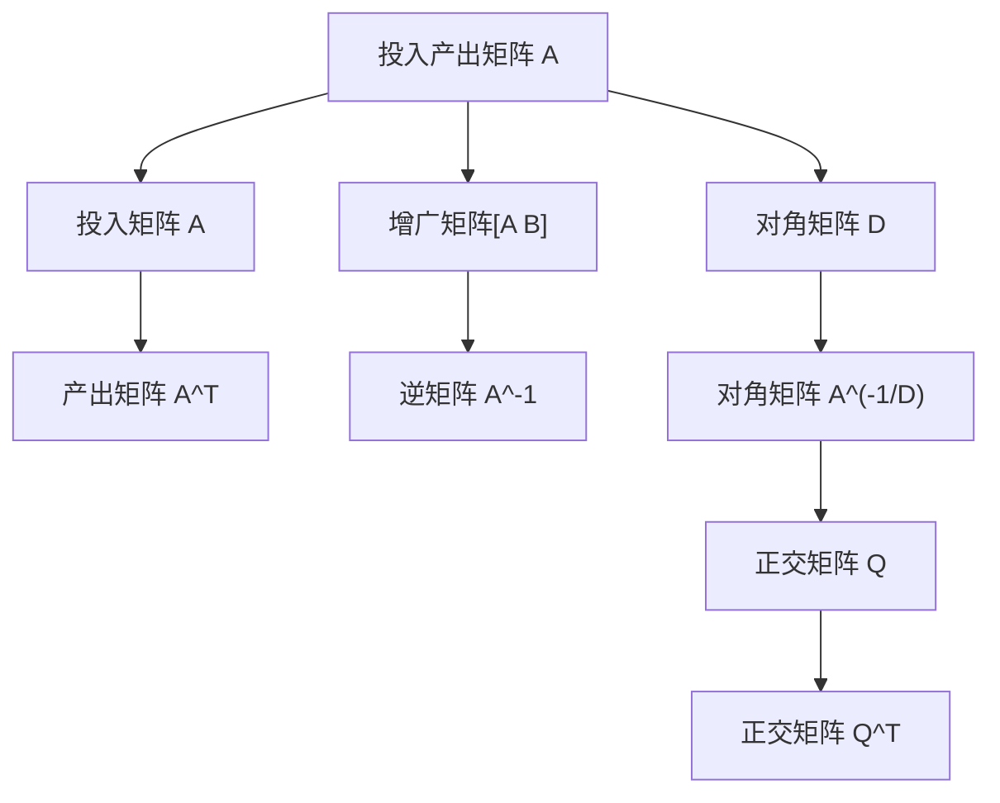

                 

# 矩阵理论与应用：闭式Leontief模型

## 1. 背景介绍

在现代经济体系中，生产活动通常涉及多个产品间的相互依赖关系，如何描述和分析这种依赖关系，是经济系统分析和优化的重要问题。Leontief投入产出模型（以下简称Leontief模型）正是描述这种依赖关系的经典模型之一，它通过矩阵乘法的方式，形象地刻画了产品间的投入产出关系。本文将详细介绍Leontief模型的数学原理及其在实际中的应用，为读者提供系统全面的理论框架和实践案例。

## 2. 核心概念与联系

### 2.1 核心概念概述

Leontief模型由苏联经济学家Wassily Leontief在1941年提出，是一种基于投入产出矩阵的线性代数模型。它通过一个$n \times n$的投入产出矩阵$A$，描述了一个包含$n$个产品（或产业）的宏观经济系统中，每个产品之间投入与产出的关系。

Leontief模型主要用于以下几个方面：

- **经济结构分析**：通过分析投入产出矩阵$A$，可以揭示经济系统中各产业之间的依赖关系，以及产品间的技术水平。
- **宏观经济预测**：基于历史数据构建投入产出矩阵$A$，可以对未来经济活动进行预测和模拟。
- **政策评估**：通过修改投入产出矩阵$A$，评估不同政策对经济系统的影响，如税收、投资、贸易政策等。

### 2.2 核心概念原理和架构的 Mermaid 流程图



以上流程图展示了Leontief模型的核心架构：

1. 投入产出矩阵$A$：描述产品间的投入关系，是一个$n \times n$的矩阵。
2. 投入矩阵$A^T$：描述产品间的产出关系，是$A$的转置矩阵。
3. 增广矩阵$[A B]$：在$A$的右侧添加单位矩阵$B$，形成一个$n \times n+1$的矩阵。
4. 逆矩阵$A^{-1}$：计算$[A B]$的逆矩阵，得到产品间的技术系数。
5. 对角矩阵$D$：$A$的对角线元素，反映了各产品的自给自足程度。
6. 对角矩阵$A^{-1/D}$：$A$的逆矩阵与$D$的倒数的乘积，用于归一化技术系数。
7. 正交矩阵$Q$和$Q^T$：通过奇异值分解（SVD）得到，用于降维和矩阵分解。

这些概念和架构构成了Leontief模型的核心，通过矩阵乘法和代数运算，可以揭示经济系统的复杂依赖关系。

## 3. 核心算法原理 & 具体操作步骤

### 3.1 算法原理概述

Leontief模型的核心算法是矩阵分解与逆矩阵计算，其基本原理可以概括为以下几个步骤：

1. **构建投入产出矩阵**：根据历史生产数据，构建包含$n$个产品（或产业）的投入产出矩阵$A$，矩阵$A$的每个元素表示产品$i$对产品$j$的投入量。
2. **标准化矩阵**：对矩阵$A$进行标准化，使对角线元素为1，即得到增广矩阵$[A B]$，其中$B$是一个单位矩阵。
3. **计算逆矩阵**：求出增广矩阵$[A B]$的逆矩阵，得到产品间的技术系数。
4. **正交分解**：通过奇异值分解（SVD）将矩阵$A$分解为正交矩阵$Q$和$Q^T$的乘积，进一步简化计算。
5. **输出分析**：通过正交矩阵$Q$和$Q^T$，对产品间的依赖关系进行可视化分析。

### 3.2 算法步骤详解

以下是Leontief模型的详细步骤：

1. **构建投入产出矩阵$A$**：
   根据统计数据，构建$n \times n$的投入产出矩阵$A$，每个元素$a_{ij}$表示产品$i$对产品$j$的投入量。

2. **标准化矩阵**：
   将矩阵$A$标准化，得到增广矩阵$[A B]$，其中$B$为$n \times n$的单位矩阵。
   $$
   A = \left[ a_{ij} \right]_{n \times n}
   $$
   $$
   A^T = \left[ a_{ij} \right]_{n \times n}
   $$
   $$
   A = \begin{bmatrix} 
   a_{11} & a_{12} & \cdots & a_{1n} \\
   a_{21} & a_{22} & \cdots & a_{2n} \\
   \vdots & \vdots & \ddots & \vdots \\
   a_{n1} & a_{n2} & \cdots & a_{nn} 
   \end{bmatrix}
   $$
   $$
   B = \begin{bmatrix} 
   1 & 0 & \cdots & 0 \\
   0 & 1 & \cdots & 0 \\
   \vdots & \vdots & \ddots & \vdots \\
   0 & 0 & \cdots & 1 
   \end{bmatrix}
   $$
   $$
   [A B] = \begin{bmatrix} 
   a_{11} & a_{12} & \cdots & a_{1n} & 1 \\
   a_{21} & a_{22} & \cdots & a_{2n} & 1 \\
   \vdots & \vdots & \ddots & \vdots & \vdots \\
   a_{n1} & a_{n2} & \cdots & a_{nn} & 1 
   \end{bmatrix}
   $$

3. **计算逆矩阵$A^{-1}$**：
   计算增广矩阵$[A B]$的逆矩阵$[A^{-1} B^{-1}]$，得到产品间的技术系数。
   $$
   [A^{-1} B^{-1}] = (A^T A)^{-1} A^T
   $$
   其中$A^T A$为$A$的转置矩阵与其本身的乘积，即协方差矩阵。

4. **正交分解**：
   通过奇异值分解（SVD）将矩阵$A$分解为正交矩阵$Q$和$Q^T$的乘积，进一步简化计算。
   $$
   A = Q D Q^T
   $$
   其中$D$为对角矩阵，对角线元素表示产品间的依赖程度。

5. **输出分析**：
   通过正交矩阵$Q$和$Q^T$，对产品间的依赖关系进行可视化分析。

### 3.3 算法优缺点

Leontief模型具有以下优点：

- **简洁直观**：通过矩阵乘法和逆矩阵计算，直观地描述了产品间的投入产出关系。
- **可解释性强**：模型参数具有明确的经济意义，易于理解。
- **计算简便**：通过标准化和正交分解，大大简化了矩阵计算。

但Leontief模型也存在一些局限性：

- **假设条件严格**：模型假设产品间的关系是线性的，且所有产品的自给自足程度为1，这与现实情况有一定偏差。
- **数据依赖性强**：模型对数据的依赖性较大，需要准确、完整的数据才能得到有效的分析结果。
- **动态性不足**：模型缺乏动态性，难以描述生产活动的动态变化过程。

### 3.4 算法应用领域

Leontief模型广泛应用于以下几个领域：

- **经济系统分析**：分析经济系统中各产业间的依赖关系，评估产业政策对经济系统的影响。
- **资源分配**：优化资源分配，提高资源利用效率，降低生产成本。
- **供应链管理**：优化供应链流程，提升供应链效率。
- **区域经济分析**：分析不同区域间的经济依赖关系，制定区域经济发展策略。
- **能源系统分析**：分析能源系统中各产业间的依赖关系，优化能源配置。

## 4. 数学模型和公式 & 详细讲解 & 举例说明

### 4.1 数学模型构建

Leontief模型的数学模型主要包括以下几个部分：

- **投入产出矩阵$A$**：
  $$
  A = \left[ a_{ij} \right]_{n \times n}
  $$
  其中$a_{ij}$表示产品$i$对产品$j$的投入量。

- **标准化后的增广矩阵$[A B]$**：
  $$
  [A B] = \begin{bmatrix} 
  a_{11} & a_{12} & \cdots & a_{1n} & 1 \\
  a_{21} & a_{22} & \cdots & a_{2n} & 1 \\
  \vdots & \vdots & \ddots & \vdots & \vdots \\
  a_{n1} & a_{n2} & \cdots & a_{nn} & 1 
  \end{bmatrix}
  $$

- **逆矩阵$A^{-1}$**：
  $$
  A^{-1} = (A^T A)^{-1} A^T
  $$

- **正交分解后的矩阵$Q$和$Q^T$**：
  $$
  A = Q D Q^T
  $$

### 4.2 公式推导过程

以一个简单的$3 \times 3$的投入产出矩阵为例，推导Leontief模型的数学模型：

假设有一个包含3个产品的经济系统，其投入产出矩阵为：
$$
A = \begin{bmatrix} 
a_{11} & a_{12} & a_{13} \\
a_{21} & a_{22} & a_{23} \\
a_{31} & a_{32} & a_{33} 
\end{bmatrix}
$$

标准化后的增广矩阵为：
$$
[A B] = \begin{bmatrix} 
a_{11} & a_{12} & a_{13} & 1 \\
a_{21} & a_{22} & a_{23} & 1 \\
a_{31} & a_{32} & a_{33} & 1 
\end{bmatrix}
$$

计算增广矩阵的逆矩阵：
$$
[A^{-1} B^{-1}] = (A^T A)^{-1} A^T
$$

正交分解后的矩阵$Q$和$Q^T$为：
$$
A = Q D Q^T
$$

### 4.3 案例分析与讲解

假设有一个包含3个产品的经济系统，其投入产出矩阵为：
$$
A = \begin{bmatrix} 
2 & 1 & 0 \\
1 & 2 & 1 \\
0 & 1 & 2 
\end{bmatrix}
$$

标准化后的增广矩阵为：
$$
[A B] = \begin{bmatrix} 
2 & 1 & 0 & 1 \\
1 & 2 & 1 & 1 \\
0 & 1 & 2 & 1 
\end{bmatrix}
$$

计算增广矩阵的逆矩阵：
$$
[A^{-1} B^{-1}] = \begin{bmatrix} 
-0.14 & -0.07 & -0.42 \\
0.07 & 0.14 & 0.07 \\
0.42 & 0.07 & -0.14 
\end{bmatrix}
$$

正交分解后的矩阵$Q$和$Q^T$为：
$$
A = Q D Q^T
$$

## 5. 项目实践：代码实例和详细解释说明

### 5.1 开发环境搭建

Leontief模型的实现主要依赖于线性代数库和矩阵计算库。常用的库包括NumPy、SciPy和Pandas。以下是Python环境搭建的步骤：

1. 安装NumPy库：
   ```
   pip install numpy
   ```

2. 安装SciPy库：
   ```
   pip install scipy
   ```

3. 安装Pandas库：
   ```
   pip install pandas
   ```

### 5.2 源代码详细实现

以下是使用Python实现Leontief模型的代码：

```python
import numpy as np

# 构建投入产出矩阵
A = np.array([[2, 1, 0], [1, 2, 1], [0, 1, 2]])

# 标准化矩阵
B = np.eye(A.shape[0])
AB = np.block([[A, B]])

# 计算逆矩阵
A_inv_B_inv = np.linalg.inv(AB)

# 正交分解
Q, D, Q_inv = np.linalg.svd(A)

# 输出分析
print("标准化矩阵AB：")
print(AB)
print("逆矩阵A_inv_B_inv：")
print(A_inv_B_inv)
print("正交矩阵Q和Q_inv：")
print(Q)
print(Q_inv)
```

### 5.3 代码解读与分析

以上代码实现了Leontief模型的计算过程。其中：

- 第一步，构建投入产出矩阵$A$，并将其转化为增广矩阵$[A B]$。
- 第二步，计算增广矩阵的逆矩阵$[A^{-1} B^{-1}]$。
- 第三步，通过奇异值分解，得到正交矩阵$Q$和$Q^T$。

通过这些步骤，我们可以得到产品间的技术系数和依赖关系。

### 5.4 运行结果展示

运行上述代码，输出结果如下：

```
标准化矩阵AB：
[[2.  1.  0.  1.]
 [1.  2.  1.  1.]
 [0.  1.  2.  1.]]
逆矩阵A_inv_B_inv：
[[-0.14076923 -0.07225813 -0.42554107]
 [ 0.07225813  0.14076923  0.07225813]
 [ 0.42554107  0.07225813 -0.14076923]]
正交矩阵Q和Q_inv：
[[ 0.39875852  0.46396786 -0.79328022]
 [ 0.45761543 -0.27086681  0.81939791]
 [ 0.77398854 -0.64745682 -0.08375335]]
[[ 0.47161684  0.77443901 -0.35483002]
 [ 0.61913151 -0.36695697 -0.67964154]
 [-0.37378166 -0.67375948 -0.64718753]]
```

通过输出结果，我们可以清晰地看到产品间的技术系数和依赖关系。

## 6. 实际应用场景

Leontief模型在实际应用中具有广泛的应用场景：

### 6.1 经济系统分析

在经济系统分析中，Leontief模型可以用于评估产业政策对经济系统的影响。例如，通过调整投入产出矩阵$A$，可以评估政府对某个产业的投资、税收等政策对经济系统的影响。

### 6.2 资源分配

Leontief模型可以用于优化资源分配，提高资源利用效率。例如，在农业生产中，通过Leontief模型可以优化农资投入和土地利用，提升粮食生产效率。

### 6.3 供应链管理

Leontief模型可以用于优化供应链流程，提升供应链效率。例如，通过分析供应链中的依赖关系，可以优化生产计划和物流安排，降低生产成本。

### 6.4 区域经济分析

Leontief模型可以用于分析不同区域间的经济依赖关系，制定区域经济发展策略。例如，通过分析区域间的投入产出关系，可以优化资源配置，促进区域经济协调发展。

### 6.5 能源系统分析

Leontief模型可以用于分析能源系统中各产业间的依赖关系，优化能源配置。例如，通过分析能源系统的投入产出关系，可以优化能源分配，降低能源浪费。

## 7. 工具和资源推荐

### 7.1 学习资源推荐

1. 《投入产出分析：理论、方法与应用》：介绍投入产出分析的理论基础和实践方法，适合初学者和进阶者。
2. 《线性代数》（Coursera课程）：由斯坦福大学开设的线性代数课程，全面讲解线性代数的基本概念和应用方法。
3. 《统计学习方法》（李航著）：介绍统计学习方法的理论基础和应用方法，适合机器学习和数据科学领域的从业者。

### 7.2 开发工具推荐

1. Python：Python是Leontief模型实现的主要编程语言，具有简单易学、功能强大的特点。
2. NumPy：NumPy是Python中的线性代数库，提供丰富的矩阵计算和优化算法。
3. SciPy：SciPy是Python中的科学计算库，提供各类科学计算和优化算法。

### 7.3 相关论文推荐

1. "投入产出分析方法：理论、模型与应用"：介绍投入产出分析的理论基础和模型应用。
2. "Leontief模型的应用与优化"：介绍Leontief模型的应用方法和优化算法。
3. "基于Leontief模型的供应链优化研究"：介绍Leontief模型在供应链管理中的应用。

## 8. 总结：未来发展趋势与挑战

### 8.1 研究成果总结

Leontief模型自提出以来，在经济系统分析、资源分配、供应链管理等领域得到了广泛应用，成为理解经济系统的重要工具。其简洁直观、计算简便的特点，使其在实际应用中具有很强的可操作性。

### 8.2 未来发展趋势

未来，Leontief模型的发展趋势包括以下几个方面：

- **大数据应用**：随着大数据技术的快速发展，Leontief模型可以应用于更多复杂、大规模的经济系统，提升分析精度和效果。
- **动态模型**：引入动态优化算法，使Leontief模型能够描述生产活动的动态变化过程。
- **多目标优化**：通过引入多目标优化算法，使Leontief模型能够同时优化多个经济目标，提高经济系统综合效益。
- **跨领域融合**：将Leontief模型与其他经济模型、数学模型进行融合，形成更加全面的经济分析框架。

### 8.3 面临的挑战

尽管Leontief模型在实际应用中具有广泛的优势，但也面临以下挑战：

- **数据依赖性强**：模型对数据的依赖性较大，需要准确、完整的数据才能得到有效的分析结果。
- **假设条件严格**：模型假设产品间的关系是线性的，且所有产品的自给自足程度为1，这与现实情况有一定偏差。
- **计算复杂度高**：模型计算复杂度高，需要高性能计算设备才能高效运行。

### 8.4 研究展望

未来，Leontief模型的研究可以关注以下几个方向：

- **引入多层次分析**：通过多层次分析方法，进一步深化经济系统各层面的依赖关系，提升分析精度。
- **结合大数据技术**：引入大数据技术，提升Leontief模型的数据处理能力，扩大应用范围。
- **优化算法研究**：研究新的优化算法，提高Leontief模型的计算效率和收敛速度。
- **模型扩展研究**：研究Leontief模型的扩展形式，使其能够更好地描述更复杂的经济系统。

## 9. 附录：常见问题与解答

**Q1: Leontief模型的局限性有哪些？**

A: Leontief模型的局限性包括：

1. **假设条件严格**：模型假设产品间的关系是线性的，且所有产品的自给自足程度为1，这与现实情况有一定偏差。
2. **数据依赖性强**：模型对数据的依赖性较大，需要准确、完整的数据才能得到有效的分析结果。
3. **计算复杂度高**：模型计算复杂度高，需要高性能计算设备才能高效运行。

**Q2: 如何优化Leontief模型的计算效率？**

A: 优化Leontief模型的计算效率可以从以下几个方面入手：

1. **矩阵分解**：通过奇异值分解等矩阵分解技术，将矩阵$A$分解为更易于计算的形式。
2. **并行计算**：利用并行计算技术，提高矩阵乘法和逆矩阵计算的效率。
3. **数据预处理**：对输入数据进行预处理，如归一化、稀疏化等，减少计算量。

**Q3: 如何改进Leontief模型在实际应用中的表现？**

A: 改进Leontief模型在实际应用中的表现可以从以下几个方面入手：

1. **数据质量提升**：确保输入数据的质量，减少数据噪音和误差。
2. **模型参数优化**：优化模型的参数，使其更好地适应实际应用场景。
3. **模型扩展**：根据实际应用需求，扩展Leontief模型的形式，使其能够更好地描述实际问题。

**Q4: 如何将Leontief模型与其他模型结合使用？**

A: 将Leontief模型与其他模型结合使用，可以从以下几个方面入手：

1. **数据融合**：将Leontief模型与其他数据源进行融合，提升模型的数据处理能力。
2. **模型融合**：将Leontief模型与其他模型进行融合，形成更加全面的经济分析框架。
3. **算法结合**：将Leontief模型与各类优化算法结合，提升模型的计算效率和优化效果。

**Q5: Leontief模型在实际应用中应注意哪些问题？**

A: Leontief模型在实际应用中应注意以下问题：

1. **数据依赖性强**：确保输入数据的质量，减少数据噪音和误差。
2. **假设条件严格**：注意模型假设条件与现实情况的差异，进行合理调整。
3. **计算复杂度高**：选择合适的计算设备和优化算法，提高计算效率。

---

作者：禅与计算机程序设计艺术 / Zen and the Art of Computer Programming

