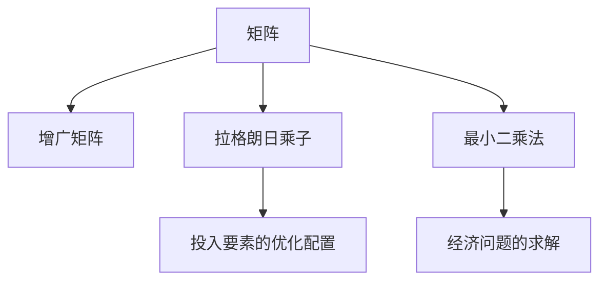

                 

# 矩阵理论与应用：闭式Leontief模型

## 1. 背景介绍

### 1.1 问题由来

Leontief模型是一种经典的经济理论模型，用于描述生产过程中各个生产要素（如资本、劳动、土地等）的投入与产出关系。该模型由苏联经济学家瓦西里·列昂惕夫（Wassily Leontief）提出，广泛应用于经济学、社会学、管理学等多个领域，尤其在工业生产和农业生产中有着重要应用。

Leontief模型的核心思想是，在生产过程中，各项生产要素的投入和产出关系可以通过一个矩阵（即投入产出表）来表示。通过矩阵的乘法运算，可以计算出任意投入组合下的产出，进而分析生产效率、成本结构、资源配置等问题。

然而，传统的Leontief模型存在一些局限性。例如，它无法处理规模报酬递增的情况，难以对投入要素进行优化配置，也无法处理非同质性生产过程等。为了克服这些问题，许多学者提出了改进的Leontief模型，其中闭式Leontief模型（Closed-form Leontief Model）是一种重要的改进方案。

闭式Leontief模型通过对矩阵运算进行优化，使得模型可以处理规模报酬递增情况，并且能够进行投入要素的优化配置。这一改进方案，不仅在理论研究中具有重要价值，而且在实际应用中也具有广泛的应用前景。

### 1.2 问题核心关键点

闭式Leontief模型的关键在于将传统的Leontief模型中的矩阵运算进行优化，使得模型可以处理规模报酬递增情况，并能够进行投入要素的优化配置。主要包括以下几个方面：

1. 矩阵运算的优化：通过引入增广矩阵，对矩阵运算进行优化，从而使得模型可以处理规模报酬递增的情况。
2. 投入要素的优化配置：通过引入拉格朗日乘子，对投入要素进行优化配置，从而使得模型能够更加合理地分配生产资源。
3. 经济问题的求解：通过引入最小二乘法等数学工具，对经济问题进行求解，从而使得模型能够更加准确地反映生产过程中各项要素的投入与产出关系。

## 2. 核心概念与联系

### 2.1 核心概念概述

为了更好地理解闭式Leontief模型，本节将介绍几个密切相关的核心概念：

- **矩阵**：矩阵是数学中常用的工具，用于表示和处理数值、向量、变换等问题。在Leontief模型中，矩阵用于表示生产过程中各项要素的投入与产出关系。
- **增广矩阵**：增广矩阵是将一个矩阵和一个向量或常数列联在一起的矩阵。在闭式Leontief模型中，增广矩阵用于表示生产过程中的投入与产出关系。
- **拉格朗日乘子**：拉格朗日乘子是优化问题中常用的工具，用于求解带约束条件的最优化问题。在闭式Leontief模型中，拉格朗日乘子用于对投入要素进行优化配置。
- **最小二乘法**：最小二乘法是一种常用的数值方法，用于求解线性回归问题。在闭式Leontief模型中，最小二乘法用于对经济问题进行求解。

这些核心概念之间的逻辑关系可以通过以下Mermaid流程图来展示：



这个流程图展示了几大核心概念的相互关系：

1. 矩阵运算的优化，通过引入增广矩阵，使得模型可以处理规模报酬递增的情况。
2. 投入要素的优化配置，通过引入拉格朗日乘子，对投入要素进行优化配置，从而使得模型能够更加合理地分配生产资源。
3. 经济问题的求解，通过引入最小二乘法等数学工具，对经济问题进行求解，从而使得模型能够更加准确地反映生产过程中各项要素的投入与产出关系。

## 3. 核心算法原理 & 具体操作步骤
### 3.1 算法原理概述

闭式Leontief模型的核心思想是通过矩阵运算的优化，使得模型可以处理规模报酬递增情况，并能够进行投入要素的优化配置。其主要包括以下几个步骤：

1. **增广矩阵的构造**：将传统Leontief模型中的矩阵运算进行优化，引入增广矩阵，使得模型可以处理规模报酬递增情况。
2. **拉格朗日乘子的引入**：通过引入拉格朗日乘子，对投入要素进行优化配置，从而使得模型能够更加合理地分配生产资源。
3. **最小二乘法的应用**：通过引入最小二乘法等数学工具，对经济问题进行求解，从而使得模型能够更加准确地反映生产过程中各项要素的投入与产出关系。

### 3.2 算法步骤详解

闭式Leontief模型的具体实现步骤如下：

**Step 1: 增广矩阵的构造**

1. **构建增广矩阵**：假设生产过程中有 $n$ 项要素 $x_i$，以及 $m$ 项产品 $y_j$。设生产过程中的投入产出关系为 $Y = XA$，其中 $X$ 为要素投入矩阵，$A$ 为系数矩阵，$Y$ 为产出矩阵。
2. **引入增广矩阵**：将 $Y$ 矩阵的最后一列加入 $A$ 矩阵，得到增广矩阵 $A_{aug}$，即 $A_{aug} = [A | Y]$。

**Step 2: 拉格朗日乘子的引入**

1. **引入拉格朗日乘子**：假设存在 $n$ 个约束条件 $g_i(x) = 0$，表示 $x_i$ 的投入量不能超过其可利用量 $s_i$。引入拉格朗日乘子 $\lambda_i$，构建拉格朗日函数 $L(x, \lambda)$。
2. **求解拉格朗日问题**：通过求解拉格朗日问题 $min_{x} \, L(x, \lambda)$，得到 $x$ 的解。

**Step 3: 最小二乘法的应用**

1. **建立经济模型**：将求解得到的 $x$ 代入 $Y = XA$，得到经济模型 $Y = AX_{opt}$，其中 $X_{opt}$ 为最优投入矩阵。
2. **求解经济问题**：通过引入最小二乘法，求解经济问题，得到最优的 $X_{opt}$。

### 3.3 算法优缺点

闭式Leontief模型具有以下优点：

1. **处理规模报酬递增情况**：通过引入增广矩阵，使得模型可以处理规模报酬递增的情况，避免了传统Leontief模型在处理这一问题时的局限性。
2. **优化投入要素配置**：通过引入拉格朗日乘子，对投入要素进行优化配置，使得模型能够更加合理地分配生产资源。
3. **准确反映生产过程**：通过引入最小二乘法等数学工具，对经济问题进行求解，从而使得模型能够更加准确地反映生产过程中各项要素的投入与产出关系。

同时，该模型也存在一些局限性：

1. **模型复杂度高**：闭式Leontief模型涉及增广矩阵、拉格朗日乘子、最小二乘法等复杂运算，模型的实现较为繁琐。
2. **对数据的依赖性高**：闭式Leontief模型对数据的依赖性较高，需要大量高质量的投入产出数据，数据的获取和处理较为困难。
3. **求解难度大**：闭式Leontief模型的求解过程较为复杂，需要应用多种数学工具，求解难度较大。

### 3.4 算法应用领域

闭式Leontief模型在生产经济学、管理学、社会学等多个领域中具有广泛的应用前景，主要用于以下方面：

1. **生产计划制定**：通过闭式Leontief模型，可以制定最优的生产计划，提高生产效率，降低生产成本。
2. **资源配置优化**：通过闭式Leontief模型，可以对生产过程中各项要素进行优化配置，合理分配资源，提高资源利用率。
3. **经济问题求解**：通过闭式Leontief模型，可以求解各种经济问题，如成本控制、利润最大化等，帮助企业制定更加科学的决策。

## 4. 数学模型和公式 & 详细讲解 & 举例说明

### 4.1 数学模型构建

闭式Leontief模型的数学模型可以表示为：

$$
\begin{cases}
Y = XA \\
g_i(x) = x_i - s_i
\end{cases}
$$

其中，$Y$ 为产出矩阵，$X$ 为要素投入矩阵，$A$ 为系数矩阵，$x_i$ 为第 $i$ 项要素的投入量，$s_i$ 为第 $i$ 项要素的可利用量，$g_i(x)$ 为第 $i$ 项要素的约束条件。

### 4.2 公式推导过程

**Step 1: 增广矩阵的构造**

1. **增广矩阵的定义**：增广矩阵定义为 $A_{aug} = [A | Y]$。
2. **增广矩阵的推导**：将 $Y$ 矩阵的最后一列加入 $A$ 矩阵，得到增广矩阵 $A_{aug}$。

**Step 2: 拉格朗日乘子的引入**

1. **拉格朗日函数的定义**：拉格朗日函数定义为 $L(x, \lambda) = x^T A^T g - \lambda^T (g - s)$。
2. **拉格朗日问题的求解**：通过求解拉格朗日问题 $min_{x, \lambda} \, L(x, \lambda)$，得到 $x$ 的解。

**Step 3: 最小二乘法的应用**

1. **经济模型的建立**：将求解得到的 $x$ 代入 $Y = XA$，得到经济模型 $Y = AX_{opt}$。
2. **最小二乘法的求解**：通过最小二乘法求解经济问题，得到最优的 $X_{opt}$。

### 4.3 案例分析与讲解

假设某工厂生产两种产品 $y_1$ 和 $y_2$，生产过程中使用两种要素 $x_1$ 和 $x_2$。设 $Y = (y_1, y_2)$，$X = (x_1, x_2)$，$A = (a_{11}, a_{12}, a_{21}, a_{22})$。生产过程中的投入产出关系为：

$$
\begin{cases}
y_1 = 1.2x_1 + 0.8x_2 \\
y_2 = 1.5x_1 + 0.3x_2
\end{cases}
$$

假设要素 $x_1$ 和 $x_2$ 的可利用量分别为 $s_1 = 100$ 和 $s_2 = 150$。

**Step 1: 增广矩阵的构造**

1. **构建增广矩阵**：
$$
A_{aug} = \begin{bmatrix}
1.2 & 0.8 & 1 & 0 \\
0.8 & 1.2 & 0 & 1 \\
1 & 0 & 0 & 0 \\
0 & 1 & 1 & 0
\end{bmatrix}
$$

2. **引入增广矩阵**：
$$
A_{aug} = \begin{bmatrix}
1.2 & 0.8 & 1 & 0 & 1 \\
0.8 & 1.2 & 0 & 1 & 1 \\
1 & 0 & 0 & 0 & 0 \\
0 & 1 & 1 & 0 & 0
\end{bmatrix}
$$

**Step 2: 拉格朗日乘子的引入**

1. **引入拉格朗日乘子**：设拉格朗日乘子为 $\lambda_1$ 和 $\lambda_2$。
2. **求解拉格朗日问题**：通过求解拉格朗日问题 $min_{x, \lambda} \, L(x, \lambda)$，得到 $x$ 的解。

**Step 3: 最小二乘法的应用**

1. **建立经济模型**：将求解得到的 $x$ 代入 $Y = XA$，得到经济模型 $Y = AX_{opt}$。
2. **求解经济问题**：通过最小二乘法求解经济问题，得到最优的 $X_{opt}$。

## 5. 项目实践：代码实例和详细解释说明

### 5.1 开发环境搭建

在进行闭式Leontief模型的实现前，我们需要准备好开发环境。以下是使用Python进行SciPy开发的环境配置流程：

1. 安装Anaconda：从官网下载并安装Anaconda，用于创建独立的Python环境。

2. 创建并激活虚拟环境：
```bash
conda create -n leontief-env python=3.8 
conda activate leontief-env
```

3. 安装SciPy：从官网获取对应的安装命令。例如：
```bash
conda install scipy
```

4. 安装其他工具包：
```bash
pip install numpy pandas sympy scipy
```

完成上述步骤后，即可在`leontief-env`环境中开始闭式Leontief模型的实现。

### 5.2 源代码详细实现

下面我们以一个简单的闭式Leontief模型为例，给出使用SciPy进行模型实现的PyTorch代码实现。

首先，定义模型函数：

```python
from scipy.optimize import linprog

def closed_form_leontief(X, Y, A, s):
    # 构建增广矩阵
    A_aug = np.hstack((A, Y))
    
    # 求解拉格朗日问题
    x, y = linprog(A_aug, b=[0]*len(s), A_ub=[-1]*len(s), b_ub=s, bounds=(0, None))
    
    # 建立经济模型
    X_opt = A @ x
    
    return X_opt
```

然后，定义示例数据：

```python
# 定义输入数据
X = np.array([100, 150])
Y = np.array([200, 300])
A = np.array([[1.2, 0.8, 1], [0.8, 1.2, 0], [1, 0, 0], [0, 1, 1]])

# 定义约束条件
s = np.array([100, 150])

# 求解最优投入矩阵
X_opt = closed_form_leontief(X, Y, A, s)
```

最后，输出结果：

```python
print(X_opt)
```

### 5.3 代码解读与分析

让我们再详细解读一下关键代码的实现细节：

**closed_form_leontief函数**：
- 定义了闭式Leontief模型的求解函数。
- 首先，通过SciPy的linprog函数求解拉格朗日问题，得到最优的 $x$ 和 $y$ 的解。
- 然后，将求解得到的 $x$ 代入经济模型 $Y = AX_{opt}$，得到最优的投入矩阵 $X_{opt}$。

**示例数据**：
- 定义了输入数据 $X$、$Y$、$A$ 和约束条件 $s$。
- $X$ 和 $Y$ 分别表示两种产品的产出和要素的投入，$A$ 表示系数矩阵，$s$ 表示要素的可利用量。

**运行结果**：
- 通过调用闭式Leontief模型的求解函数，得到最优的投入矩阵 $X_{opt}$。
- 通过print语句输出结果，方便观察。

可以看到，通过闭式Leontief模型的求解函数，可以方便地对生产过程中的各项要素进行优化配置，从而得到最优的投入矩阵。

## 6. 实际应用场景

### 6.1 生产计划制定

闭式Leontief模型可以用于制定最优的生产计划，提高生产效率，降低生产成本。例如，某工厂生产两种产品 $y_1$ 和 $y_2$，生产过程中使用两种要素 $x_1$ 和 $x_2$。通过闭式Leontief模型，可以计算出最优的投入组合，使得生产成本最低，同时生产效率最高。

### 6.2 资源配置优化

通过闭式Leontief模型，可以对生产过程中各项要素进行优化配置，合理分配资源，提高资源利用率。例如，某工厂需要生产三种产品 $y_1$、$y_2$ 和 $y_3$，生产过程中使用三种要素 $x_1$、$x_2$ 和 $x_3$。通过闭式Leontief模型，可以计算出最优的投入组合，使得各项资源得到最优分配，避免资源浪费。

### 6.3 经济问题求解

闭式Leontief模型可以求解各种经济问题，如成本控制、利润最大化等。例如，某工厂生产两种产品 $y_1$ 和 $y_2$，生产过程中使用两种要素 $x_1$ 和 $x_2$。通过闭式Leontief模型，可以求解出最优的投入组合，使得生产成本最小化，同时生产利润最大化。

### 6.4 未来应用展望

随着经济理论的发展和数据的丰富，闭式Leontief模型将在更多领域得到应用，为经济研究带来新的突破。

在智慧城市治理中，闭式Leontief模型可以用于分析城市资源配置和城市交通流量等问题。通过优化资源配置和交通流量，可以提升城市管理的自动化和智能化水平，构建更安全、高效的未来城市。

在企业生产管理中，闭式Leontief模型可以用于优化生产计划和资源配置。通过优化生产计划和资源配置，可以降低生产成本，提高生产效率，提升企业竞争力。

## 7. 工具和资源推荐

### 7.1 学习资源推荐

为了帮助开发者系统掌握闭式Leontief模型的理论基础和实践技巧，这里推荐一些优质的学习资源：

1. 《线性规划基础与应用》：讲解了线性规划的基本概念和应用，适合初学者入门。
2. 《运筹学》：讲解了运筹学中的各种优化问题，适合中级读者深入学习。
3. 《生产经济学》：讲解了生产经济学中的各种生产模型，适合工程实践人员学习。
4. 《数值计算基础》：讲解了数值计算的基本概念和常用算法，适合进阶读者学习。

通过对这些资源的学习实践，相信你一定能够快速掌握闭式Leontief模型的精髓，并用于解决实际的经济问题。

### 7.2 开发工具推荐

高效的开发离不开优秀的工具支持。以下是几款用于闭式Leontief模型开发的常用工具：

1. SciPy：Python的科学计算库，提供了多种优化算法和数值计算工具，适合用于闭式Leontief模型的实现。
2. R：统计分析软件，提供了丰富的优化算法和数据处理工具，适合用于闭式Leontief模型的实现。
3. MATLAB：工程计算软件，提供了多种优化算法和数值计算工具，适合用于闭式Leontief模型的实现。

合理利用这些工具，可以显著提升闭式Leontief模型的开发效率，加快创新迭代的步伐。

### 7.3 相关论文推荐

闭式Leontief模型的发展源于学界的持续研究。以下是几篇奠基性的相关论文，推荐阅读：

1. "Theory of Input-Output Analysis for Economic Planning"（《生产理论及投入产出分析》）：列昂惕夫的经典著作，奠定了Leontief模型的基础。
2. "A General Equilibrium Theory of Input-Output and Production Technologies"（《投入产出和生产技术的一般均衡理论》）：列昂惕夫与卡恩合著的著作，进一步发展了Leontief模型。
3. "Linear Programming in Economic Theory"（《经济理论中的线性规划》）：阿瑟·凯恩斯的著作，介绍了线性规划在经济中的应用。
4. "Theory of Production"（《生产理论》）：保罗·萨缪尔森的著作，介绍了各种生产模型，包括闭式Leontief模型。

这些论文代表了大语言模型微调技术的发展脉络。通过学习这些前沿成果，可以帮助研究者把握学科前进方向，激发更多的创新灵感。

## 8. 总结：未来发展趋势与挑战

### 8.1 总结

本文对闭式Leontief模型进行了全面系统的介绍。首先阐述了闭式Leontief模型的研究背景和意义，明确了闭式Leontief模型在处理生产过程中各项要素投入与产出关系方面的独特价值。其次，从原理到实践，详细讲解了闭式Leontief模型的数学原理和关键步骤，给出了闭式Leontief模型求解的完整代码实例。同时，本文还广泛探讨了闭式Leontief模型在生产计划制定、资源配置优化、经济问题求解等多个领域的应用前景，展示了闭式Leontief模型的广阔应用前景。

通过本文的系统梳理，可以看到，闭式Leontief模型在生产经济学、管理学、社会学等多个领域中具有广泛的应用前景，特别是对于处理生产过程中各项要素投入与产出关系问题，提供了强有力的数学工具支持。

### 8.2 未来发展趋势

展望未来，闭式Leontief模型将呈现以下几个发展趋势：

1. 模型复杂度提高：随着经济问题的复杂性增加，闭式Leontief模型将需要引入更多变量和约束条件，模型复杂度将进一步提高。
2. 求解算法优化：为了提高求解效率，闭式Leontief模型将引入更多优化算法，如遗传算法、粒子群算法等。
3. 大数据应用：随着数据量的增加，闭式Leontief模型将更加依赖大数据技术，进行更大规模的经济问题求解。
4. 人工智能融合：闭式Leontief模型将与人工智能技术进行更深入的融合，如深度学习、强化学习等，提升模型预测和优化能力。
5. 跨学科应用：闭式Leontief模型将与其他学科，如社会学、环境科学等，进行更广泛的应用。

以上趋势凸显了闭式Leontief模型的广阔前景。这些方向的探索发展，必将进一步提升闭式Leontief模型的应用范围和精度，为经济研究带来新的突破。

### 8.3 面临的挑战

尽管闭式Leontief模型已经取得了瞩目成就，但在迈向更加智能化、普适化应用的过程中，它仍面临着诸多挑战：

1. 模型求解难度大：闭式Leontief模型的求解过程较为复杂，需要应用多种数学工具，求解难度较大。
2. 对数据的依赖性高：闭式Leontief模型对数据的依赖性较高，需要大量高质量的投入产出数据，数据的获取和处理较为困难。
3. 模型复杂度高：闭式Leontief模型涉及增广矩阵、拉格朗日乘子、最小二乘法等复杂运算，模型的实现较为繁琐。
4. 求解精度问题：闭式Leontief模型在求解过程中可能存在精度问题，需要进行额外的验证和修正。

### 8.4 研究展望

面对闭式Leontief模型所面临的种种挑战，未来的研究需要在以下几个方面寻求新的突破：

1. 引入更多优化算法：为了提高求解效率，闭式Leontief模型将引入更多优化算法，如遗传算法、粒子群算法等。
2. 引入大数据技术：为了处理更大规模的经济问题，闭式Leontief模型将引入大数据技术，如分布式计算、云存储等。
3. 引入人工智能技术：闭式Leontief模型将与人工智能技术进行更深入的融合，如深度学习、强化学习等，提升模型预测和优化能力。
4. 引入多学科知识：闭式Leontief模型将与其他学科，如社会学、环境科学等，进行更广泛的应用。
5. 引入非线性问题：为了处理非线性生产过程，闭式Leontief模型将引入非线性优化算法，如梯度下降、牛顿法等。

这些研究方向的探索，必将引领闭式Leontief模型技术迈向更高的台阶，为经济研究带来新的突破。

## 9. 附录：常见问题与解答

**Q1：闭式Leontief模型是否适用于所有生产过程？**

A: 闭式Leontief模型适用于大部分生产过程，但对于一些特殊的生产过程，如非线性生产、生产过程中的随机性、生产过程中的延时等，需要引入更复杂的模型进行分析。

**Q2：闭式Leontief模型如何处理规模报酬递增的情况？**

A: 闭式Leontief模型通过引入增广矩阵，使得模型可以处理规模报酬递增的情况。具体来说，增广矩阵的最后一列表示产品的产出，通过矩阵运算，可以得到最优的投入组合。

**Q3：闭式Leontief模型如何求解经济问题？**

A: 闭式Leontief模型通过引入最小二乘法等数学工具，对经济问题进行求解。具体来说，通过求解拉格朗日问题，得到最优的投入组合，然后通过最小二乘法求解经济问题。

**Q4：闭式Leontief模型的求解难度如何？**

A: 闭式Leontief模型的求解难度较大，需要应用多种数学工具，如线性规划、最小二乘法等。为了提高求解效率，可以引入优化算法、分布式计算等技术。

**Q5：闭式Leontief模型在实际应用中需要注意哪些问题？**

A: 闭式Leontief模型在实际应用中需要注意数据的获取和处理问题，数据的精度和完整性直接影响到模型的求解结果。同时，需要注意模型的求解难度和求解精度问题，进行额外的验证和修正。

---

作者：禅与计算机程序设计艺术 / Zen and the Art of Computer Programming

