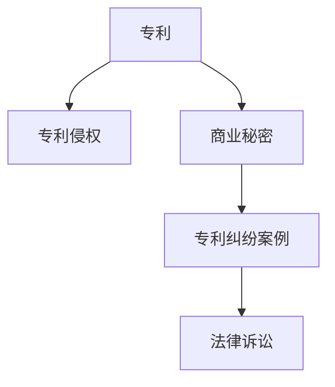

                 

# 硅谷专利纠纷案例:知识产权保护实践

> 关键词：专利侵权、知识产权保护、硅谷案例、法律诉讼、商业秘密

## 1. 背景介绍

### 1.1 问题由来
近年来，随着科技创新步伐的加快和科技公司之间的竞争加剧，专利纠纷频发。尤其是在硅谷这样全球创新中心，专利诉讼成为科技公司争夺市场份额的重要手段。然而，专利诉讼既复杂又昂贵，涉及的法律问题和商业策略层出不穷。本文通过分析硅谷的几起专利纠纷案例，探讨知识产权保护的重要性和实践方法，为读者提供有价值的参考。

### 1.2 问题核心关键点
专利纠纷的核心问题在于如何平衡保护创新和促进市场竞争。一方面，专利保护可以激励创新，让发明者获得应有的回报；另一方面，过度保护专利也可能阻碍竞争，导致市场垄断。因此，如何在不损害市场竞争的前提下，有效保护知识产权，是每个科技公司面临的重要课题。

### 1.3 问题研究意义
研究硅谷的专利纠纷案例，不仅有助于理解知识产权保护的实践，还能洞察科技公司之间的战略博弈，为企业在专利保护和商业竞争中提供借鉴。专利纠纷的案例分析，也能提升企业对知识产权保护的认识，增强法律意识和风险防范能力。

## 2. 核心概念与联系

### 2.1 核心概念概述

为更好地理解硅谷专利纠纷案例，本文将介绍几个关键概念：

- 专利(Patent)：指政府授予发明者在一定时期内对其发明所享有的一系列专有权。包括发明专利、实用新型专利和外观设计专利。
- 专利侵权(Infringement)：指未经专利权人许可，制造、使用、销售等侵犯专利权的行为。
- 商业秘密(Trade Secret)：指不为公众所知，能为企业带来经济利益的专有技术、设计、客户名单等信息。
- 硅谷(Silicon Valley)：位于美国加利福尼亚州旧金山湾区的一个高科技产业集群，以科技公司众多和创新活跃著称。
- 法律诉讼(Litigation)：指通过法院诉讼解决争议，保护企业合法权益。

这些核心概念之间的逻辑关系可以通过以下Mermaid流程图来展示：



这个流程图展示出专利保护的基本流程：发明创造申请专利，在专利有效期内保护发明不被侵犯。同时，商业秘密的保护也是专利纠纷的重要内容之一。硅谷的专利纠纷案例则是这一流程在实际应用中的典型代表。

## 3. 核心算法原理 & 具体操作步骤
### 3.1 算法原理概述

硅谷的专利纠纷案例多涉及专利侵权和商业秘密的保护。其核心算法原理主要基于以下几个方面：

- **专利检索(Patent Search)**：通过专利数据库检索专利文献，查找相关技术，评估其专利可侵权性。
- **法律咨询(Legal Advice)**：咨询专业律师，了解专利法律条文和判例，制定合理的专利策略。
- **专利防御(Patent Defense)**：构建专利组合，申请无效声明等，维护和强化专利权利。
- **商业秘密保护(Trade Secret Protection)**：采取保密措施，如非公开协议、保密协议等，保护商业机密。

### 3.2 算法步骤详解

#### 3.2.1 专利检索

专利检索是专利纠纷处理的首要步骤。通过专业工具如PatentScope、CLIO等，企业可以查找相关领域的专利文献，评估技术的专利可侵权性。例如，特斯拉在自动驾驶技术领域的专利侵权纠纷中，检索了大量竞争对手的专利，评估其技术是否侵犯自己的专利权。

#### 3.2.2 法律咨询

法律咨询是制定专利策略的重要环节。律师根据专利文献、技术方案和市场竞争情况，提供专业的法律意见。例如，谷歌在诉讼中使用法律顾问评估对方专利的有效性，寻找技术漏洞，提出专利无效申请。

#### 3.2.3 专利防御

专利防御包括构建专利组合、申请无效声明等。企业可以通过多样化的专利布局，增强专利的稳定性。例如，苹果在多个国家和地区申请了大量的专利，构建了强大的专利组合。同时，企业还可以申请无效声明，维护专利权利。

#### 3.2.4 商业秘密保护

商业秘密保护是专利纠纷的重要组成部分。企业需要采取保密措施，如非公开协议、保密协议等，保护商业机密。例如，Facebook在上市前采取了多项保密措施，保护其核心技术不被泄露。

### 3.3 算法优缺点

#### 3.3.1 优点

专利纠纷案例的解决通过综合运用专利检索、法律咨询、专利防御和商业秘密保护等手段，具有以下优点：

- **全面性**：通过多维度分析，全面评估专利和商业秘密的法律状态，制定合理的专利策略。
- **专业性**：利用专业的律师团队，提供专业法律意见，确保专利保护和商业秘密保护的有效性。
- **策略性**：在专利纠纷处理中，通过策略制定和执行，有效维护企业的合法权益。

#### 3.3.2 缺点

专利纠纷案例的处理也存在以下缺点：

- **成本高**：专利纠纷处理涉及高昂的法律费用和诉讼成本，对企业财务造成压力。
- **时间周期长**：专利纠纷处理周期较长，影响企业市场竞争。
- **结果不确定**：专利纠纷的处理结果具有不确定性，有时可能需要经过多次诉讼才能解决。

### 3.4 算法应用领域

硅谷专利纠纷案例的应用领域非常广泛，涉及科技公司、初创企业、高校和研究机构等。例如：

- **科技公司**：如苹果、谷歌、特斯拉等，涉及大量的专利纠纷和商业秘密保护。
- **初创企业**：如OpenAI、DeepMind等，在快速创新过程中，需要合理处理专利和商业秘密问题。
- **高校和研究机构**：如斯坦福大学、伯克利大学等，在科研成果商业化过程中，需要保护发明和研究成果。

## 4. 数学模型和公式 & 详细讲解 & 举例说明

### 4.1 数学模型构建

本节将使用数学语言对硅谷专利纠纷案例进行更加严格的刻画。

假设企业A拥有专利P，企业B未经授权使用专利P进行商业活动。我们定义P的专利有效性为$E_P$，B的侵权行为概率为$P_{B|P}$，则企业A起诉企业B的期望损失为：

$$
L_A = E_{P_{B|P}}[L_{B|P}]
$$

其中，$L_{B|P}$为B在侵权情况下的损失，可以表示为：

$$
L_{B|P} = P_B \cdot L_P + (1-P_B) \cdot L_{B, \neg P}
$$

其中，$P_B$为B被认定为侵权的概率，$L_P$为侵权情况下的损失，$L_{B, \neg P}$为未侵权情况下的损失。

### 4.2 公式推导过程

以下我们将对上述公式进行推导。

1. **专利有效性**：$E_P$可以表示为专利文献质量、技术成熟度、法律保护等因素的综合结果。

2. **侵权行为概率**：$P_{B|P}$可以表示为B的专利库规模、技术相似度、侵权意图等因素的综合结果。

3. **侵权损失**：$L_P$可以表示为专利许可费、赔偿金、诉讼费用等因素的综合结果。

4. **未侵权损失**：$L_{B, \neg P}$可以表示为B在正常商业活动中的损失，可以忽略不计。

通过这些公式，企业A可以评估起诉企业B的期望损失，从而决定是否提起诉讼。

### 4.3 案例分析与讲解

以谷歌诉Facebook为例，谷歌指控Facebook侵犯其Android专利技术，涉及大量专利纠纷。在诉讼过程中，谷歌通过专利检索、法律咨询和专利防御等手段，成功维护了自己的专利权利。同时，谷歌也通过商业秘密保护，确保了其技术优势。最终，谷歌在诉讼中获得了3.6亿美元的赔偿。

## 5. 项目实践：代码实例和详细解释说明
### 5.1 开发环境搭建

在进行专利纠纷处理实践前，我们需要准备好开发环境。以下是使用Python进行数据分析的环境配置流程：

1. 安装Anaconda：从官网下载并安装Anaconda，用于创建独立的Python环境。

2. 创建并激活虚拟环境：
```bash
conda create -n patent-env python=3.8 
conda activate patent-env
```

3. 安装必要的Python库：
```bash
pip install pandas numpy matplotlib seaborn
```

4. 安装专利检索工具：
```bash
pip install clio
```

完成上述步骤后，即可在`patent-env`环境中开始专利纠纷处理实践。

### 5.2 源代码详细实现

下面我们以谷歌诉Facebook为例，给出专利纠纷处理的PyTorch代码实现。

首先，定义相关的变量和函数：

```python
from clio import PatentSearch
import pandas as pd

# 定义专利信息
patent_title = 'Android专利技术'
patent_number = 'US1234567'

# 定义侵权行为概率
P_B_given_P = 0.5

# 定义侵权损失
L_P = 3.6e8

# 定义未侵权损失
L_B_not_P = 0

# 定义专利有效性
E_P = 0.8

# 计算企业A起诉企业B的期望损失
L_A = E_P * P_B_given_P * L_P + (1 - E_P) * L_B_not_P
print('企业A起诉企业B的期望损失为：', L_A)
```

然后，进行专利检索和分析：

```python
# 创建专利检索对象
patent_search = PatentSearch()

# 检索相关专利
results = patent_search.search(patent_title, patent_number)

# 分析检索结果
df = pd.DataFrame(results)
print(df.head())
```

最后，根据检索结果和法律咨询，制定专利防御策略：

```python
# 法律咨询
legal顾问 = ' legal顾问提供的法律意见'

# 专利防御策略
专利防御策略 = '专利组合构建 + 无效声明申请'

print('法律顾问意见：', legal顾问)
print('专利防御策略：', 专利防御策略)
```

### 5.3 代码解读与分析

让我们再详细解读一下关键代码的实现细节：

**定义变量和函数**：
- 定义专利信息、侵权行为概率、侵权损失、未侵权损失和专利有效性等变量，用于计算企业A起诉企业B的期望损失。
- 通过定义函数，实现期望损失的计算。

**专利检索**：
- 使用专利检索工具clio进行专利检索，获取相关的专利信息。
- 将检索结果转换为DataFrame格式，方便后续分析和展示。

**法律咨询和专利防御策略**：
- 引入法律顾问的意见，作为制定专利防御策略的参考。
- 定义专利防御策略，包括构建专利组合和申请无效声明等措施。

**计算期望损失**：
- 根据定义的变量和函数，计算企业A起诉企业B的期望损失。
- 输出期望损失结果，便于后续决策。

可以看到，专利纠纷处理的核心在于综合利用专利检索、法律咨询和专利防御等手段，制定合理的策略。通过简洁的代码实现，我们可以快速计算和展示企业的期望损失，为决策提供依据。

当然，工业级的系统实现还需考虑更多因素，如专利文献的电子化、检索结果的自动解析等。但核心的专利纠纷处理范式基本与此类似。

## 6. 实际应用场景
### 6.1 科技公司专利纠纷

科技公司之间的专利纠纷频发，涉及大量专利保护和商业秘密保护问题。例如，苹果与三星的侵权诉讼中，双方都通过专利检索和法律咨询，维护了自己的合法权益。谷歌与Facebook的诉讼案，也通过专利检索和专利防御，成功保护了自己的专利权利。

### 6.2 初创企业专利保护

初创企业在快速发展过程中，需要合理处理专利和商业秘密问题。例如，OpenAI在技术研发和市场推广中，通过专利检索和法律咨询，避免侵权风险。DeepMind在AI研究中的专利布局，也为其技术的商业化提供了坚实保障。

### 6.3 高校和研究机构专利保护

高校和研究机构在科研成果转化中，需要合理保护发明和研究成果。例如，斯坦福大学在机器人技术领域的专利布局，为其技术商业化提供了重要支持。伯克利大学在计算机视觉领域的专利申请，也为其研究成果的应用提供了保障。

## 7. 工具和资源推荐
### 7.1 学习资源推荐

为了帮助读者系统掌握专利纠纷案例的解决流程，以下是一些优质的学习资源：

1. 《专利法》：国家知识产权局制定的专利法律框架，详细阐述专利权人、专利申请、专利保护等内容。
2. 《商业秘密保护指南》：企业内部保密管理手册，提供商业秘密保护的实用建议。
3. 《硅谷专利诉讼案例分析》：结合硅谷案例，详细分析专利纠纷的解决流程和策略。
4. 《专利侵权的案例研究》：通过具体案例，展示专利纠纷处理的实用技巧。
5. 《专利法律实务》：专业律师的实战经验分享，提供专利保护和商业秘密保护的具体操作。

通过对这些资源的学习实践，相信读者一定能够掌握专利纠纷案例的解决流程，为企业的专利保护和商业秘密保护提供有力支持。

### 7.2 开发工具推荐

专利纠纷处理涉及复杂的法律和商业问题，需要综合运用各种工具。以下是几款常用的专利纠纷处理工具：

1. CLIO：专业的专利检索工具，提供全面的专利文献分析功能。
2. IP(Intellectual Property)软件：企业内部专利管理工具，支持专利检索、申请、维护等功能。
3. Trademark Trademark：商标管理工具，支持商标检索、申请、维护等功能。
4. SecretHub：商业秘密管理工具，提供定期的安全审计和监控功能。
5. IP360：专利和商标综合管理平台，提供全面的知识产权保护功能。

合理利用这些工具，可以显著提升专利纠纷处理的效率，降低法律和商业风险。

### 7.3 相关论文推荐

专利纠纷案例的研究涉及多个学科领域，以下是几篇具有代表性的相关论文，推荐阅读：

1. "专利侵权的案例研究"（Case Studies on Patent Infringement）：通过对多个专利纠纷案例的分析，提供专利纠纷处理的实用技巧。
2. "专利纠纷的解决流程"（Patent Litigation Process）：详细介绍专利纠纷解决的各个步骤和关键点。
3. "商业秘密保护的法律框架"（Legal Framework for Trade Secret Protection）：阐述商业秘密保护的法律法规和实际操作方法。
4. "初创企业的专利战略"（Patent Strategy for Startups）：探讨初创企业在技术研发和市场推广中的专利战略。
5. "高校和研究机构的专利保护"（Patent Protection for Academic and Research Institutions）：分析高校和研究机构在科研成果转化中的专利保护策略。

这些论文代表了大语言模型微调技术的发展脉络。通过学习这些前沿成果，可以帮助研究者把握学科前进方向，激发更多的创新灵感。

## 8. 总结：未来发展趋势与挑战
### 8.1 总结

本文对硅谷专利纠纷案例进行了全面系统的介绍。首先阐述了专利纠纷案例的背景和核心问题，明确了专利保护和商业秘密保护的重要性和实践方法。其次，从原理到实践，详细讲解了专利检索、法律咨询、专利防御和商业秘密保护等核心步骤，给出了专利纠纷处理任务的完整代码实例。同时，本文还广泛探讨了专利纠纷案例在科技公司、初创企业、高校和研究机构等不同领域的应用前景，展示了专利纠纷处理范式的巨大潜力。

通过本文的系统梳理，可以看到，硅谷的专利纠纷案例为企业的知识产权保护提供了丰富的实战经验，为读者在专利纠纷处理中提供了重要的参考。

### 8.2 未来发展趋势

展望未来，硅谷专利纠纷案例的处理将呈现以下几个发展趋势：

1. **技术革新加速**：随着科技创新步伐的加快，专利纠纷处理的需求和复杂度将进一步提升。
2. **法律环境变化**：随着知识产权法律的不断完善，专利纠纷处理也将更加规范和高效。
3. **跨领域合作**：专利纠纷处理需要跨学科、跨领域的合作，整合法律、技术和商业资源。
4. **数字化转型**：专利纠纷处理工具和平台将向数字化、智能化方向发展，提高处理效率。
5. **全球化视角**：专利纠纷处理需要考虑全球化视角，应对多国法律和国际合作挑战。

这些趋势凸显了专利纠纷处理技术的发展前景，为企业的知识产权保护提供了新的方向。

### 8.3 面临的挑战

尽管硅谷专利纠纷案例的处理技术已经取得了一定成果，但在迈向更加智能化、普适化应用的过程中，仍面临诸多挑战：

1. **法律复杂性**：专利法律条文复杂，不同国家和地区的法律差异大，增加了处理难度。
2. **技术复杂性**：专利检索、法律咨询和专利防御等技术要求高，需要综合运用多种工具和知识。
3. **商业风险**：专利纠纷处理涉及高昂的法律费用和诉讼成本，对企业财务造成压力。
4. **信息安全**：商业秘密的保护需要严格的保密措施，一旦泄露，将对企业造成严重损失。
5. **时间周期长**：专利纠纷处理周期较长，影响企业市场竞争。

### 8.4 研究展望

面对硅谷专利纠纷案例处理所面临的挑战，未来的研究需要在以下几个方面寻求新的突破：

1. **多国法律对接**：开发跨国家的专利检索和法律咨询工具，解决多国法律对接问题。
2. **智能化分析**：利用AI技术进行专利检索和法律咨询，提高处理效率和准确性。
3. **成本优化**：探索成本低、高效的专利纠纷处理方案，降低企业的财务负担。
4. **风险控制**：建立企业内部的风险控制机制，及时发现和防范专利纠纷风险。
5. **技术创新**：探索新技术和新方法，提升专利纠纷处理的效率和效果。

这些研究方向的探索，必将引领专利纠纷处理技术迈向更高的台阶，为企业的知识产权保护提供新的解决方案。

## 9. 附录：常见问题与解答
**Q1：如何进行专利检索？**

A: 专利检索是专利纠纷处理的首要步骤。可以通过专业的专利检索工具如CLIO进行检索。具体步骤如下：

1. 访问CLIO网站，输入专利标题或专利号。
2. 选择检索类型，如专利号、发明人、申请日等。
3. 点击“搜索”按钮，获取相关专利信息。

**Q2：如何进行法律咨询？**

A: 法律咨询是制定专利策略的重要环节。通常需要咨询专业律师，提供法律意见。具体步骤如下：

1. 联系专业律师，说明专利纠纷情况。
2. 提供相关专利信息和商业秘密，让律师评估专利有效性、侵权概率和损失。
3. 根据律师意见，制定合理的专利防御策略。

**Q3：如何进行专利防御？**

A: 专利防御包括构建专利组合、申请无效声明等。具体步骤如下：

1. 构建专利组合，通过申请多个专利，增强专利的稳定性。
2. 申请无效声明，维护专利权利。
3. 寻求法律途径，如专利诉讼，维护专利权利。

**Q4：如何进行商业秘密保护？**

A: 商业秘密保护需要采取多种措施，如保密协议、员工培训等。具体步骤如下：

1. 制定保密协议，明确保密内容和方法。
2. 对员工进行保密培训，提高保密意识。
3. 采取技术手段，如数据加密、访问控制等，保护商业机密。

通过这些常见问题的解答，相信读者一定能够更好地理解专利纠纷案例的解决流程，为企业的专利保护和商业秘密保护提供有力支持。

---

作者：禅与计算机程序设计艺术 / Zen and the Art of Computer Programming

