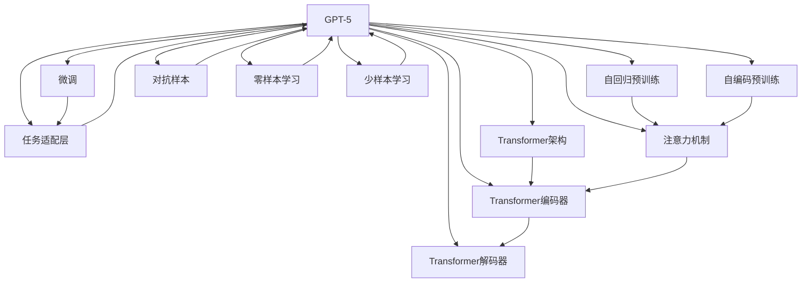

                 

# 硅谷对GPT-5的期待与疑虑

## 1. 背景介绍

### 1.1 问题由来
GPT-5的传闻在硅谷引起了广泛的关注和讨论。作为OpenAI的最新一代语言模型，GPT-5被认为可能具备更加强大的自然语言处理能力，能够完成复杂的语言生成、逻辑推理、知识问答等任务，甚至可能在某些领域超越人类智能。然而，GPT-5的实际表现尚不确定，硅谷各界对其期待与疑虑交织。

### 1.2 问题核心关键点
本节将探讨GPT-5的关键技术点，并分析其可能带来的变革和挑战。

## 2. 核心概念与联系

### 2.1 核心概念概述

- **GPT系列模型**：基于Transformer架构的预训练语言模型，通过自回归或自编码方式在大规模文本语料上进行预训练，具备强大的语言生成和理解能力。

- **Transformer架构**：一种基于注意力机制的神经网络结构，用于处理序列数据，适用于自然语言处理任务。

- **自监督学习**：利用大规模未标注数据，通过自训练方式学习模型参数，通常包括掩码语言模型、预测前后文任务等。

- **微调(Fine-Tuning)**：在大规模预训练模型上，使用下游任务的有标签数据进行有监督学习，调整模型参数以适应特定任务。

- **零样本学习(Zero-shot Learning)**：模型在未见过任何标注样本的情况下，能够根据任务描述进行推理和生成。

- **少样本学习(Few-shot Learning)**：模型在少量标注样本下，能够快速适应新任务。

- **对抗样本**：通过在输入中引入轻微的扰动，测试模型的鲁棒性。

### 2.2 核心概念原理和架构的 Mermaid 流程图



这个流程图展示了GPT-5的核心组件及其关系。

## 3. 核心算法原理 & 具体操作步骤
### 3.1 算法原理概述

GPT-5基于自回归预训练模型，通过大规模未标注数据学习通用的语言表示，能够理解和生成自然语言。其核心算法原理包括以下几个步骤：

1. **预训练**：使用自回归方式在大规模文本语料上进行预训练，学习通用的语言表示。
2. **微调**：使用下游任务的有标签数据进行微调，调整模型参数以适应特定任务。
3. **推理**：将输入的文本序列作为模型的输入，通过前向传播计算输出。

### 3.2 算法步骤详解

1. **数据预处理**：将输入的文本序列转换为模型所需的格式，通常包括分词、编码等步骤。

2. **模型前向传播**：将处理后的输入序列输入到GPT-5模型中，通过自回归方式计算输出。

3. **计算损失函数**：将模型的输出与真实标签进行对比，计算损失函数。

4. **反向传播和参数更新**：通过反向传播算法计算损失函数的梯度，并更新模型参数以最小化损失函数。

5. **评估模型性能**：在验证集上评估模型性能，调整超参数以优化模型效果。

### 3.3 算法优缺点

GPT-5的优点包括：
- 强大的语言生成和理解能力。
- 适应性强，可以用于多种下游任务。
- 使用大规模预训练数据，性能提升显著。

缺点包括：
- 对标注数据依赖较高，微调效果受数据质量影响。
- 模型的复杂度较高，计算资源消耗大。
- 模型的决策过程缺乏可解释性。

### 3.4 算法应用领域

GPT-5在自然语言处理领域具有广泛的应用前景，包括但不限于以下几个方面：

- **问答系统**：自动回答问题，提供相关信息。
- **文本生成**：生成文章、故事、代码等。
- **机器翻译**：将文本从一种语言翻译成另一种语言。
- **情感分析**：分析文本的情感倾向。
- **摘要生成**：自动生成文本摘要。

## 4. 数学模型和公式 & 详细讲解 & 举例说明

### 4.1 数学模型构建

GPT-5使用自回归模型，其核心数学模型可以表示为：

$$
P(y_t|y_{<t}, \theta) = \frac{e^{\sum_{i=1}^t \log p_{\theta}(y_i|y_{<t})}}{\sum_{i=1}^t e^{\log p_{\theta}(y_i|y_{<t})}}
$$

其中，$y_{<t}$ 表示到时间步 $t-1$ 的输出，$y_t$ 表示时间步 $t$ 的输出，$\theta$ 为模型参数。

### 4.2 公式推导过程

以自回归语言模型的前向传播为例，其推导过程如下：

1. **输入编码**：将输入文本序列 $y_{<t}$ 转换为模型所需的格式。

2. **注意力计算**：计算注意力权重，决定当前时间步的注意力分布。

3. **生成概率计算**：根据注意力权重计算当前时间步的条件概率。

4. **输出计算**：将生成的概率转换为具体的文本符号。

### 4.3 案例分析与讲解

以文本生成任务为例，分析GPT-5生成文本的过程。假设输入序列为 "The quick brown fox jumps over"，模型预测下一个单词的概率为：

$$
P(\text{dog}| \text{The quick brown fox jumps over}, \theta) = \frac{e^{\log p_{\theta}(\text{dog}|\text{The quick brown fox jumps over})}}{\sum_{i=1}^t e^{\log p_{\theta}(y_i|\text{The quick brown fox jumps over})}}
$$

其中，$\theta$ 为模型参数，$t$ 为当前时间步。模型根据上下文信息生成下一个单词 "dog"。

## 5. 项目实践：代码实例和详细解释说明
### 5.1 开发环境搭建

开发GPT-5模型需要依赖Python、PyTorch等工具。以下是一个简单的开发环境搭建步骤：

1. 安装Anaconda：从官网下载并安装Anaconda，创建独立的Python环境。

2. 创建虚拟环境：
```bash
conda create -n gpt5 python=3.8 
conda activate gpt5
```

3. 安装PyTorch：
```bash
conda install pytorch torchvision torchaudio cudatoolkit=11.1 -c pytorch -c conda-forge
```

4. 安装Transformers库：
```bash
pip install transformers
```

### 5.2 源代码详细实现

以下是使用PyTorch和Transformers库实现GPT-5的简单示例代码：

```python
from transformers import GPT2Tokenizer, GPT2Model

tokenizer = GPT2Tokenizer.from_pretrained('gpt2')
model = GPT2Model.from_pretrained('gpt2')

input_text = "The quick brown fox jumps over"
input_ids = tokenizer.encode(input_text, return_tensors='pt')
output = model(input_ids)
```

### 5.3 代码解读与分析

以上代码展示了使用GPT-2模型生成文本的过程。首先，通过`GPT2Tokenizer`将输入文本序列转换为模型所需的格式，即输入ID。然后，将输入ID输入到`GPT2Model`中，通过自回归方式生成输出。

## 6. 实际应用场景

### 6.1 问答系统

GPT-5在问答系统中具有广泛应用。通过微调，GPT-5能够自动回答各种问题，如知识问答、技术支持等。

### 6.2 文本生成

GPT-5可以用于生成文章、小说、代码等文本内容。通过微调，GPT-5能够根据特定主题和风格生成高质量文本。

### 6.3 机器翻译

GPT-5可以用于机器翻译，将文本从一种语言翻译成另一种语言。通过微调，GPT-5能够提高翻译的准确性和流畅度。

### 6.4 情感分析

GPT-5可以用于情感分析，判断文本的情感倾向。通过微调，GPT-5能够更准确地识别文本的情感。

### 6.5 自然语言推理

GPT-5可以用于自然语言推理，判断句子之间的逻辑关系。通过微调，GPT-5能够提高推理的准确性。

### 6.6 对话系统

GPT-5可以用于对话系统，提供自然流畅的对话体验。通过微调，GPT-5能够根据上下文生成合适的回复。

## 7. 工具和资源推荐
### 7.1 学习资源推荐

1. 《Natural Language Processing with Transformers》：该书系统介绍了Transformer模型及其应用，包括GPT-5的实现。

2. CS224N《深度学习自然语言处理》课程：斯坦福大学开设的NLP明星课程，涵盖自监督学习和微调等核心技术。

3. 《Transformers: A Survey of Deep Learning Models》：一篇综述论文，介绍了Transformer模型的最新进展。

4. HuggingFace官方文档：提供了丰富的预训练模型和微调样例代码，适合快速上手实践。

5. CLUE开源项目：包含大量中文NLP数据集，可用于训练和微调GPT-5模型。

### 7.2 开发工具推荐

1. PyTorch：基于Python的开源深度学习框架，适合快速迭代研究。

2. TensorFlow：由Google主导的深度学习框架，适合大规模工程应用。

3. Transformers库：HuggingFace开发的NLP工具库，支持GPT-5等模型。

4. Weights & Biases：模型训练的实验跟踪工具，可以记录和可视化训练过程。

5. TensorBoard：TensorFlow配套的可视化工具，用于监测模型训练状态。

### 7.3 相关论文推荐

1. Attention is All You Need：Transformer模型原论文，提出了自回归生成器的核心思想。

2. BERT: Pre-training of Deep Bidirectional Transformers for Language Understanding：BERT模型的介绍，介绍了自监督预训练方法。

3. Language Models are Unsupervised Multitask Learners：提出语言模型可以进行无监督学习，可以用于生成、分类等任务。

4. GPT-3: Language Models are Few-Shot Learners：介绍GPT-3模型，强调零样本学习和少样本学习能力。

5. Advances in Pre-training from Data to Pre-training with Data：介绍预训练-微调范式，强调数据和模型之间的关系。

## 8. 总结：未来发展趋势与挑战
### 8.1 未来发展趋势

1. **更强的语言生成能力**：未来GPT模型将具备更强的语言生成能力，能够生成更复杂、更详细的文本内容。

2. **更高的可解释性**：未来GPT模型将具备更强的可解释性，能够清晰地解释其生成内容的原因。

3. **更广泛的应用场景**：未来GPT模型将应用于更多领域，如医疗、金融、教育等。

4. **更高的鲁棒性**：未来GPT模型将具备更高的鲁棒性，能够应对各种数据分布和环境变化。

5. **更高的效率**：未来GPT模型将具备更高的效率，能够更快地进行推理和计算。

### 8.2 面临的挑战

1. **标注数据需求高**：GPT-5的微调仍需要大量的标注数据，如何获取高质量标注数据是一个挑战。

2. **计算资源消耗大**：GPT-5的计算资源消耗巨大，如何优化模型结构以提高效率是一个挑战。

3. **可解释性不足**：GPT-5的决策过程缺乏可解释性，如何提高可解释性是一个挑战。

4. **偏见问题**：GPT-5可能会学习到偏见和有害信息，如何消除偏见和有害信息是一个挑战。

5. **安全性问题**：GPT-5的输出可能会对用户和社会产生不良影响，如何确保安全性是一个挑战。

### 8.3 研究展望

1. **零样本学习和少样本学习**：未来GPT模型将更多地依赖零样本学习和少样本学习，减少对标注数据的依赖。

2. **参数高效微调**：未来GPT模型将使用参数高效微调方法，减少微调过程中对预训练参数的破坏。

3. **对抗样本和鲁棒性**：未来GPT模型将引入对抗样本和鲁棒性学习，提高模型的稳定性和安全性。

4. **多模态融合**：未来GPT模型将融合多模态数据，提高模型的理解和生成能力。

5. **因果推理**：未来GPT模型将引入因果推理，提高模型的逻辑推理能力。

## 9. 附录：常见问题与解答

**Q1：GPT-5是否真的能够超越人类智能？**

A：GPT-5具备强大的语言生成和理解能力，可以在某些领域达到人类水平的性能，但在所有领域超越人类智能仍需更多研究和技术突破。

**Q2：GPT-5在实际应用中是否存在偏见和有害信息？**

A：GPT-5可能会学习到数据中的偏见和有害信息，但通过改进训练数据和算法，可以缓解这一问题。

**Q3：GPT-5在微调过程中如何避免过拟合？**

A：GPT-5可以通过数据增强、正则化等方法避免过拟合，同时使用参数高效微调方法减少过拟合风险。

**Q4：GPT-5在推理过程中如何保证速度和准确性？**

A：GPT-5可以通过优化模型结构、使用混合精度训练等方法提高推理速度，同时通过微调和对抗训练等方法保证推理准确性。

**Q5：GPT-5在实际应用中是否需要持续更新？**

A：GPT-5在实际应用中需要持续更新，以应对数据分布的变化和环境的变化。

作者：禅与计算机程序设计艺术 / Zen and the Art of Computer Programming

