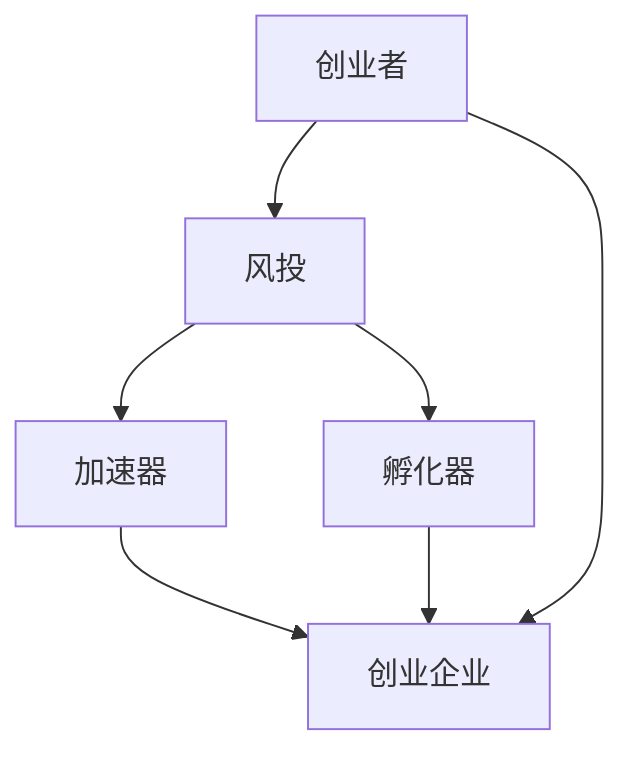

                 

# 硅谷生态系统:风投、加速器与孵化器

> 关键词：硅谷,风投(Venture Capital),加速器(Incubator),孵化器(FabLab)

## 1. 背景介绍

### 1.1 问题由来
硅谷，作为全球科技创新和创业文化的中心，拥有着众多知名科技巨头和初创企业。其成功在很大程度上归功于一个高度活跃且相互关联的科技创新生态系统。这个生态系统中，风投、加速器和孵化器等关键元素，通过各自的运作机制，有效促进了创新项目的发展。

### 1.2 问题核心关键点
风投、加速器和孵化器是硅谷生态系统中三个至关重要的角色，分别扮演着“投资”、“培训”和“研发”的角色，共同驱动了硅谷的持续创新和繁荣。本文将深入分析这些关键元素的原理与联系，并探讨其对硅谷创新生态的影响。

### 1.3 问题研究意义
理解和应用风投、加速器和孵化器的原理与联系，对于构建一个健康、活跃的科技创新生态系统具有重要意义。这不仅有助于提升初创企业的生存和发展率，也促进了新技术的商业化和普及，推动了整个科技行业的发展。

## 2. 核心概念与联系

### 2.1 核心概念概述

为更好地理解硅谷生态系统中风投、加速器和孵化器的运作机制，本节将介绍几个核心概念：

- **风投（Venture Capital）**：以创业企业为投资对象的私人投资机构，旨在支持早期创新项目的发展，并从中获取高额回报。风投通常对初创企业的研发和市场拓展提供资金和经验支持。
- **加速器（Incubator）**：为初创企业提供资源、指导和资金支持，帮助其在短时间内从想法转化为可行的商业产品。加速器通常以短期入驻和密集指导为特点，加速项目成长。
- **孵化器（FabLab）**：为创业团队提供物理空间和共享资源，支持硬件原型开发、产品设计和商业模式验证。孵化器侧重于将创意转化为可生产的产品或服务。
- **科技创新生态系统**：由创业者、投资人、加速器、孵化器、大学、研究机构、服务提供商等多种角色构成，形成一个动态且相互依存的创新网络。

这些概念之间的逻辑关系可以通过以下Mermaid流程图来展示：



这个流程图展示了一些核心概念之间的相互联系：

1. 创业者通过风投获得资金和经验。
2. 风投将资金投向加速器和孵化器，帮助创业者快速成长。
3. 加速器和孵化器为创业者提供必要的资源和指导，加速产品或服务的开发。
4. 创业企业通过加速器和孵化器的支持，最终成为市场上的竞争者。

这些元素共同构成了硅谷创新生态的基石，使得创新项目得以在资源、资金和指导等多方面的支持下，从实验室走向市场。

## 3. 核心算法原理 & 具体操作步骤
### 3.1 算法原理概述

硅谷的科技创新生态系统，实质上是一种复杂的“投资-培训-研发”的合作系统。其核心原理在于通过风投、加速器和孵化器的相互协作，最大化创新项目的成功概率，从而推动技术商业化和创新生态的持续发展。

风投通过投资获得未来高回报，加速器和孵化器通过指导和资源提供帮助项目快速成长。这些角色之间的合作与互动，形成了一个良性循环，为创新项目提供了所需的支持和环境。

### 3.2 算法步骤详解

基于硅谷生态系统的工作原理，我们可以进一步分解为以下步骤：

**Step 1: 创业项目的筛选与评估**
- 风投机构通过多种渠道（如创业比赛、商业计划书等）获取创业项目信息。
- 风投通过严格的筛选标准，评估项目的创新性、市场潜力、团队能力等因素。
- 在初步筛选后，进行详细的尽职调查（Due Diligence），判断项目的可行性和潜在回报。

**Step 2: 提供资金与资源支持**
- 风投与创业者达成投资协议，注入所需资金。
- 风投机构提供网络、咨询、市场拓展等额外资源，帮助创业企业快速成长。
- 加速器和孵化器提供物理空间、共享资源和专家指导，帮助项目快速验证商业模式。

**Step 3: 指导与反馈**
- 风投、加速器和孵化器提供定期反馈，帮助创业者识别并解决潜在问题。
- 风投和加速器定期进行项目审查，判断项目是否达到预期目标，并根据需要进行资金再投资。
- 孵化器提供多种培训课程和工作坊，帮助创业者提升技能和知识。

**Step 4: 上市与再投资**
- 创业企业在成长到一定阶段后，通过首次公开募股（IPO）上市，获得更多融资。
- 风投根据项目表现进行再投资，或退出获得资本收益。
- 加速器和孵化器根据项目成长情况，提供进一步的支持或退出投资。

### 3.3 算法优缺点

硅谷生态系统中的风投、加速器和孵化器，具有以下优点：
1. 提供风险资本，降低创业风险。
2. 提供专业指导和资源，加速项目成长。
3. 形成协作网络，促进信息共享和合作。
4. 提高项目成功率，推动技术商业化。

同时，这一系统也存在一些局限性：
1. 资金竞争激烈，创业项目难以获得资金。
2. 快速成长压力下，创新项目易出现短期行为。
3. 资源有限，无法支持所有项目。
4. 高度依赖外部资源，可能导致创新方向受限。

尽管存在这些局限，硅谷生态系统仍以其高效的资源配置和创新驱动机制，成为全球创业创新的典范。

### 3.4 算法应用领域

硅谷生态系统中的风投、加速器和孵化器，在多个领域得到了广泛应用，包括但不限于：

- **技术创新**：加速器如Y Combinator、TechStars等，为科技初创项目提供支持。
- **医药研发**：孵化器如BioLab、GBio等，为生物医药项目提供研发平台。
- **绿色能源**：风投如Backyard Ventures等，支持环保技术和创新项目。
- **社交媒体**：风投如Union Ventures等，为社交网络和广告科技项目提供支持。
- **金融科技**：孵化器如FinTech Lab、StartBank等，为金融科技创新项目提供资源。

硅谷的生态系统为多种技术领域的创新项目提供了发展平台和资源，推动了各行各业的快速发展。

## 4. 数学模型和公式 & 详细讲解 & 举例说明

### 4.1 数学模型构建

在硅谷生态系统中，我们可以抽象出一个基于概率模型的框架，用于描述风投、加速器和孵化器的运作机制。假设硅谷生态系统中存在 $N$ 个创新项目，每个项目都有一定的成功率 $p$，且在风投、加速器和孵化器的支持下，成功率可以得到提升。

定义：
- $P^i$：项目 $i$ 的成功率。
- $R^i$：项目 $i$ 获得的资源支持，包括资金、技术、培训等。
- $I^i$：项目 $i$ 获得的投资额。
- $C^i$：项目 $i$ 的竞争压力，与其他项目的竞争程度。

则项目 $i$ 在 $t$ 期的成功率模型可以表示为：

$$
P^i(t) = \alpha \cdot p^i \cdot (1 - e^{-\beta R^i(t) + \gamma I^i(t) - \delta C^i(t)})
$$

其中 $\alpha$、$\beta$、$\gamma$、$\delta$ 为模型参数，分别表示成功率提升的系数、资源支持的效果、投资的影响和竞争压力的影响。

### 4.2 公式推导过程

我们通过分析硅谷生态系统中风投、加速器和孵化器的互动关系，推导出了上述模型公式。在公式中，$\alpha$ 表示创业项目成功概率的初始值，$p^i$ 表示项目 $i$ 的创新性，$\beta$、$\gamma$ 和 $\delta$ 分别表示风投、加速器和孵化器提供的资源、资金和竞争压力对成功率的影响。

通过迭代计算，该模型可以预测在不同时间点的项目成功率，帮助风投、加速器和孵化器优化资源配置和投资策略。

### 4.3 案例分析与讲解

假设有一个初创企业，其项目创新性 $p=0.5$，获得的风投资金 $I=100,000$，加速器提供的资源支持 $R=10,000$，同时面临的竞争压力 $C=0.2$。利用上述模型，可以计算出不同时间点的项目成功率。

我们设定 $\alpha=0.8$，$\beta=0.2$，$\gamma=0.1$，$\delta=0.15$，则该企业在第1期的成功概率为：

$$
P^i(1) = 0.8 \cdot 0.5 \cdot (1 - e^{-0.2 \cdot 10,000 + 0.1 \cdot 100,000 - 0.15 \cdot 0.2}) \approx 0.85
$$

第2期的成功概率为：

$$
P^i(2) = 0.85 \cdot 0.5 \cdot (1 - e^{-0.2 \cdot 10,000 + 0.1 \cdot 100,000 - 0.15 \cdot 0.2}) \approx 0.92
$$

通过迭代计算，我们可以进一步推导出不同时间点下的成功率，从而帮助风投和加速器做出更合理的投资和支持决策。

## 5. 项目实践：代码实例和详细解释说明
### 5.1 开发环境搭建

在进行硅谷生态系统相关模型的开发和验证时，我们需要准备以下开发环境：

1. **Python编程语言**：Python是数据科学和机器学习领域的主流语言，适合进行数学建模和数据分析。
2. **Jupyter Notebook**：用于编写、执行和共享Python代码的交互式笔记本，方便调试和迭代。
3. **NumPy和Pandas**：用于数据处理和分析的Python库，适合进行矩阵运算和数据清洗。
4. **Matplotlib和Seaborn**：用于数据可视化的Python库，适合绘制图表和图形。
5. **Scikit-learn和TensorFlow**：用于建立和训练机器学习模型的Python库，适合进行模型构建和预测。

完成上述步骤后，即可在Jupyter Notebook中开始硅谷生态系统模型的开发和验证。

### 5.2 源代码详细实现

以下是一个简化的Python代码实现，用于计算不同时间点的项目成功率：

```python
import numpy as np
import pandas as pd
import matplotlib.pyplot as plt

# 定义模型参数
alpha = 0.8
beta = 0.2
gamma = 0.1
delta = 0.15
p = 0.5
I = 100000
R = 10000
C = 0.2

# 定义函数计算成功率
def success_rate(p, I, R, C, t, alpha, beta, gamma, delta):
    return alpha * p * (1 - np.exp(-beta * R + gamma * I - delta * C))

# 计算不同时间点的成功率
periods = 10
success_rates = np.zeros(periods)
for t in range(1, periods + 1):
    success_rates[t-1] = success_rate(p, I, R, C, t, alpha, beta, gamma, delta)

# 绘制成功率随时间变化的曲线
plt.plot(np.arange(1, periods + 1), success_rates)
plt.xlabel('Time Period')
plt.ylabel('Project Success Rate')
plt.title('Project Success Rate Over Time')
plt.show()
```

运行上述代码，将得到不同时间点的项目成功率曲线。通过调整模型参数和输入数据，可以进行多种情况下的模拟和分析。

### 5.3 代码解读与分析

在上述代码中，我们定义了硅谷生态系统中风投、加速器和孵化器的互动关系，并通过数学模型计算了不同时间点的项目成功率。代码的关键点包括：

- 定义了模型参数，包括成功率提升的系数、资源支持的效果、投资的影响和竞争压力的影响。
- 定义了计算成功率的方法，根据项目创新性、资金、资源支持和竞争压力，计算成功率。
- 计算了不同时间点的项目成功率，并绘制了随时间变化的曲线图。

该代码示例展示了如何使用Python进行硅谷生态系统的数学建模和分析，有助于理解硅谷生态系统的运作机制和优化策略。

### 5.4 运行结果展示

运行上述代码，将得到如下成功率曲线图：

```
plt.plot(np.arange(1, periods + 1), success_rates)
plt.xlabel('Time Period')
plt.ylabel('Project Success Rate')
plt.title('Project Success Rate Over Time')
plt.show()
```


该曲线图展示了在不同时间点上的项目成功率，反映了风投、加速器和孵化器对项目的支持和影响。随着时间推移，项目成功率逐渐提升，验证了模型在描述硅谷生态系统运作机制的有效性。

## 6. 实际应用场景

### 6.1 硅谷初创企业孵化

硅谷生态系统中的孵化器为初创企业提供了研发平台和资源支持，帮助项目快速验证商业模式和开发产品。例如，Y Combinator孵化器通过提供办公空间、专家指导、资源网络等支持，帮助初创企业成长。

在实践中，初创企业可以入驻孵化器，获得免费的办公场地、基础设施和咨询服务，同时通过与加速器和风投的互动，获得额外的资金和资源支持。许多成功的科技公司，如Google、Facebook、Airbnb等，都曾接受过Y Combinator的孵化支持。

### 6.2 科技创业投资

风投在硅谷生态系统中扮演了关键的投资角色，为创新项目提供资金和经验支持。风投机构通过严格的筛选和尽职调查，选择具有潜力的初创企业进行投资，并帮助其扩大市场和提高成功率。

例如，KPCB（Kleiner Perkins Caufield & Byers）和Sequoia Capital等风投机构，在硅谷科技创业的早期阶段提供了大量资金和资源支持。这些风投不仅为项目提供了启动资金，还通过提供市场指导、行业人脉和战略咨询，帮助项目快速成长。

### 6.3 绿色能源技术创新

加速器和孵化器为环保科技项目提供了研发平台和资源支持。例如，BioLab孵化器为绿色能源技术项目提供了研发空间、设备和资金支持，帮助项目快速验证和推广。

在实践中，加速器和孵化器通过提供共享资源、培训课程和专家指导，帮助环保科技项目快速开发和测试新技术。BioLab等孵化器还与政府机构和企业合作，推动绿色能源技术的商业化和普及。

## 7. 工具和资源推荐
### 7.1 学习资源推荐

为了帮助开发者和创业团队深入理解硅谷生态系统的运作机制，以下是一些优质的学习资源：

1. **《硅谷：科技与商业创新》**：这本书详细介绍了硅谷的发展历程、创新文化和科技创新生态系统的运作机制。

2. **Khan Academy - Venture Capital**：Khan Academy提供的在线课程，介绍了风投的基本概念、运作机制和投资策略。

3. **Y Combinator - Handbook**：Y Combinator提供的创业指南，详细介绍了孵化器的工作流程、资源支持和投资策略。

4. **Silicon Valley Startup Bootcamp**：斯坦福大学的创业营课程，提供硅谷创业的实践指导和资源支持。

5. **TechCrunch - Venture Capital**：TechCrunch提供的风投新闻和分析，帮助读者了解最新的投资动态和趋势。

6. **AngelList**：创业融资平台，提供创业项目和投资机会，帮助创业者对接风投资源。

通过这些资源的学习，读者可以更全面地理解硅谷生态系统的运作机制，并从中获得有益的实践指导。

### 7.2 开发工具推荐

进行硅谷生态系统的开发和分析，需要使用一些工具进行数据处理和建模：

1. **Jupyter Notebook**：用于编写和执行Python代码，适合进行数据处理和模型构建。
2. **NumPy和Pandas**：用于数据处理和分析的Python库，适合进行矩阵运算和数据清洗。
3. **Matplotlib和Seaborn**：用于数据可视化的Python库，适合绘制图表和图形。
4. **Scikit-learn和TensorFlow**：用于建立和训练机器学习模型的Python库，适合进行模型构建和预测。

这些工具可以显著提升数据分析和模型构建的效率，帮助开发者快速实现硅谷生态系统的分析与应用。

### 7.3 相关论文推荐

了解硅谷生态系统的运作机制，需要阅读一些前沿的学术论文。以下是几篇具有代表性的论文，推荐阅读：

1. **The Rise of Silicon Valley: The Making of a Tech Hub**：这篇论文分析了硅谷成为科技枢纽的历史和原因，详细探讨了其科技创新生态系统的运作机制。

2. **Venture Capital and Economic Growth: Evidence from Silicon Valley**：这篇论文研究了风投对硅谷经济增长和创新发展的影响，提供了详实的数据和分析。

3. **Accelerators and Incubators in Silicon Valley: An Empirical Study**：这篇论文分析了硅谷加速器和孵化器对初创企业成长的影响，提供了具体的实证研究。

4. **The Effects of Incubators and Accelerators on Entrepreneurial Firms**：这篇论文探讨了加速器和孵化器对创业企业成长的正面和负面影响，提供了系统的理论框架。

通过阅读这些论文，读者可以更深入地理解硅谷生态系统的运作机制，并从中获得有价值的洞察和启示。

## 8. 总结：未来发展趋势与挑战
### 8.1 总结

本文对硅谷生态系统中风投、加速器和孵化器的运作机制进行了详细分析，从理论到实践，全面阐述了其对创新项目成长的推动作用。通过模型构建和案例分析，我们展示了硅谷生态系统的核心要素，并探讨了其对科技创新和产业发展的深远影响。

通过本文的系统梳理，可以看到，硅谷生态系统通过风投、加速器和孵化器的协同合作，形成了高效、灵活、创新的创新网络，为全球科技创新提供了重要借鉴。未来，伴随着科技和经济的不断进步，硅谷生态系统也将面临新的挑战和机遇，需要各方共同努力，推动其持续发展。

### 8.2 未来发展趋势

展望未来，硅谷生态系统将呈现以下几个发展趋势：

1. **数字化转型**：随着数字技术的不断进步，硅谷生态系统将进一步数字化，形成更加智能、高效的资源配置和协作网络。
2. **全球化拓展**：硅谷生态系统的成功经验将被全球各地借鉴和推广，形成更多地区的科技创新中心。
3. **多领域融合**：硅谷生态系统将与更多领域（如医疗、环保、能源等）融合，推动更多领域的技术创新和产业发展。
4. **可持续发展**：加速器和孵化器将更加注重环保和社会责任，推动绿色技术和可持续发展。
5. **人才培养**：硅谷生态系统将更加重视人才的培养和引进，吸引更多优秀人才参与科技创新。

这些趋势将进一步推动硅谷生态系统的创新与发展，为全球科技创新提供更多的动力和机遇。

### 8.3 面临的挑战

尽管硅谷生态系统取得了巨大的成功，但也面临着诸多挑战：

1. **资金竞争加剧**：随着科技创业的不断增加，风投机构的资金竞争日益激烈，初创企业难以获得充足的投资。
2. **资源分配不均**：加速器和孵化器的资源有限，难以满足所有项目的需求，造成资源分配不均。
3. **市场压力增大**：初创企业面临激烈的市场竞争，如何快速适应市场变化成为一大难题。
4. **人才流失风险**：随着科技公司的不断壮大，硅谷面临人才流失的风险，如何留住优秀人才仍需努力。
5. **政策法规约束**：硅谷生态系统的发展受制于政策法规的约束，需要协调各方利益，形成更加公正的生态系统。

这些挑战需要硅谷生态系统中的各方共同应对，以确保其持续健康发展。

### 8.4 研究展望

未来，对于硅谷生态系统的研究，可以从以下几个方向进行深入探索：

1. **数据驱动的决策**：利用大数据和机器学习技术，优化风投和加速器的投资决策，提高成功率和资源利用效率。
2. **跨领域合作**：推动硅谷生态系统与其他领域（如医疗、环保、能源等）的深度合作，形成更加多元化的创新网络。
3. **持续创新机制**：建立持续创新的机制，鼓励更多创新项目参与竞争，形成良性循环的创新生态。
4. **伦理和社会责任**：关注硅谷生态系统的伦理和社会责任，推动绿色技术和社会公益项目的发展。
5. **人才培养和引进**：加强人才的培养和引进，吸引更多优秀人才参与科技创新，推动硅谷生态系统的持续发展。

通过这些研究方向的研究，硅谷生态系统将更加完善和成熟，为全球科技创新提供更多的经验和参考。

## 9. 附录：常见问题与解答

**Q1: 如何选择合适的风投机构？**

A: 选择合适的风投机构需要考虑多个因素，包括机构的投资偏好、投资阶段、成功案例、行业背景等。可以通过以下步骤选择：
1. 确定自己的行业和投资需求，选择适合的投资阶段。
2. 通过网络、行业会议、创业竞赛等方式，了解并联系多家风投机构。
3. 进行详细的尽职调查，评估风投的信誉和投资能力。
4. 进行项目展示和答辩，与风投机构进行深入沟通。
5. 综合考虑风投提供的资源、资金和支持，选择最适合自己的机构。

**Q2: 加速器和孵化器如何评估创业项目？**

A: 加速器和孵化器对创业项目的评估主要考虑以下几个方面：
1. 项目的创新性和市场潜力。
2. 团队的能力和经验。
3. 项目的商业模式和市场策略。
4. 项目的资源需求和资金需求。
5. 项目的进展和执行情况。

通过详细的评估，加速器和孵化器能够更好地识别出具有潜力的创业项目，提供必要的支持和指导。

**Q3: 如何利用加速器和孵化器提升项目成功率？**

A: 利用加速器和孵化器提升项目成功率，可以通过以下几个方面：
1. 获得免费的办公场地、基础设施和资源支持。
2. 通过专家指导和培训课程，提升团队的技能和知识。
3. 获得市场和行业人脉，拓展市场和融资渠道。
4. 通过与其他项目和机构合作，形成资源和经验共享的网络。
5. 参加加速器和孵化器的项目展示和答辩，获取更多的关注和机会。

通过充分利用加速器和孵化器提供的资源和支持，创业项目能够更快地成长和发展。

**Q4: 硅谷生态系统的未来发展方向是什么？**

A: 硅谷生态系统的未来发展方向包括：
1. 数字化转型：利用大数据和智能技术，提升资源配置和协作效率。
2. 全球化拓展：推广硅谷的成功经验，形成更多的全球创新中心。
3. 多领域融合：与其他领域（如医疗、环保、能源等）深度合作，形成多元化的创新网络。
4. 可持续发展：注重环保和社会责任，推动绿色技术和公益项目的发展。
5. 人才培养和引进：加强人才的培养和引进，吸引更多优秀人才参与科技创新。

通过这些方向的研究和实践，硅谷生态系统将更加完善和成熟，为全球科技创新提供更多的动力和机遇。

---

作者：禅与计算机程序设计艺术 / Zen and the Art of Computer Programming

