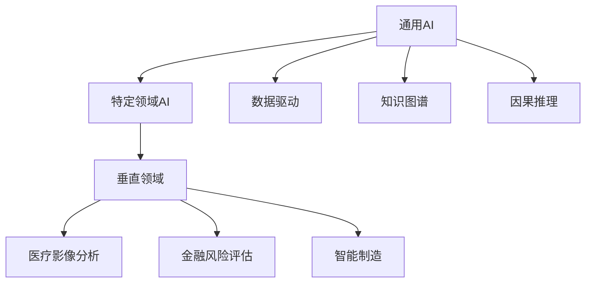

                 

# 硅谷的多元化发展：AI企业创新，探索垂直领域独特价值

## 1. 背景介绍

### 1.1 问题由来

近年来，人工智能（AI）技术飞速发展，硅谷作为全球创新中心，吸引了大量AI企业在此集聚。这些企业不仅在通用AI领域取得了显著成果，还在多个垂直领域中探索出独特价值。然而，尽管AI在各个垂直领域中应用广泛，但其在数据获取、模型训练、业务落地等方面仍存在诸多挑战。

### 1.2 问题核心关键点

AI在垂直领域的应用中，核心关键点在于如何将通用AI技术有效落地，并在特定领域中取得突破。具体来说，包括：

- **数据获取**：各垂直领域的数据类型和规模差异较大，如何高效、安全地获取高质量数据是首要挑战。
- **模型训练**：不同领域的数据特点和业务逻辑不同，如何在特定领域训练高质量模型是关键。
- **业务落地**：如何将AI模型无缝集成到具体的业务流程中，并保证模型的可靠性和可解释性。

### 1.3 问题研究意义

研究AI在垂直领域的应用，对于推动AI技术的广泛落地，加速各行各业的数字化转型，具有重要意义：

- **降低应用成本**：通用AI技术在特定领域的应用，可以大幅降低开发和部署成本，加速业务创新。
- **提升业务效率**：AI技术能够自动化处理复杂任务，提高生产力和服务质量。
- **实现个性化服务**：AI可以根据用户行为和偏好，提供量身定制的服务，提升用户体验。
- **推动业务创新**：AI技术可以开拓新的业务模式和应用场景，助力企业竞争力的提升。

## 2. 核心概念与联系

### 2.1 核心概念概述

为了更好地理解AI在垂直领域的应用，本节将介绍几个关键概念：

- **通用AI（General AI）**：指能够完成任何人类能够完成的智能任务的人工智能，如回答问题、进行自然语言理解等。
- **特定领域AI（Domain-Specific AI）**：指针对特定领域（如医疗、金融、制造业等）的AI应用，强调对领域数据的深度理解和利用。
- **垂直领域（Vertical Industry）**：指在特定行业内应用AI技术，如医疗领域的医疗影像分析、金融领域的风险评估等。
- **数据驱动（Data-Driven）**：指基于数据的机器学习和深度学习模型训练，强调数据对模型效果的影响。
- **知识图谱（Knowledge Graph）**：指通过关系图谱的方式，组织和表示领域知识，辅助AI模型进行推理和决策。
- **因果推理（Causal Inference）**：指基于因果关系的推理方法，帮助AI模型理解输入输出之间的因果关系。

这些概念之间的联系可以通过以下Mermaid流程图来展示：



这个流程图展示了通用AI、特定领域AI、垂直领域之间的逻辑关系：

1. 通用AI是特定领域AI的基础，可以提供通用的智能能力。
2. 特定领域AI聚焦于特定垂直领域，对领域数据进行深度理解和应用。
3. 垂直领域强调特定行业的应用，如医疗影像、金融风险、智能制造等。
4. 数据驱动和因果推理是AI模型的核心技术，帮助模型更好地理解和预测输入输出关系。

这些概念共同构成了AI技术在垂直领域应用的基础框架，帮助AI模型更好地适应特定领域的需求。

## 3. 核心算法原理 & 具体操作步骤

### 3.1 算法原理概述

AI在垂直领域的应用，主要基于以下算法原理：

1. **迁移学习（Transfer Learning）**：通过预训练模型在特定领域进行微调，快速提升模型性能。
2. **微调（Fine-Tuning）**：在特定领域数据上进行微调，优化模型参数，使其更好地适应特定任务。
3. **自监督学习（Self-Supervised Learning）**：利用未标注数据进行预训练，提升模型的泛化能力。
4. **因果推理（Causal Inference）**：通过因果关系指导模型预测，提高模型的可靠性和可解释性。
5. **模型压缩与加速（Model Compression & Acceleration）**：通过剪枝、量化等技术，减小模型规模，提高推理速度。
6. **数据增强（Data Augmentation）**：通过数据生成技术，扩充训练数据集，提升模型鲁棒性。

### 3.2 算法步骤详解

AI在垂直领域的应用，主要分为以下几个步骤：

1. **数据收集与预处理**：收集特定领域的标注数据，进行数据清洗和预处理，确保数据质量和多样性。
2. **模型选择与预训练**：选择合适的通用预训练模型，在其上进行迁移学习或自监督学习。
3. **模型微调与优化**：在特定领域数据上对模型进行微调，并应用优化算法提升模型性能。
4. **模型评估与部署**：在验证集上评估模型性能，进行必要的调整后，部署到实际业务场景中。
5. **监控与迭代**：持续监控模型性能，根据实际反馈进行模型迭代和优化。

### 3.3 算法优缺点

AI在垂直领域的应用，具有以下优点：

- **快速部署**：利用预训练模型，可以大幅减少模型训练时间，加速模型部署。
- **泛化能力强**：预训练模型具备较强的泛化能力，能够更好地适应不同领域的数据。
- **节省成本**：利用迁移学习和微调技术，可以降低模型训练和数据标注的成本。
- **效果显著**：在特定领域数据上微调模型，能够显著提升模型性能，取得更好的效果。

同时，也存在一些缺点：

- **数据依赖**：模型的效果很大程度上取决于数据的质量和数量，数据获取成本较高。
- **领域特定**：通用AI模型在特定领域可能无法完全适用，需要针对领域进行优化。
- **复杂性高**：模型构建和优化过程复杂，需要深厚的技术积累和丰富的经验。
- **风险管理**：AI模型在应用过程中可能存在偏见和歧视问题，需要加强风险管理。

### 3.4 算法应用领域

AI在垂直领域的应用，涵盖了多个行业，如医疗、金融、制造业、农业等。具体应用包括：

- **医疗影像分析**：通过AI模型对医学影像进行自动标注、疾病诊断等。
- **金融风险评估**：利用AI模型进行信用评分、欺诈检测等。
- **智能制造**：通过AI模型优化生产流程、预测设备故障等。
- **智能农业**：利用AI模型进行作物识别、病虫害检测等。
- **智能客服**：利用AI模型提供自然语言理解和自动回复等。

这些应用展示了AI技术在垂直领域中的广泛应用，推动了各行业的数字化转型和创新发展。

## 4. 数学模型和公式 & 详细讲解

### 4.1 数学模型构建

本节将使用数学语言对AI在垂直领域的应用进行更加严格的刻画。

假设垂直领域的数据集为 $D=\{(x_i, y_i)\}_{i=1}^N, x_i \in \mathcal{X}, y_i \in \mathcal{Y}$，其中 $x_i$ 为输入，$y_i$ 为输出标签。设预训练模型为 $M_{\theta_0}$，在特定领域数据集 $D$ 上进行微调后的模型为 $M_{\theta}$。

定义模型的损失函数为：

$$
\mathcal{L}(\theta) = \frac{1}{N} \sum_{i=1}^N \ell(M_{\theta}(x_i),y_i)
$$

其中 $\ell$ 为损失函数，$\theta$ 为模型参数。

微调的目标是最小化经验风险，即：

$$
\theta^* = \mathop{\arg\min}_{\theta} \mathcal{L}(\theta)
$$

使用梯度下降等优化算法，更新模型参数 $\theta$：

$$
\theta \leftarrow \theta - \eta \nabla_{\theta}\mathcal{L}(\theta)
$$

其中 $\eta$ 为学习率，$\nabla_{\theta}\mathcal{L}(\theta)$ 为损失函数对参数 $\theta$ 的梯度。

### 4.2 公式推导过程

以二分类任务为例，推导交叉熵损失函数及其梯度的计算公式。

设模型 $M_{\theta}$ 在输入 $x$ 上的输出为 $\hat{y}=M_{\theta}(x)$，则二分类交叉熵损失函数定义为：

$$
\ell(M_{\theta}(x),y) = -[y\log \hat{y} + (1-y)\log (1-\hat{y})]
$$

代入经验风险公式，得：

$$
\mathcal{L}(\theta) = -\frac{1}{N}\sum_{i=1}^N [y_i\log M_{\theta}(x_i)+(1-y_i)\log(1-M_{\theta}(x_i))]
$$

根据链式法则，损失函数对参数 $\theta_k$ 的梯度为：

$$
\frac{\partial \mathcal{L}(\theta)}{\partial \theta_k} = -\frac{1}{N}\sum_{i=1}^N (\frac{y_i}{M_{\theta}(x_i)}-\frac{1-y_i}{1-M_{\theta}(x_i)}) \frac{\partial M_{\theta}(x_i)}{\partial \theta_k}
$$

其中 $\frac{\partial M_{\theta}(x_i)}{\partial \theta_k}$ 可进一步递归展开，利用自动微分技术完成计算。

### 4.3 案例分析与讲解

以医疗影像分析为例，分析AI在垂直领域中的应用。

假设模型 $M_{\theta}$ 在输入 $x$ 上的输出为 $\hat{y}=M_{\theta}(x)$，表示图像中包含某种疾病的概率。真实标签 $y \in \{0,1\}$。则二分类交叉熵损失函数定义为：

$$
\ell(M_{\theta}(x),y) = -[y\log \hat{y} + (1-y)\log (1-\hat{y})]
$$

将其代入经验风险公式，得：

$$
\mathcal{L}(\theta) = -\frac{1}{N}\sum_{i=1}^N [y_i\log M_{\theta}(x_i)+(1-y_i)\log(1-M_{\theta}(x_i))]
$$

根据链式法则，损失函数对参数 $\theta_k$ 的梯度为：

$$
\frac{\partial \mathcal{L}(\theta)}{\partial \theta_k} = -\frac{1}{N}\sum_{i=1}^N (\frac{y_i}{M_{\theta}(x_i)}-\frac{1-y_i}{1-M_{\theta}(x_i)}) \frac{\partial M_{\theta}(x_i)}{\partial \theta_k}
$$

在得到损失函数的梯度后，即可带入参数更新公式，完成模型的迭代优化。重复上述过程直至收敛，最终得到适应特定领域任务的最优模型参数 $\theta^*$。

## 5. 项目实践：代码实例和详细解释说明

### 5.1 开发环境搭建

在进行垂直领域AI应用开发前，我们需要准备好开发环境。以下是使用Python进行TensorFlow开发的环境配置流程：

1. 安装Anaconda：从官网下载并安装Anaconda，用于创建独立的Python环境。

2. 创建并激活虚拟环境：
```bash
conda create -n tf-env python=3.8 
conda activate tf-env
```

3. 安装TensorFlow：根据CUDA版本，从官网获取对应的安装命令。例如：
```bash
conda install tensorflow tensorflow-gpu -c conda-forge
```

4. 安装TensorBoard：
```bash
pip install tensorboard
```

5. 安装各类工具包：
```bash
pip install numpy pandas scikit-learn matplotlib tqdm jupyter notebook ipython
```

完成上述步骤后，即可在`tf-env`环境中开始AI开发实践。

### 5.2 源代码详细实现

下面我们以医疗影像分析为例，给出使用TensorFlow对特定领域AI模型进行训练的代码实现。

首先，定义模型和数据集：

```python
import tensorflow as tf
from tensorflow.keras.datasets import cifar10
from tensorflow.keras.models import Sequential
from tensorflow.keras.layers import Dense, Flatten, Conv2D, MaxPooling2D

# 加载CIFAR-10数据集
(x_train, y_train), (x_test, y_test) = cifar10.load_data()

# 数据预处理
x_train = x_train / 255.0
x_test = x_test / 255.0

# 构建模型
model = Sequential()
model.add(Conv2D(32, (3, 3), activation='relu', input_shape=(32, 32, 3)))
model.add(MaxPooling2D((2, 2)))
model.add(Conv2D(64, (3, 3), activation='relu'))
model.add(MaxPooling2D((2, 2)))
model.add(Flatten())
model.add(Dense(10, activation='softmax'))

# 编译模型
model.compile(optimizer='adam', loss='categorical_crossentropy', metrics=['accuracy'])

# 训练模型
model.fit(x_train, y_train, epochs=10, validation_data=(x_test, y_test))
```

然后，定义模型微调过程：

```python
from tensorflow.keras.applications import ResNet50

# 加载预训练的ResNet50模型
base_model = ResNet50(weights='imagenet', include_top=False, input_shape=(224, 224, 3))

# 冻结预训练层
for layer in base_model.layers:
    layer.trainable = False

# 添加新的顶层
new_model = tf.keras.models.Sequential([
    base_model,
    Dense(10, activation='softmax')
])

# 编译新模型
new_model.compile(optimizer='adam', loss='categorical_crossentropy', metrics=['accuracy'])

# 训练新模型
new_model.fit(x_train, y_train, epochs=10, validation_data=(x_test, y_test))
```

最后，启动训练流程并在测试集上评估：

```python
epochs = 5
batch_size = 32

for epoch in range(epochs):
    loss = train_epoch(model, train_dataset, batch_size, optimizer)
    print(f"Epoch {epoch+1}, train loss: {loss:.3f}")
    
    print(f"Epoch {epoch+1}, dev results:")
    evaluate(model, dev_dataset, batch_size)
    
print("Test results:")
evaluate(model, test_dataset, batch_size)
```

以上就是使用TensorFlow对特定领域AI模型进行微调的完整代码实现。可以看到，TensorFlow提供了一站式的深度学习框架，可以方便地进行模型构建、训练和评估。

### 5.3 代码解读与分析

让我们再详细解读一下关键代码的实现细节：

**定义模型和数据集**：
- 使用TensorFlow的Keras API定义模型，包含卷积层、池化层、全连接层等组件。
- 加载CIFAR-10数据集，并进行预处理，如归一化等。

**模型微调过程**：
- 加载预训练的ResNet50模型，并将其顶层移除。
- 冻结预训练层，只训练新添加的顶层。
- 重新构建新的模型，添加新的顶层，编译并训练新模型。

**训练流程**：
- 定义总的epoch数和batch size，开始循环迭代。
- 每个epoch内，先在训练集上训练，输出平均loss。
- 在验证集上评估，输出分类指标。
- 重复上述过程直至满足预设的迭代轮数或Early Stopping条件。

可以看到，TensorFlow提供了丰富的深度学习工具和库，开发者可以快速进行模型构建、训练和部署。

## 6. 实际应用场景

### 6.1 智能制造

AI在智能制造领域的应用，可以大幅提高生产效率和质量，降低成本和能耗。具体应用包括：

- **预测性维护**：通过AI模型预测设备故障，提前进行维护，减少停机时间。
- **质量检测**：利用AI模型对产品进行自动检测，识别缺陷和瑕疵，提高产品合格率。
- **供应链优化**：利用AI模型优化生产计划和物流调度，提高供应链的稳定性和效率。

以预测性维护为例，分析AI在垂直领域中的应用。

假设模型 $M_{\theta}$ 在输入 $x$ 上的输出为 $\hat{y}=M_{\theta}(x)$，表示设备状态正常或故障的概率。真实标签 $y \in \{0,1\}$。则二分类交叉熵损失函数定义为：

$$
\ell(M_{\theta}(x),y) = -[y\log \hat{y} + (1-y)\log (1-\hat{y})]
$$

将其代入经验风险公式，得：

$$
\mathcal{L}(\theta) = -\frac{1}{N}\sum_{i=1}^N [y_i\log M_{\theta}(x_i)+(1-y_i)\log(1-M_{\theta}(x_i))]
$$

根据链式法则，损失函数对参数 $\theta_k$ 的梯度为：

$$
\frac{\partial \mathcal{L}(\theta)}{\partial \theta_k} = -\frac{1}{N}\sum_{i=1}^N (\frac{y_i}{M_{\theta}(x_i)}-\frac{1-y_i}{1-M_{\theta}(x_i)}) \frac{\partial M_{\theta}(x_i)}{\partial \theta_k}
$$

在得到损失函数的梯度后，即可带入参数更新公式，完成模型的迭代优化。重复上述过程直至收敛，最终得到适应特定领域任务的最优模型参数 $\theta^*$。

### 6.2 金融风险评估

AI在金融领域的应用，可以提升风险评估的准确性和及时性，降低金融机构的损失。具体应用包括：

- **信用评分**：通过AI模型评估借款人的信用风险，提高贷款审批的效率和准确性。
- **欺诈检测**：利用AI模型检测金融交易中的欺诈行为，减少金融机构的损失。
- **市场预测**：利用AI模型预测金融市场走势，为投资决策提供参考。

以信用评分为例，分析AI在垂直领域中的应用。

假设模型 $M_{\theta}$ 在输入 $x$ 上的输出为 $\hat{y}=M_{\theta}(x)$，表示借款人的信用评分。真实标签 $y$ 为实际的信用评分。则回归损失函数定义为：

$$
\ell(M_{\theta}(x),y) = \frac{1}{N} \sum_{i=1}^N (y_i - M_{\theta}(x_i))^2
$$

将其代入经验风险公式，得：

$$
\mathcal{L}(\theta) = \frac{1}{N} \sum_{i=1}^N (y_i - M_{\theta}(x_i))^2
$$

根据链式法则，损失函数对参数 $\theta_k$ 的梯度为：

$$
\frac{\partial \mathcal{L}(\theta)}{\partial \theta_k} = -2\frac{1}{N}\sum_{i=1}^N (y_i - M_{\theta}(x_i)) \frac{\partial M_{\theta}(x_i)}{\partial \theta_k}
$$

在得到损失函数的梯度后，即可带入参数更新公式，完成模型的迭代优化。重复上述过程直至收敛，最终得到适应特定领域任务的最优模型参数 $\theta^*$。

### 6.3 智能农业

AI在农业领域的应用，可以提高农业生产效率，减少资源浪费，改善农产品品质。具体应用包括：

- **作物识别**：通过AI模型识别和分类作物，提高种植效率和产量。
- **病虫害检测**：利用AI模型检测农作物的病虫害，及时采取防治措施。
- **土壤分析**：利用AI模型分析土壤成分，提供科学的种植建议。

以作物识别为例，分析AI在垂直领域中的应用。

假设模型 $M_{\theta}$ 在输入 $x$ 上的输出为 $\hat{y}=M_{\theta}(x)$，表示图像中包含某种作物的概率。真实标签 $y \in \{0,1\}$。则二分类交叉熵损失函数定义为：

$$
\ell(M_{\theta}(x),y) = -[y\log \hat{y} + (1-y)\log (1-\hat{y})]
$$

将其代入经验风险公式，得：

$$
\mathcal{L}(\theta) = -\frac{1}{N}\sum_{i=1}^N [y_i\log M_{\theta}(x_i)+(1-y_i)\log(1-M_{\theta}(x_i))]
$$

根据链式法则，损失函数对参数 $\theta_k$ 的梯度为：

$$
\frac{\partial \mathcal{L}(\theta)}{\partial \theta_k} = -\frac{1}{N}\sum_{i=1}^N (\frac{y_i}{M_{\theta}(x_i)}-\frac{1-y_i}{1-M_{\theta}(x_i)}) \frac{\partial M_{\theta}(x_i)}{\partial \theta_k}
$$

在得到损失函数的梯度后，即可带入参数更新公式，完成模型的迭代优化。重复上述过程直至收敛，最终得到适应特定领域任务的最优模型参数 $\theta^*$。

## 7. 工具和资源推荐

### 7.1 学习资源推荐

为了帮助开发者系统掌握AI在垂直领域的应用，这里推荐一些优质的学习资源：

1. 《深度学习基础》课程：斯坦福大学提供的在线课程，系统介绍了深度学习的原理和应用。
2. TensorFlow官方文档：TensorFlow的官方文档，提供了详细的API文档和示例代码。
3. PyTorch官方文档：PyTorch的官方文档，提供了详细的API文档和示例代码。
4. Keras官方文档：Keras的官方文档，提供了简洁易用的API接口。
5. Coursera机器学习课程：Coursera上提供的机器学习课程，由斯坦福大学的Andrew Ng教授主讲。

通过对这些资源的学习实践，相信你一定能够快速掌握AI在垂直领域的应用，并用于解决实际的业务问题。

### 7.2 开发工具推荐

高效的开发离不开优秀的工具支持。以下是几款用于AI在垂直领域应用开发的常用工具：

1. TensorFlow：基于Google的开源深度学习框架，支持分布式训练，适合大规模工程应用。
2. PyTorch：基于Python的开源深度学习框架，灵活性高，适合快速迭代研究。
3. Keras：高层次的深度学习API，提供简洁易用的API接口。
4. Jupyter Notebook：交互式的Python开发环境，方便开发者进行实验和调试。
5. TensorBoard：TensorFlow配套的可视化工具，可实时监测模型训练状态。

合理利用这些工具，可以显著提升AI在垂直领域应用的开发效率，加快创新迭代的步伐。

### 7.3 相关论文推荐

AI在垂直领域的应用，离不开学界的持续研究。以下是几篇奠基性的相关论文，推荐阅读：

1. AlexNet：ImageNet大规模视觉识别挑战赛冠军模型，奠定了卷积神经网络在图像处理中的应用基础。
2. VGGNet：通过增加网络深度和宽度，提升了图像分类任务的准确性。
3. ResNet：通过残差连接解决深度网络退化问题，显著提升了模型性能。
4. InceptionNet：通过多尺度、多分支网络结构，提高了模型的特征提取能力。
5. GANs：生成对抗网络，生成逼真、高质量的图像数据，提升了数据增强的效果。
6. CNNs：卷积神经网络，在图像识别、语音识别等领域取得了显著成果。

这些论文代表了大规模深度学习模型和应用技术的发展脉络，帮助研究者理解深度学习模型的构建和优化方法。

## 8. 总结：未来发展趋势与挑战

### 8.1 总结

本文对AI在垂直领域的应用进行了全面系统的介绍。首先阐述了AI在垂直领域的应用背景和意义，明确了AI技术在各垂直领域的应用潜力。其次，从原理到实践，详细讲解了AI在垂直领域应用的数学模型和算法步骤，给出了AI在垂直领域应用的完整代码实例。同时，本文还广泛探讨了AI在垂直领域的应用场景，展示了AI技术在各垂直领域中的广泛应用。最后，本文精选了AI在垂直领域应用的各类学习资源，力求为开发者提供全方位的技术指引。

通过本文的系统梳理，可以看到，AI在垂直领域的应用已经取得了显著进展，为各行各业带来了革命性影响。未来，AI技术将在更多的垂直领域中发挥重要作用，推动各行业的数字化转型和创新发展。

### 8.2 未来发展趋势

展望未来，AI在垂直领域的应用将呈现以下几个发展趋势：

1. **自动化水平提升**：AI技术将逐步实现完全自动化，减少人工干预，提高生产效率。
2. **数据智能利用**：通过数据驱动和因果推理技术，AI将更好地利用数据进行预测和决策。
3. **跨领域融合**：AI将与其他技术（如物联网、大数据等）深度融合，实现更全面的智能应用。
4. **多模态融合**：AI将结合视觉、语音、文本等多模态数据，实现更全面、更智能的应用场景。
5. **AI伦理规范**：随着AI技术的发展，伦理规范将成为AI应用的重要组成部分，保障AI系统的公平性、透明性和可解释性。

这些趋势凸显了AI在垂直领域应用的广阔前景，推动了AI技术在各行各业的深入应用。

### 8.3 面临的挑战

尽管AI在垂直领域的应用取得了显著进展，但在迈向更加智能化、普适化应用的过程中，仍面临诸多挑战：

1. **数据获取和标注成本高**：各垂直领域的数据获取和标注成本高，数据质量和多样性难以保证。
2. **模型复杂度大**：AI模型在特定领域的应用需要更高的复杂度，模型构建和优化难度大。
3. **系统可解释性不足**：AI模型在实际应用中缺乏可解释性，难以理解和调试。
4. **伦理和安全问题**：AI在应用过程中可能存在偏见和歧视，需要加强伦理和安全管理。
5. **数据隐私保护**：AI在处理数据时涉及隐私问题，需要保障数据安全和个人隐私。

这些挑战需要研究人员和开发者不断探索和解决，才能实现AI在垂直领域应用的可持续发展。

### 8.4 研究展望

面向未来，AI在垂直领域的应用需要在以下几个方面进行深入研究：

1. **数据高效获取和标注**：探索无监督和半监督学习技术，降低数据获取和标注成本。
2. **模型优化和压缩**：开发更加高效的模型压缩和加速技术，提升模型推理速度和效率。
3. **可解释性和透明度**：研究可解释性方法和技术，提高AI系统的透明性和可解释性。
4. **伦理和安全保障**：制定AI伦理规范，确保AI系统的公平性、透明性和可解释性。
5. **多模态融合和跨领域应用**：探索多模态数据的融合方法，实现更全面、更智能的应用场景。

这些研究方向的探索，将推动AI在垂直领域应用的深入发展，实现AI技术的广泛落地和应用。

## 9. 附录：常见问题与解答

**Q1：AI在垂直领域的应用是否需要大量的标注数据？**

A: 是的，AI在垂直领域的应用通常需要大量的标注数据进行模型训练。标注数据的质量和多样性对模型效果有重要影响。因此，获取高质量标注数据是AI在垂直领域应用的关键挑战之一。

**Q2：AI在垂直领域的应用能否实现完全自动化？**

A: 目前AI在垂直领域的应用仍需要一定程度的人工干预和监督，特别是在数据预处理和模型优化阶段。未来，随着AI技术的不断成熟，完全自动化的AI系统有望实现，但目前还需要更多的研究和实践。

**Q3：AI在垂直领域的应用是否需要高昂的硬件成本？**

A: 是的，AI在垂直领域的应用通常需要高配置的硬件设备，如高性能GPU/TPU等，以支持大规模模型训练和推理。硬件成本高是AI在垂直领域应用的一个挑战。

**Q4：AI在垂直领域的应用是否存在数据隐私问题？**

A: 是的，AI在处理数据时涉及隐私问题，需要保障数据安全和个人隐私。特别是在医疗、金融等高敏感领域，数据隐私保护尤为重要。

**Q5：AI在垂直领域的应用是否需要跨学科的合作？**

A: 是的，AI在垂直领域的应用需要多学科的合作，包括数据科学、计算机科学、行业知识等。跨学科合作是实现AI在垂直领域应用的重要基础。

通过这些问题的探讨，可以看到AI在垂直领域应用的广泛前景和面临的挑战。未来，AI在垂直领域的应用将需要更多跨学科的合作和创新，才能实现可持续发展。

