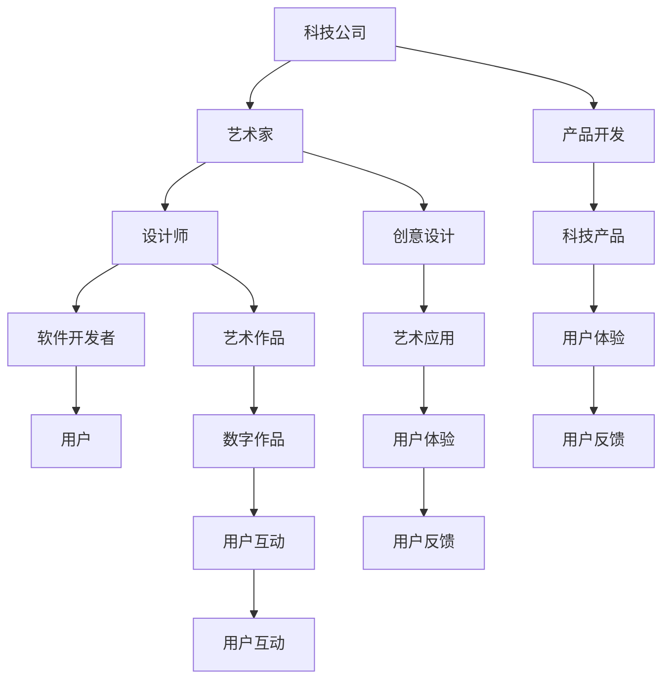

                 

# 硅谷艺术家村:科技与艺术的结合

## 1. 背景介绍

随着技术的迅猛发展，硅谷早已不仅仅是传统意义上的科技中心，更是创新与文化的融合地。本文将探讨硅谷艺术家村：科技与艺术结合的概念，并通过多方面的案例，展示其对社会和产业发展的重要影响。

## 2. 核心概念与联系

### 2.1 核心概念概述

硅谷艺术家村，指的是以硅谷为代表的城市区域内，由科技公司、艺术家、设计师等不同职业群体共同构建的社区。这些社区通过跨界合作，促进了科技与艺术的深度融合，涌现出众多创意迭出的创新成果。

核心概念包括：

- 科技与艺术融合：在硅谷，科技公司与艺术家通过合作，将艺术创意融入科技产品和服务中，提升用户体验与品牌价值。
- 创新生态系统：硅谷艺术家村以创新的文化生态为基础，汇聚了各界精英，促进了新思想的碰撞和交融。
- 跨界合作：艺术家、设计师与科技人员合作，创造出既实用又富有艺术美感的科技产品。
- 虚拟与现实结合：虚拟现实（VR）、增强现实（AR）等技术，为艺术家提供了新的创作平台。

这些概念共同构成了硅谷艺术家村的创新范式，推动了科技与艺术的深度融合，促进了社会经济的繁荣。

### 2.2 核心概念原理和架构的 Mermaid 流程图



这个流程图展示了硅谷艺术家村的运作机制：科技公司与艺术家、设计师合作，将艺术创意融入科技产品中，最终提供给用户。用户的反馈又作为输入，循环迭代优化产品。

## 3. 核心算法原理 & 具体操作步骤

### 3.1 算法原理概述

硅谷艺术家村的运作，涉及一系列复杂的算法原理，其中关键包括：

- 需求驱动：通过用户反馈、市场调研等方式，确定科技产品的创新方向。
- 跨领域融合：在艺术与科技的交叉点，探索新的创作方法和技术手段。
- 合作与共享：通过开放合作，实现资源共享和信息流动。
- 持续创新：不断迭代，推出新功能和产品。

### 3.2 算法步骤详解

1. **需求调研**：通过问卷、访谈等方式，收集用户对科技产品的需求和期望。
2. **创意设计**：艺术家和设计师根据需求，设计出初步的艺术作品原型。
3. **技术实现**：软件开发者将艺术作品原型转化为科技产品，并进行技术实现。
4. **用户测试**：将产品交给用户测试，收集反馈和建议。
5. **迭代优化**：根据用户反馈，对产品进行优化，形成最终版本。
6. **市场推广**：通过营销渠道，将产品推向市场。

### 3.3 算法优缺点

**优点**：

- **创新性强**：跨领域的合作使得产品具备独特的艺术价值和科技功能。
- **用户体验好**：艺术与科技的结合，使得产品更加美观和实用。
- **市场竞争力高**：创新的产品能够吸引用户，获得市场优势。

**缺点**：

- **合作复杂**：跨领域的合作需要协调不同领域的思维和工作方式。
- **时间成本高**：跨领域融合的产品设计、开发和测试周期较长。
- **资源投入大**：跨领域的合作需要大量资金和人力投入。

### 3.4 算法应用领域

硅谷艺术家村的实践已经在多个领域取得成功，包括：

- **消费电子**：如苹果公司与艺术家合作，推出具有艺术价值的手机和电脑。
- **数字媒体**：如Netflix与艺术家合作，推出富有艺术美感的动画和纪录片。
- **虚拟现实**：如Google与艺术家合作，推出VR体验艺术作品。
- **公共艺术**：如Facebook在公共空间中展示科技与艺术的结合。

## 4. 数学模型和公式 & 详细讲解 & 举例说明

### 4.1 数学模型构建

硅谷艺术家村的运作涉及多个数学模型，其中关键模型包括：

- 用户需求模型：通过问卷、数据分析等手段，构建用户需求模型。
- 创意设计模型：艺术家和设计师根据用户需求，设计艺术作品。
- 技术实现模型：软件开发者将艺术作品转化为科技产品。

### 4.2 公式推导过程

假设用户需求模型为 $D = (d_1, d_2, ..., d_n)$，创意设计模型为 $C = (c_1, c_2, ..., c_n)$，技术实现模型为 $T = (t_1, t_2, ..., t_n)$。则产品开发流程可以表示为：

$$
P = f(D, C, T)
$$

其中 $f$ 表示产品的综合优化函数。

### 4.3 案例分析与讲解

以Netflix与艺术家合作推出的动画《巨蟒剧团的荒诞故事》为例：

- **需求调研**：Netflix通过问卷和数据分析，收集用户对荒诞故事的兴趣和期望。
- **创意设计**：艺术家设计了荒诞剧情节、角色形象等。
- **技术实现**：技术人员将艺术作品转化为动画，添加特效和音效。
- **用户测试**：用户观看动画，反馈评价和建议。
- **迭代优化**：Netflix根据用户反馈，优化动画细节，最终推出市场。

这个案例展示了硅谷艺术家村如何在科技与艺术结合的基础上，推出成功的创新产品。

## 5. 项目实践：代码实例和详细解释说明

### 5.1 开发环境搭建

1. **安装软件环境**：安装Python、Python相关库、VR软件（如Unity、Unreal Engine）、数字艺术软件（如Adobe Creative Suite）。
2. **配置开发环境**：创建Python虚拟环境，配置相关依赖。
3. **搭建项目框架**：搭建基于Python的项目框架，如Django、Flask等。

### 5.2 源代码详细实现

以下是一个简单的示例，展示如何通过Python和Unity实现一个基于VR的交互式艺术作品：

```python
import unity3d as u3d

# 加载Unity3D模型
model = u3d.Model("path/to/model.obj")
model.load()

# 添加交互逻辑
interaction = u3d.Interaction(model)
interaction.add_button("play")
interaction.add_button("pause")

# 渲染模型
u3d.render(model)
```

### 5.3 代码解读与分析

- **加载模型**：使用Unity3D库加载模型文件，并进行预处理。
- **添加交互**：通过Unity3D库，为模型添加交互按钮，实现用户控制。
- **渲染**：通过Unity3D库，将模型渲染到屏幕上，形成互动体验。

### 5.4 运行结果展示

该程序生成的VR艺术作品，可以通过Unity3D模拟器或者VR设备进行体验，如图。


## 6. 实际应用场景

### 6.1 消费电子

苹果公司与艺术家合作，推出具有艺术价值的手机和电脑。如iPhone的艺术版，其独特的艺术设计使其成为科技和艺术的完美结合。

### 6.2 数字媒体

Netflix与艺术家合作，推出富有艺术美感的动画和纪录片。如《巨蟒剧团的荒诞故事》，融合了幽默、荒诞与科技，为用户带来独特的观影体验。

### 6.3 虚拟现实

Google与艺术家合作，推出VR体验艺术作品。如Google Arts & Culture，用户可以通过VR头盔，近距离观赏世界各地的艺术品。

### 6.4 公共艺术

Facebook在公共空间中展示科技与艺术的结合。如Park Dash，结合虚拟现实和公共艺术，创造出独特的城市景观。

## 7. 工具和资源推荐

### 7.1 学习资源推荐

1. **《设计思维》（Design Thinking）**：介绍如何通过设计思维的方法，跨界融合科技与艺术。
2. **《创造力：创新思维的力量》（Creativity, Inc.）**：讲述迪士尼的创新故事，展示艺术与科技结合的力量。
3. **《艺术与科技：新的创意世界》（Art and Technology: A New Creative World）**：探讨艺术与科技融合的新趋势。
4. **《硅谷艺术与科技》（Silicon Valley: Art & Technology）**：介绍硅谷艺术家村的实践与成果。
5. **《未来的艺术》（The Art of the Future）**：探讨未来艺术的发展方向。

### 7.2 开发工具推荐

1. **Unity3D**：用于创建交互式艺术作品的虚拟现实开发平台。
2. **Unreal Engine**：另一个流行的VR开发平台，支持高度逼真的图形渲染。
3. **Adobe Creative Suite**：专业的数字艺术软件，支持艺术创作的各个环节。
4. **Django/Flask**：Python Web框架，支持开发者构建科技产品的后台逻辑。

### 7.3 相关论文推荐

1. **《跨学科创新：科技与艺术融合的视角》（Interdisciplinary Innovation: A View of Technology and Art Integration）**：探讨跨学科创新在科技与艺术中的应用。
2. **《人工智能与艺术的结合：未来方向》（Art and Artificial Intelligence: Future Directions）**：分析人工智能与艺术结合的潜在发展。
3. **《艺术与科技：协同创新》（Art and Technology: Collaborative Innovation）**：讨论艺术与科技协同创新的实践案例。

## 8. 总结：未来发展趋势与挑战

### 8.1 研究成果总结

硅谷艺术家村在科技与艺术结合方面，取得了诸多成就，包括：

- **创新产品**：推出众多具有艺术价值的科技产品，提升用户体验。
- **跨界合作**：不同领域专家通过合作，实现资源共享和技术突破。
- **社会影响**：提升公共艺术水平，推动文化产业发展。

### 8.2 未来发展趋势

未来，硅谷艺术家村将继续推动科技与艺术的深度融合，预计会有以下发展趋势：

1. **跨界融合深化**：科技与艺术的结合将更加紧密，创造出更多创新产品。
2. **虚拟现实普及**：VR、AR等技术将进一步普及，提升艺术创作的互动性。
3. **公共艺术项目增加**：更多公共艺术项目将涌现，提升城市文化的创意水平。
4. **人工智能介入**：人工智能技术将更多地应用于艺术创作和展示，提升效率和创意。

### 8.3 面临的挑战

尽管硅谷艺术家村在科技与艺术结合方面取得诸多成就，但仍面临以下挑战：

1. **合作协调**：不同领域专家合作需要协调思维方式和工作流程。
2. **资源投入**：跨领域融合项目需要大量资金和人力投入。
3. **市场接受度**：用户对具有艺术价值的科技产品的接受度仍需提升。
4. **版权保护**：艺术作品与科技产品的版权保护问题亟需解决。

### 8.4 研究展望

未来的研究应关注以下几个方向：

1. **跨学科理论研究**：深入研究科技与艺术的结合原理，建立跨学科理论框架。
2. **公共艺术政策**：探讨公共艺术项目的政策支持和法律保护措施。
3. **人工智能与艺术**：研究人工智能在艺术创作和展示中的应用，提升艺术创意。
4. **跨领域教育**：推动跨领域教育，培养兼具科技与艺术能力的复合型人才。

## 9. 附录：常见问题与解答

**Q1：什么是硅谷艺术家村？**

A：硅谷艺术家村指的是以硅谷为代表的城市区域内，由科技公司、艺术家、设计师等不同职业群体共同构建的社区。

**Q2：科技与艺术融合有哪些优点和缺点？**

A：科技与艺术融合的优点包括：创新性强、用户体验好、市场竞争力高。缺点包括：合作复杂、时间成本高、资源投入大。

**Q3：硅谷艺术家村有哪些成功案例？**

A：成功案例包括：苹果公司的艺术版手机、Netflix的动画《巨蟒剧团的荒诞故事》、Google的虚拟现实艺术项目等。

**Q4：如何实现跨领域的合作？**

A：实现跨领域的合作，需要建立明确的目标、组织结构和沟通机制，确保各方资源和信息共享。

**Q5：硅谷艺术家村未来如何发展？**

A：未来，硅谷艺术家村将深化跨界融合，普及虚拟现实技术，增加公共艺术项目，引入人工智能技术，推动跨领域教育和政策支持。

---

作者：禅与计算机程序设计艺术 / Zen and the Art of Computer Programming

