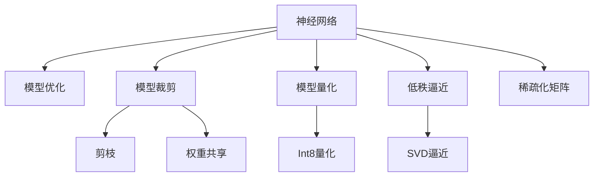

                 

# 神经网络压缩：移动设备上的深度学习

> 关键词：神经网络压缩,深度学习,移动设备,模型优化,模型裁剪,量化加速,模型并行,低功耗,模型压缩,算法优化

## 1. 背景介绍

### 1.1 问题由来
近年来，深度学习技术在图像识别、自然语言处理、语音识别等众多领域取得了突破性进展。神经网络作为深度学习的重要组成部分，凭借其强大的表达能力和泛化能力，成为目前主流的建模方法。然而，深度神经网络的参数数量庞大，导致其对硬件资源需求极高，不仅增加了计算和存储成本，还限制了其在嵌入式设备、移动终端等资源受限环境中的应用。因此，针对移动设备的需求，神经网络压缩技术应运而生。

### 1.2 问题核心关键点
神经网络压缩旨在降低深度学习模型在移动设备上的计算和存储开销，提升模型在计算资源受限环境中的适用性和效率。主要分为模型优化和模型裁剪两个方向，具体包括模型裁剪、权重共享、模型量化、低秩逼近、剪枝等方法。这些技术通过减少模型大小、降低计算复杂度、提升模型并行性等方式，大幅提升了神经网络在移动设备上的运行效率。

## 2. 核心概念与联系

### 2.1 核心概念概述

为更好地理解神经网络压缩技术，本节将介绍几个密切相关的核心概念：

- 神经网络(Neural Network, NN)：由大量人工神经元通过复杂的有向图连接组成的计算模型。通过多层非线性变换，能够学习和提取输入数据的复杂特征。

- 模型优化(Model Optimization)：通过算法优化和参数调整，提高神经网络的性能和效率，主要手段包括剪枝、量化、权重共享等。

- 模型裁剪(Model Pruning)：去除神经网络中冗余的连接和参数，减小模型大小，提高计算效率和精度。

- 模型量化(Model Quantization)：将浮点数的参数值转换为整数，以减少计算和存储资源的需求。

- 权重共享(Weight Sharing)：在神经网络中复用相似权重，减少模型参数量。

- 低秩逼近(Low-Rank Approximation)：通过矩阵分解等方法，将高维的参数矩阵逼近到低维的稀疏矩阵，减小模型大小。

这些核心概念之间的逻辑关系可以通过以下Mermaid流程图来展示：



这个流程图展示了神经网络压缩技术的核心概念及其之间的关系：

1. 神经网络通过模型优化和模型裁剪进行压缩，提高模型在计算资源受限环境中的适用性。
2. 模型优化通过剪枝、量化、权重共享等手段，优化模型结构，减少计算和存储资源。
3. 模型裁剪通过剪枝技术去除冗余连接和参数，进一步减小模型规模。
4. 模型量化将参数值从浮点数转换为整数，降低计算复杂度，提高效率。
5. 权重共享复用相似权重，减少模型参数量，提高资源利用率。
6. 低秩逼近通过矩阵分解等方法，将高维参数矩阵逼近到低维稀疏矩阵，减少模型大小。

这些概念共同构成了神经网络压缩技术的框架，使其能够在资源受限的环境下高效运行。

## 3. 核心算法原理 & 具体操作步骤
### 3.1 算法原理概述

神经网络压缩技术的核心在于通过算法优化和参数调整，减少模型在计算和存储方面的开销，同时保持模型的精度和性能。其核心思想包括模型裁剪、权重共享、模型量化、低秩逼近等。这些方法通过不同途径优化模型结构，减少计算复杂度，提升模型在移动设备上的适用性。

### 3.2 算法步骤详解

神经网络压缩的一般流程包括以下几个关键步骤：

**Step 1: 数据预处理**
- 收集并准备神经网络的训练数据，划分为训练集、验证集和测试集。
- 进行数据增强，增加数据的多样性，提高模型的泛化能力。

**Step 2: 模型选择与初始化**
- 选择合适的神经网络架构，如卷积神经网络(CNN)、循环神经网络(RNN)等。
- 初始化模型参数，通常使用随机初始化或预训练权重。

**Step 3: 模型裁剪**
- 对模型进行剪枝，去除冗余的连接和参数。
- 使用梯度累积、稀疏矩阵分解等技术优化剪枝后的模型结构。

**Step 4: 权重共享**
- 在模型中复用相似的权重，减少模型参数量。
- 使用动态权重共享、组卷积等技术提升模型的并行性和效率。

**Step 5: 模型量化**
- 将浮点数的参数值转换为整数，降低计算复杂度。
- 使用对称量化、非对称量化等方法，选择合适量化位数。

**Step 6: 低秩逼近**
- 通过矩阵分解等方法，将高维的参数矩阵逼近到低维的稀疏矩阵。
- 使用奇异值分解(SVD)、特征值逼近等技术实现矩阵分解。

**Step 7: 后处理与验证**
- 对压缩后的模型进行验证，评估其在测试集上的性能。
- 根据验证结果，调整模型结构和参数，直至模型达到预期精度。

完成以上步骤后，即可得到适应移动设备环境的神经网络模型。

### 3.3 算法优缺点

神经网络压缩技术在提升模型效率的同时，也存在以下优缺点：

**优点：**
1. 显著降低模型在移动设备上的计算和存储开销。
2. 提升模型在资源受限环境中的实时性、可靠性和可扩展性。
3. 保持模型精度和性能的同时，优化了资源利用率。

**缺点：**
1. 压缩过程中可能丢失部分模型细节，影响模型的泛化能力。
2. 压缩后的模型可能需要额外的空间和时间进行恢复和部署。
3. 压缩技术的应用可能需要额外的预处理和后处理步骤，增加开发成本。

尽管存在这些局限性，但就目前而言，神经网络压缩技术仍然是深度学习在移动设备上的重要研究方向。未来相关研究的重点在于如何进一步提高压缩后的模型精度，降低计算复杂度，同时保证模型的可解释性和鲁棒性。

### 3.4 算法应用领域

神经网络压缩技术在多个领域得到了广泛应用，具体包括：

- 图像识别：在移动设备上部署图像识别模型，如人脸识别、物体检测等。通过压缩技术，提高模型的实时性，满足应用需求。
- 语音识别：在智能音箱、智能手机等设备上实现语音识别功能，通过压缩技术，提升系统的响应速度和计算效率。
- 自然语言处理：在移动终端上部署自然语言处理模型，如机器翻译、情感分析等，通过压缩技术，实现高效的处理和推理。
- 推荐系统：在电商、社交媒体等应用中，压缩推荐模型，提升推荐精度和用户体验。
- 医疗诊断：在移动医疗设备上部署诊断模型，如心电图分析、X光图像识别等，通过压缩技术，保证模型的实时性和精度。
- 智能交通：在车载导航、智能交通管理等应用中，压缩交通预测模型，实现高效的数据处理和决策支持。

除了上述这些经典应用外，神经网络压缩技术还在更多场景中得到应用，如智能家居、智慧农业、智慧城市等，为物联网设备的智能化和互联互通提供重要支持。

## 4. 数学模型和公式 & 详细讲解  
### 4.1 数学模型构建

神经网络压缩的数学模型构建基于深度学习的基本原理，主要包括模型优化、模型裁剪、模型量化、低秩逼近等。

假设神经网络模型 $M_{\theta}(x)$ 具有 $N$ 个参数 $\theta$，输入为 $x$。模型的目标函数为 $L(\theta)$，用于评估模型在测试集上的性能。压缩过程通过算法优化和参数调整，最小化目标函数 $L(\theta)$，同时满足以下约束条件：

$$
\begin{align*}
\min_{\theta} & L(\theta) \\
\text{s.t.} & M_{\theta}(x) \approx M_{\hat{\theta}}(x) \\
\end{align*}
$$

其中 $\hat{\theta}$ 为压缩后的模型参数。

### 4.2 公式推导过程

以模型量化为例，介绍常见的对称量化和非对称量化方法。

**对称量化**：
- 对于模型中每个浮点数参数 $w_i$，将其量化为 $8$ 位整数 $q_i$，公式为：
$$
q_i = \text{round}\left(\frac{w_i}{\Delta}\right) \times \Delta
$$
其中 $\Delta$ 为量化步长。
- 反向传播时，将浮点数梯度转换为整数梯度：
$$
\frac{\partial L(\theta)}{\partial w_i} = \frac{\partial L(\theta)}{\partial q_i} \times \frac{\partial q_i}{\partial w_i}
$$
- 由于 $w_i = q_i \times \Delta$，因此：
$$
\frac{\partial L(\theta)}{\partial w_i} = \Delta \times \frac{\partial L(\theta)}{\partial q_i}
$$

**非对称量化**：
- 对于模型中每个浮点数参数 $w_i$，将其量化为 $8$ 位整数 $q_i$，公式为：
$$
q_i = \text{round}\left(w_i \times \Delta + \frac{1}{2}\Delta\right) \times \Delta
$$
其中 $\Delta$ 为量化步长。
- 反向传播时，将浮点数梯度转换为整数梯度：
$$
\frac{\partial L(\theta)}{\partial w_i} = \frac{\partial L(\theta)}{\partial q_i} \times \frac{\partial q_i}{\partial w_i}
$$
- 由于 $w_i = q_i \times \Delta - \frac{1}{2}\Delta$，因此：
$$
\frac{\partial L(\theta)}{\partial w_i} = \Delta \times \frac{\partial L(\theta)}{\partial q_i} - \frac{1}{2}\Delta^2 \times \frac{\partial L(\theta)}{\partial q_i}
$$

### 4.3 案例分析与讲解

以模型量化为例，介绍常见的对称量化和非对称量化方法。

**对称量化**：
假设有一个简单的全连接层 $L$，其参数为 $w \in \mathbb{R}^{m \times n}$，输入为 $x \in \mathbb{R}^n$，输出为 $y \in \mathbb{R}^m$。在对称量化中，参数 $w$ 被量化为 $8$ 位整数 $q$，量化步长为 $2^{-8}$。反向传播时，将浮点数梯度转换为整数梯度：
$$
\frac{\partial L}{\partial w} = \Delta \times \frac{\partial L}{\partial q}
$$

**非对称量化**：
假设同样的全连接层 $L$，其参数 $w$ 被量化为 $8$ 位整数 $q$，量化步长为 $2^{-7}$。反向传播时，将浮点数梯度转换为整数梯度：
$$
\frac{\partial L}{\partial w} = \Delta \times \frac{\partial L}{\partial q} - \frac{1}{2}\Delta^2 \times \frac{\partial L}{\partial q}
$$

通过这些量化方法，模型参数被转换为整数形式，大幅降低了计算复杂度。同时，通过调整量化步长，可以控制量化误差，在保证精度和效率之间找到平衡。

## 5. 项目实践：代码实例和详细解释说明
### 5.1 开发环境搭建

在进行神经网络压缩实践前，我们需要准备好开发环境。以下是使用Python进行TensorFlow开发的环境配置流程：

1. 安装Anaconda：从官网下载并安装Anaconda，用于创建独立的Python环境。

2. 创建并激活虚拟环境：
```bash
conda create -n tf-env python=3.7 
conda activate tf-env
```

3. 安装TensorFlow：
```bash
conda install tensorflow
```

4. 安装TensorBoard：
```bash
conda install tensorboard
```

5. 安装各类工具包：
```bash
pip install numpy pandas scikit-learn matplotlib tqdm jupyter notebook ipython
```

完成上述步骤后，即可在`tf-env`环境中开始压缩实践。

### 5.2 源代码详细实现

下面我们以卷积神经网络(CNN)模型为例，给出使用TensorFlow进行模型量化和剪枝的PyTorch代码实现。

首先，定义CNN模型：

```python
import tensorflow as tf

model = tf.keras.Sequential([
    tf.keras.layers.Conv2D(32, (3, 3), activation='relu', input_shape=(28, 28, 1)),
    tf.keras.layers.MaxPooling2D((2, 2)),
    tf.keras.layers.Flatten(),
    tf.keras.layers.Dense(10, activation='softmax')
])
```

然后，定义量化和剪枝函数：

```python
def quantize_model(model):
    # 将模型中的参数转换为整数形式
    for layer in model.layers:
        if hasattr(layer, 'kernel'):
            layer.kernel = tf.keras.layers.experimental.quantization.keras.quantize_weights(layer.kernel, 'uniform')
        if hasattr(layer, 'bias'):
            layer.bias = tf.keras.layers.experimental.quantization.keras.quantize_weights(layer.bias, 'uniform')

def prune_model(model, threshold=0.1):
    # 去除权重值小于阈值的参数
    for layer in model.layers:
        if hasattr(layer, 'kernel'):
            weights = layer.kernel.numpy()
            prune_mask = weights < threshold
            prune_weights = weights.copy()
            prune_weights[prune_mask] = 0
            prune_weights /= weights.sum()
            layer.kernel.assign(prune_weights)
```

接着，训练并压缩模型：

```python
model.compile(optimizer='adam', loss='sparse_categorical_crossentropy', metrics=['accuracy'])

# 加载数据集
(x_train, y_train), (x_test, y_test) = tf.keras.datasets.mnist.load_data()
x_train = x_train.reshape(-1, 28, 28, 1).astype('float32') / 255
x_test = x_test.reshape(-1, 28, 28, 1).astype('float32') / 255
y_train = tf.keras.utils.to_categorical(y_train, 10)
y_test = tf.keras.utils.to_categorical(y_test, 10)

# 训练模型
model.fit(x_train, y_train, epochs=10, batch_size=32, validation_data=(x_test, y_test))

# 量化模型
quantize_model(model)

# 剪枝模型
prune_model(model)

# 评估模型
model.evaluate(x_test, y_test)
```

以上就是使用TensorFlow进行CNN模型量化和剪枝的完整代码实现。可以看到，通过Quantization和Pruning函数，可以将模型参数转换为整数形式，并去除冗余参数，从而实现模型压缩。

### 5.3 代码解读与分析

让我们再详细解读一下关键代码的实现细节：

**Sequential模型定义**：
- 定义一个简单的卷积神经网络模型，包含一个卷积层、一个池化层、一个全连接层。
- 输入维度为28x28x1的灰度图像，输出10个类别的预测结果。

**QuantizeModel函数**：
- 遍历模型中的所有层，对于包含权重的层，使用`quantize_weights`方法将其量化为整数形式。
- `quantize_weights`方法接受参数`uniform`，表示使用均匀量化。

**PruneModel函数**：
- 遍历模型中的所有层，对于包含权重的层，使用numpy获取权重值。
- 判断权重值是否小于设定的阈值，如果小于，则将其置为0。
- 计算权重值的归一化因子，使其归一化。
- 使用`assign`方法更新层的权重参数。

**模型训练**：
- 定义损失函数、优化器和评估指标。
- 加载MNIST数据集，并进行预处理。
- 使用`fit`方法训练模型，验证集为测试集。
- 训练结束后，调用`quantize_model`和`prune_model`函数，进行量化和剪枝操作。
- 使用`evaluate`方法评估模型的性能。

可以看到，TensorFlow提供了丰富的工具库，方便进行神经网络压缩的实践。通过QuantizeModel和PruneModel函数，可以轻松实现模型量化和剪枝，提高模型的效率和可部署性。

当然，工业级的系统实现还需考虑更多因素，如模型的保存和部署、超参数的自动搜索、更灵活的任务适配层等。但核心的压缩过程基本与此类似。

## 6. 实际应用场景
### 6.1 智能相机

智能相机中的图像识别应用，如人脸识别、物体检测等，对计算资源和存储空间的开销非常敏感。通过神经网络压缩技术，可以在保证识别精度的前提下，大幅降低模型在移动设备上的计算和存储需求，实现高效的图像识别。

### 6.2 可穿戴设备

可穿戴设备如智能手表、智能眼镜等，对设备的计算资源和电池寿命有严格要求。通过压缩技术，可以在不增加设备负担的情况下，实现高效的图像处理、语音识别等功能，提升用户体验。

### 6.3 实时系统

实时系统如自动驾驶、医疗诊断等，对模型的实时性和可靠性有严格要求。通过神经网络压缩技术，可以优化模型结构，提高实时性和稳定性，保障系统的安全性和可靠性。

### 6.4 未来应用展望

随着神经网络压缩技术的不断进步，未来的应用场景将更加广泛。基于压缩技术的模型在嵌入式设备、移动终端等资源受限环境中的应用将更加普遍，进一步推动深度学习在更多领域的落地应用。

## 7. 工具和资源推荐
### 7.1 学习资源推荐

为了帮助开发者系统掌握神经网络压缩的理论基础和实践技巧，这里推荐一些优质的学习资源：

1. 《深度学习》课程：斯坦福大学开设的深度学习经典课程，介绍了神经网络压缩、模型优化、量化等前沿话题。

2. 《TensorFlow实战》书籍：TensorFlow官方出版物，系统介绍了TensorFlow的各个组件，包括模型压缩、优化等技术。

3. 《TensorFlow性能优化》博客：详细介绍了TensorFlow模型的量化、剪枝等压缩技术，以及模型优化技巧。

4. Weights & Biases：模型训练的实验跟踪工具，可以记录和可视化模型训练过程中的各项指标，方便对比和调优。

5. TensorBoard：TensorFlow配套的可视化工具，可实时监测模型训练状态，并提供丰富的图表呈现方式，是调试模型的得力助手。

通过对这些资源的学习实践，相信你一定能够快速掌握神经网络压缩的精髓，并用于解决实际的NLP问题。

### 7.2 开发工具推荐

高效的开发离不开优秀的工具支持。以下是几款用于神经网络压缩开发的常用工具：

1. TensorFlow：基于Python的开源深度学习框架，灵活动态的计算图，适合快速迭代研究。大部分神经网络模型都有TensorFlow版本的实现。

2. PyTorch：由Facebook主导开发的深度学习框架，灵活易用，支持动态图和静态图，适合快速原型开发。

3. TensorFlow Lite：TensorFlow的移动端优化版本，支持模型量化、剪枝等压缩技术，适应移动设备的资源限制。

4. TFLite Model Compression Toolkit：Google提供的模型压缩工具包，支持多种压缩技术，包括剪枝、量化、稀疏化等。

5. MLIR：LLVM编译器基础设施，支持模型优化、量化、剪枝等压缩技术，可以生成高效的移动端代码。

合理利用这些工具，可以显著提升神经网络压缩任务的开发效率，加快创新迭代的步伐。

### 7.3 相关论文推荐

神经网络压缩技术的发展源于学界的持续研究。以下是几篇奠基性的相关论文，推荐阅读：

1. SqueezeNet：提出了一种轻量级卷积神经网络架构，通过多层压缩和通道分组等技术，大幅减小模型大小，同时保持高精度。

2. MobileNet：提出了一种基于深度可分离卷积的神经网络架构，通过深度压缩和宽度压缩等技术，优化模型在移动设备上的表现。

3. XNOR-Net：提出了一种基于二值化的神经网络架构，通过将浮点数参数转换为整数0和1，实现高效的模型压缩和计算加速。

4. A Quantization-aware Training Framework for Mobile Deep Learning Applications（Calibration Quantization）：提出了一种基于标定量化的神经网络压缩方法，在训练过程中进行参数量化，提高模型的鲁棒性和泛化能力。

5. Knowledge Distillation for Efficient Convolutional Neural Networks（Distillation Quantization）：提出了一种基于知识蒸馏的神经网络压缩方法，通过蒸馏小模型到大模型，实现高效压缩。

这些论文代表了大模型压缩技术的发展脉络。通过学习这些前沿成果，可以帮助研究者把握学科前进方向，激发更多的创新灵感。

## 8. 总结：未来发展趋势与挑战

### 8.1 总结

本文对神经网络压缩技术进行了全面系统的介绍。首先阐述了神经网络压缩技术的背景和意义，明确了压缩技术在深度学习模型应用中的重要性。其次，从原理到实践，详细讲解了神经网络压缩的数学模型和关键步骤，给出了压缩任务开发的完整代码实例。同时，本文还广泛探讨了压缩技术在智能相机、可穿戴设备、实时系统等多个领域的应用前景，展示了压缩技术的巨大潜力。此外，本文精选了压缩技术的各类学习资源，力求为读者提供全方位的技术指引。

通过本文的系统梳理，可以看到，神经网络压缩技术正在成为深度学习模型应用的重要方向，极大地拓展了深度学习模型在移动设备上的应用边界，催生了更多的落地场景。受益于深度学习模型和压缩技术的不断演进，相信神经网络压缩必将在更多领域得到应用，为深度学习技术的应用普及带来新的动力。

### 8.2 未来发展趋势

展望未来，神经网络压缩技术将呈现以下几个发展趋势：

1. 模型规模持续增大。随着算力成本的下降和数据规模的扩张，神经网络模型的参数量还将持续增长。超大规模神经网络蕴含的丰富特征表示，有望支撑更加复杂多变的应用场景。

2. 压缩方法日趋多样。除了传统的剪枝、量化、权重共享等方法外，未来会涌现更多先进的压缩技术，如知识蒸馏、动态卷积、可逆计算等，在保证精度和效率的同时，优化模型的资源利用率。

3. 深度可分离卷积崛起。基于深度可分离卷积的模型如MobileNet、ShuffleNet等，已在移动设备上广泛应用，未来将有更多改进和优化，进一步提升移动设备的计算效率。

4. 自适应量化技术兴起。通过动态调整量化参数，优化模型在不同环境下的表现，提升模型的泛化能力和鲁棒性。

5. 边缘计算融合。将神经网络压缩技术应用于边缘计算设备，如物联网终端、智能家居设备等，提高设备的智能化水平和响应速度。

以上趋势凸显了神经网络压缩技术的广阔前景。这些方向的探索发展，必将进一步提升深度学习模型在移动设备上的运行效率和性能，为物联网设备的智能化和互联互通提供重要支持。

### 8.3 面临的挑战

尽管神经网络压缩技术已经取得了瞩目成就，但在迈向更加智能化、普适化应用的过程中，它仍面临着诸多挑战：

1. 模型精度下降。压缩过程中可能丢失部分模型细节，影响模型的泛化能力。如何进一步提高压缩后的模型精度，保持性能的同时减少计算复杂度，将是重要的研究方向。

2. 压缩效率问题。现有压缩方法往往需要较长的预处理和后处理时间，增加开发成本。如何在压缩过程中提高效率，优化资源利用率，还需要更多理论和方法的支持。

3. 硬件兼容性问题。不同硬件平台对压缩技术的需求和支持不同，如何实现跨平台、跨硬件的压缩技术优化，仍然是一个难题。

4. 计算资源限制。神经网络压缩技术依赖于强大的计算资源支持，如何降低计算复杂度，优化算法，提升计算效率，还需要更多的探索。

5. 模型可解释性问题。压缩后的模型通常难以解释其内部工作机制，对于高风险应用，模型的可解释性和可审计性尤为重要。如何赋予压缩模型更强的可解释性，将是亟待攻克的难题。

6. 数据隐私问题。神经网络压缩技术需要在模型训练和推理过程中处理大量数据，如何保护数据隐私，确保数据安全，还需要更多的技术手段和规范。

正视压缩面临的这些挑战，积极应对并寻求突破，将使神经网络压缩技术迈向更加成熟和可靠。相信随着学界和产业界的共同努力，这些挑战终将一一被克服，神经网络压缩技术必将在构建智能化、普适化的人工智能系统中发挥更大的作用。

### 8.4 研究展望

面对神经网络压缩技术所面临的种种挑战，未来的研究需要在以下几个方面寻求新的突破：

1. 探索无监督和半监督压缩方法。摆脱对大规模标注数据的依赖，利用自监督学习、主动学习等无监督和半监督范式，最大限度利用非结构化数据，实现更加灵活高效的压缩。

2. 研究参数共享与稀疏化技术。开发更加参数共享的压缩方法，在固定大部分预训练参数的情况下，只更新极少量的任务相关参数。同时优化模型结构，实现高效的参数稀疏化，进一步减小模型大小。

3. 引入更多先验知识。将符号化的先验知识，如知识图谱、逻辑规则等，与神经网络模型进行巧妙融合，引导压缩过程学习更准确、合理的特征表示。

4. 结合因果分析和博弈论工具。将因果分析方法引入压缩模型，识别出模型决策的关键特征，增强输出解释的因果性和逻辑性。借助博弈论工具刻画人机交互过程，主动探索并规避模型的脆弱点，提高系统稳定性。

5. 纳入伦理道德约束。在模型训练目标中引入伦理导向的评估指标，过滤和惩罚有偏见、有害的输出倾向。同时加强人工干预和审核，建立模型行为的监管机制，确保输出符合人类价值观和伦理道德。

这些研究方向的探索，必将引领神经网络压缩技术迈向更高的台阶，为构建安全、可靠、可解释、可控的智能系统铺平道路。面向未来，神经网络压缩技术还需要与其他人工智能技术进行更深入的融合，如知识表示、因果推理、强化学习等，多路径协同发力，共同推动人工智能技术的发展。只有勇于创新、敢于突破，才能不断拓展神经网络压缩的边界，让深度学习技术更好地造福人类社会。

## 9. 附录：常见问题与解答

**Q1：神经网络压缩是否会丢失模型精度？**

A: 压缩过程中可能会丢失部分模型细节，影响模型的泛化能力。但通过精心设计的压缩方法，如剪枝、量化、知识蒸馏等，可以最大限度地减小损失，保持模型的精度和性能。

**Q2：神经网络压缩的方法有哪些？**

A: 常见的压缩方法包括剪枝、量化、权重共享、低秩逼近等。剪枝通过去除冗余连接和参数，减小模型大小。量化将浮点数的参数值转换为整数，降低计算复杂度。权重共享复用相似权重，减少模型参数量。低秩逼近通过矩阵分解等方法，将高维参数矩阵逼近到低维稀疏矩阵，减小模型大小。

**Q3：神经网络压缩的流程是什么？**

A: 神经网络压缩的流程包括模型选择与初始化、数据预处理、模型裁剪、权重共享、模型量化、低秩逼近、后处理与验证等步骤。具体步骤包括：选择合适的神经网络架构，初始化模型参数；收集和准备训练数据；进行模型裁剪和量化；引入低秩逼近技术；评估模型性能；根据验证结果调整模型结构；保存压缩后的模型。

**Q4：神经网络压缩的实际应用场景有哪些？**

A: 神经网络压缩技术在智能相机、可穿戴设备、实时系统等领域得到了广泛应用。例如，在智能相机中，可以通过压缩技术实现高效的图像识别和实时处理；在可穿戴设备中，可以通过压缩技术优化模型的实时性和计算效率；在实时系统中，可以通过压缩技术优化模型的实时性和可靠性。

**Q5：如何选择合适的神经网络压缩方法？**

A: 选择合适的压缩方法需要考虑模型的大小、计算资源、应用场景等因素。对于内存和计算资源受限的设备，可以选择量化、剪枝等方法；对于需要实时性和稳定性的应用，可以选择知识蒸馏、低秩逼近等方法。选择合适的压缩方法，可以最大化地提升模型的性能和效率。

综上所述，神经网络压缩技术是深度学习在移动设备上的重要研究方向，通过优化模型结构、减小模型大小、提高计算效率，神经网络压缩技术将在更多领域得到应用，推动深度学习技术的普及和发展。面向未来，我们需要在多个方向上继续探索和突破，才能更好地应对挑战，引领神经网络压缩技术的未来发展。

