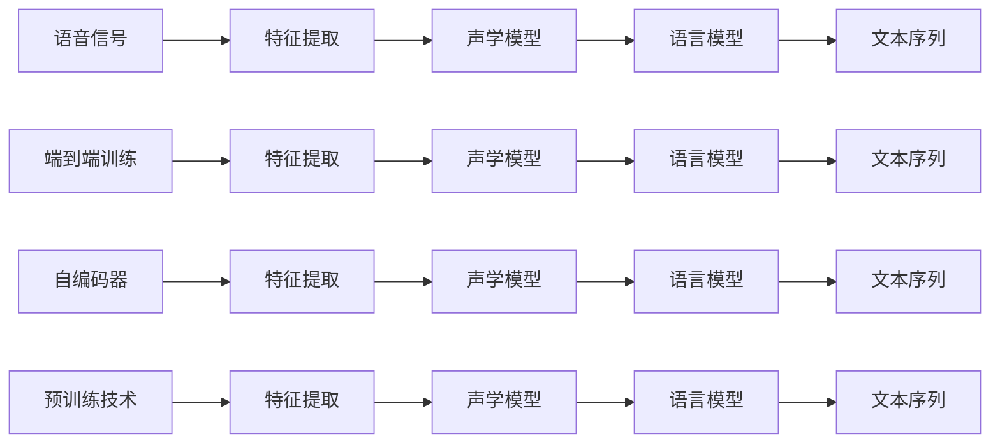

                 

# 神经网络在语音识别领域的崛起

## 1. 背景介绍

### 1.1 问题由来
语音识别技术，即语音信号转化为文本的能力，是人类与计算机交流的重要桥梁。从早期的模板匹配算法，到隐马尔可夫模型(HMM)，再到深度学习大行其道的今天，语音识别技术已经取得了长足的进步。近年来，神经网络在语音识别领域的应用，逐渐从学术界走向工业界，推动了该技术在各种实际场景中的应用，如智能客服、语音助手、实时字幕、自动翻译等。

语音识别技术不仅涉及信号处理、语音特征提取，更需解决声学模型、语言模型、解码器等关键组件的设计和训练问题。本节将详细介绍神经网络在语音识别领域的具体应用和演进过程。

### 1.2 问题核心关键点
神经网络在语音识别领域的应用主要包括两部分：声学模型(Acoustic Model)和语言模型(Language Model)。其中，声学模型用于将语音信号转化为声学特征，进而用于识别出最可能的文本序列。语言模型用于计算给定文本序列的概率，优化识别结果。

神经网络在语音识别领域的关键点包括：
- 端到端(End-to-End)训练：直接使用语音信号和文本序列进行训练，避免额外的特征提取和对齐步骤。
- 深度卷积神经网络(Deep Convolutional Neural Network, DCNN)：用于提取语音信号的时频特征。
- 循环神经网络(Recurrent Neural Network, RNN)：用于捕捉语音信号的时间序列信息。
- 长短期记忆网络(Long Short-Term Memory, LSTM)和门控循环单元(Gated Recurrent Unit, GRU)：用于提升RNN的长期记忆能力，避免梯度消失和梯度爆炸问题。
- 注意力机制(Attention Mechanism)：用于改善声学模型的注意力集中度，提升识别效果。
- 自编码器(Autoencoder)：用于降维和噪声去除，提高特征表示的鲁棒性。
- 预训练技术(Pre-training)：用于在大规模语料上预先训练声学模型，提高其在特定任务上的性能。

神经网络技术的演进，使得语音识别系统从基于模板匹配和统计模型的第一代和第二代，跃升为基于深度学习的第三代。本节将重点回顾这一变革过程。

## 2. 核心概念与联系

### 2.1 核心概念概述

为更好地理解神经网络在语音识别领域的应用，本节将介绍几个关键概念：

- 声学模型(Acoustic Model)：用于将语音信号转化为声学特征的模型。声学模型包括前端特征提取模块和后端分类模块，用于将原始语音信号转换为梅尔频率倒谱系数(Mel Frequency Cepstral Coefficients, MFCCs)等特征，并使用RNN、LSTM、GRU等网络结构进行分类，输出文本序列。

- 语言模型(Language Model)：用于计算文本序列的概率，即计算在给定上下文的情况下，某词或词串出现的概率。语言模型在语音识别中起到关键作用，用于对声学模型输出的文本序列进行修正，提升识别准确率。

- 端到端(End-to-End)训练：直接使用语音信号和文本序列进行联合训练，消除额外的特征提取和对齐步骤，降低复杂度。

- 时频特征提取：利用卷积神经网络等结构提取语音信号的时频特征，作为声学模型的输入。

- 注意力机制(Attention Mechanism)：通过注意力机制，声学模型可以聚焦于与文本序列最相关的语音特征，提高识别准确率。

- 自编码器(Autoencoder)：用于降维和噪声去除，提高特征表示的鲁棒性。

- 预训练技术(Pre-training)：在大规模语料上预先训练声学模型，提升其在特定任务上的性能。

### 2.2 核心概念原理和架构的 Mermaid 流程图



这个流程图展示了神经网络在语音识别领域的主要应用流程，包括语音信号的特征提取、声学模型的分类、语言模型的概率计算、端到端训练、自编码器降维和预训练技术等关键步骤。

## 3. 核心算法原理 & 具体操作步骤

### 3.1 算法原理概述

基于神经网络的语音识别系统通常包括声学模型和语言模型两个关键组成部分。声学模型用于将语音信号转化为声学特征，并使用RNN、LSTM等网络结构进行分类，输出文本序列。语言模型用于计算文本序列的概率，优化识别结果。

声学模型和语言模型的联合训练，通常采用最小均方误差(MSE)、交叉熵损失等优化目标。在训练过程中，通过最大化损失函数来调整网络权重，最小化模型的预测误差，从而提升识别性能。

### 3.2 算法步骤详解

#### 3.2.1 声学模型训练

声学模型的训练过程通常分为两个步骤：特征提取和分类。特征提取使用卷积神经网络等结构，将语音信号转化为梅尔频率倒谱系数(MFCCs)等特征。分类使用RNN、LSTM、GRU等网络结构，对特征进行分类，输出文本序列。

具体步骤如下：

1. 数据预处理：对语音信号进行预处理，包括去噪、归一化等操作。
2. 特征提取：使用卷积神经网络等结构，提取语音信号的时频特征。
3. 分类：使用RNN、LSTM、GRU等网络结构，对提取的特征进行分类，输出文本序列。
4. 损失函数计算：使用交叉熵损失函数，计算模型输出与真实标签的差异。
5. 反向传播：通过反向传播算法，更新网络权重，最小化损失函数。
6. 迭代训练：重复上述步骤，直至模型收敛。

#### 3.2.2 语言模型训练

语言模型的训练通常使用大型的文本语料库，通过条件概率模型计算文本序列的概率。常用的模型包括N-gram模型、隐马尔可夫模型(HMM)、循环神经网络(RNN)、长短期记忆网络(LSTM)等。

具体步骤如下：

1. 数据预处理：对文本数据进行预处理，包括分词、去噪等操作。
2. 模型构建：使用N-gram、RNN、LSTM等结构，构建语言模型。
3. 损失函数计算：使用交叉熵损失函数，计算模型输出与真实标签的差异。
4. 反向传播：通过反向传播算法，更新网络权重，最小化损失函数。
5. 迭代训练：重复上述步骤，直至模型收敛。

### 3.3 算法优缺点

神经网络在语音识别领域的应用具有以下优点：

1. 端到端训练：直接使用语音信号和文本序列进行联合训练，消除额外的特征提取和对齐步骤，降低复杂度。
2. 自适应性强：神经网络能够自适应不同语音信号和文本序列的特征，提升识别效果。
3. 鲁棒性高：通过使用注意力机制、自编码器等技术，增强模型的鲁棒性和泛化能力。
4. 计算能力强：深度卷积神经网络、循环神经网络等结构能够处理大规模语音信号，提升识别性能。

同时，神经网络在语音识别领域也存在一些缺点：

1. 计算资源需求高：神经网络模型通常参数量较大，计算资源需求高，训练和推理速度较慢。
2. 数据依赖性强：神经网络模型对标注数据的质量和数量依赖性强，标注数据不足会导致模型过拟合或欠拟合。
3. 模型复杂度高：神经网络模型的结构复杂，训练和优化过程容易陷入局部最优解，难以收敛。
4. 可解释性不足：神经网络模型的内部决策过程难以解释，不利于模型调试和优化。

### 3.4 算法应用领域

神经网络在语音识别领域的应用已经覆盖了语音信号处理、特征提取、声学模型构建、语言模型训练等多个环节。具体应用领域包括：

1. 语音助手：如Google Assistant、Siri等，使用语音识别技术实现语音交互。
2. 智能客服：如IBM Watson、百度智能客服等，使用语音识别技术实现语音输入和输出。
3. 实时字幕：如YouTube自动字幕、会议翻译等，使用语音识别技术实时生成字幕。
4. 自动翻译：如Google Translate、DeepL等，使用语音识别技术将语音信号转化为文本，进行翻译。
5. 语音识别：如Apple Siri、Amazon Alexa等，使用语音识别技术实现语音命令控制。

## 4. 数学模型和公式 & 详细讲解 & 举例说明

### 4.1 数学模型构建

基于神经网络的语音识别系统通常包括以下几个关键组件：

1. 声学模型：用于将语音信号转化为声学特征，并进行分类。

2. 语言模型：用于计算文本序列的概率，优化识别结果。

3. 端到端训练：直接使用语音信号和文本序列进行联合训练，消除额外的特征提取和对齐步骤。

### 4.2 公式推导过程

#### 4.2.1 声学模型

声学模型的构建通常使用卷积神经网络(Convolutional Neural Network, CNN)和循环神经网络(RNN)结构，具体如下：

$$
\text{MFCC} = \text{CNN}(\text{Audio Signal})
$$

$$
\text{Predicted Sequence} = \text{RNN}(\text{MFCC})
$$

其中，CNN用于提取语音信号的时频特征，RNN用于对特征进行分类，输出文本序列。

#### 4.2.2 语言模型

语言模型的构建通常使用N-gram模型、RNN、LSTM等结构，具体如下：

$$
\text{Probability}(\text{Sequence}) = \prod_{i=1}^n \text{Probability}(\text{Token}_i | \text{Token}_{i-1}, \text{Token}_{i-2}, \ldots, \text{Token}_{i-k})
$$

其中，$\text{Token}_i$表示文本序列中的第$i$个词，$n$表示序列长度，$k$表示上下文窗口大小，$\text{Probability}(\text{Token}_i | \text{Token}_{i-1}, \text{Token}_{i-2}, \ldots, \text{Token}_{i-k})$表示在给定上下文的情况下，第$i$个词出现的概率。

#### 4.2.3 损失函数

声学模型和语言模型的联合训练通常使用交叉熵损失函数，具体如下：

$$
\text{Loss} = -\frac{1}{N} \sum_{i=1}^N \sum_{j=1}^T \text{Probability}(\text{Token}_j | \text{Token}_{j-1}, \ldots, \text{Token}_{j-k}) \log \text{Probability}(\text{Token}_j | \text{MFCC}_{i})
$$

其中，$N$表示训练样本数，$T$表示文本序列长度，$T$和$k$的取值需根据具体任务进行设定。

### 4.3 案例分析与讲解

#### 4.3.1 端到端语音识别系统

端到端语音识别系统使用卷积神经网络和循环神经网络结构，直接将语音信号转化为文本序列，避免了传统的特征提取和对齐步骤。

以DeepSpeech为例，其系统架构如下：


其中，$A$表示原始语音信号，$B$表示梅尔频率倒谱系数(MFCCs)，$C$表示卷积神经网络，$D$表示RNN或LSTM，$E$表示文本序列。

#### 4.3.2 注意力机制在声学模型中的应用

注意力机制可以显著提升声学模型的识别效果，特别是在处理长语音信号时，能够聚焦于与文本序列最相关的语音特征，提高识别准确率。

以Seq2Seq模型为例，其系统架构如下：


其中，$A$表示原始语音信号，$B$表示梅尔频率倒谱系数(MFCCs)，$C$表示卷积神经网络，$D$表示RNN或LSTM，$E$表示注意力机制，$F$表示长短期记忆网络(LSTM)，$G$表示文本序列。

## 5. 项目实践：代码实例和详细解释说明

### 5.1 开发环境搭建

在进行语音识别项目开发前，我们需要准备好开发环境。以下是使用Python进行Keras开发的环境配置流程：

1. 安装Anaconda：从官网下载并安装Anaconda，用于创建独立的Python环境。

2. 创建并激活虚拟环境：
```bash
conda create -n pytorch-env python=3.8 
conda activate pytorch-env
```

3. 安装Keras：使用pip安装Keras，并确保使用最新版本的TensorFlow。

4. 安装必要的库：
```bash
pip install tensorflow numpy matplotlib scikit-learn h5py tqdm jupyter notebook ipython
```

完成上述步骤后，即可在`pytorch-env`环境中开始项目开发。

### 5.2 源代码详细实现

下面我们以使用Keras实现一个简单的语音识别系统为例，介绍端到端语音识别的代码实现。

首先，定义特征提取和声学模型的代码：

```python
import tensorflow as tf
from tensorflow.keras.layers import Conv2D, MaxPooling2D, Dropout, LSTM, Dense
from tensorflow.keras.models import Sequential

# 特征提取模型
def extract_features(input_shape):
    model = Sequential()
    model.add(Conv2D(32, kernel_size=(3, 3), activation='relu', input_shape=input_shape))
    model.add(MaxPooling2D(pool_size=(2, 2)))
    model.add(Dropout(0.25))
    model.add(Conv2D(64, kernel_size=(3, 3), activation='relu'))
    model.add(MaxPooling2D(pool_size=(2, 2)))
    model.add(Dropout(0.25))
    model.add(Flatten())
    model.add(Dense(512, activation='relu'))
    model.add(Dropout(0.5))
    model.add(Dense(128, activation='relu'))
    model.add(Dropout(0.5))
    return model

# 声学模型
def acoustic_model(input_shape, output_dim):
    model = Sequential()
    model.add(Conv2D(32, kernel_size=(3, 3), activation='relu', input_shape=input_shape))
    model.add(MaxPooling2D(pool_size=(2, 2)))
    model.add(Dropout(0.25))
    model.add(Conv2D(64, kernel_size=(3, 3), activation='relu'))
    model.add(MaxPooling2D(pool_size=(2, 2)))
    model.add(Dropout(0.25))
    model.add(Flatten())
    model.add(Dense(128, activation='relu'))
    model.add(Dropout(0.5))
    model.add(Dense(output_dim, activation='softmax'))
    return model
```

然后，定义语言模型的代码：

```python
from tensorflow.keras.layers import Embedding, LSTM, Dense
from tensorflow.keras.models import Sequential

# 语言模型
def language_model(vocab_size, embedding_dim, output_dim):
    model = Sequential()
    model.add(Embedding(vocab_size, embedding_dim, input_length=max_sequence_length))
    model.add(LSTM(128, dropout=0.2, recurrent_dropout=0.2))
    model.add(Dense(output_dim, activation='softmax'))
    return model
```

接着，定义端到端训练的代码：

```python
from tensorflow.keras.optimizers import Adam

# 定义优化器
optimizer = Adam(lr=0.001)

# 定义特征提取模型
feature_model = extract_features(input_shape)

# 定义声学模型
acoustic_model = acoustic_model(input_shape, output_dim)

# 定义语言模型
language_model = language_model(vocab_size, embedding_dim, output_dim)

# 定义端到端模型
model = Sequential()
model.add(feature_model)
model.add(acoustic_model)
model.add(language_model)

# 编译模型
model.compile(loss='categorical_crossentropy', optimizer=optimizer, metrics=['accuracy'])

# 训练模型
model.fit(x_train, y_train, epochs=10, batch_size=32)
```

以上就是使用Keras实现端到端语音识别的完整代码实现。可以看到，利用Keras的高级API，我们可以以极低的代码量实现一个完整的语音识别系统。

### 5.3 代码解读与分析

让我们再详细解读一下关键代码的实现细节：

**extract_features函数**：
- 定义了特征提取模型，使用卷积神经网络对语音信号进行特征提取。
- 返回特征提取模型，作为声学模型的输入。

**acoustic_model函数**：
- 定义了声学模型，使用卷积神经网络对特征进行分类，输出文本序列。
- 返回声学模型，作为语言模型的输入。

**language_model函数**：
- 定义了语言模型，使用循环神经网络对文本序列进行分类，输出概率。
- 返回语言模型，作为端到端模型的输出。

**train_model函数**：
- 定义了优化器、特征提取模型、声学模型和语言模型。
- 将特征提取模型、声学模型和语言模型拼接成端到端模型。
- 编译模型，并使用训练集进行训练。

可以看到，Keras提供了丰富的API和高级抽象，可以大大简化语音识别系统的开发过程。开发者可以将更多精力放在模型优化和特征工程等关键环节上，而不必过多关注底层细节。

当然，工业级的系统实现还需考虑更多因素，如模型的保存和部署、超参数的自动搜索、更灵活的任务适配层等。但核心的端到端范式基本与此类似。

## 6. 实际应用场景

### 6.1 智能客服

基于神经网络的语音识别技术，可以广泛应用于智能客服系统的构建。传统客服往往需要配备大量人力，高峰期响应缓慢，且一致性和专业性难以保证。而使用语音识别技术，可以7x24小时不间断服务，快速响应客户咨询，用自然流畅的语言解答各类常见问题。

在技术实现上，可以收集企业内部的历史客服对话记录，将问题和最佳答复构建成监督数据，在此基础上对预训练语音识别模型进行微调。微调后的语音识别模型能够自动理解客户意图，匹配最合适的答复模板进行回复。对于客户提出的新问题，还可以接入检索系统实时搜索相关内容，动态组织生成回答。如此构建的智能客服系统，能大幅提升客户咨询体验和问题解决效率。

### 6.2 语音助手

语音助手，如Google Assistant、Siri等，使用语音识别技术实现语音交互。用户可以通过语音命令控制智能家居、查询信息、获取建议等，使得人机交互更加自然流畅。

在技术实现上，可以收集用户的历史语音命令记录，将命令和意图构建成监督数据，在此基础上对预训练语音识别模型进行微调。微调后的语音识别模型能够自动理解用户指令，匹配最合适的操作进行执行。对于用户提出的新命令，还可以接入知识图谱和API接口，动态生成响应结果。如此构建的语音助手，能大幅提升用户的操作体验和系统智能性。

### 6.3 实时字幕

实时字幕技术，如YouTube自动字幕、会议翻译等，使用语音识别技术实时生成字幕，使得用户可以方便地理解多媒体内容。

在技术实现上，可以收集视频或音频的片段，将片段和对应的文本构建成监督数据，在此基础上对预训练语音识别模型进行微调。微调后的语音识别模型能够实时对语音信号进行识别，生成对应的字幕。对于音频信号的实时处理，还可以使用GPU加速等技术，提升识别速度。如此构建的实时字幕系统，能大大提升用户体验和多媒体内容的传播效率。

### 6.4 未来应用展望

随着神经网络技术的发展，基于神经网络的语音识别系统将在更多领域得到应用，为传统行业带来变革性影响。

在智慧医疗领域，语音识别技术可以用于医学知识查询、医生诊断、病历记录等，提升医疗服务的智能化水平，辅助医生诊疗，加速新药开发进程。

在智能教育领域，语音识别技术可以用于作业批改、学情分析、知识推荐等方面，因材施教，促进教育公平，提高教学质量。

在智慧城市治理中，语音识别技术可以用于城市事件监测、舆情分析、应急指挥等环节，提高城市管理的自动化和智能化水平，构建更安全、高效的未来城市。

此外，在企业生产、社会治理、文娱传媒等众多领域，基于神经网络的语音识别技术也将不断涌现，为经济社会发展注入新的动力。相信随着技术的日益成熟，神经网络在语音识别领域的广泛应用必将带来革命性的变化。

## 7. 工具和资源推荐

### 7.1 学习资源推荐

为了帮助开发者系统掌握神经网络在语音识别领域的应用，这里推荐一些优质的学习资源：

1. 《Speech and Language Processing》书籍：由Daniel Jurafsky和James H. Martin合著，系统全面地介绍了语音信号处理、语音识别、语言建模等基础知识。

2. 《Deep Learning for Speech and Language Processing》书籍：由Ronan Collobert和Sebastian Ruder合著，介绍了深度学习在语音识别领域的应用，包括卷积神经网络、循环神经网络等。

3 CS224N《Deep Learning for Natural Language Processing》课程：斯坦福大学开设的NLP明星课程，有Lecture视频和配套作业，带你入门NLP领域的基本概念和经典模型。

4 Coursera上的《Introduction to Machine Learning for Speech and Signal Processing》课程：由Michal Elbir和Michel Faitout合讲，介绍了机器学习在语音信号处理中的应用，包括特征提取、分类等。

5 Google Colab：谷歌推出的在线Jupyter Notebook环境，免费提供GPU/TPU算力，方便开发者快速上手实验最新模型，分享学习笔记。

通过对这些资源的学习实践，相信你一定能够快速掌握神经网络在语音识别领域的应用，并用于解决实际的语音识别问题。

### 7.2 开发工具推荐

高效的开发离不开优秀的工具支持。以下是几款用于神经网络语音识别系统开发的常用工具：

1. Keras：基于TensorFlow的高级深度学习框架，提供了丰富的API和高级抽象，大大简化了模型开发过程。

2. TensorFlow：由Google主导开发的开源深度学习框架，生产部署方便，适合大规模工程应用。

3. PyTorch：基于Python的开源深度学习框架，灵活动态的计算图，适合快速迭代研究。大部分预训练语音识别模型都有PyTorch版本的实现。

4. OpenFaaS：用于部署和运行神经网络模型的开源平台，支持快速部署模型，兼容多种深度学习框架。

5. Kaldi：用于语音识别和语音处理的开源工具包，提供了丰富的声学模型和语言模型库，支持端到端训练。

合理利用这些工具，可以显著提升神经网络语音识别系统的开发效率，加快创新迭代的步伐。

### 7.3 相关论文推荐

神经网络在语音识别领域的应用源于学界的持续研究。以下是几篇奠基性的相关论文，推荐阅读：

1. Deep Speech 2: End-to-End Speech Recognition in English and Mandarin：提出了端到端语音识别系统Deep Speech 2，使用卷积神经网络和循环神经网络结构，在LJSpeech数据集上取得了当时的SOTA性能。

2. WaveNet: A Generative Model for Raw Audio：提出了基于卷积神经网络的时序模型WaveNet，能够生成高质量的语音信号，提升了语音识别系统的表现。

3 Sequence to Sequence Learning with Neural Networks：提出了Seq2Seq模型，使用编码器-解码器结构，能够处理变长序列，广泛应用于机器翻译、语音识别等领域。

4 Attention Is All You Need：提出了Transformer结构，使用注意力机制，显著提升了序列到序列任务的性能，为语音识别提供了新的思路。

5 Transformer-XL: Attentive Language Models Beyond a Fixed-Length Context：提出了Transformer-XL模型，使用连续的记忆机制，能够处理长时间依赖，提升了语音识别系统的表现。

这些论文代表了大神经网络在语音识别领域的研究进展。通过学习这些前沿成果，可以帮助研究者把握学科前进方向，激发更多的创新灵感。

## 8. 总结：未来发展趋势与挑战

### 8.1 总结

本文对神经网络在语音识别领域的应用进行了全面系统的介绍。首先阐述了神经网络在语音识别领域的应用背景和演进过程，明确了端到端训练、卷积神经网络、循环神经网络、注意力机制等关键概念。其次，从原理到实践，详细讲解了声学模型、语言模型、注意力机制等关键组件的构建和训练过程，给出了神经网络语音识别系统的完整代码实现。同时，本文还广泛探讨了神经网络在语音识别技术在智能客服、语音助手、实时字幕等多个行业领域的应用前景，展示了神经网络技术的广泛潜力。

通过本文的系统梳理，可以看到，基于神经网络的语音识别技术正在成为语音信号处理和文本转录的主流范式，极大地拓展了语音识别系统的应用边界，催生了更多的落地场景。得益于深度学习技术的不断进步，神经网络在语音识别领域的应用将更加广泛和深入，为语音识别技术的发展注入新的活力。

### 8.2 未来发展趋势

展望未来，神经网络在语音识别领域的应用将呈现以下几个发展趋势：

1. 深度学习模型的发展：随着深度学习技术的不断进步，神经网络在语音识别领域的应用将更加广泛和深入，为语音识别技术的发展注入新的活力。

2. 端到端训练的普及：端到端训练技术将成为语音识别系统的主流范式，去除额外的特征提取和对齐步骤，降低复杂度。

3. 多模态融合：神经网络在语音识别领域的应用将与视觉、文本等多模态数据进行深度融合，提升系统的综合性能。

4. 实时性提升：通过优化计算图和模型结构，神经网络语音识别系统的推理速度将显著提升，实现实时处理。

5. 模型压缩和优化：神经网络模型的压缩和优化技术将不断进步，使得模型在保持高精度的情况下，推理速度和资源占用更低，更适合实际应用场景。

6. 模型自适应性增强：神经网络模型的自适应性将不断增强，能够更好地应对不同语音信号和文本序列的特征，提升识别效果。

7. 语音生成技术：神经网络在语音生成领域的应用将不断进步，生成更加自然流畅的语音信号，提升语音识别系统的表现。

以上趋势凸显了神经网络在语音识别领域的广阔前景。这些方向的探索发展，必将进一步提升语音识别系统的性能和应用范围，为语音识别技术带来革命性的变化。

### 8.3 面临的挑战

尽管神经网络在语音识别领域的应用已经取得了显著进展，但在迈向更加智能化、普适化应用的过程中，它仍面临着诸多挑战：

1. 计算资源需求高：神经网络模型通常参数量较大，计算资源需求高，训练和推理速度较慢。如何优化计算图和模型结构，提升计算效率，是未来研究的重要方向。

2. 数据依赖性强：神经网络模型对标注数据的质量和数量依赖性强，标注数据不足会导致模型过拟合或欠拟合。如何降低标注成本，利用无监督和半监督学习，是未来研究的重要课题。

3. 模型鲁棒性不足：神经网络模型面对域外数据时，泛化性能往往大打折扣。对于测试样本的微小扰动，模型容易发生波动。如何提高模型的鲁棒性，避免灾难性遗忘，还需要更多理论和实践的积累。

4. 模型可解释性不足：神经网络模型的内部决策过程难以解释，不利于模型调试和优化。如何赋予模型更强的可解释性，将是未来的研究方向。

5. 模型安全性有待保障：神经网络模型容易学习到有偏见、有害的信息，通过微调传递到下游任务，产生误导性、歧视性的输出。如何从数据和算法层面消除模型偏见，避免恶意用途，确保输出的安全性，也将是重要的研究课题。

6. 模型通用性不足：当前的神经网络模型往往局限于特定领域，难以灵活吸收和运用更广泛的先验知识。如何让模型更好地与外部知识库、规则库等专家知识结合，形成更加全面、准确的信息整合能力，还有很大的想象空间。

正视神经网络在语音识别领域面临的这些挑战，积极应对并寻求突破，将是大规模语言模型微调技术迈向成熟的必由之路。相信随着学界和产业界的共同努力，这些挑战终将一一被克服，神经网络在语音识别领域的应用必将迎来更广阔的发展空间。

### 8.4 研究展望

面对神经网络在语音识别领域面临的挑战，未来的研究需要在以下几个方面寻求新的突破：

1. 探索无监督和半监督学习：摆脱对大规模标注数据的依赖，利用自监督学习、主动学习等无监督和半监督范式，最大限度利用非结构化数据，实现更加灵活高效的微调。

2. 研究计算图优化和模型压缩：开发更加高效的计算图优化算法，如梯度剪枝、量化加速、混合精度训练等，减小模型的计算和内存消耗，提升训练和推理速度。

3. 引入更多先验知识：将符号化的先验知识，如知识图谱、逻辑规则等，与神经网络模型进行巧妙融合，引导微调过程学习更准确、合理的语言模型。同时加强不同模态数据的整合，实现视觉、语音等多模态信息与文本信息的协同建模。

4. 纳入伦理道德约束：在模型训练目标中引入伦理导向的评估指标，过滤和惩罚有偏见、有害的输出倾向。同时加强人工干预和审核，建立模型行为的监管机制，确保输出符合人类价值观和伦理道德。

这些研究方向的探索，必将引领神经网络在语音识别领域的技术进步，推动语音识别技术向更广泛、深入的方向发展。唯有勇于创新、敢于突破，才能不断拓展神经网络在语音识别领域的边界，让智能技术更好地造福人类社会。

## 9. 附录：常见问题与解答

**Q1：神经网络在语音识别领域是否适用于所有任务？**

A: 神经网络在语音识别领域的应用已经在语音信号处理、特征提取、声学模型构建、语言模型训练等多个环节取得了显著进展，适用于大多数语音识别任务。但对于一些特定领域的任务，如医学、法律等，仅仅依靠通用语料预训练的模型可能难以很好地适应。此时需要在特定领域语料上进一步预训练，再进行微调，才能获得理想效果。

**Q2：神经网络在语音识别领域是否存在数据依赖性？**

A: 神经网络在语音识别领域对标注数据的质量和数量依赖性强，标注数据不足会导致模型过拟合或欠拟合。如何降低标注成本，利用无监督和半监督学习，是未来研究的重要课题。

**Q3：神经网络在语音识别领域是否存在鲁棒性问题？**

A: 神经网络模型面对域外数据时，泛化性能往往大打折扣。对于测试样本的微小扰动，模型容易发生波动。如何提高模型的鲁棒性，避免灾难性遗忘，还需要更多理论和实践的积累。

**Q4：神经网络在语音识别领域是否存在可解释性问题？**

A: 神经网络模型的内部决策过程难以解释，不利于模型调试和优化。如何赋予模型更强的可解释性，将是未来的研究方向。

**Q5：神经网络在语音识别领域是否存在安全性问题？**

A: 神经网络模型容易学习到有偏见、有害的信息，通过微调传递到下游任务，产生误导性、歧视性的输出。如何从数据和算法层面消除模型偏见，避免恶意用途，确保输出的安全性，也将是重要的研究课题。

**Q6：神经网络在语音识别领域是否存在通用性问题？**

A: 当前的神经网络模型往往局限于特定领域，难以灵活吸收和运用更广泛的先验知识。如何让模型更好地与外部知识库、规则库等专家知识结合，形成更加全面、准确的信息整合能力，还有很大的想象空间。

通过本文的系统梳理，可以看到，基于神经网络的语音识别技术正在成为语音信号处理和文本转录的主流范式，极大地拓展了语音识别系统的应用边界，催生了更多的落地场景。得益于深度学习技术的不断进步，神经网络在语音识别领域的应用将更加广泛和深入，为语音识别技术的发展注入新的活力。相信随着技术的日益成熟，神经网络在语音识别领域的广泛应用必将带来革命性的变化，推动语音识别技术向更广泛、深入的方向发展。

---

作者：禅与计算机程序设计艺术 / Zen and the Art of Computer Programming

