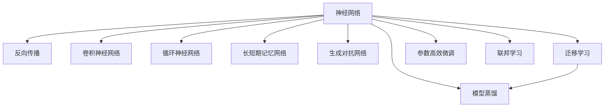
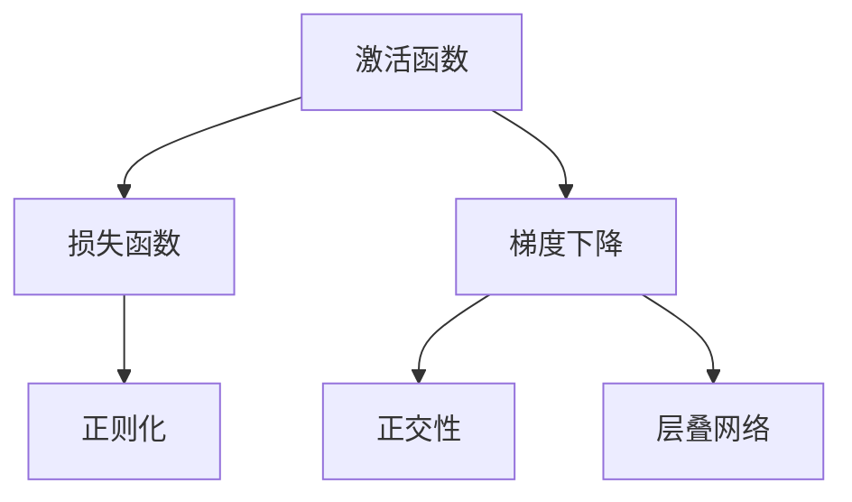

                 

# 神经网络：人工智能的基石

## 1. 背景介绍

### 1.1 问题由来
人工智能(AI)正逐渐渗透到生活的各个领域，从语音识别、图像处理到自然语言处理、自动驾驶，神经网络(Neural Networks)是其中不可或缺的核心技术。自1940年代冯·诺依曼提出的“存储程序”概念以来，计算机学界经历了数十年的探索与实践，最终发现基于人工神经元模型构建的神经网络，为解决复杂的模式识别和智能决策问题提供了强大的工具。

### 1.2 问题核心关键点
- **神经网络(NN)**：一种基于人工神经元模型的计算结构，用于模拟生物神经元之间的连接方式。神经网络通过输入层、隐藏层和输出层，将输入数据映射到输出结果，具备极强的泛化能力和学习能力。
- **反向传播(Backpropagation)**：一种优化算法，通过链式法则计算梯度，反向传播误差，用于训练神经网络。反向传播算法极大地简化了神经网络训练的复杂度，是现代深度学习的基础。
- **卷积神经网络(CNN)**：一种特定的神经网络结构，用于图像处理和视觉任务。CNN通过卷积操作提取局部特征，并通过池化层进行特征降维，能够高效地处理高维图像数据。
- **循环神经网络(RNN)**：一种适用于序列数据处理的神经网络，通过循环机制在序列中传递信息。RNN能够处理不定长的输入序列，是自然语言处理和语音识别等领域的主流模型。
- **长短期记忆网络(LSTM)**：一种改进的RNN结构，用于处理长序列和记忆功能需求，通过门控机制来控制信息的流动，能有效避免梯度消失和梯度爆炸问题。
- **生成对抗网络(GAN)**：一种基于博弈论原理的神经网络结构，由生成器和判别器两部分组成，通过对抗训练，生成逼真的数据或图像，已经在生成模型、图像修复等领域取得了重大突破。
- **迁移学习(Transfer Learning)**：一种通过在已有模型上微调来提高新任务性能的方法。迁移学习使得模型能够利用已有知识，以更少的样本和计算资源，快速适应新任务。
- **参数高效微调(Parameter-Efficient Fine-Tuning, PEFT)**：一种只更新少量模型参数的微调方法，旨在避免过拟合，提高模型的泛化能力。PEFT被广泛应用于移动端和边缘计算环境中，以实现更高的计算效率。
- **模型蒸馏(Distillation)**：一种通过模型间知识转移的方法，将大模型的知识压缩到小模型中，使得小模型在复杂性上与大模型相当，但具有更快的推理速度和更低的存储需求。
- **联邦学习(Federated Learning)**：一种分布式机器学习框架，数据分布在本地设备上，通过本地更新和聚合，实现全局模型的优化，保护用户隐私，同时减少数据传输成本。

这些核心概念之间的逻辑关系可以通过以下Mermaid流程图来展示：



这个流程图展示了几大核心概念及其之间的联系：

1. 神经网络是AI的基础结构，通过反向传播等算法训练优化。
2. CNN和RNN等神经网络结构针对特定任务进行了优化，提高了计算效率和模型表现。
3. 迁移学习和PEFT等方法使得模型能够更好地适应新任务。
4. 模型蒸馏和联邦学习进一步提高了模型性能和效率。

这些概念共同构成了神经网络的研究与应用框架，使得AI技术得以在各个领域实现突破。

## 2. 核心概念与联系

### 2.1 核心概念概述

为更好地理解神经网络的基本原理和应用场景，本节将介绍几个关键概念及其之间的联系：

- **激活函数(Activation Function)**：神经网络的核心组件之一，通过非线性变换将输入转化为输出。常用的激活函数包括ReLU、Sigmoid、Tanh等，引入非线性特性，使得神经网络能够学习复杂的映射关系。
- **损失函数(Loss Function)**：用于衡量神经网络模型输出与真实标签之间的差异，常用的损失函数包括均方误差、交叉熵等，指导模型参数的优化方向。
- **梯度下降(Gradient Descent)**：一种常用的优化算法，通过计算损失函数对参数的梯度，反向传播误差，更新模型参数，使得模型逐渐逼近最优解。
- **正则化(Regularization)**：一种防止过拟合的策略，通过添加L1、L2正则项等，限制模型复杂度，增强泛化能力。
- **正交性(Orthogonality)**：一种优化神经网络权重矩阵的方法，通过正交性约束，使得神经网络能够高效地收敛，避免梯度消失和爆炸问题。
- **层叠网络(Stacked Network)**：由多个隐藏层构成的神经网络，通过逐层抽象，逐步提取出输入数据的高级特征，增强模型的表达能力。

这些概念之间的联系可通过以下Mermaid流程图展示：



这个流程图展示了各个核心概念之间的内在联系：

1. 激活函数和损失函数是神经网络模型的基础组件，用于定义模型的输出和误差。
2. 梯度下降和正则化是优化算法和正则化策略，用于指导模型参数的更新方向。
3. 正交性和层叠网络是模型优化和结构设计的技巧，用于提高模型的表达能力和泛化性能。

## 3. 核心算法原理 & 具体操作步骤
### 3.1 算法原理概述

神经网络的核心在于通过多层非线性变换，将输入数据映射到输出结果。其基本原理如下：

- 输入层：接收原始输入数据，将每个特征值转化为神经元输入。
- 隐藏层：通过权重矩阵和激活函数对输入进行非线性变换，提取出高级特征。
- 输出层：根据任务需求，通过线性变换和激活函数将隐藏层的特征映射为最终输出。

神经网络的训练过程，即为通过反向传播算法，不断调整权重矩阵和激活函数参数，使得模型输出逼近真实标签。具体步骤如下：

1. 初始化神经网络的权重矩阵和激活函数参数。
2. 输入样本数据，计算模型输出。
3. 计算损失函数，反向传播误差。
4. 更新权重矩阵和激活函数参数，通过梯度下降等优化算法，最小化损失函数。
5. 重复步骤2-4，直至收敛。

### 3.2 算法步骤详解

以下是一个简单的全连接神经网络训练流程：

1. **数据准备**：将输入数据和标签数据按顺序排列，分割成训练集、验证集和测试集。
2. **模型初始化**：初始化神经网络的权重矩阵和激活函数参数，通常使用随机初始化。
3. **前向传播**：将训练集数据输入模型，计算模型输出，通过激活函数将输入转化为隐藏层特征。
4. **计算损失**：根据输出结果和真实标签，计算损失函数，衡量模型预测与真实标签之间的差异。
5. **反向传播**：反向传播误差，计算损失函数对每个参数的梯度。
6. **参数更新**：使用梯度下降等优化算法，更新模型参数，使得损失函数逐渐减小。
7. **验证集评估**：在验证集上评估模型性能，调整学习率和超参数，防止过拟合。
8. **测试集评估**：在测试集上评估模型性能，输出最终结果。

### 3.3 算法优缺点

神经网络具有以下优点：

- **强大的泛化能力**：通过多层非线性变换，神经网络可以学习复杂的非线性关系，适应各种复杂任务。
- **可解释性**：通过激活函数和权重矩阵，神经网络能够提供特征重要性分析和模型决策路径。
- **高效的特征提取**：神经网络能够自动提取输入数据中的高级特征，减少了特征工程的工作量。

同时，神经网络也存在一些缺点：

- **计算资源消耗大**：神经网络通常需要大量的计算资源和存储空间，训练和推理过程较为复杂。
- **过拟合问题**：由于模型参数众多，容易产生过拟合现象，需要采取正则化等策略。
- **黑盒特性**：神经网络是一个复杂的非线性模型，难以解释其内部工作机制和决策逻辑。
- **依赖标注数据**：神经网络训练需要大量的标注数据，标注成本较高，且需要保证数据的多样性和代表性。

### 3.4 算法应用领域

神经网络已经广泛应用于计算机视觉、自然语言处理、语音识别、推荐系统等多个领域，以下是几个典型的应用场景：

- **计算机视觉**：使用卷积神经网络(CNN)进行图像分类、目标检测、图像分割等任务。
- **自然语言处理**：使用循环神经网络(RNN)和长短期记忆网络(LSTM)进行语言模型、文本分类、机器翻译等任务。
- **语音识别**：使用循环神经网络(RNN)和卷积神经网络(CNN)进行声学建模和语言建模。
- **推荐系统**：使用神经网络模型进行用户兴趣分析和推荐排序。
- **自动驾驶**：使用卷积神经网络(CNN)和循环神经网络(RNN)进行环境感知、路径规划和行为控制。
- **金融风控**：使用神经网络进行信用评估、风险预测、异常检测等任务。

此外，神经网络还被应用于游戏AI、音乐生成、艺术创作等多个前沿领域，展示了其在复杂决策和创造性任务中的潜力。

## 4. 数学模型和公式 & 详细讲解 & 举例说明

### 4.1 数学模型构建

假设输入数据为 $x \in \mathbb{R}^d$，隐藏层特征为 $h \in \mathbb{R}^n$，输出结果为 $y \in \mathbb{R}^m$。则一个简单的全连接神经网络的数学模型可以表示为：

$$
y = W_1\sigma(h) + b_1
$$

$$
h = W_2x + b_2
$$

其中，$W_1$ 和 $W_2$ 为权重矩阵，$b_1$ 和 $b_2$ 为偏置向量，$\sigma$ 为激活函数。

### 4.2 公式推导过程

以下推导一个简单的全连接神经网络的反向传播算法：

1. **前向传播**：

$$
y = \sigma(W_1h + b_1)
$$

2. **损失函数**：

$$
L = \frac{1}{2}\|y - y'\|^2
$$

3. **反向传播误差**：

$$
\frac{\partial L}{\partial y} = (y - y')
$$

$$
\frac{\partial L}{\partial h} = W_1^T\frac{\partial L}{\partial y} \sigma'(h)
$$

$$
\frac{\partial L}{\partial W_1} = h^T\frac{\partial L}{\partial y} \sigma'(h)
$$

$$
\frac{\partial L}{\partial b_1} = \frac{\partial L}{\partial y}
$$

$$
\frac{\partial L}{\partial W_2} = x^T\frac{\partial L}{\partial h}
$$

$$
\frac{\partial L}{\partial b_2} = \frac{\partial L}{\partial h}
$$

### 4.3 案例分析与讲解

以MNIST手写数字识别为例，分析全连接神经网络的训练过程。

1. **数据准备**：使用MNIST数据集，将图像数据转换为向量形式，将标签数据进行one-hot编码。
2. **模型初始化**：初始化一个具有一个隐藏层和一个输出层的全连接神经网络，使用随机初始化。
3. **前向传播**：将输入数据 $x$ 输入模型，计算隐藏层特征 $h$ 和输出结果 $y$。
4. **计算损失**：使用交叉熵损失函数，计算模型预测与真实标签之间的差异。
5. **反向传播**：根据损失函数对模型参数 $W_1$、$W_2$、$b_1$、$b_2$ 进行反向传播，更新参数。
6. **参数更新**：使用梯度下降算法，更新模型参数，最小化损失函数。
7. **验证集评估**：在验证集上评估模型性能，调整学习率和超参数。
8. **测试集评估**：在测试集上评估模型性能，输出最终结果。

## 5. 项目实践：代码实例和详细解释说明

### 5.1 开发环境搭建

在进行神经网络训练前，我们需要准备好开发环境。以下是使用Python进行TensorFlow开发的环境配置流程：

1. 安装Anaconda：从官网下载并安装Anaconda，用于创建独立的Python环境。

2. 创建并激活虚拟环境：
```bash
conda create -n tf-env python=3.8 
conda activate tf-env
```

3. 安装TensorFlow：根据CUDA版本，从官网获取对应的安装命令。例如：
```bash
pip install tensorflow-gpu==2.4.0
```

4. 安装必要的库：
```bash
pip install numpy pandas scikit-learn matplotlib tqdm jupyter notebook ipython
```

完成上述步骤后，即可在`tf-env`环境中开始神经网络训练实践。

### 5.2 源代码详细实现

这里我们以手写数字识别(MNIST)为例，使用TensorFlow实现一个简单的全连接神经网络。

首先，导入必要的库：

```python
import tensorflow as tf
import numpy as np
import matplotlib.pyplot as plt
```

然后，加载和预处理数据：

```python
mnist = tf.keras.datasets.mnist
(x_train, y_train), (x_test, y_test) = mnist.load_data()

x_train = x_train / 255.0
x_test = x_test / 255.0
```

接下来，定义模型：

```python
model = tf.keras.Sequential([
    tf.keras.layers.Flatten(input_shape=(28, 28)),
    tf.keras.layers.Dense(128, activation='relu'),
    tf.keras.layers.Dense(10, activation='softmax')
])
```

接着，编译模型：

```python
model.compile(optimizer='adam', 
              loss='sparse_categorical_crossentropy', 
              metrics=['accuracy'])
```

然后，训练模型：

```python
history = model.fit(x_train, y_train, epochs=5, validation_data=(x_test, y_test))
```

最后，评估模型：

```python
test_loss, test_acc = model.evaluate(x_test, y_test)
print('Test accuracy:', test_acc)
```

完整代码如下：

```python
import tensorflow as tf
import numpy as np
import matplotlib.pyplot as plt

mnist = tf.keras.datasets.mnist
(x_train, y_train), (x_test, y_test) = mnist.load_data()

x_train = x_train / 255.0
x_test = x_test / 255.0

model = tf.keras.Sequential([
    tf.keras.layers.Flatten(input_shape=(28, 28)),
    tf.keras.layers.Dense(128, activation='relu'),
    tf.keras.layers.Dense(10, activation='softmax')
])

model.compile(optimizer='adam', 
              loss='sparse_categorical_crossentropy', 
              metrics=['accuracy'])

history = model.fit(x_train, y_train, epochs=5, validation_data=(x_test, y_test))

test_loss, test_acc = model.evaluate(x_test, y_test)
print('Test accuracy:', test_acc)
```

可以看到，TensorFlow提供了简单易用的接口，使得神经网络的训练过程变得非常简单。

### 5.3 代码解读与分析

让我们再详细解读一下关键代码的实现细节：

**数据准备**：
- `mnist.load_data()`：加载MNIST数据集。
- `x_train = x_train / 255.0`：将图像数据归一化，将像素值缩放到[0,1]范围内。

**模型定义**：
- `tf.keras.Sequential()`：定义序列模型，按顺序添加层。
- `tf.keras.layers.Flatten(input_shape=(28, 28))`：将28x28的图像数据展平为一维向量。
- `tf.keras.layers.Dense(128, activation='relu')`：定义一个128个神经元的全连接层，使用ReLU激活函数。
- `tf.keras.layers.Dense(10, activation='softmax')`：定义一个10个神经元的全连接层，使用Softmax激活函数，用于输出分类概率。

**模型编译**：
- `model.compile()`：配置模型的优化器、损失函数和评估指标。

**模型训练**：
- `model.fit()`：执行模型的训练过程，指定训练集、验证集和训练轮数。
- `history`：保存训练过程中的损失和准确率变化情况。

**模型评估**：
- `model.evaluate()`：评估模型在测试集上的性能，返回损失和准确率。

代码实现了完整的神经网络训练流程，包括数据预处理、模型定义、编译和训练、评估等步骤。通过TensorFlow提供的高级API，大大简化了模型的开发和调试过程。

## 6. 实际应用场景

### 6.1 智能推荐系统

智能推荐系统通过分析用户行为和偏好，为用户推荐个性化的商品、文章、视频等。神经网络在推荐系统中发挥了重要作用，能够高效地处理大规模用户数据和复杂的多维特征。

在实践中，神经网络模型可以使用用户行为数据、商品特征、用户画像等作为输入，通过学习用户与商品之间的交互关系，生成推荐排序。使用深度学习技术，可以构建更加复杂和精确的推荐模型，如基于协同过滤、基于内容推荐、基于混合模型等。

### 6.2 自然语言处理(NLP)

自然语言处理是人工智能的重要应用领域之一，涉及文本分类、情感分析、机器翻译、问答系统等多个子领域。神经网络在NLP领域中的应用，显著提升了模型的性能和泛化能力。

以机器翻译为例，神经网络模型可以将源语言文本映射到目标语言文本，通过编码-解码机制，实现高效的翻译转换。使用Transformer架构，可以进一步提高模型的翻译质量和效率。

### 6.3 自动驾驶

自动驾驶技术需要处理复杂的视觉和感知数据，以实现车辆的自主导航和决策。神经网络在自动驾驶中主要用于环境感知、路径规划和行为控制。

通过使用卷积神经网络(CNN)进行图像识别，可以提取道路、车辆、行人等关键对象的信息。使用循环神经网络(RNN)或长短期记忆网络(LSTM)进行轨迹预测和路径规划，可以模拟车辆在复杂环境中的行为。

### 6.4 未来应用展望

随着神经网络技术的不断进步，未来的应用场景将更加广泛和深入。

- **医疗诊断**：神经网络可以通过分析医疗影像、病历记录等数据，辅助医生进行疾病诊断和治疗方案制定。
- **金融风控**：神经网络可以用于信用评估、风险预测、异常检测等金融风控任务。
- **智能客服**：神经网络可以用于智能客服系统的构建，通过理解用户意图，提供个性化的咨询服务。
- **智慧城市**：神经网络可以用于城市交通管理、公共安全、环境监测等智慧城市治理任务。
- **游戏AI**：神经网络可以用于游戏中的角色控制、任务生成和策略优化，增强游戏的趣味性和互动性。
- **虚拟现实**：神经网络可以用于虚拟现实场景的生成和优化，提升用户体验。

未来，神经网络技术将与更多的学科领域进行交叉融合，推动人工智能技术的更广泛应用。

## 7. 工具和资源推荐

### 7.1 学习资源推荐

为了帮助开发者系统掌握神经网络的基本原理和实践技巧，这里推荐一些优质的学习资源：

1. 《深度学习》（Ian Goodfellow, Yoshua Bengio, Aaron Courville）：深度学习的经典教材，全面介绍了神经网络、深度学习模型、优化算法等核心内容。

2. CS231n《卷积神经网络》课程：斯坦福大学开设的计算机视觉课程，系统讲解了卷积神经网络的理论基础和实践技巧。

3. CS224n《自然语言处理》课程：斯坦福大学开设的自然语言处理课程，涵盖了神经网络在NLP任务中的应用。

4. DeepLearning.ai《深度学习专项课程》：由Andrew Ng教授授课，系统介绍了深度学习的核心概念和技术，适合初学者入门。

5. PyTorch官方文档：PyTorch的官方文档，提供了丰富的神经网络模型和教程，是学习深度学习的必备资源。

6. TensorFlow官方文档：TensorFlow的官方文档，提供了完整的深度学习框架和教程，适合TensorFlow用户。

7. Kaggle竞赛：Kaggle是一个数据科学竞赛平台，提供了大量真实数据和挑战题目，是实践深度学习的绝佳场所。

通过对这些资源的学习实践，相信你一定能够快速掌握神经网络的基本原理和实践技巧，并用于解决实际的深度学习问题。

### 7.2 开发工具推荐

高效的开发离不开优秀的工具支持。以下是几款用于神经网络开发的常用工具：

1. PyTorch：基于Python的开源深度学习框架，灵活的动态计算图，支持自动微分和优化算法，适合快速迭代研究。

2. TensorFlow：由Google主导开发的开源深度学习框架，功能丰富，支持分布式训练和推理，适合大规模工程应用。

3. Keras：基于TensorFlow和Theano的高级API，提供了简单易用的神经网络模型，适合初学者入门。

4. MXNet：由亚马逊开发的深度学习框架，支持多种编程语言和硬件平台，适合高性能计算和分布式训练。

5. PyTorch Lightning：基于PyTorch的高级框架，提供了模型封装、调度和日志记录等功能，加速模型开发和调试。

6. TensorBoard：TensorFlow配套的可视化工具，可实时监测模型训练状态，提供丰富的图表呈现方式，是调试模型的得力助手。

7. HuggingFace Transformers库：提供了丰富的预训练模型和任务适配层，适合进行自然语言处理任务开发。

合理利用这些工具，可以显著提升神经网络开发的效率，加速创新迭代的步伐。

### 7.3 相关论文推荐

神经网络技术的发展离不开学界的持续研究。以下是几篇奠基性的相关论文，推荐阅读：

1. 《Backpropagation: Application to Time Delay Networks and Error-Backpropagation to Minimize Prediction Errors》（Rumelhart, Hinton, Williams, 1986）：提出了反向传播算法，为深度学习训练提供了重要基础。

2. 《ImageNet Classification with Deep Convolutional Neural Networks》（Krizhevsky, Sutskever, Hinton, 2012）：展示了卷积神经网络在图像分类任务上的优异表现，推动了计算机视觉的发展。

3. 《Learning Phrases, Words, Tags》（Collobert, Weston, Bottou, Karlen, Kavukcuoglu, Mikolov, 2011）：提出了使用单层神经网络进行语言建模和分类，开创了深度学习在NLP中的应用。

4. 《A Tutorial on Deep Learning with TensorFlow》（Abadi, Agarwal, Andersen, Chen, Cheng, Torresani, Favaro, Gerome, Goodfellow, Harp, Mahalschmid, Mika, Monks, Mottaghi, Razaviyayn, Sabatini, Sanjurjo, Schuster, Sergey, Simonyan, Sismani, So, Tai, Thang, Tschannen, Vassilovskiy, Yu, Zeiler, Zhang, Zhu, 2017）：介绍了TensorFlow的基本使用方法和深度学习模型。

5. 《Attention Is All You Need》（Vaswani, Shazeer, Parmar, Uszkoreit, Jones, Gomez, Kaiser, Polosukhin, 2017）：提出了Transformer架构，展示了自注意力机制在自然语言处理中的强大能力。

6. 《Distillation》（Hinton, Vinyals, Dean, 2015）：介绍了模型蒸馏技术，通过知识转移，提高了模型性能和泛化能力。

这些论文代表了大神经网络的研究方向，通过学习这些前沿成果，可以帮助研究者把握学科前进方向，激发更多的创新灵感。

## 8. 总结：未来发展趋势与挑战

### 8.1 研究成果总结

神经网络技术经过数十年的发展，已经成为人工智能领域的重要基石。其核心思想是通过多层非线性变换，将输入数据映射到输出结果，具备强大的泛化能力和特征提取能力。

### 8.2 未来发展趋势

神经网络技术将持续演进，推动AI技术的进一步发展。未来的发展趋势包括：

1. **大规模模型**：随着算力提升和数据规模扩大，神经网络模型的参数量将持续增加，使得模型能够处理更复杂、更丰富的输入数据。
2. **自监督学习**：通过大规模无标签数据进行预训练，神经网络能够自动学习到数据中的有用信息，减少对标注数据的依赖。
3. **跨模态融合**：神经网络能够处理视觉、文本、语音等多模态数据，实现跨模态融合，提升模型的理解和推理能力。
4. **强化学习**：神经网络结合强化学习，能够在复杂环境中进行自主学习和决策，推动AI技术在自动驾驶、游戏AI等领域的突破。
5. **可解释性**：神经网络的可解释性将进一步提升，通过可视化工具和解释技术，使得模型决策过程更加透明和可信。
6. **联邦学习**：神经网络结合联邦学习，能够在分布式环境中进行知识共享和模型优化，保护用户隐私，提升模型性能。
7. **跨领域应用**：神经网络技术将与其他学科进行更深入的融合，推动医疗、金融、教育等领域的智能化进程。

### 8.3 面临的挑战

尽管神经网络技术已经取得了显著的进展，但在实际应用中仍面临诸多挑战：

1. **计算资源消耗大**：神经网络模型需要大量的计算资源和存储空间，训练和推理过程较为复杂。
2. **过拟合问题**：由于模型参数众多，容易产生过拟合现象，需要采取正则化等策略。
3. **黑盒特性**：神经网络是一个复杂的非线性模型，难以解释其内部工作机制和决策逻辑。
4. **标注数据依赖**：神经网络训练需要大量的标注数据，标注成本较高，且需要保证数据的多样性和代表性。
5. **安全性和公平性**：神经网络模型容易学习到偏见和有害信息，需要加强数据和模型的公平性和安全性。

### 8.4 研究展望

未来的研究需要在以下几个方面寻求新的突破：

1. **自监督学习**：探索无监督和半监督学习方法，降低对标注数据的依赖，利用大规模无标签数据进行预训练。
2. **模型蒸馏**：开发更加参数高效的模型蒸馏方法，提高模型性能和泛化能力，减少计算资源消耗。
3. **可解释性**：引入因果分析、博弈论等工具，增强模型的可解释性，使得决策过程更加透明和可信。
4. **联邦学习**：结合分布式计算和模型优化技术，提高联邦学习模型的性能和安全性，保护用户隐私。
5. **跨模态融合**：将视觉、文本、语音等多模态数据进行融合，提升模型的理解和推理能力。
6. **强化学习**：结合强化学习技术，增强神经网络在复杂环境中的自主学习和决策能力。

这些研究方向的探索，必将引领神经网络技术迈向更高的台阶，为构建智能系统提供更强大的工具。只有勇于创新、敢于突破，才能不断拓展神经网络的边界，推动人工智能技术的更广泛应用。

## 9. 附录：常见问题与解答

**Q1：神经网络是否适用于所有NLP任务？**

A: 神经网络在大多数NLP任务上都能取得不错的效果，特别是对于数据量较大的任务。但对于一些特定领域的任务，如医学、法律等，仅仅依靠通用语料预训练的模型可能难以很好地适应。此时需要在特定领域语料上进一步预训练，再进行微调，才能获得理想效果。

**Q2：神经网络在训练过程中如何防止过拟合？**

A: 防止过拟合是神经网络训练中的重要问题。常见的防止过拟合的方法包括：
1. 数据增强：通过对训练数据进行旋转、裁剪、翻转等操作，增加数据多样性。
2. 正则化：使用L1、L2正则项，限制模型参数的大小，避免过拟合。
3. Dropout：随机丢弃一部分神经元，减少神经元之间的依赖关系。
4. 早停法(Early Stopping)：在验证集上监控模型性能，一旦性能不再提升，停止训练。

**Q3：神经网络训练过程中如何选择学习率？**

A: 学习率的选择对神经网络的训练效果有重要影响。一般建议采用学习率衰减策略，如学习率减半或指数衰减，以适应训练过程中参数的优化。常见的学习率选择方法包括：
1. 网格搜索：通过设定多个学习率，训练多个模型，选择性能最好的模型。
2. 随机搜索：在一定范围内随机选择学习率，进行多次训练，选择表现最好的学习率。
3. 自适应学习率：如Adam、Adagrad等自适应优化算法，根据梯度信息自动调整学习率。

**Q4：神经网络模型在实际部署时需要注意哪些问题？**

A: 将神经网络模型转化为实际应用，还需要考虑以下因素：
1. 模型裁剪：去除不必要的层和参数，减小模型尺寸，加快推理速度。
2. 量化加速：将浮点模型转为定点模型，压缩存储空间，提高计算效率。
3. 服务化封装：将模型封装为标准化服务接口，便于集成调用。
4. 弹性伸缩：根据请求流量动态调整资源配置，平衡服务质量和成本。
5. 监控告警：实时采集系统指标，设置异常告警阈值，确保服务稳定性。

通过合理设计模型结构，优化训练过程，合理部署模型，可以确保神经网络模型在实际应用中的高效性和可靠性。

**Q5：神经网络模型在实际应用中如何提高泛化能力？**

A: 提高神经网络模型的泛化能力，可以从以下几个方面入手：
1. 数据多样性：保证训练数据的多样性和代表性，避免模型过拟合。
2. 正则化：使用L1、L2正则项，限制模型复杂度，避免过拟合。
3. 提前停止(Early Stopping)：在验证集上监控模型性能，一旦性能不再提升，停止训练。
4. 数据增强：通过对训练数据进行旋转、裁剪、翻转等操作，增加数据多样性。
5. 模型集成：通过训练多个模型，取平均值或加权平均值，提高模型泛化能力。

通过这些方法，可以有效地提高神经网络模型的泛化能力，使其在实际应用中表现更加稳定和可靠。

---

作者：禅与计算机程序设计艺术 / Zen and the Art of Computer Programming

