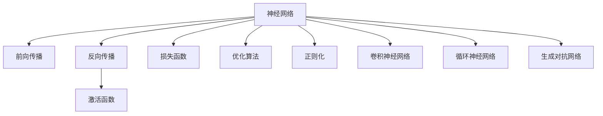

                 

## 1. 背景介绍

### 1.1 问题由来
神经网络(Neural Network, NN)作为人工智能(Artificial Intelligence, AI)的核心技术，已经成为解决各类复杂问题的利器。从图像识别、语音识别，到自然语言处理、知识图谱，神经网络在各个领域展现了其强大的建模能力和泛化能力。然而，在深入理解神经网络的设计原理和优化方法之前，有必要先澄清一些常见的误解和偏见，并理清神经网络的基本概念。

### 1.2 问题核心关键点
神经网络的核心关键点包括：
1. **网络结构**：如何将输入数据通过一系列线性变换和非线性激活函数进行传递，以捕捉数据中的模式和结构。
2. **损失函数**：如何定义损失函数，使得网络通过反向传播算法最小化损失，不断优化模型参数。
3. **优化算法**：如何选择优化算法，如梯度下降、动量、自适应学习率等，以高效地更新模型参数。
4. **正则化技术**：如何防止过拟合，提高模型的泛化能力。
5. **数据增强**：如何通过数据增强技术提升模型对新样本的适应能力。
6. **架构优化**：如何通过网络结构的设计和优化，提高模型的训练效率和性能。

这些关键点共同构成了神经网络的工作原理和优化方法，是理解和使用神经网络技术的基础。

### 1.3 问题研究意义
研究神经网络的设计原理和优化方法，对于推动人工智能技术的发展，具有重要意义：

1. **促进模型性能提升**：通过优化网络结构、损失函数、正则化技术等，可以显著提升神经网络的性能，使其在更广泛的应用场景中取得突破。
2. **加速应用落地**：神经网络技术的成熟应用，将加速其在各行业的落地进程，提高产业智能化水平。
3. **推动理论创新**：神经网络的研究不仅有助于解决实际问题，还催生了深度学习、优化算法、统计学习等众多新领域的研究热点。
4. **提升产业竞争力**：神经网络技术的突破，为各企业提供新的技术动力，增强其市场竞争力。
5. **推动科研合作**：神经网络技术的研究需要跨学科的合作，推动计算机科学、数学、工程等领域的深度融合。

## 2. 核心概念与联系

### 2.1 核心概念概述

为更好地理解神经网络，本节将介绍几个密切相关的核心概念：

- **神经网络**：一种通过大量参数化节点(神经元)构建的多层计算模型，能够自动学习数据的表示和特征，并通过训练进行优化。
- **前向传播**：指数据从输入层向输出层的单向传递过程，通过一系列线性变换和非线性激活函数，得到最终输出。
- **反向传播**：指利用目标输出与当前输出的差值，反向计算梯度，更新模型参数的过程，通常与梯度下降算法结合使用。
- **激活函数**：非线性变换函数，用于增加网络模型的非线性能力，提高拟合复杂数据的能力。
- **损失函数**：衡量模型输出与目标输出之间的差异，通过最小化损失函数来优化模型。
- **优化算法**：通过梯度信息更新模型参数的算法，如梯度下降、Adam、Adagrad等。
- **正则化**：通过添加约束条件，防止模型过拟合，如L2正则、Dropout等。
- **卷积神经网络(CNN)**：一种专门用于图像处理的神经网络，通过卷积层、池化层等设计，提取图像的空间特征。
- **循环神经网络(RNN)**：一种能够处理序列数据的神经网络，通过循环结构捕捉时间依赖性。
- **生成对抗网络(GAN)**：一种由生成器和判别器构成的对抗性训练模型，用于生成逼真的数据或图像。

这些核心概念之间的逻辑关系可以通过以下Mermaid流程图来展示：



这个流程图展示了神经网络的核心组件和工作流程：

1. 数据通过前向传播进入网络，经过多个变换和激活函数，得到最终输出。
2. 反向传播计算梯度，更新模型参数，以最小化损失函数。
3. 激活函数增加非线性能力，提高模型的表达力。
4. 损失函数衡量模型输出与目标之间的差异，指导模型优化。
5. 优化算法通过梯度信息更新参数，避免陷入局部最优。
6. 正则化防止过拟合，提高模型泛化能力。
7. CNN处理图像，RNN处理序列，GAN生成逼真数据。

这些概念共同构成了神经网络的基本框架，使其能够处理复杂的数据和任务。

## 3. 核心算法原理 & 具体操作步骤
### 3.1 算法原理概述

神经网络的核心算法原理是通过多层非线性变换捕捉数据的表示和特征，并通过反向传播算法不断优化模型参数，以最小化损失函数。

假设给定一个神经网络模型 $M_{\theta}$，其中 $\theta$ 为模型参数。设训练集为 $D=\{(x_i, y_i)\}_{i=1}^N$，其中 $x_i$ 为输入数据，$y_i$ 为标签。神经网络的输出为 $\hat{y}=M_{\theta}(x)$，则损失函数 $\mathcal{L}(\theta)$ 定义为：

$$
\mathcal{L}(\theta) = \frac{1}{N}\sum_{i=1}^N (\hat{y}_i - y_i)^2
$$

神经网络的目标是通过反向传播算法，最小化损失函数 $\mathcal{L}(\theta)$，以得到最优参数 $\theta^*$。具体步骤如下：

1. 将训练集数据 $D$ 随机分成训练集和验证集。
2. 初始化模型参数 $\theta$。
3. 前向传播：将输入数据 $x$ 通过网络传递，计算输出 $\hat{y}$。
4. 计算损失 $\mathcal{L}(\theta)$。
5. 反向传播：利用目标输出与当前输出的差值，反向计算梯度。
6. 优化算法：根据梯度信息更新模型参数 $\theta$。
7. 验证集评估：在验证集上评估模型性能，检查是否过拟合。
8. 循环迭代：重复以上步骤，直至模型收敛。

### 3.2 算法步骤详解

神经网络的具体训练步骤如下：

1. **初始化模型参数**：随机初始化模型参数 $\theta$，通常使用Xavier初始化或He初始化。

2. **前向传播**：将输入数据 $x$ 通过网络传递，计算每层输出 $\hat{z}^{[l]}$，其中 $z^{[l]}$ 为第 $l$ 层的激活值。

   $$
   z^{[l]} = W^{[l]}x^{[l-1]} + b^{[l]}
   $$

   $$
   x^{[l]} = \sigma(z^{[l]})
   $$

   其中 $W^{[l]}$ 和 $b^{[l]}$ 分别为第 $l$ 层的权重和偏置，$\sigma$ 为激活函数，通常使用ReLU、Sigmoid等。

3. **计算损失**：将模型输出 $\hat{y}$ 与真实标签 $y$ 的差异计算为损失。

   $$
   \mathcal{L}(\theta) = \frac{1}{N}\sum_{i=1}^N (\hat{y}_i - y_i)^2
   $$

4. **反向传播**：计算损失函数对参数的梯度，通过链式法则进行传递。

   $$
   \frac{\partial \mathcal{L}}{\partial z^{[L]}} = -2(\hat{y}^{[L]}-y)
   $$

   $$
   \frac{\partial \mathcal{L}}{\partial z^{[l]}} = \frac{\partial \mathcal{L}}{\partial z^{[l+1]}} \cdot \frac{\partial z^{[l+1]}}{\partial z^{[l]}} = \frac{\partial \mathcal{L}}{\partial z^{[l+1]}} \cdot \sigma'(z^{[l]})
   $$

5. **更新参数**：使用优化算法，根据梯度信息更新参数。

   $$
   \theta \leftarrow \theta - \eta \frac{\partial \mathcal{L}}{\partial \theta}
   $$

   其中 $\eta$ 为学习率，$\frac{\partial \mathcal{L}}{\partial \theta}$ 为梯度。

6. **验证集评估**：在验证集上评估模型性能，检查是否过拟合。

7. **循环迭代**：重复以上步骤，直至模型收敛。

### 3.3 算法优缺点

神经网络的优点包括：
1. 自动学习特征：通过大量数据进行训练，神经网络能够自动学习数据的特征表示，无需手动设计特征。
2. 强大的拟合能力：多层非线性变换和优化算法使得神经网络能够捕捉复杂数据模式。
3. 灵活性高：神经网络结构灵活，可以根据任务特点进行设计，如卷积层、池化层、循环结构等。
4. 可扩展性强：通过增加层数和节点，神经网络能够处理更复杂的任务。

神经网络的缺点包括：
1. 参数量大：神经网络参数量大，计算复杂度高，需要高性能计算资源。
2. 局部最优：神经网络易陷入局部最优，导致训练不收敛或收敛速度慢。
3. 过拟合风险：神经网络需要大量数据进行训练，否则容易出现过拟合。
4. 可解释性差：神经网络模型通常难以解释，难以进行调试和优化。
5. 资源需求高：神经网络计算资源需求高，部署和推理成本高。

尽管存在这些缺点，但神经网络凭借其强大的建模能力，在图像识别、语音识别、自然语言处理等领域取得了巨大的成功，成为人工智能的核心技术。

### 3.4 算法应用领域

神经网络技术已经被广泛应用于多个领域，以下是几个典型的应用案例：

1. **计算机视觉**：神经网络在图像识别、目标检测、图像生成等领域取得了重要突破，如AlexNet、VGG、ResNet等模型。
2. **自然语言处理**：神经网络在文本分类、语言翻译、情感分析等领域表现出色，如RNN、LSTM、Transformer等。
3. **语音识别**：神经网络在语音识别、语音合成等领域效果显著，如DNN、CNN等。
4. **推荐系统**：神经网络在推荐系统、广告投放等领域得到广泛应用，如FM、CTR等模型。
5. **金融风控**：神经网络在信用评分、欺诈检测等领域表现出色，如CNN、RNN等模型。
6. **医疗健康**：神经网络在医学影像分析、疾病预测等领域得到应用，如CNN、RNN等模型。

除了上述这些经典应用外，神经网络还在自动化驾驶、游戏AI、量子计算等领域展现了其强大的能力。随着技术的不断发展，神经网络的应用场景将进一步扩展。

## 4. 数学模型和公式 & 详细讲解
### 4.1 数学模型构建

神经网络的基本数学模型可以表示为：

$$
y = M_{\theta}(x) = \sigma(Wx + b)
$$

其中 $M_{\theta}$ 为神经网络模型，$x$ 为输入数据，$y$ 为输出，$\sigma$ 为激活函数，$W$ 和 $b$ 分别为权重和偏置。

神经网络的输入层为 $x$，输出层为 $y$，中间层为 $z^{[l]}$，其中 $l$ 为层数。

### 4.2 公式推导过程

假设神经网络有 $n$ 个输入特征，$m$ 个输出标签，$l$ 层隐藏层。则神经网络的参数为：

$$
\theta = \{W^{[l]}, b^{[l]}, \sigma\}_{l=1}^L
$$

其中 $W^{[l]} \in \mathbb{R}^{m \times n}$ 为第 $l$ 层的权重，$b^{[l]} \in \mathbb{R}^{m}$ 为第 $l$ 层的偏置，$\sigma$ 为激活函数。

前向传播过程的数学公式为：

$$
x^{[l]} = \sigma(W^{[l]}x^{[l-1]} + b^{[l]})
$$

其中 $x^{[l]}$ 为第 $l$ 层的激活值，$W^{[l]}$ 和 $b^{[l]}$ 为第 $l$ 层的参数。

损失函数的数学公式为：

$$
\mathcal{L}(\theta) = \frac{1}{N}\sum_{i=1}^N (\hat{y}_i - y_i)^2
$$

其中 $\hat{y}_i$ 为第 $i$ 个样本的模型输出，$y_i$ 为第 $i$ 个样本的真实标签。

反向传播过程中，损失函数对第 $l$ 层输出 $\hat{y}^{[l]}$ 的梯度为：

$$
\frac{\partial \mathcal{L}}{\partial \hat{y}^{[l]}} = -\frac{2}{N}\sum_{i=1}^N (\hat{y}_i - y_i)
$$

通过链式法则，计算第 $l$ 层输出 $\hat{y}^{[l]}$ 对输入 $z^{[l-1]}$ 的梯度：

$$
\frac{\partial \mathcal{L}}{\partial z^{[l-1]}} = \frac{\partial \mathcal{L}}{\partial \hat{y}^{[l]}} \cdot \frac{\partial \hat{y}^{[l]}}{\partial z^{[l-1]}}
$$

其中 $\frac{\partial \hat{y}^{[l]}}{\partial z^{[l-1]}}$ 为激活函数导数与权重矩阵的乘积：

$$
\frac{\partial \hat{y}^{[l]}}{\partial z^{[l-1]}} = \frac{\partial \sigma(z^{[l]})}{\partial z^{[l]}} \cdot W^{[l]}
$$

最终，将反向传播过程应用于每层神经元，计算损失函数对每层参数的梯度，进行优化更新。

### 4.3 案例分析与讲解

以一个简单的两层神经网络为例，进行案例分析：

假设输入 $x$ 为二维向量，输出 $y$ 为二分类结果。激活函数为Sigmoid函数，损失函数为二分类交叉熵损失。

- 输入层：
  - 激活函数：$x^{[0]} = x$
  - 损失函数：$\mathcal{L}(x^{[0]}) = -(y \log \hat{y} + (1-y) \log (1-\hat{y}))$
- 隐藏层：
  - 激活函数：$\hat{y}^{[1]} = \sigma(W^{[1]}x^{[0]} + b^{[1]})$
  - 损失函数：$\mathcal{L}(\hat{y}^{[1]}) = -(y \log \hat{y}^{[1]} + (1-y) \log (1-\hat{y}^{[1]}))$

通过前向传播和反向传播，计算损失函数对输入 $x$ 的梯度，进行参数更新。

```python
import torch
import torch.nn as nn
import torch.optim as optim

# 定义神经网络模型
class SimpleNet(nn.Module):
    def __init__(self):
        super(SimpleNet, self).__init__()
        self.fc1 = nn.Linear(2, 3)
        self.fc2 = nn.Linear(3, 1)
        self.sigmoid = nn.Sigmoid()
    
    def forward(self, x):
        x = self.fc1(x)
        x = self.sigmoid(x)
        x = self.fc2(x)
        return x

# 定义损失函数
criterion = nn.BCELoss()

# 定义优化器
optimizer = optim.SGD(model.parameters(), lr=0.1)

# 定义训练函数
def train(model, criterion, optimizer, train_loader, epochs):
    model.train()
    for epoch in range(epochs):
        for batch_idx, (data, target) in enumerate(train_loader):
            optimizer.zero_grad()
            output = model(data)
            loss = criterion(output, target)
            loss.backward()
            optimizer.step()
            if (batch_idx+1) % 100 == 0:
                print('Train Epoch: {} [{}/{} ({:.0f}%)]\tLoss: {:.6f}'.format(
                    epoch, batch_idx * len(data), len(train_loader.dataset),
                    100. * batch_idx / len(train_loader), loss.item()))

# 训练模型
train_loader = ...
train(model, criterion, optimizer, train_loader, epochs=10)
```

这个案例展示了如何定义一个简单的两层神经网络，并进行二分类任务的训练。通过反向传播和优化器更新参数，使得模型逐渐逼近最优解。

## 5. 项目实践：代码实例和详细解释说明
### 5.1 开发环境搭建

在进行神经网络开发时，需要一个高性能的计算环境。以下是使用PyTorch搭建神经网络开发环境的流程：

1. 安装Anaconda：从官网下载并安装Anaconda，用于创建独立的Python环境。

```bash
conda create -n pytorch-env python=3.8
conda activate pytorch-env
```

2. 安装PyTorch：根据CUDA版本，从官网获取对应的安装命令。例如：

```bash
conda install pytorch torchvision torchaudio cudatoolkit=11.1 -c pytorch -c conda-forge
```

3. 安装TensorBoard：用于可视化训练过程。

```bash
pip install tensorboard
```

4. 安装PyTorch-lightning：用于快速构建神经网络模型和训练流程。

```bash
pip install pytorch-lightning
```

5. 安装其他工具包：

```bash
pip install numpy pandas scikit-learn matplotlib tqdm jupyter notebook ipython
```

完成上述步骤后，即可在`pytorch-env`环境中进行神经网络开发。

### 5.2 源代码详细实现

下面以一个简单的两层神经网络为例，给出使用PyTorch进行二分类任务训练的代码实现。

```python
import torch
import torch.nn as nn
import torch.optim as optim
import torch.utils.data
import numpy as np
from sklearn.datasets import make_classification
from sklearn.model_selection import train_test_split
from torch.utils.data import DataLoader, TensorDataset

# 定义数据生成函数
def generate_data(n_samples=100, n_features=2, n_informative=2, n_classes=2, random_state=0):
    X, y = make_classification(n_samples=n_samples, n_features=n_features, n_informative=n_informative,
                              n_classes=n_classes, random_state=random_state)
    X = torch.from_numpy(X).float()
    y = torch.from_numpy(y).float()
    return X, y

# 定义数据集
X, y = generate_data()

# 划分训练集和测试集
train_X, test_X, train_y, test_y = train_test_split(X, y, test_size=0.2, random_state=0)

# 定义模型
class SimpleNet(nn.Module):
    def __init__(self):
        super(SimpleNet, self).__init__()
        self.fc1 = nn.Linear(2, 3)
        self.fc2 = nn.Linear(3, 1)
        self.sigmoid = nn.Sigmoid()
    
    def forward(self, x):
        x = self.fc1(x)
        x = self.sigmoid(x)
        x = self.fc2(x)
        return x

model = SimpleNet()

# 定义损失函数
criterion = nn.BCELoss()

# 定义优化器
optimizer = optim.SGD(model.parameters(), lr=0.1)

# 定义训练函数
def train(model, criterion, optimizer, train_loader, epochs):
    model.train()
    for epoch in range(epochs):
        for batch_idx, (data, target) in enumerate(train_loader):
            optimizer.zero_grad()
            output = model(data)
            loss = criterion(output, target)
            loss.backward()
            optimizer.step()
            if (batch_idx+1) % 100 == 0:
                print('Train Epoch: {} [{}/{} ({:.0f}%)]\tLoss: {:.6f}'.format(
                    epoch, batch_idx * len(data), len(train_loader.dataset),
                    100. * batch_idx / len(train_loader), loss.item()))

# 定义数据加载器
train_loader = DataLoader(TensorDataset(train_X, train_y), batch_size=32, shuffle=True)
test_loader = DataLoader(TensorDataset(test_X, test_y), batch_size=32)

# 训练模型
train(model, criterion, optimizer, train_loader, epochs=10)

# 评估模型
model.eval()
with torch.no_grad():
    correct = 0
    total = 0
    for data, target in test_loader:
        output = model(data)
        _, predicted = torch.max(output.data, 1)
        total += target.size(0)
        correct += (predicted == target).sum().item()
    print('Accuracy of the network on the 10000 test images: {} %'.format(100 * correct / total))
```

以上代码实现了使用PyTorch进行神经网络训练和评估的过程。可以看到，PyTorch提供了便捷的API接口，使得模型定义、训练、评估等过程非常简单。

### 5.3 代码解读与分析

下面我们详细解读一下关键代码的实现细节：

**数据生成**：
- 使用`make_classification`函数生成2维特征、2个类别、2个信息特征的样本数据，用于训练和测试。
- 将生成数据转换为Tensor，方便PyTorch进行处理。

**模型定义**：
- 定义一个简单的两层神经网络，包括两个线性层和Sigmoid激活函数。
- 在前向传播过程中，通过线性变换和激活函数，将输入数据传递到输出层。

**损失函数和优化器**：
- 使用二分类交叉熵损失函数，适合二分类任务。
- 使用随机梯度下降优化器，进行模型参数的更新。

**训练函数**：
- 在训练函数中，循环迭代模型前向传播、计算损失、反向传播和参数更新。
- 在每个epoch结束后，输出损失和训练进度。

**数据加载器**：
- 使用`DataLoader`创建数据加载器，方便对数据进行批量加载。
- 使用`TensorDataset`创建数据集，将特征和标签打包在一起。

**模型评估**：
- 在评估函数中，使用`torch.no_grad()`关闭梯度计算，计算模型在测试集上的准确率。

通过上述代码，我们可以看到PyTorch的便捷性和易用性，使得神经网络模型的训练和评估过程变得非常简单。

## 6. 实际应用场景

### 6.1 计算机视觉

神经网络在计算机视觉领域有着广泛的应用，如图像分类、目标检测、图像生成等。以图像分类为例，可以使用卷积神经网络(CNN)来提取图像的局部特征，并通过全连接层进行分类。

**案例**：手写数字识别

```python
import torch
import torchvision
import torchvision.transforms as transforms
from torchvision.models import resnet18

# 定义数据加载器
transform = transforms.Compose([
    transforms.ToTensor(),
    transforms.Normalize((0.5, 0.5, 0.5), (0.5, 0.5, 0.5))
])

train_loader = torchvision.datasets.MNIST('data/', train=True, download=True, transform=transform)
test_loader = torchvision.datasets.MNIST('data/', train=False, download=True, transform=transform)

# 定义模型
model = resnet18()

# 定义损失函数和优化器
criterion = nn.CrossEntropyLoss()
optimizer = optim.SGD(model.parameters(), lr=0.01)

# 训练模型
for epoch in range(10):
    model.train()
    for batch_idx, (data, target) in enumerate(train_loader):
        optimizer.zero_grad()
        output = model(data)
        loss = criterion(output, target)
        loss.backward()
        optimizer.step()
        if (batch_idx+1) % 100 == 0:
            print('Train Epoch: {} [{}/{} ({:.0f}%)]\tLoss: {:.6f}'.format(
                epoch, batch_idx * len(data), len(train_loader.dataset),
                100. * batch_idx / len(train_loader), loss.item()))

# 评估模型
model.eval()
with torch.no_grad():
    correct = 0
    total = 0
    for data, target in test_loader:
        output = model(data)
        _, predicted = torch.max(output.data, 1)
        total += target.size(0)
        correct += (predicted == target).sum().item()
    print('Accuracy of the network on the 10000 test images: {} %'.format(100 * correct / total))
```

通过上述代码，我们可以看到使用PyTorch进行图像分类的过程，包括数据加载、模型定义、训练和评估等步骤。

### 6.2 自然语言处理

神经网络在自然语言处理(NLP)领域也有广泛应用，如文本分类、语言翻译、情感分析等。以文本分类为例，可以使用循环神经网络(RNN)或Transformer来处理序列数据，并通过全连接层进行分类。

**案例**：情感分析

```python
import torch
import torch.nn as nn
import torchtext
from torchtext.datasets import AG News

# 定义数据加载器
train_data, test_data = AG News()

# 定义模型
class RNN(nn.Module):
    def __init__(self, input_size, hidden_size, output_size):
        super(RNN, self).__init__()
        self.rnn = nn.RNN(input_size, hidden_size, batch_first=True)
        self.fc = nn.Linear(hidden_size, output_size)
    
    def forward(self, x, hidden):
        out, hidden = self.rnn(x, hidden)
        out = self.fc(out[:, -1, :])
        return out, hidden

model = RNN(input_size=300, hidden_size=256, output_size=4)

# 定义损失函数和优化器
criterion = nn.CrossEntropyLoss()
optimizer = optim.SGD(model.parameters(), lr=0.01)

# 训练模型
for epoch in range(10):
    model.train()
    for batch_idx, (data, target) in enumerate(train_loader):
        optimizer.zero_grad()
        hidden = model.init_hidden(batch_size)
        output, hidden = model(data, hidden)
        loss = criterion(output, target)
        loss.backward()
        optimizer.step()
        if (batch_idx+1) % 100 == 0:
            print('Train Epoch: {} [{}/{} ({:.0f}%)]\tLoss: {:.6f}'.format(
                epoch, batch_idx * len(data), len(train_loader.dataset),
                100. * batch_idx / len(train_loader), loss.item()))

# 评估模型
model.eval()
with torch.no_grad():
    correct = 0
    total = 0
    for data, target in test_loader:
        hidden = model.init_hidden(batch_size)
        output, hidden = model(data, hidden)
        _, predicted = torch.max(output.data, 1)
        total += target.size(0)
        correct += (predicted == target).sum().item()
    print('Accuracy of the network on the 10000 test images: {} %'.format(100 * correct / total))
```

通过上述代码，我们可以看到使用PyTorch进行文本分类的过程，包括数据加载、模型定义、训练和评估等步骤。

### 6.3 未来应用展望

随着神经网络技术的不断发展，其在各领域的应用前景将更加广阔。未来，神经网络有望在以下领域得到更广泛的应用：

- **智能家居**：通过神经网络实现智能家电控制、环境感知等，提升用户生活质量。
- **自动驾驶**：使用神经网络进行图像识别、物体检测、路径规划等，推动自动驾驶技术的突破。
- **医疗健康**：通过神经网络进行医学影像分析、疾病预测、个性化治疗等，提高医疗服务的智能化水平。
- **金融风控**：使用神经网络进行信用评分、欺诈检测、投资决策等，提升金融服务的安全性和效率。
- **智能客服**：通过神经网络实现自然语言理解、情感分析、智能对话等，提升客户服务体验。
- **机器人技术**：使用神经网络进行目标识别、路径规划、语音交互等，推动机器人技术的发展。

## 7. 工具和资源推荐
### 7.1 学习资源推荐

为了帮助开发者系统掌握神经网络的设计原理和优化方法，这里推荐一些优质的学习资源：

1. **深度学习**：斯坦福大学吴恩达教授的深度学习课程，系统介绍深度学习的基本概念和算法。
2. **计算机视觉**：CS231n《卷积神经网络》课程，由斯坦福大学开设，深入讲解卷积神经网络的设计与应用。
3. **自然语言处理**：斯坦福大学CS224N《深度学习自然语言处理》课程，涵盖自然语言处理的基本理论和前沿技术。
4. **强化学习**：《强化学习：模型、算法与应用》书籍，由Richard S. Sutton和Andrew G. Barto合著，全面介绍强化学习的基本理论和算法。
5. **PyTorch官方文档**：PyTorch的官方文档，提供丰富的API接口和详细的使用说明。
6. **TensorBoard**：用于可视化训练过程的谷歌工具，方便监控和调试神经网络模型。

通过学习这些资源，相信你一定能够系统掌握神经网络的设计原理和优化方法，为解决实际问题打下坚实基础。

### 7.2 开发工具推荐

高效的神经网络开发离不开优秀的工具支持。以下是几款用于神经网络开发和训练的工具：

1. **PyTorch**：基于Python的开源深度学习框架，灵活高效，支持GPU加速。
2. **TensorFlow**：由Google主导开发的开源深度学习框架，广泛应用，支持分布式训练。
3. **Keras**：高层次的神经网络API，简洁易用，支持多种后端引擎。
4. **PyTorch-lightning**：基于PyTorch的快速构建神经网络模型和训练流程的工具。
5. **TensorBoard**：用于可视化训练过程的谷歌工具，方便监控和调试神经网络模型。

合理利用这些工具，可以显著提升神经网络开发和训练的效率，加速模型的迭代和优化。

### 7.3 相关论文推荐

神经网络的研究源于学界的持续研究。以下是几篇奠基性的相关论文，推荐阅读：

1. **多层感知器**：Hinton等人在1986年提出的多层感知器(Multilayer Perceptron, MLP)，奠定了神经网络的基础。
2. **卷积神经网络**：LeCun等人在1998年提出的卷积神经网络(Convolutional Neural Network, CNN)，在图像识别领域取得了突破性进展。
3. **循环神经网络**：Hochreiter等人在1997年提出的循环神经网络(Recurrent Neural Network, RNN)，在处理序列数据方面表现出色。
4. **Transformer**：Vaswani等人在2017年提出的Transformer模型，改变了自然语言处理的技术格局。
5. **GAN**：Goodfellow等人在2014年提出的生成对抗网络(Generative Adversarial Network, GAN)，在图像生成、语音合成等领域取得了显著效果。

这些论文代表了大神经网络的研究进展，通过学习这些前沿成果，可以帮助研究者把握学科前进方向，激发更多的创新灵感。

## 8. 总结：未来发展趋势与挑战

### 8.1 研究成果总结

神经网络技术在多个领域取得了重要进展，包括计算机视觉、自然语言处理、语音识别等。在图像识别、文本分类、语音识别等领域，神经网络已经超越了传统算法，成为高性能的解决方案。

### 8.2 未来发展趋势

神经网络技术的未来发展趋势包括：

1. **模型规模增大**：随着计算资源的不断提升，神经网络模型的参数规模将不断增大，模型的泛化能力和性能也将随之提升。
2. **模型结构优化**：神经网络模型的结构设计将更加灵活，如ResNet、Inception、EfficientNet等新结构的出现，使得模型更高效、更轻量化。
3. **模型训练优化**：深度学习框架将不断优化，如自动混合精度、分布式训练等技术，将加速模型训练过程，提高模型性能。
4. **跨领域应用**：神经网络技术将跨领域应用，如自动驾驶、智能家居、医疗健康等，推动各行业智能化进程。
5. **软硬件协同**：神经网络技术与AI芯片、云计算等硬件平台深度融合，实现更高的性能和更低的成本。

### 8.3 面临的挑战

尽管神经网络技术已经取得了重大进展，但在实际应用中也面临诸多挑战：

1. **计算资源需求高**：神经网络模型参数量大，计算资源需求高，如何优化资源使用，降低计算成本，是未来重要的研究方向。
2. **过拟合问题**：神经网络模型容易出现过拟合，如何在大规模数据集上训练模型，避免过拟合，是未来重要的研究方向。
3. **可解释性问题**：神经网络模型通常难以解释，如何在保证性能的前提下，提高模型的可解释性，是未来重要的研究方向。
4. **安全与隐私问题**：神经网络模型容易出现数据泄露、误识别等问题，如何在保护数据隐私的前提下，提高模型安全，是未来重要的研究方向。
5. **伦理与道德问题**：神经网络模型可能会产生歧视性、误导性输出，如何在模型训练和应用中引入伦理导向，避免有害输出，是未来重要的研究方向。

### 8.4 研究展望

神经网络技术的未来研究展望包括：

1. **模型结构优化**：进一步优化神经网络结构，提高模型效率和性能。
2. **模型训练优化**：开发新的训练算法和优化器，加速模型训练过程，提高模型泛化能力。
3. **跨领域应用**：推动神经网络技术在更多领域的应用，如自动驾驶、智能家居、医疗健康等，提升各行业智能化水平。
4. **软硬件协同**：加速神经网络技术与AI芯片、云计算等硬件平台的深度融合，提高模型性能和用户体验。
5. **安全与隐私保护**：开发新的技术手段，保护数据隐私和安全，提高模型可信度。
6. **伦理与道德约束**：在模型训练和应用中引入伦理导向，避免有害输出，提升模型社会价值。

通过在以上方向上进行深入研究，神经网络技术有望在更多领域取得突破，为人工智能技术的发展提供新的动力。

## 9. 附录：常见问题与解答

**Q1：神经网络是否适用于所有数据集？**

A: 神经网络适用于大规模、结构化、噪声较小、特征较多的数据集。对于小样本、高噪声、特征稀疏的数据集，神经网络效果可能不佳。

**Q2：如何防止神经网络过拟合？**

A: 防止神经网络过拟合的方法包括：数据增强、正则化、早停、Dropout等。数据增强通过增加数据量，提高模型泛化能力；正则化通过添加约束条件，防止模型过拟合；早停通过监控验证集性能，防止模型在训练集上过拟合；Dropout通过随机丢弃部分神经元，提高模型泛化能力。

**Q3：神经网络计算资源需求高，如何解决？**

A: 可以通过模型裁剪、量化加速、模型并行等技术，降低神经网络计算资源需求。模型裁剪通过去除不必要的层和参数，减小模型尺寸；量化加速通过将浮点模型转为定点模型，压缩存储空间；模型并行通过分布式训练，提高模型训练效率。

**Q4：神经网络可解释性差，如何解决？**

A: 可以通过可视化工具，如TensorBoard、ONNX等，查看神经网络内部结构和工作过程，帮助理解模型决策逻辑。同时，开发新的模型结构和优化方法，如Attention、Layer-wise Adaptive Rate Scaling等，提高模型可解释性。

**Q5：神经网络在实际应用中面临哪些挑战？**

A: 神经网络在实际应用中面临计算资源需求高、过拟合、可解释性差、安全与隐私问题等挑战。通过优化模型结构、训练方法、安全机制等，可以克服这些挑战，提升神经网络的应用价值。

---

作者：禅与计算机程序设计艺术 / Zen and the Art of Computer Programming

