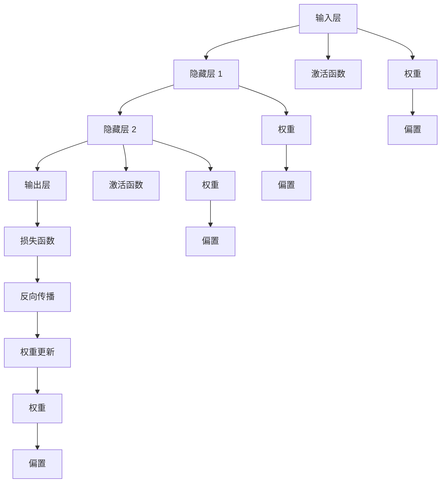

                 

# 神经网络：人工智能的基石

## 1. 背景介绍

### 1.1 问题由来
随着人工智能技术的飞速发展，神经网络（Neural Networks, NNs）逐渐成为构建智能系统的核心工具。深度学习框架的崛起，更是让神经网络的应用遍地开花，从图像识别、语音处理、自然语言处理，到游戏AI、自动驾驶、医疗诊断等领域，神经网络展现了强大的功能和潜力。然而，尽管神经网络在许多领域取得了巨大的成功，其背后的原理和机制仍然在学术界和工程界中引起广泛的讨论和争议。

### 1.2 问题核心关键点
理解神经网络及其算法原理，是深入掌握人工智能技术的基石。神经网络的基本思想是通过层级化的网络结构模拟生物神经元之间的信息传递和处理，通过大量训练数据来调整网络参数，使得模型能够学习到数据中的复杂模式和规律，从而实现数据的预测和分类等任务。

当前，神经网络的研究已经深入到深度学习（Deep Learning）层面，深度神经网络（Deep Neural Networks, DNNs）凭借多层的非线性变换能力，在图像识别、语音处理、自然语言处理等领域取得了突破性的进展。深度学习的成功关键在于数据的规模和质量，以及强大的计算资源支持。

### 1.3 问题研究意义
掌握神经网络及其算法原理，对于理解人工智能的核心技术、开发智能应用、推动技术进步具有重要意义：

1. **理论基础**：神经网络为人工智能提供了坚实的理论基础，帮助理解为何深度学习能够实现超越人类的智能。
2. **实际应用**：深度学习技术已经在多个领域取得了卓越的成绩，掌握神经网络原理，有利于设计和实现高性能的智能应用。
3. **技术发展**：理解和创新神经网络算法，是推动人工智能技术持续进步的重要驱动力。
4. **跨学科交流**：神经网络原理是计算机科学、脑科学、认知科学等多个学科的交叉点，掌握神经网络有助于促进跨学科研究。
5. **社会影响**：人工智能技术的普及应用，将深刻改变各行各业，理解神经网络有助于预见和应对可能带来的社会变革。

## 2. 核心概念与联系

### 2.1 核心概念概述

神经网络是一种模仿人类神经系统工作原理的计算模型。其核心概念包括：

- **神经元（Neuron）**：神经网络的基元，类似于人脑的神经元，负责接收和处理输入信息。
- **层级（Layer）**：神经元以层级形式组织，每一层接收上一层的输出作为输入，并输出到下一层。
- **激活函数（Activation Function）**：为神经元引入非线性变换，增强模型表达能力。
- **权重和偏置（Weight and Bias）**：用于调整神经元的输入和输出，通过训练更新权重和偏置，学习数据中的模式。
- **损失函数（Loss Function）**：衡量模型预测与实际标签的差异，优化模型的目标。
- **反向传播（Backpropagation）**：通过反向传播算法，计算损失函数对权重和偏置的梯度，更新模型参数。

这些核心概念共同构成了神经网络的基本框架，使其能够通过大量数据进行训练，实现数据的高效表示和预测。

### 2.2 核心概念原理和架构的 Mermaid 流程图

以下是一个简单的 Mermaid 流程图，展示了神经网络的基本结构和训练过程：



该图展示了神经网络的基本结构，输入层接收原始数据，经过多个隐藏层的处理，最终输出预测结果。每层之间通过权重和偏置进行连接，并使用激活函数引入非线性变换。通过反向传播算法，损失函数对权重和偏置进行梯度更新，从而优化模型的预测性能。

### 2.3 核心概念联系

神经网络的核心概念之间存在着紧密的联系。输入层接收原始数据，经过一系列的隐藏层变换，最终输出预测结果。每一层都通过权重和偏置对上一层进行线性变换，并通过激活函数引入非线性变换。权重和偏置决定了神经元对输入数据的响应程度和偏移量，是神经网络进行模式学习的关键参数。

激活函数为神经元引入非线性变换，使得神经网络能够学习更加复杂的数据模式。常见的激活函数包括Sigmoid、ReLU、Tanh等，不同类型的激活函数适用于不同的场景。

损失函数用于衡量模型预测与实际标签的差异，通过最小化损失函数，模型能够逐步优化预测结果。常用的损失函数包括均方误差、交叉熵等。

反向传播算法通过反向传播损失函数对权重和偏置的梯度，更新模型参数。这一过程可以理解为对神经元进行"误诊"和"修正"，通过反复迭代优化，使得模型逐渐逼近理想预测。

## 3. 核心算法原理 & 具体操作步骤
### 3.1 算法原理概述

神经网络的核心算法原理包括前向传播和反向传播两个主要步骤。

**前向传播（Forward Propagation）**：
- 输入数据从输入层开始，经过一系列隐藏层处理，最终输出到输出层。
- 每一层根据权重和偏置对输入数据进行线性变换，并通过激活函数引入非线性变换。
- 最终输出结果表示为模型对输入数据的预测。

**反向传播（Backward Propagation）**：
- 通过计算损失函数对输出结果的梯度，反向传播到输入层。
- 每层对梯度进行加权求和，计算当前层的权重和偏置的梯度。
- 更新权重和偏置，使得模型预测更接近实际标签。

神经网络通过前向传播和反向传播不断迭代优化，学习数据中的模式和规律。这一过程可以看作是对神经元进行"误诊"和"修正"，通过反复迭代优化，使得模型逐渐逼近理想预测。

### 3.2 算法步骤详解

神经网络的训练过程包括以下关键步骤：

1. **数据准备**：
   - 收集和处理训练数据，划分为训练集、验证集和测试集。
   - 对数据进行预处理，如标准化、归一化、数据增强等，提高模型泛化能力。

2. **模型构建**：
   - 选择合适的网络结构，定义神经元的数量、层级、激活函数、损失函数等。
   - 使用深度学习框架（如TensorFlow、PyTorch等）构建模型，并定义训练过程。

3. **前向传播**：
   - 将训练数据输入模型，进行前向传播计算输出结果。
   - 将输出结果与实际标签进行对比，计算损失函数。

4. **反向传播**：
   - 通过反向传播算法，计算损失函数对权重和偏置的梯度。
   - 更新权重和偏置，使得模型逐步逼近理想预测。

5. **模型评估**：
   - 在验证集和测试集上评估模型性能，衡量模型的泛化能力。
   - 调整模型超参数，如学习率、批大小、迭代次数等，优化模型性能。

6. **模型保存**：
   - 保存训练好的模型，用于实际应用和推理预测。

### 3.3 算法优缺点

神经网络算法具有以下优点：
- **强大的表达能力**：多层神经网络能够学习复杂的数据模式，适用于多种类型的预测和分类任务。
- **灵活的架构设计**：神经网络可以根据任务需求进行灵活的架构设计，调整层级数量、激活函数、损失函数等。
- **高效的特征提取**：神经网络能够自动从原始数据中提取有用的特征，无需手动设计特征工程。

同时，神经网络也存在一些缺点：
- **训练时间长**：神经网络需要大量的训练数据和计算资源，训练时间较长。
- **过拟合风险**：由于网络复杂度较高，容易发生过拟合，需要在训练过程中引入正则化等技术。
- **可解释性不足**：神经网络的决策过程缺乏可解释性，难以理解其内部的工作机制。
- **资源消耗大**：神经网络需要大量的计算资源和存储资源，部署成本较高。

### 3.4 算法应用领域

神经网络已经在许多领域取得了显著的成果，包括但不限于：

- **计算机视觉**：用于图像识别、物体检测、图像生成等任务。
- **自然语言处理**：用于文本分类、情感分析、机器翻译等任务。
- **语音处理**：用于语音识别、语音合成、情感分析等任务。
- **推荐系统**：用于商品推荐、广告推荐、内容推荐等任务。
- **游戏AI**：用于智能决策、自适应控制、智能推理等任务。
- **医疗诊断**：用于疾病诊断、病理分析、基因组学研究等任务。
- **自动驾驶**：用于环境感知、路径规划、决策控制等任务。

## 4. 数学模型和公式 & 详细讲解 & 举例说明

### 4.1 数学模型构建

神经网络的基本数学模型可以表示为：

$$
y = \sigma(z) = \sigma(Wx + b)
$$

其中 $y$ 表示输出结果，$z$ 表示线性变换结果，$W$ 和 $b$ 表示权重和偏置，$\sigma$ 表示激活函数。

对于多层神经网络，每一层的输出可以表示为：

$$
y^{(l)} = \sigma(z^{(l)}) = \sigma(W^{(l)}x^{(l-1)} + b^{(l)})
$$

其中 $y^{(l)}$ 表示第 $l$ 层的输出，$x^{(l-1)}$ 表示第 $l-1$ 层的输出，$W^{(l)}$ 和 $b^{(l)}$ 表示第 $l$ 层的权重和偏置，$\sigma$ 表示激活函数。

### 4.2 公式推导过程

以最简单的单层神经网络为例，推导前向传播和反向传播的公式。

**前向传播**：

假设输入向量为 $x$，单层神经网络的输出为 $y$，权重为 $W$，偏置为 $b$，激活函数为 $\sigma$，则前向传播公式为：

$$
y = \sigma(Wx + b)
$$

**反向传播**：

假设损失函数为 $L$，对 $W$ 和 $b$ 的梯度分别为 $\frac{\partial L}{\partial W}$ 和 $\frac{\partial L}{\partial b}$，则反向传播公式为：

$$
\frac{\partial L}{\partial W} = \frac{\partial L}{\partial y} \cdot \frac{\partial y}{\partial z} \cdot \frac{\partial z}{\partial W}
$$

$$
\frac{\partial L}{\partial b} = \frac{\partial L}{\partial y} \cdot \frac{\partial y}{\partial z} \cdot \frac{\partial z}{\partial b}
$$

其中 $\frac{\partial y}{\partial z}$ 和 $\frac{\partial z}{\partial W}$ 分别是 $\sigma$ 函数对 $y$ 和 $z$ 的导数，以及 $W$ 和 $b$ 对 $z$ 的导数。

### 4.3 案例分析与讲解

以手写数字识别任务为例，使用单层神经网络进行训练和预测。假设训练集包含60000张28x28的手写数字图像，每个图像对应一个0-9之间的标签。使用随机梯度下降（SGD）算法进行训练，学习率为0.1，训练100次。

- **数据准备**：将图像转换为向量，归一化处理。
- **模型构建**：定义单层神经网络，激活函数为ReLU，输出层使用Softmax函数。
- **前向传播**：将训练数据输入模型，计算输出结果。
- **损失函数**：使用交叉熵损失函数计算模型预测与实际标签的差异。
- **反向传播**：计算损失函数对权重和偏置的梯度，使用SGD算法更新模型参数。
- **模型评估**：在测试集上评估模型性能，计算准确率和混淆矩阵。

通过这一过程，神经网络逐步学习到数字图像的特征表示，能够准确识别手写数字，实现数字识别任务。

## 5. 项目实践：代码实例和详细解释说明

### 5.1 开发环境搭建

在进行神经网络项目实践前，需要准备好开发环境。以下是使用Python进行TensorFlow开发的Python环境配置流程：

1. 安装Anaconda：从官网下载并安装Anaconda，用于创建独立的Python环境。

2. 创建并激活虚拟环境：
```bash
conda create -n tf-env python=3.8 
conda activate tf-env
```

3. 安装TensorFlow：根据CUDA版本，从官网获取对应的安装命令。例如：
```bash
conda install tensorflow tensorflow-gpu=cuda11.1 -c pytorch -c conda-forge
```

4. 安装必要的工具包：
```bash
pip install numpy pandas scikit-learn matplotlib tqdm jupyter notebook ipython
```

完成上述步骤后，即可在`tf-env`环境中开始神经网络项目实践。

### 5.2 源代码详细实现

以下是使用TensorFlow对手写数字识别任务进行训练的完整代码实现：

```python
import tensorflow as tf
from tensorflow.keras.datasets import mnist
from tensorflow.keras.utils import to_categorical

# 加载MNIST数据集
(train_images, train_labels), (test_images, test_labels) = mnist.load_data()

# 数据预处理
train_images = train_images.reshape(-1, 28*28) / 255.0
test_images = test_images.reshape(-1, 28*28) / 255.0
train_labels = to_categorical(train_labels)
test_labels = to_categorical(test_labels)

# 定义模型
model = tf.keras.Sequential([
    tf.keras.layers.Dense(128, activation='relu', input_shape=(784,)),
    tf.keras.layers.Dense(10, activation='softmax')
])

# 定义损失函数和优化器
loss_fn = tf.keras.losses.CategoricalCrossentropy()
optimizer = tf.keras.optimizers.SGD(learning_rate=0.1)

# 定义训练函数
@tf.function
def train_step(images, labels):
    with tf.GradientTape() as tape:
        logits = model(images)
        loss_value = loss_fn(labels, logits)
    gradients = tape.gradient(loss_value, model.trainable_variables)
    optimizer.apply_gradients(zip(gradients, model.trainable_variables))

# 训练模型
for epoch in range(100):
    train_loss = 0.0
    train_acc = 0.0
    for images, labels in train_dataset:
        train_step(images, labels)
        train_loss += loss_value
        train_acc += accuracy_value
    train_loss /= len(train_dataset)
    train_acc /= len(train_dataset)
    print('Epoch {}: Loss: {:.4f}, Acc: {:.4f}'.format(epoch+1, train_loss, train_acc))

# 评估模型
test_loss = 0.0
test_acc = 0.0
for images, labels in test_dataset:
    logits = model(images)
    loss_value = loss_fn(labels, logits)
    accuracy_value = tf.reduce_mean(tf.cast(tf.argmax(logits, axis=1) == tf.argmax(labels, axis=1), tf.float32))
    test_loss += loss_value
    test_acc += accuracy_value
test_loss /= len(test_dataset)
test_acc /= len(test_dataset)
print('Test Loss: {:.4f}, Test Acc: {:.4f}'.format(test_loss, test_acc))
```

### 5.3 代码解读与分析

让我们再详细解读一下关键代码的实现细节：

**MNIST数据集加载**：
- 使用`mnist.load_data()`函数加载MNIST数据集，包含训练集和测试集。
- 将图像转换为向量，并进行归一化处理。

**模型定义**：
- 使用`tf.keras.Sequential`定义单层神经网络，包含一个输入层和一个输出层。
- 输入层使用Dense层，激活函数为ReLU，输出层使用Softmax函数。

**损失函数和优化器定义**：
- 使用`tf.keras.losses.CategoricalCrossentropy`定义交叉熵损失函数，用于多分类任务。
- 使用`tf.keras.optimizers.SGD`定义随机梯度下降优化器，学习率为0.1。

**训练函数定义**：
- 使用`@tf.function`装饰器定义训练函数，将计算图编译为静态图，提高计算效率。
- 在训练函数中使用`tf.GradientTape`记录梯度，计算损失函数对权重和偏置的梯度，并使用`optimizer.apply_gradients`更新模型参数。

**训练过程**：
- 使用`for`循环迭代训练过程，每个epoch内遍历训练集。
- 在每个batch上调用`train_step`函数进行前向传播和反向传播。
- 计算训练损失和准确率，并在每个epoch输出。

**评估过程**：
- 使用`for`循环遍历测试集，计算测试损失和准确率。
- 输出测试结果。

以上代码实现了使用TensorFlow进行手写数字识别任务的神经网络训练和评估，展示了神经网络的基本流程。

## 6. 实际应用场景
### 6.1 图像识别

神经网络在图像识别领域取得了突破性的成果。通过大量标注的图像数据进行训练，神经网络能够学习到复杂的图像特征，实现高精度的物体识别、人脸识别、图像分类等任务。

在实际应用中，可以使用神经网络对摄像头拍摄的实时视频进行实时图像识别，应用于安防监控、自动驾驶、无人零售等领域。例如，自动驾驶系统可以通过神经网络对摄像头拍摄的实时图像进行物体检测和识别，实时规划行车路径，保障行车安全。

### 6.2 语音处理

神经网络在语音处理领域同样表现出色。通过大量标注的语音数据进行训练，神经网络能够学习到语音的特征表示，实现高精度的语音识别、语音合成、情感分析等任务。

在实际应用中，可以使用神经网络对用户的语音指令进行理解和回复，应用于智能家居、语音助手、智能客服等领域。例如，智能语音助手可以通过神经网络对用户的语音指令进行理解和回复，提供个性化的服务体验。

### 6.3 自然语言处理

神经网络在自然语言处理领域也取得了显著的成果。通过大量标注的文本数据进行训练，神经网络能够学习到文本的语义表示，实现高精度的文本分类、情感分析、机器翻译等任务。

在实际应用中，可以使用神经网络对用户提交的文本进行理解和处理，应用于智能客服、智能问答、智能摘要等领域。例如，智能客服系统可以通过神经网络对用户提交的文本进行理解和回复，提供高效的服务体验。

### 6.4 未来应用展望

随着神经网络技术的不断发展，未来的应用场景将更加广泛和深入：

- **智能医疗**：神经网络可以应用于疾病诊断、病理分析、基因组学研究等领域，为医疗健康提供高效、准确的决策支持。
- **金融分析**：神经网络可以应用于金融市场预测、信用评估、风险控制等领域，为金融行业提供精准的决策支持。
- **教育培训**：神经网络可以应用于个性化学习、智能评测、教育资源推荐等领域，为教育行业提供智能化的教学支持。
- **环境保护**：神经网络可以应用于环境监测、气候预测、资源优化等领域，为环境保护提供科学的决策支持。
- **智能制造**：神经网络可以应用于智能制造、质量检测、设备维护等领域，为制造业提供智能化的管理支持。

## 7. 工具和资源推荐
### 7.1 学习资源推荐

为了帮助开发者系统掌握神经网络及其算法原理，这里推荐一些优质的学习资源：

1. 《深度学习》系列书籍：Ian Goodfellow等编写的深度学习经典教材，涵盖了神经网络、深度学习、强化学习等内容，是深度学习的入门必读。
2. CS231n《卷积神经网络》课程：斯坦福大学开设的计算机视觉经典课程，详细讲解了卷积神经网络的结构和训练方法。
3. CS224n《自然语言处理》课程：斯坦福大学开设的自然语言处理经典课程，涵盖了语言模型、机器翻译、文本分类等内容。
4. DeepLearning.ai《深度学习专项课程》：Andrew Ng等开设的深度学习专项课程，覆盖了深度学习的核心内容，适合系统学习。
5. arXiv.org：深度学习领域的顶级学术期刊，定期发布最新的研究成果和论文，是了解前沿技术的最佳途径。

通过对这些资源的学习实践，相信你一定能够系统掌握神经网络及其算法原理，并用于解决实际的NLP问题。

### 7.2 开发工具推荐

高效的开发离不开优秀的工具支持。以下是几款用于神经网络开发的常用工具：

1. TensorFlow：由Google主导开发的开源深度学习框架，生产部署方便，适合大规模工程应用。
2. PyTorch：由Facebook主导开发的开源深度学习框架，灵活易用，适合研究开发。
3. Keras：基于TensorFlow和Theano的高级深度学习框架，提供简单易用的API，适合快速原型开发。
4. JAX：Google开发的自动微分和机器学习库，支持GPU/TPU等高性能设备，适合高性能计算。
5. MXNet：由Apache开发的深度学习框架，支持分布式训练，适合大规模分布式应用。

合理利用这些工具，可以显著提升神经网络开发和训练的效率，加速创新迭代的步伐。

### 7.3 相关论文推荐

神经网络的研究已经深入到深度学习层面，以下是几篇奠基性的相关论文，推荐阅读：

1. AlexNet：ImageNet Large Scale Visual Recognition Challenge，展示了卷积神经网络在图像识别领域的突破性成果。
2. RNNs vs. ConvNets: The Risk of Neural Network Architectures：探讨了不同神经网络架构的优缺点，提供了神经网络架构选择的理论依据。
3. Google's Inception Networks for Computer Vision：提出Inception网络，提高了神经网络对图像特征的提取能力。
4. Attention is All You Need：提出了Transformer网络，展示了自注意力机制在语言处理中的应用。
5. Deep Neural Networks for Large-Scale Object Recognition：展示了深度神经网络在图像识别领域的强大能力，刷新了多项图像分类任务的记录。

这些论文代表了大神经网络的研究进展，通过学习这些前沿成果，可以帮助研究者把握学科前进方向，激发更多的创新灵感。

## 8. 总结：未来发展趋势与挑战
### 8.1 总结

本文对神经网络及其算法原理进行了全面系统的介绍。首先阐述了神经网络的核心思想和核心概念，明确了神经网络在人工智能中的重要地位。其次，从原理到实践，详细讲解了神经网络的前向传播和反向传播过程，提供了完整的代码实例和详细解释说明。同时，本文还广泛探讨了神经网络在图像识别、语音处理、自然语言处理等领域的实际应用场景，展示了神经网络的强大功能和广泛应用。

通过本文的系统梳理，可以看到，神经网络及其算法原理是人工智能技术的基石，广泛应用于各个领域。神经网络凭借其强大的表达能力和灵活的架构设计，展示了深度学习在多个领域的突破性成果，为人工智能技术的持续进步提供了强大的推动力。

### 8.2 未来发展趋势

展望未来，神经网络及其算法原理将继续推动人工智能技术的进步：

1. **更高效的模型设计**：未来的神经网络将更加注重模型设计，通过引入新的激活函数、优化器、正则化技术等，提高神经网络的表达能力和泛化能力。
2. **更强大的训练工具**：未来的训练工具将更加高效，支持分布式训练、混合精度训练、自动微分等技术，提高神经网络的训练效率。
3. **更广泛的应用场景**：神经网络的应用将更加广泛，不仅限于计算机视觉、自然语言处理等领域，还将拓展到智能医疗、智能制造、智能交通等新兴领域。
4. **更深的理论研究**：未来的神经网络研究将更加深入，结合认知科学、脑科学等领域，探索神经网络背后更深的理论机制。
5. **更强的解释能力**：未来的神经网络将更加注重可解释性，通过引入可视化技术、因果分析方法等，提高神经网络的透明性和可解释性。
6. **更低的资源需求**：未来的神经网络将更加注重资源优化，通过模型压缩、量化加速、参数共享等技术，降低神经网络的计算资源和存储资源需求。

### 8.3 面临的挑战

尽管神经网络已经取得了显著的进展，但在迈向更加智能化、普适化应用的过程中，仍面临诸多挑战：

1. **训练成本高**：神经网络的训练需要大量的数据和计算资源，训练成本较高。如何提高训练效率，降低资源消耗，是未来的一个重要研究方向。
2. **模型泛化能力有限**：神经网络在大规模数据集上表现良好，但对于小样本数据集或新兴领域，泛化能力有限。如何提高模型的泛化能力，是未来的一个重要研究方向。
3. **可解释性不足**：神经网络的决策过程缺乏可解释性，难以理解其内部的工作机制。如何提高神经网络的透明性和可解释性，是未来的一个重要研究方向。
4. **模型偏见和歧视**：神经网络在训练过程中可能学习到有偏见的数据，导致模型输出具有歧视性。如何消除模型偏见，提高模型公平性，是未来的一个重要研究方向。
5. **模型鲁棒性不足**：神经网络在面对噪声数据、对抗攻击时，鲁棒性不足。如何提高神经网络的鲁棒性，是未来的一个重要研究方向。

### 8.4 研究展望

面对神经网络面临的挑战，未来的研究需要在以下几个方面寻求新的突破：

1. **无监督学习**：探索无监督学习的方法，减少对大量标注数据的依赖，利用非结构化数据进行神经网络的训练和优化。
2. **参数高效学习**：开发参数高效的学习方法，在固定大部分预训练参数的情况下，只更新极少量的任务相关参数，提高训练效率。
3. **因果学习**：引入因果学习的方法，增强神经网络的决策能力和解释能力，提高模型的透明性和可解释性。
4. **多模态融合**：探索多模态数据的融合方法，结合视觉、听觉、语言等多种模态信息，提高神经网络的表达能力和泛化能力。
5. **跨领域迁移**：开发跨领域迁移的方法，使神经网络在多个领域之间进行迁移，提高模型的通用性和适应性。
6. **模型解释**：引入可视化技术和因果分析方法，提高神经网络的透明性和可解释性，帮助用户理解模型的决策过程。

这些研究方向将进一步推动神经网络技术的发展，使其在更广泛的场景中发挥更大的作用，为人工智能技术的进步提供更多的动力。

## 9. 附录：常见问题与解答

**Q1：神经网络与传统的机器学习算法相比，有哪些优势？**

A: 神经网络相比传统的机器学习算法，具有以下优势：
1. **自动特征提取**：神经网络能够自动从原始数据中提取特征，无需手动设计特征工程，降低了数据预处理难度。
2. **强大的表达能力**：多层神经网络能够学习复杂的非线性关系，适用于多种类型的预测和分类任务。
3. **灵活的架构设计**：神经网络可以根据任务需求进行灵活的架构设计，调整层级数量、激活函数、损失函数等。
4. **高效的计算图**：神经网络的计算图能够高效地进行反向传播和梯度更新，提高了训练效率。

**Q2：神经网络的训练过程如何进行？**

A: 神经网络的训练过程包括以下关键步骤：
1. **数据准备**：收集和处理训练数据，划分为训练集、验证集和测试集。
2. **模型构建**：选择合适的网络结构，定义神经元的数量、层级、激活函数、损失函数等。
3. **前向传播**：将训练数据输入模型，进行前向传播计算输出结果。
4. **损失函数计算**：计算模型预测与实际标签的差异，选择适合的任务损失函数。
5. **反向传播**：计算损失函数对输出结果的梯度，通过反向传播算法计算权重和偏置的梯度。
6. **参数更新**：使用优化算法（如SGD、Adam等）更新权重和偏置，最小化损失函数。
7. **模型评估**：在验证集和测试集上评估模型性能，衡量模型的泛化能力。

**Q3：神经网络在实际应用中面临哪些挑战？**

A: 神经网络在实际应用中面临以下挑战：
1. **训练成本高**：神经网络的训练需要大量的数据和计算资源，训练成本较高。
2. **模型泛化能力有限**：神经网络在大规模数据集上表现良好，但对于小样本数据集或新兴领域，泛化能力有限。
3. **可解释性不足**：神经网络的决策过程缺乏可解释性，难以理解其内部的工作机制。
4. **模型偏见和歧视**：神经网络在训练过程中可能学习到有偏见的数据，导致模型输出具有歧视性。
5. **模型鲁棒性不足**：神经网络在面对噪声数据、对抗攻击时，鲁棒性不足。

**Q4：如何提高神经网络的泛化能力？**

A: 提高神经网络的泛化能力，可以从以下几个方面进行优化：
1. **数据增强**：通过数据增强技术，扩充训练集的多样性，提高模型的泛化能力。
2. **正则化技术**：使用L2正则化、Dropout等正则化技术，避免过拟合。
3. **参数高效学习**：使用参数高效的学习方法，如Adapter、Prefix等，减小训练过程中的过拟合风险。
4. **模型压缩**：使用模型压缩技术，如量化加速、剪枝等，减小模型的计算资源和存储资源需求。
5. **多任务学习**：结合多个相关任务进行联合训练，提高模型的泛化能力。

通过这些优化方法，可以提高神经网络的泛化能力，使其在更广泛的应用场景中发挥更大的作用。

**Q5：神经网络在实际应用中如何进行参数优化？**

A: 神经网络在实际应用中进行参数优化，通常需要以下步骤：
1. **超参数调优**：选择合适的超参数，如学习率、批大小、迭代次数等，优化模型性能。
2. **正则化技术**：使用L2正则化、Dropout等正则化技术，避免过拟合。
3. **学习率调度**：使用学习率调度技术，如学习率衰减、Warmup等，提高模型训练的稳定性。
4. **模型裁剪**：使用模型裁剪技术，减小模型的计算资源和存储资源需求。
5. **多模态融合**：结合视觉、听觉、语言等多种模态信息，提高模型的泛化能力。

通过这些优化方法，可以进一步提高神经网络的性能，适应更多的应用场景。

作者：禅与计算机程序设计艺术 / Zen and the Art of Computer Programming

