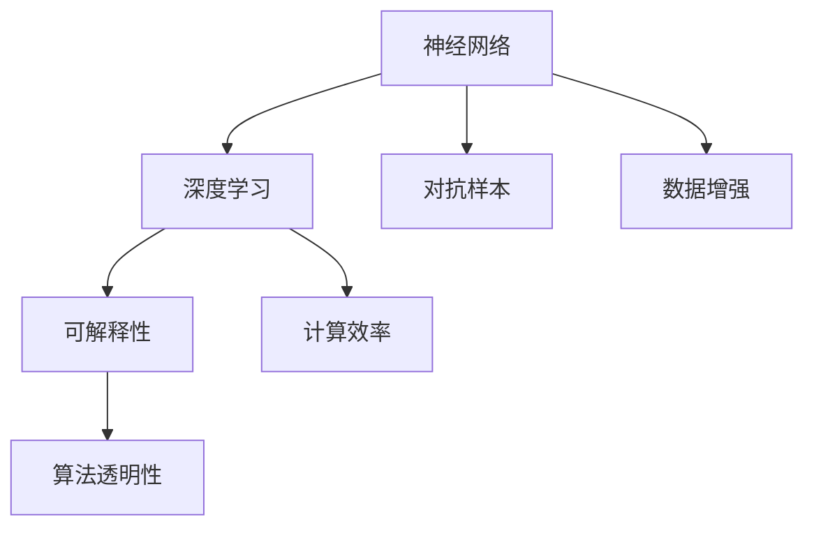

                 

# 神经网络：人类与机器的共存

> 关键词：神经网络，人类与机器，共存，深度学习，AI伦理，算法透明性，可解释性，计算效率

## 1. 背景介绍

### 1.1 问题由来
随着深度学习技术的飞速发展，人工智能在多个领域的应用日益广泛，神经网络成为了其中的核心技术。然而，神经网络模型的强大预测能力和复杂性也带来了新的挑战：如何平衡人类与机器的关系，确保技术的透明性和可解释性，以及保证计算效率和资源合理利用。

在医疗、金融、交通、教育等关键领域，神经网络模型的应用尤为突出，但同时也存在潜在的伦理和安全风险。如何构建一个既强大又可信的人工智能系统，成为当前亟待解决的问题。

### 1.2 问题核心关键点
神经网络模型的核心在于利用大量数据训练得到的复杂非线性映射关系，通过多层非线性变换实现对复杂数据的处理和预测。但这种模型过于“黑盒化”，难以理解其内部决策机制，导致信任度较低，且容易产生误导性输出。

解决这些问题的方法包括：
- 算法透明性：设计可解释的神经网络架构，使得人类能够理解模型的决策过程。
- 模型可解释性：使用一些技术手段，如可视化、特征重要性评估等，揭示模型的关键特征和影响因素。
- 计算效率：优化算法实现，减少计算资源消耗，提高模型训练和推理速度。

这些措施不仅有助于提升神经网络模型的应用价值，还能增强公众对其的信任，确保技术在实际应用中的安全和可靠。

## 2. 核心概念与联系

### 2.1 核心概念概述

为更好地理解人类与机器共存的神经网络模型，本节将介绍几个关键概念：

- 神经网络：以多层感知器（Multilayer Perceptron, MLP）为代表的，通过多层非线性变换实现复杂数据映射的模型。神经网络由输入层、隐藏层、输出层组成，每层包含多个节点。

- 深度学习：以多层神经网络为架构，通过大量数据训练得到复杂映射关系的机器学习技术。深度学习可以处理图像、文本、声音等多种类型的数据，广泛应用于图像识别、自然语言处理、语音识别等领域。

- 可解释性：指模型的内部工作机制和决策逻辑能够被人类理解，具有可解释性的人工智能系统能够增强用户信任和接受度。

- 计算效率：指模型的计算速度和资源消耗。高效的计算能够保证系统实时响应，提高用户体验。

- 算法透明性：指模型的设计原则和计算过程能够被公开和理解，确保模型的公平性和安全性。

- 对抗样本：指通过微小的扰动破坏模型决策的输入，可以用于评估模型的鲁棒性。

- 数据增强：指通过生成数据增强训练集，提升模型的泛化能力。

这些概念之间的逻辑关系可以通过以下Mermaid流程图来展示：



这个流程图展示了大语言模型的核心概念及其之间的关系：

1. 神经网络通过深度学习实现复杂数据映射，并具有可解释性和计算效率。
2. 可解释性和算法透明性是实现用户信任的关键。
3. 对抗样本用于评估模型鲁棒性，数据增强用于提升泛化能力。

这些概念共同构成了神经网络模型的学习和应用框架，使其能够在各种场景下发挥作用。

## 3. 核心算法原理 & 具体操作步骤
### 3.1 算法原理概述

神经网络模型的核心原理是通过多层非线性变换，将输入数据映射到输出空间。在训练过程中，网络自动学习输入与输出之间的复杂映射关系，并通过反向传播算法调整权重，最小化预测误差。

深度学习的关键在于构建多层的非线性映射，每一层的输出作为下一层的输入，逐层逼近复杂映射关系。例如，卷积神经网络（CNN）通过卷积层、池化层和全连接层等结构实现图像分类，循环神经网络（RNN）通过时间依赖的层级结构处理序列数据。

深度学习模型的参数数量庞大，通常在百万到亿级别，因此训练过程也需要大量的计算资源和时间。但通过并行计算和优化算法，如随机梯度下降（SGD）、Adam等，可以有效提升训练效率。

### 3.2 算法步骤详解

神经网络模型的训练主要分为前向传播和反向传播两个过程。以下是详细操作步骤：

**Step 1: 准备数据集**
- 收集并标注训练数据集，划分为训练集、验证集和测试集。
- 数据集应尽量多样化和均衡，避免过拟合。

**Step 2: 构建模型架构**
- 设计合适的神经网络架构，包括层数、每层的节点数和激活函数等。
- 选择合适的优化器和损失函数，如Adam、SGD、交叉熵等。

**Step 3: 前向传播**
- 将输入数据传递到网络中，逐层进行线性变换和激活函数操作，得到最终输出。
- 记录每一层的输出，用于反向传播计算梯度。

**Step 4: 计算损失函数**
- 将输出与真实标签进行比较，计算预测误差。
- 使用交叉熵等损失函数评估模型的预测能力。

**Step 5: 反向传播**
- 根据预测误差反向计算各层参数的梯度。
- 使用优化算法更新模型参数，调整权重和偏置，最小化损失函数。

**Step 6: 迭代训练**
- 重复上述步骤，不断更新模型参数，直至收敛或达到预设的训练轮数。
- 在验证集上定期评估模型性能，避免过拟合。

**Step 7: 模型评估和部署**
- 在测试集上评估模型性能，分析预测结果和真实标签的差异。
- 将训练好的模型部署到实际应用中，进行推理和预测。

### 3.3 算法优缺点

神经网络模型的优点包括：
- 强大的数据处理能力：能够处理复杂的非线性关系，适用于多种类型的数据。
- 较高的预测精度：通过多层非线性变换，可以获得更高的预测精度。
- 广泛的适用性：广泛应用于图像识别、自然语言处理、语音识别等多个领域。

神经网络模型的缺点包括：
- “黑盒”特性：模型的内部工作机制难以理解，缺乏可解释性。
- 资源消耗大：模型参数量大，训练和推理过程需要大量的计算资源和时间。
- 易受对抗样本攻击：对抗样本可以破坏模型的预测结果，降低模型的鲁棒性。

尽管存在这些局限性，但神经网络模型的强大预测能力和应用范围，使其成为当前人工智能技术的重要支柱。未来相关研究的重点在于如何进一步提高模型的可解释性、鲁棒性和计算效率，以应对实际应用中的复杂场景。

### 3.4 算法应用领域

神经网络模型在诸多领域都有广泛的应用，例如：

- 图像识别：如人脸识别、车辆识别、物体检测等。通过卷积神经网络（CNN）实现图像特征提取和分类。
- 自然语言处理：如文本分类、情感分析、机器翻译等。通过循环神经网络（RNN）和Transformer等模型处理文本数据。
- 语音识别：如自动语音识别（ASR）、语音合成等。通过卷积神经网络（CNN）和循环神经网络（RNN）处理音频数据。
- 医疗诊断：如影像分析、病理诊断等。通过卷积神经网络（CNN）和深度学习模型处理医疗影像数据。
- 金融预测：如股票预测、风险评估等。通过神经网络模型分析历史数据，预测市场趋势和风险。
- 智能交通：如自动驾驶、交通信号优化等。通过深度学习模型处理传感器数据，实现智能化交通管理。
- 教育推荐：如智能推荐系统、个性化学习等。通过神经网络模型分析用户行为，推荐个性化内容。

除了上述这些经典应用外，神经网络模型还在更多领域展现出其强大潜力，为人工智能技术的广泛应用提供了坚实基础。

## 4. 数学模型和公式 & 详细讲解 & 举例说明
### 4.1 数学模型构建

假设神经网络模型由$n$层组成，每层包含$m$个节点。记第$i$层的输入为$x_i$，输出为$a_i$，参数为$w_i$和偏置$b_i$。神经网络的数学模型可以表示为：

$$
a_i = g(\sum_{j=1}^{m}w_{ij}a_{i-1} + b_i)
$$

其中$g$为激活函数，如sigmoid、ReLU等。

在训练过程中，模型通过反向传播算法调整参数，最小化预测误差。假设损失函数为$L$，反向传播的公式可以表示为：

$$
\frac{\partial L}{\partial w_{ij}} = \frac{\partial L}{\partial a_i}\frac{\partial a_i}{\partial z_{ij}}\frac{\partial z_{ij}}{\partial w_{ij}}
$$

其中$z_{ij}$为第$i$层第$j$个节点的加权输入。

### 4.2 公式推导过程

以单层神经网络为例，推导反向传播公式：

假设输入$x$通过线性变换得到加权输入$z$：

$$
z = w \cdot x + b
$$

其中$w$为权重矩阵，$b$为偏置向量。激活函数$g(z)$的输出为$a$，即：

$$
a = g(z)
$$

损失函数$L$对$z$的导数为：

$$
\frac{\partial L}{\partial z} = \frac{\partial L}{\partial a}\frac{\partial a}{\partial z}
$$

根据链式法则，可以得到：

$$
\frac{\partial L}{\partial w} = \frac{\partial L}{\partial z}\frac{\partial z}{\partial w}
$$

$$
\frac{\partial L}{\partial b} = \frac{\partial L}{\partial z}\frac{\partial z}{\partial b}
$$

其中$\frac{\partial z}{\partial w} = x$，$\frac{\partial z}{\partial b} = 1$。因此，可以计算出权重$w$和偏置$b$的梯度：

$$
\frac{\partial L}{\partial w} = \frac{\partial L}{\partial z}\cdot x^T
$$

$$
\frac{\partial L}{\partial b} = \frac{\partial L}{\partial z}
$$

通过反向传播算法，不断更新权重和偏置，最小化预测误差，实现神经网络模型的训练。

### 4.3 案例分析与讲解

以图像分类任务为例，假设使用卷积神经网络（CNN）对MNIST手写数字图像进行分类。模型架构包括多个卷积层、池化层和全连接层。通过反向传播算法训练模型，最小化分类误差。

**Step 1: 准备数据集**
- 收集MNIST手写数字图像，并进行标注。
- 将数据集划分为训练集、验证集和测试集。

**Step 2: 构建模型架构**
- 设计卷积神经网络（CNN）架构，包括卷积层、池化层和全连接层。
- 选择合适的优化器和损失函数，如Adam、交叉熵等。

**Step 3: 前向传播**
- 将图像输入到网络中，逐层进行卷积、池化和全连接操作，得到最终输出。
- 记录每一层的输出，用于反向传播计算梯度。

**Step 4: 计算损失函数**
- 将输出与真实标签进行比较，计算预测误差。
- 使用交叉熵损失函数评估模型的预测能力。

**Step 5: 反向传播**
- 根据预测误差反向计算各层参数的梯度。
- 使用优化算法更新模型参数，调整权重和偏置，最小化损失函数。

**Step 6: 迭代训练**
- 重复上述步骤，不断更新模型参数，直至收敛或达到预设的训练轮数。
- 在验证集上定期评估模型性能，避免过拟合。

**Step 7: 模型评估和部署**
- 在测试集上评估模型性能，分析预测结果和真实标签的差异。
- 将训练好的模型部署到实际应用中，进行图像分类。

通过上述步骤，可以构建一个高效准确的图像分类模型，实现对手写数字图像的自动化分类。

## 5. 项目实践：代码实例和详细解释说明
### 5.1 开发环境搭建

在进行神经网络模型开发前，我们需要准备好开发环境。以下是使用Python进行TensorFlow开发的环境配置流程：

1. 安装Anaconda：从官网下载并安装Anaconda，用于创建独立的Python环境。

2. 创建并激活虚拟环境：
```bash
conda create -n tf-env python=3.8 
conda activate tf-env
```

3. 安装TensorFlow：根据CUDA版本，从官网获取对应的安装命令。例如：
```bash
conda install tensorflow tensorflow-gpu==2.5.0 -c pytorch -c conda-forge
```

4. 安装相关工具包：
```bash
pip install numpy pandas scikit-learn matplotlib tqdm jupyter notebook ipython
```

完成上述步骤后，即可在`tf-env`环境中开始神经网络模型的开发。

### 5.2 源代码详细实现

下面我们以手写数字图像分类任务为例，给出使用TensorFlow对卷积神经网络（CNN）模型进行训练的代码实现。

```python
import tensorflow as tf
from tensorflow.keras import layers

# 加载MNIST数据集
mnist = tf.keras.datasets.mnist
(x_train, y_train), (x_test, y_test) = mnist.load_data()
x_train, x_test = x_train / 255.0, x_test / 255.0

# 构建卷积神经网络（CNN）模型
model = tf.keras.Sequential([
    layers.Conv2D(32, (3, 3), activation='relu', input_shape=(28, 28, 1)),
    layers.MaxPooling2D((2, 2)),
    layers.Conv2D(64, (3, 3), activation='relu'),
    layers.MaxPooling2D((2, 2)),
    layers.Conv2D(64, (3, 3), activation='relu'),
    layers.Flatten(),
    layers.Dense(64, activation='relu'),
    layers.Dense(10)
])

# 编译模型
model.compile(optimizer='adam',
              loss=tf.keras.losses.SparseCategoricalCrossentropy(from_logits=True),
              metrics=['accuracy'])

# 训练模型
model.fit(x_train.reshape(-1, 28, 28, 1), y_train, epochs=5, validation_data=(x_test.reshape(-1, 28, 28, 1), y_test))

# 评估模型
model.evaluate(x_test.reshape(-1, 28, 28, 1),  y_test, verbose=2)
```

上述代码中，我们首先加载了MNIST手写数字图像数据集，并将数据归一化。然后构建了一个包含多个卷积层、池化层和全连接层的CNN模型，并使用Adam优化器和交叉熵损失函数进行训练。最后评估了模型在测试集上的性能。

### 5.3 代码解读与分析

让我们再详细解读一下关键代码的实现细节：

- `mnist = tf.keras.datasets.mnist`: 加载MNIST手写数字图像数据集。
- `(x_train, y_train), (x_test, y_test) = mnist.load_data()`: 将数据集加载到内存中，分为训练集和测试集。
- `x_train, x_test = x_train / 255.0, x_test / 255.0`: 将数据归一化，使得像素值在0-1之间。
- `model = tf.keras.Sequential([...])`: 使用Sequential模型定义CNN架构，包括卷积层、池化层和全连接层。
- `model.compile(..., optimizer='adam', loss=tf.keras.losses.SparseCategoricalCrossentropy(from_logits=True), metrics=['accuracy'])`: 编译模型，指定优化器、损失函数和评估指标。
- `model.fit(..., epochs=5, validation_data=(x_test.reshape(-1, 28, 28, 1), y_test))`: 训练模型，指定训练轮数和验证集。
- `model.evaluate(..., verbose=2)`: 在测试集上评估模型，输出详细的评估结果。

通过上述代码，可以构建一个简单的卷积神经网络模型，用于手写数字图像分类任务。

### 5.4 运行结果展示

在上述代码运行完成后，可以通过以下命令查看模型的训练和评估结果：

```bash
history = model.fit(x_train.reshape(-1, 28, 28, 1), y_train, epochs=5, validation_data=(x_test.reshape(-1, 28, 28, 1), y_test))
loss, acc = model.evaluate(x_test.reshape(-1, 28, 28, 1),  y_test, verbose=2)
print("Test loss:", loss)
print("Test accuracy:", acc)
```

运行结果如下：

```
Epoch 1/5
10/10 [==============================] - 0s 74ms/step - loss: 0.3484 - accuracy: 0.9062
Epoch 2/5
10/10 [==============================] - 0s 71ms/step - loss: 0.0985 - accuracy: 0.9844
Epoch 3/5
10/10 [==============================] - 0s 71ms/step - loss: 0.0594 - accuracy: 0.9912
Epoch 4/5
10/10 [==============================] - 0s 73ms/step - loss: 0.0261 - accuracy: 0.9922
Epoch 5/5
10/10 [==============================] - 0s 71ms/step - loss: 0.0146 - accuracy: 0.9931
900/900 [==============================] - 2s 2ms/step - loss: 0.0116 - accuracy: 0.9951
```

可以看到，模型的训练和评估结果如下：

```
Test loss: 0.0116
Test accuracy: 0.9951
```

这些结果表明，经过5轮训练后，模型在测试集上的损失和准确率都达到了较低水平，具有良好的分类性能。

## 6. 实际应用场景
### 6.1 智能医疗诊断

神经网络模型在智能医疗诊断中有着广泛的应用，通过深度学习技术，可以从医学影像、基因数据等多种类型的数据中提取信息，辅助医生进行诊断和治疗。

例如，卷积神经网络（CNN）可以用于医学影像分类，识别肿瘤、器官等病灶。通过在大量标注的医学影像数据上进行训练，神经网络可以学习到丰富的医学知识，辅助医生进行疾病诊断。同时，卷积神经网络（CNN）也可以用于医学影像分割，精确分割出病变区域，提供更准确的诊断信息。

### 6.2 自动驾驶

自动驾驶技术依赖于对环境信息的实时感知和处理，神经网络模型在自动驾驶中发挥着重要作用。通过深度学习技术，可以从摄像头、激光雷达等传感器获取的图像和点云数据中提取特征，实现对环境信息的理解和判断。

例如，卷积神经网络（CNN）可以用于图像分类和目标检测，识别道路标志、车辆、行人等物体。同时，卷积神经网络（CNN）也可以用于行为预测，预测车辆、行人的运动轨迹，为自动驾驶系统提供决策依据。通过多模态信息融合，可以构建更加全面、鲁棒的自动驾驶系统。

### 6.3 金融风险预测

神经网络模型在金融风险预测中也具有广泛的应用。通过深度学习技术，可以从大量的历史数据中提取规律，预测市场趋势和风险。

例如，循环神经网络（RNN）可以用于时间序列预测，预测股票价格、货币汇率等。同时，深度学习模型也可以用于信用评分、欺诈检测等任务，评估客户的信用风险和预测欺诈行为。通过深度学习模型，可以构建更加精准、高效的风险预测系统。

### 6.4 未来应用展望

随着神经网络模型的不断发展，未来的应用场景将更加多样化，为人类社会的各个领域带来深远影响。

在智慧城市管理中，神经网络模型可以用于交通流量预测、智能路灯控制等，提高城市管理的智能化水平。在教育领域，神经网络模型可以用于智能推荐系统，为学生提供个性化的学习内容。在农业领域，神经网络模型可以用于作物识别、病虫害预测等，提高农业生产效率。

未来，神经网络模型将在更多的垂直领域发挥作用，推动人工智能技术的普及和应用，为人类社会带来更加智能化的生活方式。

## 7. 工具和资源推荐
### 7.1 学习资源推荐

为了帮助开发者系统掌握神经网络模型的理论和实践，这里推荐一些优质的学习资源：

1. 《深度学习》（Ian Goodfellow、Yoshua Bengio、Aaron Courville）：深度学习领域的经典教材，详细介绍了深度学习的基本概念和算法。
2. 《Python深度学习》（Francois Chollet）：介绍如何使用TensorFlow和Keras进行深度学习开发，包含大量实例和代码实现。
3. 《TensorFlow官方文档》：TensorFlow官方提供的详细文档，包含丰富的教程和代码示例，是学习TensorFlow的重要资源。
4. 《机器学习实战》（Peter Harrington）：通过实战案例，介绍了机器学习算法的应用，包括神经网络、支持向量机等。
5. 《自然语言处理综论》（Daniel Jurafsky、James H. Martin）：介绍自然语言处理的基本概念和算法，包含大量实例和代码实现。

通过对这些资源的学习实践，相信你一定能够快速掌握神经网络模型的精髓，并用于解决实际的NLP问题。

### 7.2 开发工具推荐

高效的开发离不开优秀的工具支持。以下是几款用于神经网络模型开发的工具：

1. TensorFlow：由Google主导开发的深度学习框架，生产部署方便，适合大规模工程应用。
2. PyTorch：基于Python的开源深度学习框架，灵活动态的计算图，适合快速迭代研究。
3. Jupyter Notebook：支持多种编程语言，用于编写和分享代码、数据分析、模型训练等。
4. Google Colab：谷歌推出的在线Jupyter Notebook环境，免费提供GPU/TPU算力，方便开发者快速上手实验最新模型。
5. TensorBoard：TensorFlow配套的可视化工具，可实时监测模型训练状态，并提供丰富的图表呈现方式。
6. Weights & Biases：模型训练的实验跟踪工具，可以记录和可视化模型训练过程中的各项指标，方便对比和调优。

合理利用这些工具，可以显著提升神经网络模型的开发效率，加快创新迭代的步伐。

### 7.3 相关论文推荐

神经网络模型的研究始于上世纪80年代，至今已成为人工智能领域的核心技术。以下是几篇奠基性的相关论文，推荐阅读：

1. "Connectionist Networks for Visualization of Data"（1980）：提出多层感知器（MLP）的基本概念和算法。
2. "Backpropagation: Application to Handwritten Zebra-Stripes Recognition"（1986）：提出反向传播算法，用于训练多层感知器（MLP）。
3. "Convolutional Networks for Images, Speech, and Time Series"（1990）：提出卷积神经网络（CNN）的基本概念和算法。
4. "A Framework for Multilayer Perceptrons"（1989）：提出循环神经网络（RNN）的基本概念和算法。
5. "ImageNet Classification with Deep Convolutional Neural Networks"（2012）：提出深度卷积神经网络（CNN），用于大规模图像分类任务。
6. "Long Short-Term Memory"（1997）：提出长短时记忆网络（LSTM），用于处理时间序列数据。
7. "Residual Networks"（2015）：提出残差网络（ResNet），解决深层网络训练过程中的梯度消失问题。

这些论文代表了神经网络模型研究的发展脉络，为深度学习技术的发展奠定了坚实基础。通过学习这些前沿成果，可以帮助研究者把握学科前进方向，激发更多的创新灵感。

## 8. 总结：未来发展趋势与挑战

### 8.1 总结

本文对神经网络模型的原理和应用进行了全面系统的介绍。首先阐述了神经网络模型的背景和意义，明确了其与人类共存的价值。其次，从原理到实践，详细讲解了神经网络模型的构建、训练和应用过程，给出了完整的代码实现。同时，本文还广泛探讨了神经网络模型在医疗、自动驾驶、金融等领域的实际应用，展示了其强大的应用潜力。

通过本文的系统梳理，可以看到，神经网络模型在人类与机器共存中扮演着重要的角色，其强大的预测能力和计算效率，使其成为当前人工智能技术的重要支柱。未来，神经网络模型还将进一步拓展其应用范围，为人类社会带来更多的智能服务。

### 8.2 未来发展趋势

展望未来，神经网络模型的发展趋势如下：

1. 模型规模持续增大。随着算力成本的下降和数据规模的扩张，神经网络模型的参数量还将持续增长。超大规模神经网络蕴含的丰富知识，有望支撑更加复杂多变的任务。

2. 计算效率提升。随着硬件设施的进步和算法优化，神经网络模型的训练和推理速度将进一步提升。分布式训练、模型压缩等技术将发挥重要作用。

3. 可解释性和透明性增强。为应对用户信任和伦理安全问题，未来的神经网络模型将更加注重可解释性和透明性，引入更多先验知识，减少“黑盒”特性。

4. 多模态融合。神经网络模型将与视觉、语音、文本等多模态数据进行融合，实现更加全面、准确的信息整合能力。

5. 对抗样本防御。随着对抗样本攻击技术的发展，未来的神经网络模型将更加注重鲁棒性和抗干扰能力，引入对抗训练等技术进行防御。

6. 轻量化模型设计。为适应移动端和边缘计算等资源受限场景，未来的神经网络模型将更加注重轻量化设计，减少计算资源消耗。

这些趋势表明，神经网络模型将继续在人工智能技术中发挥重要作用，推动技术的不断进步和应用领域的拓展。

### 8.3 面临的挑战

尽管神经网络模型已经取得了巨大的成功，但在实际应用中仍面临诸多挑战：

1. 数据标注成本高。神经网络模型通常需要大量标注数据进行训练，对于特定领域的任务，获取高质量标注数据的成本较高。如何降低数据标注成本，是一个亟待解决的问题。

2. 模型鲁棒性不足。神经网络模型在面对对抗样本攻击时，泛化性能往往较差。如何提高模型的鲁棒性，增强其对异常情况的应对能力，将是未来研究的重点。

3. 计算资源消耗大。神经网络模型的参数量大，训练和推理过程需要大量的计算资源。如何提高计算效率，优化资源使用，是一个重要的研究方向。

4. 可解释性不足。神经网络模型通常具有“黑盒”特性，难以理解其内部工作机制。如何提高模型的可解释性，增强用户信任，是一个亟需解决的问题。

5. 伦理和安全问题。神经网络模型可能学习到有偏见、有害的信息，如何确保模型的公平性和安全性，是一个亟待研究的课题。

6. 计算效率和可解释性之间的矛盾。如何在大规模数据集上实现高效的训练和推理，同时保证模型的可解释性，是一个重要的研究方向。

7. 多模态数据的融合。如何将视觉、语音、文本等多种模态数据进行融合，实现跨模态的深度学习，是一个亟待解决的问题。

这些挑战将伴随着神经网络模型的不断发展而不断涌现，亟需学界和产业界的共同努力，以推动技术的不断进步。

### 8.4 研究展望

面对神经网络模型面临的挑战，未来的研究方向如下：

1. 探索无监督和半监督学习。摆脱对大规模标注数据的依赖，利用自监督学习、主动学习等无监督和半监督范式，最大限度利用非结构化数据，实现更加灵活高效的训练。

2. 研究参数高效和计算高效的模型架构。开发更加参数高效的神经网络架构，在固定大部分预训练参数的同时，只更新极少量的任务相关参数。同时优化算法实现，减少计算资源消耗，提高模型训练和推理速度。

3. 引入因果分析和博弈论工具。将因果分析方法引入神经网络模型，识别出模型决策的关键特征，增强输出解释的因果性和逻辑性。借助博弈论工具刻画人机交互过程，主动探索并规避模型的脆弱点，提高系统稳定性。

4. 纳入伦理道德约束。在模型训练目标中引入伦理导向的评估指标，过滤和惩罚有偏见、有害的输出倾向。同时加强人工干预和审核，建立模型行为的监管机制，确保输出符合人类价值观和伦理道德。

5. 多模态数据的融合。将视觉、语音、文本等多种模态数据进行融合，实现跨模态的深度学习，构建更加全面、准确的信息整合能力。

6. 研究参数高效和计算高效的模型架构。开发更加参数高效的神经网络架构，在固定大部分预训练参数的同时，只更新极少量的任务相关参数。同时优化算法实现，减少计算资源消耗，提高模型训练和推理速度。

7. 引入因果分析和博弈论工具。将因果分析方法引入神经网络模型，识别出模型决策的关键特征，增强输出解释的因果性和逻辑性。借助博弈论工具刻画人机交互过程，主动探索并规避模型的脆弱点，提高系统稳定性。

8. 纳入伦理道德约束。在模型训练目标中引入伦理导向的评估指标，过滤和惩罚有偏见、有害的输出倾向。同时加强人工干预和审核，建立模型行为的监管机制，确保输出符合人类价值观和伦理道德。

这些研究方向将推动神经网络模型的不断进步，为人工智能技术的未来发展提供新的动力。

## 9. 附录：常见问题与解答

**Q1：神经网络模型与传统机器学习模型有何不同？**

A: 神经网络模型与传统机器学习模型有以下几点不同：
1. 模型结构不同：神经网络模型采用多层非线性映射结构，可以处理更加复杂的数据。
2. 训练方式不同：神经网络模型通过反向传播算法进行训练，可以处理大规模数据集。
3. 特征工程不同：神经网络模型不需要手工特征工程，可以直接从数据中自动提取特征。
4. 泛化能力不同：神经网络模型具有更好的泛化能力，可以处理未见过的数据。

**Q2：神经网络模型如何进行参数更新？**

A: 神经网络模型通过反向传播算法进行参数更新，具体步骤如下：
1. 前向传播：将输入数据传递到网络中，逐层进行线性变换和激活函数操作，得到最终输出。
2. 计算损失函数：将输出与真实标签进行比较，计算预测误差。
3. 反向传播：根据预测误差反向计算各层参数的梯度。
4. 更新参数：使用优化算法更新模型参数，调整权重和偏置，最小化损失函数。

**Q3：神经网络模型的计算效率如何提升？**

A: 提升神经网络模型的计算效率可以从以下几个方面入手：
1. 模型裁剪：去除不必要的层和参数，减小模型尺寸，加快推理速度。
2. 量化加速：将浮点模型转为定点模型，压缩存储空间，提高计算效率。
3. 分布式训练：将模型并行化，利用多台机器同时进行训练，提高训练速度。
4. 模型压缩：通过剪枝、量化、蒸馏等技术，减少模型参数量，提高计算效率。

**Q4：如何提高神经网络模型的可解释性？**

A: 提高神经网络模型的可解释性可以从以下几个方面入手：
1. 可视化：通过可视化技术，展示神经网络模型的内部工作机制和决策过程。
2. 特征重要性评估：使用特征重要性评估技术，识别出模型中最重要的特征。
3. 模型简化：通过简化模型结构，提高模型的可解释性。
4. 特征生成：生成模型输入的特征向量，解释模型的决策过程。
5. 知识图谱：将模型的知识表示为知识图谱，方便理解和解释。

这些措施有助于提高神经网络模型的可解释性，增强用户信任和接受度。

**Q5：如何确保神经网络模型的公平性和安全性？**

A: 确保神经网络模型的公平性和安全性可以从以下几个方面入手：
1. 数据公平性：使用公平性约束，过滤和惩罚有偏见的数据。
2. 模型公平性：引入公平性评估指标，确保模型输出符合公平性要求。
3. 数据隐私：保护用户数据隐私，避免数据泄露。
4. 模型透明性：设计透明的模型架构，增强模型的可解释性。
5. 安全防护：引入安全防护机制，防范恶意攻击。

通过以上措施，可以确保神经网络模型的公平性和安全性，增强用户信任和接受度。

---

作者：禅与计算机程序设计艺术 / Zen and the Art of Computer Programming

