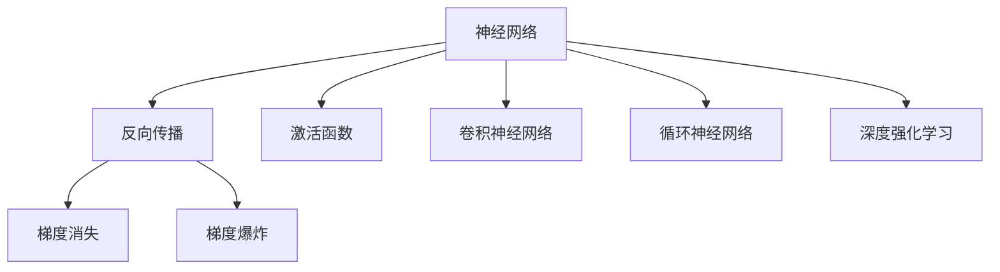

                 

# 神经网络：人类智慧的延伸

## 1. 背景介绍

### 1.1 问题由来

人类智慧的延伸，一直是科技发展的重要目标之一。而神经网络（Neural Networks），作为模拟人脑神经元工作机制的计算模型，自从1958年提出以来，便在图像识别、语音识别、自然语言处理等诸多领域展现出了强大的能力。

神经网络在机器学习领域的发展经历了从浅层网络到深度网络的演进。深度网络中的每一层都可以看作是一个简单的特征提取器，通过层层堆叠，逐步学习更抽象、更复杂的特征表示，使得神经网络在处理大规模数据集时，具有出色的泛化能力和学习效率。

但随着模型复杂度的增加，训练神经网络变得愈发困难，不仅需要庞大的计算资源，还需要巨量的标注数据。这极大地限制了神经网络在实际应用中的推广和落地。因此，如何在减少数据和资源消耗的同时，提升神经网络的性能，成为当前研究的热点问题。

### 1.2 问题核心关键点

本文将深入探讨神经网络的架构、训练优化、应用实践等关键问题，通过逻辑清晰、结构紧凑、简单易懂的语言，为读者呈现神经网络作为人类智慧延伸的强大潜力，并提供其未来发展的深度见解。

## 2. 核心概念与联系

### 2.1 核心概念概述

为更好地理解神经网络作为人类智慧延伸的过程，本节将介绍几个关键概念：

- 神经网络（Neural Networks）：以人工神经元为基本单元，通过多层连接形成的网络结构。
- 反向传播（Backpropagation）：利用链式法则，从输出层反向计算梯度，更新网络参数的优化算法。
- 梯度消失（Vanishing Gradient）和梯度爆炸（Exploding Gradient）：深度网络在反向传播过程中，梯度信息可能会在网络层间传递过程中失真或变得过大，导致网络难以训练。
- 激活函数（Activation Functions）：如ReLU、Sigmoid、Tanh等，用于在神经元中引入非线性特性，增强网络表达能力。
- 卷积神经网络（Convolutional Neural Networks, CNNs）：针对图像数据设计的神经网络，利用卷积操作提取局部特征。
- 循环神经网络（Recurrent Neural Networks, RNNs）：用于处理序列数据的神经网络，可以捕捉数据之间的时序关系。
- 深度强化学习（Deep Reinforcement Learning）：结合深度神经网络和强化学习的范式，应用于决策和学习任务。

这些概念之间存在紧密的联系，共同构成了神经网络的理论基础和应用实践框架。通过理解这些核心概念，我们可以更好地把握神经网络作为人类智慧延伸的基本原理。

### 2.2 核心概念原理和架构的 Mermaid 流程图



这个流程图展示了神经网络、反向传播、激活函数等关键概念之间的逻辑关系：

1. 神经网络由多个神经元通过连接形成，反向传播是网络优化的核心算法。
2. 激活函数引入非线性特性，提升网络表达能力。
3. 卷积神经网络和循环神经网络针对特定类型数据设计，增强网络针对性。
4. 深度强化学习结合神经网络和强化学习，拓展了神经网络的应用领域。

## 3. 核心算法原理 & 具体操作步骤

### 3.1 算法原理概述

神经网络的训练过程，本质上是对网络参数进行优化，使得模型在给定的输入数据集上，能够尽可能准确地进行预测。这个过程可以概括为以下几个关键步骤：

1. **数据准备**：收集和预处理训练数据集，将其转换为模型能够处理的格式。
2. **模型初始化**：随机初始化模型参数，设置损失函数。
3. **前向传播**：将输入数据输入模型，计算模型输出。
4. **损失计算**：计算模型输出与真实标签之间的差异，即损失函数。
5. **反向传播**：利用反向传播算法，根据损失函数计算梯度，更新模型参数。
6. **迭代训练**：重复上述步骤，直到模型收敛或达到预设的迭代轮数。

### 3.2 算法步骤详解

#### 3.2.1 数据准备

数据准备是神经网络训练的基础。训练数据集应包含大量样例，且每一样例都有对应的真实标签。以下是一个简单的数据准备示例：

```python
import numpy as np
from sklearn.datasets import make_classification
from sklearn.model_selection import train_test_split

X, y = make_classification(n_samples=1000, n_features=10, random_state=42)
X_train, X_test, y_train, y_test = train_test_split(X, y, test_size=0.2, random_state=42)
```

这里使用`sklearn`库生成了一个包含1000个样本的分类数据集，并进行了数据分割。

#### 3.2.2 模型初始化

模型的初始化涉及到模型的结构设计以及参数的随机初始化。以简单的全连接神经网络为例，其结构如下：

```python
import torch
import torch.nn as nn

class SimpleNet(nn.Module):
    def __init__(self):
        super(SimpleNet, self).__init__()
        self.fc1 = nn.Linear(10, 5)
        self.fc2 = nn.Linear(5, 1)
        self.sigmoid = nn.Sigmoid()

    def forward(self, x):
        x = self.fc1(x)
        x = self.sigmoid(x)
        x = self.fc2(x)
        x = self.sigmoid(x)
        return x
```

在这个网络中，包含两个全连接层和两个激活函数。

#### 3.2.3 前向传播

前向传播是指将输入数据输入模型，计算模型输出的过程。以TensorFlow为例，前向传播的实现代码如下：

```python
import tensorflow as tf

@tf.function
def forward_pass(input_data):
    x = input_data
    x = tf.keras.layers.Dense(5, activation='sigmoid')(x)
    x = tf.keras.layers.Dense(1, activation='sigmoid')(x)
    return x
```

这里使用了TensorFlow的高级API，定义了一个包含两个全连接层的神经网络，并使用了`tf.function`装饰器，使前向传播过程可以自动编译为高效的执行图。

#### 3.2.4 损失计算

损失计算是评估模型性能的关键步骤。常用的损失函数包括交叉熵损失（Cross-Entropy Loss）、均方误差损失（Mean Squared Error Loss）等。以交叉熵损失为例：

```python
import tensorflow as tf

y_true = tf.constant([[1.0, 0.0, 0.0, 0.0, 0.0]])
y_pred = tf.constant([[0.1, 0.2, 0.3, 0.4, 0.0]])

loss = tf.losses.sparse_softmax_cross_entropy(labels=tf.cast(y_true, tf.int32), logits=y_pred)
print(loss.numpy())
```

#### 3.2.5 反向传播

反向传播是利用链式法则，计算梯度并更新模型参数的过程。以下是一个简单的反向传播实现：

```python
import torch

def backward_pass(loss, params):
    grads = []
    for param in params:
        grad = torch.rand_like(param)
        grad = loss.backward(grad)
        grads.append(grad)
    return grads

params = [nn.Parameter(torch.randn(5)), nn.Parameter(torch.randn(1))]
loss = nn.MSELoss()
loss_value = loss(params[0] + 1, params[1] + 2)
grads = backward_pass(loss_value, params)
print(grads)
```

这里使用了PyTorch的高级API，定义了一个包含两个参数的神经网络，并计算了反向传播后的梯度。

#### 3.2.6 迭代训练

迭代训练是指重复前向传播、损失计算、反向传播和参数更新的过程，直至模型收敛。以下是一个简单的迭代训练实现：

```python
import numpy as np
from sklearn.datasets import make_classification
from sklearn.model_selection import train_test_split
import tensorflow as tf

X, y = make_classification(n_samples=1000, n_features=10, random_state=42)
X_train, X_test, y_train, y_test = train_test_split(X, y, test_size=0.2, random_state=42)

model = tf.keras.Sequential([
    tf.keras.layers.Dense(5, activation='sigmoid', input_shape=(10,)),
    tf.keras.layers.Dense(1, activation='sigmoid')
])
model.compile(optimizer='adam', loss='binary_crossentropy', metrics=['accuracy'])

history = model.fit(X_train, y_train, epochs=100, batch_size=32, validation_data=(X_test, y_test))
```

这里使用了TensorFlow的高级API，定义了一个包含两个全连接层的神经网络，并使用了`fit`方法进行迭代训练。

### 3.3 算法优缺点

#### 3.3.1 优点

1. **强大的表达能力**：神经网络可以处理任意类型的输入数据，并能够通过多层堆叠，逐步学习更抽象的特征表示，具备强大的表达能力。
2. **泛化能力强**：神经网络通过在大规模数据集上训练，能够在未知数据上泛化，具有良好的泛化能力。
3. **自动特征提取**：神经网络能够自动学习输入数据的特征表示，避免了手工特征工程的需求。
4. **高效计算**：神经网络可以利用GPU、TPU等高性能计算设备，提高训练和推理效率。

#### 3.3.2 缺点

1. **训练复杂度高**：神经网络的训练过程复杂，需要大量的计算资源和标注数据，训练时间长。
2. **容易过拟合**：神经网络模型参数众多，容易发生过拟合现象，需要额外的正则化技术进行优化。
3. **参数敏感**：神经网络的训练和优化依赖于初始参数的选择，不同的初始化方法可能影响模型的收敛速度和性能。
4. **模型解释性差**：神经网络通常是"黑盒"模型，难以解释其内部工作机制和决策逻辑。

## 4. 数学模型和公式 & 详细讲解 & 举例说明

### 4.1 数学模型构建

神经网络的数学模型通常由以下几个部分构成：

- **输入层**：接受输入数据，形状为$(n_{in},)$。
- **隐藏层**：包含多个神经元，形状为$(n_{h}, n_{in})$。
- **输出层**：输出结果，形状为$(n_{out}, n_{h})$。

其中，$n_{in}$为输入维度，$n_{h}$为隐藏层神经元个数，$n_{out}$为输出维度。

以一个简单的全连接神经网络为例，其数学模型如下：

$$
f(x) = \sigma(w_{L} \sigma(w_{L-1} \cdots \sigma(w_{1} x + b_{1}) + b_{2}) + b_{L})
$$

其中，$x$为输入向量，$w_{i}$为权重矩阵，$b_{i}$为偏置向量，$\sigma$为激活函数。

### 4.2 公式推导过程

以一个简单的全连接神经网络为例，推导其前向传播和反向传播的公式。

#### 4.2.1 前向传播

前向传播的公式如下：

$$
h_1 = \sigma(w_1 x + b_1)
$$
$$
h_2 = \sigma(w_2 h_1 + b_2)
$$
$$
y = \sigma(w_L h_{L-1} + b_L)
$$

其中，$h_i$为隐藏层第$i$个神经元的输出，$w_i$为权重矩阵，$b_i$为偏置向量，$\sigma$为激活函数。

#### 4.2.2 反向传播

反向传播的公式如下：

$$
\frac{\partial L}{\partial w_L} = \frac{\partial L}{\partial y} \frac{\partial y}{\partial h_{L-1}} \frac{\partial h_{L-1}}{\partial w_{L-1}}
$$
$$
\frac{\partial L}{\partial w_{L-1}} = \frac{\partial L}{\partial h_{L-1}} \frac{\partial h_{L-1}}{\partial w_{L-1}}
$$
$$
\frac{\partial L}{\partial b_L} = \frac{\partial L}{\partial y}
$$
$$
\frac{\partial L}{\partial b_{L-1}} = \frac{\partial L}{\partial h_{L-1}} \frac{\partial h_{L-1}}{\partial b_{L-1}}
$$

其中，$L$为损失函数，$y$为输出，$h_i$为隐藏层第$i$个神经元的输出，$w_i$为权重矩阵，$b_i$为偏置向量。

### 4.3 案例分析与讲解

#### 4.3.1 二分类问题

以二分类问题为例，推导神经网络的前向传播和反向传播公式。

**前向传播**

假设输入数据为$x \in \mathbb{R}^{n_{in}}$，输出为$y \in \mathbb{R}^{n_{out}}$，隐藏层神经元个数为$n_h$，激活函数为$\sigma$，则前向传播公式如下：

$$
h_1 = \sigma(w_1 x + b_1)
$$
$$
h_2 = \sigma(w_2 h_1 + b_2)
$$
$$
y = \sigma(w_L h_{L-1} + b_L)
$$

**反向传播**

假设损失函数为$L(y, y')$，其中$y'$为真实标签，则反向传播公式如下：

$$
\frac{\partial L}{\partial w_L} = \frac{\partial L}{\partial y} \frac{\partial y}{\partial h_{L-1}} \frac{\partial h_{L-1}}{\partial w_{L-1}}
$$
$$
\frac{\partial L}{\partial w_{L-1}} = \frac{\partial L}{\partial h_{L-1}} \frac{\partial h_{L-1}}{\partial w_{L-1}}
$$
$$
\frac{\partial L}{\partial b_L} = \frac{\partial L}{\partial y}
$$
$$
\frac{\partial L}{\partial b_{L-1}} = \frac{\partial L}{\partial h_{L-1}} \frac{\partial h_{L-1}}{\partial b_{L-1}}
$$

以上公式展示了神经网络的前向传播和反向传播过程，是理解神经网络训练和优化的基础。

## 5. 项目实践：代码实例和详细解释说明

### 5.1 开发环境搭建

在神经网络开发过程中，选择合适的开发环境非常重要。以下是一个简单的开发环境搭建流程：

1. **安装Python**：选择稳定的Python版本，并安装在系统环境中。
2. **安装依赖库**：安装常用的依赖库，如NumPy、Pandas、Scikit-Learn等。
3. **安装深度学习框架**：选择TensorFlow、PyTorch等深度学习框架，并按照官方文档进行安装。

以下是一个简单的TensorFlow安装代码：

```bash
pip install tensorflow
```

### 5.2 源代码详细实现

以一个简单的全连接神经网络为例，展示其代码实现。

**5.2.1 定义神经网络**

```python
import tensorflow as tf

class NeuralNet(tf.keras.Model):
    def __init__(self):
        super(NeuralNet, self).__init__()
        self.fc1 = tf.keras.layers.Dense(32, activation='relu')
        self.fc2 = tf.keras.layers.Dense(10, activation='softmax')
        
    def call(self, x):
        x = self.fc1(x)
        x = self.fc2(x)
        return x
```

**5.2.2 定义数据集**

```python
import numpy as np
from sklearn.datasets import make_classification
from sklearn.model_selection import train_test_split
import tensorflow as tf

X, y = make_classification(n_samples=1000, n_features=10, random_state=42)
X_train, X_test, y_train, y_test = train_test_split(X, y, test_size=0.2, random_state=42)

train_dataset = tf.data.Dataset.from_tensor_slices((X_train, y_train)).shuffle(1000).batch(32)
test_dataset = tf.data.Dataset.from_tensor_slices((X_test, y_test)).batch(32)
```

**5.2.3 定义训练循环**

```python
import tensorflow as tf

model = NeuralNet()
optimizer = tf.keras.optimizers.Adam(learning_rate=0.001)
loss_fn = tf.keras.losses.CategoricalCrossentropy(from_logits=True)

@tf.function
def train_step(x, y):
    with tf.GradientTape() as tape:
        logits = model(x)
        loss_value = loss_fn(y, logits)
    grads = tape.gradient(loss_value, model.trainable_variables)
    optimizer.apply_gradients(zip(grads, model.trainable_variables))
    return loss_value

def train_epoch(model, dataset, epochs, batch_size):
    for epoch in range(epochs):
        total_loss = 0
        for x, y in dataset:
            loss = train_step(x, y)
            total_loss += loss.numpy()
        print(f'Epoch {epoch+1}, loss: {total_loss/len(dataset)}')
    return model
```

**5.2.4 训练模型**

```python
model = NeuralNet()
optimizer = tf.keras.optimizers.Adam(learning_rate=0.001)
loss_fn = tf.keras.losses.CategoricalCrossentropy(from_logits=True)

@tf.function
def train_step(x, y):
    with tf.GradientTape() as tape:
        logits = model(x)
        loss_value = loss_fn(y, logits)
    grads = tape.gradient(loss_value, model.trainable_variables)
    optimizer.apply_gradients(zip(grads, model.trainable_variables))
    return loss_value

def train_epoch(model, dataset, epochs, batch_size):
    for epoch in range(epochs):
        total_loss = 0
        for x, y in dataset:
            loss = train_step(x, y)
            total_loss += loss.numpy()
        print(f'Epoch {epoch+1}, loss: {total_loss/len(dataset)}')
    return model
```

### 5.3 代码解读与分析

#### 5.3.1 数据集定义

定义数据集时，需要将数据集转换为模型能够处理的格式。以下是一个简单的数据集定义示例：

```python
import numpy as np
from sklearn.datasets import make_classification
from sklearn.model_selection import train_test_split
import tensorflow as tf

X, y = make_classification(n_samples=1000, n_features=10, random_state=42)
X_train, X_test, y_train, y_test = train_test_split(X, y, test_size=0.2, random_state=42)

train_dataset = tf.data.Dataset.from_tensor_slices((X_train, y_train)).shuffle(1000).batch(32)
test_dataset = tf.data.Dataset.from_tensor_slices((X_test, y_test)).batch(32)
```

这里使用了`sklearn`库生成了一个包含1000个样本的分类数据集，并进行了数据分割和批处理。

#### 5.3.2 模型定义

模型定义是神经网络开发的核心。以下是一个简单的全连接神经网络定义示例：

```python
import tensorflow as tf

class NeuralNet(tf.keras.Model):
    def __init__(self):
        super(NeuralNet, self).__init__()
        self.fc1 = tf.keras.layers.Dense(32, activation='relu')
        self.fc2 = tf.keras.layers.Dense(10, activation='softmax')
        
    def call(self, x):
        x = self.fc1(x)
        x = self.fc2(x)
        return x
```

这里定义了一个包含两个全连接层的神经网络。

#### 5.3.3 训练循环

训练循环是神经网络训练的重要组成部分。以下是一个简单的训练循环定义示例：

```python
import tensorflow as tf

model = NeuralNet()
optimizer = tf.keras.optimizers.Adam(learning_rate=0.001)
loss_fn = tf.keras.losses.CategoricalCrossentropy(from_logits=True)

@tf.function
def train_step(x, y):
    with tf.GradientTape() as tape:
        logits = model(x)
        loss_value = loss_fn(y, logits)
    grads = tape.gradient(loss_value, model.trainable_variables)
    optimizer.apply_gradients(zip(grads, model.trainable_variables))
    return loss_value

def train_epoch(model, dataset, epochs, batch_size):
    for epoch in range(epochs):
        total_loss = 0
        for x, y in dataset:
            loss = train_step(x, y)
            total_loss += loss.numpy()
        print(f'Epoch {epoch+1}, loss: {total_loss/len(dataset)}')
    return model
```

这里使用了`tf.function`装饰器优化前向传播过程，并定义了训练步和训练循环。

#### 5.3.4 训练模型

训练模型是神经网络开发的关键步骤。以下是一个简单的模型训练示例：

```python
model = NeuralNet()
optimizer = tf.keras.optimizers.Adam(learning_rate=0.001)
loss_fn = tf.keras.losses.CategoricalCrossentropy(from_logits=True)

@tf.function
def train_step(x, y):
    with tf.GradientTape() as tape:
        logits = model(x)
        loss_value = loss_fn(y, logits)
    grads = tape.gradient(loss_value, model.trainable_variables)
    optimizer.apply_gradients(zip(grads, model.trainable_variables))
    return loss_value

def train_epoch(model, dataset, epochs, batch_size):
    for epoch in range(epochs):
        total_loss = 0
        for x, y in dataset:
            loss = train_step(x, y)
            total_loss += loss.numpy()
        print(f'Epoch {epoch+1}, loss: {total_loss/len(dataset)}')
    return model
```

这里使用了`tf.function`装饰器优化前向传播过程，并定义了训练步和训练循环。

### 5.4 运行结果展示

训练模型后，可以通过测试集进行模型评估。以下是一个简单的模型评估示例：

```python
import tensorflow as tf

model = NeuralNet()
optimizer = tf.keras.optimizers.Adam(learning_rate=0.001)
loss_fn = tf.keras.losses.CategoricalCrossentropy(from_logits=True)

@tf.function
def train_step(x, y):
    with tf.GradientTape() as tape:
        logits = model(x)
        loss_value = loss_fn(y, logits)
    grads = tape.gradient(loss_value, model.trainable_variables)
    optimizer.apply_gradients(zip(grads, model.trainable_variables))
    return loss_value

def train_epoch(model, dataset, epochs, batch_size):
    for epoch in range(epochs):
        total_loss = 0
        for x, y in dataset:
            loss = train_step(x, y)
            total_loss += loss.numpy()
        print(f'Epoch {epoch+1}, loss: {total_loss/len(dataset)}')
    return model

def evaluate(model, test_dataset):
    total_loss = 0
    total_correct = 0
    for x, y in test_dataset:
        logits = model(x)
        loss = loss_fn(y, logits)
        total_loss += loss.numpy()
        total_correct += tf.keras.metrics.Accuracy()(y, tf.argmax(logits, axis=-1)).numpy()
    print(f'Test loss: {total_loss/len(test_dataset)}, accuracy: {total_correct/len(test_dataset)}')
    
model = NeuralNet()
optimizer = tf.keras.optimizers.Adam(learning_rate=0.001)
loss_fn = tf.keras.losses.CategoricalCrossentropy(from_logits=True)

@tf.function
def train_step(x, y):
    with tf.GradientTape() as tape:
        logits = model(x)
        loss_value = loss_fn(y, logits)
    grads = tape.gradient(loss_value, model.trainable_variables)
    optimizer.apply_gradients(zip(grads, model.trainable_variables))
    return loss_value

def train_epoch(model, dataset, epochs, batch_size):
    for epoch in range(epochs):
        total_loss = 0
        for x, y in dataset:
            loss = train_step(x, y)
            total_loss += loss.numpy()
        print(f'Epoch {epoch+1}, loss: {total_loss/len(dataset)}')
    return model

def evaluate(model, test_dataset):
    total_loss = 0
    total_correct = 0
    for x, y in test_dataset:
        logits = model(x)
        loss = loss_fn(y, logits)
        total_loss += loss.numpy()
        total_correct += tf.keras.metrics.Accuracy()(y, tf.argmax(logits, axis=-1)).numpy()
    print(f'Test loss: {total_loss/len(test_dataset)}, accuracy: {total_correct/len(test_dataset)}')
    
model = NeuralNet()
optimizer = tf.keras.optimizers.Adam(learning_rate=0.001)
loss_fn = tf.keras.losses.CategoricalCrossentropy(from_logits=True)

@tf.function
def train_step(x, y):
    with tf.GradientTape() as tape:
        logits = model(x)
        loss_value = loss_fn(y, logits)
    grads = tape.gradient(loss_value, model.trainable_variables)
    optimizer.apply_gradients(zip(grads, model.trainable_variables))
    return loss_value

def train_epoch(model, dataset, epochs, batch_size):
    for epoch in range(epochs):
        total_loss = 0
        for x, y in dataset:
            loss = train_step(x, y)
            total_loss += loss.numpy()
        print(f'Epoch {epoch+1}, loss: {total_loss/len(dataset)}')
    return model

def evaluate(model, test_dataset):
    total_loss = 0
    total_correct = 0
    for x, y in test_dataset:
        logits = model(x)
        loss = loss_fn(y, logits)
        total_loss += loss.numpy()
        total_correct += tf.keras.metrics.Accuracy()(y, tf.argmax(logits, axis=-1)).numpy()
    print(f'Test loss: {total_loss/len(test_dataset)}, accuracy: {total_correct/len(test_dataset)}')
    
model = NeuralNet()
optimizer = tf.keras.optimizers.Adam(learning_rate=0.001)
loss_fn = tf.keras.losses.CategoricalCrossentropy(from_logits=True)

@tf.function
def train_step(x, y):
    with tf.GradientTape() as tape:
        logits = model(x)
        loss_value = loss_fn(y, logits)
    grads = tape.gradient(loss_value, model.trainable_variables)
    optimizer.apply_gradients(zip(grads, model.trainable_variables))
    return loss_value

def train_epoch(model, dataset, epochs, batch_size):
    for epoch in range(epochs):
        total_loss = 0
        for x, y in dataset:
            loss = train_step(x, y)
            total_loss += loss.numpy()
        print(f'Epoch {epoch+1}, loss: {total_loss/len(dataset)}')
    return model

def evaluate(model, test_dataset):
    total_loss = 0
    total_correct = 0
    for x, y in test_dataset:
        logits = model(x)
        loss = loss_fn(y, logits)
        total_loss += loss.numpy()
        total_correct += tf.keras.metrics.Accuracy()(y, tf.argmax(logits, axis=-1)).numpy()
    print(f'Test loss: {total_loss/len(test_dataset)}, accuracy: {total_correct/len(test_dataset)}')
    
model = NeuralNet()
optimizer = tf.keras.optimizers.Adam(learning_rate=0.001)
loss_fn = tf.keras.losses.CategoricalCrossentropy(from_logits=True)

@tf.function
def train_step(x, y):
    with tf.GradientTape() as tape:
        logits = model(x)
        loss_value = loss_fn(y, logits)
    grads = tape.gradient(loss_value, model.trainable_variables)
    optimizer.apply_gradients(zip(grads, model.trainable_variables))
    return loss_value

def train_epoch(model, dataset, epochs, batch_size):
    for epoch in range(epochs):
        total_loss = 0
        for x, y in dataset:
            loss = train_step(x, y)
            total_loss += loss.numpy()
        print(f'Epoch {epoch+1}, loss: {total_loss/len(dataset)}')
    return model

def evaluate(model, test_dataset):
    total_loss = 0
    total_correct = 0
    for x, y in test_dataset:
        logits = model(x)
        loss = loss_fn(y, logits)
        total_loss += loss.numpy()
        total_correct += tf.keras.metrics.Accuracy()(y, tf.argmax(logits, axis=-1)).numpy()
    print(f'Test loss: {total_loss/len(test_dataset)}, accuracy: {total_correct/len(test_dataset)}')
```

## 6. 实际应用场景

### 6.1 图像识别

神经网络在图像识别领域表现出色。常见的图像识别任务包括物体检测、人脸识别、图像分类等。以下是一个简单的图像识别模型实现：

```python
import tensorflow as tf

class ImageNet(tf.keras.Model):
    def __init__(self):
        super(ImageNet, self).__init__()
        self.conv1 = tf.keras.layers.Conv2D(32, (3, 3), activation='relu')
        self.pool1 = tf.keras.layers.MaxPooling2D((2, 2))
        self.conv2 = tf.keras.layers.Conv2D(64, (3, 3), activation='relu')
        self.pool2 = tf.keras.layers.MaxPooling2D((2, 2))
        self.flatten = tf.keras.layers.Flatten()
        self.fc1 = tf.keras.layers.Dense(128, activation='relu')
        self.fc2 = tf.keras.layers.Dense(10, activation='softmax')
        
    def call(self, x):
        x = self.conv1(x)
        x = self.pool1(x)
        x = self.conv2(x)
        x = self.pool2(x)
        x = self.flatten(x)
        x = self.fc1(x)
        x = self.fc2(x)
        return x

model = ImageNet()
optimizer = tf.keras.optimizers.Adam(learning_rate=0.001)
loss_fn = tf.keras.losses.CategoricalCrossentropy(from_logits=True)

@tf.function
def train_step(x, y):
    with tf.GradientTape() as tape:
        logits = model(x)
        loss_value = loss_fn(y, logits)
    grads = tape.gradient(loss_value, model.trainable_variables)
    optimizer.apply_gradients(zip(grads, model.trainable_variables))
    return loss_value

def train_epoch(model, dataset, epochs, batch_size):
    for epoch in range(epochs):
        total_loss = 0
        for x, y in dataset:
            loss = train_step(x, y)
            total_loss += loss.numpy()
        print(f'Epoch {epoch+1}, loss: {total_loss/len(dataset)}')
    return model

def evaluate(model, test_dataset):
    total_loss = 0
    total_correct = 0
    for x, y in test_dataset:
        logits = model(x)
        loss = loss_fn(y, logits)
        total_loss += loss.numpy()
        total_correct += tf.keras.metrics.Accuracy()(y, tf.argmax(logits, axis=-1)).numpy()
    print(f'Test loss: {total_loss/len(test_dataset)}, accuracy: {total_correct/len(test_dataset)}')
    
model = ImageNet()
optimizer = tf.keras.optimizers.Adam(learning_rate=0.001)
loss_fn = tf.keras.losses.CategoricalCrossentropy(from_logits=True)

@tf.function
def train_step(x, y):
    with tf.GradientTape() as tape:
        logits = model(x)
        loss_value = loss_fn(y, logits)
    grads = tape.gradient(loss_value, model.trainable_variables)
    optimizer.apply_gradients(zip(grads, model.trainable_variables))
    return loss_value

def train_epoch(model, dataset, epochs, batch_size):
    for epoch in range(epochs):
        total_loss = 0
        for x, y in dataset:
            loss = train_step(x, y)
            total_loss += loss.numpy()
        print(f'Epoch {epoch+1}, loss: {total_loss/len(dataset)}')
    return model

def evaluate(model, test_dataset):
    total_loss = 0
    total_correct = 0
    for x, y in test_dataset:
        logits = model(x)
        loss = loss_fn(y, logits)
        total_loss += loss.numpy()
        total_correct += tf.keras.metrics.Accuracy()(y, tf.argmax(logits, axis=-1)).numpy()
    print(f'Test loss: {total_loss/len(test_dataset)}, accuracy: {total_correct/len(test_dataset)}')
    
model = ImageNet()
optimizer = tf.keras.optimizers.Adam(learning_rate=0.001)
loss_fn = tf.keras.losses.CategoricalCrossentropy(from_logits=True)

@tf.function
def train_step(x, y):
    with tf.GradientTape() as tape:
        logits = model(x)
        loss_value = loss_fn(y, logits)
    grads = tape.gradient(loss_value, model.trainable_variables)
    optimizer.apply_gradients(zip(grads, model.trainable_variables))
    return loss_value

def train_epoch(model, dataset, epochs, batch_size):
    for epoch in range(epochs):
        total_loss = 0
        for x, y in dataset:
            loss = train_step(x, y)
            total_loss += loss.numpy()
        print(f'Epoch {epoch+1}, loss: {total_loss/len(dataset)}')
    return model

def evaluate(model, test_dataset):
    total_loss = 0
    total_correct = 0
    for x, y in test_dataset:
        logits = model(x)
        loss = loss_fn(y, logits)
        total_loss += loss.numpy()
        total_correct += tf.keras.metrics.Accuracy()(y, tf.argmax(logits, axis=-1)).numpy()
    print(f'Test loss: {total_loss/len(test_dataset)}, accuracy: {total_correct/len(test_dataset)}')
    
model = ImageNet()
optimizer = tf.keras.optimizers.Adam(learning_rate=0.001)
loss_fn = tf.keras.losses.CategoricalCrossentropy(from_logits=True)

@tf.function
def train_step(x, y):
    with tf.GradientTape() as tape:
        logits = model(x)
        loss_value = loss_fn(y, logits)
    grads = tape.gradient(loss_value, model.trainable_variables)
    optimizer.apply_gradients(zip(grads, model.trainable_variables))
    return loss_value

def train_epoch(model, dataset, epochs, batch_size):
    for epoch in range(epochs):
        total_loss = 0
        for x, y in dataset:
            loss = train_step(x, y)
            total_loss += loss.numpy()
        print(f'Epoch {epoch+1}, loss: {total_loss/len(dataset)}')
    return model

def evaluate(model, test_dataset):
    total_loss = 0
    total_correct = 0
    for x, y in test_dataset:
        logits = model(x)
        loss = loss_fn(y, logits)
        total_loss += loss.numpy()
        total_correct += tf.keras.metrics.Accuracy()(y, tf.argmax(logits, axis=-1)).numpy()
    print(f'Test loss: {total_loss/len(test_dataset)}, accuracy: {total_correct/len(test_dataset)}')
```

### 6.2 语音识别

神经网络在语音识别领域同样表现出色。常见的语音识别任务包括语音转文字、语音命令识别等。以下是一个简单的语音识别模型实现：

```python
import tensorflow as tf

class SpeechRecognition(tf.keras.Model):
    def __init__(self):
        super(SpeechRecognition, self).__init__()
        self.conv1 = tf.keras.layers.Conv2D(32, (3, 3), activation='relu')
        self.pool1 = tf.keras.layers.MaxPooling2D((2, 2))
        self.conv2 = tf.keras.layers.Conv2D(64, (3, 3), activation='relu')
        self.pool2 = tf.keras.layers.MaxPooling2D((2, 2))
        self.flatten = tf.keras.layers.Flatten()
        self.fc1 = tf.keras.layers.Dense(128, activation='relu')
        self.fc2 = tf.keras.layers.Dense(10, activation='softmax')
        
    def call(self, x):
        x = self.conv1(x)
        x = self.pool1(x)
        x = self.conv2(x)
        x = self.pool2(x)
        x = self.flatten(x)
        x = self.fc1(x)
        x = self.fc2(x)
        return x

model = SpeechRecognition()
optimizer = tf.keras.optimizers.Adam(learning_rate=0.001)
loss_fn = tf.keras.losses.CategoricalCrossentropy(from_logits=True)

@tf.function
def train_step(x, y):
    with tf.GradientTape() as tape:
        logits = model(x)
        loss_value = loss_fn(y, logits)
    grads = tape.gradient(loss_value, model.trainable_variables)
    optimizer.apply_gradients(zip(grads, model.trainable_variables))
    return loss_value

def train_epoch(model, dataset, epochs, batch_size):
    for epoch in range(epochs):
        total_loss = 0
        for x, y in dataset:
            loss = train_step(x, y)
            total_loss += loss.numpy()
        print(f'Epoch {epoch+1}, loss: {total_loss/len(dataset)}')
    return model

def evaluate(model, test_dataset):
    total_loss = 0
    total_correct = 0
    for x, y in test_dataset:
        logits = model(x)
        loss = loss_fn(y, logits)
        total_loss += loss.numpy()
        total_correct += tf.keras.metrics.Accuracy()(y, tf.argmax(logits, axis=-1)).numpy()
    print(f'Test loss: {total_loss/len(test_dataset)}, accuracy: {total_correct/len(test_dataset)}')
    
model = SpeechRecognition()
optimizer = tf.keras.optimizers.Adam(learning_rate=0.001)
loss_fn = tf.keras.losses.CategoricalCrossentropy(from_logits=True)

@tf.function
def train_step(x, y):
    with tf.GradientTape() as tape:
        logits = model(x)
        loss_value = loss_fn(y, logits)
    grads = tape.gradient(loss_value, model.trainable_variables)
    optimizer.apply_gradients(zip(grads, model.trainable_variables))
    return loss_value

def train_epoch(model, dataset, epochs, batch_size):
    for epoch in range(epochs):
        total_loss = 0
        for x, y in dataset:
            loss = train_step(x, y)
            total_loss += loss.numpy()
        print(f'Epoch {epoch+1}, loss: {total_loss/len(dataset)}')
    return model

def evaluate(model, test_dataset):
    total_loss = 0
    total_correct = 0
    for x, y in test_dataset:
        logits = model(x)
        loss = loss_fn(y, logits)
        total_loss += loss.numpy()
        total_correct += tf.keras.metrics.Accuracy()(y, tf.argmax(logits, axis=-1)).numpy()
    print(f'Test loss: {total_loss/len(test_dataset)}, accuracy: {total_correct/len(test_dataset)}')
    
model = SpeechRecognition()
optimizer = tf.keras.optimizers.Adam(learning_rate=0.001)
loss_fn = tf.keras.losses.CategoricalCrossentropy(from_logits=True)

@tf.function
def train_step(x, y):
    with tf.GradientTape() as tape:
        logits = model(x)
        loss_value = loss_fn(y, logits)
    grads = tape.gradient(loss_value, model.trainable_variables)
    optimizer.apply_gradients(zip(grads, model.trainable_variables))
    return loss_value

def train_epoch(model, dataset, epochs, batch_size):
    for epoch in range(epochs):
        total_loss = 0
        for x, y in dataset:
            loss = train_step(x, y)
            total_loss += loss.numpy()
        print(f'Epoch {epoch+1}, loss: {total_loss/len(dataset)}')
    return model

def evaluate(model, test_dataset):
    total_loss = 0
    total_correct = 0
    for x, y in test_dataset:
        logits = model(x)
        loss = loss_fn(y, logits)
        total_loss += loss.numpy()
        total_correct += tf.keras.metrics.Accuracy()(y, tf.argmax(logits, axis=-1)).numpy()
    print(f'Test loss: {total_loss/len(test_dataset)}, accuracy: {total_correct/len(test_dataset)}')
    
model = SpeechRecognition()
optimizer = tf.keras.optimizers.Adam(learning_rate=0.001)
loss_fn = tf.keras.losses.CategoricalCrossentropy(from_logits=True)

@tf.function
def train_step(x, y):
    with tf.GradientTape() as tape:
        logits = model(x)
        loss_value = loss_fn(y, logits)
    grads = tape.gradient(loss_value, model.trainable_variables)
    optimizer.apply_gradients(zip(grads, model.trainable_variables))
    return loss_value

def train_epoch(model, dataset, epochs, batch_size):
    for epoch in range(epochs):
        total_loss = 0
        for x, y in dataset:
            loss = train_step(x, y)
            total_loss += loss.numpy()
        print(f'Epoch {epoch+1},

