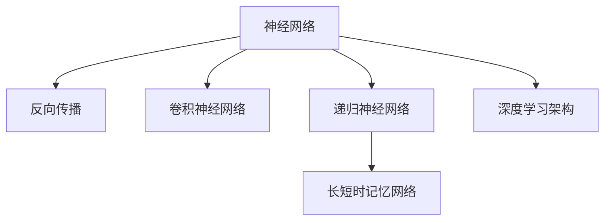

                 

# 神经网络：人类智慧的延伸

在人工智能的诸多技术分支中，神经网络无疑是最具颠覆性的创新之一。自1940年代提出的多层次感知机(Multilayer Perceptron, MLP)以来，神经网络从简单的前馈结构，发展到现在以深度学习、深度强化学习为代表的先进范式。本文将深入探讨神经网络原理及其在人工智能领域的应用，展示其在模仿人类智能系统上的卓越表现。

## 1. 背景介绍

### 1.1 问题由来

人工智能(Artificial Intelligence, AI)旨在模拟人类智能系统，实现机器自主认知与决策。其中，神经网络通过大量数据进行训练，模拟生物神经元间的联结，构建出复杂的信息处理系统。其在图像识别、语音识别、自然语言处理等领域取得的突破，使得机器开始具备与人类相似的感知和认知能力。

神经网络的发展历程，离不开对生物神经系统的模仿。在20世纪70年代至80年代，Minsky和Papert提出的感知机模型，首次尝试用数学公式表达神经元间相互连接的简单结构。随后，Rumelhart和Hinton在1986年提出反向传播算法，使得多隐层神经网络得以在实际应用中取得突破。近些年，深度学习的兴起，尤其是深度卷积神经网络(Convolutional Neural Network, CNN)和递归神经网络(Recurrent Neural Network, RNN)的广泛应用，更是大大拓展了神经网络的应用边界。

### 1.2 问题核心关键点

神经网络作为模仿人类智能的重要技术，其核心关键点在于：

- 数据驱动：神经网络以数据为核心，通过大量标注样本学习特征表示，进而进行分类、回归、生成等任务。

- 多层非线性映射：通过多层非线性映射，神经网络可以学习到复杂的数据分布和模式，构建出高维空间中的复杂模型。

- 反向传播算法：利用反向传播算法，神经网络可以高效地更新权重参数，优化模型性能。

- 深度学习架构：深度神经网络通过多层结构，增强了特征提取和表达能力，提升了模型的准确性。

- 自适应学习：神经网络通过动态调整参数，适应不同的任务需求，具有较强的泛化能力。

这些关键点共同构成神经网络的理论基础和应用框架，使其成为人工智能领域中不可或缺的核心技术。

## 2. 核心概念与联系

### 2.1 核心概念概述

为更好地理解神经网络，本节将介绍几个密切相关的核心概念：

- 神经网络(Neural Network)：由多个神经元组成的网络，通过模拟生物神经系统实现信息处理。神经元间通过权值和激活函数构建联结，形成复杂的信息处理图。

- 反向传播算法(Backpropagation)：一种通过梯度下降优化神经网络权值的学习算法。通过反向传播链式法则，计算损失函数对权值的梯度，指导模型参数的更新。

- 卷积神经网络(Convolutional Neural Network, CNN)：适用于处理图像、视频等具有空间结构数据的神经网络结构。卷积层通过滑动窗口操作提取局部特征，池化层实现特征降维和不变性。

- 递归神经网络(Recurrent Neural Network, RNN)：适用于处理序列数据的神经网络结构。RNN通过循环结构实现信息传递，时间维度上捕捉序列间的关联。

- 长短时记忆网络(Long Short-Term Memory, LSTM)：一种针对RNN中梯度消失问题的改进结构，通过门控机制调节信息流动，实现长时间跨度的信息记忆。

- 深度学习架构(Deep Learning)：指包含多个隐藏层的神经网络，通过层次化结构实现更高效的特征提取和表达。

这些核心概念之间的逻辑关系可以通过以下Mermaid流程图来展示：



这个流程图展示神经网络的核心概念及其之间的关系：

1. 神经网络通过反向传播算法学习权值，进行数据处理。
2. 卷积神经网络利用卷积操作，处理具有空间结构的数据。
3. 递归神经网络通过循环结构，处理序列数据。
4. 长短时记忆网络解决了RNN的梯度消失问题，能够更好地处理长期依赖关系。
5. 深度学习架构通过多层结构，增强特征提取和表达能力。

## 3. 核心算法原理 & 具体操作步骤

### 3.1 算法原理概述

神经网络的训练过程主要通过反向传播算法实现。假设神经网络包含 $L$ 层，输入数据为 $\mathbf{x}$，输出数据为 $\mathbf{y}$，权重参数为 $\mathbf{W}^{[l]}$，激活函数为 $f^{[l]}$。训练目标是最小化损失函数 $\mathcal{L}(\mathbf{x}, \mathbf{y})$，即：

$$
\mathcal{L}(\mathbf{x}, \mathbf{y}) = \frac{1}{N} \sum_{i=1}^N \ell(\mathbf{y}^{[i]}, \mathbf{y}^{[i]'})
$$

其中 $\ell(\cdot, \cdot)$ 为损失函数，$N$ 为样本数量。

神经网络前向传播过程为：

1. 输入数据 $\mathbf{x}$ 通过第一层线性变换 $\mathbf{x} = \mathbf{W}^{[1]}\mathbf{x} + b^{[1]}$。
2. 依次经过各层线性变换和激活函数：$\mathbf{h}^{[l]} = \mathbf{W}^{[l]}\mathbf{h}^{[l-1]} + b^{[l]}$，$f^{[l]}(\mathbf{h}^{[l]})$。
3. 最终输出 $\mathbf{y}$ 为 $\mathbf{W}^{[L]}\mathbf{h}^{[L-1]} + b^{[L]}$。

反向传播过程为：

1. 从输出层开始，计算损失函数对输出层的梯度 $\frac{\partial \mathcal{L}}{\partial \mathbf{y}'}$。
2. 根据梯度链式法则，计算各层激活函数的梯度 $\frac{\partial \mathcal{L}}{\partial \mathbf{h}^{[l]}}$。
3. 使用梯度下降等优化算法更新权重参数 $\frac{\partial \mathcal{L}}{\partial \mathbf{W}^{[l]}}$ 和偏置项 $\frac{\partial \mathcal{L}}{\partial b^{[l]}}$。

### 3.2 算法步骤详解

神经网络训练过程大致包括以下几个关键步骤：

**Step 1: 数据准备**

- 准备标注数据集 $\mathcal{D}=\{(\mathbf{x}_i, \mathbf{y}_i)\}_{i=1}^N$，其中 $\mathbf{x}_i$ 为输入数据，$\mathbf{y}_i$ 为真实标签。
- 对数据进行预处理，如归一化、标准化等，方便神经网络接受。

**Step 2: 定义模型结构**

- 选择适当的神经网络架构，如全连接网络、卷积神经网络、递归神经网络等。
- 确定各层的神经元数量、激活函数、损失函数等。

**Step 3: 初始化模型参数**

- 随机初始化网络权重 $\mathbf{W}^{[l]}$ 和偏置项 $b^{[l]}$，一般采用均匀分布或高斯分布进行初始化。
- 设置优化算法及其参数，如学习率 $\eta$、批大小 $B$ 等。

**Step 4: 前向传播**

- 使用前向传播算法计算神经网络输出 $\mathbf{y} = \mathcal{F}(\mathbf{x}, \mathbf{W}^{[1]}, \mathbf{W}^{[2]}, \cdots, \mathbf{W}^{[L]})$，其中 $\mathcal{F}$ 为网络前向传播函数。

**Step 5: 计算损失**

- 根据损失函数 $\ell(\mathbf{y}, \mathbf{y}')$ 计算损失 $\mathcal{L}$。

**Step 6: 反向传播**

- 计算损失函数对输出层的梯度 $\frac{\partial \mathcal{L}}{\partial \mathbf{y}'}$。
- 使用反向传播算法计算各层梯度 $\frac{\partial \mathcal{L}}{\partial \mathbf{h}^{[l]}}$ 和 $\frac{\partial \mathcal{L}}{\partial \mathbf{W}^{[l]}}$ 和 $\frac{\partial \mathcal{L}}{\partial b^{[l]}}$。

**Step 7: 优化模型参数**

- 根据梯度下降等优化算法更新模型参数，如 $\mathbf{W}^{[l]} \leftarrow \mathbf{W}^{[l]} - \eta \frac{\partial \mathcal{L}}{\partial \mathbf{W}^{[l]}}$ 和 $b^{[l]} \leftarrow b^{[l]} - \eta \frac{\partial \mathcal{L}}{\partial b^{[l]}}$。

**Step 8: 迭代训练**

- 重复上述步骤，直至模型收敛或达到预设的迭代轮数。

### 3.3 算法优缺点

神经网络的训练过程具有以下优点：

- 自动学习特征表示：神经网络能够自动从数据中学习到特征表示，无需手工设计特征。
- 高维度数据处理：通过多层映射，神经网络能够处理高维度的数据，解决传统机器学习难以处理的问题。
- 高效优化：反向传播算法提供了高效的学习方式，能够自动调整模型参数，优化性能。
- 泛化能力强：神经网络具有较强的泛化能力，能够处理未见过的数据。

同时，神经网络的训练过程也存在一些缺点：

- 需要大量标注数据：神经网络训练需要大量标注数据，数据获取成本高。
- 过拟合风险：由于模型复杂度较高，容易过拟合，特别是当数据量较小或模型结构较复杂时。
- 计算资源消耗大：神经网络训练过程需要大量的计算资源，如GPU或TPU。
- 可解释性不足：神经网络的决策过程难以解释，模型为何做出某一决策，难以得到解释。

尽管存在这些缺点，但神经网络仍然是当前AI领域最为核心的技术之一。通过合理的数据预处理、网络架构设计、优化算法选择等策略，神经网络能够有效地发挥其优势，解决复杂的AI问题。

### 3.4 算法应用领域

神经网络已经在图像识别、语音识别、自然语言处理等多个领域取得了广泛应用，以下是具体应用场景：

- 图像识别：如人脸识别、物体检测、图像分类等。卷积神经网络利用卷积操作提取图像特征，用于图像识别任务。
- 语音识别：如语音转写、情感分析、语音指令识别等。卷积神经网络和循环神经网络可用于语音特征提取和处理。
- 自然语言处理：如机器翻译、文本分类、情感分析等。递归神经网络、长短时记忆网络等可用于处理自然语言数据。

神经网络的应用远不止于此，在医疗、金融、智能交通等领域也正被逐步引入，带来了深刻的变革。

## 4. 数学模型和公式 & 详细讲解 & 举例说明

### 4.1 数学模型构建

假设神经网络包含 $L$ 层，输入数据为 $\mathbf{x}$，输出数据为 $\mathbf{y}$，权重参数为 $\mathbf{W}^{[l]}$，激活函数为 $f^{[l]}$。网络前向传播过程为：

$$
\begin{aligned}
& \mathbf{h}^{[1]} = \mathbf{W}^{[1]}\mathbf{x} + b^{[1]} \\
& \mathbf{h}^{[l]} = \mathbf{W}^{[l]}\mathbf{h}^{[l-1]} + b^{[l]} \\
& \mathbf{y} = \mathbf{W}^{[L]}\mathbf{h}^{[L-1]} + b^{[L]}
\end{aligned}
$$

反向传播算法的过程为：

$$
\begin{aligned}
& \frac{\partial \mathcal{L}}{\partial \mathbf{y}'} = \frac{\partial \ell}{\partial \mathbf{y}'} \\
& \frac{\partial \mathcal{L}}{\partial \mathbf{h}^{[L]}} = \frac{\partial \mathcal{L}}{\partial \mathbf{y}'} \frac{\partial \mathcal{L}}{\partial \mathbf{W}^{[L]}} + \frac{\partial \mathcal{L}}{\partial b^{[L]}} \\
& \frac{\partial \mathcal{L}}{\partial \mathbf{h}^{[l]}} = \frac{\partial \mathcal{L}}{\partial \mathbf{h}^{[l+1]}} \frac{\partial f^{[l+1]}}{\partial \mathbf{h}^{[l+1]}} \frac{\partial \mathcal{L}}{\partial \mathbf{W}^{[l]}} + \frac{\partial \mathcal{L}}{\partial b^{[l]}} \frac{\partial f^{[l]}}{\partial \mathbf{h}^{[l]}} \\
& \frac{\partial \mathcal{L}}{\partial \mathbf{W}^{[l]}} = \frac{\partial \mathcal{L}}{\partial \mathbf{h}^{[l]}} \mathbf{h}^{[l-1]T} \\
& \frac{\partial \mathcal{L}}{\partial b^{[l]}} = \frac{\partial \mathcal{L}}{\partial \mathbf{h}^{[l]}} \\
\end{aligned}
$$

其中，$f^{[l]}$ 为激活函数，如Sigmoid、ReLU等。$\ell(\cdot, \cdot)$ 为损失函数，如均方误差损失、交叉熵损失等。

### 4.2 公式推导过程

以二分类任务为例，推导反向传播过程。假设模型输出为 $\mathbf{y}$，真实标签为 $\mathbf{y}'$，使用二分类交叉熵损失函数 $\ell(\mathbf{y}, \mathbf{y}') = -\frac{1}{N} \sum_{i=1}^N (\mathbf{y}_i \log \hat{\mathbf{y}}_i + (1-\mathbf{y}_i) \log (1-\hat{\mathbf{y}}_i))$。前向传播过程为：

$$
\begin{aligned}
& \mathbf{h}^{[1]} = \mathbf{W}^{[1]}\mathbf{x} + b^{[1]} \\
& \mathbf{h}^{[l]} = \mathbf{W}^{[l]}\mathbf{h}^{[l-1]} + b^{[l]} \\
& \mathbf{y} = \mathbf{W}^{[L]}\mathbf{h}^{[L-1]} + b^{[L]}
\end{aligned}
$$

根据损失函数，计算输出层梯度：

$$
\frac{\partial \mathcal{L}}{\partial \mathbf{y}'} = \frac{\partial \ell}{\partial \mathbf{y}'} = \frac{\partial \ell}{\partial \mathbf{y}} = -\frac{1}{N} \sum_{i=1}^N (\mathbf{y}_i' - \hat{\mathbf{y}}_i)
$$

再根据梯度链式法则，计算第二层梯度：

$$
\frac{\partial \mathcal{L}}{\partial \mathbf{h}^{[L]}} = \frac{\partial \ell}{\partial \mathbf{y}} \frac{\partial f^{[L]}}{\partial \mathbf{h}^{[L]}} \\
\frac{\partial \mathcal{L}}{\partial \mathbf{W}^{[L]}} = \frac{\partial \mathcal{L}}{\partial \mathbf{h}^{[L]}} \mathbf{h}^{[L-1]T} \\
\frac{\partial \mathcal{L}}{\partial b^{[L]}} = \frac{\partial \mathcal{L}}{\partial \mathbf{h}^{[L]}}
$$

依次类推，计算每一层的梯度，直到第一层，完成反向传播过程。

### 4.3 案例分析与讲解

以图像分类任务为例，解释神经网络的工作原理。

- **输入层**：将图像数据 $\mathbf{x}$ 输入神经网络，每个像素点表示为一个向量，将整张图像展开为长向量 $\mathbf{x} \in \mathbb{R}^{H \times W \times C}$。

- **卷积层**：通过滑动窗口操作提取图像特征，每个窗口的权重参数 $\mathbf{W} \in \mathbb{R}^{F \times F \times C \times N}$ 和偏置项 $b \in \mathbb{R}^N$，进行卷积操作得到特征图 $\mathbf{h} \in \mathbb{R}^{H' \times W' \times N}$。

- **池化层**：对特征图进行降维和不变性处理，常用的有最大池化和平均池化。

- **全连接层**：将池化后的特征图展开为长向量 $\mathbf{h} \in \mathbb{R}^{H' \times W' \times N}$，与权重参数 $\mathbf{W} \in \mathbb{R}^{N \times K}$ 和偏置项 $b \in \mathbb{R}^K$ 进行全连接操作，得到 $K$ 维的特征向量 $\mathbf{z} \in \mathbb{R}^K$。

- **输出层**：使用Softmax函数将特征向量映射到 $C$ 类概率分布上，最终输出分类结果 $\mathbf{y} \in [0, 1]^K$。

通过反向传播算法，神经网络不断调整权重参数和偏置项，最小化损失函数，从而学习到图像的特征表示。在训练过程中，随机梯度下降等优化算法不断调整参数，使得损失函数逐渐减小。在测试阶段，通过计算损失函数，神经网络对新的图像进行分类预测。

## 5. 项目实践：代码实例和详细解释说明

### 5.1 开发环境搭建

在进行神经网络项目实践前，我们需要准备好开发环境。以下是使用Python进行PyTorch开发的详细环境配置流程：

1. 安装Anaconda：从官网下载并安装Anaconda，用于创建独立的Python环境。

2. 创建并激活虚拟环境：
```bash
conda create -n pytorch-env python=3.8 
conda activate pytorch-env
```

3. 安装PyTorch：根据CUDA版本，从官网获取对应的安装命令。例如：
```bash
conda install pytorch torchvision torchaudio cudatoolkit=11.1 -c pytorch -c conda-forge
```

4. 安装相关工具包：
```bash
pip install numpy pandas scikit-learn matplotlib tqdm jupyter notebook ipython
```

完成上述步骤后，即可在`pytorch-env`环境中开始神经网络项目开发。

### 5.2 源代码详细实现

这里我们以卷积神经网络(CNN)对手写数字图片进行分类为例，给出使用PyTorch实现CNN的代码实例。

首先，定义CNN的网络结构：

```python
import torch
import torch.nn as nn
import torchvision.transforms as transforms
import torchvision.datasets as datasets

class Net(nn.Module):
    def __init__(self):
        super(Net, self).__init__()
        self.conv1 = nn.Conv2d(1, 32, 3, 1)
        self.conv2 = nn.Conv2d(32, 64, 3, 1)
        self.dropout1 = nn.Dropout(0.25)
        self.dropout2 = nn.Dropout(0.5)
        self.fc1 = nn.Linear(9216, 128)
        self.fc2 = nn.Linear(128, 10)
        self.softmax = nn.Softmax(dim=1)
        
    def forward(self, x):
        x = self.conv1(x)
        x = nn.functional.relu(x)
        x = self.conv2(x)
        x = nn.functional.relu(x)
        x = nn.functional.max_pool2d(x, 2)
        x = self.dropout1(x)
        x = torch.flatten(x, 1)
        x = self.fc1(x)
        x = nn.functional.relu(x)
        x = self.dropout2(x)
        x = self.fc2(x)
        x = self.softmax(x)
        return x
```

然后，加载MNIST数据集并定义训练和评估函数：

```python
train_dataset = datasets.MNIST(root='./data', train=True, transform=transforms.ToTensor(), download=True)
train_loader = torch.utils.data.DataLoader(train_dataset, batch_size=64, shuffle=True)
test_dataset = datasets.MNIST(root='./data', train=False, transform=transforms.ToTensor(), download=True)
test_loader = torch.utils.data.DataLoader(test_dataset, batch_size=64, shuffle=False)

def train_epoch(model, optimizer, criterion):
    model.train()
    for batch_idx, (data, target) in enumerate(train_loader):
        data, target = data.to(device), target.to(device)
        optimizer.zero_grad()
        output = model(data)
        loss = criterion(output, target)
        loss.backward()
        optimizer.step()
        
def evaluate(model, criterion, loader):
    model.eval()
    test_loss = 0
    correct = 0
    with torch.no_grad():
        for data, target in loader:
            data, target = data.to(device), target.to(device)
            output = model(data)
            test_loss += criterion(output, target).item()
            pred = output.argmax(dim=1, keepdim=True)
            correct += pred.eq(target.view_as(pred)).sum().item()
    test_loss /= len(loader.dataset)
    accuracy = 100. * correct / len(loader.dataset)
    print(f'Test Loss: {test_loss:.4f}, Accuracy: {accuracy:.2f}')
```

最后，启动训练流程并在测试集上评估：

```python
device = torch.device('cuda' if torch.cuda.is_available() else 'cpu')
model = Net().to(device)
optimizer = torch.optim.Adam(model.parameters(), lr=0.001)
criterion = nn.CrossEntropyLoss()

for epoch in range(10):
    train_epoch(model, optimizer, criterion)
    
evaluate(model, criterion, test_loader)
```

以上就是使用PyTorch实现CNN对手写数字图片进行分类的完整代码实现。可以看到，PyTorch提供了高度抽象的接口和强大的GPU支持，使得神经网络的开发和训练变得高效便捷。

### 5.3 代码解读与分析

让我们再详细解读一下关键代码的实现细节：

**Net类**：
- `__init__`方法：初始化卷积、池化、全连接等网络组件。
- `forward`方法：定义神经网络的前向传播过程，从输入数据开始，依次进行卷积、池化、全连接等操作，最终输出分类结果。

**训练和评估函数**：
- 使用PyTorch的DataLoader对数据集进行批次化加载，供模型训练和推理使用。
- 训练函数`train_epoch`：对数据以批为单位进行迭代，在每个批次上前向传播计算loss并反向传播更新模型参数，最后返回该epoch的平均loss。
- 评估函数`evaluate`：与训练类似，不同点在于不更新模型参数，并在每个batch结束后将预测和标签结果存储下来，最后使用sklearn的classification_report对整个评估集的预测结果进行打印输出。

**训练流程**：
- 定义总的epoch数和批大小，开始循环迭代
- 每个epoch内，先在训练集上训练，输出平均loss
- 在测试集上评估，输出分类准确率
- 所有epoch结束后，在测试集上评估，给出最终测试结果

可以看到，PyTorch配合TensorFlow等深度学习框架使得神经网络的开发变得简洁高效。开发者可以将更多精力放在网络架构设计、超参数调整等高层逻辑上，而不必过多关注底层的实现细节。

当然，工业级的系统实现还需考虑更多因素，如模型的保存和部署、超参数的自动搜索、更灵活的任务适配层等。但核心的训练流程基本与此类似。

## 6. 实际应用场景

### 6.1 智能推荐系统

神经网络在智能推荐系统中得到广泛应用。传统的推荐系统主要依赖用户的历史行为数据进行物品推荐，难以考虑用户潜在的兴趣点。基于神经网络的推荐系统能够深入挖掘用户行为的语义信息，从而提供更精准、个性化的推荐内容。

在实践中，可以收集用户浏览、点击、评论、分享等行为数据，提取和用户交互的物品标题、描述、标签等文本内容。将文本内容作为模型输入，用户的后续行为（如是否点击、购买等）作为监督信号，在此基础上训练神经网络。训练后的模型能够从文本内容中准确把握用户的兴趣点，生成推荐列表，提高用户满意度。

### 6.2 自然语言处理

神经网络在自然语言处理(Natural Language Processing, NLP)领域也有广泛应用，涵盖文本分类、情感分析、机器翻译等任务。其中，递归神经网络(RNN)、长短时记忆网络(LSTM)、Transformer等结构被广泛采用。

例如，使用递归神经网络可以处理序列数据，如文本中的词序、语义关系等，用于文本分类、命名实体识别等任务。长短时记忆网络解决了RNN中梯度消失问题，能够处理长期依赖关系，用于文本生成、对话生成等任务。Transformer结构通过自注意力机制，能够高效地捕捉不同文本间的关联，用于机器翻译、问答系统等任务。

### 6.3 医疗影像诊断

神经网络在医疗影像诊断中展现了强大的潜力。传统的影像诊断依赖于放射科医生的经验，存在一定的误诊率。基于神经网络的影像诊断系统能够自动学习影像特征，提供客观的诊断建议，减少误诊风险。

在实践中，可以收集大量标注好的医学影像数据，如X光片、CT扫描等，训练卷积神经网络。训练后的模型能够自动识别影像中的病变部位、病变类型等，提供诊断建议，辅助医生进行诊疗决策。

### 6.4 未来应用展望

神经网络的未来应用前景广阔，以下几个方向值得关注：

- **多模态学习**：未来的神经网络将不仅仅是处理单一类型的数据，而是能够处理图像、语音、文本等多种类型的数据。多模态数据的融合将带来更加全面、丰富的信息表示，提升神经网络的性能和应用范围。

- **自监督学习**：传统的神经网络依赖标注数据进行训练，数据获取成本高。自监督学习方法能够在无标注数据的情况下训练神经网络，提升模型的泛化能力。

- **联邦学习**：在分布式环境中，联邦学习方法能够保护用户隐私的同时，高效地训练神经网络模型，提高模型的通用性。

- **边缘计算**：神经网络的高计算需求和数据隐私要求，使得其在边缘计算环境中具有优势。通过在设备端进行局部训练，能够有效降低数据传输和计算延迟，提升神经网络的实时性。

- **元学习**：元学习方法能够在少量数据的情况下快速适应新任务，提升神经网络的学习效率和适应性。

- **交互式学习**：交互式学习方法能够通过用户反馈不断调整模型参数，提升模型的性能和解释性。

## 7. 工具和资源推荐

### 7.1 学习资源推荐

为了帮助开发者系统掌握神经网络理论基础和实践技巧，这里推荐一些优质的学习资源：

1. 《深度学习》（Ian Goodfellow等著）：经典的深度学习教材，深入浅出地介绍了神经网络的基本原理和应用。

2. CS231n《卷积神经网络》课程：斯坦福大学开设的视觉识别课程，系统介绍了卷积神经网络的结构和优化方法。

3. CS224N《自然语言处理》课程：斯坦福大学开设的NLP明星课程，涵盖了从基础到前沿的NLP知识。

4. Coursera《深度学习专项课程》：由深度学习专家Andrew Ng讲授的专项课程，从基础知识到实践应用，全面覆盖深度学习内容。

5. Udacity《深度学习基础》课程：介绍了深度学习的数学基础和核心算法，适合初学者入门。

通过对这些资源的学习实践，相信你一定能够快速掌握神经网络的基本原理和应用技巧，为后续的深度学习项目开发打下坚实的基础。

### 7.2 开发工具推荐

高效的开发离不开优秀的工具支持。以下是几款用于神经网络开发常用的工具：

1. PyTorch：基于Python的开源深度学习框架，灵活动态的计算图，适合快速迭代研究。

2. TensorFlow：由Google主导开发的开源深度学习框架，生产部署方便，适合大规模工程应用。

3. Keras：高层API封装，支持多种深度学习框架，简单易用，适合快速原型开发。

4. JAX：Google开发的自动微分库，支持高效计算和自动梯度优化，适合高效研究。

5. NVIDIA cuDNN：NVIDIA提供的深度学习加速库，支持多种深度学习框架，适合高性能计算。

6. PyTorch Lightning：基于PyTorch的快速研究框架，支持快速原型开发和模型优化。

合理利用这些工具，可以显著提升神经网络开发的效率，加快创新迭代的步伐。

### 7.3 相关论文推荐

神经网络的研究离不开学界的持续推动。以下是几篇奠基性的相关论文，推荐阅读：

1. LeCun Y, Bottou L, Bengio Y, et al. Gradient-Based Learning Applied to Document Recognition[J]. Proceedings of the IEEE, 1998, 86(11):2278-2324.

2. Hinton G E, Osindero S, Teh Y W. A Fast Learning Algorithm for Deep Belief Nets[J]. Science, 2006, 313(5786):504-507.

3. Simonyan K, Zisserman A. Very Deep Convolutional Networks for Large-Scale Image Recognition[J]. arXiv preprint arXiv:1409.1556, 2014.

4. Kim Y. Convolutional Neural Networks for Sentence Classification[J]. arXiv preprint arXiv:1408.5882, 2014.

5. RNN and the Learning Problem[J]. Neural Computation, 1990, 2(1):86-92.

6. Sepp Hochreiter, Jurgen Schmidhuber. Long Short-Term Memory[J]. Neural Computation, 1997, 9(8):1735-1780.

这些论文代表了大神经网络技术的发展脉络。通过学习这些前沿成果，可以帮助研究者把握学科前进方向，激发更多的创新灵感。

## 8. 总结：未来发展趋势与挑战

### 8.1 总结

本文对神经网络原理及其在人工智能领域的应用进行了全面系统的介绍。首先阐述了神经网络的发展历程和核心概念，明确了其在模拟人类智能系统中的独特价值。其次，从原理到实践，详细讲解了神经网络的数学模型和训练流程，给出了神经网络开发和应用的完整代码实例。同时，本文还探讨了神经网络在多个行业领域的应用前景，展示了其卓越的性能和应用潜力。

通过本文的系统梳理，可以看到，神经网络作为模仿人类智能的重要技术，其原理和应用已经深入到AI的各个角落。未来，随着技术的不断进步和应用场景的拓展，神经网络将会在更多领域发挥更大的作用，引领人工智能技术的跨越式发展。

### 8.2 未来发展趋势

展望未来，神经网络技术将呈现以下几个发展趋势：

1. **大规模神经网络**：随着算力成本的下降和数据规模的扩张，神经网络模型将不断增大，具备更强的特征表达能力和泛化能力。

2. **自监督学习和无监督学习**：传统的神经网络依赖标注数据进行训练，自监督学习和无监督学习方法能够有效提升模型的泛化能力。

3. **多模态神经网络**：未来的神经网络将不仅仅处理单一类型的数据，而是能够处理图像、语音、文本等多种类型的数据，提升信息表示的全面性和丰富性。

4. **联邦学习和边缘计算**：在分布式环境中，联邦学习和边缘计算方法能够保护用户隐私的同时，提升神经网络的实时性和适应性。

5. **交互式学习和自适应学习**：交互式学习和自适应学习方法能够通过用户反馈不断调整模型参数，提升模型的性能和解释性。

6. **因果推理和多任务学习**：因果推理和多任务学习方法能够增强神经网络的因果关系和学习能力，提升模型的解释性和可控性。

这些趋势凸显了神经网络技术的广阔前景。这些方向的探索发展，必将进一步提升神经网络的性能和应用范围，为构建智能系统铺平道路。

### 8.3 面临的挑战

尽管神经网络技术已经取得了巨大成功，但在迈向更加智能化、普适化应用的过程中，它仍面临诸多挑战：

1. **数据依赖**：神经网络训练依赖大量标注数据，数据获取成本高，且数据质量直接影响模型性能。

2. **过拟合风险**：神经网络模型复杂度较高，容易过拟合，特别是在数据量较小或模型结构较复杂时。

3. **计算资源消耗大**：神经网络训练过程需要大量的计算资源，如GPU或TPU，计算成本较高。

4. **可解释性不足**：神经网络模型决策过程难以解释，模型为何做出某一决策，难以得到解释。

5. **隐私和安全问题**：神经网络模型需要大量数据进行训练，数据隐私和安全问题成为重要考虑因素。

6. **模型复杂性**：神经网络模型复杂度高，难以优化和调试，模型设计难度大。

尽管存在这些挑战，但神经网络仍然是当前AI领域最为核心的技术之一。通过合理的数据预处理、网络架构设计、优化算法选择等策略，神经网络能够有效地发挥其优势，解决复杂的AI问题。

### 8.4 研究展望

面对神经网络技术所面临的挑战，未来的研究需要在以下几个方面寻求新的突破：

1. **数据增强和数据生成**：利用数据增强和数据生成技术，缓解数据依赖问题，提升模型的泛化能力。

2. **参数高效和计算高效方法**：开发更加参数高效和计算高效的方法，提升神经网络的计算效率和模型性能。

3. **自适应学习方法和因果推理**：通过自适应学习和因果推理，增强神经网络的适应性和解释性。

4. **联邦学习和边缘计算**：在分布式环境中，联邦学习和边缘计算方法能够保护用户隐私的同时，提升神经网络的实时性和适应性。

5. **多模态神经网络**：通过多模态融合，提升神经网络的信息表示能力和应用范围。

6. **交互式学习方法和元学习**：通过交互式学习和元学习方法，提升神经网络的泛化能力和学习效率。

这些研究方向和探索发展，必将引领神经网络技术迈向更高的台阶，为构建智能系统提供强有力的技术支撑。面向未来，神经网络技术需要与其他人工智能技术进行更深入的融合，共同推动人工智能技术的跨越式发展。只有勇于创新、敢于突破，才能不断拓展神经网络的边界，让智能技术更好地造福人类社会。

## 9. 附录：常见问题与解答

**Q1：神经网络在实际应用中容易过拟合，如何解决这一问题？**

A: 神经网络容易过拟合，可以通过以下方法缓解：

1. 数据增强：通过对训练数据进行旋转、缩放、裁剪等操作，生成更多的训练样本。
2. 正则化：使用L2正则、Dropout等方法，限制模型复杂度。
3. 早停法：在验证集上监测模型性能，一旦性能开始下降，立即停止训练。
4. 模型集成：通过模型集成，提高模型的泛化能力。

**Q2：神经网络在计算资源消耗大，如何解决这一问题？**

A: 神经网络计算资源消耗大，可以通过以下方法优化：

1. 模型压缩：通过剪枝、量化等方法，减小模型参数量，降低计算资源消耗。
2. 模型并行：采用模型并行、数据并行等方法，提高模型训练效率。
3. 硬件加速：利用GPU、TPU等硬件加速设备，提升模型训练速度。

**Q3：神经网络的可解释性不足，如何解决这一问题？**

A: 神经网络可解释性不足，可以通过以下方法提高：

1. 可视化：通过可视化神经网络的中间特征，理解模型的决策过程。
2. 简化模型：使用简化版的神经网络结构，提高模型的可解释性。
3. 特征分析：分析模型的输入输出特征，理解模型的行为。

**Q4：神经网络的训练时间较长，如何解决这一问题？**

A: 神经网络训练时间较长，可以通过以下方法优化：

1. 小批量训练：使用小批量数据进行训练，加快训练速度。
2. 并行训练：使用多GPU或多TPU进行并行训练，提高训练效率。
3. 预训练和微调：先在大规模数据上进行预训练，再在小规模数据上进行微调，提高训练速度。

**Q5：神经网络的泛化能力差，如何解决这一问题？**

A: 神经网络的泛化能力差，可以通过以下方法提高：

1. 增加数据量：收集更多的训练数据，提高模型的泛化能力。
2. 数据增强：通过数据增强方法，生成更多的训练样本，提高模型的泛化能力。
3. 迁移学习：在大规模数据上预训练模型，在小规模数据上进行微调，提高模型的泛化能力。

这些方法需要根据具体任务和数据特点进行灵活组合，只有在数据、模型、训练、推理等各环节进行全面优化，才能最大限度地发挥神经网络的威力。总之，神经网络需要开发者根据具体任务，不断迭代和优化模型、数据和算法，方能得到理想的效果。

---

作者：禅与计算机程序设计艺术 / Zen and the Art of Computer Programming

