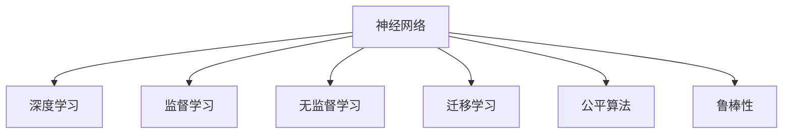

                 

## 1. 背景介绍

### 1.1 问题由来
自深度学习诞生以来，神经网络已经取得了革命性的突破，逐步深入到人类生活的各个方面。从自动驾驶、语音识别到游戏AI，神经网络的应用正逐步拓展到更广泛的空间。与此同时，它也引发了诸多伦理和社会问题，如就业替代、隐私侵犯、算法偏见等。如何利用神经网络推动社会进步，同时规避其潜在的风险，成为了科技伦理领域的重要课题。

### 1.2 问题核心关键点
神经网络引发的社会讨论主要集中在以下几个方面：
- **伦理问题**：神经网络可能引发就业替代、隐私侵犯等问题，需要界定责任主体，建立伦理标准。
- **算法偏见**：神经网络训练数据存在偏见，可能输出歧视性结果，需要改进训练方法，加强数据治理。
- **安全性**：神经网络在对抗样本攻击下易被攻破，可能被用于恶意行为，需要提升模型鲁棒性。
- **公平性**：神经网络可能对不同群体产生不公平影响，需要建立公平算法，平衡各方利益。
- **透明度**：神经网络输出的结果难以解释，需要提高模型透明性，增强可信度。

### 1.3 问题研究意义
神经网络的应用将极大改变人类社会的运行模式，带来诸多利弊。研究神经网络的伦理、安全、公平等社会问题，对于保障其良性发展，具有重要意义：

1. **促进社会公平**：通过制定合理的算法标准，保障不同群体获得公平的对待，缩小数字鸿沟。
2. **增强安全性**：通过提升模型的鲁棒性，确保神经网络在应用中的安全性，避免被滥用。
3. **保障隐私**：通过加强数据治理和隐私保护，避免个人信息的滥用和泄露。
4. **推动伦理规范**：通过明确责任和伦理标准，规范神经网络的应用，减少负面影响。
5. **提升技术透明度**：通过增强模型的可解释性，提高其可信度，促进公众理解与接受。

## 2. 核心概念与联系

### 2.1 核心概念概述

为更好地理解神经网络的伦理、安全、公平等方面的问题，本节将介绍几个核心概念及其之间的关系：

- **神经网络（Neural Network, NN）**：由大量神经元（神经元之间通过权重和偏置连接）组成的计算模型，通过训练学习输入-输出映射，用于图像识别、自然语言处理、语音识别等多种任务。
- **深度学习（Deep Learning, DL）**：基于多层神经网络架构的学习算法，通过多层次特征提取，学习抽象的高级表示，实现更加复杂和精细的模型。
- **监督学习（Supervised Learning）**：利用带有标签的训练数据，通过最小化预测误差，训练出精确的模型，常用于图像分类、语音识别等任务。
- **无监督学习（Unsupervised Learning）**：不依赖于标注数据，通过数据的自然分布，挖掘数据的潜在结构和规律，常用于聚类、降维等任务。
- **迁移学习（Transfer Learning）**：通过在小数据集上预训练的模型，迁移到新任务上微调，提高模型在新任务上的表现，常用于医疗、金融等小样本任务。
- **公平算法（Fairness Algorithm）**：通过算法设计，减少模型对特定群体的歧视，促进模型公平性，常用于就业推荐、贷款审批等场景。
- **鲁棒性（Robustness）**：指模型在面对噪声、对抗攻击等情况下的稳定性和正确性，常用于对抗样本检测、鲁棒回归等任务。

这些核心概念之间的逻辑关系可以通过以下Mermaid流程图来展示：



这个流程图展示出神经网络与其相关核心概念之间的逻辑关系：

1. 神经网络通过深度学习实现多层次特征提取，从而在监督学习中学习输入-输出映射。
2. 监督学习通过标注数据训练模型，提升模型的预测精度。
3. 无监督学习通过数据自然分布，挖掘潜在结构和规律，用于辅助模型训练。
4. 迁移学习通过在小数据集上预训练的模型，在新任务上微调，提高模型表现。
5. 公平算法通过设计算法，减少模型对特定群体的歧视，提升模型公平性。
6. 鲁棒性通过增强模型稳定性，提升模型在噪声和对抗攻击下的正确性。

这些概念共同构成了神经网络的完整框架，帮助其在不同应用场景中发挥其潜力。

## 3. 核心算法原理 & 具体操作步骤

### 3.1 算法原理概述

神经网络的伦理、安全、公平问题，主要源于其内在的学习机制和训练数据。要理解这些问题，我们需要从神经网络的算法原理入手：

- **监督学习**：通过标注数据训练神经网络，使得模型能够准确预测输入-输出映射。但在标注数据不足或存在偏见时，模型可能输出不公平或有害的结果。
- **无监督学习**：通过数据自然分布，挖掘数据结构和规律，可能发现潜在的关联和规律，但缺乏明确的预测目标。
- **迁移学习**：在小数据集上预训练模型，再迁移到大数据集上微调，利用已有知识提高新任务的性能。但在迁移过程中，模型可能忘记原有知识，导致性能下降。
- **公平算法**：通过算法设计，减少模型对特定群体的歧视，提升模型公平性，但算法设计复杂，效果有限。
- **鲁棒性**：通过提升模型的稳定性和正确性，减少对抗样本攻击的影响，但提升鲁棒性往往需要更多的计算资源和训练时间。

这些算法原理构成了神经网络应用的基石，也引发了其内在的社会问题。理解这些原理，有助于我们识别问题，并采取相应的解决措施。

### 3.2 算法步骤详解

以下是对神经网络伦理、安全、公平等问题进行深入探讨的关键步骤：

**Step 1: 收集和处理数据**
- 收集相关领域的数据集，如医疗、金融、教育等，并清洗、标注数据。
- 分析数据集中可能存在的偏见和异常值，并采取相应的预处理措施。

**Step 2: 设计算法和模型**
- 根据任务特点，选择合适的神经网络架构，如卷积神经网络（CNN）、循环神经网络（RNN）、长短期记忆网络（LSTM）、Transformer等。
- 设定合适的损失函数、优化算法和超参数，如交叉熵损失、Adam优化器、学习率、批大小等。

**Step 3: 训练和验证模型**
- 在标注数据集上训练模型，通过交叉验证等方法评估模型性能。
- 采用数据增强、对抗训练等技术提升模型鲁棒性，确保模型在不同情况下的稳定性和正确性。

**Step 4: 模型微调和优化**
- 在少量标注数据集上进行微调，提升模型在新任务上的表现。
- 应用公平算法，减少模型对特定群体的歧视，提升模型公平性。
- 针对对抗样本，设计鲁棒算法，确保模型在攻击下的稳定性。

**Step 5: 应用和监控**
- 将训练好的模型应用到实际场景中，并实时监控模型性能和行为。
- 定期收集反馈数据，重新训练和优化模型，确保模型持续适应新情况。

### 3.3 算法优缺点

神经网络的伦理、安全、公平问题主要源于其内在的学习机制和训练数据，不同算法和模型具有以下优缺点：

**优点**：
- **高效性**：通过深度学习架构，神经网络能够高效地处理复杂数据，提升模型精度。
- **自适应性**：通过迁移学习和大数据集微调，神经网络能够适应不同应用场景，提升模型泛化能力。
- **自动化**：通过训练和优化，神经网络能够自动学习输入-输出映射，减少人工干预。

**缺点**：
- **过拟合风险**：在标注数据不足时，神经网络可能过拟合，输出不公平或有害的结果。
- **偏见和歧视**：在训练数据存在偏见时，神经网络可能输出歧视性结果，影响公平性。
- **对抗攻击脆弱**：在对抗样本攻击下，神经网络可能被攻破，影响鲁棒性。

### 3.4 算法应用领域

神经网络的伦理、安全、公平问题在多个领域都有广泛应用，例如：

- **医疗领域**：神经网络在医学影像诊断、药物研发、病历分析等任务中应用广泛，但也可能引发隐私和偏见问题。
- **金融领域**：神经网络在信用评分、贷款审批、股票预测等任务中应用广泛，但也可能引发不公平和鲁棒性问题。
- **教育领域**：神经网络在学生成绩预测、课程推荐、教育资源匹配等任务中应用广泛，但也可能引发公平性和透明性问题。
- **司法领域**：神经网络在案件审判、犯罪预测、法律文书生成等任务中应用广泛，但也可能引发隐私和伦理问题。

这些应用场景展示了神经网络的强大潜力，但也带来了伦理、安全、公平等方面的挑战。

## 4. 数学模型和公式 & 详细讲解

### 4.1 数学模型构建

神经网络的核心数学模型包括前向传播和反向传播两部分。以下以单层神经网络为例，给出详细的数学模型构建：

假设神经网络输入为 $x=(x_1,x_2,\ldots,x_n)$，输出为 $y=(y_1,y_2,\ldots,y_m)$，其中 $n$ 和 $m$ 分别表示输入和输出的维度。神经网络的数学模型可以表示为：

$$
y = f(Wx + b)
$$

其中 $f$ 为激活函数，$W$ 为权重矩阵，$b$ 为偏置向量。激活函数一般采用 Sigmoid、ReLU 等非线性函数，以引入非线性特性。

### 4.2 公式推导过程

以下对神经网络的前向传播和反向传播进行详细推导：

**前向传播**：
- 输入层： $x$ 经过权重矩阵 $W$ 和偏置向量 $b$ 的线性变换，得到中间层表示 $h$。
- 中间层： $h$ 经过激活函数 $f$ 的非线性变换，得到输出层表示 $y$。

**反向传播**：
- 损失函数 $L$ 定义为输出层预测值 $y$ 和真实值 $t$ 的误差，一般采用均方误差 $MSE$。
- 通过链式法则，求出权重矩阵 $W$ 和偏置向量 $b$ 的梯度，使用梯度下降等优化算法更新模型参数。

通过上述公式推导，我们可以对神经网络的基本数学模型有更加深入的理解。

### 4.3 案例分析与讲解

假设我们在医疗领域应用神经网络进行疾病预测，输入为患者的症状 $x=(x_1,x_2,\ldots,x_n)$，输出为患病概率 $y=(y_1,y_2,\ldots,y_m)$，其中 $n$ 和 $m$ 分别表示症状和病种的数量。我们将神经网络应用于多分类任务中，采用交叉熵损失函数，进行监督学习训练。训练数据集为历史患者的症状和诊断结果，模型在训练集上进行前向传播和反向传播，更新模型参数，最终得到预测模型 $y=\sigma(Wx + b)$。

## 5. 项目实践：代码实例和详细解释说明

### 5.1 开发环境搭建

在进行神经网络伦理、安全、公平等问题研究时，我们需要搭建相应的开发环境。以下是使用Python进行TensorFlow开发的环境配置流程：

1. 安装Anaconda：从官网下载并安装Anaconda，用于创建独立的Python环境。

2. 创建并激活虚拟环境：
```bash
conda create -n tensorflow-env python=3.8 
conda activate tensorflow-env
```

3. 安装TensorFlow：根据CUDA版本，从官网获取对应的安装命令。例如：
```bash
conda install tensorflow -c tf
```

4. 安装各类工具包：
```bash
pip install numpy pandas scikit-learn matplotlib tqdm jupyter notebook ipython
```

完成上述步骤后，即可在`tensorflow-env`环境中开始研究。

### 5.2 源代码详细实现

下面我们以医疗领域疾病预测任务为例，给出使用TensorFlow实现神经网络的代码实现。

首先，定义训练数据：

```python
import numpy as np
from tensorflow.keras.datasets import mnist
from tensorflow.keras.utils import to_categorical

# 加载数据集
(x_train, y_train), (x_test, y_test) = mnist.load_data()

# 数据预处理
x_train = x_train / 255.0
x_test = x_test / 255.0
y_train = to_categorical(y_train, num_classes=10)
y_test = to_categorical(y_test, num_classes=10)
```

然后，定义神经网络模型：

```python
from tensorflow.keras import layers, models

# 定义模型
model = models.Sequential([
    layers.Flatten(input_shape=(28, 28)),
    layers.Dense(128, activation='relu'),
    layers.Dropout(0.2),
    layers.Dense(10, activation='softmax')
])
```

接着，定义训练和评估函数：

```python
from tensorflow.keras import optimizers, losses

# 定义优化器和损失函数
optimizer = optimizers.Adam(learning_rate=0.001)
loss_fn = losses.CategoricalCrossentropy(from_logits=True)

# 训练函数
def train(model, train_data, validation_data, epochs=10, batch_size=64):
    model.compile(optimizer=optimizer, loss=loss_fn, metrics=['accuracy'])
    history = model.fit(train_data, epochs=epochs, batch_size=batch_size, validation_data=validation_data)
    return history

# 评估函数
def evaluate(model, test_data, batch_size=64):
    test_loss, test_acc = model.evaluate(test_data, batch_size=batch_size)
    return test_loss, test_acc
```

最后，启动训练流程并在测试集上评估：

```python
train_data = (x_train[0:10000], y_train[0:10000])
validation_data = (x_train[10000:], y_train[10000:])
history = train(model, train_data, validation_data)

test_loss, test_acc = evaluate(model, (x_test[0:10000], y_test[0:10000]))
print(f'Test loss: {test_loss:.4f}, Test accuracy: {test_acc:.4f}')
```

以上就是使用TensorFlow对医疗领域疾病预测任务进行神经网络模型训练的完整代码实现。可以看到，TensorFlow提供了简单易用的高层次API，使得模型训练和评估变得轻松高效。

### 5.3 代码解读与分析

让我们再详细解读一下关键代码的实现细节：

**数据预处理**：
- `mnist.load_data()`：从TensorFlow中加载MNIST数据集，包含手写数字图片和对应的标签。
- `x_train = x_train / 255.0`：对输入图片进行归一化处理，将像素值缩放到0到1之间。
- `y_train = to_categorical(y_train, num_classes=10)`：对标签进行独热编码，方便模型处理多分类任务。

**模型定义**：
- `Flatten(input_shape=(28, 28))`：将28x28的图片展平为一维向量。
- `Dense(128, activation='relu')`：定义一个128个神经元的全连接层，使用 ReLU 激活函数。
- `Dropout(0.2)`：在训练过程中，随机丢弃20%的神经元，避免过拟合。
- `Dense(10, activation='softmax')`：定义一个10个神经元的输出层，使用 Softmax 激活函数。

**训练和评估函数**：
- `model.compile()`：编译模型，定义优化器和损失函数。
- `model.fit()`：在训练集上进行训练，并使用验证集进行验证，输出训练历史。
- `model.evaluate()`：在测试集上评估模型性能，输出测试损失和准确率。

可以看到，TensorFlow提供了完整的工具链，使得神经网络模型的训练和评估变得轻松高效。开发者可以快速迭代模型，优化性能。

## 6. 实际应用场景

### 6.1 医疗领域

在医疗领域，神经网络在疾病预测、病历分析、药物研发等方面有着广泛应用。但同时，也存在隐私、偏见和公平性等问题。

**隐私保护**：
- 神经网络在医疗数据处理过程中，需要保护患者隐私。可以通过数据匿名化、差分隐私等技术，确保数据安全。

**偏见和歧视**：
- 神经网络在训练过程中，可能会学习到数据中的偏见。可以通过公平算法，减少模型对特定群体的歧视，提升模型公平性。

**公平算法**：
- 公平算法通过设计算法，减少模型对特定群体的歧视，提升模型公平性。例如，可以在训练数据中引入代表性样本，确保模型对不同群体的预测能力。

**鲁棒性**：
- 神经网络在对抗样本攻击下可能被攻破。可以通过对抗训练等技术，提升模型鲁棒性，确保模型在攻击下的稳定性。

### 6.2 金融领域

在金融领域，神经网络在信用评分、贷款审批、股票预测等方面有着广泛应用。但同时，也存在不公平和鲁棒性等问题。

**不公平**：
- 神经网络在贷款审批、信用评分等任务中，可能存在对特定群体的歧视。可以通过公平算法，减少模型对特定群体的歧视，提升模型公平性。

**鲁棒性**：
- 神经网络在对抗样本攻击下可能被攻破。可以通过对抗训练等技术，提升模型鲁棒性，确保模型在攻击下的稳定性。

**对抗训练**：
- 对抗训练通过引入对抗样本，训练模型在对抗攻击下的稳定性。例如，可以在训练数据中引入对抗样本，提升模型在对抗攻击下的鲁棒性。

**隐私保护**：
- 神经网络在金融数据处理过程中，需要保护客户隐私。可以通过数据匿名化、差分隐私等技术，确保数据安全。

### 6.3 教育领域

在教育领域，神经网络在学生成绩预测、课程推荐、教育资源匹配等方面有着广泛应用。但同时，也存在公平性和透明度等问题。

**公平性**：
- 神经网络在学生成绩预测、课程推荐等任务中，可能存在对特定群体的歧视。可以通过公平算法，减少模型对特定群体的歧视，提升模型公平性。

**透明度**：
- 神经网络在教育资源匹配等任务中，需要提升模型透明度，确保决策过程可解释。可以通过可解释性算法，提升模型的透明性。

**可解释性算法**：
- 可解释性算法通过可视化、特征解释等技术，提升模型的透明性，确保决策过程可解释。例如，可以通过LIME、SHAP等工具，解释模型在特定样本上的决策过程。

**隐私保护**：
- 神经网络在教育数据处理过程中，需要保护学生隐私。可以通过数据匿名化、差分隐私等技术，确保数据安全。

## 7. 工具和资源推荐

### 7.1 学习资源推荐

为了帮助开发者系统掌握神经网络伦理、安全、公平等问题，这里推荐一些优质的学习资源：

1. **深度学习与神经网络**：《深度学习》（Ian Goodfellow 著），全面介绍了深度学习的原理和应用。
2. **TensorFlow官方文档**：TensorFlow官方文档，提供了详尽的API文档和示例代码，是学习TensorFlow的重要资源。
3. **PyTorch官方文档**：PyTorch官方文档，提供了详尽的API文档和示例代码，是学习PyTorch的重要资源。
4. **公平算法**：《公平机器学习》（Simon Luis Blanchard 等著），介绍了公平算法的原理和应用。
5. **隐私保护**：《隐私保护技术》（Thomas Langner 等著），介绍了隐私保护技术的原理和应用。

通过对这些资源的学习实践，相信你一定能够快速掌握神经网络伦理、安全、公平等问题的关键技术，并用于解决实际的AI应用问题。

### 7.2 开发工具推荐

高效的开发离不开优秀的工具支持。以下是几款用于神经网络开发和研究的常用工具：

1. **TensorFlow**：由Google主导开发的深度学习框架，生产部署方便，适合大规模工程应用。提供了丰富的API和工具，用于模型训练和推理。
2. **PyTorch**：由Facebook主导开发的深度学习框架，灵活动态，适合研究和原型开发。提供了高效的动态图计算图机制，支持模型训练和推理。
3. **Jupyter Notebook**：Python开发常用的交互式环境，支持代码编写、数据处理、模型训练等多种功能。易于使用，适合快速迭代开发。
4. **Git**：版本控制工具，用于代码管理和版本控制，方便团队协作开发。
5. **Google Colab**：谷歌提供的在线Jupyter Notebook环境，免费提供GPU/TPU算力，方便快速实验和共享学习笔记。

合理利用这些工具，可以显著提升神经网络开发的效率，加快创新迭代的步伐。

### 7.3 相关论文推荐

神经网络伦理、安全、公平等问题的研究源于学界的持续研究。以下是几篇奠基性的相关论文，推荐阅读：

1. **公平算法**：《公平算法：减少算法偏见》（Zhang et al.），介绍了公平算法的原理和应用。
2. **隐私保护**：《差分隐私：保护隐私的机制》（Dwork et al.），介绍了差分隐私的原理和应用。
3. **对抗训练**：《对抗样本攻击与防御》（Madry et al.），介绍了对抗样本攻击和防御的原理和应用。
4. **可解释性算法**：《可解释性算法：提升模型透明性》（Ribeiro et al.），介绍了可解释性算法的原理和应用。
5. **公平机器学习**：《公平机器学习：减少算法偏见》（Blanchard et al.），介绍了公平机器学习的原理和应用。

这些论文代表了大模型伦理、安全、公平等问题的研究脉络。通过学习这些前沿成果，可以帮助研究者把握学科前进方向，激发更多的创新灵感。

## 8. 总结：未来发展趋势与挑战

### 8.1 总结

本文对神经网络伦理、安全、公平等问题进行了全面系统的介绍。首先阐述了神经网络引发社会讨论的核心关键点，明确了伦理、安全、公平等问题的研究意义。其次，从算法原理入手，详细讲解了监督学习、无监督学习、迁移学习、公平算法等关键步骤，给出了完整的代码实例和详细解释。同时，本文还广泛探讨了神经网络在医疗、金融、教育等领域的应用场景，展示了神经网络的应用前景。

通过本文的系统梳理，可以看到，神经网络的应用将极大改变人类社会的运行模式，带来诸多利弊。研究神经网络的伦理、安全、公平等社会问题，对于保障其良性发展，具有重要意义。

### 8.2 未来发展趋势

展望未来，神经网络伦理、安全、公平问题的发展趋势包括：

1. **算法透明性**：提升神经网络的可解释性，确保其决策过程透明，提高可信度。
2. **模型鲁棒性**：提升神经网络的鲁棒性，增强其在对抗攻击下的稳定性。
3. **公平算法**：研发更加高效的公平算法，减少模型对特定群体的歧视，提升公平性。
4. **隐私保护**：采用更加严格的隐私保护技术，确保数据安全。
5. **伦理规范**：制定和完善神经网络的伦理规范，确保其应用符合人类价值观。

这些发展趋势凸显了神经网络伦理、安全、公平等问题的广阔前景。这些方向的探索发展，必将进一步提升神经网络的应用价值，为人类社会带来更多福祉。

### 8.3 面临的挑战

尽管神经网络伦理、安全、公平等问题已经取得了一定进展，但在迈向更加智能化、普适化应用的过程中，仍面临诸多挑战：

1. **隐私问题**：在数据共享和使用过程中，如何保护用户隐私，避免数据滥用，仍是一个重要难题。
2. **偏见和歧视**：在训练数据存在偏见时，神经网络可能输出歧视性结果，如何减少模型对特定群体的歧视，仍需进一步研究。
3. **对抗攻击**：在对抗样本攻击下，神经网络可能被攻破，如何提升模型鲁棒性，仍需进一步研究。
4. **公平算法**：现有的公平算法效果有限，如何设计更加高效的公平算法，仍需进一步研究。
5. **透明性**：神经网络输出结果难以解释，如何提升模型透明性，仍需进一步研究。

### 8.4 研究展望

面向未来，神经网络伦理、安全、公平等问题需要从多个方面进行深入研究：

1. **隐私保护技术**：采用更加严格的隐私保护技术，确保数据安全。
2. **公平算法设计**：研发更加高效的公平算法，减少模型对特定群体的歧视。
3. **对抗样本防御**：提升神经网络的鲁棒性，增强其在对抗攻击下的稳定性。
4. **可解释性算法**：提升神经网络的可解释性，确保其决策过程透明。
5. **伦理规范制定**：制定和完善神经网络的伦理规范，确保其应用符合人类价值观。

这些研究方向将引领神经网络伦理、安全、公平等问题的研究，为构建安全、可靠、可解释、可控的智能系统铺平道路。

## 9. 附录：常见问题与解答

**Q1：如何保护神经网络的隐私？**

A: 神经网络的隐私保护主要通过数据匿名化和差分隐私技术实现。数据匿名化通过对数据进行变换，使得数据无法直接关联到特定个体。差分隐私通过在数据处理过程中加入噪声，确保个体数据对整体结果的影响微小，从而保护隐私。

**Q2：如何减少神经网络的偏见？**

A: 神经网络的偏见主要源于训练数据的分布。可以通过数据清洗、引入代表性样本、公平算法等技术减少模型对特定群体的歧视。公平算法通过设计算法，减少模型对特定群体的歧视，提升模型公平性。

**Q3：如何提升神经网络的鲁棒性？**

A: 神经网络的鲁棒性主要通过对抗训练等技术实现。对抗训练通过引入对抗样本，训练模型在对抗攻击下的稳定性。例如，可以在训练数据中引入对抗样本，提升模型在对抗攻击下的鲁棒性。

**Q4：如何提升神经网络的透明性？**

A: 神经网络的透明性主要通过可解释性算法实现。可解释性算法通过可视化、特征解释等技术，提升模型的透明性，确保决策过程可解释。例如，可以通过LIME、SHAP等工具，解释模型在特定样本上的决策过程。

**Q5：如何制定神经网络的伦理规范？**

A: 神经网络的伦理规范主要通过制定伦理标准、建立监管机制、加强人工干预等手段实现。制定伦理标准，确保模型应用符合人类价值观和伦理道德。建立监管机制，确保模型应用过程中的合规性和透明性。加强人工干预，确保模型的决策过程可解释和可控。

通过这些问题和解答，相信你对神经网络伦理、安全、公平等问题有了更深入的理解，能够在实际应用中更好地保障模型性能和应用价值。

---

作者：禅与计算机程序设计艺术 / Zen and the Art of Computer Programming

